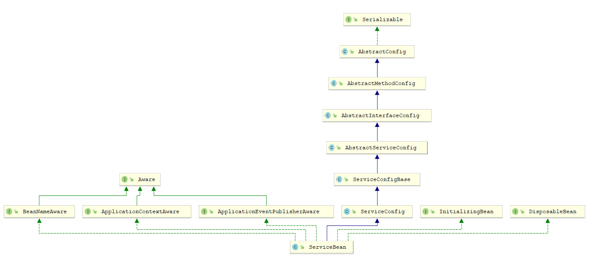
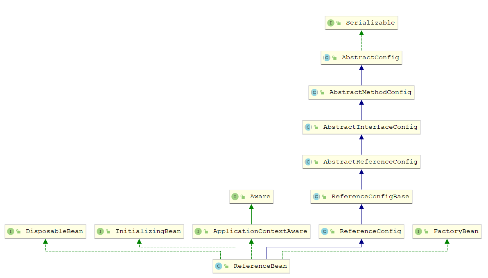

## RPC

RPC(Remote Procedure Call)即远程过程调用，允许一台计算机调用另一台计算机上的程序得到结果，而代码中不需要做额外的编程，就像在本地调用一样。

### 核心流程

1. 服务消费方（client）调用以本地调用方式调用服务；
2. client stub 接收到调用后负责将方法、参数等组装成能够进行网络传输的消息体；
3. client stub 找到服务地址，并将消息发送到服务端；
4. server stub 收到消息后进行解码；
5. server stub 根据解码结果调用本地的服务；
6. 本地服务执行并将结果返回给server stub；
7. server stub 将返回结果打包成消息并发送至消费方；
8. client stub 接收到消息，并进行解码；
9. 服务消费方得到最终结果。

RPC 的目标就是要2~8 这些步骤都封装起来，让用户对这些细节透明。JAVA 一般使用动态代理方式实现远程调用。


### RPC 接口设计

**RPC 接口可能出现的问题**

* **查询接口过多**：各种 findBy 方法，加上各自的重载，最后导致新增一个查询条件就同时新增一个方法的尴尬情景，而且可能导致某些新增的方法实际已经出现过，造成代码重复
* **难以扩展**：接口的任何改动，比如新增一个入参，都会导致调用者被迫升级，这也通常是 RPC 设计被诟病的一点，不合理的 RPC 接口设计会放大这个缺点
* **升级困难**：RPC的 api 一旦发生变化，调用者也得被迫升级，牵一发而动全身
* **难以测试**：接口一多，职责随之变得繁杂，业务场景各异，测试用例难以维护
* **异常设计不合理**：异常捕获后应该结果封装到Response返回给调用者，还是定义接口时通过Java异常体系try-catch；必须统一规范

**RPC 接口设计原则**

* **单参数接口**

  通过参数整合解决查询接口过多的问题；

  单参数易于做统一管理

  单参数入参兼容性强

* **接口异常设计**

  在定义接口时增加异常，而不是将异常封装

  RPC 调用失败可以通过异常类型判断是否需要触发熔断

* **API 版本单独演进**

  对外开放的服务，极大的概率会发生变化。业务变化可能修改 API 参数或响应数据结构，新老接口的兼容是必须要考虑的，因此会存在版本过多的问题。

  

## Dubbo

Apache Dubbo 是一款高性能、轻量级的开源Java RPC框架，它提供了三大核心能力：

- **面向接口的远程方法调用**：就像调用本地方法一样调用远程方法，只需简单配置，没有任何API侵入
- **智能容错和负载均衡**：可在内网替代F5等硬件负载均衡器，降低成本，减少单点
- **服务自动注册和发现**：不再需要写死服务提供方地址，注册中心基于接口名查询服务提供者的IP地址，并且能够平滑添加或删除服务提供者

### **Dubbo 架构图**


- **Provider**： 暴露服务的服务提供方
- **Consumer**： 调用远程服务的服务消费方
- **Registry**： 服务注册与发现的注册中心
- **Monitor**： 统计服务的调用次数和调用时间的监控中心
- **Container**： 服务运行容器

### **Dubbo 分层模型**


Dubbo框架设计一共划分了10个层 

1. 服务接口层（Service）：该层是与实际业务逻辑相关的，根据服务提供方和服务消费方的业务设计对应的接口和实现。
2. 配置层（Config）：对外配置接口，以ServiceConfig和ReferenceConfig为中心，可以直接new配置类，也可以通过spring解析配置生成配置类。
3. 服务代理层（Proxy）：服务接口透明代理，生成服务的客户端Stub和服务器端Skeleton，以ServiceProxy为中心，扩展接口为ProxyFactory。
4. 服务注册层（Registry）：封装服务地址的注册与发现，以服务URL为中心，扩展接口为RegistryFactory、Registry和RegistryService。可能没有服务注册中心，此时服务提供方直接暴露服务。
5. 集群层（Cluster）：封装多个提供者的路由及负载均衡，并桥接注册中心，以Invoker为中心，扩展接口为Cluster、Directory、Router和LoadBalance。将多个服务提供方组合为一个服务提供方，实现对服务消费方来透明，只需要与一个服务提供方进行交互。
6. 监控层（Monitor）：RPC调用次数和调用时间监控，以Statistics为中心，扩展接口为MonitorFactory、Monitor和MonitorService。
7. 远程调用层（Protocol）：封将RPC调用，以Invocation和Result为中心，扩展接口为Protocol、Invoker和Exporter。Protocol是服务域，它是Invoker暴露和引用的主功能入口，它负责Invoker的生命周期管理。Invoker是实体域，它是Dubbo的核心模型，其它模型都向它靠扰，或转换成它，它代表一个可执行体，可向它发起invoke调用，它有可能是一个本地的实现，也可能是一个远程的实现，也可能一个集群实现。
8. 信息交换层（Exchange）：封装请求响应模式，同步转异步，以Request和Response为中心，扩展接口为Exchanger、ExchangeChannel、ExchangeClient和ExchangeServer。
9. 网络传输层（Transport）：抽象mina和netty为统一接口，以Message为中心，扩展接口为Channel、Transporter、Client、Server和Codec。
10. 数据序列化层（Serialize）：可复用的一些工具，扩展接口为Serialization、 ObjectInput、ObjectOutput和ThreadPool。

## Dubbo 源码解析

**启动代码**

~~~xml
<?xml version="1.0" encoding="UTF-8"?>
<beans xmlns="http://www.springframework.org/schema/beans"
       xmlns:xsi="http://www.w3.org/2001/XMLSchema-instance"
       xmlns:dubbo="http://dubbo.apache.org/schema/dubbo"
       xsi:schemaLocation="http://www.springframework.org/schema/beans        http://www.springframework.org/schema/beans/spring-beans-4.3.xsd        http://dubbo.apache.org/schema/dubbo        http://dubbo.apache.org/schema/dubbo/dubbo.xsd">

    <!-- 提供方应用信息，用于计算依赖关系 -->
    <dubbo:application name="hello-world-app"  />

    <!-- 使用multicast广播注册中心暴露服务地址 -->
    <dubbo:registry protocol="zookeeper" 
        address="192.168.7.101:2181,192.168.7.102:2181,192.168.7.103:2181" client="curator"/>

    <!-- 用dubbo协议在20880端口暴露服务 -->
    <dubbo:protocol name="dubbo" port="20880" />

    <!-- 声明需要暴露的服务接口 -->
    <dubbo:service interface="com.qinfengsa.dubbo.api.HelloService" ref="helloService" retries="3"/>

    <dubbo:service interface="com.qinfengsa.dubbo.api.SayService" ref="sayService" retries="3"/>
    <!-- 和本地bean一样实现服务 -->
    <bean id="helloService" class="com.qinfengsa.dubbo.service.HelloServiceImpl" />

    <bean id="sayService" class="com.qinfengsa.dubbo.service.SayServiceImpl" />
</beans>
~~~

dubbo内部引用了Spring，通过Spring启动dubbo服务

~~~java
public class Provider { 
    public static void main(String[] args) throws IOException {
        ClassPathXmlApplicationContext context =
                new ClassPathXmlApplicationContext("spring/dubbo-provider.xml");
        context.start();
        System.in.read();
    }
}
~~~


**SpringBoot 启动**

引入dubbo-spring-boot-starter

~~~xml
<dependency>
    <groupId>org.apache.dubbo</groupId>
    <artifactId>dubbo-spring-boot-starter</artifactId>
    <version>2.7.5</version>
</dependency>
~~~

配置application.properties

~~~properties
dubbo.application.name=dubbo-spring-boot-starter
dubbo.registry.protocol=zookeeper
dubbo.registry.address=192.168.7.101:2181,192.168.7.102:2181,192.168.7.103:2181
dubbo.registry.cluster=curator
dubbo.protocol.name=dubbo
dubbo.protocol.port=20881
dubbo.scan.base-packages= com.qinfengsa.dubbo.service
~~~


需要注册的服务添加dubbo服务注解：org.apache.dubbo.config.annotation.Service

~~~java
@SpringBootApplication(scanBasePackages = "com.qinfengsa.dubbo.service" )
public class DubboMainApplication {

    public static void main(String[] args) {
        ApplicationContext context = SpringApplication.run(DubboMainApplication.class, args);
    }
}
~~~


## Dubbo SPI

SPI 全称为 Service Provider Interface，是一种服务发现机制。SPI 的本质是将接口实现类的全限定名配置在文件中，并由服务加载器读取配置文件，加载实现类。这样可以在运行时，动态为接口替换实现类。正因此特性，我们可以很容易的通过 SPI 机制为我们的程序提供拓展功能。一个好的开源框架，必须要留一些拓展点。让参与者尽量黑盒拓展，而不是白盒修改代码，否则分支，质量，合并，冲突都会很难管理。并且框架作者能做到的功能，拓展者也一定能做到。

**代码示例**

~~~java
public void DubboSPITest () throws Exception {
    ExtensionLoader<Robot> extensionLoader = ExtensionLoader.getExtensionLoader(Robot.class);
    // 获取到两个实例
    Robot optimusPrime = extensionLoader.getExtension("optimusPrime");
    optimusPrime.sayHello();
    Robot bumblebee = extensionLoader.getExtension("bumblebee");
    bumblebee.sayHello();
}
~~~

### 获取ExtensionLoader

~~~java
// ExtensionLoader 缓存, class -> ExtensionLoader, 不同的接口class对应不同的ExtensionLoader
private static final ConcurrentMap<Class<?>, ExtensionLoader<?>> EXTENSION_LOADERS 
    = new ConcurrentHashMap<>();
public static <T> ExtensionLoader<T> getExtensionLoader(Class<T> type) {
    // 判断 type
    if (type == null) {
        throw new IllegalArgumentException("Extension type == null");
    }
    // 判断 type 是不是接口
    if (!type.isInterface()) {
        throw new IllegalArgumentException("Extension type (" + type + ") is not an interface!");
    }
    // 判断 type 有没有 @SPI 注解
    if (!withExtensionAnnotation(type)) {
        throw new IllegalArgumentException( );
    }
    // 先去缓存中找是否存在当前 type 的 ExtensionLoader
    ExtensionLoader<T> loader = (ExtensionLoader<T>) EXTENSION_LOADERS.get(type);
    if (loader == null) {
        // 如果不存在,加入缓存,不需要每次都创建新的ExtensionLoader
        EXTENSION_LOADERS.putIfAbsent(type, new ExtensionLoader<T>(type));
        loader = (ExtensionLoader<T>) EXTENSION_LOADERS.get(type);
    }
    return loader;
}
~~~


#### ExtensionLoader

~~~java
public class ExtensionLoader<T> {
    // SPI 配置文件目录
    private static final String SERVICES_DIRECTORY = "META-INF/services/"; 
    private static final String DUBBO_DIRECTORY = "META-INF/dubbo/";
    private static final String DUBBO_INTERNAL_DIRECTORY = DUBBO_DIRECTORY + "internal/";
    // ExtensionLoader 缓存
    private static final ConcurrentMap<Class<?>, ExtensionLoader<?>> EXTENSION_LOADERS 
        = new ConcurrentHashMap<>();
    // 扩展实例缓存
    private static final ConcurrentMap<Class<?>, Object> EXTENSION_INSTANCES = new ConcurrentHashMap<>();
    // 扩展的接口
    private final Class<?> type;
    // 配置文件中所有扩展的Class
    private final Holder<Map<String, Class<?>>> cachedClasses = new Holder<>();
    // Holder缓存,相当于IOC,Dubbo把对象实例封装在Holder类中
    private final ConcurrentMap<String, Holder<Object>> cachedInstances = new ConcurrentHashMap<>();
    // SPI扩展 工厂类
    private final ExtensionFactory objectFactory;
    // 默认名称
    private String cachedDefaultName;
    // 构造方法,private 只能内部调用
    private ExtensionLoader(Class<?> type) {
        this.type = type;
        objectFactory = (type == ExtensionFactory.class ? null : ExtensionLoader
                         .getExtensionLoader(ExtensionFactory.class).getAdaptiveExtension());
    }
}
~~~

### getExtension

根据name（key）获取接口的具体实例对象

~~~java
public T getExtension(String name) {
    if (StringUtils.isEmpty(name)) {
        throw new IllegalArgumentException("Extension name == null");
    }
    if ("true".equals(name)) {
        // 获取默认的拓展实现类
        return getDefaultExtension();
    }
    // 把对象实例封装到
    // 通过 Holder 封装对象,先从缓存中获取
    final Holder<Object> holder = getOrCreateHolder(name);
    Object instance = holder.get();
    // 双重检查锁，保证单例
    if (instance == null) {
        synchronized (holder) {
            instance = holder.get();
            if (instance == null) {
                // 创建实例
                instance = createExtension(name);
                holder.set(instance);
            }
        }
    }
    return (T) instance;
}

private Holder<Object> getOrCreateHolder(String name) {
    // 从缓存中取key = name 的 Holder
    Holder<Object> holder = cachedInstances.get(name);
    // 如果不存在创建一个 new Holder<>()
    if (holder == null) {
        cachedInstances.putIfAbsent(name, new Holder<>());
        holder = cachedInstances.get(name);
    }
    return holder;
}
~~~

#### createExtension

创建Holder内需要存放的实例
1. 通过 getExtensionClasses 获取所有的拓展类
2. 通过反射创建拓展对象
3. 向拓展对象中注入依赖
4. 将拓展对象包裹在相应的 Wrapper 对象中

~~~java
private T createExtension(String name) {
    // 获取扩展类
    Class<?> clazz = getExtensionClasses().get(name);
    if (clazz == null) {
        throw findException(name);
    }
    try {
        // 判断是否已经创建实例
        T instance = (T) EXTENSION_INSTANCES.get(clazz);
        if (instance == null) {
            // 反射创建实例
            EXTENSION_INSTANCES.putIfAbsent(clazz, clazz.newInstance());
            instance = (T) EXTENSION_INSTANCES.get(clazz);
        }
        // 向实例中注入依赖
        injectExtension(instance);
        // 如果存在 Wrapper 类（例如 MockClusterWrapper）, Wrapper 类存在构造方法可以封装 当前接口
        Set<Class<?>> wrapperClasses = cachedWrapperClasses;
        if (CollectionUtils.isNotEmpty(wrapperClasses)) {
            for (Class<?> wrapperClass : wrapperClasses) {
                // 调用封装的构造方法
                instance = injectExtension((T) wrapperClass.getConstructor(type).newInstance(instance));
            }
        }
        // 初始化
        initExtension(instance);
        return instance;
    } // catch ...  
}
~~~

##### 获取扩展class

~~~java
private Map<String, Class<?>> getExtensionClasses() {
    // 先去缓存中找是否已加载
    Map<String, Class<?>> classes = cachedClasses.get();
    // 双重检查锁,保证单例
    if (classes == null) {
        synchronized (cachedClasses) {
            classes = cachedClasses.get();
            if (classes == null) {
                // 加载拓展类
                classes = loadExtensionClasses();
                cachedClasses.set(classes);
            }
        }
    }
    return classes;
}
 
private Map<String, Class<?>> loadExtensionClasses() {
    // 获取当前 type 的默认的扩展
    cacheDefaultExtensionName();

    Map<String, Class<?>> extensionClasses = new HashMap<>(); 
    // 加载SPI 配置文件夹下的配置文件
    // 路径+接口名称 作为 文件名
    loadDirectory(extensionClasses, DUBBO_INTERNAL_DIRECTORY, type.getName(), true);
    loadDirectory(extensionClasses, DUBBO_INTERNAL_DIRECTORY, type.getName()
                  .replace("org.apache", "com.alibaba"), true);

    loadDirectory(extensionClasses, DUBBO_DIRECTORY, type.getName());
    loadDirectory(extensionClasses, DUBBO_DIRECTORY, type.getName().replace("org.apache", "com.alibaba"));
    loadDirectory(extensionClasses, SERVICES_DIRECTORY, type.getName());
    loadDirectory(extensionClasses, SERVICES_DIRECTORY, type.getName().replace("org.apache", "com.alibaba"));
    return extensionClasses;
} 
// 默认扩展
private void cacheDefaultExtensionName() {
     // 获取 SPI 注解, type 变量 在调用 getExtensionLoader 方法时传入 
     final SPI defaultAnnotation = type.getAnnotation(SPI.class); 
     if (defaultAnnotation != null) {
         // 获取 @SPI 注解的 value
         String value = defaultAnnotation.value();
         if ((value = value.trim()).length() > 0) {
             String[] names = NAME_SEPARATOR.split(value);
             if (names.length > 1) {
                 throw new IllegalStateException( );
             }
             // 设置默认名称 getDefaultExtension获取默认扩展需要使用
             if (names.length == 1) {
                 cachedDefaultName = names[0];
             }
         }
     }
 }
~~~

##### 依赖注入

~~~java
private T injectExtension(T instance) {
    try {
        if (objectFactory != null) {
            // 遍历目标类的所有方法
            for (Method method : instance.getClass().getMethods()) {
                // 判断是set方法，且只有一个参数
                if (isSetter(method)) { 
                    // 判断是否有 @DisableInject注解，可以禁用依赖注入
                    if (method.getAnnotation(DisableInject.class) != null) {
                        continue;
                    }
                    // 获取 setter 方法参数类型
                    Class<?> pt = method.getParameterTypes()[0];
                    if (ReflectUtils.isPrimitives(pt)) {
                        continue;
                    }
                    try {
                        // 获取set方法的属性名，比如 setName 方法对应属性名 name
                        String property = getSetterProperty(method);
                        // 从 ObjectFactory 中获取依赖对象
                        Object object = objectFactory.getExtension(pt, property);
                        if (object != null) {
                            // 通过反射调用 setter 方法设置依赖
                            method.invoke(instance, object);
                        }
                    } // catch ...  
                }
            }
        }
    } // catch ...  
    return instance;
}
~~~

## 自适应扩展机制

在 Dubbo 中，很多拓展都是通过 SPI 机制进行加载的，比如 Protocol、Cluster、LoadBalance 等。有时会存在这种情况，一个接口存在多个SPI扩展，我们希望运行时通过参数动态加载需要的类，而不是全部加载。这是我们需要一个Adaptive类(自适应扩展类)，由这个类帮我们做动态选择，最简单的方式就是我们自己写一个class，然后添加@Adaptive注解，Dubbo会把这个class作为Adaptive类。

自适应拓展注解 @Adaptive

~~~java
@Documented
@Retention(RetentionPolicy.RUNTIME)
@Target({ElementType.TYPE, ElementType.METHOD})
public @interface Adaptive {
    String[] value() default {};
}
~~~

AdaptiveCompiler类会根据配置的参数，替我们选择对应的Compiler，完成compile的功能

~~~java
@Adaptive
public class AdaptiveCompiler implements Compiler {
	// DEFAULT_COMPILER 参数, 可以进行修改
    private static volatile String DEFAULT_COMPILER;

    public static void setDefaultCompiler(String compiler) {
        DEFAULT_COMPILER = compiler;
    } 
    @Override
    public Class<?> compile(String code, ClassLoader classLoader) {
        Compiler compiler;
        ExtensionLoader<Compiler> loader = ExtensionLoader.getExtensionLoader(Compiler.class);
        String name = DEFAULT_COMPILER; // copy reference
        // 根据DEFAULT_COMPILER进行判断,获取对应的扩展
        if (name != null && name.length() > 0) {
            compiler = loader.getExtension(name);
        } else {
            compiler = loader.getDefaultExtension();
        }
        // 然后 委派给获取到的扩展完成对应的功能
        return compiler.compile(code, classLoader);
    } 
}
~~~


### 获取自适应拓展

~~~java
public T getAdaptiveExtension() {
    // 先从缓存中取
    Object instance = cachedAdaptiveInstance.get();
    if (instance == null) {
        if (createAdaptiveInstanceError != null) {
            throw new IllegalStateException();
        }
        // 双重检查锁
        synchronized (cachedAdaptiveInstance) {
            instance = cachedAdaptiveInstance.get();
            if (instance == null) {
                try {
                    // 创建自适应拓展
                    instance = createAdaptiveExtension();
                    // 把自适应拓展放入缓存
                    cachedAdaptiveInstance.set(instance);
                } catch (Throwable t) {
                    createAdaptiveInstanceError = t;
                    throw new IllegalStateException();
                }
            }
        }
    }

    return (T) instance;
}
// 创建自适应拓展
@SuppressWarnings("unchecked")
private T createAdaptiveExtension() {
    try {
        // 先获取自适应拓展的 Class
        return injectExtension((T) getAdaptiveExtensionClass().newInstance());
    } // catch ...
}

private Class<?> getAdaptiveExtensionClass() {
    // 通过 SPI 获取所有的拓展类
    getExtensionClasses();
    // 检查缓存,若缓存不为空,则直接返回缓存
    if (cachedAdaptiveClass != null) {
        return cachedAdaptiveClass;
    }
    // 创建自适应拓展类
    return cachedAdaptiveClass = createAdaptiveExtensionClass();
}

// 创建自适应拓展类，通过字节码生成 
private Class<?> createAdaptiveExtensionClass() {
    // 构建自适应拓展代码
    String code = new AdaptiveClassCodeGenerator(type, cachedDefaultName).generate();
    ClassLoader classLoader = findClassLoader();
    // 获取编译器实现类
    org.apache.dubbo.common.compiler.Compiler compiler = ExtensionLoader
        .getExtensionLoader(org.apache.dubbo.common.compiler.Compiler.class).getAdaptiveExtension();
    // 编译代码,生成 Class
    return compiler.compile(code, classLoader);
}
~~~

### 自适应拓展类代码生成

除了AdaptiveCompiler和AdaptiveExtensionFactory，我们在dubbo源码中发现没有其他的class带有@Adaptive，那其他的自适应扩展是怎么实现的呢？

我们以官方的例子来尝试写一个Adaptive类

~~~java
@SPI("optimusPrime")
public interface Robot { 
    void sayHello(URL url);
}
@Slf4j
public class OptimusPrime implements Robot { 
    @Override
    public void sayHello(URL url) {
        log.debug("Hello, I am Optimus Prime.");
    }
}
@Slf4j
public class Bumblebee implements Robot {

    @Override
    public void sayHello(URL url) {
        log.debug("Hello, I am Bumblebee.");
    }
} 
~~~

**SPI配置**

我们可以通过optimusPrime的别名找到对应的类OptimusPrime

~~~properties
optimusPrime = com.test.dubbo.spi.OptimusPrime
bumblebee = com.test.dubbo.spi.Bumblebee
~~~

**Adaptive**

~~~java
public class AdaptiveRobot implements  Robot {
    @Override
    public void sayHello(URL url) {
        if (url == null) {
            throw new IllegalArgumentException("url == null");
        } 
        // 1.从 URL 中获取 rebot 参数名称
        String rebotName = url.getParameter("rebot");
        if (rebotName == null) {
            throw new IllegalArgumentException("rebot == null");
        } 
        // 2.通过 SPI 加载具体的 Robot
        Robot robot = ExtensionLoader
                .getExtensionLoader(Robot.class).getExtension(rebotName); 
        // 3.调用目标方法
        robot.sayHello(url);
    }
}
~~~

Dubbo是URL驱动的，所有的参数都存放在URL中，只要我们能获取到URL中我们需要的参数，就可以通过这个参数获取对应的扩展类实例，然后由这个实例调用具体的方法，这样就完成了选择的过程。

但是，Dubbo存在相当多的扩展接口，按照上面的做法，那么每个扩展接口都需要写一个对应的class，如果我们多写几个Adaptive类，会发现好像存在相似性格，例如：扩展接口XXClass和扩展方法XXMethod

~~~java
public class AdaptiveXX implements XXClass {
    @Override
    public void XXMethod(URL url) {
        if (url == null) {
            throw new IllegalArgumentException("url == null");
        } 
        // 1.从 URL 中获取 xx 参数名称(参数名称通过 @Adaptive("xx") 设置)
        String xxName = url.getParameter("xx");
        if (xxName == null) {
            throw new IllegalArgumentException("xx == null");
        } 
        // 2.通过 SPI 加载具体的 xx
        XXClass xx = ExtensionLoader
                .getExtensionLoader(XXClass.class).getExtension(xxName); 
        // 3.调用目标方法
        xx.XXMethod(url);
    }
}
~~~

我们发现，这个扩展是可以共用一套模板，只需要替换一部分内容即可，于是我们可以引入类工具，动态的帮我们生成class，而不需要我们手写，只需要设好模板，一劳永逸

~~~java
public class AdaptiveClassCodeGenerator {
    // package 代码模版
    private static final String CODE_PACKAGE = "package %s;\n";
    // import 代码模版
    private static final String CODE_IMPORTS = "import %s;\n";
    // 类代码模版
    private static final String CODE_CLASS_DECLARATION = "public class %s$Adaptive implements %s {\n";
    // 构造方法
    public AdaptiveClassCodeGenerator(Class<?> type, String defaultExtName) {
        this.type = type; // 接口类
        this.defaultExtName = defaultExtName; // 默认名称
    }
    // 套用模板,生成类代码
    public String generate() {
        // 判断 是否方法有@Adaptive注解
        if (!hasAdaptiveMethod()) {
            throw new IllegalStateException();
        }
		// code 代码，通过StringBuilder存储
        StringBuilder code = new StringBuilder();
        // 生成 package代码
        code.append(generatePackageInfo());      
        // 生成 import代码
        code.append(generateImports());		
        // 生成 类代码
        code.append(generateClassDeclaration()); 
        // 方法代码,最核心的代码
        Method[] methods = type.getMethods();
        for (Method method : methods) {
            code.append(generateMethod(method));
        }
        code.append("}");
         
        return code.toString();
    }
}
~~~

## DubboNamespaceHandler

Spring 解析扩展元素解析BeanDefinition时，会解析到dubbo相关的标签，DubboNamespaceHandler就是基于Spring实现命名空间处理的扩展 

~~~java
public class DubboNamespaceHandler extends NamespaceHandlerSupport 
    implements ConfigurableSourceBeanMetadataElement { 

    @Override
    public void init() {
        registerBeanDefinitionParser("application", 
           	new DubboBeanDefinitionParser(ApplicationConfig.class, true));
        registerBeanDefinitionParser("module", new DubboBeanDefinitionParser(ModuleConfig.class, true));
        // 注册中心
        registerBeanDefinitionParser("registry", new DubboBeanDefinitionParser(RegistryConfig.class, true));
        // 配置中心
        registerBeanDefinitionParser("config-center", 
            new DubboBeanDefinitionParser(ConfigCenterBean.class, true));
        // 元数据中心
        registerBeanDefinitionParser("metadata-report", 
            new DubboBeanDefinitionParser(MetadataReportConfig.class, true));
        // 协议
        registerBeanDefinitionParser("monitor", new DubboBeanDefinitionParser(MonitorConfig.class, true));
        registerBeanDefinitionParser("metrics", new DubboBeanDefinitionParser(MetricsConfig.class, true));
        registerBeanDefinitionParser("ssl", new DubboBeanDefinitionParser(SslConfig.class, true));
        // <dubbo:provider>标签
        registerBeanDefinitionParser("provider", new DubboBeanDefinitionParser(ProviderConfig.class, true));
        // <dubbo:consumer>标签
        registerBeanDefinitionParser("consumer", new DubboBeanDefinitionParser(ConsumerConfig.class, true));
        registerBeanDefinitionParser("protocol", new DubboBeanDefinitionParser(ProtocolConfig.class, true));
        // <dubbo:service>标签  服务端声明需要暴露的服务接口  
        registerBeanDefinitionParser("service", new DubboBeanDefinitionParser(ServiceBean.class, true));
        // <dubbo:reference>标签 客户端声明需要调用的接口  
        registerBeanDefinitionParser("reference", new DubboBeanDefinitionParser(ReferenceBean.class, false));
        // dubbo 注解驱动
        registerBeanDefinitionParser("annotation", new AnnotationBeanDefinitionParser());
    }
    
    // 2.7.5 新增代码, 把 监听器 从ServiceBean等bean中分离出去
    // DubboNamespaceHandler 还重写了parse方法,Spring在执行完init()方法会执行该方法
    @Override
    public BeanDefinition parse(Element element, ParserContext parserContext) {
        BeanDefinitionRegistry registry = parserContext.getRegistry();
        registerAnnotationConfigProcessors(registry);
        // 注册监听器
        registerApplicationListeners(registry);
        BeanDefinition beanDefinition = super.parse(element, parserContext);
        setSource(beanDefinition);
        return beanDefinition;
    }
 	// 注册两个Application监听器
    private void registerApplicationListeners(BeanDefinitionRegistry registry) {
        registerBeans(registry, DubboLifecycleComponentApplicationListener.class);
        registerBeans(registry, DubboBootstrapApplicationListener.class);
    }

    // 这个方法很明显: 启用Spring的注解驱动
    private void registerAnnotationConfigProcessors(BeanDefinitionRegistry registry) {
        AnnotationConfigUtils.registerAnnotationConfigProcessors(registry);
    }
}
~~~


DubboBeanDefinitionParser继承了BeanDefinitionParser，在Spring解析XML元素时会调用相应的parse方法

~~~java
public class DubboBeanDefinitionParser implements BeanDefinitionParser {
	@Override
    public BeanDefinition parse(Element element, ParserContext parserContext) {
        // Register DubboConfigAliasPostProcessor
        registerDubboConfigAliasPostProcessor(parserContext.getRegistry());

        return parse(element, parserContext, beanClass, required);
    }
    
}
~~~

### ApplicationListener

在2.7.5版本之前，服务发布ServiceBean同时实现了ApplicationListener接口，功能耦合，在2.7.5新增了DubboBootstrapApplicationListener监听容器 refresh 事件，把ServiceBean的监听功能移出去

~~~java
public class DubboBootstrapApplicationListener extends OneTimeExecutionApplicationContextEventListener
        implements Ordered {

    private final DubboBootstrap dubboBootstrap;

    public DubboBootstrapApplicationListener() {
        this.dubboBootstrap = DubboBootstrap.getInstance();
    }
	// 触发事件
    @Override
    public void onApplicationContextEvent(ApplicationContextEvent event) {
        if (event instanceof ContextRefreshedEvent) {
            // 容器 refresh 事件
            onContextRefreshedEvent((ContextRefreshedEvent) event);
        } else if (event instanceof ContextClosedEvent) {
            onContextClosedEvent((ContextClosedEvent) event);
        } 
    }
	
    private void onContextRefreshedEvent(ContextRefreshedEvent event) {
        // 启动 dubboBootstrap
        dubboBootstrap.start();
    }

    private void onContextClosedEvent(ContextClosedEvent event) {
        dubboBootstrap.stop();
    }

    @Override
    public int getOrder() {
        return LOWEST_PRECEDENCE;
    }
} 
~~~

### DubboBootstrap

Dubbo 2.7.5新增的引导类，Spring上下文refresh之后通过事件机制触发启动

~~~java
public class DubboBootstrap extends GenericEventListener {	
	public DubboBootstrap start() {
        if (started.compareAndSet(false, true)) {
            // 初始化
            initialize(); 
            // 发布 dubbo 服务
            exportServices();

            // Not only provider register
            if (!isOnlyRegisterProvider() || hasExportedServices()) {
                // 发布 MetadataService
                exportMetadataService();
                // 本地服务注册
                registerServiceInstance();
            }
			// 服务查询
            referServices(); 
        }
        return this;
    }
}
~~~

#### 初始化

~~~java
private void initialize() {
    if (!initialized.compareAndSet(false, true)) {
        return;
    }
    // 通过SPI扩展获取FrameworkExt接口的实现
    // ConfigManager Environment ServiceRepository
    ApplicationModel.iniFrameworkExts();
	// 启动配置中心
    startConfigCenter();
    // 使用注册中心替代配置中心
    useRegistryAsConfigCenterIfNecessary();
	// 启动元数据中心
    startMetadataReport();
	// 加载远程配置,向configManager添加缓存,RegistryConfig和ProtocolConfig
    loadRemoteConfigs();
	// 检查全局配置
    checkGlobalConfigs();
    // 初始化 元数据服务
    initMetadataService();
    // 初始化 元数据服务的 发布器（Exporter）
    initMetadataServiceExporter();
    // 添加 事件监听器
    initEventListener(); 
} 
~~~


## 服务发布

~~~java
registerBeanDefinitionParser("service", new DubboBeanDefinitionParser(ServiceBean.class, true));
~~~

在XML解析阶段，Spring会将\<dubbo:service>标签转换成BeanClass=ServiceBean的BeanDefinition，Dubbo通过机制将实例加入ConfigManager的缓存中



~~~java
public class DubboBootstrap extends GenericEventListener {
    private void exportServices() {
        // ConfigManager的缓存,缓存了所有的Config实例
        // getServices最终调用getConfigs(),获取所有ServiceConfigBase的实例 
        // 遍历ServiceBean
        configManager.getServices().forEach(sc -> { 
            ServiceConfig serviceConfig = (ServiceConfig) sc;
            serviceConfig.setBootstrap(this);
            // 是否支持异步操作,最终都调用ServiceConfig(ServiceBean的父类)的export()
            if (exportAsync) {
                ExecutorService executor = executorRepository.getServiceExporterExecutor();
                Future<?> future = executor.submit(() -> {
                    sc.export();
                });
                asyncExportingFutures.add(future);
            } else {
                sc.export();
                exportedServices.add(sc);
            }
        });
    }
}
~~~

### ConfigManager

~~~java
public class ConfigManager extends LifecycleAdapter implements FrameworkExt {
    // 记录所有的config实例的缓存
	private final Map<String, Map<String, AbstractConfig>> configsCache = newMap();

    // 缓存添加方法
    public void addConfig(AbstractConfig config) {
        addConfig(config, false);
    } 
    protected void addConfig(AbstractConfig config, boolean unique) {
        if (config == null) {
            return;
        }
        write(() -> {
            Map<String, AbstractConfig> configsMap = 
                configsCache.computeIfAbsent(getTagName(config.getClass()), type -> newMap());
            addIfAbsent(config, configsMap, unique);
        });
    }
}
~~~

ConfigManager的缓存在哪里添加的呢？通过查询addConfig的调用方，可以发现在所有Config的父类AbstractConfig中有个方法addIntoConfigManager，该方法存在`@PostConstruct`注解，会在依赖注入之后执行，把当前Config实例添加到缓存中

~~~java
public abstract class AbstractConfig implements Serializable {
    // @PostConstruct注解是J2EE的规范 
    // Spring实现了这个规范,在启用注解驱动的条件下,@PostConstruct会在依赖注入之后执行
    // bean的初始化过程中 会按照顺序执行 Constructor > @Autowired > @PostConstruct
    @PostConstruct
    public void addIntoConfigManager() {
        // 把this(当前Config实例)添加到缓存中
        ApplicationModel.getConfigManager().addConfig(this);
    }
}
~~~

### export

~~~java
public synchronized void export() {
    // 当前的服务是否需要发布,  export 字段
    if (!shouldExport()) {
        return;
    }
    // 兼容
    if (bootstrap == null) {
        bootstrap = DubboBootstrap.getInstance();
        bootstrap.init();
    }
    // 校验并更新配置信息
    checkAndUpdateSubConfigs();

    //init serviceMetadata
    serviceMetadata.setVersion(version);
    serviceMetadata.setGroup(group);
    serviceMetadata.setDefaultGroup(group);
    serviceMetadata.setServiceType(getInterfaceClass());
    serviceMetadata.setServiceInterfaceName(getInterface());
    serviceMetadata.setTarget(getRef());

    if (shouldDelay()) {
        // 延时发布,通过定时器来实现,最终还是调用doExport
        DELAY_EXPORT_EXECUTOR.schedule(this::doExport, getDelay(), TimeUnit.MILLISECONDS);
    } else {
        // 立即发布
        doExport();
    }
}
protected synchronized void doExport() {
    if (unexported) {
        throw new IllegalStateException();
    }
    // 是否已发布
    if (exported) {
        return;
    }
    // 修改发布状态
    exported = true;

    if (StringUtils.isEmpty(path)) {
        path = interfaceName;
    }
    // 发布Url
    doExportUrls();

    // 通过SPI机制获取所有EventDispatcher接口实现类,然后发布ServiceConfigExportedEvent事件
    // dispatch a ServiceConfigExportedEvent since 2.7.4
    dispatch(new ServiceConfigExportedEvent(this));
}
~~~

#### doExportUrls

~~~java
private void doExportUrls() {
    // 获取Service库,ServiceRepository存储了所有的services, consumers和providers的服务
    ServiceRepository repository = ApplicationModel.getServiceRepository();
    // 把当前服务接口 放入 缓存 ConcurrentMap<String, ServiceDescriptor> services
    ServiceDescriptor serviceDescriptor = repository.registerService(getInterfaceClass());
    // 缓存 Provider的服务
    repository.registerProvider(getUniqueServiceName(),ref,serviceDescriptor,this,serviceMetadata);
    // 加载注册中心链接
    List<URL> registryURLs = ConfigValidationUtils.loadRegistries(this, true);
    // 遍历 protocols, 并在每个协议下 发布服务
    for (ProtocolConfig protocolConfig : protocols) {
        // path group version组成一个pathKey
        String pathKey = URL.buildKey(getContextPath(protocolConfig)
                                      .map(p -> p + "/" + path)
                                      .orElse(path), group, version);
        // In case user specified path, register service one more time to map it to path.
        repository.registerService(pathKey, interfaceClass);
        // TODO, uncomment this line once service key is unified
        serviceMetadata.setServiceKey(pathKey);
        // 发布指定协议的服务
        doExportUrlsFor1Protocol(protocolConfig, registryURLs);
    }
}
~~~

##### **doExportUrlsFor1Protocol**

~~~java
// protocol  Protocol接口的自适应扩展
private static final Protocol protocol = ExtensionLoader.getExtensionLoader(Protocol.class).getAdaptiveExtension();

private void doExportUrlsFor1Protocol(ProtocolConfig protocolConfig, List<URL> registryURLs) {
    // ...
    // 获得当前发布服务的ip和port
    String host = findConfigedHosts(protocolConfig, registryURLs, map);
    Integer port = findConfigedPorts(protocolConfig, name, map);
    // 封装成url
    URL url = new URL(name, host, port, getContextPath(protocolConfig)
                      .map(p -> p + "/" + path).orElse(path), map);
    // 发布本地服务
    if (!SCOPE_REMOTE.equalsIgnoreCase(scope)) {
        exportLocal(url);
    } 
    // 发布远程服务
    if (!SCOPE_LOCAL.equalsIgnoreCase(scope)) {
        // ...
        // 最终执行protocol.export
        Invoker<?> invoker = PROXY_FACTORY.getInvoker(ref, (Class) interfaceClass, 
            registryURL.addParameterAndEncoded(EXPORT_KEY, url.toFullString()));
        DelegateProviderMetaDataInvoker wrapperInvoker = new DelegateProviderMetaDataInvoker(invoker, this);
		// 这里的 protocol 最终调用 RegistryProtocol.export
        Exporter<?> exporter = protocol.export(wrapperInvoker);
       	exporters.add(exporter);
    }

    
    // ...
}
~~~

##### **Protocol$Adaptive**

~~~java
@SPI("dubbo")
public interface Protocol {
    // 自适应扩展,根据不同的协议自动选择试下
	@Adaptive
    <T> Exporter<T> export(Invoker<T> invoker) throws RpcException;
}
~~~


Protocol接口的自适应扩展的代码

~~~java
package org.apache.dubbo.rpc;
import org.apache.dubbo.common.extension.ExtensionLoader;
public class Protocol$Adaptive implements org.apache.dubbo.rpc.Protocol {
    public void destroy()  {
    	throw new UnsupportedOperationException("The method public abstract void org.apache.dubbo.rpc.Protocol.destroy() of interface org.apache.dubbo.rpc.Protocol is not adaptive method!");
    }
    public int getDefaultPort()  {
    	throw new UnsupportedOperationException("The method public abstract int org.apache.dubbo.rpc.Protocol.getDefaultPort() of interface org.apache.dubbo.rpc.Protocol is not adaptive method!");
    }
    // 
    public org.apache.dubbo.rpc.Invoker refer(java.lang.Class arg0, org.apache.dubbo.common.URL arg1) 
        throws org.apache.dubbo.rpc.RpcException {
        if (arg1 == null) throw new IllegalArgumentException("url == null");
        org.apache.dubbo.common.URL url = arg1;
        String extName = ( url.getProtocol() == null ? "dubbo" : url.getProtocol() );
        if (extName == null) 
            throw new IllegalStateException("Failed to get extension (org.apache.dubbo.rpc.Protocol) name from url (" + url.toString() + ") use keys([protocol])");
        org.apache.dubbo.rpc.Protocol extension = (org.apache.dubbo.rpc.Protocol)ExtensionLoader
            .getExtensionLoader(org.apache.dubbo.rpc.Protocol.class).getExtension(extName);
        return extension.refer(arg0, arg1);
    }
    public java.util.List getServers()  {
        throw new UnsupportedOperationException("The method public default java.util.List org.apache.dubbo.rpc.Protocol.getServers() of interface org.apache.dubbo.rpc.Protocol is not adaptive method!");
    }
    
    // export 方法
    public org.apache.dubbo.rpc.Exporter export(org.apache.dubbo.rpc.Invoker arg0) 
        throws org.apache.dubbo.rpc.RpcException {
        if (arg0 == null) 
            throw new IllegalArgumentException("org.apache.dubbo.rpc.Invoker argument == null");
        if (arg0.getUrl() == null) 
            throw new IllegalArgumentException("org.apache.dubbo.rpc.Invoker argument getUrl() == null");
        org.apache.dubbo.common.URL url = arg0.getUrl();
        String extName = ( url.getProtocol() == null ? "dubbo" : url.getProtocol() );
        if(extName == null) 
            throw new IllegalStateException("Failed to get extension (org.apache.dubbo.rpc.Protocol) name from url (" + url.toString() + ") use keys([protocol])");
        org.apache.dubbo.rpc.Protocol extension = (org.apache.dubbo.rpc.Protocol)ExtensionLoader
            .getExtensionLoader(org.apache.dubbo.rpc.Protocol.class).getExtension(extName);
        return extension.export(arg0);
    }
}
~~~

### Invoker 创建

在 Dubbo 中，Invoker 是一个非常重要的模型，在服务提供端，以及服务引用端均会出现 Invoker

Invoker 是一个可执行体，Dubbo中很多功能都是通过转换未Invoker实现的，例如MockClusterInvoker 服务降级，FailoverClusterInvoker 集群容错

> Invoker 是实体域，它是 Dubbo 的核心模型，其它模型都向它靠扰，或转换成它，它代表一个可执行体，可向它发起 invoke 调用，它有可能是一个本地的实现，也可能是一个远程的实现，也可能一个集群实现。

~~~java
// ProxyFactory 自适应扩展, 默认JavassistProxyFactory
private static final ProxyFactory PROXY_FACTORY = ExtensionLoader.getExtensionLoader(ProxyFactory.class).getAdaptiveExtension();

// 通过代理工厂 生成AbstractProxyInvoker的实现类
Invoker<?> invoker = PROXY_FACTORY.getInvoker(ref, (Class) interfaceClass, registryURL.addParameterAndEncoded(EXPORT_KEY, url.toFullString()));
// 把invoker做包装
DelegateProviderMetaDataInvoker wrapperInvoker = new DelegateProviderMetaDataInvoker(invoker, this);
~~~

#### JavassistProxyFactory

~~~java
public class JavassistProxyFactory extends AbstractProxyFactory { 
    @Override
    public <T> Invoker<T> getInvoker(T proxy, Class<T> type, URL url) { 
        // 为目标类创建 Wrapper
        final Wrapper wrapper = Wrapper
            .getWrapper(proxy.getClass().getName().indexOf('$') < 0 ? proxy.getClass() : type);
        // 创建匿名 Invoker 类对象, 并实现 doInvoke 方法 (AbstractProxyInvoker的模板方法)
        return new AbstractProxyInvoker<T>(proxy, type, url) {
            @Override
            protected Object doInvoke(T proxy, String methodName, Class<?>[] parameterTypes,
                                      Object[] arguments) throws Throwable {
                // 调用 Wrapper 的 invokeMethod 方法, invokeMethod 最终会调用目标方法
                return wrapper.invokeMethod(proxy, methodName, parameterTypes, arguments);
            }
        };
    } 
}
~~~

#### Wrapper

~~~java
public abstract class Wrapper {
    // Wrapper 缓存
    private static final Map<Class<?>, Wrapper> WRAPPER_MAP = new ConcurrentHashMap<Class<?>, Wrapper>(); 
    public static Wrapper getWrapper(Class<?> c) {
        while (ClassGenerator.isDynamicClass(c)) {
            c = c.getSuperclass();
        } 
        if (c == Object.class) {
            return OBJECT_WRAPPER;
        }
        // makeWrapper 通过 Javassist 生成 Class 对象,最后再通过反射创建 Wrapper 实例
        return WRAPPER_MAP.computeIfAbsent(c, key -> makeWrapper(key));
    }
}
~~~

#### invokeMethod

Dubbo 会在运行时通过 Javassist 框架为 Wrapper 生成实现类，并实现 invokeMethod 方法

~~~java
public class Wrapper1 extends Wrapper implements ClassGenerator.DC {
	public static String[] pns;
	public static Map pts;
	public static String[] mns;
	public static String[] dmns;
	public static Class[] mts0;
 

	public Object invokeMethod(Object paramObject, String paramString, Class[] paramArrayOfClass, 
        Object[] paramArrayOfObject) throws InvocationTargetException {
        HelloServiceImpl localHelloServiceImpl;
        try {
            // 类型转换
          	localHelloServiceImpl = (HelloServiceImpl)paramObject;
        } catch (Throwable localThrowable1) {
          	throw new IllegalArgumentException(localThrowable1);
        }
        try {
            // 根据方法名调用指定的方法
            if ((!"sayHello".equals(paramString)) || (paramArrayOfClass.length == 1)) {
                return localHelloServiceImpl.sayHello((String)paramArrayOfObject[0]);
            }
        } catch (Throwable localThrowable2) {
          	throw new InvocationTargetException(localThrowable2);
        }
        throw new NoSuchMethodException( );
	}
}
~~~


### 发布服务到本地

~~~java
private void exportLocal(URL url) {
    // 重新封装 URL 将url的protocol修改为"injvm"
    URL local = URLBuilder.from(url)
        .setProtocol(LOCAL_PROTOCOL)
        .setHost(LOCALHOST_VALUE)
        .setPort(0)
        .build();
    // 自适应扩展,最终调用InjvmProtocol.export
    Exporter<?> exporter = protocol.export(
        PROXY_FACTORY.getInvoker(ref, (Class) interfaceClass, local));
    exporters.add(exporter); 
}
public class InjvmProtocol extends AbstractProtocol implements Protocol {
    
	public <T> Exporter<T> export(Invoker<T> invoker) throws RpcException {
        // 创建 InjvmExporter
        return new InjvmExporter<T>(invoker, invoker.getUrl().getServiceKey(), exporterMap);
    }
}
~~~

### 发布服务到远程

#### RegistryProtocol.export

~~~java
@Override
public <T> Exporter<T> export(final Invoker<T> originInvoker) throws RpcException {
    // 获取注册中心URL, 会将protocol替换为zookeeper
    URL registryUrl = getRegistryUrl(originInvoker); 
    // 获取生产者URL, protocol=dubbo
    URL providerUrl = getProviderUrl(originInvoker); 
    // 覆盖生产者URL(存在配置中心,会从配置中心获取部分信息), protocol=provider
    final URL overrideSubscribeUrl = getSubscribedOverrideUrl(providerUrl);
    final OverrideListener overrideSubscribeListener = 
        new OverrideListener(overrideSubscribeUrl, originInvoker);
    overrideListeners.put(overrideSubscribeUrl, overrideSubscribeListener);

    providerUrl = overrideUrlWithConfig(providerUrl, overrideSubscribeListener);
 
    // 发布服务
    final ExporterChangeableWrapper<T> exporter = doLocalExport(originInvoker, providerUrl);
 
    // 获取注册中心Registry, ZookeeperRegistry
    final Registry registry = getRegistry(originInvoker);
    final URL registeredProviderUrl = getUrlToRegistry(providerUrl, registryUrl);
    // decide if we need to delay publish
    boolean register = providerUrl.getParameter(REGISTER_KEY, true);
    // 判断是否需要注册
    if (register) {
        // 向注册中心注册服务
        register(registryUrl, registeredProviderUrl);
    }

    // Deprecated! Subscribe to override rules in 2.6.x or before.
    registry.subscribe(overrideSubscribeUrl, overrideSubscribeListener);

    exporter.setRegisterUrl(registeredProviderUrl);
    exporter.setSubscribeUrl(overrideSubscribeUrl);
    //Ensure that a new exporter instance is returned every time export
    return new DestroyableExporter<>(exporter);
}
// 发布服务
private <T> ExporterChangeableWrapper<T> doLocalExport(final Invoker<T> originInvoker, URL providerUrl) {
    String key = getCacheKey(originInvoker);

    return (ExporterChangeableWrapper<T>) bounds.computeIfAbsent(key, s -> {
        Invoker<?> invokerDelegate = new InvokerDelegate<>(originInvoker, providerUrl);
        // protocol 肯定是自适应扩展, 根据协议会选择对应的实现类 DubboProtocol
        return new ExporterChangeableWrapper<>((Exporter<T>) protocol
            .export(invokerDelegate), originInvoker);
    });
}

~~~

#### DubboProtocol.export

~~~java
public class DubboProtocol extends AbstractProtocol {	
	@Override
    public <T> Exporter<T> export(Invoker<T> invoker) throws RpcException {
        URL url = invoker.getUrl();
 
        // 通过url 标识唯一服务标识,放入exporterMap
        String key = serviceKey(url);
        // 创建DubboExporter
        DubboExporter<T> exporter = new DubboExporter<T>(invoker, key, exporterMap);
        exporterMap.put(key, exporter);

        // 在stubServiceMethodsMap 保存一份映射关系 
        Boolean isStubSupportEvent = url.getParameter(STUB_EVENT_KEY, DEFAULT_STUB_EVENT);
        Boolean isCallbackservice = url.getParameter(IS_CALLBACK_SERVICE, false);
        if (isStubSupportEvent && !isCallbackservice) {
            String stubServiceMethods = url.getParameter(STUB_EVENT_METHODS_KEY);
            if (stubServiceMethods == null || stubServiceMethods.length() == 0) { 

            } else {
                stubServiceMethodsMap.put(url.getServiceKey(), stubServiceMethods);
            }
        }
        // 启动服务器
        openServer(url);
        // 优化序列化
        optimizeSerialization(url);

        return exporter;
    }
}
~~~

##### openServer

~~~java
private void openServer(URL url) { 
    // 获取 host:port，作为服务器实例的 key
    String key = url.getAddress(); 
    boolean isServer = url.getParameter(IS_SERVER_KEY, true);
    if (isServer) {
        // 双重检查锁, 访问缓存
        ProtocolServer server = serverMap.get(key);
        if (server == null) {
            synchronized (this) {
                server = serverMap.get(key);
                if (server == null) {
                    // 创建服务器实例
                    serverMap.put(key, createServer(url));
                }
            }
        } else { 
            server.reset(url);
        }
    }
}
~~~

##### createServer

~~~java
private ProtocolServer createServer(URL url) {
    url = URLBuilder.from(url)
        // send readonly event when server closes, it's enabled by default
        .addParameterIfAbsent(CHANNEL_READONLYEVENT_SENT_KEY, Boolean.TRUE.toString())
        // enable heartbeat by default
        .addParameterIfAbsent(HEARTBEAT_KEY, String.valueOf(DEFAULT_HEARTBEAT))
        .addParameter(CODEC_KEY, DubboCodec.NAME)
        .build();
    // 获取 server 参数,默认为 netty
    String str = url.getParameter(SERVER_KEY, DEFAULT_REMOTING_SERVER);

    if (str != null && str.length() > 0 && 
        !ExtensionLoader.getExtensionLoader(Transporter.class).hasExtension(str)) {
        throw new RpcException("Unsupported server type: " + str + ", url: " + url);
    }

    ExchangeServer server;
    try {
        // 创建 ExchangeServer
        server = Exchangers.bind(url, requestHandler);
    } catch (RemotingException e) {
        throw new RpcException("Fail to start server(url: " + url + ") " + e.getMessage(), e);
    }
    // 获取 client 参数  netty,mina
    str = url.getParameter(CLIENT_KEY);
    if (str != null && str.length() > 0) {
        Set<String> supportedTypes = ExtensionLoader
            .getExtensionLoader(Transporter.class).getSupportedExtensions();
        if (!supportedTypes.contains(str)) {
            throw new RpcException("Unsupported client type: " + str);
        }
    }
    // 包装 server
    return new DubboProtocolServer(server);
}
~~~

##### Exchangers

~~~java

public static ExchangeServer bind(URL url, ExchangeHandler handler) throws RemotingException {
    if (url == null) {
        throw new IllegalArgumentException("url == null");
    }
    if (handler == null) {
        throw new IllegalArgumentException("handler == null");
    }
    url = url.addParameterIfAbsent(Constants.CODEC_KEY, "exchange");
    // 获取 Exchanger,默认HeaderExchanger。
    // 通过HeaderExchanger.bind 方法创建 ExchangeServer 实例
    return getExchanger(url).bind(url, handler);
}
public static Exchanger getExchanger(URL url) {
    // 获取url参数exchanger,类似自适应扩展,默认HeaderExchanger
    String type = url.getParameter(Constants.EXCHANGER_KEY, Constants.DEFAULT_EXCHANGER);
    return getExchanger(type);
}
// 根据type获取扩展类实例
public static Exchanger getExchanger(String type) {
    return ExtensionLoader.getExtensionLoader(Exchanger.class).getExtension(type);
}
~~~

###### HeaderExchangeServer

~~~java
public class HeaderExchanger implements Exchanger {

    public static final String NAME = "header"; 
    @Override
    public ExchangeServer bind(URL url, ExchangeHandler handler) throws RemotingException {
        // 创建 RemotingServer 封装成 HeaderExchangeServer,默认netty
        return new HeaderExchangeServer(Transporters.bind(url, 
        	new DecodeHandler(new HeaderExchangeHandler(handler))));
    } 
} 
~~~

##### Transporters

~~~java
public class Transporters {
    public static RemotingServer bind(URL url, ChannelHandler... handlers) throws RemotingException {
        if (url == null) {
            throw new IllegalArgumentException("url == null");
        }
        if (handlers == null || handlers.length == 0) {
            throw new IllegalArgumentException("handlers == null");
        }
        ChannelHandler handler;
        if (handlers.length == 1) {
            handler = handlers[0];
        } else {
            handler = new ChannelHandlerDispatcher(handlers);
        }
        // getTransporter() 获取Transporter接口的自适应扩展,默认 NettyTransporter("netty")
        return getTransporter().bind(url, handler);
    }
    // 自适应扩展
    public static Transporter getTransporter() {
        return ExtensionLoader.getExtensionLoader(Transporter.class).getAdaptiveExtension();
    }
}
~~~

###### NettyTransporter

~~~java
public class NettyTransporter implements Transporter { 
    public static final String NAME = "netty";

    @Override
    public RemotingServer bind(URL url, ChannelHandler listener) throws RemotingException {
        // 创建NettyServer
        return new NettyServer(url, listener);
    }
}
~~~

##### NettyServer

~~~java
public class NettyServer extends AbstractServer implements RemotingServer {    
	public NettyServer(URL url, ChannelHandler handler) throws RemotingException { 
        // 调用父类的构造方法
        super(ExecutorUtil.setThreadName(url, SERVER_THREAD_POOL_NAME), ChannelHandlers.wrap(handler, url));
    }
}

public abstract class AbstractServer extends AbstractEndpoint implements RemotingServer {
    public AbstractServer(URL url, ChannelHandler handler) throws RemotingException {
        super(url, handler);
        localAddress = getUrl().toInetSocketAddress();
        // 获取需要绑定的 ip 和 端口
        String bindIp = getUrl().getParameter(Constants.BIND_IP_KEY, getUrl().getHost());
        int bindPort = getUrl().getParameter(Constants.BIND_PORT_KEY, getUrl().getPort());
        if (url.getParameter(ANYHOST_KEY, false) || NetUtils.isInvalidLocalHost(bindIp)) {
            bindIp = ANYHOST_VALUE;
        }
        bindAddress = new InetSocketAddress(bindIp, bindPort);
        this.accepts = url.getParameter(ACCEPTS_KEY, DEFAULT_ACCEPTS);
        this.idleTimeout = url.getParameter(IDLE_TIMEOUT_KEY, DEFAULT_IDLE_TIMEOUT);
        try {
            // 模板方法,交给子类实现
            doOpen(); 
        } catch (Throwable t) {
            throw new RemotingException( );
        }
        executor = executorRepository.createExecutorIfAbsent(url);
    }
}
~~~

###### doOpen

~~~java
@Override
protected void doOpen() throws Throwable {
    // 使用Netty的API
    bootstrap = new ServerBootstrap();
    // 创建 boss 和 worker 线程池
    bossGroup = new NioEventLoopGroup(1, new DefaultThreadFactory("NettyServerBoss", true));
    workerGroup = new NioEventLoopGroup(getUrl().getPositiveParameter(IO_THREADS_KEY, 
        Constants.DEFAULT_IO_THREADS),new DefaultThreadFactory("NettyServerWorker", true));

    final NettyServerHandler nettyServerHandler = new NettyServerHandler(getUrl(), this);
    channels = nettyServerHandler.getChannels();

    bootstrap.group(bossGroup, workerGroup)
        .channel(NioServerSocketChannel.class)
        .childOption(ChannelOption.TCP_NODELAY, Boolean.TRUE)
        .childOption(ChannelOption.SO_REUSEADDR, Boolean.TRUE)
        .childOption(ChannelOption.ALLOCATOR, PooledByteBufAllocator.DEFAULT)
        .childHandler(new ChannelInitializer<NioSocketChannel>() {
            @Override
            protected void initChannel(NioSocketChannel ch) throws Exception { 
                int idleTimeout = UrlUtils.getIdleTimeout(getUrl());
                NettyCodecAdapter adapter = new NettyCodecAdapter(getCodec(), getUrl(), NettyServer.this);
                if (getUrl().getParameter(SSL_ENABLED_KEY, false)) {
                    ch.pipeline().addLast("negotiation",
                       SslHandlerInitializer.sslServerHandler(getUrl(), nettyServerHandler));
                }
                ch.pipeline()
                    .addLast("decoder", adapter.getDecoder())
                    .addLast("encoder", adapter.getEncoder())
                    .addLast("server-idle-handler", new IdleStateHandler(0, 0, idleTimeout, MILLISECONDS))
                    .addLast("handler", nettyServerHandler);
            }
        }); 
    // 绑定到指定的 ip 和端口上
    ChannelFuture channelFuture = bootstrap.bind(getBindAddress());
    channelFuture.syncUninterruptibly();
    channel = channelFuture.channel();

}
~~~


## 服务注册

~~~java
public void register(URL registryUrl, URL registeredProviderUrl) {
    // 获取Registry接口的自适应扩展 protocol = zookeeper -> ZookeeperRegistryFactory
    Registry registry = registryFactory.getRegistry(registryUrl);
    // 注册服务
    registry.register(registeredProviderUrl);

    ProviderModel model = ApplicationModel.getProviderModel(registeredProviderUrl.getServiceKey());
    model.addStatedUrl(new ProviderModel.RegisterStatedURL(
        registeredProviderUrl,
        registryUrl,
        true
    ));
}
~~~

### 创建注册中心

#### **ZookeeperRegistryFactory**

~~~java
public abstract class AbstractRegistryFactory implements RegistryFactory {	
    // 保存Registry缓存
    private static final Map<String, Registry> REGISTRIES = new HashMap<>();
	@Override
    public Registry getRegistry(URL url) {
        if (destroyed.get()) { 
            return DEFAULT_NOP_REGISTRY;
        }

        url = URLBuilder.from(url)
                .setPath(RegistryService.class.getName())
                .addParameter(INTERFACE_KEY, RegistryService.class.getName())
                .removeParameters(EXPORT_KEY, REFER_KEY)
                .build();
        String key = url.toServiceStringWithoutResolving(); 
        // ReentrantLock 加锁
        LOCK.lock();
        try {
            // 访问缓存
            Registry registry = REGISTRIES.get(key);
            if (registry != null) {
                return registry;
            } 
            // 创建注册中心, 模板方法, 子类实现
            registry = createRegistry(url);
            if (registry == null) {
                throw new IllegalStateException("Can not create registry " + url);
            }
            REGISTRIES.put(key, registry);
            return registry;
        } finally {
            // Release the lock
            // 释放锁
            LOCK.unlock();
        }
    }
}
public class ZookeeperRegistryFactory extends AbstractRegistryFactory {
    // zookeeperTransporter 由 SPI 在运行时注入,类型为 ZookeeperTransporter$Adaptive
    private ZookeeperTransporter zookeeperTransporter; 
    public void setZookeeperTransporter(ZookeeperTransporter zookeeperTransporter) {
        this.zookeeperTransporter = zookeeperTransporter;
    }

    @Override
    public Registry createRegistry(URL url) {
        // 创建 ZookeeperRegistry
        return new ZookeeperRegistry(url, zookeeperTransporter);
    } 
}
~~~

##### ZookeeperRegistry

~~~java
public class ZookeeperRegistry extends FailbackRegistry {
    //  ZooKeeper 客户端
    private final ZookeeperClient zkClient;

    public ZookeeperRegistry(URL url, ZookeeperTransporter zookeeperTransporter) {
        super(url);
        if (url.isAnyHost()) {
            throw new IllegalStateException("registry address == null");
        }
        String group = url.getParameter(GROUP_KEY, DEFAULT_ROOT);
        if (!group.startsWith(PATH_SEPARATOR)) {
            group = PATH_SEPARATOR + group;
        }
        this.root = group;
        // 创建 Zookeeper 客户端,自适应扩展 默认为 CuratorZookeeperTransporter
        zkClient = zookeeperTransporter.connect(url);
        // 添加状态监听器
        zkClient.addStateListener((state) -> {
            if (state == StateListener.RECONNECTED) { 
                ZookeeperRegistry.this.fetchLatestAddresses();
            } else if (state == StateListener.NEW_SESSION_CREATED) { 
                try {
                    ZookeeperRegistry.this.recover();
                } catch (Exception e) {
                    logger.error(e.getMessage(), e);
                }
            } else if (state == StateListener.SESSION_LOST) { 
            } else if (state == StateListener.SUSPENDED) { 
            } else if (state == StateListener.CONNECTED) { 
            }
        });
    }
}
~~~

#### ZookeeperTransporter

~~~java
public abstract class AbstractZookeeperTransporter implements ZookeeperTransporter { 
    // 缓存 保存 address -> ZookeeperClient 的映射关系
    private final Map<String, ZookeeperClient> zookeeperClientMap = new ConcurrentHashMap<>();

    @Override
    public ZookeeperClient connect(URL url) {
        ZookeeperClient zookeeperClient;
        List<String> addressList = getURLBackupAddress(url);
       	// 根据地址获取缓存
        if ((zookeeperClient = fetchAndUpdateZookeeperClientCache(addressList)) != null 
            && zookeeperClient.isConnected()) { 
            return zookeeperClient;
        }
        // avoid creating too many connections， so add lock
        synchronized (zookeeperClientMap) {
            // 根据地址获取缓存
            if ((zookeeperClient = fetchAndUpdateZookeeperClientCache(addressList)) != null 
                && zookeeperClient.isConnected()) { 
                return zookeeperClient;
            }
            // 创建 ZooKeeper 客户端服务,模板方法,子类实现
            zookeeperClient = createZookeeperClient(url); 
            writeToClientMap(addressList, zookeeperClient);
        }
        return zookeeperClient;
    }
    // 检查缓存
    ZookeeperClient fetchAndUpdateZookeeperClientCache(List<String> addressList) { 
        ZookeeperClient zookeeperClient = null;
        for (String address : addressList) {
            if ((zookeeperClient = zookeeperClientMap.get(address)) != null 
                && zookeeperClient.isConnected()) {
                break;
            }
        }
        if (zookeeperClient != null && zookeeperClient.isConnected()) {
            writeToClientMap(addressList, zookeeperClient);
        }
        return zookeeperClient;
    }
}
public class CuratorZookeeperTransporter extends AbstractZookeeperTransporter {
    @Override
    public ZookeeperClient createZookeeperClient(URL url) {
        // 创建Zookeeper客户端服务,基于CuratorFramework
        return new CuratorZookeeperClient(url);
    } 
}
~~~

#### CuratorZookeeperClient

~~~java
public class CuratorZookeeperClient extends AbstractZookeeperClient
    <CuratorZookeeperClient.CuratorWatcherImpl, CuratorZookeeperClient.CuratorWatcherImpl> {
    // ZooKeeper 客户端
 	private final CuratorFramework client;
    public CuratorZookeeperClient(URL url) {
        super(url);
        try {
            int timeout = url.getParameter(TIMEOUT_KEY, DEFAULT_CONNECTION_TIMEOUT_MS);
            int sessionExpireMs = url.getParameter(ZK_SESSION_EXPIRE_KEY, DEFAULT_SESSION_TIMEOUT_MS);

            CuratorFrameworkFactory.Builder builder = CuratorFrameworkFactory.builder()
                    .connectString(url.getBackupAddress())
                    .retryPolicy(new RetryNTimes(1, 1000))
                    .connectionTimeoutMs(timeout)
                    .sessionTimeoutMs(sessionExpireMs);
            String authority = url.getAuthority();
            if (authority != null && authority.length() > 0) {
                builder = builder.authorization("digest", authority.getBytes());
            }
            // 构建 CuratorFramework 实例
            client = builder.build();
            // 添加监听器
            client.getConnectionStateListenable().addListener(new CuratorConnectionStateListener(url));
            // 启动
            client.start();
            boolean connected = client.blockUntilConnected(timeout, TimeUnit.MILLISECONDS);
            if (!connected) {
                throw new IllegalStateException("zookeeper not connected");
            }
        } catch (Exception e) {
            throw new IllegalStateException(e.getMessage(), e);
        }
    }
}
~~~

### 创建节点

对ZooKeeper而言，服务注册本质上是将服务配置数据写入到 ZooKeeper的某个路径的节点下

~~~java
public abstract class FailbackRegistry extends AbstractRegistry {
    @Override
    public void register(URL url) {
        if (!acceptable(url)) { 
            return;
        }
        // 父类方法,缓存url
        super.register(url);
        removeFailedRegistered(url);
        removeFailedUnregistered(url);
        try { 
            // 模板方法,子类实现
            doRegister(url);
        } catch (Exception e) {
            Throwable t = e; 
            // If the startup detection is opened, the Exception is thrown directly.
            boolean check = getUrl().getParameter(Constants.CHECK_KEY, true)
                    && url.getParameter(Constants.CHECK_KEY, true)
                    && !CONSUMER_PROTOCOL.equals(url.getProtocol());
            boolean skipFailback = t instanceof SkipFailbackWrapperException;
            if (check || skipFailback) {
                if (skipFailback) {
                    t = t.getCause();
                }
                throw new IllegalStateException( );
            } else {
                 
            } 
            // Record a failed registration request to a failed list, retry regularly
            addFailedRegistered(url);
        }
    }
}
public class ZookeeperRegistry extends FailbackRegistry {
	@Override
    public void doRegister(URL url) {
        try {
            // 通过 Zookeeper 客户端创建节点，节点路径由 toUrlPath 方法生成
            zkClient.create(toUrlPath(url), url.getParameter(DYNAMIC_KEY, true));
        } catch (Throwable e) {
            throw new RpcException( );
        }
    }
}
~~~

## 服务发现

~~~java
registerBeanDefinitionParser("reference", new DubboBeanDefinitionParser(ReferenceBean.class, false));
~~~

在XML解析阶段，Spring会将\<dubbo:reference>标签转换成BeanClass=ReferenceBean的BeanDefinition，Dubbo通过机制将实例加入ConfigManager的缓存中



~~~java
public class DubboBootstrap extends GenericEventListener {
	private void referServices() {
        if (cache == null) {
            cache = ReferenceConfigCache.getCache();
        }
        // ConfigManager的缓存,缓存了所有的Config实例
        // getReferences最终调用getConfigs(),获取所有ReferenceConfigBase的实例
        // 遍历ReferenceBean
        configManager.getReferences().forEach(rc -> { 
            ReferenceConfig referenceConfig = (ReferenceConfig) rc;
            referenceConfig.setBootstrap(this); 
            if (rc.shouldInit()) {
                // 是否支持异步操作,最终都调用 cache.get(rc) -> ReferenceConfigBase(ReferenceBean的父类)的get()
                if (referAsync) {
                    CompletableFuture<Object> future = ScheduledCompletableFuture.submit(
                            executorRepository.getServiceExporterExecutor(),
                            () -> cache.get(rc)
                    );
                    asyncReferringFutures.add(future);
                } else {
                    cache.get(rc);
                }
            }
        });
    }
}
~~~

### 本地缓存

**ReferenceConfigCache**

~~~java
public class ReferenceConfigCache {
    // 保存ReferenceConfigBase缓存
    private final ConcurrentMap<String, ReferenceConfigBase<?>> referredReferences = 
        new ConcurrentHashMap<>();
    // 代理实例缓存
    private final ConcurrentMap<Class<?>, ConcurrentMap<String, Object>> proxies = new ConcurrentHashMap<>();
    
    /**
     * 根据referenceConfig配置获取代理实例
     * @param referenceConfig
     * @param <T>
     * @return
     */
    @SuppressWarnings("unchecked")
    public <T> T get(ReferenceConfigBase<T> referenceConfig) {
        // 使用Config配置生成一个key
        String key = generator.generateKey(referenceConfig);
        Class<?> type = referenceConfig.getInterfaceClass();

        proxies.computeIfAbsent(type, _t -> new ConcurrentHashMap());

        ConcurrentMap<String, Object> proxiesOfType = proxies.get(type);
        proxiesOfType.computeIfAbsent(key, _k -> {
            // 调用ReferenceConfigBase.get() 生成代理实例(抽象方法,子类实现)
            Object proxy = referenceConfig.get();
            referredReferences.put(key, referenceConfig);
            return proxy;
        });

        return (T) proxiesOfType.get(key);
    }
}
~~~

### ReferenceConfig

ReferenceConfig是ReferenceBean的父类，调用get()方法

~~~java
public class ReferenceConfig<T> extends ReferenceConfigBase<T> {
	public synchronized T get() {
        if (destroyed) {
            throw new IllegalStateException();
        }
        if (ref == null) {
            // 初始化
            init();
        }
        return ref;
    }
    public synchronized void init() {
        // volatile 避免重复初始化
        if (initialized) {
            return;
        } 
        if (bootstrap == null) {
            bootstrap = DubboBootstrap.getInstance();
            bootstrap.init();
        }
        // 校验并更新配置信息
        checkAndUpdateSubConfigs();

        // ... 
        // 获取Service库,ServiceRepository存储了所有的services, consumers和providers的服务
        ServiceRepository repository = ApplicationModel.getServiceRepository();
        // 把当前服务接口 放入 缓存 ConcurrentMap<String, ServiceDescriptor> services
        ServiceDescriptor serviceDescriptor = repository.registerService(interfaceClass);
        // 缓存 Consumer 的服务
        repository.registerConsumer(
                serviceMetadata.getServiceKey(),
                attributes,
                serviceDescriptor,
                this,
                null,
                serviceMetadata);
        // 创建代理
        ref = createProxy(map); 
        serviceMetadata.setTarget(ref);
        serviceMetadata.addAttribute(PROXY_CLASS_REF, ref);
        repository.lookupReferredService(serviceMetadata.getServiceKey()).setProxyObject(ref);

        initialized = true; 
        // 调度, 发布ReferenceConfigInitializedEvent事件
        dispatch(new ReferenceConfigInitializedEvent(this, invoker));
    }
}
~~~

#### **createProxy**

~~~java
private T createProxy(Map<String, String> map) {
    // 本地服务发现
    if (shouldJvmRefer(map)) {
        URL url = new URL(LOCAL_PROTOCOL, LOCALHOST_VALUE, 0, interfaceClass.getName()).addParameters(map);
        // 自适应扩展 因为url的protocol=injvm,最后调用InjvmProtocol.refer
        invoker = REF_PROTOCOL.refer(interfaceClass, url); 
    // 远程服务发现
    } else {
        urls.clear();
        // 合并修改urls
        if (url != null && url.length() > 0) { 
            String[] us = SEMICOLON_SPLIT_PATTERN.split(url);
            if (us != null && us.length > 0) {
                for (String u : us) {
                    URL url = URL.valueOf(u);
                    if (StringUtils.isEmpty(url.getPath())) {
                        url = url.setPath(interfaceName);
                    }
                    if (UrlUtils.isRegistry(url)) {
                        urls.add(url.addParameterAndEncoded(REFER_KEY, StringUtils.toQueryString(map)));
                    } else {
                        urls.add(ClusterUtils.mergeUrl(url, map));
                    }
                }
            }
        } else {  
            if (!LOCAL_PROTOCOL.equalsIgnoreCase(getProtocol())) {
                checkRegistry();
                List<URL> us = ConfigValidationUtils.loadRegistries(this, false);
                if (CollectionUtils.isNotEmpty(us)) {
                    for (URL u : us) {
                        URL monitorUrl = ConfigValidationUtils.loadMonitor(this, u);
                        if (monitorUrl != null) {
                            map.put(MONITOR_KEY, URL.encode(monitorUrl.toFullString()));
                        }
                        urls.add(u.addParameterAndEncoded(REFER_KEY, StringUtils.toQueryString(map)));
                    }
                }
                if (urls.isEmpty()) {
                    throw new IllegalStateException( );
                }
            }
        }

        if (urls.size() == 1) {
            // 自适应扩展 因为url的protocol=register,最后调用RegistryProtocol.refer
            invoker = REF_PROTOCOL.refer(interfaceClass, urls.get(0));
        } else {
            List<Invoker<?>> invokers = new ArrayList<Invoker<?>>();
            URL registryURL = null;
            for (URL url : urls) {
                // 通过 REF_PROTOCOL 调用 refer 构建 Invoker
                // REF_PROTOCOL 会在运行时根据 url 协议头加载指定的 Protocol 实例,并调用对应的 refer 方法
                invokers.add(REF_PROTOCOL.refer(interfaceClass, url));
                if (UrlUtils.isRegistry(url)) {
                    registryURL = url; // use last registry url
                }
            }
            if (registryURL != null) { // registry url is available
                // for multi-subscription scenario, use 'zone-aware' policy by default
                URL u = registryURL.addParameterIfAbsent(CLUSTER_KEY, ZoneAwareCluster.NAME); 
                invoker = CLUSTER.join(new StaticDirectory(u, invokers));
            } else { // not a registry url, must be direct invoke.
                invoker = CLUSTER.join(new StaticDirectory(invokers));
            }
        }
    }

    if (shouldCheck() && !invoker.isAvailable()) {
        throw new IllegalStateException( );
    }  
    String metadata = map.get(METADATA_KEY);
    WritableMetadataService metadataService = WritableMetadataService
        .getExtension(metadata == null ? DEFAULT_METADATA_STORAGE_TYPE : metadata);
    if (metadataService != null) {
        URL consumerURL = new URL(CONSUMER_PROTOCOL, map.remove(REGISTER_IP_KEY), 0, 
                                  map.get(INTERFACE_KEY), map);
        metadataService.publishServiceDefinition(consumerURL);
    }
    // 创建服务代理
    return (T) PROXY_FACTORY.getProxy(invoker);
}
~~~

#### RegistryProtocol.refer

~~~java
public class RegistryProtocol implements Protocol {
    @Override
    @SuppressWarnings("unchecked")
    public <T> Invoker<T> refer(Class<T> type, URL url) throws RpcException {
        // 获取注册中心URL, 会将protocol替换为zookeeper
        url = getRegistryUrl(url);
        // 获取Registry接口的自适应扩展 protocol = zookeeper -> ZookeeperRegistryFactory
        Registry registry = registryFactory.getRegistry(url);
        if (RegistryService.class.equals(type)) {
            return proxyFactory.getInvoker((T) registry, type, url);
        } 
        // group="a,b" or group="*"
        Map<String, String> qs = StringUtils.parseQueryString(url.getParameterAndDecoded(REFER_KEY));
        String group = qs.get(GROUP_KEY);
        if (group != null && group.length() > 0) {
            if ((COMMA_SPLIT_PATTERN.split(group)).length > 1 || "*".equals(group)) {
                return doRefer(getMergeableCluster(), registry, type, url);
            }
        }
        return doRefer(cluster, registry, type, url);
    }
 
    private <T> Invoker<T> doRefer(Cluster cluster, Registry registry, Class<T> type, URL url) {
        RegistryDirectory<T> directory = new RegistryDirectory<T>(type, url);
        // 这里注入了registry和protocol
        directory.setRegistry(registry);
        directory.setProtocol(protocol);
        // all attributes of REFER_KEY
        Map<String, String> parameters = new HashMap<String, String>(directory.getUrl().getParameters());
        // 订阅url consumer://
        URL subscribeUrl = new URL(CONSUMER_PROTOCOL, 
            parameters.remove(REGISTER_IP_KEY), 0, type.getName(), parameters);
        if (!ANY_VALUE.equals(url.getServiceInterface()) && url.getParameter(REGISTER_KEY, true)) {
            directory.setRegisteredConsumerUrl(getRegisteredConsumerUrl(subscribeUrl, url));
            // 注册 consumer
            registry.register(directory.getRegisteredConsumerUrl());
        }
        directory.buildRouterChain(subscribeUrl);
        // 订阅服务
        directory.subscribe(subscribeUrl.addParameter(CATEGORY_KEY,
                PROVIDERS_CATEGORY + "," + CONFIGURATORS_CATEGORY + "," + ROUTERS_CATEGORY));
        // 一个注册中心可能有多个服务提供者，因此这里需要将多个服务提供者合并为一个
        Invoker invoker = cluster.join(directory);
        return invoker;
    }
    
}
~~~

#### 订阅服务

##### **RegistryDirectory.subscribe**

~~~java
public class RegistryDirectory<T> extends AbstractDirectory<T> implements NotifyListener {	
	public void subscribe(URL url) {
        setConsumerUrl(url);
        CONSUMER_CONFIGURATION_LISTENER.addNotifyListener(this);
        serviceConfigurationListener = new ReferenceConfigurationListener(this, url);
        // 注册中心订阅服务, 当前类实现了NotifyListener接口
        registry.subscribe(url, this);
    }
}
~~~

##### ZookeeperRegistry.subscribe

~~~java
public abstract class FailbackRegistry extends AbstractRegistry {	
	@Override
    public void subscribe(URL url, NotifyListener listener) {
        super.subscribe(url, listener);
        removeFailedSubscribed(url, listener);
        try { 
            // 发送订阅请求到注册中心,模板方法,子类实现
            doSubscribe(url, listener);
        } catch (Exception e) {
            Throwable t = e; 
            List<URL> urls = getCacheUrls(url);
            if (CollectionUtils.isNotEmpty(urls)) {
                notify(url, listener, urls); 
            } else {
                // If the startup detection is opened, the Exception is thrown directly.
                boolean check = getUrl().getParameter(Constants.CHECK_KEY, true)
                        && url.getParameter(Constants.CHECK_KEY, true);
                boolean skipFailback = t instanceof SkipFailbackWrapperException;
                if (check || skipFailback) {
                    if (skipFailback) {
                        t = t.getCause();
                    }
                    throw new IllegalStateException( );
                } else { 
                }
            }

            // Record a failed registration request to a failed list, retry regularly
            addFailedSubscribed(url, listener);
        }
    }
}
public class ZookeeperRegistry extends FailbackRegistry {
	@Override
    public void doSubscribe(final URL url, final NotifyListener listener) {
        try {
            // 服务接口是任意值 *
            if (ANY_VALUE.equals(url.getServiceInterface())) {
                // ...
            } else {
                List<URL> urls = new ArrayList<>();
                for (String path : toCategoriesPath(url)) {
                    ConcurrentMap<NotifyListener, ChildListener> listeners = zkListeners.get(url);
                    if (listeners == null) {
                        zkListeners.putIfAbsent(url, new ConcurrentHashMap<>());
                        listeners = zkListeners.get(url);
                    }
                    ChildListener zkListener = listeners.get(listener);
                    if (zkListener == null) {
                        // 创建 ChildListener 方法 子结点变化时 -> 调用 ZookeeperRegistry.this.notify 
                        // -> 然后调用 listener.notify
                        listeners.putIfAbsent(listener, (parentPath, currentChilds) -> 
                        ZookeeperRegistry.this.notify(url, listener, 
                                                      toUrlsWithEmpty(url, parentPath, currentChilds)));
                        zkListener = listeners.get(listener);
                    }
                    // 创建节点
                    zkClient.create(path, false);
                    // 添加监听
                    List<String> children = zkClient.addChildListener(path, zkListener);
                    if (children != null) {
                        urls.addAll(toUrlsWithEmpty(url, path, children));
                    }
                }
                // 调用 listener.notify
                notify(url, listener, urls);
            }
        } catch (Throwable e) {
            throw new RpcException( );
        }
    }
}
~~~

#### Notify

##### RegistryDirectory

~~~java
public class RegistryDirectory<T> extends AbstractDirectory<T> implements NotifyListener { 	
	@Override
    public synchronized void notify(List<URL> urls) {
        // 对url列表进行校验、过滤，然后分成 config、router、provider 3个K-V组合
        Map<String, List<URL>> categoryUrls = urls.stream()
                .filter(Objects::nonNull)
                .filter(this::isValidCategory)
                .filter(this::isNotCompatibleFor26x)
                .collect(Collectors.groupingBy(url -> {
                    if (UrlUtils.isConfigurator(url)) {
                        return CONFIGURATORS_CATEGORY;
                    } else if (UrlUtils.isRoute(url)) {
                        return ROUTERS_CATEGORY;
                    } else if (UrlUtils.isProvider(url)) {
                        return PROVIDERS_CATEGORY;
                    }
                    return "";
                }));

        List<URL> configuratorURLs = categoryUrls
            .getOrDefault(CONFIGURATORS_CATEGORY, Collections.emptyList());
        this.configurators = Configurator.toConfigurators(configuratorURLs).orElse(this.configurators);
        // 如果router 路由节点有变化，则从新将router 下的数据生成router
        List<URL> routerURLs = categoryUrls.getOrDefault(ROUTERS_CATEGORY, Collections.emptyList());
        toRouters(routerURLs).ifPresent(this::addRouters);
 
        // 获得provider URL
        List<URL> providerURLs = categoryUrls.getOrDefault(PROVIDERS_CATEGORY, Collections.emptyList());
      
        ExtensionLoader<AddressListener> addressListenerExtensionLoader = 
            ExtensionLoader.getExtensionLoader(AddressListener.class);
        List<AddressListener> supportedListeners = 
            addressListenerExtensionLoader.getActivateExtension(getUrl(), (String[]) null);
        if (supportedListeners != null && !supportedListeners.isEmpty()) {
            for (AddressListener addressListener : supportedListeners) {
                providerURLs = addressListener.notify(providerURLs, getUrl(),this);
            }
        }
        // 调用refreshOverrideAndInvoker进行刷新
        refreshOverrideAndInvoker(providerURLs);
    }
}
~~~

#### refreshOverrideAndInvoker

~~~java
private void refreshOverrideAndInvoker(List<URL> urls) {
    // mock zookeeper://xxx?mock=return null
    // 覆盖原来的url，组成最新的url 放入overrideDirectoryUrl 存储
    overrideDirectoryUrl();
    // 重新刷新Invoker
    refreshInvoker(urls);
} 
~~~

##### refreshInvoker

 ~~~java
private void refreshInvoker(List<URL> invokerUrls) {
    Assert.notNull(invokerUrls, "invokerUrls should not be null");
    // invokerUrls 仅有一个元素，且 url 协议头为 empty，此时表示禁用所有服务
    if (invokerUrls.size() == 1 && invokerUrls.get(0) != null
        && EMPTY_PROTOCOL.equals(invokerUrls.get(0).getProtocol())) {
        this.forbidden = true; // Forbid to access
        this.invokers = Collections.emptyList();
        routerChain.setInvokers(this.invokers);
        destroyAllInvokers(); // Close all invokers
    } else {
        this.forbidden = false; // Allow to access
        Map<String, Invoker<T>> oldUrlInvokerMap = this.urlInvokerMap; // local reference
        if (invokerUrls == Collections.<URL>emptyList()) {
            invokerUrls = new ArrayList<>();
        }
        if (invokerUrls.isEmpty() && this.cachedInvokerUrls != null) {
            invokerUrls.addAll(this.cachedInvokerUrls);
        } else {
            this.cachedInvokerUrls = new HashSet<>();
            this.cachedInvokerUrls.addAll(invokerUrls);//Cached invoker urls, convenient for comparison
        }
        if (invokerUrls.isEmpty()) {
            return;
        }
        // 将 url 转成 Invoker
        Map<String, Invoker<T>> newUrlInvokerMap = toInvokers(invokerUrls); 
 
        if (CollectionUtils.isEmptyMap(newUrlInvokerMap)) { 
            return;
        }

        List<Invoker<T>> newInvokers = Collections
            .unmodifiableList(new ArrayList<>(newUrlInvokerMap.values())); 
        routerChain.setInvokers(newInvokers);
        this.invokers = multiGroup ? toMergeInvokerList(newInvokers) : newInvokers;
        this.urlInvokerMap = newUrlInvokerMap;

        try {
            // 销毁无用 Invoker
            destroyUnusedInvokers(oldUrlInvokerMap, newUrlInvokerMap); // Close the unused Invoker
        } catch (Exception e) { 
        }
    }
}
 ~~~

##### toInvokers

~~~java
private Map<String, Invoker<T>> toInvokers(List<URL> urls) {
    Map<String, Invoker<T>> newUrlInvokerMap = new HashMap<>();
    if (urls == null || urls.isEmpty()) {
        return newUrlInvokerMap;
    }
    Set<String> keys = new HashSet<>();
    // 获取服务消费端配置的协议
    String queryProtocols = this.queryMap.get(PROTOCOL_KEY);
    for (URL providerUrl : urls) {
        // If protocol is configured at the reference side, only the matching protocol is selected
        //
        if (queryProtocols != null && queryProtocols.length() > 0) {
            boolean accept = false;
            String[] acceptProtocols = queryProtocols.split(",");
            // 检测服务生产者协议是否和消费者匹配
            for (String acceptProtocol : acceptProtocols) {
                if (providerUrl.getProtocol().equals(acceptProtocol)) {
                    accept = true;
                    break;
                }
            }
            // 不匹配,忽略跳过
            if (!accept) {
                continue;
            }
        }
        if (EMPTY_PROTOCOL.equals(providerUrl.getProtocol())) {
            continue;
        }
        if (!ExtensionLoader.getExtensionLoader(Protocol.class).hasExtension(providerUrl.getProtocol())) { 
            continue;
        }
        // 合并 url
        URL url = mergeUrl(providerUrl);

        String key = url.toFullString(); // The parameter urls are sorted
        if (keys.contains(key)) { // Repeated url
            continue;
        }
        keys.add(key);
        // 将本地 Invoker 缓存赋值给 localUrlInvokerMap 
        Map<String, Invoker<T>> localUrlInvokerMap = this.urlInvokerMap; // local reference
        // 获取与 url 对应的 Invoker
        Invoker<T> invoker = localUrlInvokerMap == null ? null : localUrlInvokerMap.get(key);
        // 缓存未命中
        if (invoker == null) { // Not in the cache, refer again
            try {
                boolean enabled = true;
                if (url.hasParameter(DISABLED_KEY)) {
                    enabled = !url.getParameter(DISABLED_KEY, false);
                } else {
                    enabled = url.getParameter(ENABLED_KEY, true);
                }
                if (enabled) {
                    // 调用 protocol.refer 获取 Invoker, 根据url 的protocol字段选择对应的实现
                    invoker = new InvokerDelegate<>(protocol.refer(serviceType, url), url, providerUrl);
                }
            } catch (Throwable t) { 
            }
            if (invoker != null) { // Put new invoker in cache
                // 缓存 Invoker 实例
                newUrlInvokerMap.put(key, invoker);
            }
        } else {
            // 缓存命中
            newUrlInvokerMap.put(key, invoker);
        }
    }
    keys.clear();
    return newUrlInvokerMap;
} 
~~~

 

#### DubboProtocol.refer

~~~java
public abstract class AbstractProtocol implements Protocol {
	@Override
    public <T> Invoker<T> refer(Class<T> type, URL url) throws RpcException {
        // protocolBindingRefer 抽象方法,子类实现
        return new AsyncToSyncInvoker<>(protocolBindingRefer(type, url));
    }
}
public class DubboProtocol extends AbstractProtocol {	
	@Override
    public <T> Invoker<T> protocolBindingRefer(Class<T> serviceType, URL url) throws RpcException {
        // 优化序列化
        optimizeSerialization(url); 
        // 创建DubboInvoker, getClient 获取客户端
        DubboInvoker<T> invoker = new DubboInvoker<T>(serviceType, url, getClients(url), invokers);
        invokers.add(invoker);

        return invoker;
    }
}
~~~

##### getClients

~~~java
private ExchangeClient[] getClients(URL url) { 
    // 是否共享连接
    boolean useShareConnect = false;
    // 获取连接数,默认为0,表示未配置
    int connections = url.getParameter(CONNECTIONS_KEY, 0);
    List<ReferenceCountExchangeClient> shareClients = null;
    // if not configured, connection is shared, otherwise, one connection for one service
    if (connections == 0) {
        useShareConnect = true; 
        String shareConnectionsStr = url.getParameter(SHARE_CONNECTIONS_KEY, (String) null);
        connections = Integer.parseInt(StringUtils.isBlank(shareConnectionsStr) ? 
         ConfigUtils.getProperty(SHARE_CONNECTIONS_KEY, DEFAULT_SHARE_CONNECTIONS) : shareConnectionsStr);
        // 获取共享客户端
        shareClients = getSharedClient(url, connections);
    }

    ExchangeClient[] clients = new ExchangeClient[connections];
    for (int i = 0; i < clients.length; i++) {
        if (useShareConnect) {
            // 共享客户端
            clients[i] = shareClients.get(i);
        } else {
            // 初始化新的客户端
            clients[i] = initClient(url);
        }
    }

    return clients;
}
~~~

###### getSharedClient

~~~java
// 缓存
private final Map<String, List<ReferenceCountExchangeClient>> referenceClientMap = new ConcurrentHashMap<>();
private List<ReferenceCountExchangeClient> getSharedClient(URL url, int connectNum) {
    String key = url.getAddress();
    List<ReferenceCountExchangeClient> clients = referenceClientMap.get(key);
    // 根据key获取clients 检查连接是否可用
    if (checkClientCanUse(clients)) {
        batchClientRefIncr(clients);
        return clients;
    }
    // 锁对象集合,每个key对应一个Object锁对象
    locks.putIfAbsent(key, new Object());
    // 同步锁
    synchronized (locks.get(key)) {
        clients = referenceClientMap.get(key);
        // dubbo check
        // 在创建连接之前,在做一次检查,防止连接并发创建
        if (checkClientCanUse(clients)) {
            batchClientRefIncr(clients);
            return clients;
        }

        // 连接数必须大于0
        connectNum = Math.max(connectNum, 1);

        // If the clients is empty, then the first initialization is
        if (CollectionUtils.isEmpty(clients)) {
            // 创建 Client
            clients = buildReferenceCountExchangeClientList(url, connectNum);
            referenceClientMap.put(key, clients);

        } else {
            for (int i = 0; i < clients.size(); i++) {
                ReferenceCountExchangeClient referenceCountExchangeClient = clients.get(i); 
                if (referenceCountExchangeClient == null || referenceCountExchangeClient.isClosed()) {
                    clients.set(i, buildReferenceCountExchangeClient(url));
                    continue;
                }

                referenceCountExchangeClient.incrementAndGetCount();
            }
        } 
        locks.remove(key);

        return clients;
    }
}
~~~

**buildReferenceCountExchangeClientList**

~~~java
private List<ReferenceCountExchangeClient> buildReferenceCountExchangeClientList(URL url, int connectNum) {
    List<ReferenceCountExchangeClient> clients = new ArrayList<>();
	// 遍历连接数
    for (int i = 0; i < connectNum; i++) {
        clients.add(buildReferenceCountExchangeClient(url));
    }

    return clients;
}
private ReferenceCountExchangeClient buildReferenceCountExchangeClient(URL url) {
    // 初始化Client
    ExchangeClient exchangeClient = initClient(url);

    return new ReferenceCountExchangeClient(exchangeClient);
}
~~~

###### initClient

初始化Client

~~~java
rivate ExchangeClient initClient(URL url) { 
    // 获取客户端类型,默认为 netty
    String str = url.getParameter(CLIENT_KEY, url.getParameter(SERVER_KEY, DEFAULT_REMOTING_CLIENT));
    // 编解码参数
    url = url.addParameter(CODEC_KEY, DubboCodec.NAME);
    // enable heartbeat by default
    // 心跳检测,默认60s
    url = url.addParameterIfAbsent(HEARTBEAT_KEY, String.valueOf(DEFAULT_HEARTBEAT));

    // BIO is not allowed since it has severe performance issue.
    if (str != null && str.length() > 0 && 
        !ExtensionLoader.getExtensionLoader(Transporter.class).hasExtension(str)) {
        throw new RpcException();
    }

    ExchangeClient client;
    try {
        // connection should be lazy
        // 是否需要延迟创建连接
        if (url.getParameter(LAZY_CONNECT_KEY, false)) {
            client = new LazyConnectExchangeClient(url, requestHandler);
        } else {
            // 创建连接
            client = Exchangers.connect(url, requestHandler);
        }

    } catch (RemotingException e) {
        throw new RpcException();
    }

    return client;
}
~~~

##### Exchangers

~~~java
public static ExchangeClient connect(URL url, ExchangeHandler handler) throws RemotingException {
    if (url == null) {
        throw new IllegalArgumentException("url == null");
    }
    if (handler == null) {
        throw new IllegalArgumentException("handler == null");
    }
    url = url.addParameterIfAbsent(Constants.CODEC_KEY, "exchange");
    // 获取 Exchanger,默认HeaderExchanger。
    // 通过HeaderExchanger.connect 方法创建 ExchangeClient 实例
    return getExchanger(url).connect(url, handler);
}

public static Exchanger getExchanger(URL url) {
    // 获取url参数exchanger,类似自适应扩展,默认HeaderExchanger
    String type = url.getParameter(Constants.EXCHANGER_KEY, Constants.DEFAULT_EXCHANGER);
    return getExchanger(type);
}
// 根据type获取扩展类实例
public static Exchanger getExchanger(String type) {
    return ExtensionLoader.getExtensionLoader(Exchanger.class).getExtension(type);
}
~~~

###### HeaderExchangeClient

~~~java
public class HeaderExchanger implements Exchanger {

    public static final String NAME = "header";

    @Override
    public ExchangeClient connect(URL url, ExchangeHandler handler) throws RemotingException {
        // 创建 Client 封装成 HeaderExchangeClient,默认netty
        return new HeaderExchangeClient(Transporters.connect(url, 
          	new DecodeHandler(new HeaderExchangeHandler(handler))), true);
    }
}
~~~

##### Transporters

~~~java
public class Transporters {	
	public static Client connect(URL url, ChannelHandler... handlers) throws RemotingException {
        if (url == null) {
            throw new IllegalArgumentException("url == null");
        }
        ChannelHandler handler;
        if (handlers == null || handlers.length == 0) {
            handler = new ChannelHandlerAdapter();
        } else if (handlers.length == 1) {
            handler = handlers[0];
        } else {
            handler = new ChannelHandlerDispatcher(handlers);
        }
        // getTransporter() 获取Transporter接口的自适应扩展,默认 NettyTransporter("netty")
        return getTransporter().connect(url, handler);
    }
    // 自适应扩展
    public static Transporter getTransporter() {
        return ExtensionLoader.getExtensionLoader(Transporter.class).getAdaptiveExtension();
    }
}
~~~

###### NettyTransporter

~~~java
public class NettyTransporter implements Transporter {

    public static final String NAME = "netty"; 
    @Override
    public Client connect(URL url, ChannelHandler listener) throws RemotingException {
        // 创建NettyClient
        return new NettyClient(url, listener);
    }
}
~~~

##### NettyClient

基于Netty API创建NettyClient

~~~java
public class NettyClient extends AbstractClient {
	public NettyClient(final URL url, final ChannelHandler handler) throws RemotingException { 
        // 调用父类的构造方法
    	super(url, wrapChannelHandler(url, handler));
    }
}
public abstract class AbstractClient extends AbstractEndpoint implements Client {
	public AbstractClient(URL url, ChannelHandler handler) throws RemotingException {
        super(url, handler);

        needReconnect = url.getParameter(Constants.SEND_RECONNECT_KEY, false);
        // 初始化线程池
        initExecutor(url); 
        try {
            // 模板方法,交给子类实现
            doOpen();
        } catch (Throwable t) {
            close();
            throw new RemotingException( );
        }
        try { 
            // 建立连接
            connect(); 
        } catch (RemotingException t) {
            if (url.getParameter(Constants.CHECK_KEY, true)) {
                close();
                throw t;
            } else { 
            }
        } catch (Throwable t) {
            close();
            throw new RemotingException( );
        }
    }
}
~~~

### Invoker 创建

Invoker 创建过程：createProxy --> RegistryProtocol.refer --> cluster.join(directory)  --> CLUSTER.join

~~~java
// 自适应集群扩展
private static final Cluster CLUSTER = ExtensionLoader.getExtensionLoader(Cluster.class).getAdaptiveExtension();
// 单个url
if (urls.size() == 1) {
    // 自适应扩展 因为url的protocol=register,最后调用RegistryProtocol.refer
    invoker = REF_PROTOCOL.refer(interfaceClass, urls.get(0));
} else {// 多个url
    List<Invoker<?>> invokers = new ArrayList<Invoker<?>>();
    URL registryURL = null;
    for (URL url : urls) {
        // 通过 REF_PROTOCOL 调用 refer 构建 Invoker
        // REF_PROTOCOL 会在运行时根据 url 协议头加载指定的 Protocol 实例,并调用对应的 refer 方法
        invokers.add(REF_PROTOCOL.refer(interfaceClass, url)); 
    }
    // 调用 CLUSTER.join 合并 invokers
    if (registryURL != null) {  
        URL u = registryURL.addParameterIfAbsent(CLUSTER_KEY, ZoneAwareCluster.NAME); 
        invoker = CLUSTER.join(new StaticDirectory(u, invokers));
    } else {  
        invoker = CLUSTER.join(new StaticDirectory(invokers));
    }
}
~~~

#### **RegistryProtocol**

~~~java
// 自适应扩展类,调用扩展的时候被注入
private Cluster cluster;
public <T> Invoker<T> refer(Class<T> type, URL url) throws RpcException { 
    return doRefer(cluster, registry, type, url);
} 
private <T> Invoker<T> doRefer(Cluster cluster, Registry registry, Class<T> type, URL url) {
    RegistryDirectory<T> directory = new RegistryDirectory<T>(type, url);
    // 这里注入了registry和protocol
    directory.setRegistry(registry);
    directory.setProtocol(protocol);
    // all attributes of REFER_KEY
    Map<String, String> parameters = new HashMap<String, String>(directory.getUrl().getParameters());
    // 订阅url consumer://
    URL subscribeUrl = new URL(CONSUMER_PROTOCOL, parameters.remove(REGISTER_IP_KEY), 
                               0, type.getName(), parameters);
    if (!ANY_VALUE.equals(url.getServiceInterface()) && url.getParameter(REGISTER_KEY, true)) {
        directory.setRegisteredConsumerUrl(getRegisteredConsumerUrl(subscribeUrl, url));
        // 注册 consumer
        registry.register(directory.getRegisteredConsumerUrl());
    }
    directory.buildRouterChain(subscribeUrl);
    // 订阅服务
    directory.subscribe(subscribeUrl.addParameter(CATEGORY_KEY,
        PROVIDERS_CATEGORY + "," + CONFIGURATORS_CATEGORY + "," + ROUTERS_CATEGORY));
    // 一个注册中心可能有多个服务提供者，因此这里需要将多个服务提供者合并为一个
    Invoker invoker = cluster.join(directory);
    return invoker;
}
~~~

**cluster.join**

Cluster是自适应扩展类接口，存在一个包装类 MockClusterWrapper，在createExtension会在原有的实现类基础上包装，join方法会新进入 MockClusterWrapper

#### MockClusterWrapper

```java
public class MockClusterWrapper implements Cluster { 
    private Cluster cluster;
	// 包装类构造方法,用来判断是否包装类
    public MockClusterWrapper(Cluster cluster) {
        this.cluster = cluster;
    } 
    @Override
    public <T> Invoker<T> join(Directory<T> directory) throws RpcException {
        // 构造 MockClusterInvoker
        return new MockClusterInvoker<T>(directory,
                this.cluster.join(directory));
    }

}
```

#### FailoverCluster

~~~java
public abstract class AbstractCluster implements Cluster {	
	@Override
    public <T> Invoker<T> join(Directory<T> directory) throws RpcException {
        // 先调用 doJoin模板方法,然后构造Cluster拦截器
        return buildClusterInterceptors(doJoin(directory), 
            directory.getUrl().getParameter(REFERENCE_INTERCEPTOR_KEY));
    }
    
    // 构造Cluster拦截器
    private <T> Invoker<T> buildClusterInterceptors(AbstractClusterInvoker<T> clusterInvoker, String key) {
        AbstractClusterInvoker<T> last = clusterInvoker;
        // 自适应扩展拦截器链
        List<ClusterInterceptor> interceptors = ExtensionLoader.getExtensionLoader(ClusterInterceptor.class)
            .getActivateExtension(clusterInvoker.getUrl(), key);

        if (!interceptors.isEmpty()) {
            for (int i = interceptors.size() - 1; i >= 0; i--) {
                final ClusterInterceptor interceptor = interceptors.get(i);
                final AbstractClusterInvoker<T> next = last;
                // InterceptorInvokerNode 是内部类
                last = new InterceptorInvokerNode<>(clusterInvoker, interceptor, next);
            }
        }
        return last;
    }
    
    protected abstract <T> AbstractClusterInvoker<T> doJoin(Directory<T> directory) throws RpcException;
}

public class FailoverCluster extends AbstractCluster {

    public final static String NAME = "failover";

    @Override
    public <T> AbstractClusterInvoker<T> doJoin(Directory<T> directory) throws RpcException {
        // 构造FailoverClusterInvoker
        return new FailoverClusterInvoker<>(directory);
    }

}
~~~


## 服务调用

### 创建代理

在ReferenceConfig类创建代理的代码中最后调用PROXY_FACTORY.getProxy(invoker);

~~~~java
// ProxyFactory的自适应扩展,默认
private static final ProxyFactory PROXY_FACTORY = ExtensionLoader.getExtensionLoader(ProxyFactory.class).getAdaptiveExtension();

// 创建服务代理
return (T) PROXY_FACTORY.getProxy(invoker);
~~~~

#### ProxyFactory

~~~java
public abstract class AbstractProxyFactory implements ProxyFactory { 

    @Override
    public <T> T getProxy(Invoker<T> invoker) throws RpcException {
        return getProxy(invoker, false);
    }
    @Override
    public <T> T getProxy(Invoker<T> invoker, boolean generic) throws RpcException {
        Set<Class<?>> interfaces = new HashSet<>();
		// 获取接口列表
        String config = invoker.getUrl().getParameter(INTERFACES);
        if (config != null && config.length() > 0) {
            String[] types = COMMA_SPLIT_PATTERN.split(config);
            if (types != null && types.length > 0) {
                for (int i = 0; i < types.length; i++) { 
                    interfaces.add(ReflectUtils.forName(types[i]));
                }
            }
        }

        if (!GenericService.class.isAssignableFrom(invoker.getInterface()) && generic) {
            interfaces.add(com.alibaba.dubbo.rpc.service.GenericService.class);
        }

        interfaces.add(invoker.getInterface());
        interfaces.addAll(Arrays.asList(INTERNAL_INTERFACES));

        return getProxy(invoker, interfaces.toArray(new Class<?>[0]));
    }
	// 抽象方法
    public abstract <T> T getProxy(Invoker<T> invoker, Class<?>[] types);
}

public class JavassistProxyFactory extends AbstractProxyFactory {

    @Override
    @SuppressWarnings("unchecked")
    public <T> T getProxy(Invoker<T> invoker, Class<?>[] interfaces) {
        // 生成 Proxy 子类（Proxy 是抽象类） 并调用 Proxy 子类的 newInstance 方法创建 Proxy 实例
        // Proxy.getProxy 使用 Javassist 生成代理class文件
        return (T) Proxy.getProxy(interfaces).newInstance(new InvokerInvocationHandler(invoker));
    }
}
~~~


#### **Proxy类**

~~~java
public class proxy0 implements ClassGenerator.DC, HelloService, Destroyable, EchoService {
    // 方法数组
    public static Method[] methods;
    private InvocationHandler handler;

    public proxy0(InvocationHandler paramInvocationHandler) {
        this.handler = paramInvocationHandler;
    }

    public proxy0() {}

    public String sayHello(String paramString) {
        // 将参数存储到 Object 数组中
        Object[] arrayOfObject = new Object[1];
        arrayOfObject[0] = paramString;
        // 调用 InvocationHandler 实现类的 invoke 方法得到调用结果
        Object localObject = this.handler.invoke(this, methods[1], arrayOfObject);
        // 返回调用结果
        return (String)localObject;
    }

    public Object $echo(Object paramObject) {
        Object[] arrayOfObject = new Object[1];
        arrayOfObject[0] = paramObject;
        Object localObject = this.handler.invoke(this, methods[0], arrayOfObject);
        return (Object)localObject;
    }

    public void $destroy() {
        Object[] arrayOfObject = new Object[0];
        Object localObject = this.handler.invoke(this, methods[2], arrayOfObject);
    }
}
~~~

### InvokerInvocationHandler

~~~java
public class InvokerInvocationHandler implements InvocationHandler { 

    @Override
    public Object invoke(Object proxy, Method method, Object[] args) throws Throwable {
        // 拦截定义在 Object 类中的方法（未被子类重写），比如 wait/notify
        if (method.getDeclaringClass() == Object.class) {
            return method.invoke(invoker, args);
        }
        String methodName = method.getName();
        Class<?>[] parameterTypes = method.getParameterTypes();
        // toString $destroy  hashCode 和 equals 方法 直接调用
        if (parameterTypes.length == 0) {
            if ("toString".equals(methodName)) {
                return invoker.toString();
            } else if ("$destroy".equals(methodName)) {
                invoker.destroy();
                return null;
            } else if ("hashCode".equals(methodName)) {
                return invoker.hashCode();
            }
        } else if (parameterTypes.length == 1 && "equals".equals(methodName)) {
            return invoker.equals(args[0]);
        }
        // 将 method 和 args 封装到 RpcInvocation 中
        RpcInvocation rpcInvocation = new RpcInvocation(method, invoker.getInterface().getName(), args);
        rpcInvocation.setTargetServiceUniqueName(invoker.getUrl().getServiceKey());
        // invoker.invoke 执行后续的调用
        return invoker.invoke(rpcInvocation).recreate();
    }
}
~~~

#### MockClusterInvoker

MockClusterInvoker 内部封装了服务降级逻辑

~~~java
public class MockClusterInvoker<T> implements Invoker<T> {
    @Override
    public Result invoke(Invocation invocation) throws RpcException {
        Result result = null;
        // 获取 mock 参数 服务降级
        String value = directory.getUrl().getMethodParameter(invocation.getMethodName(), MOCK_KEY, 
                                                             Boolean.FALSE.toString()).trim();
        if (value.length() == 0 || "false".equalsIgnoreCase(value)) {
            //no mock
            // 如果没有配置mock, 直接调用其他 Invoker 的 invoke
            result = this.invoker.invoke(invocation);
        } else if (value.startsWith("force")) {  
            // force:xxx 直接执行 mock 逻辑，不发起远程调用
            result = doMockInvoke(invocation, null);
        } else { 
            try {
                // fail:xxx 表示消费方对调用服务失败后,再执行 mock 逻辑,不抛出异常
                result = this.invoker.invoke(invocation);  
                // 返回错误
                if(result.getException() != null && result.getException() instanceof RpcException){
                    RpcException rpcException= (RpcException)result.getException();
                    if(rpcException.isBiz()){
                        throw  rpcException;
                    } else {
                        // 调用失败, 执行 mock 逻辑
                        result = doMockInvoke(invocation, rpcException);
                    }
                }

            } catch (RpcException e) {
                if (e.isBiz()) {
                    throw e;
                } 
                result = doMockInvoke(invocation, e);
            }
        }
        return result;
    }
    
    private Result doMockInvoke(Invocation invocation, RpcException e) {
        Result result = null;
        Invoker<T> minvoker;
        // 获取 MockInvoker 列表, 调用 directory.list(invocation)
        List<Invoker<T>> mockInvokers = selectMockInvoker(invocation);
        if (CollectionUtils.isEmpty(mockInvokers)) {
            minvoker = (Invoker<T>) new MockInvoker(directory.getUrl(), directory.getInterface());
        } else {
            minvoker = mockInvokers.get(0);
        }
        try {
            result = minvoker.invoke(invocation);
        } catch (RpcException me) {
            if (me.isBiz()) {
                result = AsyncRpcResult.newDefaultAsyncResult(me.getCause(), invocation);
            } else {
                throw new RpcException(me.getCode(), getMockExceptionMessage(e, me), me.getCause());
            }
        } catch (Throwable me) {
            throw new RpcException(getMockExceptionMessage(e, me), me.getCause());
        }
        return result;
    }
}
~~~

#### AbstractCluster$InterceptorInvokerNode

InterceptorInvokerNode是一个内部类

~~~java
protected class InterceptorInvokerNode<T> extends AbstractClusterInvoker<T> {
    @Override
    public Result invoke(Invocation invocation) throws RpcException {
        Result asyncResult;
        try {
            // 拦截器前置处理
            interceptor.before(next, invocation);
            // 拦截器
            asyncResult = interceptor.intercept(next, invocation);
        } catch (Exception e) {
            // onError callback
            if (interceptor instanceof ClusterInterceptor.Listener) {
                ClusterInterceptor.Listener listener = (ClusterInterceptor.Listener) interceptor;
                listener.onError(e, clusterInvoker, invocation);
            }
            throw e;
        } finally {
            // 拦截器后置处理
            interceptor.after(next, invocation);
        }
        // 在返回结果前后进行处理
        return asyncResult.whenCompleteWithContext((r, t) -> {
            // onResponse callback
            if (interceptor instanceof ClusterInterceptor.Listener) {
                ClusterInterceptor.Listener listener = (ClusterInterceptor.Listener) interceptor;
                if (t == null) {
                    listener.onMessage(r, clusterInvoker, invocation);
                } else {
                    listener.onError(t, clusterInvoker, invocation);
                }
            }
        });
    }
}
public interface ClusterInterceptor {
	default Result intercept(AbstractClusterInvoker<?> clusterInvoker, Invocation invocation)
        throws RpcException {
        // 集群 Invoker 负责负载均衡和集群容错
        return clusterInvoker.invoke(invocation);
    }
}
~~~

 


#### AbstractClusterInvoker

~~~java
public abstract class AbstractClusterInvoker<T> implements Invoker<T> {	
	@Override
    public Result invoke(final Invocation invocation) throws RpcException {
        checkWhetherDestroyed();

        // binding attachments into invocation.
        Map<String, String> contextAttachments = RpcContext.getContext().getAttachments();
        if (contextAttachments != null && contextAttachments.size() != 0) {
            ((RpcInvocation) invocation).addAttachments(contextAttachments);
        }
        // 获取 invoker 列表
        List<Invoker<T>> invokers = list(invocation);
        // 负载均衡
        LoadBalance loadbalance = initLoadBalance(invokers, invocation);
        RpcUtils.attachInvocationIdIfAsync(getUrl(), invocation);
        // 模板方法,子类实现
        return doInvoke(invocation, invokers, loadbalance);
    }
}
~~~

#### FailoverClusterInvoker

~~~java
public class FailoverClusterInvoker<T> extends AbstractClusterInvoker<T> { 
    @Override
    @SuppressWarnings({"unchecked", "rawtypes"})
    public Result doInvoke(Invocation invocation, final List<Invoker<T>> invokers, LoadBalance loadbalance) 
        throws RpcException {
        List<Invoker<T>> copyInvokers = invokers;
        checkInvokers(copyInvokers, invocation);
        String methodName = RpcUtils.getMethodName(invocation);
        // 获取重试次数
        int len = getUrl().getMethodParameter(methodName, RETRIES_KEY, DEFAULT_RETRIES) + 1;
        if (len <= 0) {
            len = 1;
        }
        // retry loop.
        RpcException le = null; // last exception.
        List<Invoker<T>> invoked = new ArrayList<Invoker<T>>(copyInvokers.size()); // invoked invokers.
        Set<String> providers = new HashSet<String>(len);
        for (int i = 0; i < len; i++) {
            //Reselect before retry to avoid a change of candidate `invokers`.
            //NOTE: if `invokers` changed, then `invoked` also lose accuracy.
            if (i > 0) {
                checkWhetherDestroyed();
                copyInvokers = list(invocation);
                // check again
                checkInvokers(copyInvokers, invocation);
            }
            // 通过负载均衡 选择 Invoker
            Invoker<T> invoker = select(loadbalance, invocation, copyInvokers, invoked);
            invoked.add(invoker);
            RpcContext.getContext().setInvokers((List) invoked);
            try {
                // 调用目标 Invoker 的 invoke 方法
                Result result = invoker.invoke(invocation);
                if (le != null && logger.isWarnEnabled()) { 
                }
                return result;
            } catch (RpcException e) {
                if (e.isBiz()) { // biz exception.
                    throw e;
                }
                le = e;
            } catch (Throwable e) {
                le = new RpcException(e.getMessage(), e);
            } finally {
                providers.add(invoker.getUrl().getAddress());
            }
        }
        throw new RpcException( );
    }
}
~~~

### DubboInvoker

~~~java
public abstract class AbstractInvoker<T> implements Invoker<T> {	
	@Override
    public Result invoke(Invocation inv) throws RpcException { 
        RpcInvocation invocation = (RpcInvocation) inv;
        // 设置 Invoker
        invocation.setInvoker(this);
        if (CollectionUtils.isNotEmptyMap(attachment)) {
            invocation.addAttachmentsIfAbsent(attachment);
        }
        Map<String, String> contextAttachments = RpcContext.getContext().getAttachments();
        if (CollectionUtils.isNotEmptyMap(contextAttachments)) { 
            invocation.addAttachments(contextAttachments);
        }

        invocation.setInvokeMode(RpcUtils.getInvokeMode(url, invocation));
        RpcUtils.attachInvocationIdIfAsync(getUrl(), invocation);

        AsyncRpcResult asyncResult;
        try {
            // 抽象方法,由子类实现
            asyncResult = (AsyncRpcResult) doInvoke(invocation);
        } catch (InvocationTargetException e) { // biz exception
            Throwable te = e.getTargetException();
            if (te == null) {
                asyncResult = AsyncRpcResult.newDefaultAsyncResult(null, e, invocation);
            } else {
                if (te instanceof RpcException) {
                    ((RpcException) te).setCode(RpcException.BIZ_EXCEPTION);
                }
                asyncResult = AsyncRpcResult.newDefaultAsyncResult(null, te, invocation);
            }
        } catch (RpcException e) {
            if (e.isBiz()) {
                asyncResult = AsyncRpcResult.newDefaultAsyncResult(null, e, invocation);
            } else {
                throw e;
            }
        } catch (Throwable e) {
            asyncResult = AsyncRpcResult.newDefaultAsyncResult(null, e, invocation);
        }
        RpcContext.getContext().setFuture(new FutureAdapter(asyncResult.getResponseFuture()));
        return asyncResult;
    }
}
~~~

**DubboInvoker**

~~~java
public class DubboInvoker<T> extends AbstractInvoker<T> {	
	@Override
    protected Result doInvoke(final Invocation invocation) throws Throwable {
        RpcInvocation inv = (RpcInvocation) invocation;
        final String methodName = RpcUtils.getMethodName(invocation);
        inv.setAttachment(PATH_KEY, getUrl().getPath());
        inv.setAttachment(VERSION_KEY, version);

        ExchangeClient currentClient;
        // 从 clients 数组中获取 ExchangeClient
        // 之前服务发现getClient 创建的 ReferenceCountExchangeClient
        if (clients.length == 1) {
            currentClient = clients[0];
        } else {
            currentClient = clients[index.getAndIncrement() % clients.length];
        }
        try {
            // 是否单向通信 没有返回值为单向通信,有返回值需要返回数据
            boolean isOneway = RpcUtils.isOneway(getUrl(), invocation);
            int timeout = getUrl().getMethodPositiveParameter(methodName, TIMEOUT_KEY, DEFAULT_TIMEOUT);
            if (isOneway) {
                boolean isSent = getUrl().getMethodParameter(methodName, Constants.SENT_KEY, false);
                // 发送请求
                currentClient.send(inv, isSent);
                // 返回一个空的 RpcResult
                return AsyncRpcResult.newDefaultAsyncResult(invocation);
            } else {
                // 获取回调线程
                ExecutorService executor = getCallbackExecutor(getUrl(), inv);
                // 发送请求 CompletableFuture异步回调编程
                CompletableFuture<AppResponse> appResponseFuture =
                        currentClient.request(inv, timeout, executor).thenApply(obj -> (AppResponse) obj);
            
                FutureContext.getContext().setCompatibleFuture(appResponseFuture);
                // 返回结果
                AsyncRpcResult result = new AsyncRpcResult(appResponseFuture, inv);
                result.setExecutor(executor);
                return result;
            }
        } catch (TimeoutException e) {
            throw new RpcException( );
        } catch (RemotingException e) {
            throw new RpcException();
        }
    }
}
~~~

### 信息交换

#### 消费者发送请求

##### ReferenceCountExchangeClient

**send和request**

~~~java
final class ReferenceCountExchangeClient implements ExchangeClient {
    // 这里的client 是 HeaderExchangeClient
	private ExchangeClient client;
	@Override
    public void send(Object message, boolean sent) throws RemotingException {
        client.send(message, sent);
    }
	@Override
    public CompletableFuture<Object> request(Object request, int timeout, ExecutorService executor)
        throws RemotingException {
        return client.request(request, timeout, executor);
    }
}
~~~

##### HeaderExchangeClient

~~~java
public class HeaderExchangeClient implements ExchangeClient {
    // 这里的channel 是 HeaderExchangeChannel
    private final ExchangeChannel channel;
	@Override
    public void send(Object message, boolean sent) throws RemotingException {
        channel.send(message, sent);
    }
    @Override
    public CompletableFuture<Object> request(Object request, int timeout, ExecutorService executor) 
        throws RemotingException {
        return channel.request(request, timeout, executor);
    }
}
~~~

##### HeaderExchangeChannel

~~~java
final class HeaderExchangeChannel implements ExchangeChannel {	
    // 这里的Channel 是自适应扩展的Client NettyClient
    private final Channel channel; 
	@Override
    public void send(Object message, boolean sent) throws RemotingException {
        if (closed) {
            throw new RemotingException();
        }
        if (message instanceof Request || message instanceof Response || message instanceof String) {
            channel.send(message, sent);
        } else {
            Request request = new Request();
            request.setVersion(Version.getProtocolVersion());
            request.setTwoWay(false);
            request.setData(message);
            channel.send(request, sent);
        }
    }
	@Override
    public CompletableFuture<Object> request(Object request, int timeout, ExecutorService executor) 
        throws RemotingException {
        if (closed) {
            throw new RemotingException( );
        }
        // create request.
        Request req = new Request();
        req.setVersion(Version.getProtocolVersion());
        req.setTwoWay(true);
        req.setData(request);
        DefaultFuture future = DefaultFuture.newFuture(channel, req, timeout, executor);
        try {
            // 
            channel.send(req);
        } catch (RemotingException e) {
            future.cancel();
            throw e;
        }
        return future;
    }
}
~~~

##### NettyClient

~~~java
// NettyClient 的父类
public abstract class AbstractPeer implements Endpoint, ChannelHandler {
	@Override
    public void send(Object message) throws RemotingException {
        send(message, url.getParameter(Constants.SENT_KEY, false));
    }
}
// NettyClient 的父类
public abstract class AbstractClient extends AbstractEndpoint implements Client {
	@Override
    public void send(Object message, boolean sent) throws RemotingException {
        if (needReconnect && !isConnected()) {
            // 建立连接
            connect();
        }
        // 获取 NettyChannel 
        Channel channel = getChannel(); 
        
        if (channel == null || !channel.isConnected()) {
            throw new RemotingException();
        }
        // 发送
        channel.send(message, sent);
    }
}
~~~

#####  NettyChannel

~~~java
final class NettyChannel extends AbstractChannel {
    // 这里的Channel 是 Netty 的API　NioClientSocketChannel
    private final Channel channel;
	@Override
    public void send(Object message, boolean sent) throws RemotingException {
        // whether the channel is closed
        super.send(message, sent);

        boolean success = true;
        int timeout = 0;
        try {
            // 发送消息
            ChannelFuture future = channel.writeAndFlush(message);
            if (sent) {
                // wait timeout ms
                timeout = getUrl().getPositiveParameter(TIMEOUT_KEY, DEFAULT_TIMEOUT);
                // 等待消息发送成功
                success = future.await(timeout);
            }
            Throwable cause = future.cause();
            if (cause != null) {
                throw cause;
            }
        } catch (Throwable e) {
            removeChannelIfDisconnected(channel);
            throw new RemotingException();
        }
        if (!success) {
            throw new RemotingException();
        }
    }
}
~~~


#### 生产者接收请求

##### NettyServerHandler

NettyServer的doOpen启动方法中，Dubbo创建了NettyServerHandler用来处理IO请求

~~~java
// 继承了 Netty 的 ChannelInboundHandlerAdapter
public class NettyServerHandler extends ChannelDuplexHandler {
    // 构造方法中添加
    private final ChannelHandler handler;
    // 收到客户端消息,自动触发
    @Override
    public void channelRead(ChannelHandlerContext ctx, Object msg) throws Exception {
        NettyChannel channel = NettyChannel.getOrAddChannel(ctx.channel(), url, handler);
        handler.received(channel, msg);
    } 
}
~~~

调用链

~~~java
NettyServerHandler#channelRead(ChannelHandlerContext, MessageEvent)
  —> AbstractPeer#received(Channel, Object) // NettyServer的父类
    —> MultiMessageHandler#received(Channel, Object) 	// 复合消息处理
      —> HeartbeatHandler#received(Channel, Object)		// 心跳消息处理,接收心跳并发送心跳响应
        —> AllChannelHandler#received(Channel, Object)	// 业务线程转化处理器 
    	  —> DecodeHandler#received(Channel, Object)	// 业务解码处理器
    		—> HeaderExchangeHandler#received(Channel, Object) // 交互层请求响应处理
    		  —> DubboProtocol$1#received(Channel, Object) // DubboProtocol内部类 ExchangeHandlerAdapter的子类 
~~~

##### MultiMessageHandler

处理 MultiMessage，将其拆分成多个Message处理

~~~java
public class MultiMessageHandler extends AbstractChannelHandlerDelegate { 
 
    @Override
    public void received(Channel channel, Object message) throws RemotingException {
        if (message instanceof MultiMessage) {
            // 分开处理
            MultiMessage list = (MultiMessage) message;
            for (Object obj : list) {
                handler.received(channel, obj);
            }
        } else {
            handler.received(channel, message);
        }
    }
}
~~~

##### HeartbeatHandler

1. 接收心跳请求并发送心跳响应
2. 接收心跳响应
3. 收发消息时重置当前通道的最新收发消息时间

##### AllChannelHandler

~~~java
public class AllChannelHandler extends WrappedChannelHandler {
	@Override
    public void received(Channel channel, Object message) throws RemotingException {
        // 获取线程池
        ExecutorService executor = getPreferredExecutorService(message);
        try {
            // 将连接事件派发到线程池中处理
            executor.execute(new ChannelEventRunnable(channel, handler, ChannelState.RECEIVED, message));
        } catch (Throwable t) {
        	if(message instanceof Request && t instanceof RejectedExecutionException){
                sendFeedback(channel, (Request) message, t);
                return;
        	}
            throw new ExecutionException();
        }
    }
}
~~~

###### ChannelEventRunnable

~~~java
public class ChannelEventRunnable implements Runnable {
    @Override
    public void run() {
        // 检测通道状态
        if (state == ChannelState.RECEIVED) {
            try {
                // 将 channel 和 message 传给 ChannelHandler 对象,进行后续的调用
                handler.received(channel, message);
            } catch (Exception e) {
            }
        } else {
            switch (state) {
            case CONNECTED:
                try {
                    handler.connected(channel);
                } catch (Exception e) {
                }
                break;
            case DISCONNECTED:
                try {
                    handler.disconnected(channel);
                } catch (Exception e) {
                }
                break;
            case SENT:
                try {
                    handler.sent(channel, message);
                } catch (Exception e) {
                }
                break;
            case CAUGHT:
                try {
                    handler.caught(channel, exception);
                } catch (Exception e) {
                }
                break;
            default:
            }
        }

    }
}
~~~

##### DecodeHandler

~~~java
public class DecodeHandler extends AbstractChannelHandlerDelegate { 

    @Override
    public void received(Channel channel, Object message) throws RemotingException {
        // 解码
        if (message instanceof Decodeable) {
            // 对 Decodeable 接口实现类对象进行解码
            decode(message);
        }

        if (message instanceof Request) {
            // 对 Request 的 data 字段进行解码
            decode(((Request) message).getData());
        }

        if (message instanceof Response) {
            // 对 Request 的 result 字段进行解码
            decode(((Response) message).getResult());
        }
		// 后续处理
        handler.received(channel, message);
    }
}
~~~

##### HeaderExchangeHandler

~~~java
public class HeaderExchangeHandler implements ChannelHandlerDelegate {
    @Override
    public void received(Channel channel, Object message) throws RemotingException {
        final ExchangeChannel exchangeChannel = HeaderExchangeChannel.getOrAddChannel(channel);
        // 处理请求对象
        if (message instanceof Request) {
            // handle request.
            Request request = (Request) message;
            if (request.isEvent()) {
                // 处理事件
                handlerEvent(channel, request);
            } else {
                if (request.isTwoWay()) {
                    // 双向通信
                    handleRequest(exchangeChannel, request);
                } else {
                    // 单向通信
                    handler.received(exchangeChannel, request.getData());
                }
            }
        // 处理响应对象
        } else if (message instanceof Response) {
            handleResponse(channel, (Response) message);
        } else if (message instanceof String) {
            if (isClientSide(channel)) { 
                // ... 
            } else {
                String echo = handler.telnet(channel, (String) message);
                if (echo != null && echo.length() > 0) {
                    channel.send(echo);
                }
            }
        } else {
            handler.received(exchangeChannel, message);
        }
    }
}
~~~

##### DubboProtocol$1

DubboProtocol内部类， 抽象类ExchangeHandlerAdapter的子类 

~~~java
private ExchangeHandler requestHandler = new ExchangeHandlerAdapter() {

    @Override
    public CompletableFuture<Object> reply(ExchangeChannel channel, Object message)throws RemotingException {

        if (!(message instanceof Invocation)) {
            throw new RemotingException( );
        }
        // 将message转换为 Invocation
        Invocation inv = (Invocation) message;
        // 获取 Invoker
        Invoker<?> invoker = getInvoker(channel, inv);
        // need to consider backward-compatibility if it's a callback
        // 回调相关
        if (Boolean.TRUE.toString().equals(inv.getAttachments().get(IS_CALLBACK_SERVICE_INVOKE))) {
            String methodsStr = invoker.getUrl().getParameters().get("methods");
            boolean hasMethod = false;
            if (methodsStr == null || !methodsStr.contains(",")) {
                hasMethod = inv.getMethodName().equals(methodsStr);
            } else {
                String[] methods = methodsStr.split(",");
                for (String method : methods) {
                    if (inv.getMethodName().equals(method)) {
                        hasMethod = true;
                        break;
                    }
                }
            }
            if (!hasMethod) { 
                return null;
            }
        }
        RpcContext.getContext().setRemoteAddress(channel.getRemoteAddress());
        // 通过 Invoker 调用具体的服务
        Result result = invoker.invoke(inv);
        return result.thenApply(Function.identity());
    }

    @Override
    public void received(Channel channel, Object message) throws RemotingException {
        if (message instanceof Invocation) {
            // 调用 reply
            reply((ExchangeChannel) channel, message);

        } else {
            super.received(channel, message);
        }
    }
}
// 获取Invoker
Invoker<?> getInvoker(Channel channel, Invocation inv) throws RemotingException {
    boolean isCallBackServiceInvoke = false;
    boolean isStubServiceInvoke = false;
    int port = channel.getLocalAddress().getPort();
    String path = inv.getAttachments().get(PATH_KEY);

    // if it's callback service on client side
    isStubServiceInvoke = Boolean.TRUE.toString().equals(inv.getAttachments().get(STUB_EVENT_KEY));
    if (isStubServiceInvoke) {
        port = channel.getRemoteAddress().getPort();
    }

    //callback
    isCallBackServiceInvoke = isClientSide(channel) && !isStubServiceInvoke;
    if (isCallBackServiceInvoke) {
        path += "." + inv.getAttachments().get(CALLBACK_SERVICE_KEY);
        inv.getAttachments().put(IS_CALLBACK_SERVICE_INVOKE, Boolean.TRUE.toString());
    }

    String serviceKey = serviceKey(port, path, inv.getAttachments()
                                   .get(VERSION_KEY), inv.getAttachments().get(GROUP_KEY));
    // 从 exporterMap 查找与 serviceKey 相对应的 DubboExporter 对象
    DubboExporter<?> exporter = (DubboExporter<?>) exporterMap.get(serviceKey);

    if (exporter == null) {
        throw new RemotingException();
    }
    // 获取 invoker
    return exporter.getInvoker();
}
~~~

## 服务目录

服务目录中存储了一些和服务提供者有关的信息，通过服务目录，服务消费者可获取到服务提供者的信息，比如 ip、端口、服务协议等。通过这些信息，服务消费者就可通过 Netty 等客户端进行远程调用。


### StaticDirectory

~~~java
public class StaticDirectory<T> extends AbstractDirectory<T> {	
	@Override
    protected List<Invoker<T>> doList(Invocation invocation) throws RpcException {
        // 直接返回 invokers 缓存
        List<Invoker<T>> finalInvokers = invokers;
        // 路由链不为空
        if (routerChain != null) {
            try {
                finalInvokers = routerChain.route(getConsumerUrl(), invocation);
            } catch (Throwable t) {
                logger.error("Failed to execute router: " + getUrl() + ", cause: " + t.getMessage(), t);
            }
        }
        return finalInvokers == null ? Collections.emptyList() : finalInvokers;
    }
}
~~~

### RegistryDirectory

~~~java
public class RegistryDirectory<T> extends AbstractDirectory<T> implements NotifyListener {
	@Override
    public List<Invoker<T>> doList(Invocation invocation) {
        if (forbidden) { 
            throw new RpcException( );
        }
        // 直接返回 invokers 缓存
        if (multiGroup) {
            return this.invokers == null ? Collections.emptyList() : this.invokers;
        }

        List<Invoker<T>> invokers = null;
        try { 
            // 路由链
            invokers = routerChain.route(getConsumerUrl(), invocation);
        } catch (Throwable t) {
            logger.error("Failed to execute router: " + getUrl() + ", cause: " + t.getMessage(), t);
        }

        return invokers == null ? Collections.emptyList() : invokers;
    }
}
~~~

#### NotifyListener

~~~java
public class RegistryDirectory<T> extends AbstractDirectory<T> implements NotifyListener { 	
	@Override
    public synchronized void notify(List<URL> urls) {
        // 对url列表进行校验、过滤，然后分成 config、router、provider 3个K-V组合
        Map<String, List<URL>> categoryUrls = urls.stream()
                .filter(Objects::nonNull)
                .filter(this::isValidCategory)
                .filter(this::isNotCompatibleFor26x)
                .collect(Collectors.groupingBy(url -> {
                    if (UrlUtils.isConfigurator(url)) {
                        return CONFIGURATORS_CATEGORY;
                    } else if (UrlUtils.isRoute(url)) {
                        return ROUTERS_CATEGORY;
                    } else if (UrlUtils.isProvider(url)) {
                        return PROVIDERS_CATEGORY;
                    }
                    return "";
                }));

        List<URL> configuratorURLs = categoryUrls
            .getOrDefault(CONFIGURATORS_CATEGORY, Collections.emptyList());
        this.configurators = Configurator.toConfigurators(configuratorURLs).orElse(this.configurators);
        // 如果router 路由节点有变化，则从新将router 下的数据生成router
        List<URL> routerURLs = categoryUrls.getOrDefault(ROUTERS_CATEGORY, Collections.emptyList());
        toRouters(routerURLs).ifPresent(this::addRouters);
 
        // 获得provider URL
        List<URL> providerURLs = categoryUrls.getOrDefault(PROVIDERS_CATEGORY, Collections.emptyList());
      
        ExtensionLoader<AddressListener> addressListenerExtensionLoader = 
            ExtensionLoader.getExtensionLoader(AddressListener.class);
        List<AddressListener> supportedListeners = 
            addressListenerExtensionLoader.getActivateExtension(getUrl(), (String[]) null);
        if (supportedListeners != null && !supportedListeners.isEmpty()) {
            for (AddressListener addressListener : supportedListeners) {
                providerURLs = addressListener.notify(providerURLs, getUrl(),this);
            }
        }
        // 调用refreshOverrideAndInvoker进行刷新
        refreshOverrideAndInvoker(providerURLs);
    }
}
~~~


## 服务路由


## 负载均衡

### initLoadBalance

~~~java
protected LoadBalance initLoadBalance(List<Invoker<T>> invokers, Invocation invocation) {
    if (CollectionUtils.isNotEmpty(invokers)) {
        // 根据参数获取 LoadBalance 对应的算法
        return ExtensionLoader.getExtensionLoader(LoadBalance.class).getExtension(invokers.get(0).getUrl()           .getMethodParameter(RpcUtils.getMethodName(invocation), LOADBALANCE_KEY, DEFAULT_LOADBALANCE));
    } else {
        // 获取默认 LoadBalance 算法
        return ExtensionLoader.getExtensionLoader(LoadBalance.class).getExtension(DEFAULT_LOADBALANCE);
    }
}
~~~

### select

~~~java
public abstract class AbstractLoadBalance implements LoadBalance {	
	@Override
    public <T> Invoker<T> select(List<Invoker<T>> invokers, URL url, Invocation invocation) {
        if (CollectionUtils.isEmpty(invokers)) {
            return null;
        }
        // 如果 invokers 列表中仅有一个 Invoker，直接返回即可，无需进行负载均衡
        if (invokers.size() == 1) {
            return invokers.get(0);
        }
        // 模板方法
        return doSelect(invokers, url, invocation);
    }
}
~~~

**RandomLoadBalance**

权重随机算法，根据权重值进行随机负载

- 在一个截面上碰撞的概率高，但调用量越大分布越均匀，而且按概率使用权重后也比较均匀，有利于动态调整提供者权重。


**RoundRobinLoadBalance**

加权轮询算法，根据权重值将请求轮流分配给每台服务器

* 存在慢的提供者累积请求的问题，比如：第二台机器很慢，但没挂，当请求调到第二台时就卡住，久而久之，所有请求都卡在调到第二台上。

**LeastActiveLoadBalance**

最少活跃调用数算法，活跃调用数越小，表明该服务提供者效率越高，单位时间内可处理更多的请求；这个是比较科学的负载均衡算法

* 使慢的服务提供者收到更少请求，因为越慢的服务提供者的调用前后计数差会越大。

**ConsistentHashLoadBalance**

hash 一致性算法，相同参数的请求总是发到同一提供者；当某一台提供者挂时，原本发往该提供者的请求，基于虚拟节点，平摊到其它提供者，不会引起剧烈变动


## 集群容错

网络通信会有很多不确定因素，比如网络延迟、网络中断、服务异常等，会造成当前这次请求出现失败。当服务通信出现这个问题时，需要采取一定的措施应对。

**Failover Cluster**：失败自动切换，当出现失败，重试其它服务器(缺省)；通常用于读操作，但重试会带来更长延迟。可通过retries="2" 来设置重试次数(不含第一次)。

**Failfast Cluster**：快速失败，只发起一次调用，失败立即报错；通常用于非幂等性的写操作，比如新增记录。

**Failsafe Cluster**：失败安全，出现异常时，直接忽略。通常用于写入审计日志等操作。

**Failback Cluster**：失败自动恢复，后台记录失败请求，定时重发。通常用于消息通知操作。

**Forking Cluster**：并行调用多个服务器，只要一个成功即返回。通常用于实时性要求较高的读操作，但需要浪费更多服务资源。

可通过forks="2" 来设置最大并行数。

**Broadcast Cluster**：广播调用所有提供者，逐个调用，任意一台报错则报错。(2.1.0 开始支持)

通常用于通知所有提供者更新缓存或日志等本地资源信息。

## 服务降级

当某个非关键服务出现错误时，可以通过降级功能来临时屏蔽这个服务。降级可以有几个层面的分类：自动降级和人工降级；按照功能可以分为：读服务降级和写服务降级；

1. 对一些非核心服务进行人工降级，在大促之前通过降级开关关闭哪些推荐内容、评价等对主流程没有影响的功能
2. 故障降级，比如调用的远程服务挂了，网络故障、或者RPC 服务返回异常。那么可以直接降级，降级的方案比如设置默认值、采用兜底数据（系统推荐的行为广告挂了，可以提前准备静态页面做返回）等等
3. 限流降级，在秒杀这种流量比较集中并且流量特别大的情况下，因为突发访问量特别大可能会导致系统支撑不了。这个时候可以采用限流来限制访问量。当达到阀值时，后续的请求被降级，比如进入排队页面，比如跳转到错误页（活动太火爆，稍后重试等）


### 元数据中心

dubbo provider中的服务配置项有接近30个配置项，其中一部分需要记录到注册中心通知consumer，还有很多配置新是provider自己使用的，不需要传给consumer。这部分数据不需要进入注册中心，可以减少注册中心的数据量，提高通信效率。同时在分布式环境下，这部分数据存储到应用中会导致变更困难（容易出现不一致），一般的解决方案是这些配置以key-value形式统一存储到一个中间件（redis），达到统一配置管理的功能；consumer端同样存在相同的问题

