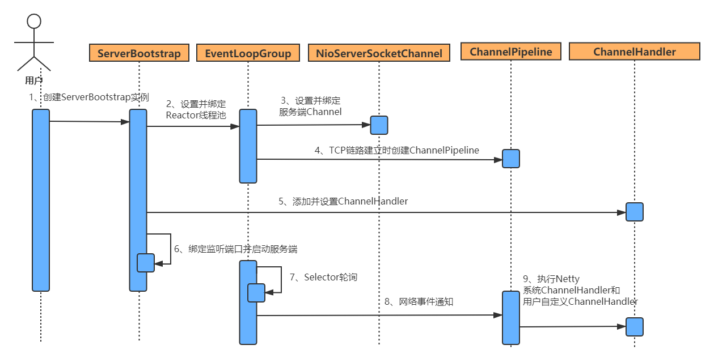

## Linux五种IO模型

一次I/O的完成的步骤

​    当进程发起系统调用时，这个系统调用就进入内核模式，然后开始I/O操作

I/O操作分为两个步骤；

​    1、磁盘把数据装载到内核的内存空间，

​    2、内核的内存空间的数据copy到用户的内存空间中(此过程是I/O发生的地方)

例如：小明去餐馆吃饭，点了一道菜，然后一直等待；

​	1、告诉老板点的什么，然后厨师炒好菜装盘，（对应IO的第一阶段）

​    2、小明去取餐，端到桌子上就餐（对应IO第二阶段）

### 阻塞式IO

上面的例子中，小明在厨师炒菜的过程中，必须一直等待，这种就是阻塞；

最常见的IO模型，应用进程被阻塞，直到数据从内核缓冲区复制到应用进程缓冲区中才返回。

### 非阻塞式IO

小明点完餐等的不耐烦，然后去问老板好了么，好了就去取餐，没好就等一段时间再去问，直到取餐成功，这就是轮询

应用进程执行系统调用时，返回一个状态码；需要不断的执行系统调用判断IO是否完成，这种方式为轮询（polling）

### IO复用

小明点了很多菜，如果按照上面的做法，每道菜都去问一遍，有些得不偿失，浪费时间；小明会询问所有菜的状态（炒好、未炒好），如果炒好一道菜就去取餐

首先IO复用必须有多个进程，多个进程调用同一个select/poll，让select/poll进行系统调用（阻塞）;这样我们可以把多个IO阻塞集中在一个select中，然后让select或者poll通知进程执行第二阶段的调用

### 事件(信号)驱动IO

经过小明此前的操作，已经不耐烦了，小明对老板说，炒好通知一下，小明可以取干别的事（之前必须一直等待）；然后收到通知去取餐；这种就是事件驱动；

通过系统调用sigaction 执行一个信号函数（非阻塞，立即返回），当数据准备好，会返回一个信号，通知进程执行第二阶段的调用

### 异步IO

之前的就餐方式，最后还要小明自己取餐，小明不耐烦了，然后告诉老板，菜炒好直接端到小明面前，第一阶段和第二阶段都可以干别的事，不用等待（阻塞），这种就是异步IO

告知内核启动某个操作，内核执行完成后，通知进程IO完成（第一、第二阶段都不阻塞），通过回调函数继续操作

## select，poll，epoll比较

### 文件描述符fd

文件描述符（file descriptor）是计算机科学中的一个术语，是一个用于表述指向文件的引用的抽象化概念。

文件描述符在形式上是一个非负整数。实际上，它是一个索引值，指向内核为每一个进程所维护的该进程打开文件的记录表。 当程序打开一个现有文件或者创建一个新文件时，内核向进程返回一个文件描述符。 在程序设计中，一些涉及底层的程序编写往往会围绕着文件描述符展开。文件描述符这一概念往往只适用于UNIX、Linux这样的操作系统。

select，poll，epoll都是IO多路复用的机制

**select：**  fd全称是file descriptor ,是进程独有的文件描述符表的索引

（1）使用copy_from_user从用户空间拷贝fd_set到内核空间

（2）注册回调函数__pollwait

（3）遍历所有fd，调用其对应的poll方法（对于socket，这个poll方法是sock_poll，sock_poll根据情况会调用到tcp_poll,udp_poll或者datagram_poll）

（4）以tcp_poll为例，其核心实现就是__pollwait，也就是上面注册的回调函数。

（5）__pollwait的主要工作就是把current（当前进程）挂到设备的等待队列中，不同的设备有不同的等待队列，对于tcp_poll来说，其等待队列是sk->sk_sleep（注意把进程挂到等待队列中并不代表进程已经睡眠了）。在设备收到一条消息（网络设备）或填写完文件数据（磁盘设备）后，会唤醒设备等待队列上睡眠的进程，这时current便被唤醒了。

（6）poll方法返回时会返回一个描述读写操作是否就绪的mask掩码，根据这个mask掩码给fd_set赋值。

（7）如果遍历完所有的fd，还没有返回一个可读写的mask掩码，则会调用schedule_timeout是调用select的进程（也就是current）进入睡眠。当设备驱动发生自身资源可读写后，会唤醒其等待队列上睡眠的进程。如果超过一定的超时时间（schedule_timeout指定），还是没人唤醒，则调用select的进程会重新被唤醒获得CPU，进而重新遍历fd，判断有没有就绪的fd。

（8）把fd_set从内核空间拷贝到用户空间。

epoll：

## BIO

BIO就是指IO，即传统的Blocking IO,即同步并阻塞的IO。这也是jdk1.4之前的唯一选择， 依赖于ServerSocket实现，即一个请求对应一个线程，如果线程数不够连接则会等待空余线程或者拒绝连接

~~~java
// 服务端
public class BioServer {
    private int port; // 端口号
    private ServerSocket server; // 服务端Socket
    public BioServer(int port)   {
        this.port = port;
        try {
            this.server = new ServerSocket(port);
            log.debug("服务端启动-端口号：{}",port);
        } catch (IOException e) {
            e.printStackTrace();
        }
    } 
    public void listen() throws IOException, InterruptedException {
        // 循环监听
        while (true) {
            // 等待客户端连接，会一直阻塞
            // Socket拿到消息发送者的引用
            // 每次只能处理一个请求
            Socket client = server.accept();
            InputStream is = client.getInputStream();
            byte[] bytes = new byte[1024];
            int len = is.read(bytes);
            if (len > 0) {
                String msg = new String(bytes,0,len);
                log.debug("收到信息：{}",msg);
                Thread.sleep(1000); // 阻塞
            }
        }
    }
    public static void main(String[] args) {
        NewBioServer server = new NeNewBioServer080);
        try {
            server.listen();
        } catch (IOException e) {
            e.printStackTrace();
        } catch (InterruptedException e) {
            e.printStackTrace();
        }
    }
}
~~~

~~~java
// 客户端
public class BioClient {
    // 多线程模拟并发
    static ExecutorService pool = Executors.newFixedThreadPool(5);
    public static void main(String[] args) {
        for (int i = 0; i < 5; i++) {
            pool.execute(new SendInfo(i));
        }
        pool.shutdown();
    }
    static class SendInfo implements Runnable {
        private int index;
        public SendInfo(int index) {
            this.index = index;
        }
        @Override
        public void run() {
            try(Socket socket = new Socket("localhost",8080); // 连接到服务端
                OutputStream os = socket.getOutputStream()) {
                String name = this.index + ":" + UUID.randomUUID().toString();
                log.debug("发送数据：{}",name);
                os.write(name.getBytes());
            } catch (UnknownHostException e) {
                e.printStackTrace();
            } catch (IOException e) {
                e.printStackTrace();
            }
        }
    }
}
~~~

~~~
客户端同时发送了5条数据
16:26:30 739 发送数据：2:a5521869-118a-477f-8641-c7f7cc7f5190
16:26:30 738 发送数据：0:f58ece26-6e8f-4b1b-9df1-a42f01cf8cd4
16:26:30 738 发送数据：3:3f36bc5b-b402-4088-b04c-c7d693d55410
16:26:30 738 发送数据：1:375643a8-aea5-429e-a46b-46596d52e070
16:26:30 738 发送数据：4:47ca8380-1bed-495c-94de-dbe6247ba1fb
服务端只能处理一条请求，每次阻塞1秒中
16:26:30 742 收到信息：0:f58ece26-6e8f-4b1b-9df1-a42f01cf8cd4
16:26:31 744 收到信息：4:47ca8380-1bed-495c-94de-dbe6247ba1fb
16:26:32 745 收到信息：2:a5521869-118a-477f-8641-c7f7cc7f5190
16:26:33 746 收到信息：3:3f36bc5b-b402-4088-b04c-c7d693d55410
16:26:34 746 收到信息：1:375643a8-aea5-429e-a46b-46596d52e070
~~~

根据上面的运行结果，服务器在同一时刻只能处理一个请求，其他的请求会被阻塞，反应到客户端到就是无响应，如何处理高并发呢，引入多线程，并利用线程池管理线程，把每个请求丢给一个线程处理

~~~java
// 线程池处理IO
public class NewBioServer {
    private int port;
    private ServerSocket server;
    private ExecutorService pool = Executors.newFixedThreadPool(5);
    public NewBioServer(int port)   {
        this.port = port;
        try {
            this.server = new ServerSocket(port);
            log.debug("服务端启动-端口号：{}",port);
        } catch (IOException e) {
            e.printStackTrace();
        }
    }
    public void listen() throws IOException, InterruptedException {
        // 循环监听
        while (true) {
            // 等待客户端连接，会一直阻塞
            // Socket拿到消息发送者的引用
            // 用线程池处理每个请求
            Socket client = server.accept();
            pool.execute(new SocketHandler(client)); // 把用户请求丢给线程池
        }
    }
    public static void main(String[] args) {
        NewBioServer server = new NewBioServer(8080);
        try {
            server.listen();
        } catch (IOException e) {
            e.printStackTrace();
        } catch (InterruptedException e) {
            e.printStackTrace();
        }
    }
	// 线程处理用户请求
    class SocketHandler implements Runnable {
        private Socket client;
        public SocketHandler(Socket client) {
            this.client = client;
        }
        @Override
        public void run() {
            try {
                InputStream is = client.getInputStream();
                byte[] bytes = new byte[1024];
                int len = is.read(bytes);
                if (len > 0) {
                    String msg = new String(bytes,0,len);
                    log.debug("线程{}->收到信息：{}",Thread.currentThread().getName(),msg);
                    Thread.sleep(1000);
                }
            } catch (InterruptedException e) {
                e.printStackTrace();
            } catch (IOException e) {
                e.printStackTrace();
            }
        }
    }
}
~~~

~~~
16:40:17 210 发送数据：1:d122969a-15cb-4cf2-9bf8-04be9493b5a3
16:40:17 210 发送数据：3:966f0d1d-572d-40d9-ba50-5c413efbc6dc
16:40:17 210 发送数据：4:756eaca9-1c05-4823-bac7-62dfefc16e6a
16:40:17 210 发送数据：0:40a35cac-7144-4c4c-b061-0426c61deaca
16:40:17 210 发送数据：2:7b1fb857-3d7f-41bb-9d40-c1fa17cdea0e
// 多线程下，请求不会阻塞
16:40:17 213 线程pool-1-thread-4 ->收到信息：1:d122969a-15cb-4cf2-9bf8-04be9493b5a3
16:40:17 213 线程pool-1-thread-5 ->收到信息：4:756eaca9-1c05-4823-bac7-62dfefc16e6a
16:40:17 214 线程pool-1-thread-3 ->收到信息：3:966f0d1d-572d-40d9-ba50-5c413efbc6dc
16:40:17 214 线程pool-1-thread-2 ->收到信息：0:40a35cac-7144-4c4c-b061-0426c61deaca
16:40:17 214 线程pool-1-thread-1 ->收到信息：2:7b1fb857-3d7f-41bb-9d40-c1fa17cdea0e
~~~

可以看到多线程下，用户请求不会阻塞了，但是这种方式没有从根本是解决IO阻塞的问题， 而且会引发一些问题

* 如果客户端网速很慢，服务端对应线程在读取请求文本时会阻塞很长时间，造成返回信息缓慢

* 如果所有的线程都被IO阻塞，新的请求会进入阻塞队列，如果阻塞队列满了，无法接受新的请求

例：银行有3个服务台，只能同时接待3个客户，超过3个之后的客户需要排队，队伍只有10个位置；

## NIO

BIO 与NIO 最重要的区别是数据打包和传输的方式，BIO 以流的方式处理数据，而NIO 以块的方式处理数据。

### 1.缓存区Buffer

在NIO中，所有的数据都是用缓存区处理的，缓冲区实质上是一个数组，最常用的是ByteBuffer；在NIO读取数据时，数据会先写入到缓存区，而不是直接读取数据流（读取数据流会因为网络等因素使线程阻塞）；

**缓冲区状态变量**
capacity：最大容量；
position：当前已经读写的字节数；
limit：还可以读写的字节数。

### 2.通道Channel

Channel是一个通道，可以通过它来读取和写入数据；

通道是双向的，可以读、写或者同时读写，而流操作InputStream、OutputStream只能单向操作

### 3.多路复用器Selector

Selector会不断轮询注册在其上的Channel，如果某个Channel有新的读写事件，Channel的状态会发生变化，变为就绪状态，Selector轮询会发现，然后通过SelectionKey获取就绪Channel集合，然后进行IO操作

###  NIO进行服务端开发的步骤。

1. 创建ServerSocketChannel， 配置它为非阻塞模式；
2. 绑定监听，配置TCP参数，例如backlog大小；
3. 创建一个独立的I/O线程，用于轮询多路复用器Selector；
4. 创建Selector， 将之前创建的ServerSocketChannel 注册到Selector 上，监听SelectionKey.ACCEPT；
5. 启动I/O线程，在循环体中执行Selector.select() 方法， 轮询就绪的Channel；
6. 当轮询到了处于就绪状态的Channel时，需要对其进行判断，如果是OP_ ACCEPT 状态，说明是新的客户端接入，则调用ServerSocketChannel.accept() 方法接受新的客户端；
7. 设置新接入的客户端链路SocketChannel为非阻塞模式，配置其他的一些TCP参数；
8. 将SocketChannel注册到Selector， 监听OP_ READ操作位；
9. 如果轮询的Channel为OP__READ，则说明SocketChannel中有新的就绪的数据包需要读取，则构造ByteBuffer对象，读取数据包：

## BIO与NIO、AIO的区别 

### 同步和异步

**同步：**调用者（客户端）发起一个请求后，被调用者（服务器）如果未处理完请求之前，请求都不会返回；

**异步：**调用者（客户端）发起一个请求后，立刻得到被调用者（服务器）的回应表示已接收到请求，但是被调用者并没有返回结果，此时我们可以处理其他的请求，被调用者通常依靠事件驱动，回调等机制来通知调用者取返回结果。

### 阻塞和非阻塞

**阻塞：**调用者发起一个请求后，需要一直等待请求结果返回，当前线程会被阻塞（挂起），无法执行别的任务，只有条件就绪才能继续运行

**非阻塞：**调用者发起一个请求后，不需要一直等待，可以先去执行别的任务

用例子理解一下概念，以银行取款为例： 

- 同步：自己亲自出马持银行卡到银行取钱（使用同步IO时，Java自己处理IO读写）；
- 异步：委托一小弟拿银行卡到银行取钱，然后给你（使用异步IO时，Java将IO读写委托给OS处理，需要将数据缓冲区地址和大小传给OS(银行卡和密码)，OS需要支持异步IO操作API）；
- 阻塞：ATM排队取款，你只能等待（使用阻塞IO时，Java调用会一直阻塞到读写完成才返回）；
- 非阻塞：柜台取款，取个号，然后坐在椅子上做其它事，等号广播会通知你办理，没到号你就不能去，你可以不断问大堂经理排到了没有，大堂经理如果说还没到你就不能去（使用非阻塞IO时，如果不能读写Java调用会马上返回，当IO事件分发器会通知可读写时再继续进行读写，不断循环直到读写完成）

## Netty

什么是Netty？Netty是一个基于java NIO 的网络应用框架

### Bootstrap

Bootstrap类是Netty提供的一个可以通过简单配置来设置或"引导"程序的一个很重要的类。

- Bootstrap用来连接远程主机，有1个EventLoopGroup
- ServerBootstrap用来绑定本地端口，有2个EventLoopGroup

### Netty服务端创建

1

### EventLoop 

**EventLoopGroup**

### Pipeline

**ChannelPipeline**

ChannelPipeline 就是 ChannelHandler 链的容器。

**Channel**

**Future or ChannelFuture**

**Channellnitializer**

**ChannelHandler**

ChannelHandler做下面一些事情：

* 传输数据时，将数据从一种格式转换到另一种格式
* 异常通知
* Channel变为有效或无效时获得通知
* Channel被注册或从EventLoop中注销时获得通知
* 通知用户特定事件

### Promise与Future

### 缓存ByteBuf

### 编解码器

利用Netty提供的半包编码和解码器LengthFieldPrepender和LengthFieldBasedFrameDecoder，可以轻松的解决TCP粘包和半包问题

**Decoder(解码器)**

- 解码字节到消息（ByteToMessageDecoder 和 ReplayingDecoder）
- 解码消息到消息（MessageToMessageDecoder）

**Encoder(编码器)**

- 编码从消息到字节（MessageToByteEncoder）
- 编码从消息到消息（MessageToMessageEncoder）

## 参考资料

* [Linux IO模型和网络编程模型](https://www.cnblogs.com/wade-luffy/p/6106030.html )
* [web优化必须了解的原理之I/o的五种模型和web的三种工作模式](https://blog.51cto.com/litaotao/1289790)
* [BIO与NIO、AIO的区别(这个容易理解)](https://blog.csdn.net/skiof007/article/details/52873421)

