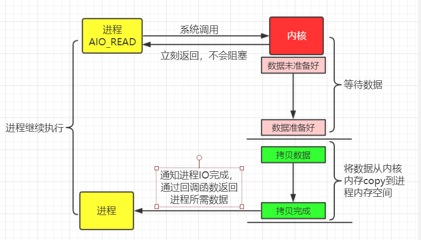

## Linux 基础概念

### **用户空间 / 内核空间**

在操作系统中，虚拟内存通常会被分成用户空间与内核空间这两个区块

**内核空间**：运行一部分核心软件，独立于普通程序，运行在被保护的内存空间上，拥有访问硬件设备的索引权限。

**用户空间**：运行普通程序，只允许看到它们使用的部分系统资源，不能直接访问内核空间和硬件设备。

用户空间和内核空间的访问权限机制能很好的保证系统的安全性，抵御部分恶意攻击

### **文件描述符**

文件描述符（file descriptor）是计算机科学中的一个术语，是一个用于表述指向文件的引用的抽象化概念。

内核利用文件描述符来访问文件。文件描述符在形式上是一个非负整数。实际上，它是一个索引值，指向内核为每一个进程所维护的该进程打开文件的记录表。 当程序打开或者创建一个文件时，内核向进程返回一个文件描述符。 

### **缓存I/O**

缓存I/O又称为标准I/O，大多数文件系统的默认I/O操作都是缓存I/O。在Linux的缓存I/O机制中，数据先从磁盘装载到内核的内存空间，然后从内核空间复制到应用程序的内存空间。

**优点**：1.分离内核空间和用户空间，保护运行安全；2.减少读盘时间（操作系统会预测之后要用的数据，把相邻的数据都读出来，而不是等应用程序请求时才读取）

**缺点**：需要在内核空间和用户空间来回拷贝，降低CPU的使用率

**直接I/O**：直接IO就是应用程序直接访问磁盘数据，而不经过内核缓冲区，目的是减少一次从内核空间到用户空间的数据复制

## Linux五种IO模型

一次I/O的完成的步骤

当进程发起系统调用时，这个系统调用就进入内核模式，然后开始I/O操作

I/O操作分为两个步骤；

1. 磁盘把数据装载到内核的内存空间
2. 内核的内存空间的数据copy到用户的内存空间中(此过程是I/O发生的地方)

对于socket流而言，

1. 等待网络上的数据分组到达，然后被复制到内核的某个缓冲区
2. 把数据从内核缓冲区复制到应用进程缓冲区

例如：使用钓鱼来模拟IO过程， 钓鱼操作，是鱼从鱼塘中转移到鱼篓的过程 ；

1. 拿着鱼竿，等待鱼儿上钩（对应IO的第一阶段）
2. 鱼儿上钩后，把鱼钓起来放入鱼篓中（对应IO第二阶段）

### 阻塞式IO

上面的例子中，在等待鱼儿上钩的过程中，必须一直等待，什么也不能做，这种就是阻塞式IO；

最常见的IO模型，应用进程被阻塞，直到数据从内核缓冲区复制到应用进程缓冲区中才返回。

### 非阻塞式IO

在等待鱼儿上钩的过程中等的不耐烦，可以先去干别的事情，玩一下手机等，然后时不时的去看一下鱼竿，一旦发现有鱼儿上钩了，就把鱼钓上来，这就是轮询机制

应用进程执行系统调用时，返回一个状态码；需要不断的执行系统调用判断IO是否完成，这种方式为轮询（polling）

### IO复用

为了保证钓鱼的成功率，我们会同时摆放多个鱼竿同时钓鱼；我们查看鱼竿状态的时候可以同时查看所有鱼竿的状态，然后把咬钩的鱼儿钓上来，节省时间

首先IO复用必须有多个进程，多个进程调用同一个select/poll，让select/poll进行系统调用（阻塞）;这样我们可以把多个IO阻塞集中在一个select中，然后让select或者poll通知进程，执行第二阶段的调用

### 事件(信号)驱动IO

为了避免频繁的查看鱼竿状态带来的时间损失，我们可以为鱼竿安装一个报警装置，当有鱼儿咬钩鱼竿就会报警，听到报警声我们就去把鱼钓起来；这种就是事件驱动；

通过系统调用sigaction 执行一个信号函数（非阻塞，立即返回），当数据准备好，会返回一个信号，通知进程执行第二阶段的调用

### 异步IO

之前的钓鱼方式，最后还要我们自己手工收杆，手工把鱼放入鱼篓，这时候我们发明一种高科技鱼竿，可以自动钓鱼，感应到鱼儿上钩后自动收杆并自动把鱼放入鱼篓，整个第一阶段和第二阶段我们都可以干别的事，不用等待（阻塞），这种就是异步IO

告知内核启动某个操作，内核执行完成后，通知进程IO完成（第一、第二阶段都不阻塞），通过回调函数继续操作

## select，poll，epoll比较

**FD(文件描述符)**: 非负整数，相当于文件的索引，当程序打开或者创建一个文件时，内核向进程返回一个文件描述符

### select

select函数

~~~c
int select(int maxfdp1,fd_set *readset,fd_set *writeset,fd_set *exceptset,const struct timeval *timeout) 
    
typedef __kernel_fd_set     fd_set;

typedef struct {
    unsigned long fds_bits [__FDSET_LONGS];
} __kernel_fd_set;
// 这个数组占用空间为 1024bit 最多只能 1024 个FD
~~~

maxfdp1: 是一个整数值，是指集合中所有FD的范围，即所有文件描述符的最大值加1

readset: select监视的可读FD集合

writeset: select监视的可写FD集合

exceptset: select监视的异常FD集合

timeout: select的超时时间

**原理**：`fd_set`实际上是一个long类型的数组，每一个数组元素对应一个FD。调用select()时，内核根据IO状态修改fd_set（readset，writeset，exceptset）的内容，只需要遍历fd_set，然后判断对应FD的读写操作。

~~~c
int fds[FD_SETSIZE]; // 保存当前所有fd
fd_set rset, wset, eset; // 定义读、写、异常对应的fd_set
// 初始化fd_set，非常重要且不能省略，因为如果不初始化可能会影响FD_ISSET的调用结果
FD_ZERO(&rset); 
FD_ZERO(&wset);
FD_ZERO(&eset);
for (;;) {// 不停调用select
    select(FD_SETSIZE, &rset, &wset, &eset, NULL);
    // 遍历当前所有的fd，处理就绪的fd
    for (int i = 0; i < FD_SETSIZE; i++) {
        if (FD_ISSET(fds[i], &rset))  {
            // 处理读请求
        }
        if (FD_ISSET(fds[i], &wset)) {
            // 处理写请求
        }
        if (FD_ISSET(fds[i], &eset)) {
            // 处理异常
        }
    }
}

~~~

**select的几大缺点**：

1. 每次调用select，都需要把FD集合从用户空间拷贝到内核空间，当FD集合很大时开销会很大
2. 每次调用select，都需要在内核空间遍历传递进来的所有FD，当FD集合很大时开销也会很大
3. select支持的文件描述符数量太小了，默认是1024

### poll

poll函数

~~~c
int poll(struct pollfd *fds, nfds_t nfds, int timeout);

typedef struct pollfd {
        int fd;        // 文件描述符fd                       
        short events;  // 等待的事件                
        short revents; // 实际发生的事件                 
} pollfd_t;
~~~

poll改变了文件描述符集合的结构，使用了`pollfd`结构而不是select的`fd_set`结构，使得poll支持的FD集合远大于select的1024

poll的机制与select类似，与select在本质上没有多大差别，管理多个描述符也是进行轮询，然后根据FD的状态（revents）进行处理，但是poll没有最大文件描述符数量的限制，所以poll依然存在select的性能开销问题

~~~c
struct pollfd pollfds[OPEN_MAX]; //定义pollfd数组,保存需要监听的fd
for (;;) { // 不停调用poll
    poll(pollfds, OPEN_MAX, INFTIM);
    for (int i = 0; i < OPEN_MAX; i++) {
        // 遍历pollfd数组,处理就绪的fd
        struct pollfd pfd = pollfds[i];
        // 判断事件类型
        if (pfd.revents & POLLIN) {
            // 处理读请求
        }
        if (pfd.revents & POLLOUT) {
            // 处理写请求 
        }
    }
}
~~~

### epoll

epoll函数

~~~c
// 创建一个epoll的句柄,size表示监听的FD的数量(只是初始建议值,并不会限制fd的最大数量)
int epoll_create(int size);
// 注册要监听的事件类型
int epoll_ctl(int epfd, int op, int fd, struct epoll_event *event);
// 等待事件的就绪,成功时返回就绪的事件数量,失败时返回 -1,等待超时返回 0
int epoll_wait(int epfd, struct epoll_event * events, int maxevents, int timeout);
~~~

epoll事先通过epoll_ctl()来注册一 个fd，一旦基于某个fd就绪时，内核会采用回调机制，迅速激活这个文件描述符，当进程调用epoll_wait() 时便得到通知，而不需要遍历FD集合

~~~c
int epollfd = epoll_create(POLL_SIZE);
// 注册要监听的事件
add_event(epollfd,STDIN_FILENO,EPOLLIN);
for ( ; ; ) {
	int num = epoll_wait(epollfd,events,EPOLLEVENTS,-1);
	handle_events(epollfd,events,num,sockfd,buf);
}
// 注册事件
static void add_event(int epollfd,int fd,int state) {
    struct epoll_event ev;
    ev.events = state;
    ev.data.fd = fd;
    epoll_ctl(epollfd,EPOLL_CTL_ADD,fd,&ev);
}

// 事件处理函数
static void handle_events(int epollfd,struct epoll_event *events,int num,int listenfd,char *buf) {
    int i;
    int fd;
    // 进行遍历;这里只要遍历已经准备好的io事件。num并不是当初epoll_create时的FDSIZE。
    for (i = 0;i < num;i++) {
        fd = events[i].data.fd; 
        if (events[i].events & EPOLLIN){
            // 处理读请求,处理完成后删除监听事件
        } else if(event[i].events & EPOLLOUT) {
            // 处理写请求,处理完成后删除监听事件
        }  
    }
} 
~~~

select、poll、epoll之间的区别总结

- select，poll，epoll本质上都是同步I/O，都需要在读写事件就绪后自己负责进行读写，也就是说这个读写过程是阻塞的
- select 有打开文件描述符数量限制，默认1024（2048 for x64），100万并发，就要用1000个进程、切换开销大；poll采用链表结构，没有数量限制。
- select，poll要遍历整个fd集合，而epoll通过回调机制节省大量CPU时间；select，poll每次调用都要把fd集合从用户空间拷贝到内核空间，而epoll只要一次拷贝。
- poll会随着并发增加，性能逐渐下降，epoll采用红黑树结构，性能稳定，不会随着连接数增加而降低。

|            | select                                     | poll                                       | epoll                                                     |
| :--------- | ------------------------------------------ | ------------------------------------------ | --------------------------------------------------------- |
| 操作方式   | 遍历                                       | 遍历                                       | 回调                                                      |
| 底层实现   | 数组                                       | 链表                                       | 红黑树                                                    |
| IO效率     | 全部遍历，时间复杂度O(n)                   | 全部遍历，时间复杂度O(n)                   | 事件驱动，回调函数，时间复杂度O(1)                        |
| 最大连接数 | 1024（x86）或2048（x64）                   | 无上限                                     | 无上限                                                    |
| fd拷贝     | 每次都需要把fd集合从用户空间拷贝到内核空间 | 每次都需要把fd集合从用户空间拷贝到内核空间 | 调用epoll_ctl时拷贝进内核并保存，之后每次epoll_wait不拷贝 |

## BIO

BIO就是指IO，即传统的Blocking IO,即同步并阻塞的IO。这也是jdk1.4之前的唯一选择， 依赖于ServerSocket实现，即一个请求对应一个线程，如果线程数不够连接则会等待空余线程，或者拒绝连接

~~~java
// 服务端
public class BioServer {
    private int port; // 端口号
    private ServerSocket server; // 服务端Socket
    public BioServer(int port)   {
        this.port = port;
        try {
            this.server = new ServerSocket(port);
            log.debug("服务端启动-端口号：{}",port);
        } catch (IOException e) {
            e.printStackTrace();
        }
    } 
    public void listen() throws IOException, InterruptedException {
        // 循环监听
        while (true) {
            // 等待客户端连接，会一直阻塞
            // Socket拿到消息发送者的引用
            // 每次只能处理一个请求
            Socket client = server.accept();
            InputStream is = client.getInputStream();
            byte[] bytes = new byte[1024];
            int len = is.read(bytes);
            if (len > 0) {
                String msg = new String(bytes,0,len);
                log.debug("收到信息：{}",msg);
                Thread.sleep(1000); // 阻塞
            }
        }
    }
    public static void main(String[] args) {
        NewBioServer server = new NeNewBioServer080);
        try {
            server.listen();
        } catch (IOException e) {
            e.printStackTrace();
        } catch (InterruptedException e) {
            e.printStackTrace();
        }
    }
}
~~~

~~~java
// 客户端
public class BioClient {
    // 多线程模拟并发
    static ExecutorService pool = Executors.newFixedThreadPool(5);
    public static void main(String[] args) {
        for (int i = 0; i < 5; i++) {
            pool.execute(new SendInfo(i));
        }
        pool.shutdown();
    }
    static class SendInfo implements Runnable {
        private int index;
        public SendInfo(int index) {
            this.index = index;
        }
        @Override
        public void run() {
            try(Socket socket = new Socket("localhost",8080); // 连接到服务端
                OutputStream os = socket.getOutputStream()) {
                String name = this.index + ":" + UUID.randomUUID().toString();
                log.debug("发送数据：{}",name);
                os.write(name.getBytes());
            } catch (UnknownHostException e) {
                e.printStackTrace();
            } catch (IOException e) {
                e.printStackTrace();
            }
        }
    }
}
~~~

~~~
客户端同时发送了5条数据
16:26:30 739 发送数据：2:a5521869-118a-477f-8641-c7f7cc7f5190
16:26:30 738 发送数据：0:f58ece26-6e8f-4b1b-9df1-a42f01cf8cd4
16:26:30 738 发送数据：3:3f36bc5b-b402-4088-b04c-c7d693d55410
16:26:30 738 发送数据：1:375643a8-aea5-429e-a46b-46596d52e070
16:26:30 738 发送数据：4:47ca8380-1bed-495c-94de-dbe6247ba1fb
服务端只能处理一条请求，每次阻塞1秒中
16:26:30 742 收到信息：0:f58ece26-6e8f-4b1b-9df1-a42f01cf8cd4
16:26:31 744 收到信息：4:47ca8380-1bed-495c-94de-dbe6247ba1fb
16:26:32 745 收到信息：2:a5521869-118a-477f-8641-c7f7cc7f5190
16:26:33 746 收到信息：3:3f36bc5b-b402-4088-b04c-c7d693d55410
16:26:34 746 收到信息：1:375643a8-aea5-429e-a46b-46596d52e070
~~~

根据上面的运行结果，服务器在同一时刻只能处理一个请求，其他的请求会被阻塞，反应到客户端到就是无响应，如何处理高并发呢，引入多线程，并利用线程池管理线程，把每个请求丢给一个线程处理

~~~java
// 线程池处理IO
public class NewBioServer {
    private int port;
    private ServerSocket server;
    private ExecutorService pool = Executors.newFixedThreadPool(5);
    public NewBioServer(int port)   {
        this.port = port;
        try {
            this.server = new ServerSocket(port);
            log.debug("服务端启动-端口号：{}",port);
        } catch (IOException e) {
            e.printStackTrace();
        }
    }
    public void listen() throws IOException, InterruptedException {
        // 循环监听
        while (true) {
            // 等待客户端连接，会一直阻塞
            // Socket拿到消息发送者的引用
            // 用线程池处理每个请求
            Socket client = server.accept();
            pool.execute(new SocketHandler(client)); // 把用户请求丢给线程池
        }
    }
    public static void main(String[] args) {
        NewBioServer server = new NewBioServer(8080);
        try {
            server.listen();
        } catch (IOException e) {
            e.printStackTrace();
        } catch (InterruptedException e) {
            e.printStackTrace();
        }
    }
	// 线程处理用户请求
    class SocketHandler implements Runnable {
        private Socket client;
        public SocketHandler(Socket client) {
            this.client = client;
        }
        @Override
        public void run() {
            try {
                InputStream is = client.getInputStream();
                byte[] bytes = new byte[1024];
                int len = is.read(bytes);
                if (len > 0) {
                    String msg = new String(bytes,0,len);
                    log.debug("线程{}->收到信息：{}",Thread.currentThread().getName(),msg);
                    Thread.sleep(1000);
                }
            } catch (InterruptedException e) {
                e.printStackTrace();
            } catch (IOException e) {
                e.printStackTrace();
            }
        }
    }
}
~~~

~~~
16:40:17 210 发送数据：1:d122969a-15cb-4cf2-9bf8-04be9493b5a3
16:40:17 210 发送数据：3:966f0d1d-572d-40d9-ba50-5c413efbc6dc
16:40:17 210 发送数据：4:756eaca9-1c05-4823-bac7-62dfefc16e6a
16:40:17 210 发送数据：0:40a35cac-7144-4c4c-b061-0426c61deaca
16:40:17 210 发送数据：2:7b1fb857-3d7f-41bb-9d40-c1fa17cdea0e
// 多线程下，请求不会阻塞
16:40:17 213 线程pool-1-thread-4 ->收到信息：1:d122969a-15cb-4cf2-9bf8-04be9493b5a3
16:40:17 213 线程pool-1-thread-5 ->收到信息：4:756eaca9-1c05-4823-bac7-62dfefc16e6a
16:40:17 214 线程pool-1-thread-3 ->收到信息：3:966f0d1d-572d-40d9-ba50-5c413efbc6dc
16:40:17 214 线程pool-1-thread-2 ->收到信息：0:40a35cac-7144-4c4c-b061-0426c61deaca
16:40:17 214 线程pool-1-thread-1 ->收到信息：2:7b1fb857-3d7f-41bb-9d40-c1fa17cdea0e
~~~

可以看到多线程下，用户请求不会阻塞了，但是这种方式没有从根本是解决IO阻塞的问题， 而且会引发一些问题

* 如果客户端网速很慢，服务端对应线程在读取请求文本时会阻塞很长时间，造成返回信息缓慢

* 如果所有的线程都被IO阻塞，新的请求会进入阻塞队列，如果阻塞队列满了，无法接受新的请求

### 阻塞的问题根源

> 服务器线程发起一个accept动作，询问操作系统 是否有新的socket套接字信息从端口xx发送过来。
>
> **注意，是询问操作系统**。也就是说socket套接字的IO模式支持是基于操作系统的
>
> 如果操作系统没有发现有套接字从指定的端口xx来，那么操作系统就会等待。这样serverSocket.accept()方法就会一直等待。这就是为什么accept()方法为什么会阻塞**: 它内部的实现是使用的操作系统级别的同步IO。**
>
> [详细说明](https://blog.csdn.net/yjp198713/article/details/79281237#三阻塞的问题根源)

## NIO

BIO 与NIO 最重要的区别是数据打包和传输的方式，BIO 以流的方式处理数据，而NIO 以块的方式处理数据。

### 缓存区Buffer

在NIO中，所有的数据都是用缓存区处理的，缓冲区实质上是一个数组，最常用的是ByteBuffer；在NIO读取数据时，数据会先写入到缓存区，而不是直接读取数据流（读取数据流会因为网络等因素使线程阻塞）；

**缓冲区状态变量**

capacity：最大容量；

position：当前已经读写的字节数；

limit：还可以读写的字节数。

### 通道Channel

Channel是一个通道，可以通过它来读取和写入数据；

通道是双向的，可以读、写或者同时读写，而流操作InputStream、OutputStream只能单向操作

### 多路复用器Selector

Selector会不断轮询注册在其上的Channel，如果某个Channel有新的读写事件，Channel的状态会发生变化，变为就绪状态，Selector轮询会发现这些Channel，然后通过SelectionKey获取就绪Channel集合，然后进行IO操作

###  NIO进行服务端开发的步骤

1. 创建ServerSocketChannel， 配置它为非阻塞模式；
2. 绑定监听，配置TCP参数，例如backlog大小；
3. 创建一个独立的I/O线程，用于轮询多路复用器Selector；
4. 创建Selector， 将之前创建的ServerSocketChannel 注册到Selector 上，监听SelectionKey.ACCEPT；
5. 启动I/O线程，在循环体中执行Selector.select() 方法， 轮询就绪的Channel；
6. 当轮询到了处于就绪状态的Channel时，需要对其进行判断，如果是OP_ ACCEPT 状态，说明是新的客户端接入，则调用ServerSocketChannel.accept() 方法接受新的客户端；
7. 设置新接入的客户端链路SocketChannel为非阻塞模式，配置其他的一些TCP参数；
8. 将SocketChannel注册到Selector， 监听OP_ READ操作位；
9. 如果轮询的Channel为OP__READ，则说明SocketChannel中有新的就绪的数据包需要读取，则构造ByteBuffer对象，读取数据包：

## AIO

异步IO则采用“订阅-通知”模式：**即应用程序向操作系统注册IO监听，然后继续做自己的事情。当操作系统发生IO事件，并且准备好数据后，在主动通知应用程序，触发相应的函数**

- 和同步IO一样，异步IO也是由操作系统进行支持的。微软的windows系统提供了一种异步IO技术：IOCP（I/O CompletionPort，I/O完成端口）；
- Linux下由于没有这种异步IO技术，所以使用的是epoll（上文介绍过的一种多路复用IO技术的实现）对异步IO进行模拟。

## BIO与NIO、AIO的区别 

### 同步和异步

**同步**: 调用者（客户端）发起一个请求后，被调用者（服务器）如果未处理完请求之前，请求都不会返回；

**异步**: 调用者（客户端）发起一个请求后，立刻得到被调用者（服务器）的回应表示已接收到请求，但是被调用者并没有返回结果，此时我们可以处理其他的请求，被调用者通常依靠事件驱动，回调等机制来通知调用者取返回结果。

### 阻塞和非阻塞

**阻塞**: 调用者发起一个请求后，需要一直等待请求结果返回，当前线程会被阻塞（挂起），无法执行别的任务，只有条件就绪才能继续运行

**非阻塞**: 调用者发起一个请求后，不需要一直等待，可以先去执行别的任务

用例子理解一下概念，以银行取款为例： 

- 同步：自己亲自出马持银行卡到银行取钱（使用同步IO时，Java自己处理IO读写）；
- 异步：委托一小弟拿银行卡到银行取钱，然后给你（使用异步IO时，Java将IO读写委托给OS处理，需要将数据缓冲区地址和大小传给OS(银行卡和密码)，OS需要支持异步IO操作API）；
- 阻塞：ATM排队取款，你只能等待（使用阻塞IO时，Java调用会一直阻塞到读写完成才返回）；
- 非阻塞：柜台取款，取个号，然后坐在椅子上做其它事，等号广播会通知你办理，没到号你就不能去，你可以不断问大堂经理排到了没有，大堂经理如果说还没到你就不能去（使用非阻塞IO时，如果不能读写Java调用会马上返回，当IO事件分发器会通知可读写时再继续进行读写，不断循环直到读写完成）

| 属性               | 同步阻塞IO(BIO) | 伪异步IO  | 非阻塞IO（NIO） | 异步IO(AIO) |
| ------------------ | --------------- | --------- | --------------- | ----------- |
| 客户端数:IO 线程数 | 1:1             | M:N(M>=N) | M:1             | M:0         |
| 阻塞类型           | 阻塞            | 阻塞      | 非阻塞          | 非阻塞      |
| 同步               | 同步            | 同步      | 同步(多路复用)  | 异步        |
| API 使用难度       | 简单            | 简单      | 复杂            | 一般        |
| 调试难度           | 简单            | 简单      | 复杂            | 复杂        |
| 可靠性             | 非常差          | 差        | 高              | 高          |
| 吞吐量             | 低              | 中        | 高              | 高          |

## 参考资料

* [Linux IO模型和网络编程模型](https://www.cnblogs.com/wade-luffy/p/6106030.html )
* [《UNIX网络编程》笔记 - select和poll](https://juejin.im/post/5cc9668c6fb9a0323070df8b)
* [web优化必须了解的原理之I/o的五种模型和web的三种工作模式](https://blog.51cto.com/litaotao/1289790)
* [BIO与NIO、AIO的区别(这个容易理解)](https://blog.csdn.net/skiof007/article/details/52873421)
* [Java与IO](https://blog.csdn.net/yjp198713/column/info/18912)
*  [《漫话：如何给女朋友解释什么是Linux的五种IO模型？》](https://mp.weixin.qq.com/s?__biz=Mzg3MjA4MTExMw==&mid=2247484746&idx=1&sn=c0a7f9129d780786cabfcac0a8aa6bb7&source=41#wechat_redirect) 

