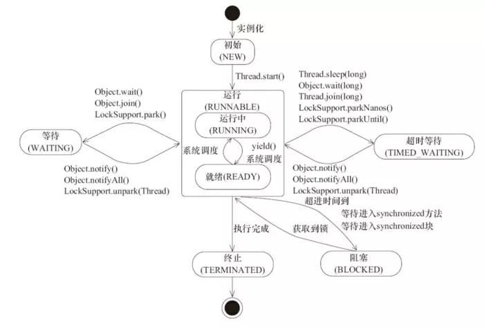
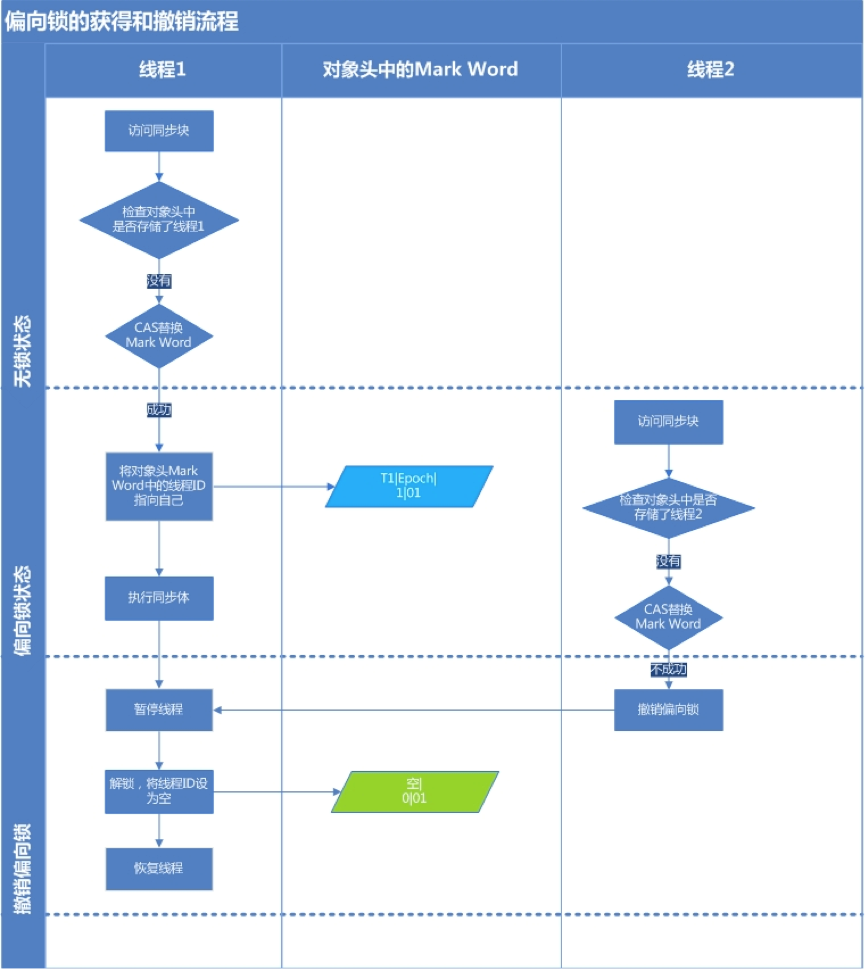
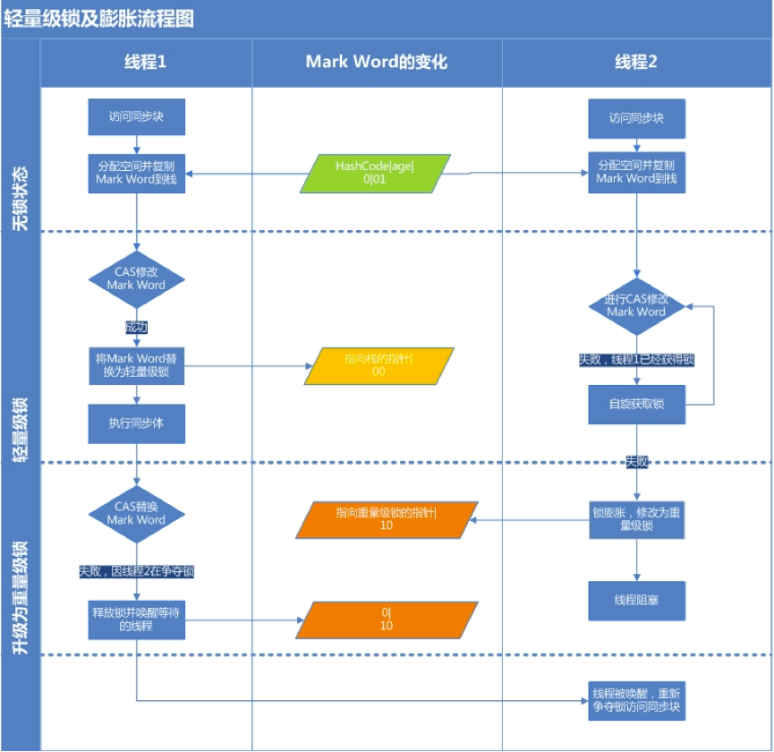
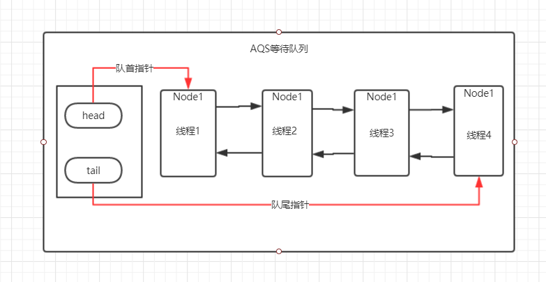
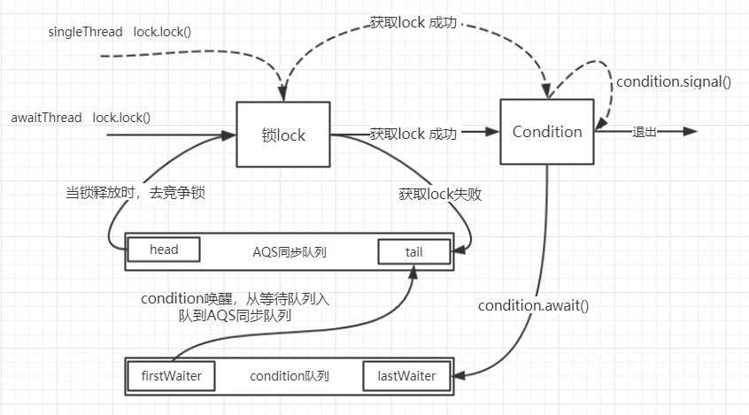
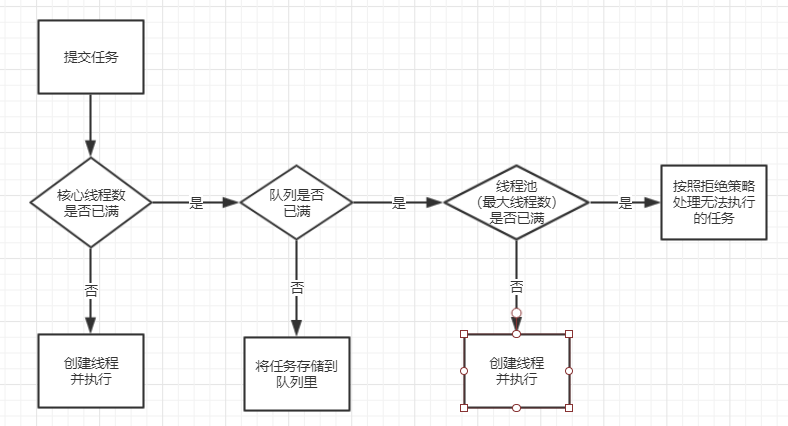

## 基础

### 为什么使用并发编程？  

1. 并发编程可以充分利用多核心CPU资源，在单核性能达到瓶颈的情况下能有效提高程序的执行效率，好的并发模型会比单线程应用花费更少的执行时间 
2. 我们可以对业务进行拆分，让每个线程运行一个任务，会比顺序执行效率更高 

#### 缺点   

1. 高并发会带来频繁的线程切换，这个过程资源消耗很大，当问题没有达到一定规模时，并发编程的效率甚至不如单线程

2. 并发编程由于共享变量会带来线程安全问题

#### 死锁

线程死锁是指由于两个或者多个线程互相持有对方所需要的资源，导致这些线程处于等待状态，无法前往执行。

例如：线程 A 持有独占锁a，并尝试去获取独占锁 b ，线程 B 持有独占锁 b，并尝试获取独占锁 a ，此时就会发生 AB 两个线程由于互相持有对方需要的锁，相互阻塞 

**避免死锁**

1. 避免一个线程同时获得多个锁；
2. 避免一个线程在锁内部占有多个资源，尽量保证每个锁只占用一个资源；
3. 尝试使用定时锁，使用lock.tryLock(timeOut)，当超时等待时当前线程不会阻塞；
4. 对于数据库锁，加锁和解锁必须在一个数据库连接里，否则会出现解锁失败的情况

#### 线程安全的定义

多个线程访问同一个对象时，如果不用考虑这些线程在运行时环境下的调度和交替执行，也不需要进行额外的同步，或者在调用方进行任何其他操作，调用这个对象的行为都可以获得正确的结果，那么这个对象就是线程安全的。

#### **线程安全的原因**

物理层面：CPU高速缓存中缓存的数据和主内存中不一致，指令重排序；

JVM：线程安全的问题一般是因为主内存和工作内存数据不一致和重排序导致的

### 多线程中基本概念
#### **同步VS异步**

**同步**：同步调用，调用者一旦调用方法，必须等到方法结束才能进行下一步操作;  

**异步**：调用者调用完该方法，不需要等待就可以执行下一步；

例如泡茶，必须等到水烧开才能开始泡茶，这个是同步；等待烧水的过程中可以读书或者干别的，这个属于异步

#### **并发VS并行**  

并发指多个任务交替执行，并行指任务同时进行

#### **阻塞VS非阻塞** 

一个线程占用了资源，导致别的线程不能访问，被挂起，被称为阻塞

**临界区**  

临界区表示公共资源或者共享数据，可以被多个线程共同使用，但是一旦临界区被一个线程使用，其他线程就必须等待

### JAVA创建线程 
创建线程的方式只有一种Thread 类，Runnable和线程池最终都是创建一个Thread对象去执行Runnable接口中的run方法

1）实现Runnable接口2）继承Thread 类 3）使用ExecutorService线程池 4）Callable、Future 实现带返回结果的多线程

#### **线程状态**

线程一共有6 种状态（NEW、RUNNABLE、BLOCKED、WAITING、TIME_WAITING、TERMINATED）

**NEW**: 初始状态，线程被构建，但是还没有调用start 方法

**RUNNABLE**: 运行状态，JAVA 线程把操作系统中的就绪和运行两种状态统一称为“运行中”

**WAITING**: 无限期等待，处于这种状态的线程不会被分配到CPU，需要等到被其他线程唤醒

调用：Object.wait()，Thread.join()，LockSupport.park() 会是线程进入这种状态

**BLOCKED**: 阻塞状态，当一个线程试图获取一个内部的对象锁，而该锁被其他线程持有，则该线程进入阻塞状态。如果其线程释放了锁就会结束此状态 

**TIME_WAITING**: 超时等待状态，超时以后自动返回

**TERMINATED**: 终止状态，表示当前线程执行完毕



#### **阻塞和等待的区别**

阻塞是被动的，等待是主动的；

* 阻塞是线程未获取到锁被迫进入阻塞状态
* 等待是线程正在执行（已获取到锁），主动放弃CPU资源，需要别的线程将其唤醒


### 线程基本操作
#### **interrupt**

线程中断

InterruptedException线程复位，怎么理解？

当我们对某个线程发起中断请求时（interrupt状态置为true），线程会自己判断是否可以中断，然后如果线程判断当前不能中断，就会把把interrupt状态恢复成false,并抛出InterruptedException异常；

#### **wait和notify**

void notify()：唤醒在锁对象上等待的单个线程。 

void notifyAll()：唤醒在锁对象监视器上等待的所有线程。 

void wait()：导致当前的线程等待（并让出锁），直到其他线程调用此对象的 notify() 方法或 notifyAll() 方法。 

~~~java
public void waitTest() {
    Thread thread1 = new Thread(() -> {
        synchronized (syn) {
            try {
                syn.wait(); // 等待，并释放锁
            } catch (InterruptedException e) {
                e.printStackTrace();
            }
            log.debug("开始执行");
        }
    });
    Thread thread2 = new Thread(() -> {
        synchronized (syn) {
            try {
                Thread.sleep(2000);
            } catch (InterruptedException e) {
                e.printStackTrace();
            }
            syn.notify(); // 通知单个线程（通知所有线程需要使用notifyAll）
            log.debug("阻塞释放");
        }
    });
    thread1.start();
    thread2.start();
    try {
        System.in.read();
    } catch (IOException e) {
        e.printStackTrace();
    }
}
~~~

#### **休眠**

 Thread.sleep(long millis)  ：线程进入超时等待状态，和wait()相比，sleep不会让出锁，wait会让出锁

**sleep() VS wait()**

1. 同步锁的对待不同: sleep()后，程序并不会不释放同步锁。 wait()后，程序会释放同步锁。
2. 用法的不同: sleep()可以用时间指定来使他自动醒过来，如果时间不到你只能调用interreput()来强行打断。 wait()可以用notify()直接唤起。
3. 属于不同的类: sleep()是Thread的静态方法； wait()是Object的实例方法


#### **让步**

 Thread.yield()：暂停当前正在执行的线程对象，让出 CPU资源，并执行其他线程。 

#### **合并**

 void join()：等待该线程终止，然后执行后面的方法，可以将几个并行线程的线程合并为一个单线程执行；当一个线程必须等待其他线程执行完毕才能执行时可以使用join方法 

~~~java
public void joinTest() {
    Thread thread1 = new Thread(() -> {
        log.debug("开始执行1");
        try {
            Thread.sleep(2000);
        } catch (InterruptedException e) {
            e.printStackTrace();
        }
        log.debug("开始执行2");
    });
    Thread thread2 = new Thread(() -> {
        log.debug("before join");
        try {
            thread1.join(); // 必须等待thread1执行完之后，之后的代码才会执行
        } catch (InterruptedException e) {
            e.printStackTrace();
        }
        log.debug("after join");
    });
    thread1.start();
    thread2.start();
    try {
        System.in.read();
    } catch (IOException e) {
        e.printStackTrace();
    }
}
~~~

### 守护线程 

**用户线程**：我们平常创建的普通线程。

**守护线程**：用来服务于用户线程；不需要上层逻辑介入，不需要手动杀死

在如果程序中所有的用户线程都退出了，那么所有的守护线程就都会被杀死，就免去了还要继续关闭子线程的麻烦。

如：Java垃圾回收线程就是一个典型的守护线程。

## JMM(Java内存模型)

由于各种CPU指令集（CPU高速缓存），操作系统对内存的控制存在差异，JVM通过创建一种规范来屏蔽这种差异，这个就是JMM，JMM分为两个区域，工作内存和主内存，JMM规定所有变量（包含实例字段，静态字段，构成数组对象的元素，不包括局部变量和方法参数，因为这两个是线程私有的）都存储在主内存中 ，然后每个线程会有自己的工作内存 ，线程对变量的所有操作都必须在工作内存中执行；

注：如果变量是引用类型，那么线程中只会复制变量的引用，而不会复制变量中的所有对象，先拿到变量的引用，然后在根据引用去工作内存中取数据


### 重排序

1. **编译器优化重排序**: 在不改变单线程程序语义的前提下，重新排序（多线程下可能有问题）
2. **指令级并行**: 如果指令直接没有依赖关系，处理器会将多条指令重叠执行
3. **内存重排序**: 由于处理器使用缓存和读/写缓冲区，这使得加载和存储操作看上去可能是在乱序执行

#### **Happens-Before**

1. **程序顺序规则**：一个线程中的每个操作，happens-before于该线程中的任意后续操作

   保证在一个线程中，前面的代码先执行，后面后执行 

2. **监视器锁规则**：对一个锁的解锁，happens-before于随后对这个锁的加锁

   保证被锁的代码执行完释放锁之后，其他线程才能加锁  

3. **volatile变量规则**：对一个volatile变量的写，happens-before于任意后续对这个volatile变量的读  

   保证volatile的可见性  

4. **传递性**：如果A happens-before B，且B happens-before C，那么A happens-before C

   保证程序的逻辑顺序 

5. **start()规则**：如果线程A执行操作ThreadB.start()（启动线程B），那么A线程的ThreadB.start()操作happens-before于线程B中的任意操作

6. **join()规则**：如果线程A执行操作ThreadB.join()并成功返回，那么线程B中的任意操作happens-before于线程A从ThreadB.join()操作成功返回

7. **程序中断规则**：对线程interrupted()方法的调用先行于被中断线程的代码检测到中断时间的发生。

8. **对象finalize规则**：一个对象的初始化完成（构造函数执行结束）先行于发生它的finalize()方法的开始。


#### **单例模式双重检查锁**

~~~java
public class Singleton {
   private static Singleton singleton;
   private Singleton(){}
   public static Singleton getInstance(){
       if(singleton == null){                              // 1
           synchronized (Singleton.class){                 // 2
               if(singleton == null){                      // 3
                   singleton = new Singleton();            // 4
               }
           }
       }
       return singleton;
   }
}
~~~

上面的单例创建是有问题的；原因如下：

创建对象过程，实例化一个对象要分为三个步骤：

1、分配内存空间；2、初始化对象；3、将内存空间的地址赋值给对应的引用

但是由于重排序的缘故，步骤2、3可能会发生重排序，其过程如下：

1、分配内存空间；2、将内存空间的地址赋值给对应的引用；3、初始化对象

所以变量`singleton`必须加`volatile`关键字，禁止重排序

### CAS

CAS: compareAndSet/compareAndSwap，是一种乐观锁，乐观锁认为并发是不常存在的（偶尔有并发），只有不断尝试，直到成功为止就可以了

CAS操作过程： CAS(V,O,N)，包含三个值分别为：V 内存地址存放的实际值；O 预期的值（旧值）；N 更新的新值；当V和O相同时，即内存中值和预期值相同，表示V没被修改过，这是把V的值修改为N是没问题的，CAS成功；反之，内存中的值和预期值不同时，说明V已经被别的线程修改过了，CAS失败；需要重新获取内存中的值然后重新CAS，直到成功

CAS存在的问题：

**1、ABA问题**

ABA问题，如果变量从A->B->A 变量版本发生了变化，但是CAS操作无法识别，解决思路添加版本号，每次更新版本号加1

**2、自旋问题**

循环环开销时间大，如果CAS一直不成功，就会一直占用线程，造成资源浪费

**3、只能保证一个共享变量的原子操作**

如果要同时修改多个变量，保证多个变量的一致性，CAS操作无法解决，需要通过锁来实现


### synchronized  

**synchronized锁的是什么，怎么锁的**

Java中实现锁需要哪些东西  

1. 锁对象：记录哪个线程获取到了锁，并让其他线程等待
2. 锁状态：记录当前锁的状态，如果锁可以重入，还需要记录重入次数
3. 未获取到锁的进程怎么处理
4. 锁释放后如何唤醒阻塞的线程

synchronized只能锁Object及子类（8大基本类型锁不了）  

* 对于普通同步方法，锁是当前实例对象。  
* 对于静态同步方法，锁是当前类的Class对象。 
* 对于同步方法块，锁是 synchronized  括号里配置的对象。   

Object头文件会在内存中开辟空间，Object中有一个MarkWord存储对象运行时的数据

<table>
    <thead>
        <tr>
            <th rowspan="2">锁状态</th>
            <th colspan="2">25bit</th>
            <th rowspan="2">4bit</th>
            <th >1bit</th>
            <th >2bit</th>
        </tr>
          <tr> 
            <th>23bit</th>
            <th>2bit</th> 
            <th>是否偏向锁</th> 
            <th>锁标志</th> 
        </tr>
    </thead>
    <tbody>
        <tr>
            <td>无状态</td>
            <td colspan="2">对象的hashCode</td>
            <td>分代年龄</td>
            <td>0</td>
            <td>01</td>
        </tr>
        <tr>
            <td>偏向锁</td>
            <td >线程ID</td>
            <td>Epoch</td>
            <td>分代年龄</td>
            <td>1</td>
            <td>01</td>
        </tr>
        <tr>
            <td>轻量级锁</td>
            <td colspan="4">指向栈中锁记录的指针</td> 
            <td>00</td>
        </tr>
        <tr>
            <td>重量级锁</td>
            <td colspan="4">指向重量级锁的指针</td> 
            <td>10</td>
        </tr>
        <tr>
            <td>GC标记</td>
            <td colspan="4">空</td> 
            <td>11</td>
        </tr>
    </tbody> 
</table>

为什么任何对象都可以实现锁
1. 首先，Java 中的每个对象都派生自Object 类，而每个Java Object 在JVM 内部都有一个native 的C++对象oop/oopDesc 进行对应。
2. 线程在获取锁的时候，实际上就是获得一个监视器对象(monitor)，monitor 可以认为是一个同步对象，所有的Java 对象是天生携带monitor。

无锁 --> 偏向锁 --> 轻量级锁 --> 重量级锁

#### 偏向锁

通过统计发现，大部分情况下锁不仅不存在竞争，而且锁总是由同一个线程多次获得，为了让锁获取的代价更低，减少不必要的CAS操作，引入了偏向锁；JDK1.6之后默认开启偏向锁；我们可以通过参数启用或禁用偏向锁

- 开启偏向锁：-XX:+UseBiasedLocking -XX:BiasedLockingStartupDelay=0
- 关闭偏向锁：-XX:-UseBiasedLocking=false

**偏向锁获取锁过程**

1. 检查MarkWord是否偏向锁，锁标志为01，是否偏向锁为1；
2. 如果是偏向锁，判断当前线程ID与MarkWord中的线程ID是否一致；如果一致执行5，否则执行3
3. 如果线程ID不一致，通过CAS竞争锁，竞争成功后修改MarkWord中的线程ID，否则执行4；
4. 通过CAS竞争锁失败，证明当前存在多线程竞争情况，到达全局安全点（获得偏向锁的线程被挂起，不执行）；然后偏向锁升级为轻量级锁
5. 执行同步代码

**释放锁过程**

偏向锁的释放采用了一种只有竞争才会释放锁的机制，线程是不会主动去释放偏向锁，需要等待其他线程来竞争。偏向锁的撤销需要等待全局安全点（这个时间点是上没有正在执行的代码）。其步骤如下：

1. 暂停拥有偏向锁的线程，判断锁对象是否还处于被锁定状态；
2. 撤销偏向锁，恢复到无锁状态（01）或者轻量级锁的状态；



#### 轻量级锁

在实际场景中，会存在这种场景，多个线程交替执行同步代码（存在锁竞争，但是不激烈），或者同步代码很快就可以执行完，这种场景下，重量级锁的开销就会非常大；所以JDK引入了轻量级锁

**轻量级锁加锁**

1. 判断当前对象是否处于无锁状态(锁标志01，偏向锁0)，如果是无锁状态，JVM会先在当前线程的栈桢中创建用于存储锁记录的空间，并将对象头中的Mark Word复制到锁记录中，官方称为Displaced Mark Word；否则执行步骤3
2. 然后线程尝试通过CAS将对象头中的Mark Word替换为指向锁记录的指针，CAS成功表示获取到锁，把锁状态修改为00（轻量级锁），然后执行同步代码块，CAS失败则执行步骤3
3. 通过自旋CAS修改对象的Mark Word(通过自旋获取锁)，有次数限制，超过一定次数如果没有获取到锁，会导致锁膨胀成重量级锁

**轻量级锁解锁**

轻量级锁解锁是，会使用CAS将Displaced Mark Word替换为原来的对象头，如果成功表示没有锁竞争，失败会导致锁膨胀；



#### 重量级锁

重量级锁通过对象内部的监视器（monitor）实现，其中monitor的本质是依赖于底层操作系统的Mutex Lock实现，操作系统实现线程之间的切换需要从用户态到内核态的切换，切换成本非常高

**锁的优缺点对比**

| 锁类型   | 优点                                                         | 缺点                                         | 适用场景                           |
| -------- | ------------------------------------------------------------ | -------------------------------------------- | ---------------------------------- |
| 偏向锁   | 加锁和解锁不需要额外的消耗，和执行非同步方法（不加锁）相比仅存在纳秒级的差距 | 如果线程存在锁竞争，会带来额外的锁撤销的消耗 | 适用于只有一个线程访问同步块的场景 |
| 轻量级锁 | 竞争的线程不会阻塞，提高了程序的响应速度                     | 如果线程始终竞争不到锁，会自旋消耗CPU        | 追求响应时间，同步块执行非常快     |
| 重量级锁 | 线程竞争不会自旋，不会消耗CPU                                | 线程阻塞，响应非常慢                         | 追求吞吐量，同步块执行很慢         |


### volatile

Java编程语言允许线程访问共享变量，为了确保共享变量能被准确和一致地更新，线程应该确保通过排他锁单独获得这个变量。

通俗的就，volatile修饰的变量，Java可以保证这个变量所有线程拿到值的时候是一致的，如果某个线程更新了这个变量，其他线程可以立马看到这个更新，这就是所谓的线程可见性。

原理：汇编指令中，在修改带有volatile 修饰的成员变量时，会多一个lock 指令

1. Lock前缀的指令会引起处理器缓存写回内存；
2. 一个处理器的缓存回写到内存会导致其他处理器的缓存失效；（缓存一致性协议MESI）
3. 当处理器发现本地缓存失效后，就会从内存中重读该变量数据，即可以获取当前最新值。

volatile变量自身具有下列特性。

1. 可见性。对一个volatile变量的读，总是能看到（任意线程）对这个volatile变量最后的写入。
2. 原子性：对任意单个volatile变量的读/写具有原子性（对volatile变量直接赋值 a = 1），但类似于volatile++这种复合操作不具有原子性。

volatile变量规则：对一个volatile变量的写，happens-before于任意后续对这个volatile变量的读。

> volatile可以保证线程可见性且提供了一定的有序性，但是无法保证原子性。在JVM底层volatile是采用“内存屏障”来实现的。

上面那段话，有两层语义

1. 保证可见性、不保证原子性
2. 禁止指令重排序

#### 内存屏障

| 屏障类型            | 指令示例                   | 说明                                                         |
| ------------------- | -------------------------- | ------------------------------------------------------------ |
| LoadLoad Barriers   | Load1: LoadLoad: Load2     | 确保 Load1数据的装载先于Load2及所有后续装载指令的装载        |
| StoreStore Barriers | Store1: StoreStore: Store2 | 确保 Store1数据对其他处理器可见（刷新到内存）先于Store2及所有后续存储指令的存储 |
| LoadStore Barriers  | Load1: LoadStore: Store2   | 确保 Load1数据装载先于 Store2及所有后续的存储指令刷新到内存  |
| StoreLoad Barriers  | Store1: StoreLoad: Load2   | 确保 Store1数据对其他处理器变得可见（指刷新到内存）先于Load2及所有后续装载指令的装载。 StoreLoad Barriers会使该屏障之前的所有内存访问指令（存储和装载指令）完成之后，才执行该屏障之后的内存访问指令 |

**StoreStore屏障**：禁止上面的普通写和下面的volatile写重排序

**StoreLoad屏障**：防止上面的volatile写与下面可能有的volatile读/写重排序

**LoadLoad屏障**：禁止下面所有的普通读操作和上面的volatile读重排序

**LoadStore屏障**：禁止下面所有的普通写操作和上面的volatile读重排序

### final

final可以修饰方法、变量和类，被final修饰的内容一旦被赋值就不会改变

1. **final类变量**：在`静态代码块`中指定初始值或者`声明时`指定初始值 
2. **final实例变量**：必要要在`非静态初始化块`，`声明时`或者`构造器`指定初始值
3. **final局部变量**：局部变量只能赋值一次，一旦赋值之后再次赋值就会出错
4. **final方法**：final修饰方法是不被子类重写的
5. **final类**：当一个类被final修饰时，表名该类是不能被子类继承的

### 三大特性

#### 原子性

一个操作是不可中断的，要么全部执行成功要么全部执行失败，不能出现部分成功部分失败

#### 有序性

为了性能优化，编译器和处理器会进行指令重排序，但是在部分场景下会代理线程安全问题，因此我们可以通过关键字禁用重排序来使程序有序运行

#### 可见性

可见性指当一个线程修改了共享变量后，其他线程能够立即得知这个修改

## JAVA中的锁

### lock

lock本质是一个接口，定义锁的标准规范，最重要的两个方法获得锁lock和释放锁unlock

~~~java
Lock lock = new ReentrantLock();
lock.lock();// 获得锁
try {
} finally {
    // 释放锁
	lock.unlock();
}
~~~

### AQS

AQS(同步队列模版)全称AbstractQueuedSynchronizer，定义了一个实现锁机制的抽象模版

包含：state锁状态，同步队列（head，tail 通过双向链表实现队列），独占锁和共享锁

void acquire(int arg)：独占式获取同步状态，如果获取失败则插入同步队列进行等待； 

void acquireShared(int arg)：共享式获取同步状态，失败进入同步队列；与独占式的区别在于同一时刻有多个线程获取同步状态；

~~~java
public abstract class AbstractQueuedSynchronizer extends AbstractOwnableSynchronizer
    implements java.io.Serializable {
    // 同步队列 head 
    private transient volatile Node head; 
    // 同步队列 tail  
    private transient volatile Node tail; 
    // state锁状态
    private volatile int state;
    // Unsafe 执行Unsafe操作
    private static final Unsafe unsafe = Unsafe.getUnsafe();
}
~~~




内部类，同步队列中的结点

```java
static final class Node {
    /** 共享锁中线程可以同时访问，共享锁在同步队列中共享同一个结点 */
    static final Node SHARED = new Node();
    /** 独占线程结点 */
    static final Node EXCLUSIVE = null; 
    /** 关闭状态，在队列中等待超时或被中断，会进入这种状态 */
    static final int CANCELLED =  1;
    /** 后继结点的线程处于等待状态，如果当前结点的线程被释放锁或者取消，需要唤醒下一个结点的线程 */
    static final int SIGNAL    = -1;
    /** 结点在等待队列中，结点线程在Condition队列中 */
    static final int CONDITION = -2; 
    static final int PROPAGATE = -3;
 	//等待状态
    volatile int waitStatus;
 	// AQS同步队列 前驱结点(双向链表)
    volatile Node prev; 
    // AQS同步队列 后继结点(双向链表)
    volatile Node next;
 	// 当前结点的线程
    volatile Thread thread;
  	// Condition等待队列的后继结点(单链表)
  	Node nextWaiter;
}
```

#### **AQS独占锁**  

##### **获得锁**

独占式获取同步状态，如果获取失败则插入同步队列进行等待； 

```java
public final void acquire(int arg) {
    if (!tryAcquire(arg) && // tryAcquire定义好模版，有子类实现，成功则把当前线程设为独占，失败
        // 如果当前线程获取锁失败
        // addWaiter 将当前线程封装成Node结点 插入队尾
        // acquireQueued 排队获取到锁
        acquireQueued(addWaiter(Node.EXCLUSIVE), arg))
        selfInterrupt();
}
// addWaiter 将当前线程封装成Node结点 插入队尾
private Node addWaiter(Node mode) {
    // 将当前线程封装成Node结点
    Node node = new Node(Thread.currentThread(), mode); 
    Node pred = tail;
    if (pred != null) {
        node.prev = pred;
        // 先通过CAS操作，把 node 设为 tail
        if (compareAndSetTail(pred, node)) {
            pred.next = node;
            return node;
        }
    }
    // tail=null 或者 CAS失败，循环入队
    enq(node);
    return node;
}
// node结点入队
private Node enq(final Node node) {
    // 自旋操作
    for (;;) {
        Node t = tail;
        // 如果tail为空,通CAS设置head结点
        if (t == null) {  
            if (compareAndSetHead(new Node()))
                tail = head;
        } else {// 否则，把node结点放入队尾
            node.prev = t;
            if (compareAndSetTail(t, node)) {
                t.next = node;
                return t;
            }
        }
    }
}

// acquireQueued 排队获取到锁
final boolean acquireQueued(final Node node, int arg) {
    boolean failed = true;
    try {
        boolean interrupted = false;
        // 自旋
        for (;;) {
            // 当前结点的前置结点
            final Node p = node.predecessor();
            // 如果前置结点是head节点，说明有资格去争抢锁 
            // tryAcquire 争抢独占锁，成功
            if (p == head && tryAcquire(arg)) {
                setHead(node); // 报当前结点是指为头结点
                p.next = null; // 把原来的头结点断开 
                failed = false;
                return interrupted;
            }
            // tryAcquire 失败
            // shouldParkAfterFailedAcquire 判断当前线程是否需要park
            // 如果shouldParkAfterFailedAcquire返回true；挂起当前线程parkAndCheckInterrupt()
            if (shouldParkAfterFailedAcquire(p, node) &&
                parkAndCheckInterrupt())
                interrupted = true;
        }
    } finally {
        if (failed)
            cancelAcquire(node);
    }
}

// 判断当前线程是否需要park
private static boolean shouldParkAfterFailedAcquire(Node pred, Node node) {
    int ws = pred.waitStatus;
    // 如果前驱结点是SIGNAL 状态，前驱结点排完队会通知，直接返回true
    if (ws == Node.SIGNAL) 
        return true;
    if (ws > 0) { // 前驱结点是 关闭 CANCELLED 状态
        do {
            // 往前找  前驱结点的前驱结点
            node.prev = pred = pred.prev;
        } while (pred.waitStatus > 0);
        pred.next = node;
    } else {
        // 如果没有关闭，就把前驱结点的状态修改为 SIGNAL 然后等待通知
        compareAndSetWaitStatus(pred, ws, Node.SIGNAL);
    }
    return false;
} 
```

##### **释放锁**

~~~java
public final boolean release(int arg) {
    // tryRelease 释放独占的线程,定义好模版,子类重写
    if (tryRelease(arg)) { 
        Node h = head; // 找到头结点
        if (h != null && h.waitStatus != 0)
            // 唤醒下一个节点
            unparkSuccessor(h); 
        return true;
    }
    return false;
} 
~~~

#### **AQS共享锁**  

##### **获得锁**

共享式获取同步状态，如果获取失败（一般由于存在线程写操作获取了独占锁）则插入同步队列进行等待； 

```java
public final void acquireShared(int arg) {
    if (tryAcquireShared(arg) < 0)
        doAcquireShared(arg);
}

// 共享锁线程排队
private void doAcquireShared(int arg) {
    // 共享锁线程统一为一个结点 Node.SHARED，然后插入队尾
    final Node node = addWaiter(Node.SHARED);
    boolean failed = true;
    try {
        boolean interrupted = false;
        for (;;) {
            final Node p = node.predecessor();
            if (p == head) {
                int r = tryAcquireShared(arg);
                if (r >= 0) {
                    setHeadAndPropagate(node, r);
                    p.next = null; // help GC
                    if (interrupted)
                        selfInterrupt();
                    failed = false;
                    return;
                }
            }
            if (shouldParkAfterFailedAcquire(p, node) &&
                parkAndCheckInterrupt())
                interrupted = true;
        }
    } finally {
        if (failed)
            cancelAcquire(node);
    }
}
```

##### **释放锁**

~~~java
public final boolean releaseShared(int arg) {
    if (tryReleaseShared(arg)) {
        doReleaseShared();
        return true;
    }
    return false;
}
private void doReleaseShared() { 
    for (;;) {
        Node h = head;
        if (h != null && h != tail) {
            int ws = h.waitStatus;
            if (ws == Node.SIGNAL) {
                if (!compareAndSetWaitStatus(h, Node.SIGNAL, 0))
                    continue;            // loop to recheck cases
                unparkSuccessor(h); // 唤醒下一个节点
            }
            else if (ws == 0 && !compareAndSetWaitStatus(h, 0, Node.PROPAGATE))
                continue;                // loop on failed CAS
        }
        if (h == head)                   // loop if head changed
            break;
    }
}
~~~


总结：AQS可以理解为现实中的叫号，我们去银行办事，会给我们一个排队的号码，如果等了半天，还没轮到我们，我们就会休息，休息之前会去找我们前面的人（如果走了就找前面的前面）让他办完事通知我们下


### ReentrantLock

重入锁ReentrantLock，顾名思义，就是支持重进入的锁，它表示该锁能够支持一个线程对资源的重复加锁

ReentrantLock获取锁的入口

```java
public void lock() {
    sync.lock();
} 
private final Sync sync; //Sync是内部抽象类，继承了AbstractQueuedSynchronizer（AQS）
// 有两个子类FairSync（公平锁） NonfairSync（非公平锁） 默认NonfairSync
```

#### 非公平锁

```java
// 非公平锁
static final class NonfairSync extends Sync {
    final void lock() {
        // 线程进来直接CAS（不管有没有排队直接CAS）
        if (compareAndSetState(0, 1))
            // 插队成功后，把当前线程设为独占线程
            setExclusiveOwnerThread(Thread.currentThread());
        else
            // 插队失败,排队获取锁
            acquire(1);
    }
    // 非公平锁获取锁方法 父类定义好的模版子类实现
    protected final boolean tryAcquire(int acquires) {
        return nonfairTryAcquire(acquires);
    } 
}
abstract static class Sync extends AbstractQueuedSynchronizer {
    // 非公平获取锁
    final boolean nonfairTryAcquire(int acquires) {
        final Thread current = Thread.currentThread();// 当前线程
        int c = getState(); // 获取当前锁状态
        if (c == 0) { // 为0说明没有被锁
            // 通过CAS操作把当前线程设置为锁的独占线程
            if (compareAndSetState(0, acquires)) {
                setExclusiveOwnerThread(current);
                return true;
            }
        }
        // 如果 当前线程和锁的独占线程相同-> 重入，并记录重入次数
        else if (current == getExclusiveOwnerThread()) {
            int nextc = c + acquires;
            if (nextc < 0) // overflow
                throw new Error("Maximum lock count exceeded");
            setState(nextc);
            return true;
        }
        return false;
    }
}
```

#### 公平锁

```java
static final class FairSync extends Sync {
    // 公平锁
    final void lock() {
        // 直接排队获取锁
        acquire(1);
    }

    // 公平锁获取锁方法 父类定义好的模版子类实现
    protected final boolean tryAcquire(int acquires) {
        final Thread current = Thread.currentThread(); // 当前线程
        int c = getState();// 获取当前锁状态
        if (c == 0) { // 为0说明没有被锁
            // 公平锁首先需要判断 有没有线程在排队，
            // 没有正在排队 通过CAS操作把当前线程设置为锁的独占线程
            // 有正在排队的线程 往下走 ——>返回false
            if (!hasQueuedPredecessors() &&
                compareAndSetState(0, acquires)) {
                setExclusiveOwnerThread(current);
                return true;
            }
        }
        // 如果 当前线程和锁的独占线程相同-> 重入，并记录重入次数
        else if (current == getExclusiveOwnerThread()) {
            int nextc = c + acquires;
            if (nextc < 0)
                throw new Error("Maximum lock count exceeded");
            setState(nextc);
            return true;
        }
        return false;
    }
}

```

#### 公平锁VS非公平锁

公平锁遵循新进先出原则，先来的线程会优先获得锁，保证了线程请求的时间顺序，而非公平锁允许刚来的线程插队，可能导致部分线程永远在排队，造成饥饿现象

公平锁为了保证时间上的绝对公平，需要进行大量的上下文切换，会增加性能开销，而非公平锁能一定程度减少上下文切换，提高吞吐量，ReentrantLock默认使用非公平锁，保证系统有更大的吞吐量


### ReentrantReadWriteLock

ReentrantReadWriteLock（读写锁）在初始化时会创建读锁和写锁；同时会根据参数创建FairSync或者NonfairSync，两者都继承了内部类Sync，本质是一个同步阻塞队列 

需要明确：

1. 读锁是共享锁，读线程在同一时刻可以允许多个线程访问
2. 写锁是独占锁，当线程获得写锁后，任何的读写操作都会被阻塞 

#### 写锁（独占锁）

```java
// 写锁获取锁方法 父类定义好的模版子类实现
protected final boolean tryAcquire(int acquires) {
    // 获取当前线程
    Thread current = Thread.currentThread();
    int c = getState();
    int w = exclusiveCount(c);// 写锁state 二进制后16位
    if (c != 0) {// 已经有线程获得了锁 
        // 不存在写锁 且 c > 0,说明写锁（共享锁）状态不为0,有线程读取数据,
        // 不能进行写操作，或出现脏数据
        // 或者 当前线程 <> 获得锁的线程
        if (w == 0 || current != getExclusiveOwnerThread())
            return false;
        if (w + exclusiveCount(acquires) > MAX_COUNT)
            throw new Error("Maximum lock count exceeded");
        // 修改线程状态 独占锁重入次数+1
        setState(c + acquires);
        return true;
    }
    // c == 0 线程没有被锁
    // writerShouldBlock():判断是否需要阻塞,非公平锁不需要直接CAS
    // 公平锁需要判断阻塞队列中是否存在排队的线程,存在排队直接阻塞,不会CAS
    if (writerShouldBlock() ||
        !compareAndSetState(c, c + acquires))
        return false;
    // 把当前线程设为独占线程
    setExclusiveOwnerThread(current);
    return true;
}
// 释放独占锁
protected final boolean tryRelease(int releases) {
    if (!isHeldExclusively())
        throw new IllegalMonitorStateException();
    int nextc = getState() - releases; // 当前state - 释放次数
    boolean free = exclusiveCount(nextc) == 0;
    if (free) // 如果锁状态为0 ，释放独占线程
        setExclusiveOwnerThread(null);
    setState(nextc);
    return free;
}
```

#### 读锁

```java
// 获取共享锁  父类定义好的模版子类实现
protected final int tryAcquireShared(int unused) { 
    Thread current = Thread.currentThread();
    int c = getState();
    // 写锁state 二进制后16位 写锁状态不为0 说明存在写线程在做写操作
    // 当前线程和正在写的线程不是一个，阻塞
    if (exclusiveCount(c) != 0 &&
        getExclusiveOwnerThread() != current)
        return -1;
    // 写锁state 二进制前16位 
    int r = sharedCount(c);
    // readerShouldBlock():判断是否需要阻塞,
    // 非公平锁需要判断阻塞队列的第一个结点是不是独占锁(写锁),不是独占锁,CAS
    // 公平锁需要判断阻塞队列中是否存在排队的线程,不存在排队,CAS
    if (!readerShouldBlock() &&
        r < MAX_COUNT &&
        // 在原来基础加2^16 因为前16位标识共享锁状态
        compareAndSetState(c, c + SHARED_UNIT)) {
        if (r == 0) { // 读锁状态为0,没有线程读操作
            firstReader = current; // 设置当前线程为第一个读线程
            firstReaderHoldCount = 1;
        } else if (firstReader == current) {
            // 当前线程 == 第一个读线程 读count自增
            firstReaderHoldCount++;
        } else {
            // 从ThreadLocal共享变量中获取当前线程的HoldCounter,记录次数
            HoldCounter rh = cachedHoldCounter;
            if (rh == null || rh.tid != getThreadId(current))
                cachedHoldCounter = rh = readHolds.get();
            else if (rh.count == 0)
                readHolds.set(rh);
            rh.count++;
        }
        return 1;
    }
    // 需要阻塞 或者CAS失败
    return fullTryAcquireShared(current);
}

// 需要阻塞 或者CAS失败 需要再次尝试获取锁（自旋）
final int fullTryAcquireShared(Thread current) {
    
    HoldCounter rh = null;
    for (;;) {
        int c = getState();
        
        // 自旋过程中有写锁抢占了线程
        // 写锁状态不为0 说明存在写线程在做写操作
        if (exclusiveCount(c) != 0) {
            // 当前线程和正在写的线程不是一个，阻塞
            if (getExclusiveOwnerThread() != current)
                return -1; // 获取写锁失败
        } else if (readerShouldBlock()) {
             
            if (firstReader == current) {
                 
            } else {
                if (rh == null) {
                    rh = cachedHoldCounter;
                    if (rh == null || rh.tid != getThreadId(current)) {
                        rh = readHolds.get();
                        if (rh.count == 0)
                            readHolds.remove();
                    }
                }
                if (rh.count == 0)
                    return -1;
            }
        }
        if (sharedCount(c) == MAX_COUNT)
            throw new Error("Maximum lock count exceeded");
        if (compareAndSetState(c, c + SHARED_UNIT)) {
            if (sharedCount(c) == 0) {
                firstReader = current;
                firstReaderHoldCount = 1;
            } else if (firstReader == current) {
                firstReaderHoldCount++;
            } else {
                if (rh == null)
                    rh = cachedHoldCounter;
                if (rh == null || rh.tid != getThreadId(current))
                    rh = readHolds.get();
                else if (rh.count == 0)
                    readHolds.set(rh);
                rh.count++;
                cachedHoldCounter = rh; // cache for release
            }
            return 1;
        }
    }
}

// 创建readHolds ThreadLocal变量,记录每个线程的读取次数
private transient ThreadLocalHoldCounter readHolds;

static final class HoldCounter {
    int count = 0; 
    final long tid = getThreadId(Thread.currentThread());
}
static final class ThreadLocalHoldCounter
    extends ThreadLocal<HoldCounter> {
    public HoldCounter initialValue() {
        return new HoldCounter();
    }
}
```

### Condition接口

任意一个Java对象，都拥有一组监视器方法（定义在java.lang.Object上），主要包括wait()、wait(long timeout)、notify()以及notifyAll()方法，这些方法与synchronized同步关键字配合，可以实现等待/通知模式。**Condition接口也提供了类似Object的监视器方法，与Lock配合可以实现等待/通知模式**

Condition 是一个多线程协调通信的工具类，可以让某些线程一起等待某个条件（condition），只有满足条件时，线程才会被唤醒

首先，执行Condition方法之前必须先获得锁

Condition是一个接口，实现类是AQS（AbstractQueuedSynchronizer）的内部类ConditionObject；主要方法

> **针对Object的wait方法**

1. void await()：当前线程进入等待状态，如果其他线程调用condition的signal或者signalAll方法并且当前线程获取Lock从await方法返回，如果在等待状态中被中断会抛出被中断异常；
2. long awaitNanos(long nanosTimeout)：当前线程进入等待状态直到被通知，中断或者超时；
3. boolean await(long time, TimeUnit unit)：同第二种，支持自定义时间单位
4. boolean awaitUntil(Date deadline) ：当前线程进入等待状态直到被通知，中断或者到了某个时间

> **针对Object的notify/notifyAll方法**

1. void signal()：唤醒一个等待在condition上的线程，将该线程从等待队列中转移到同步队列中，如果在同步队列中能够竞争到Lock则可以从等待方法中返回。
2. void signalAll()：与1的区别在于能够唤醒所有等待在condition上的线程

#### await

使当前线程进入等待队列

```java
public final void await() throws InterruptedException {
    if (Thread.interrupted()) // 判断当前线程是否被中断
        throw new InterruptedException();
    // 把当前线程包装成Node,结点状态 CONDITION，然后放到队列尾部
    Node node = addConditionWaiter();
    // 释放当前锁，并唤醒AQS队列中下一个结点（进入await方法的前提是获得了锁，
    // 要进入wait状态就必须释放锁，不然别的线程没办法获得锁了）
    int savedState = fullyRelease(node);
    int interruptMode = 0;
    // isOnSyncQueue判断当前线程是不是在AQS队列中 
    while (!isOnSyncQueue(node)) {
        LockSupport.park(this); // park挂起当前线程
        if ((interruptMode = checkInterruptWhileWaiting(node)) != 0)
            break;
    }
    // 当这个线程醒来,会尝试拿锁, 当acquireQueued 返回false 就是拿到锁了.
    // interruptMode != THROW_IE -> 表示这个线程没有成功将node 入队 

    if (acquireQueued(node, savedState) && interruptMode != THROW_IE)
        interruptMode = REINTERRUPT;
    if (node.nextWaiter != null) // clean up if cancelled
        unlinkCancelledWaiters();
    if (interruptMode != 0)
        reportInterruptAfterWait(interruptMode);
}
// 把当前线程包装成Node, 然后放到队列尾部
private Node addConditionWaiter() {
    Node t = lastWaiter;
    // 如果lastWaiter不为空且状态不为CONDITION 
    if (t != null && t.waitStatus != Node.CONDITION) {
        // 从first结点遍历把状态不为CONDITION的结点移除
        unlinkCancelledWaiters();
        t = lastWaiter;
    }
    // 当前线程封装成Node，状态为CONDITION
    Node node = new Node(Thread.currentThread(), Node.CONDITION);
    if (t == null)// 如果链表尾结点为空，把当前结点设为头结点
        firstWaiter = node;
    else // 如果链表尾结点为空，把当前结点设为头lastWaiter的next结点
        t.nextWaiter = node;
    lastWaiter = node;//当前结点加入到last
    return node;
}
```

#### signal

唤醒当前线程

```java
public final void signal() {
    // 判断当前线程是否获得了锁，没有锁抛异常
    if (!isHeldExclusively())
        throw new IllegalMonitorStateException();
    Node first = firstWaiter;
    if (first != null)
        doSignal(first);
}
// 从first结点开始，把每个结点移入AQS队列，等待执行
private void doSignal(Node first) {
    do {
        if ( (firstWaiter = first.nextWaiter) == null)
            lastWaiter = null;
        first.nextWaiter = null;
    } while (!transferForSignal(first) &&
             (first = firstWaiter) != null);
}

final boolean transferForSignal(Node node) { 
    // 把当前结点的状态设置为0，初始状态
    // 如果更新失败，只有一种可能就是节点被CANCELLED了 
    if (!compareAndSetWaitStatus(node, Node.CONDITION, 0))
        return false;

    // 结点node入队
    Node p = enq(node);
    int ws = p.waitStatus;
    // 
    if (ws > 0 || !compareAndSetWaitStatus(p, ws, Node.SIGNAL))
        LockSupport.unpark(node.thread);//唤醒结点上的线程
    // 如果node的prev节点已经是signal状态，那么被阻塞的ThreadA的唤醒工作由AQS队列来完成
    return true;
}
```



### LockSupport工具

LockSupport定义了一组的公共静态方法，这些方法提供了最基本的线程阻塞和唤醒功能，而LockSupport也成为构建同步组件的基础工具。
LockSupport定义了一组以park开头的方法用来阻塞当前线程，以及unpark(Thread thread)方法来唤醒一个被阻塞的线程


> **阻塞线程**

1. void park()：阻塞当前线程，如果调用unpark方法或者当前线程被中断，从能从park()方法中返回
2. void park(Object blocker)：功能同方法1，入参增加一个Object对象，用来记录导致线程阻塞的阻塞对象，方便进行问题排查；
3. void parkNanos(long nanos)：阻塞当前线程，最长不超过nanos纳秒，增加了超时返回的特性；
4. void parkNanos(Object blocker, long nanos)：功能同方法3，入参增加一个Object对象，用来记录导致线程阻塞的阻塞对象，方便进行问题排查；
5. void parkUntil(long deadline)：阻塞当前线程，直到deadline（当前时间，用毫秒）；
6. void parkUntil(Object blocker, long deadline)：功能同方法5，入参增加一个Object对象，用来记录导致线程阻塞的阻塞对象，方便进行问题排查；

> **唤醒线程**

void unpark(Thread thread)：唤醒处于阻塞状态的指定线程


## 线程池（Executor体系）

### 线程池的好处
1. **降低资源消耗**：通过重复利用已创建的线程降低线程创建和销毁造成的消耗。  
2. **提高响应速度**：当任务到达时，任务可以不需要等到线程创建就能立即执行。  
3. **提高线程的可管理性**：线程是稀缺资源，如果无限制地创建，不仅会消耗系统资源，还会降低系统的稳定性，使用线程池可以进行统一分配、调优和监控。合理的设置线程池大小可以避免因为线程数超过硬件资源瓶颈带来的问题 

**线程池执行原理**



### java中的线程池API

**线程池核心构造函数**

```java
public ThreadPoolExecutor(int corePoolSize,// 核心线程数
    int maximumPoolSize,// 最大线程数
    long keepAliveTime, // 线程池的工作线程空闲后，保持存活的时间
    TimeUnit unit, // 时间单位
    BlockingQueue<Runnable> workQueue,// 用于保存等待执行的任务的阻塞队列
    ThreadFactory threadFactory,// 用于设置创建线程的工厂
    RejectedExecutionHandler handler) { // 拒绝策略 当队列和线程池都满了，
    // 说明线程池处于饱和状态，那么必须采取一种策略 处理提交的新任务  
}
//  workQueue 的类型为BlockingQueue，通常可以取下面三种类型：
// 1. ArrayBlockingQueue：基于数组的先进先出队列，此队列创建时必须指定大小；
// 2. LinkedBlockingQueue：基于链表的先进先出队列，如果创建时没有指定此队列大小，则默认为 Integer.MAX_VALUE；
// 3. SynchronousQueue：这个队列比较特殊，它不会保存提交的任务，而是将直接新建一个线程来执行新来的任务。
// 这是一个不存储元素的阻塞队列。每个插入操作必须等到另一个线程调用移除操作，否则插入操作一直处于阻塞状态，
// 吞吐量通常要高于Linked-BlockingQueue，静态工厂方法Executors.newCachedThreadPool使用了这个队列。

// RejectedExecutionHandler handler 拒绝策略
// 1、AbortPolicy：直接抛出异常，默认策略；
// 2、CallerRunsPolicy：用调用者所在的线程来执行任务；
// 3、DiscardOldestPolicy：丢弃阻塞队列中靠最前的任务，并执行当前任务；
// 4、DiscardPolicy：直接丢弃任务；
```

**newFixedThreadPool**：该方法返回一个固定数量的线程池，线程数不变，当有一个任务提交时，若线程池中空闲，则立即执行，若没有，则会被暂缓在一个任务队列（可以认为队列无限长度）中，等待有空闲的线程去执行。

~~~java
public static ExecutorService newFixedThreadPool(int nThreads) {
    // 核心线程数 和 最大线程数相同，均为nThreads
    // 任务队列 使用LinkedBlockingQueue 大小为Integer.MAX_VALUE，可以认为是无限长的队列
    // 使用默认线程工厂 new DefaultThreadFactory()
    // 使用默认拒绝策略 直接抛出异常(由于任务队列无限长，不会执行拒绝策略)
    return new ThreadPoolExecutor(nThreads, nThreads, 0L, TimeUnit.MILLISECONDS, 
                                  new LinkedBlockingQueue<Runnable>());
}
public ThreadPoolExecutor(int corePoolSize, int maximumPoolSize,  long keepAliveTime, TimeUnit unit,
                          BlockingQueue<Runnable> workQueue) {
    this(corePoolSize, maximumPoolSize, keepAliveTime, unit, workQueue,
         Executors.defaultThreadFactory(), defaultHandler);
}
~~~

**newSingleThreadExecutor**: 创建一个线程的线程池，若空闲则执行，若没有空闲线程则暂缓在任务队列中。

~~~java
public static ExecutorService newSingleThreadExecutor() {
    // 核心线程数 和 最大线程数 均为 1
    // 任务队列 使用 LinkedBlockingQueue 大小为Integer.MAX_VALUE，可以认为是无限长的队列
    // 由于任务队列无限长，不会执行拒绝策略
    return new FinalizableDelegatedExecutorService
        (new ThreadPoolExecutor(1, 1, 0L, TimeUnit.MILLISECONDS,  new LinkedBlockingQueue<Runnable>()));
}
~~~

**newCachedThreadPool**：返回一个可根据实际情况调整线程个数的线程池，不限制最大线程数量，若用空闲的线程则执行任务，若无任务则不创建线程。并且每一个空闲线程会在60 秒后自动回收

~~~java
public static ExecutorService newCachedThreadPool() {
    // 核心线程数为 0  最大线程数为MAX_VALUE，需要多少就会创建多少
    // 任务队列 使用 SynchronousQueue 一个不存储元素的阻塞队列,直接丢给线程处理
    // 工作线程空闲后，会存活60s，如果从SynchronousQueue取到任务，就执行，取不到任务就自动销毁
    // 最大线程数为MAX_VALUE，不会执行拒绝策略
    return new ThreadPoolExecutor(0, Integer.MAX_VALUE, 60L, TimeUnit.SECONDS, 
                                  new SynchronousQueue<Runnable>());
}
~~~

**newScheduledThreadPool**: 创建一个可以指定线程的数量的线程池，但是这个线程池还带有延迟和周期性执行任务的功能，类似定时器。

~~~java
public static ScheduledExecutorService newScheduledThreadPool(int corePoolSize) {
    return new ScheduledThreadPoolExecutor(corePoolSize);
}
// ScheduledThreadPoolExecutor继承了ThreadPoolExecutor类
public class ScheduledThreadPoolExecutor extends ThreadPoolExecutor implements ScheduledExecutorService {
    
    public ScheduledThreadPoolExecutor(int corePoolSize) {
		// 核心线程数为 corePoolSize  最大线程数为MAX_VALUE，需要多少就会创建多少
    	// 任务队列 使用 DelayedWorkQueue  
        super(corePoolSize, Integer.MAX_VALUE, 0, NANOSECONDS, new DelayedWorkQueue());
    }
}
~~~

### 线程池状态

**Running**: 接受新task，处理等待的task

**ShutDown**: 不接受新task，但处理等待的task

**Stop**: 不接受新task，不处理等待的task, 尝试打断正在执行的task

**Tidying**: 当所有task都被终止，workCount == 0的时候(workCount是指有效的线程数)，线程池会变为TIDYING状态

**Terminated**: 执行完terminated()方法后，线程池彻底终止


### 线程池执行原理

```java
// ctl 用来保存线程数量和线程池的状态
private final AtomicInteger ctl = new AtomicInteger(ctlOf(RUNNING, 0));
// 阻塞队列
private final BlockingQueue<Runnable> workQueue;
// HashSet Worker的Set集合，保存
private final HashSet<Worker> workers = new HashSet<Worker>();
// 线程池执行方法execute
public void execute(Runnable command) {
    if (command == null)
        throw new NullPointerException(); 
    int c = ctl.get();
    if (workerCountOf(c) < corePoolSize) {
        // 当前线程数 < 核心线程数，新建一个线程执行任务
        if (addWorker(command, true))
            return;
        c = ctl.get();
    }
    // 核心池已满，但任务队列未满，添加到队列中 
    if (isRunning(c) && workQueue.offer(command)) {
        // 任务成功添加到队列以后，再次检查是否需要添加新的线程，因为已存在的线程可能被销毁了
        int recheck = ctl.get(); 
        // 如果线程池处于非运行状态，并且把当前的任务从任务队列中移除成功，则拒绝该任务
        if (! isRunning(recheck) && remove(command))
            reject(command);//拒绝该任务
        // 如果之前的线程已被销毁完，新建一个线程
        else if (workerCountOf(recheck) == 0)
            addWorker(null, false);
    }
    // 3.核心池已满，队列已满，试着创建一个新线程
    else if (!addWorker(command, false))
        // 如果创建新线程失败了，说明线程池被关闭或者线程池完全满了，拒绝任务
        reject(command);
}
// 新建一个线程执行任务
private boolean addWorker(Runnable firstTask, boolean core) {
    // 第一步 通过CAS操作记录线程数
    retry: // goto语句，双重循环中跳出循环
    for (;;) {
        int c = ctl.get();
        int rs = runStateOf(c); 
        // Check if queue empty only if necessary.
        if (rs >= SHUTDOWN &&
            ! (rs == SHUTDOWN &&
               firstTask == null &&
               ! workQueue.isEmpty()))
            return false;

        for (;;) {
            int wc = workerCountOf(c);
            if (wc >= CAPACITY ||
                wc >= (core ? corePoolSize : maximumPoolSize))
                return false;
            if (compareAndIncrementWorkerCount(c))
                break retry;
            c = ctl.get();  // Re-read ctl
            if (runStateOf(c) != rs)
                continue retry; 
        }
    }
	// 第二步 新建一个Worker
    boolean workerStarted = false;
    boolean workerAdded = false;
    Worker w = null;
    try {
        // 把当前Runnable任务创建线程-》封装为Work
        w = new Worker(firstTask);
        final Thread t = w.thread;
        if (t != null) {
            // 重入锁
            final ReentrantLock mainLock = this.mainLock;
            mainLock.lock();
            try { 
                int rs = runStateOf(ctl.get()); 
                if (rs < SHUTDOWN ||
                    (rs == SHUTDOWN && firstTask == null)) {
                    if (t.isAlive()) 
                        throw new IllegalThreadStateException();
                    workers.add(w);// 加入到workers集合
                    int s = workers.size();
                    if (s > largestPoolSize)
                        largestPoolSize = s;
                    workerAdded = true;
                }
            } finally {
                mainLock.unlock();
            }
            // 如果work创建成功
            if (workerAdded) {
                t.start(); // 启动线程 ——》 线程是启动了，然后执行run方法
                workerStarted = true;
            }
        }
    } finally {
        //如果添加失败，需要从workers集合中移除w，因为前面已经add了 ，并减少线程数
        if (! workerStarted)
            addWorkerFailed(w);
    }
    return workerStarted;
} 
// 启动线程后线程run
final void runWorker(Worker w) {
    Thread wt = Thread.currentThread();
    Runnable task = w.firstTask;
    w.firstTask = null;
    w.unlock(); // 运行中断
    boolean completedAbruptly = true;
    try {
        // 通过getTask()从队列中获取任务
        while (task != null || (task = getTask()) != null) {
            w.lock(); 
            if ((runStateAtLeast(ctl.get(), STOP) ||
                 (Thread.interrupted() &&
                  runStateAtLeast(ctl.get(), STOP))) &&
                !wt.isInterrupted())
                wt.interrupt();
            try {
                // 空方法，如果继承线程池可以重新这个方法，在线程运行前执行
                beforeExecute(wt, task); 
                Throwable thrown = null;
                try {
                    task.run();
                } catch (RuntimeException x) {
                    thrown = x; throw x;
                } catch (Error x) {
                    thrown = x; throw x;
                } catch (Throwable x) {
                    thrown = x; throw new Error(x);
                } finally {
                    // // 空方法，如果继承线程池可以重新这个方法，在线程运行后执行
                    afterExecute(task, thrown);
                }
            } finally {
                task = null;
                w.completedTasks++;
                w.unlock();
            }
        }
        completedAbruptly = false;
    } finally {
        processWorkerExit(w, completedAbruptly);
    }
}
// 获取队列中的任务
private Runnable getTask() {
    boolean timedOut = false;  
    for (;;) {
        int c = ctl.get();
        int rs = runStateOf(c); 
        if (rs >= SHUTDOWN && (rs >= STOP || workQueue.isEmpty())) {
            decrementWorkerCount();
            return null;
        }

        int wc = workerCountOf(c);

        // 判断核心线程是否允许超时，或者当前线程数 > 核心线程数
        boolean timed = allowCoreThreadTimeOut || wc > corePoolSize;

        // 如果线程数 > 最大线程数
        // 如果有超时机制timed 且 上次获取队列超时
        if ((wc > maximumPoolSize || (timed && timedOut))
            && (wc > 1 || workQueue.isEmpty())) {
            if (compareAndDecrementWorkerCount(c))
                return null;//返回null，则当前worker线程会退出
            continue;
        }

        try {
            // 如果有超时机制 或者超过了核心线程数
            Runnable r = timed ?
                // 有超时机制，poll只会阻塞keepAliveTime的时间
                workQueue.poll(keepAliveTime, TimeUnit.NANOSECONDS) :
            workQueue.take(); // 没有超时机制，在队列为空时take会一直阻塞
            if (r != null)
                return r;
            timedOut = true;
        } catch (InterruptedException retry) {
            timedOut = false;
        }
    }
}
// 按过去执行已提交任务的顺序发起一个有序的关闭，但是不接受新任务。
public void shutdown() {
    final ReentrantLock mainLock = this.mainLock;
    mainLock.lock();
    try {
        checkShutdownAccess();
        advanceRunState(SHUTDOWN); // 通过CAS把状态设为SHUTDOWN,有新线程进来会拒绝
        interruptIdleWorkers(); // 中断空闲的线程
        onShutdown(); // 交给子类实现
    } finally {
        mainLock.unlock();
    }
    tryTerminate();
}
// 尝试停止所有的活动执行任务、暂停等待任务的处理，并返回等待执行的任务列表。
public List<Runnable> shutdownNow() {
    List<Runnable> tasks;
    final ReentrantLock mainLock = this.mainLock;
    mainLock.lock();
    try {
        checkShutdownAccess();
        advanceRunState(STOP); // 通过CAS把状态设为STOP，现象运行是会尝试中断
        interruptWorkers();
        tasks = drainQueue(); // 返回等待执行的任务列表
    } finally {
        mainLock.unlock();
    }
    tryTerminate();
    return tasks;
}
```

## ThreadLocal

ThreadLocal可以称为线程本地变量，或者线程本地存储；作用是提供线程内的局部变量（变量只在当前线程有效，并且在线程的生命周期内起作用，线程消失后变量也会消失）

**原理**：每个Thread创建时自带一个ThreadLocal.ThreadLocalMap容器，key是ThreadLocal的实例，value是对应ThreadLocal存储的值

~~~java
public class Thread implements Runnable {
    // 保存在Thread实例中的ThreadLocalMap对象
    ThreadLocal.ThreadLocalMap threadLocals = null;
}

public class ThreadLocal<T> {
    // 构造方法
    public ThreadLocal() {
    }
     
    // 内部类ThreadLocalMap
    static class ThreadLocalMap {
        // Entry 是一个以ThreadLocal为key,Object为value的键值对
        // Entry 是弱引用，赋值为null是一定会被GC回收
        static class Entry extends WeakReference<ThreadLocal<?>> {
            /** The value associated with this ThreadLocal. */
            Object value;

            Entry(ThreadLocal<?> k, Object v) {
                super(k);
                value = v;
            }
        }
 		// 初始容量
        private static final int INITIAL_CAPACITY = 16;
 		// Entry 数组
        private Entry[] table;
        ThreadLocalMap(ThreadLocal<?> firstKey, Object firstValue) {
            table = new Entry[INITIAL_CAPACITY];
            int i = firstKey.threadLocalHashCode & (INITIAL_CAPACITY - 1); // 计算哈希
            table[i] = new Entry(firstKey, firstValue);
            size = 1;
            setThreshold(INITIAL_CAPACITY);
        }
        // set 方法
        private void set(ThreadLocal<?> key, Object value) {  
            Entry[] tab = table;
            int len = tab.length;
            int i = key.threadLocalHashCode & (len-1); // 计算hash
			// 循环，直到e == null; i = nextIndex(i, len)采用线性探测
            for (Entry e = tab[i]; e != null; e = tab[i = nextIndex(i, len)]) {
                ThreadLocal<?> k = e.get(); 
                if (k == key) {
                    e.value = value;
                    return;
                } 
                // e != null && k == null 说明 ThreadLocal被GC回收了
                if (k == null) {
                    // 覆盖原来的 key
                    replaceStaleEntry(key, value, i);
                    return;
                }
            }
			// tab[i] == null 然后重新赋值
            tab[i] = new Entry(key, value);
            int sz = ++size;
            if (!cleanSomeSlots(i, sz) && sz >= threshold)
                rehash();
        }
        // 可以看出这里解决hash冲突，向数组的下一个位置
        private static int nextIndex(int i, int len) {
            return ((i + 1 < len) ? i + 1 : 0);
        }
    }
}
~~~

**set方法**

~~~java
// 获取当前线程所对应的ThreadLocalMap，如果不为空，则调用ThreadLocalMap的set()方法，key就是当前ThreadLocal，
public void set(T value) {
    // 当前线程
    Thread t = Thread.currentThread();
    ThreadLocalMap map = getMap(t);
    if (map != null) // 调用 ThreadLocalMap 的set()方法，key就是当前ThreadLocal
        map.set(this, value);
    else // 如果不存在，则调用createMap()方法新建一个
        createMap(t, value);
}
ThreadLocalMap getMap(Thread t) {
    return t.threadLocals;
}
// 未当前线程t 创建一个 ThreadLocalMap
void createMap(Thread t, T firstValue) {
    t.threadLocals = new ThreadLocalMap(this, firstValue);
}
~~~


**get方法**

~~~java
public T get() {
    Thread t = Thread.currentThread(); // 获取当前线程
    // 获取当前线程的成员变量 ThreadLocalMap
    ThreadLocalMap map = getMap(t);
    if (map != null) {
        // 获取map中 key == 当前threadLocal实例 的 entry
        ThreadLocalMap.Entry e = map.getEntry(this);
        if (e != null) {
            @SuppressWarnings("unchecked")
            T result = (T)e.value;
            return result;
        }
    }
    return setInitialValue();
}
// 初始化方法，和set方法一样，把初始值放入容器
private T setInitialValue() {
    T value = initialValue();
    Thread t = Thread.currentThread();
    ThreadLocalMap map = getMap(t);
    if (map != null)
        map.set(this, value);
    else
        createMap(t, value);
    return value;
}
// 初始值，默认为null，提供模板可以让子类重写，赋值其他的初始值
protected T initialValue() {
    return null;
}
~~~

### 总结

- ThreadLocal 不是用于解决共享变量的问题的，也不是为了协调线程同步而存在，而是为了方便每个线程处理自己的状态而引入的一个机制。这点至关重要。
- 每个Thread内部都有一个ThreadLocal.ThreadLocalMap类型的成员变量，该成员变量用来存储实际的ThreadLocal变量副本。
- ThreadLocal并不是为线程保存对象的副本，它仅仅只起到一个索引的作用。它的主要目的是为每一个线程隔离一个类的实例，这个实例的作用范围仅限于线程内部。

### **注意事项**

#### **脏数据**

线程复用会产生脏数据。由于线程池会重用Thread对象，那么与Thread绑定的类的静态属性ThreadLocal变量也会被重用。如果在实现的线程run()方法体中不显式地调用remove() 清理与线程相关的ThreadLocal信息，那么倘若下一个结程不调用set() 设置初始值，就可能get() 到重用的线程信息，包括 ThreadLocal所关联的线程对象的value值。

#### **内存泄漏**

通常我们会使用使用static关键字来修饰ThreadLocal（这也是在源码注释中所推荐的）。在此场景下，其生命周期就不会随着线程结束而结束，寄希望于ThreadLocal对象失去引用后，触发弱引用机制来回收Entry的Value就不现实了。如果不进行remove() 操作，那么这个线程执行完成后，通过ThreadLocal对象持有的对象是不会被释放的。

以上两个问题的解决办法很简单，就是在每次用完ThreadLocal时， 必须要及时调用 remove()方法清理。

#### **父子线程共享线程变量**

很多场景下通过ThreadLocal来透传全局上下文，会发现子线程的value和主线程不一致。比如用ThreadLocal来存储监控系统的某个标记位，暂且命名为traceId。某次请求下所有的traceld都是一致的，以获得可以统一解析的日志文件。但在实际开发过程中，发现子线程里的traceld为null，跟主线程的并不一致。这就需要使用InheritableThreadLocal来解决父子线程之间共享线程变量的问题，使整个连接过程中的traceId一致。


## JUC工具

### 计数器 CountDownLatch

CountDownLatch允许一个或多个线程等待其他线程完成操作

在多线程协作完成业务功能时，有时候需要等待其他多个线程完成任务之后，主线程才能继续往下执行业务功能，在这种的业务场景下，我们可以使用CountDownLatch实现

~~~java
@Test
public void testCountDownLatch() throws InterruptedException, IOException {

    // 构造函数接收一个int类型的参数作为计数器 构造一个count = 3的计数器
    CountDownLatch c = new CountDownLatch(3);
    threadPool.execute(() -> {
        try {
            log.debug("指令1 start");
            Thread.sleep(1000); 
            // 执行countDown count-- 当count=0时，阻塞结束
            c.countDown();
            log.debug("指令1 end");
        } catch (InterruptedException e) {
            e.printStackTrace();
        } 
    });
    threadPool.execute(() -> {
        try {
            log.debug("指令2 start");
            Thread.sleep(2000); 
            c.countDown();// 执行countDown count-- 当count=0时，阻塞结束
            log.debug("指令2 end");
        } catch (InterruptedException e) {
            e.printStackTrace();
        } 
    });
    threadPool.execute(() -> {
        try {
            log.debug("指令3 start");
            Thread.sleep(3000); 
            c.countDown();// 执行countDown count-- 当count=0时，阻塞结束
            log.debug("指令3 end");
        } catch (InterruptedException e) {
            e.printStackTrace();
        } 
    } ) ;
    // await阻塞 当count=0时，阻塞结束
    c.await();
    // 当指令1 ~ 3 执行结束后才执行主指令
    log.debug("主指令");
    Thread.sleep(10000);

}
~~~


### 同步屏障 CyclicBarrier

CyclicBarrier的字面意思是可循环使用（Cyclic）的屏障（Barrier）。它要做的事情是，让一组线程到达一个屏障（也可以叫同步点）时被阻塞，直到最后一个线程到达屏障时，屏障才会开门，所有被屏障拦截的线程才会继续运行

```java
// CyclicBarrier默认的构造方法是CyclicBarrier（int parties）,其参数表示屏障拦截的线程数量 
// 每个线程调用await方法告诉CyclicBarrier已经到达了屏障,然后当前线程被阻塞
// 当所有线程都到达屏障时,一起释放
public void testCyclicBarrier() { 
    CyclicBarrier c = new CyclicBarrier(3);
    threadPool.execute( () -> {
        try {
            Thread.sleep(1000);
            c.await();
        } catch (Exception e) {
            log.error(e.getMessage(),e);
        }
        log.debug("指令1");
    });
    threadPool.execute( () -> {
        try {
            Thread.sleep(4000);
            c.await();
        } catch (Exception e) {
            log.error(e.getMessage(),e);
        }
        log.debug("指令3");
    });
    try {
        c.await();
    } catch (Exception e) {
        log.error(e.getMessage(),e);
    }
    log.debug("指令2");
}
```


**CyclicBarrier和CountDownLatch的区别**

1. CountDownLatch 一般用于某个线程 A 等待若干个其他线程执行完任务之后，它才执行；而 CyclicBarrier 一般用于一组线程互相等待至某个状态，然后这一组线程再同时执行；CountDownLatch 强调一个线程等多个线程完成某件事情，CyclicBarrier 是多个线程互等，等大家都完成，再携手共进。 
2. CountDownLatch的计数器只能使用一次，而CyclicBarrier的计数器可以使用reset()方法重置。所以CyclicBarrier能处理更为复杂的业务场景。例如，如果计算发生错误，可以重置计数器，并让线程重新执行一次。
3. CyclicBarrier还提供其他有用的方法，比如getNumberWaiting方法可以获得Cyclic-Barrier阻塞的线程数量。isBroken()方法用来了解阻塞的线程是否被中断。

### 信号量 Semaphore

Semaphore（信号量）用来控制资源能够被并发访问的线程数量，以保证多个线程能够合理的使用特定资源，Semaphore可以用于做流量控制，特别是公用资源有限的应用场景，比如数据库连接。

~~~java
public void testSemaphore() throws InterruptedException {
    // Semaphore 信号量 -> 用于做流量控制 只允许5个线程访问资源，控制并发数
    Semaphore s = new Semaphore(5);
    final int threadCount = 20;
    ExecutorService threadPool = Executors.newFixedThreadPool(threadCount);
    for (int i = 0; i < threadCount; i++) {
        final int num = i;
        threadPool.execute( () -> {
            try {
                // acquire()方法获取一个许可证,许可证只有5个
                s.acquire();
                log.debug("序号：{} 获取到资源",num);
                // 同一时刻只允许5个线程访问资源,可以控制并发量
                Thread.sleep(1000);

                // 使用完之后调用release()方法归还许可证
                s.release();
                log.debug("序号：{} 释放资源",num);
            } catch (InterruptedException e) {
                log.error(e.getMessage(),e);
            }
        });
    }
    Thread.sleep(10000);
    threadPool.shutdown();
}
~~~


### Exchanger

Exchanger 是一个用于线程间协作的工具类，用于两个线程间能够交换。它提供了一个交换的同步点，在这个同步点两个线程能够交换数据。

~~~java
public void testExchanger() throws InterruptedException {
    // Exchanger 对象
    Exchanger<String> exchanger = new Exchanger<>();
    threadPool.execute( () -> {
        try {
            log.debug("线程A");
            Thread.sleep(1000);
            String A = "test-A"; // A录入 test-A

            String B = exchanger.exchange(A);  //相互通信，然后交换数据，把 "test-A" 发给了线程B
            log.debug("线程A: B录入是: {}",  B);
        } catch (InterruptedException e) {
        }
    });
    threadPool.execute( () -> {
        try {
            log.debug("线程B");
            String B = "test-B"; // B录入 test-B
            String A = exchanger.exchange(B); //相互通信，然后交换数据，把 "test-B" 发给了线程A
            log.debug("A和B数据是否一致: {}，A录入的是: {}，B录入是: {}",A.equals(B) ,A, B);
        } catch (InterruptedException e) {

        }
    });
    Thread.sleep(5000);
    threadPool.shutdown();
}
~~~


## ThreadLocal

ThreadLocal可以称为线程本地变量，或者线程本地存储；作用是提供线程内的局部变量（变量只在当前线程有效，并且在线程的生命周期内起作用，线程消失后变量也会消失）

**原理**：每个Thread创建时自带一个ThreadLocal.ThreadLocalMap容器，key是ThreadLocal的实例，value是对应ThreadLocal存储的值

### ThreadLocalMap

~~~java
public class Thread implements Runnable {
    // 保存在Thread实例中的ThreadLocalMap对象
    ThreadLocal.ThreadLocalMap threadLocals = null;
}

public class ThreadLocal<T> {
    // 构造方法
    public ThreadLocal() {
    }
     
    // 内部类ThreadLocalMap
    static class ThreadLocalMap {
        // Entry 是一个以ThreadLocal为key,Object为value的键值对
        // Entry 是弱引用，赋值为null是一定会被GC回收
        static class Entry extends WeakReference<ThreadLocal<?>> {
            /** The value associated with this ThreadLocal. */
            Object value;

            Entry(ThreadLocal<?> k, Object v) {
                super(k);
                value = v;
            }
        }
 		// 初始容量
        private static final int INITIAL_CAPACITY = 16;
 		// Entry 数组
        private Entry[] table;
        ThreadLocalMap(ThreadLocal<?> firstKey, Object firstValue) {
            table = new Entry[INITIAL_CAPACITY];
            int i = firstKey.threadLocalHashCode & (INITIAL_CAPACITY - 1); // 计算哈希
            table[i] = new Entry(firstKey, firstValue);
            size = 1;
            setThreshold(INITIAL_CAPACITY);
        }
        // set 方法
        private void set(ThreadLocal<?> key, Object value) {  
            Entry[] tab = table;
            int len = tab.length;
            int i = key.threadLocalHashCode & (len-1); // 计算hash
			// 循环，直到e == null; i = nextIndex(i, len)采用线性探测
            for (Entry e = tab[i]; e != null; e = tab[i = nextIndex(i, len)]) {
                ThreadLocal<?> k = e.get(); 
                if (k == key) {
                    e.value = value;
                    return;
                } 
                // e != null && k == null 说明 ThreadLocal被GC回收了
                if (k == null) {
                    // 覆盖原来的 key
                    replaceStaleEntry(key, value, i);
                    return;
                }
            }
			// tab[i] == null 然后重新赋值
            tab[i] = new Entry(key, value);
            int sz = ++size;
            if (!cleanSomeSlots(i, sz) && sz >= threshold)
                rehash();
        }
        // 可以看出这里解决hash冲突，向数组的下一个位置
        private static int nextIndex(int i, int len) {
            return ((i + 1 < len) ? i + 1 : 0);
        }
    }
}
~~~

### **set方法**

~~~java
// 获取当前线程所对应的ThreadLocalMap，如果不为空，则调用ThreadLocalMap的set()方法，key就是当前ThreadLocal，
public void set(T value) {
    // 当前线程
    Thread t = Thread.currentThread();
    ThreadLocalMap map = getMap(t);
    if (map != null) // 调用 ThreadLocalMap 的set()方法，key就是当前ThreadLocal
        map.set(this, value);
    else // 如果不存在，则调用createMap()方法新建一个
        createMap(t, value);
}
ThreadLocalMap getMap(Thread t) {
    return t.threadLocals;
}
// 未当前线程t 创建一个 ThreadLocalMap
void createMap(Thread t, T firstValue) {
    t.threadLocals = new ThreadLocalMap(this, firstValue);
}
~~~


### **get方法**

~~~java
public T get() {
    Thread t = Thread.currentThread(); // 获取当前线程
    // 获取当前线程的成员变量 ThreadLocalMap
    ThreadLocalMap map = getMap(t);
    if (map != null) {
        // 获取map中 key == 当前threadLocal实例 的 entry
        ThreadLocalMap.Entry e = map.getEntry(this);
        if (e != null) {
            @SuppressWarnings("unchecked")
            T result = (T)e.value;
            return result;
        }
    }
    return setInitialValue();
}
// 初始化方法，和set方法一样，把初始值放入容器
private T setInitialValue() {
    T value = initialValue();
    Thread t = Thread.currentThread();
    ThreadLocalMap map = getMap(t);
    if (map != null)
        map.set(this, value);
    else
        createMap(t, value);
    return value;
}
// 初始值，默认为null，提供模板可以让子类重写，赋值其他的初始值
protected T initialValue() {
    return null;
}
~~~

### 总结

- ThreadLocal 不是用于解决共享变量的问题的，也不是为了协调线程同步而存在，而是为了方便每个线程处理自己的状态而引入的一个机制。这点至关重要。
- 每个Thread内部都有一个ThreadLocal.ThreadLocalMap类型的成员变量，该成员变量用来存储实际的ThreadLocal变量副本。
- ThreadLocal并不是为线程保存对象的副本，它仅仅只起到一个索引的作用。它的主要目的是为每一个线程隔离一个类的实例，这个实例的作用范围仅限于线程内部。

### **注意事项**

#### **脏数据**

线程复用会产生脏数据。由于线程池会重用Thread对象，那么与Thread绑定的类的静态属性ThreadLocal变量也会被重用。如果在实现的线程run()方法体中不显式地调用remove() 清理与线程相关的ThreadLocal信息，那么倘若下一个结程不调用set() 设置初始值，就可能get() 到重用的线程信息，包括 ThreadLocal所关联的线程对象的value值。

#### **内存泄漏**

通常我们会使用使用static关键字来修饰ThreadLocal（这也是在源码注释中所推荐的）。在此场景下，其生命周期就不会随着线程结束而结束，寄希望于ThreadLocal对象失去引用后，触发弱引用机制来回收Entry的Value就不现实了。如果不进行remove() 操作，那么这个线程执行完成后，通过ThreadLocal对象持有的对象是不会被释放的。

以上两个问题的解决办法很简单，就是在每次用完ThreadLocal时， 必须要及时调用 remove()方法清理。

#### **父子线程共享线程变量**

很多场景下通过ThreadLocal来透传全局上下文，会发现子线程的value和主线程不一致。比如用ThreadLocal来存储监控系统的某个标记位，暂且命名为traceId。某次请求下所有的traceld都是一致的，以获得可以统一解析的日志文件。但在实际开发过程中，发现子线程里的traceld为null，跟主线程的并不一致。这就需要使用InheritableThreadLocal来解决父子线程之间共享线程变量的问题，使整个连接过程中的traceId一致。


## 并发容器（线程安全集合）

### ConcurrentHashMap

~~~java
public class ConcurrentHashMap<K,V> extends AbstractMap<K,V>
    implements ConcurrentMap<K,V>, Serializable {
    transient volatile Node<K,V>[] table; // Node数组
    private transient volatile Node<K,V>[] nextTable; // 扩容数组
    private transient volatile CounterCell[] counterCells; // 元素数量数组，空间换取时间的思想
    // 用来控制table数组的大小
    // -1，表示有线程正在进行初始化操作 
    // -(1 + nThreads)，表示有n个线程正在一起扩容
	// 0，默认值，后续在真正初始化的时候使用默认容量
	// > 0，初始化或扩容完成后下一次的扩容门槛
    private transient volatile int sizeCtl;
    // Unsafe类，Native方法，直接操作内存，通过CAS保证线程安全
    private static final sun.misc.Unsafe U;
    // 内部类，Node结点，单向链表
    static class Node<K,V> implements Map.Entry<K,V> {
        final int hash; // hash值
        final K key;
        volatile V val; // 值，和HashMap相比，多了volatile修饰符，
        volatile Node<K,V> next; // next结点，和HashMap相比，多了volatile修饰符，
        Node(int hash, K key, V val, Node<K,V> next) {
            this.hash = hash;
            this.key = key;
            this.val = val;
            this.next = next;
        } 
        public final K getKey()       { return key; }
        public final V getValue()     { return val; }
        public final int hashCode()   { return key.hashCode() ^ val.hashCode(); }
        public final String toString(){ return key + "=" + val; }
        public final V setValue(V value) {
            throw new UnsupportedOperationException();
        }
        // 遍历链表
        Node<K,V> find(int h, Object k) {
            Node<K,V> e = this;
            if (k != null) {
                do {
                    K ek;
                    if (e.hash == h &&
                        ((ek = e.key) == k || (ek != null && k.equals(ek))))
                        return e;
                } while ((e = e.next) != null);
            }
            return null;
        }
    }
    // 构造方法，和HashMap相比取消了loadFactor和threshold，使用sizeCtl控制table数组
    public ConcurrentHashMap() {
    } 
    public ConcurrentHashMap(int initialCapacity) {
        if (initialCapacity < 0)
            throw new IllegalArgumentException();
        int cap = ((initialCapacity >= (MAXIMUM_CAPACITY >>> 1)) ?
                   MAXIMUM_CAPACITY :
                   tableSizeFor(initialCapacity + (initialCapacity >>> 1) + 1));
        this.sizeCtl = cap;
    } 
    public ConcurrentHashMap(Map<? extends K, ? extends V> m) {
        this.sizeCtl = DEFAULT_CAPACITY;
        putAll(m);
    } 
    public ConcurrentHashMap(int initialCapacity, float loadFactor) {
        this(initialCapacity, loadFactor, 1);
    } 
    public ConcurrentHashMap(int initialCapacity,  float loadFactor, int concurrencyLevel) {
        if (!(loadFactor > 0.0f) || initialCapacity < 0 || concurrencyLevel <= 0)
            throw new IllegalArgumentException();
        if (initialCapacity < concurrencyLevel)   // Use at least as many bins
            initialCapacity = concurrencyLevel;   // as estimated threads
        long size = (long)(1.0 + (long)initialCapacity / loadFactor);
        int cap = (size >= (long)MAXIMUM_CAPACITY) ?
            MAXIMUM_CAPACITY : tableSizeFor((int)size);
        this.sizeCtl = cap;
    }

}
~~~

**put方法**

~~~java
public V put(K key, V value) {
    return putVal(key, value, false);
} 
final V putVal(K key, V value, boolean onlyIfAbsent) {
    if (key == null || value == null) 
        throw new NullPointerException();
    // 获取key的hash值 32位的hashCode 前16位和后16位做^(异或运算)，
    // 尽快能保证hash 不重复，离散性高
    int hash = spread(key.hashCode());
    int binCount = 0;
    // 自旋，直到成功 高并发 table 有 volatile 修饰，保证可见性
    for (Node<K,V>[] tab = table;;) {
        Node<K,V> f; int n, i, fh;
        if (tab == null || (n = tab.length) == 0)
            tab = initTable(); // 初始化数组
        // (n - 1) & hash  key映射数组的下标
        // 注意f 在这里赋值了
        else if ((f = tabAt(tab, i = (n - 1) & hash)) == null) {
            // 如果这个位置为空，通过cas直接复制
            if (casTabAt(tab, i, null,new Node<K,V>(hash, key, value, null)))
                break;                 
        }
        // f.hash == -1 说明有其他线程对数组进行扩容
        else if ((fh = f.hash) == MOVED)
            // 帮助扩容
            tab = helpTransfer(tab, f);
        else {
            // 找到hash结点
            V oldVal = null;
            synchronized (f) { // 锁住这个结点
                // 再次判断，防止别的线程修改，如果不等，会重新循环
                if (tabAt(tab, i) == f) {
                    if (fh >= 0) { // fh >= 0 说明结点是链表
                        binCount = 1;
                        // 遍历这个链表，找到key对应的结点
                        for (Node<K,V> e = f;; ++binCount) {
                            K ek;
                            if (e.hash == hash &&
                                ((ek = e.key) == key ||
                                 (ek != null && key.equals(ek)))) {
                                oldVal = e.val;
                                // 如果目标key和当前结点key相同，直接赋值
                                if (!onlyIfAbsent)
                                    e.val = value;
                                break;
                            }
                            Node<K,V> pred = e;
                            if ((e = e.next) == null) {
                                // 如果目标key和链表中所有结点key都不同，
                                // 创建一个新结点放到链表尾部
                                pred.next = new Node<K,V>(hash, key,value, null);
                                break;
                            }
                        }
                    }
                    // 判断结点是不是红黑树
                    else if (f instanceof TreeBin) {
                        Node<K,V> p;
                        binCount = 2;
                        // 红黑树put
                        if ((p = ((TreeBin<K,V>)f).putTreeVal(hash, key, value)) != null) {
                            oldVal = p.val;
                            if (!onlyIfAbsent)
                                p.val = value;
                        }
                    }
                }
            }
            if (binCount != 0) {
                //如果链表长度已经达到临界值8 就需要把链表转换为红黑树
                if (binCount >= TREEIFY_THRESHOLD)
                    treeifyBin(tab, i);
                if (oldVal != null)
                    return oldVal;
                break;
            }
        }
    }
    // 计算元素个数，并检查是否需要扩容
    addCount(1L, binCount);
    return null;
} 
~~~

**hash算法**

~~~java
// 获取key的hash值 32位的hashCode 前16位和后16位做^(异或运算)，
// 尽快能保证hash 不重复，离散性高
int hash = spread(key.hashCode());
static final int HASH_BITS = 0x7fffffff; 
static final int spread(int h) {
    // 前16位和后16位异或运算
    return (h ^ (h >>> 16)) & HASH_BITS;
}
// 根据hash计算tab数组的下标 i = (n - 1) & hash 和 HashMap一致
// 使用tabAt
Node<K,V>[] tab = table;
f = tabAt(tab, i = (n - 1) & hash)
~~~

**CAS**

使用Unsafe试下Node结点的线程安全操作

~~~java
static final <K,V> Node<K,V> tabAt(Node<K,V>[] tab, int i) {
    return (Node<K,V>)U.getObjectVolatile(tab, ((long)i << ASHIFT) + ABASE);
} 
static final <K,V> boolean casTabAt(Node<K,V>[] tab, int i, Node<K,V> c, Node<K,V> v) {
    return U.compareAndSwapObject(tab, ((long)i << ASHIFT) + ABASE, c, v);
} 
static final <K,V> void setTabAt(Node<K,V>[] tab, int i, Node<K,V> v) {
    U.putObjectVolatile(tab, ((long)i << ASHIFT) + ABASE, v);
}
~~~

**扩容**

~~~java
// 初始化Node数组
private final Node<K,V>[] initTable() {
    Node<K,V>[] tab; int sc;
    while ((tab = table) == null || tab.length == 0) {
        // sizeCtl < 0 说明存在其他线程执行初始化
        if ((sc = sizeCtl) < 0)
            Thread.yield(); // 让出CPU时间片
        //通过cas操作，将sizeCtl替换为-1，标识当前线程抢占到了初始化资格
        else if (U.compareAndSwapInt(this, SIZECTL, sc, -1)) {
            try {
                if ((tab = table) == null || tab.length == 0) {
                    int n = (sc > 0) ? sc : DEFAULT_CAPACITY;
                    @SuppressWarnings("unchecked")
                    Node<K,V>[] nt = (Node<K,V>[])new Node<?,?>[n];
                    table = tab = nt;
                    // 计算下次扩容的阈值 n - n/4 = 0.75n
                    sc = n - (n >>> 2);
                }
            } finally {
                sizeCtl = sc;
            }
            break;
        }
    }
    return tab;
}
// 协助扩容，并返回新的Node数组
final Node<K,V>[] helpTransfer(Node<K,V>[] tab, Node<K,V> f) {
    Node<K,V>[] nextTab; int sc; 
    // 扩容时会把第一个元素置为ForwardingNode，并让其nextTab指向新的数组
    if (tab != null && (f instanceof ForwardingNode) &&
        (nextTab = ((ForwardingNode<K,V>)f).nextTable) != null) {
        int rs = resizeStamp(tab.length);
        while (nextTab == nextTable && table == tab &&
               (sc = sizeCtl) < 0) { // sizeCtl<0，说明正在扩容
            if ((sc >>> RESIZE_STAMP_SHIFT) != rs || sc == rs + 1 ||
                sc == rs + MAX_RESIZERS || transferIndex <= 0)
                break;
            if (U.compareAndSwapInt(this, SIZECTL, sc, sc + 1)) {
                transfer(tab, nextTab);
                break;
            }
        }
        return nextTab;
    }
    return table;
}
// 扩容操作,把tab数组元素复制给nextTab(新的Node数组)
private final void transfer(Node<K,V>[] tab, Node<K,V>[] nextTab) {
    int n = tab.length, stride;
    if ((stride = (NCPU > 1) ? (n >>> 3) / NCPU : n) < MIN_TRANSFER_STRIDE)
        stride = MIN_TRANSFER_STRIDE; // subdivide range
    if (nextTab == null) {            // initiating
        // 如果nextTab为空，说明还没开始迁移 
        try {
            @SuppressWarnings("unchecked")
            // 就新建一个新数组，大小翻倍n << 1
            Node<K,V>[] nt = (Node<K,V>[])new Node<?,?>[n << 1];
            nextTab = nt;
        } catch (Throwable ex) {      // try to cope with OOME
            sizeCtl = Integer.MAX_VALUE;
            return;
        }
        nextTable = nextTab;
        transferIndex = n;
    }
    int nextn = nextTab.length;
    // 新建一个ForwardingNode类型的节点，并把nextTab存储在里面
    // ForwardingNode(Node<K,V>[] tab) { ForwardingNode构造方法会把结点的hash值赋值为MOVED(-1)
    //	  super(MOVED, null, null, null);
    //    this.nextTable = tab; }
    ForwardingNode<K,V> fwd = new ForwardingNode<K,V>(nextTab);
    boolean advance = true;
    boolean finishing = false; // to ensure sweep before committing nextTab
    for (int i = 0, bound = 0;;) {// 自旋
        Node<K,V> f; int fh;
        while (advance) {
            int nextIndex, nextBound;
            if (--i >= bound || finishing)
                advance = false;
            else if ((nextIndex = transferIndex) <= 0) {
                i = -1;
                advance = false;
            }
            else if (U.compareAndSwapInt
                     (this, TRANSFERINDEX, nextIndex,
                      nextBound = (nextIndex > stride ?
                                   nextIndex - stride : 0))) {
                bound = nextBound;
                i = nextIndex - 1;
                advance = false;
            }
        }
        if (i < 0 || i >= n || i + n >= nextn) {// 遍历结束
            int sc;
            if (finishing) { // 扩容完成时，将新数组nextTab赋值给table
                nextTable = null;
                table = nextTab;
                sizeCtl = (n << 1) - (n >>> 1); // sizeCtl 1.5n = 0.75N(新数组大小)
                return;
            }
            if (U.compareAndSwapInt(this, SIZECTL, sc = sizeCtl, sc - 1)) {
                if ((sc - 2) != resizeStamp(n) << RESIZE_STAMP_SHIFT)
                    return;
                finishing = advance = true;
                i = n; // recheck before commit
            }
        }
        // 如果位置 i 是空的，放入fwd结点，通知其他线程数组正在扩容
        else if ((f = tabAt(tab, i)) == null)
            advance = casTabAt(tab, i, null, fwd);
        else if ((fh = f.hash) == MOVED)// 表示该位置已经完成了迁移
            advance = true; // already processed
        else {
            synchronized (f) {
                if (tabAt(tab, i) == f) {
                    Node<K,V> ln, hn; // 高低位链表，和HashMap中的方案一样
                    if (fh >= 0) { // 处理链表
                        int runBit = fh & n;
                        Node<K,V> lastRun = f;
                        for (Node<K,V> p = f.next; p != null; p = p.next) {
                            int b = p.hash & n;
                            if (b != runBit) {
                                runBit = b;
                                lastRun = p;
                            }
                        }
                        if (runBit == 0) {
                            ln = lastRun;
                            hn = null;
                        }
                        else {
                            hn = lastRun;
                            ln = null;
                        }
                        for (Node<K,V> p = f; p != lastRun; p = p.next) {
                            int ph = p.hash; K pk = p.key; V pv = p.val;
                            if ((ph & n) == 0)
                                ln = new Node<K,V>(ph, pk, pv, ln); // 低位链表
                            else
                                hn = new Node<K,V>(ph, pk, pv, hn); // 高位链表
                        }
                        setTabAt(nextTab, i, ln);// 低位链表还在原来的位置i
                        setTabAt(nextTab, i + n, hn);// 高位链表 在原来的位置i+n
                        setTabAt(tab, i, fwd); // 在table的i位置上插入forwardNode节点  表示已处理
                        advance = true;
                    }
                    // TreeBin(TreeNode<K,V> b) { super(TREEBIN, null, null, null);}
            		// TreeBin的构造方法中把hash字段赋值为TREEBIN(-2)
                    else if (f instanceof TreeBin) { // 红黑树
                        TreeBin<K,V> t = (TreeBin<K,V>)f;
                        TreeNode<K,V> lo = null, loTail = null;
                        TreeNode<K,V> hi = null, hiTail = null;
                        int lc = 0, hc = 0;
                        for (Node<K,V> e = t.first; e != null; e = e.next) {
                            int h = e.hash;
                            TreeNode<K,V> p = new TreeNode<K,V>
                                (h, e.key, e.val, null, null);
                            if ((h & n) == 0) {
                                if ((p.prev = loTail) == null)
                                    lo = p;
                                else
                                    loTail.next = p;
                                loTail = p;
                                ++lc;
                            }
                            else {
                                if ((p.prev = hiTail) == null)
                                    hi = p;
                                else
                                    hiTail.next = p;
                                hiTail = p;
                                ++hc;
                            }
                        }
                        ln = (lc <= UNTREEIFY_THRESHOLD) ? untreeify(lo) :
                        (hc != 0) ? new TreeBin<K,V>(lo) : t;
                        hn = (hc <= UNTREEIFY_THRESHOLD) ? untreeify(hi) :
                        (lc != 0) ? new TreeBin<K,V>(hi) : t;
                        setTabAt(nextTab, i, ln);
                        setTabAt(nextTab, i + n, hn);
                        setTabAt(tab, i, fwd);
                        advance = true;
                    }
                }
            }
        }
    }
}
~~~

**size方法**

~~~java
public int size() {
    long n = sumCount();
    return ((n < 0L) ? 0 :
            (n > (long)Integer.MAX_VALUE) ? Integer.MAX_VALUE :
            (int)n);
}
// 对counterCells数组中的元素求和，空间换取时间
final long sumCount() {
    CounterCell[] as = counterCells; CounterCell a;
    long sum = baseCount;
    if (as != null) {
        for (int i = 0; i < as.length; ++i) {
            if ((a = as[i]) != null)
                sum += a.value;
        }
    }
    return sum;
}
// 计算元素个数
private final void addCount(long x, int check) {
    CounterCell[] as; long b, s;
    if ((as = counterCells) != null ||
        !U.compareAndSwapLong(this, BASECOUNT, b = baseCount, s = b + x)) {
        CounterCell a; long v; int m;
        boolean uncontended = true;
        if (as == null || (m = as.length - 1) < 0 ||
            // 通过 ThreadLocalRandom.getProbe() & m 找到 线程所在的数组下标，减少并发
            (a = as[ThreadLocalRandom.getProbe() & m]) == null ||
            !(uncontended =
              U.compareAndSwapLong(a, CELLVALUE, v = a.value, v + x))) {
            fullAddCount(x, uncontended);
            return;
        }
        if (check <= 1)
            return;
        // 计算元素个数
        s = sumCount();
    }
    // 检验是否需要进行扩容操作
    if (check >= 0) {
        Node<K,V>[] tab, nt; int n, sc;
        while (s >= (long)(sc = sizeCtl) && (tab = table) != null &&
               (n = tab.length) < MAXIMUM_CAPACITY) {
            int rs = resizeStamp(n);
            if (sc < 0) { // sc < 0说明正在扩容中
                if ((sc >>> RESIZE_STAMP_SHIFT) != rs || sc == rs + 1 ||
                    sc == rs + MAX_RESIZERS || (nt = nextTable) == null ||
                    transferIndex <= 0)
                    break;
                if (U.compareAndSwapInt(this, SIZECTL, sc, sc + 1))
                    transfer(tab, nt);
            }
            else if (U.compareAndSwapInt(this, SIZECTL, sc, (rs << RESIZE_STAMP_SHIFT) + 2))
                transfer(tab, null);
            s = sumCount();
        }
    }
}
~~~

**get方法**

~~~java
public V get(Object key) {
    Node<K,V>[] tab; Node<K,V> e, p; int n, eh; K ek;
    int h = spread(key.hashCode());  //获取hash
    if ((tab = table) != null && (n = tab.length) > 0 &&
        (e = tabAt(tab, (n - 1) & h)) != null) {
        // 第一个元素就是要找的元素，直接返回
        if ((eh = e.hash) == h) {
            if ((ek = e.key) == key || (ek != null && key.equals(ek)))
                return e.val;
        }
        else if (eh < 0) // 当前节点hash小于0说明为树节点，在红黑树中查找即可
            // TreeBin(TreeNode<K,V> b) { super(TREEBIN, null, null, null);}
            // TreeBin的构造方法中把hash字段赋值为TREEBIN(-2)
            return (p = e.find(h, key)) != null ? p.val : null;
        while ((e = e.next) != null) {// 链表循环
            if (e.hash == h &&
                ((ek = e.key) == key || (ek != null && key.equals(ek))))
                return e.val;
        }
    }
    return null;
}
~~~

**remove方法**

~~~java
public V remove(Object key) {
    return replaceNode(key, null, null);
} 
final V replaceNode(Object key, V value, Object cv) {
    int hash = spread(key.hashCode());
    for (Node<K,V>[] tab = table;;) { // 自旋
        Node<K,V> f; int n, i, fh;
        if (tab == null || (n = tab.length) == 0 ||
            // 目标key的元素不存在，跳出循环返回null
            (f = tabAt(tab, i = (n - 1) & hash)) == null)
            break;
        else if ((fh = f.hash) == MOVED)
            tab = helpTransfer(tab, f); // 协助扩容
        else {
            V oldVal = null;
            boolean validated = false;
            synchronized (f) {
                // 验证单曲Node结点是否被修改
                if (tabAt(tab, i) == f) {
                    if (fh >= 0) {
                        validated = true;
                        // 遍历链表寻找目标节点
                        for (Node<K,V> e = f, pred = null;;) {
                            K ek;
                            if (e.hash == hash &&
                                ((ek = e.key) == key ||
                                 (ek != null && key.equals(ek)))) {
                                V ev = e.val;
                                if (cv == null || cv == ev ||
                                    (ev != null && cv.equals(ev))) {
                                    oldVal = ev;
                                    if (value != null)
                                        e.val = value;
                                    else if (pred != null)
                                        pred.next = e.next;
                                    else
                                        setTabAt(tab, i, e.next);
                                }
                                break;
                            }
                            pred = e;
                            if ((e = e.next) == null)
                                break;
                        }
                    }
                    else if (f instanceof TreeBin) { // 红黑树
                        validated = true;
                        TreeBin<K,V> t = (TreeBin<K,V>)f;
                        TreeNode<K,V> r, p;
                        // 遍历树找到目标节点
                        if ((r = t.root) != null &&
                            (p = r.findTreeNode(hash, key, null)) != null) {
                            V pv = p.val;
                            if (cv == null || cv == pv ||
                                (pv != null && cv.equals(pv))) {
                                oldVal = pv;
                                if (value != null)
                                    p.val = value;
                                else if (t.removeTreeNode(p))
                                    setTabAt(tab, i, untreeify(t.first));
                            }
                        }
                    }
                }
            }
            if (validated) {
                if (oldVal != null) {
                    if (value == null)
                        addCount(-1L, -1); // 重新计算size
                    return oldVal;
                }
                break;
            }
        }
    }
    return null;
}

~~~


### CopyOnWriteArrayList

**CopyOnWriteArrayList**是线程安全的List，采用数组存储，通过ReentrantLock保证线程安全

```java
public class CopyOnWriteArrayList<E>
    implements List<E>, RandomAccess, Cloneable, java.io.Serializable {
    /** 通过重入锁保证线程安全 */
    final transient ReentrantLock lock = new ReentrantLock();
    /** 通过数组记录元素，并通过volatile保证可见性 */
    private transient volatile Object[] array;
    // set方法，给array赋值
    final void setArray(Object[] a) {
        array = a;
    }
 	// 默认构造方法，创建空集合
    public CopyOnWriteArrayList() {
        setArray(new Object[0]);
    }
 	// Collection构造方法
    public CopyOnWriteArrayList(Collection<? extends E> c) {
        Object[] elements;
        // 把Collection转换为数组
        if (c.getClass() == CopyOnWriteArrayList.class)
            elements = ((CopyOnWriteArrayList<?>)c).getArray();
        else {
            elements = c.toArray(); 
            if (elements.getClass() != Object[].class)
                elements = Arrays.copyOf(elements, elements.length, Object[].class);
        }
        setArray(elements);
    } 
    public CopyOnWriteArrayList(E[] toCopyIn) {
        setArray(Arrays.copyOf(toCopyIn, toCopyIn.length, Object[].class));
    }
    
    // get操作，通过volatile保证可见性 
    public E get(int index) {
        return get(getArray(), index);
    }
    private E get(Object[] a, int index) {
        return (E) a[index];
    }
}
```

**添加元素**

~~~java
// 新增元素
public boolean add(E e) {
    ensureCapacityInternal(size + 1);  // 扩容
    elementData[size++] = e; // 直接赋值
    return true;
}
// 新增元素，通过ReentrantLock保证线程安全 
public boolean add(E e) {
    final ReentrantLock lock = this.lock;
    lock.lock(); // 获得锁
    try {
        Object[] elements = getArray();
        int len = elements.length;
        // 每次把原来的数组复制到新数组，新数组大小是旧数组大小加1
        Object[] newElements = Arrays.copyOf(elements, len + 1);
        newElements[len] = e; // 将元素e放到最后
        // 每次重新赋值
        setArray(newElements);
        return true;
    } finally {
        lock.unlock();// 释放锁
    }
}
// 在 index 位置插入元素
public void add(int index, E element) {
    final ReentrantLock lock = this.lock;
    lock.lock(); // 获得锁
    try {
        Object[] elements = getArray();
        int len = elements.length;
        if (index > len || index < 0) // 检查index是否越界
            throw new IndexOutOfBoundsException("Index: "+index+ ", Size: "+len);
        Object[] newElements;
        int numMoved = len - index;
        // 如果不需要移动元素，直接复制
        if (numMoved == 0)
            newElements = Arrays.copyOf(elements, len + 1);
        else {
            // 如果需要移动元素(在中间进行插入) ，先创建len + 1大小的数组
            newElements = new Object[len + 1];
            // 把旧数组0~index位置的元素复制到新数组
            System.arraycopy(elements, 0, newElements, 0, index);
            // 把旧数组index~最后位置的元素复制到新数组index+1位置
            System.arraycopy(elements, index, newElements, index + 1, numMoved);
        }
        // index位置赋值
        newElements[index] = element;
        setArray(newElements);
    } finally {
        lock.unlock(); // 释放锁
    }
}
~~~

**删除元素**

~~~java
// 移除第index个元素
public E remove(int index) {
    final ReentrantLock lock = this.lock;
    lock.lock(); // 获得锁
    try {
        Object[] elements = getArray();
        int len = elements.length;
        E oldValue = get(elements, index);
        int numMoved = len - index - 1;
        // 如果不需要移动元素，直接复制0~len-1到新数组
        if (numMoved == 0)
            setArray(Arrays.copyOf(elements, len - 1));
        else {
            // 如果需要移动元素(在中间进行删除) ，先创建len - 1大小的数组
            Object[] newElements = new Object[len - 1];
            // 把旧数组0~index位置的元素复制到新数组
            System.arraycopy(elements, 0, newElements, 0, index);
            // 把旧数组index+1~最后位置的元素复制到新数组index位置 
            System.arraycopy(elements, index + 1, newElements, index, numMoved);
            setArray(newElements);
        }
        return oldValue;
    } finally {
        lock.unlock(); // 释放锁
    }
}
~~~

**修改元素**

~~~java
// 替换元素
public E set(int index, E element) {
    final ReentrantLock lock = this.lock;
    lock.lock(); // 获得锁
    try {
        Object[] elements = getArray();
        E oldValue = get(elements, index); 
        if (oldValue != element) {
            int len = elements.length;
            // 把旧数组全部复制，然后在新数组上修改index
            Object[] newElements = Arrays.copyOf(elements, len);
            newElements[index] = element;
            setArray(newElements);
        } else { 
            setArray(elements);
        }
        return oldValue;
    } finally {
        lock.unlock(); // 释放锁
    }
}
~~~

**查找元素**

~~~java
// 返回list中索引为index的元素
public E get(int index) { 
    return get(getArray(), index);
}
// 获取数组中的元素，并类型转换 
private E get(Object[] a, int index) {
    return (E) a[index];
}
~~~


### **CopyOnWriteArraySet**

通过对CopyOnWriteArrayList新增时判断元素是否存在，保证Set元素不重复

```java
public class CopyOnWriteArraySet<E> extends AbstractSet<E>
        implements java.io.Serializable {
    // 内部封装了一个CopyOnWriteArrayList    
    private final CopyOnWriteArrayList<E> al;   
    // 构造方法
    public CopyOnWriteArraySet() {
        al = new CopyOnWriteArrayList<E>();
    }
    // 新增方法 CopyOnWriteArrayList 先判断元素e,是否在数组中存在，不存在新增
    public boolean add(E e) {
        return al.addIfAbsent(e); 
    }
}
// CopyOnWriteArrayList
public boolean addIfAbsent(E e) {
    Object[] snapshot = getArray();
    // 判断元素e是否存在,存在则不用add直接返回false,保证Set元素不重复
    return indexOf(e, snapshot, 0, snapshot.length) >= 0 ? false : 
    addIfAbsent(e, snapshot);
}
private boolean addIfAbsent(E e, Object[] snapshot) {
    final ReentrantLock lock = this.lock;
    lock.lock(); // 获得锁
    try {
        Object[] current = getArray(); // 获取数组元素
        int len = current.length;
        // 判断数组是否被修改过
        if (snapshot != current) {
            // Optimize for lost race to another addXXX operation
            int common = Math.min(snapshot.length, len);
            for (int i = 0; i < common; i++)
                if (current[i] != snapshot[i] && eq(e, current[i]))
                    return false;
            if (indexOf(e, current, common, len) >= 0) // 重新判断元素e是否存在
                return false;
        }
        // 创建一个新数组，长度为len+1,把旧数组的元素复制到新数组
        Object[] newElements = Arrays.copyOf(current, len + 1);
        newElements[len] = e; // 把元素e放到最后
        setArray(newElements);
        return true;
    } finally {
        lock.unlock(); // 释放锁
    }
}
```

### **ConcurrentLinkedQueue**

线程安全的队列

~~~java
public class ConcurrentLinkedQueue<E> extends AbstractQueue<E>
        implements Queue<E>, java.io.Serializable {
    // 头结点
    private transient volatile Node<E> head;
	// 尾结点
    private transient volatile Node<E> tail;
    // 内部类Node 结点 -- 单向链表    
    private static class Node<E> {
        volatile E item;
        volatile Node<E> next; 
        Node(E item) {
            UNSAFE.putObject(this, itemOffset, item);
        } 
        // CAS操作
        boolean casItem(E cmp, E val) {
            return UNSAFE.compareAndSwapObject(this, itemOffset, cmp, val);
        }

        void lazySetNext(Node<E> val) {
            UNSAFE.putOrderedObject(this, nextOffset, val);
        }
		// CAS next结点
        boolean casNext(Node<E> cmp, Node<E> val) {
            return UNSAFE.compareAndSwapObject(this, nextOffset, cmp, val);
        }
        private static final sun.misc.Unsafe UNSAFE;
        private static final long itemOffset;
        private static final long nextOffset;
        static {
            try {
                UNSAFE = sun.misc.Unsafe.getUnsafe();
                Class<?> k = Node.class;
                // 直接取内存地址偏移量
                itemOffset = UNSAFE.objectFieldOffset(k.getDeclaredField("item"));
                nextOffset = UNSAFE.objectFieldOffset(k.getDeclaredField("next"));
            } catch (Exception e) {
                throw new Error(e);
            }
        }
    }
	// 构造方法
    public ConcurrentLinkedQueue() { head = tail = new Node<E>(null);}
     
}
~~~

**入队**

~~~java
public boolean offer(E e) {
    checkNotNull(e); // 元素e不能为null
    final Node<E> newNode = new Node<E>(e); // 新节点
    for (Node<E> t = tail, p = t;;) { // 自旋，找到尾结点
        Node<E> q = p.next; 
        if (q == null) { // 确定是尾结点
            // 通过CAS把当前结点设位 p结点的next
            if (p.casNext(null, newNode)) {
                // 成功，通过CAS将 newNode 设置为 tail 结点
                if (p != t) // hop two nodes at a time
                    casTail(t, newNode);  // Failure is OK.
                return true; // 结束自旋
            }

        } else if (p == q)
            // 如果p等于q(p的next),说明p已经出队了
            p = (t != (t = tail)) ? t : head;
        else 
            // 如果尾部t发生变化，则重新获取尾部，再重试
            p = (p != t && t != (t = tail)) ? t : q;
    }
}
~~~

**出队**

~~~java
public E poll() {
    restartFromHead: //goto,跳出循环
    for (;;) {
        for (Node<E> h = head, p = h, q;;) { // 自旋
            E item = p.item; 
            if (item != null && p.casItem(item, null)) {// 通过CAS尝试把p.item设置为null 
                if (p != h) // hop two nodes at a time
                    updateHead(h, ((q = p.next) != null) ? q : p);
                return item;
            }
            else if ((q = p.next) == null) { // 如果p的next为空，说明队列中没有元素了
                updateHead(h, p);
                return null;
            }
            else if (p == q)
                 // 如果p等于q(p的next),说明p已经出队了 
                continue restartFromHead;
            else
                p = q; // p = p.next 重新CAS
        }
    }
}
~~~


**取队首元素**

~~~java
public E peek() {
    restartFromHead: //goto,跳出循环
    for (;;) {
        for (Node<E> h = head, p = h, q;;) {
            E item = p.item;
            if (item != null || (q = p.next) == null) {
                updateHead(h, p);
                return item;
            }
            else if (p == q) // 如果p等于q(p的next),说明p已经出队了 
                continue restartFromHead;
            else
                p = q; // p = p.next 重新CAS
        }
    }
}
~~~

### ConcurrentSkipListMap

跳表实质是一种可以进行**二分查找**的有序链表；跳表在原有的有序链表上面增加了多级索引，通过索引来实现快速查找


~~~java
public class ConcurrentSkipListMap<K,V> extends AbstractMap<K,V>
    implements ConcurrentNavigableMap<K,V>, Cloneable, Serializable {
    // 头索引节点的空对象
    private static final Object BASE_HEADER = new Object();
    // 头索引节点
    private transient volatile HeadIndex<K,V> head; 
 	// 比较策略
    final Comparator<? super K> comparator;

     // 数据节点, 存储key和value 单链表结构
    static final class Node<K,V> {
        final K key;
        volatile Object value;
        volatile Node<K,V> next;
    }
	// 索引节点，存储着对应的node，以及向下和向右的索引指针
    static class Index<K,V> {
        final Node<K,V> node; // node 数据节点
        final Index<K,V> down; // 下指针
        volatile Index<K,V> right; // 右指针
    }
    // 头索引节点，继承Index，并扩展一个level字段，用于记录索引的层级
    static final class HeadIndex<K,V> extends Index<K,V> {
        final int level; // 索引层级
        HeadIndex(Node<K,V> node, Index<K,V> down, Index<K,V> right, int level) {
            super(node, down, right);
            this.level = level;
        }
    }
    // 构造方法 
    public ConcurrentSkipListMap() {
        this.comparator = null;
        initialize();
    } 
    public ConcurrentSkipListMap(Comparator<? super K> comparator) {
        this.comparator = comparator;
        initialize();
    }  
    // 初始化
    private void initialize() {
        keySet = null;
        entrySet = null;
        values = null;
        descendingMap = null;
        // 构造一个空的头索引
        head = new HeadIndex<K,V>(new Node<K,V>(null, BASE_HEADER, null), null, null, 1);
    }
   
    // 从跳表中找到目标节点之前最近的一个节点，二分查找思想
    private Node<K,V> findPredecessor(Object key, Comparator<? super K> cmp) {
        if (key == null) // key不能为空
            throw new NullPointerException(); // don't postpone errors
        for (;;) { // 自旋
            // 从最高层头索引节点开始查找，先向右，再向下
        	// 直到找到目标位置之前的那个索引
            for (Index<K,V> q = head, r = q.right, d;;) {
                if (r != null) { // 右指针不为null，向右寻找
                    Node<K,V> n = r.node;
                    K k = n.key;
                    // 如果右节点的value为空,说明其它线程把这个节点标记为删除了
                    if (n.value == null) {
                        if (!q.unlink(r))  // 协助删除
                            break;         // 如果失败，重来
                        r = q.right;       // r 重新赋值，开始下次循环
                        continue;
                    }
                    // 如果目标key 比 当前右节点还大，继续向右寻找
                    if (cpr(cmp, key, k) > 0) {
                        q = r;
                        r = r.right; // r 重新赋值，开始下次循环
                        continue;
                    }
                }
                // r == null 说明已经到达最右端
                if ((d = q.down) == null) // 向下寻找，下指针为空，说明到达最底部
                    return q.node;
                q = d;
                r = d.right; // 如果下指针不为空，继续向右，开启下次循环
            }
        }
    }
}
~~~

**put方法**

~~~java
public V put(K key, V value) {
    if (value == null) // value 不能为 null
        throw new NullPointerException();
    return doPut(key, value, false);
}
private V doPut(K key, V value, boolean onlyIfAbsent) {
    Node<K,V> z;             // added node
    if (key == null) // key 不能为 null
        throw new NullPointerException();
    Comparator<? super K> cmp = comparator;
    outer: for (;;) {// 自旋 用outer跳出循环
        // findPredecessor 找到 key 前面 最近的节点（不是 等于 key 的节点）
        for (Node<K,V> b = findPredecessor(key, cmp), n = b.next;;) { // 自旋
            if (n != null) { // next != null，
                Object v; int c;
                // 下下个节点
                Node<K,V> f = n.next;
                // n != b.next
                // 说明有其它线程修改了数据，跳出内层循环重新开始
                if (n != b.next)               // inconsistent read
                    break;
                // n.value == null，说明该节点已删除，协助删除节点
                if ((v = n.value) == null) {   // n is deleted
                    n.helpDelete(b, f);
                    break;
                }
                // b.value == null || v == n 说明节点b 已删除 
                if (b.value == null || v == n) // b is deleted
                    break;
                // 如果目标key 比 下一个节点的key大，指向next节点，开始下次循环
                if ((c = cpr(cmp, key, n.key)) > 0) {
                    b = n;
                    n = f;
                    continue;
                }
                if (c == 0) { // c == 0 表示 n.key == key 
                    // 通过 CAS 替换节点n 的 value
                    if (onlyIfAbsent || n.casValue(v, value)) {
                        @SuppressWarnings("unchecked") V vv = (V)v;
                        return vv;
                    }
                    break; // restart if lost race to replace value
                }
                // else c < 0; fall through
            }
			// next == null 直接新建一个节点 z
            z = new Node<K,V>(key, value, n);
            if (!b.casNext(n, z)) // 通过CAS 把 z 放到 n的next节点
                break;         // 更新失败，跳出内层循环重新开始
            break outer;
        }
    }
	// 目标节点已经插入到有序链表中了
    // 开始创建索引
    int rnd = ThreadLocalRandom.nextSecondarySeed(); // // 取个随机数
    // 0x80000001展开为二进制为10000000000000000000000000000001 只有两头是1
    // 这里(rnd & 0x80000001) == 0
    // 相当于排除了负数（负数最高位是1），排除了奇数（奇数最低位是1）
    // 只有最高位最低位都不为1的数跟0x80000001做&操作才会为0 也就是正偶数
    if ((rnd & 0x80000001) == 0) { // test highest and lowest bits
        int level = 1, max;
        while (((rnd >>>= 1) & 1) != 0)
            ++level;
        Index<K,V> idx = null;
        HeadIndex<K,V> h = head;
        if (level <= (max = h.level)) {
            for (int i = 1; i <= level; ++i)
                idx = new Index<K,V>(z, idx, null);
        }
        else { // try to grow by one level
            level = max + 1; // hold in array and later pick the one to use
            @SuppressWarnings("unchecked")Index<K,V>[] idxs =
                (Index<K,V>[])new Index<?,?>[level+1];
            for (int i = 1; i <= level; ++i)
                idxs[i] = idx = new Index<K,V>(z, idx, null);
            for (;;) {
                h = head;
                int oldLevel = h.level;
                if (level <= oldLevel) // lost race to add level
                    break;
                HeadIndex<K,V> newh = h;
                Node<K,V> oldbase = h.node;
                for (int j = oldLevel+1; j <= level; ++j)
                    newh = new HeadIndex<K,V>(oldbase, newh, idxs[j], j);
                if (casHead(h, newh)) {
                    h = newh;
                    idx = idxs[level = oldLevel];
                    break;
                }
            }
        }
        // find insertion points and splice in
        splice: for (int insertionLevel = level;;) {
            int j = h.level;
            for (Index<K,V> q = h, r = q.right, t = idx;;) {
                if (q == null || t == null)
                    break splice;
                if (r != null) {
                    Node<K,V> n = r.node;
                    // compare before deletion check avoids needing recheck
                    int c = cpr(cmp, key, n.key);
                    if (n.value == null) {
                        if (!q.unlink(r))
                            break;
                        r = q.right;
                        continue;
                    }
                    if (c > 0) {
                        q = r;
                        r = r.right;
                        continue;
                    }
                }

                if (j == insertionLevel) {
                    if (!q.link(r, t))
                        break; // restart
                    if (t.node.value == null) {
                        findNode(key);
                        break splice;
                    }
                    if (--insertionLevel == 0)
                        break splice;
                }

                if (--j >= insertionLevel && j < level)
                    t = t.down;
                q = q.down;
                r = q.right;
            }
        }
    }
    return null;
}
~~~

**get方法**

~~~java
public V get(Object key) {
    return doGet(key);
}
private V doGet(Object key) {
    if (key == null) // key不为空
        throw new NullPointerException();
    Comparator<? super K> cmp = comparator;
    outer: for (;;) { // 自旋
        // findPredecessor 找到 key 前面 最近的节点 
        for (Node<K,V> b = findPredecessor(key, cmp), n = b.next;;) {
            Object v; int c;
            if (n == null)
                break outer;
            // 下下个节点
            Node<K,V> f = n.next;
            // n != b.next
            // 说明有其它线程修改了数据，跳出内层循环重新开始
            if (n != b.next)                // inconsistent read
                break;
            // n.value == null，说明该节点已删除，协助删除节点
            if ((v = n.value) == null) {    // n is deleted
                n.helpDelete(b, f);
                break;
            }
            // b.value == null || v == n 说明节点b 已删除 
            if (b.value == null || v == n)  // b is deleted
                break;
            // 如果目标key == n.key 返回n的值
            if ((c = cpr(cmp, key, n.key)) == 0) {
                @SuppressWarnings("unchecked") V vv = (V)v;
                return vv;
            }
            if (c < 0) // 如果c<0，说明没找到元素
                break outer;
            b = n; // b和n都后移一位
            n = f;
        } 
                
    }
    return null;
}
~~~

**remove方法**

~~~java
public V remove(Object key) {
    return doRemove(key, null);
}
final V doRemove(Object key, Object value) {
    if (key == null) // key不为空
        throw new NullPointerException();
    Comparator<? super K> cmp = comparator;
    outer: for (;;) {// 自旋
        // findPredecessor 找到 key 前面 最近的节点 
        for (Node<K,V> b = findPredecessor(key, cmp), n = b.next;;) {
            Object v; int c;
            if (n == null)
                break outer;
            // 下下个节点
            Node<K,V> f = n.next;
            // n != b.next
            // 说明有其它线程修改了数据，跳出内层循环重新开始
            if (n != b.next)                    // inconsistent read
                break;
            // n.value == null，说明该节点已删除，协助删除节点
            if ((v = n.value) == null) {        // n is deleted
                n.helpDelete(b, f);
                break;
            }
            // b.value == null || v == n 说明节点b 已删除 
            if (b.value == null || v == n)      // b is deleted
                break; 
            // 如果目标key 比 下一个节点的key小，说明没有找到元素，退出外层循环
            if ((c = cpr(cmp, key, n.key)) < 0)
                break outer;
            // 如果c>0，说明还没找到，继续向右寻找
            if (c > 0) {
                b = n;
                n = f;
                continue;
            }
            // c == 0，说明n就是要找的元素
            // 如果value != null 且 不等于找到元素的value，不需要删除，退出外层循环
            if (value != null && !value.equals(v))
                break outer;
            // 通过 CAS 把value置为空
            if (!n.casValue(v, null))
                break;
            // 
            if (!n.appendMarker(f) || !b.casNext(n, f))
                findNode(key);                  // retry via findNode
            else {
                findPredecessor(key, cmp);      // clean index
                if (head.right == null)
                    tryReduceLevel();
            }
            @SuppressWarnings("unchecked") V vv = (V)v;
            return vv;
        }  
            
    }
    return null;
}
~~~


### ConcurrentSkipListSet

ConcurrentSkipListSet内部封装了ConcurrentSkipListMap实现Set功能

~~~java
public class ConcurrentSkipListSet<E> extends AbstractSet<E>
    implements NavigableSet<E>, Cloneable, java.io.Serializable {
	// 存储使用的map
    private final ConcurrentNavigableMap<E,Object> m;
 	// 构造方法 默认创建ConcurrentSkipListMap
    public ConcurrentSkipListSet() {
        m = new ConcurrentSkipListMap<E,Object>();
    } 
    public ConcurrentSkipListSet(Comparator<? super E> comparator) {
        m = new ConcurrentSkipListMap<E,Object>(comparator);
    }
}
~~~

**添加元素**

直接调用ConcurrentSkipListMap的putIfAbsent方法，把元素e作为key，把Boolean.TRUE作为value 

~~~java
public boolean add(E e) {
    return m.putIfAbsent(e, Boolean.TRUE) == null;
}
~~~

**删除元素**

调用ConcurrentSkipListMap的remove方法

~~~java
public boolean remove(Object o) {
    return m.remove(o, Boolean.TRUE);
}
~~~

**查找元素**

调用ConcurrentSkipListMap的containsKey方法

~~~java
public boolean contains(Object o) {
    return m.containsKey(o);
}
~~~


## 阻塞队列

**阻塞队列**：一个指定长度的队列，如果队列满了，添加新元素的操作会被阻塞等待，直到有空位为止。同样，当队列为空时候，请求队列元素的操作同样会阻塞等待，直到有可用元素为止。 

~~~java
// 阻塞队列接口BlockingQueue
public interface BlockingQueue<E> extends Queue<E> {
    // 元素入队，队列为满时阻塞
    void put(E e) throws InterruptedException;
    // 元素入队,带有超时机制
    boolean offer(E e, long timeout, TimeUnit unit) throws InterruptedException;
    // 元素出队，队列为空时阻塞   
    E take() throws InterruptedException;
    // 元素出队,带有超时机制
    E poll(long timeout, TimeUnit unit) throws InterruptedException;
}
~~~

### ArrayBlockingQueue

~~~java
// 阻塞队列 数组实现
public class ArrayBlockingQueue<E> extends AbstractQueue<E>
		implements BlockingQueue<E>, java.io.Serializable { 
    // 数组元素集合，循环队列
    final Object[] items;
    int takeIndex;// head元素指针，指向数组中head的位置 
    int putIndex;// tail元素指针，指向数组中tail的位置
    int count; // 队列元素个数
    // 重入锁，保证线程安全   
    final ReentrantLock lock;
    // 通过Condition，出队时，队列如果为空，take方法阻塞 
    private final Condition notEmpty;
    // 通过Condition，入队时，队列如果满了，put方法阻塞
    private final Condition notFull;
   
    // 默认构造方法，默认非公平锁
    public ArrayBlockingQueue(int capacity) {
        this(capacity, false);
    } 
    public ArrayBlockingQueue(int capacity, boolean fair) {
        if (capacity <= 0)
            throw new IllegalArgumentException();
        // 创建数组
        this.items = new Object[capacity];
        // 创建重入锁
        lock = new ReentrantLock(fair);
        notEmpty = lock.newCondition();
        notFull =  lock.newCondition();
    }     
}
~~~

**入队**

~~~java
// 元素入队，队列为满时阻塞
public void put(E e) throws InterruptedException {
    checkNotNull(e);
    final ReentrantLock lock = this.lock;
    lock.lockInterruptibly(); // 加锁
    try {
        // 如果数组满了，使用notFull等待
        while (count == items.length) // 队列元素已满
            notFull.await(); // 阻塞，等待
        enqueue(e);// 入队
    } finally {
        lock.unlock(); // 释放锁
    }
}
// 元素入队,带有超时机制
public boolean offer(E e, long timeout, TimeUnit unit)
    throws InterruptedException {
    checkNotNull(e);
    long nanos = unit.toNanos(timeout); // 超时时间
    final ReentrantLock lock = this.lock;
    lock.lockInterruptibly(); // 加锁
    try {
        while (count == items.length) { // 队列元素已满
            if (nanos <= 0)
                return false;
            nanos = notFull.awaitNanos(nanos); // notFull阻塞，等待时长为 nanos
        }
        enqueue(e); // 入队
        return true;
    } finally {
        lock.unlock(); // 释放锁
    }
}
// 入队，唤醒notEmpty 
private void enqueue(E x) { 
    final Object[] items = this.items;
    items[putIndex] = x;
    if (++putIndex == items.length)
        putIndex = 0;
    count++;
    // 唤醒notEmpty ，因为入队了一个元素，所以肯定不为空了
    notEmpty.signal(); 
}
~~~

**出队**

~~~java
// 元素出队，队列为空时阻塞
public E take() throws InterruptedException {
    final ReentrantLock lock = this.lock;
    lock.lockInterruptibly(); // 加锁
    try {
        while (count == 0) // 队列元素为空
            notEmpty.await(); // 阻塞，等待
        return dequeue(); // 出队
    } finally {
        lock.unlock(); // 释放锁
    }
}
// 元素出队,带有超时机制
public E poll(long timeout, TimeUnit unit) throws InterruptedException {
    long nanos = unit.toNanos(timeout); // 超时时间
    final ReentrantLock lock = this.lock;
    lock.lockInterruptibly(); // 加锁
    try {
        while (count == 0) {// 队列元素为空
            if (nanos <= 0)
                return null;
            nanos = notEmpty.awaitNanos(nanos);// 阻塞，等待时长为 nanos
        }
        return dequeue(); // 出队
    } finally {
        lock.unlock(); // 释放锁
    }
}
// 出队，唤醒notFull
private E dequeue() { 
    final Object[] items = this.items;
    @SuppressWarnings("unchecked")
    E x = (E) items[takeIndex];
    items[takeIndex] = null;
    if (++takeIndex == items.length)
        takeIndex = 0;
    count--;
    if (itrs != null)
        itrs.elementDequeued();
    // 唤醒notFull，因为出队了一个元素，所以肯定不为满
    notFull.signal(); 
    return x;
}
~~~

**取队首元素**

~~~java
public E peek() {
    final ReentrantLock lock = this.lock;
    lock.lock(); // 加锁
    try {
        return itemAt(takeIndex); // null when queue is empty
    } finally {
        lock.unlock();// 释放锁
    }
}
final E itemAt(int i) {
    return (E) items[i];
}
~~~

### LinkedBlockingQueue

~~~java
// 阻塞队列 链表实现
public class LinkedBlockingQueue<E> extends AbstractQueue<E> 
		implements BlockingQueue<E>, java.io.Serializable {
    // 队列元素，单链表    
    static class Node<E> {
        E item; 
        Node<E> next;
        Node(E x) { item = x; }
    }
   	// 队列容量 
    private final int capacity;
	// 队列大小，用原子类保证线程安全
    private final AtomicInteger count = new AtomicInteger();
	// 队首结点
    transient Node<E> head;
	// 队尾结点
    private transient Node<E> last;
 	// take锁和take Condition
    private final ReentrantLock takeLock = new ReentrantLock();
    private final Condition notEmpty = takeLock.newCondition();
	// put锁和put Condition
    private final ReentrantLock putLock = new ReentrantLock();
    private final Condition notFull = putLock.newCondition();   
    
    // 默认构造方法，默认Integer.MAX_VALUE个元素
    public LinkedBlockingQueue() {
        this(Integer.MAX_VALUE);
    } 
    public LinkedBlockingQueue(int capacity) {
        if (capacity <= 0) throw new IllegalArgumentException();
        this.capacity = capacity;
        last = head = new Node<E>(null);
    }
}
~~~

**入队**

~~~java
// 元素入队，队列为满时阻塞
public void put(E e) throws InterruptedException {
    if (e == null) throw new NullPointerException(); 
    int c = -1;
    Node<E> node = new Node<E>(e);
    final ReentrantLock putLock = this.putLock;
    final AtomicInteger count = this.count;
    putLock.lockInterruptibly(); // 加锁
    try { 
        while (count.get() == capacity) { // 队列元素已满
            notFull.await(); // 阻塞，等待 
        }
        enqueue(node);
        // count 是原子类，多线程下能保证可见性
        // 这里 c 获取到的是count原来的值，而不是自增后的值
        c = count.getAndIncrement();
        // 如果现队列长度如果小于容量 唤醒 notFull 
        if (c + 1 < capacity)
            notFull.signal();
    } finally {
        putLock.unlock(); // 释放锁
    }
    // c 获取到的是count原来的值，如果原队列长度为0，现在加了一个元素后立即唤醒notEmpty条件
    if (c == 0)
        signalNotEmpty(); // 唤醒notEmpty 
}
// 元素入队,带有超时机制
public boolean offer(E e, long timeout, TimeUnit unit)
    throws InterruptedException {
    if (e == null) throw new NullPointerException();
    long nanos = unit.toNanos(timeout);
    int c = -1;
    final ReentrantLock putLock = this.putLock;
    final AtomicInteger count = this.count;
    putLock.lockInterruptibly(); // 加锁
    try {
        while (count.get() == capacity) { // 队列元素已满
            if (nanos <= 0)
                return false;
            nanos = notFull.awaitNanos(nanos); // 阻塞，等待时长为 nanos
        }
        enqueue(new Node<E>(e));
        // count 是原子类，多线程下能保证可见性
        // 这里 c 获取到的是count原来的值，而不是自增后的值
        c = count.getAndIncrement();  
        // 如果现队列长度如果小于容量 唤醒 notFull 
        if (c + 1 < capacity)
            notFull.signal();  
    } finally {
        putLock.unlock(); // 释放锁
    }
    // c 获取到的是count原来的值，如果原队列长度为0，现在加了一个元素后立即唤醒notEmpty条件
    if (c == 0)
        signalNotEmpty(); // 唤醒 notEmpty 
    return true;
} 
// 入队，直接加到last之后
private void enqueue(Node<E> node) { 
    last = last.next = node;
}
private void signalNotEmpty() {
    final ReentrantLock takeLock = this.takeLock;
    takeLock.lock();
    try { 
        notEmpty.signal();
    } finally {
        takeLock.unlock();
    }
}
~~~

**出队**

~~~java
// 元素出队，队列为空时阻塞
public E take() throws InterruptedException {
    E x;
    int c = -1;
    final AtomicInteger count = this.count;
    final ReentrantLock takeLock = this.takeLock;
    takeLock.lockInterruptibly(); // 加锁
    try {
        while (count.get() == 0) { // 队列元素为空
            notEmpty.await(); // 阻塞，等待 
        }
        x = dequeue();
        // count 是原子类，多线程下能保证可见性
        // 这里 c 获取到的是count原来的值，而不是自减后的值
        c = count.getAndDecrement();
        if (c > 1)  
            notEmpty.signal(); 
    } finally {
        takeLock.unlock(); // 释放锁
    }
    // c 获取到的是count原来的值，如果原队列长度为capacity(已满)，
    // 现在出队一个元素后立即达成唤醒 notFull 条件
    if (c == capacity)
        signalNotFull();  // 唤醒 notFull 
    return x;
}
// 元素出队,带有超时机制
public E poll(long timeout, TimeUnit unit) throws InterruptedException {
    E x = null;
    int c = -1;
    long nanos = unit.toNanos(timeout);
    final AtomicInteger count = this.count;
    final ReentrantLock takeLock = this.takeLock;
    takeLock.lockInterruptibly(); // 加锁
    try {
        while (count.get() == 0) { // 队列元素为空
            if (nanos <= 0)
                return null;
            nanos = notEmpty.awaitNanos(nanos); // 阻塞，等待时长为 nanos
        }
        x = dequeue();
        // count 是原子类，多线程下能保证可见性
        // 这里 c 获取到的是count原来的值，而不是自减后的值
        c = count.getAndDecrement();
        if (c > 1)
            notEmpty.signal();
    } finally {
        takeLock.unlock(); // 释放锁
    }
    // c 获取到的是count原来的值，如果原队列长度为capacity(已满)，
    // 现在出队一个元素后立即达成唤醒 notFull 条件
    if (c == capacity)
        signalNotFull(); // 唤醒 notFull 
    return x;
}
~~~

**取队首元素**

~~~java
public E peek() {
    if (count.get() == 0)
        return null;
    final ReentrantLock takeLock = this.takeLock;
    takeLock.lock(); // 加锁
    try {
        Node<E> first = head.next;
        if (first == null)
            return null;
        else
            return first.item;
    } finally {
        takeLock.unlock();// 释放锁
    }
}
~~~

**ArrayBlockingQueue与LinkedBlockingQueue的比较**

**相同点**：ArrayBlockingQueue和LinkedBlockingQueue都是通过condition通知机制来实现可阻塞式插入和删除元素，并满足线程安全的特性；

**不同点**：

1. ArrayBlockingQueue底层是采用的数组进行实现，而LinkedBlockingQueue则是采用链表数据结构；
2. ArrayBlockingQueue插入和删除数据，只采用了一个lock，而LinkedBlockingQueue则是在插入和删除分别采用了`putLock`和`takeLock`，这样可以降低线程由于线程无法获取到lock而进入WAITING状态的可能性，从而提高了线程并发执行的效率。


### LinkedTransferQueue


### PriorityBlockingQueue

