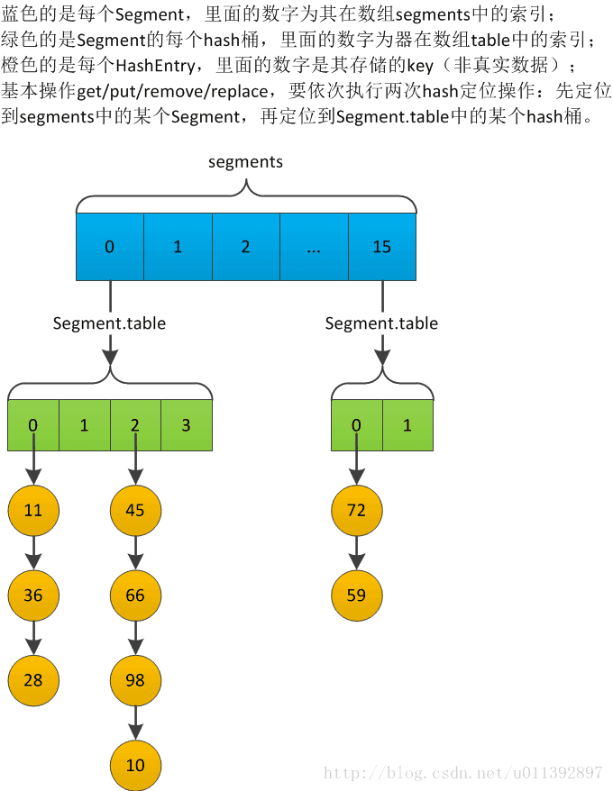

## 概览

Java容器主要包括 Collection 和 Map 两种，Collection 存储着对象的集合，而 Map 存储着键值对（两个对象）的映射表。

### fail-fast（快速失败）

**fail-fast 机制是java集合(Collection)中的一种错误机制。**使用迭代器遍历一个集合对象时，如果遍历过程中对集合对象的内容进行了修改（增加、删除、修改），则会抛出Concurrent Modification Exception。

**原理**：迭代器在遍历时直接访问集合中的内容，并且在遍历过程中使用modCount 变量。集合增加和删除元素，就会改变modCount的值（都是++，没有--）。每当迭代器使用next()遍历下一个元素之前，都会检测modCount和expectedmodCount是否相等，相等就返回遍历；否则抛出异常，终止遍历。

```java
// AbstractList 类的属性 modCount,调用add和remove方法,modCount会发生改变
protected transient int modCount = 0;
// 内部类,使用迭代器遍历
private class Itr implements Iterator<E> {
    // 迭代过程中的预期值 expectedModCount
    int expectedModCount = modCount;
    public E next() {
        checkForComodification(); // 检查集合是否发生改变
        int i = cursor;
        if (i >= size)
            throw new NoSuchElementException();
        Object[] elementData = ArrayList.this.elementData;
        if (i >= elementData.length)
            throw new ConcurrentModificationException();
        cursor = i + 1;
        return (E) elementData[lastRet = i];
    }
    // 迭代删除
    public void remove() {
        if (lastRet < 0)
            throw new IllegalStateException();
        checkForComodification(); 
        try {
            ArrayList.this.remove(lastRet);
            cursor = lastRet;
            lastRet = -1;
            // 迭代删除过程中会修改expectedModCount,所以不会报错
            expectedModCount = modCount;   
        } catch (IndexOutOfBoundsException ex) {
            throw new ConcurrentModificationException();
        }
    }
    // 如果 modCount不符合预期值,说明,集合被别的线程修改过,抛出异常
    final void checkForComodification() {
        if (modCount != expectedModCount)
            throw new ConcurrentModificationException();
    }
}
```


### fail-safe（安全失败）

采用安全失败机制的集合容器，在遍历时不是直接在原集合上进行访问，而是先复制原有集合，在拷贝的集合上进行遍历。

**原理**：由于迭代时是对原集合的拷贝进行遍历，所以在遍历过程中，原集合的修改不会对迭代产生影响，所以不会触发Concurrent Modification Exception。

**缺点**：（1）需要复制集合，产生大量的无效对象，开销大（2）无法保证读取的数据是当前集合中的数据，无法感知原集合的变化

## List

List中的元素是有序的、可重复的，主要实现方式有动态数组和链表。

### **ArrayList**

~~~java
// 基于数组实现的List  采用复制算法移动和扩容
public class ArrayList<E> extends AbstractList<E>
        implements List<E>, RandomAccess, Cloneable, java.io.Serializable {  
    private static final int DEFAULT_CAPACITY = 10; //默认容量
    private static final Object[] EMPTY_ELEMENTDATA = {}; //空集合
    // 默认构造为空集合
    private static final Object[] DEFAULTCAPACITY_EMPTY_ELEMENTDATA = {}; 
    transient Object[] elementData; // List元素数组
    private int size; // List大小
    // 根据容量构建相应的大小的Object数据
    public ArrayList(int initialCapacity) {
        if (initialCapacity > 0) { // 初始容量>0，创建对应大小的数组
            this.elementData = new Object[initialCapacity];
        } else if (initialCapacity == 0) { // 初始容量=0，空集合
            this.elementData = EMPTY_ELEMENTDATA;
        } else {
            throw new IllegalArgumentException("Illegal Capacity: " + initialCapacity);
        }
    } 
    // 构造方法，默认为{}空集合
    public ArrayList() {
        this.elementData = DEFAULTCAPACITY_EMPTY_ELEMENTDATA;
    }
    // Collection构造
    public ArrayList(Collection<? extends E> c) {
        elementData = c.toArray();
        if ((size = elementData.length) != 0) { 
            if (elementData.getClass() != Object[].class)
                // 复制算法复制元素
                elementData = Arrays.copyOf(elementData, size, Object[].class);
        } else { 
            this.elementData = EMPTY_ELEMENTDATA;
        }
    }  
}
~~~

**添加元素**

~~~java
	// 新增元素
    public boolean add(E e) {
        ensureCapacityInternal(size + 1);  // 扩容
        elementData[size++] = e; // 直接赋值
        return true;
    }
    // 在 index 位置插入元素
    public void add(int index, E element) {
        rangeCheckForAdd(index); // 检查index是否越界
        ensureCapacityInternal(size + 1);  // 扩容
        // 复制算法 把 index位置后的元素全部后移一位
        System.arraycopy(elementData, index, elementData, index + 1,size - index);
        elementData[index] = element;
        size++;
    }
~~~

**扩容**

~~~java
	// 计算扩容需要的容量
	private static int calculateCapacity(Object[] elementData, int minCapacity) {
        // 如果elementData为空，取minCapacity和默认容量(10)的较大值
        if (elementData == DEFAULTCAPACITY_EMPTY_ELEMENTDATA) {
            return Math.max(DEFAULT_CAPACITY, minCapacity);
        }
        return minCapacity;
    }
	// 扩容的最终方法 ，通过Arrays.copyOf实现
    private void grow(int minCapacity) { 
        int oldCapacity = elementData.length;
        // 每次扩容 50%
        int newCapacity = oldCapacity + (oldCapacity >> 1);
        if (newCapacity - minCapacity < 0)// 扩容50%后<需要的容量
            newCapacity = minCapacity; 
        if (newCapacity - MAX_ARRAY_SIZE > 0)// 扩容50%后>最大size
            newCapacity = hugeCapacity(minCapacity); 
        elementData = Arrays.copyOf(elementData, newCapacity);
    }
~~~

**删除元素**

~~~java
	// 移除第index个元素，
    public E remove(int index) {
        rangeCheck(index);// 检查index是否越界
        modCount++;
        E oldValue = elementData(index);
        int numMoved = size - index - 1;
        if (numMoved > 0)
            // 复制算法 把 index位置后的元素全部前移一位
            System.arraycopy(elementData, index+1, elementData, index,numMoved);
        elementData[--size] = null; // clear to let GC do its work
        return oldValue;
    }
	// 移除元素o，通过循环遍历，找到元素o然后移除
    public boolean remove(Object o) {
        if (o == null) {
            for (int index = 0; index < size; index++)
                if (elementData[index] == null) {
                    fastRemove(index);
                    return true;
                }
        } else {
            for (int index = 0; index < size; index++)
                if (o.equals(elementData[index])) { // 循环遍历移除元素o
                    fastRemove(index);
                    return true;
                }
        }
        return false;
    }
~~~

**修改元素**

~~~java
	// 替换元素
    public E set(int index, E element) {
        rangeCheck(index); // 检查index是否越界
        E oldValue = elementData(index);
        elementData[index] = element;
        return oldValue;
    } 
~~~

**查找元素**

~~~java
	// 返回list中索引为index的元素
    public E get(int index) {
        rangeCheck(index);  // 越界检查
        return elementData(index);
    }
	// 获取数组中的元素，并类型转换
	E elementData(int index) {
        return (E) elementData[index];
    }
~~~

### **Vector**

Vector的实现与ArrayList 类似，但是使用了synchronized 同步锁，保证线程安全

```java
public class Vector<E> extends AbstractList<E>
    implements List<E>, RandomAccess, Cloneable, java.io.Serializable {
    // 元素数组
    protected Object[] elementData;
    // 元素大小
    protected int elementCount;
    // 构造方法,初始容量+扩容量
    public Vector(int initialCapacity, int capacityIncrement) {
        super();
        if (initialCapacity < 0)
            throw new IllegalArgumentException("Illegal Capacity: " + initialCapacity);
        this.elementData = new Object[initialCapacity]; // 创建Object数组
        this.capacityIncrement = capacityIncrement;
    }
 	// 构造方法
    public Vector(int initialCapacity) {
        this(initialCapacity, 0);
    } 
    // 默认构造方法，容量为10
    public Vector() {
        this(10);
    }
    // Collection构造方法
    public Vector(Collection<? extends E> c) {
        elementData = c.toArray();
        elementCount = elementData.length; 
        if (elementData.getClass() != Object[].class)
            elementData = Arrays.copyOf(elementData, elementCount, Object[].class);
    } 
}
```

**添加元素**

~~~java
	// 新增元素,synchronized同步锁
    public synchronized boolean add(E e) {
        modCount++; 
        ensureCapacityHelper(elementCount + 1);// 扩容
        elementData[elementCount++] = e;
        return true;
    }
    // 在 index 位置插入元素
    public void add(int index, E element) {
        insertElementAt(element, index);
    }
	public synchronized void insertElementAt(E obj, int index) {
        modCount++;
        if (index > elementCount) { // 检查越界
            throw new ArrayIndexOutOfBoundsException(index  + " > " + elementCount);
        }
        ensureCapacityHelper(elementCount + 1); // 扩容
        // 通过复制算法 把 index位置后的元素全部后移一位
        System.arraycopy(elementData, index, elementData, index + 1, elementCount - index);
        elementData[index] = obj;
        elementCount++;
    }
~~~

**扩容**

~~~java
	// 扩容的最终方法,通过Arrays.copyOf实现
    private void grow(int minCapacity) { 
        int oldCapacity = elementData.length;
        // capacityIncrement > 0 每次扩容capacityIncrement,否则扩容100%
        int newCapacity = oldCapacity + ((capacityIncrement > 0) ? capacityIncrement : oldCapacity);
        if (newCapacity - minCapacity < 0)
            newCapacity = minCapacity;
        if (newCapacity - MAX_ARRAY_SIZE > 0)
            newCapacity = hugeCapacity(minCapacity);
        elementData = Arrays.copyOf(elementData, newCapacity);
    }
~~~

**删除元素**

~~~java
	// remove方法,移除第index个元素，使用synchronized同步锁
    public synchronized E remove(int index) {
        modCount++;
        if (index >= elementCount)
            throw new ArrayIndexOutOfBoundsException(index);
        E oldValue = elementData(index);
        int numMoved = elementCount - index - 1;
        if (numMoved > 0)
            // 通过arraycopy实现数据的移动
            System.arraycopy(elementData, index+1, elementData, index, numMoved);
        elementData[--elementCount] = null; // Let gc do its work

        return oldValue;
    }	
	// 移除第index个元素，
    public E remove(int index) {
        rangeCheck(index);// 检查index是否越界
        modCount++;
        E oldValue = elementData(index);
        int numMoved = size - index - 1;
        if (numMoved > 0)
            // 复制算法 把 index位置后的元素全部前移一位
            System.arraycopy(elementData, index+1, elementData, index,numMoved);
        elementData[--size] = null; // clear to let GC do its work
        return oldValue;
    }
	// 移除元素o，通过循环遍历，找到元素o然后移除
	public boolean remove(Object o) {
        return removeElement(o);
    }
	public synchronized boolean removeElement(Object obj) {
        modCount++;
        int i = indexOf(obj); // 循环遍历找到obj的位置
        if (i >= 0) {
            removeElementAt(i); // 移除i
            return true;
        }
        return false;
    }
~~~

**修改元素**

~~~java
	// 替换元素 
	public synchronized E set(int index, E element) {
        if (index >= elementCount) // 检查index是否越界
            throw new ArrayIndexOutOfBoundsException(index); 
        E oldValue = elementData(index);
        elementData[index] = element;
        return oldValue;
    }
~~~

**查找元素**

~~~java
	// get方法,返回Vector中索引为index的元素 ,synchronized同步锁
	public synchronized E get(int index) {
        if (index >= elementCount) // 越界检查
            throw new ArrayIndexOutOfBoundsException(index); 
        return elementData(index);
    }
	// 获取数组中的元素，并类型转换
	E elementData(int index) {
        return (E) elementData[index];
    }
~~~

**与ArrayList 的比较**

Vector 是同步的，因此开销就比ArrayList 要大，访问速度更慢。最好使用ArrayList 而不是Vector，因为同步操作完全可以由程序员自己来控制；

Vector 每次扩容请求其大小的2 倍空间 （可以通过构造函数设置增长的容量） ，而ArrayList 是1.5 倍。

**替代方案**

可以使用Collections.synchronizedList(); 得到一个线程安全的ArrayList。

```java
List<String> list = new ArrayList<>();
List<String> synList = Collections.synchronizedList(list); 
```

也可以使用concurrent 并发包下的CopyOnWriteArrayList 类。

```java
List<String> list = new CopyOnWriteArrayList<>();
```

### **LinkedList**

基于双向链表实现的List

```java
// java链表实现队列 List
public class LinkedList<E> extends AbstractSequentialList<E>
    implements List<E>, Deque<E>, Cloneable, java.io.Serializable {
    transient int size = 0;// List大小
    transient Node<E> first;// 头结点
    transient Node<E> last;// 尾结点
    // 内部类，双向链表的Node结点
    private static class Node<E> {
        E item;
        Node<E> next; // 后驱指针
        Node<E> prev; // 前驱指针
        Node(Node<E> prev, E element, Node<E> next) {
            this.item = element;
            this.next = next;
            this.prev = prev;
        }
    }
    // 构造方法
    public LinkedList() {
    }
    // Collection 构造方法
    public LinkedList(Collection<? extends E> c) {
        this();
        addAll(c);
    } 
    // 通过遍历 找到第index个结点，双向链表可以从两个方向遍历 
    Node<E> node(int index) { 
		// index < size/2 从前往后遍历
        if (index < (size >> 1)) {
            Node<E> x = first;
            for (int i = 0; i < index; i++)
                x = x.next;
            return x;
        } else { // 否则 从后往前遍历
            Node<E> x = last;
            for (int i = size - 1; i > index; i--)
                x = x.prev;
            return x;
        }
    }
}
```

**添加元素**

~~~java
	// 尾部添加元素
	public boolean add(E e) {
        linkLast(e); // 插入结点
        return true;
    }
	// 在last尾结点后添加结点
	void linkLast(E e) {
        final Node<E> l = last;
        final Node<E> newNode = new Node<>(l, e, null); // 根据元素e构建新结点
        last = newNode;
        if (l == null)
            first = newNode;
        else
            l.next = newNode;
        size++;
        modCount++;
    }
	// 在 index 位置插入元素
	public void add(int index, E element) {
        checkPositionIndex(index); // 检查越界
        if (index == size)
            linkLast(element); // 插入尾结点
        else
            linkBefore(element, node(index)); // 在结点index前插入新结点
    } 
	void linkBefore(E e, Node<E> succ) { 
        final Node<E> pred = succ.prev;
        final Node<E> newNode = new Node<>(pred, e, succ);
        succ.prev = newNode;
        if (pred == null)
            first = newNode;
        else
            pred.next = newNode;
        size++;
        modCount++;
    }
~~~

**删除元素**

~~~java
	// remove方法,移除第index个元素
	public E remove(int index) {
        checkElementIndex(index);
        return unlink(node(index));
    }
	// 删除结点x
    E unlink(Node<E> x) { 
        final E element = x.item;
        final Node<E> next = x.next;
        final Node<E> prev = x.prev; 
        if (prev == null) {
            first = next;
        } else {
            prev.next = next;
            x.prev = null;
        } 
        if (next == null) {
            last = prev;
        } else {
            next.prev = prev;
            x.next = null;
        } 
        x.item = null;
        size--;
        modCount++;
        return element;
    }
	// 移除第index个元素，
    public E remove(int index) {
        rangeCheck(index);// 检查index是否越界
        modCount++;
        E oldValue = elementData(index);
        int numMoved = size - index - 1;
        if (numMoved > 0)
            // 复制算法 把 index位置后的元素全部前移一位
            System.arraycopy(elementData, index+1, elementData, index,numMoved);
        elementData[--size] = null; // clear to let GC do its work
        return oldValue;
    }
	// 移除元素o，通过循环遍历，找到元素o然后移除
	public boolean remove(Object o) {
        if (o == null) {
            for (Node<E> x = first; x != null; x = x.next) {
                if (x.item == null) {
                    unlink(x);
                    return true;
                }
            }
        } else {
            for (Node<E> x = first; x != null; x = x.next) {
                if (o.equals(x.item)) {
                    unlink(x);
                    return true;
                }
            }
        }
        return false;
    } 
~~~

**修改元素**

~~~java
	// 替换元素  
	public E set(int index, E element) {
        checkElementIndex(index); // 检查index是否越界
        Node<E> x = node(index);
        E oldVal = x.item;
        x.item = element; // 替换index结点的item值，不是整个结点替换
        return oldVal;
    } 
~~~

**查找元素**

~~~java
	// get方法,返回索引为index的元素 
	public E get(int index) {
        checkElementIndex(index); // 校验index是否越界
        return node(index).item; // 遍历查询
    } 
~~~

**ArrayList 与LinkedList 的比较**

* **数据结构**:  ArrayList 和LinkedList 都实现了List接口，ArrayList 基于动态数组实现， LinkedList 基于双向链表；
* **插入和删除**:  ArrayList 采用动态数组存储，插入和删除中间的元素会导致数组元素的移动，插入和删除的时间复杂度会受到元素位置的影响； LinkedList采用链表存储，所以插入，删除元素时间复杂度不受元素位置的影响，都是近似 O（1）而数组为近似 O（n）。 
* **内存占用**:  ArrayList 是动态数组，需要预留一部分空间为之后的插入准备；LinkedList 每个结点都会存储前驱和后继两个指针；

### **CopyOnWriteArrayList**

线程安全的List，采用数组存储，通过ReentrantLock保证线程安全

```java
public class CopyOnWriteArrayList<E>
    implements List<E>, RandomAccess, Cloneable, java.io.Serializable {
    /** 通过重入锁保证线程安全 */
    final transient ReentrantLock lock = new ReentrantLock();
    /** 通过数组记录元素，并通过volatile保证可见性 */
    private transient volatile Object[] array;
    // set方法，给array赋值
    final void setArray(Object[] a) {
        array = a;
    }
 	// 默认构造方法，创建空集合
    public CopyOnWriteArrayList() {
        setArray(new Object[0]);
    }
 	// Collection构造方法
    public CopyOnWriteArrayList(Collection<? extends E> c) {
        Object[] elements;
        // 把Collection转换为数组
        if (c.getClass() == CopyOnWriteArrayList.class)
            elements = ((CopyOnWriteArrayList<?>)c).getArray();
        else {
            elements = c.toArray(); 
            if (elements.getClass() != Object[].class)
                elements = Arrays.copyOf(elements, elements.length, Object[].class);
        }
        setArray(elements);
    } 
    public CopyOnWriteArrayList(E[] toCopyIn) {
        setArray(Arrays.copyOf(toCopyIn, toCopyIn.length, Object[].class));
    }
    
    // get操作，通过volatile保证可见性 
    public E get(int index) {
        return get(getArray(), index);
    }
    private E get(Object[] a, int index) {
        return (E) a[index];
    }
}
```

**添加元素**

~~~java
	// 新增元素
    public boolean add(E e) {
        ensureCapacityInternal(size + 1);  // 扩容
        elementData[size++] = e; // 直接赋值
        return true;
    }
	// 新增元素，通过ReentrantLock保证线程安全 
    public boolean add(E e) {
        final ReentrantLock lock = this.lock;
        lock.lock(); // 获得锁
        try {
            Object[] elements = getArray();
            int len = elements.length;
            // 每次把原来的数组复制到新数组，新数组大小是旧数组大小加1
            Object[] newElements = Arrays.copyOf(elements, len + 1);
            newElements[len] = e; // 将元素e放到最后
            // 每次重新赋值
            setArray(newElements);
            return true;
        } finally {
            lock.unlock();// 释放锁
        }
    }
    // 在 index 位置插入元素
	public void add(int index, E element) {
        final ReentrantLock lock = this.lock;
        lock.lock(); // 获得锁
        try {
            Object[] elements = getArray();
            int len = elements.length;
            if (index > len || index < 0) // 检查index是否越界
                throw new IndexOutOfBoundsException("Index: "+index+ ", Size: "+len);
            Object[] newElements;
            int numMoved = len - index;
            // 如果不需要移动元素，直接复制
            if (numMoved == 0)
                newElements = Arrays.copyOf(elements, len + 1);
            else {
                // 如果需要移动元素(在中间进行插入) ，先创建len + 1大小的数组
                newElements = new Object[len + 1];
                // 把旧数组0~index位置的元素复制到新数组
                System.arraycopy(elements, 0, newElements, 0, index);
                // 把旧数组index~最后位置的元素复制到新数组index+1位置
                System.arraycopy(elements, index, newElements, index + 1, numMoved);
            }
            // index位置赋值
            newElements[index] = element;
            setArray(newElements);
        } finally {
            lock.unlock(); // 释放锁
        }
    }
~~~

**删除元素**

~~~java
	// 移除第index个元素
	public E remove(int index) {
        final ReentrantLock lock = this.lock;
        lock.lock(); // 获得锁
        try {
            Object[] elements = getArray();
            int len = elements.length;
            E oldValue = get(elements, index);
            int numMoved = len - index - 1;
            // 如果不需要移动元素，直接复制0~len-1到新数组
            if (numMoved == 0)
                setArray(Arrays.copyOf(elements, len - 1));
            else {
                // 如果需要移动元素(在中间进行删除) ，先创建len - 1大小的数组
                Object[] newElements = new Object[len - 1];
                // 把旧数组0~index位置的元素复制到新数组
                System.arraycopy(elements, 0, newElements, 0, index);
                // 把旧数组index+1~最后位置的元素复制到新数组index位置 
                System.arraycopy(elements, index + 1, newElements, index, numMoved);
                setArray(newElements);
            }
            return oldValue;
        } finally {
            lock.unlock(); // 释放锁
        }
    }
~~~

**修改元素**

~~~java
	// 替换元素
    public E set(int index, E element) {
        final ReentrantLock lock = this.lock;
        lock.lock(); // 获得锁
        try {
            Object[] elements = getArray();
            E oldValue = get(elements, index); 
            if (oldValue != element) {
                int len = elements.length;
                // 把旧数组全部复制，然后在新数组上修改index
                Object[] newElements = Arrays.copyOf(elements, len);
                newElements[index] = element;
                setArray(newElements);
            } else { 
                setArray(elements);
            }
            return oldValue;
        } finally {
            lock.unlock(); // 释放锁
        }
    }
~~~

**查找元素**

~~~java
	// 返回list中索引为index的元素
	public E get(int index) { 
        return get(getArray(), index);
    }
	// 获取数组中的元素，并类型转换 
	private E get(Object[] a, int index) {
        return (E) a[index];
    }
~~~

## Queue

队列是一种特殊的**线性表**，特殊之处在于它只允许在表的前端（front）进行删除操作，而在表的后端（rear）进行插入操作，和栈一样，队列是一种操作受限制的线性表。进行插入操作的端称为队尾，进行删除操作的端称为队首。

和栈一样，队列也有两种实现方式，数组和链表

### **PriorityQueue**

优先级队列，通过构造堆结构使最大（最小）元素先出队，使用数组进行存储；[详解](https://www.cnblogs.com/Elliott-Su-Faith-change-our-life/p/7472265.html)

~~~java
public class PriorityQueue<E> extends AbstractQueue<E> implements java.io.Serializable {
    // 默认容量11
	private static final int DEFAULT_INITIAL_CAPACITY = 11;
 	// 队列元素，数组集合
    transient Object[] queue;  
    private int size = 0;
    // 比较策略
    private final Comparator<? super E> comparator;
    // 默认构造方法
    public PriorityQueue() {
        this(DEFAULT_INITIAL_CAPACITY, null);
    }
    public PriorityQueue(int initialCapacity) {
        this(initialCapacity, null);
    } 
    public PriorityQueue(Comparator<? super E> comparator) {
        this(DEFAULT_INITIAL_CAPACITY, comparator);
    } 
    public PriorityQueue(int initialCapacity, Comparator<? super E> comparator) { 
        if (initialCapacity < 1)
            throw new IllegalArgumentException();
        this.queue = new Object[initialCapacity];
        this.comparator = comparator;
    }  
}
~~~

**入队**

~~~java
public boolean offer(E e) {
    if (e == null)
        throw new NullPointerException();
    modCount++;
    int i = size;
    if (i >= queue.length)
        grow(i + 1); // 扩容
    size = i + 1;
    if (i == 0)
        queue[0] = e;
    else
        siftUp(i, e); // 有序入队
    return true;
} 
// 构造最小(大)堆，保证堆顶元素最小(大) 
private void siftUp(int k, E x) {
    if (comparator != null) // 不同的比较策略
        siftUpUsingComparator(k, x);
    else
        siftUpComparable(k, x);
}
// 通过比较(利用堆的特性)把元素x 放到数组的指定位置
private void siftUpUsingComparator(int k, E x) {
    while (k > 0) {
        // 无符号右移，相当于 除以2，目的: 通过构建最小堆，把最小值放到0位置
        int parent = (k - 1) >>> 1; // 父结点
        Object e = queue[parent];
        if (comparator.compare(x, (E) e) >= 0)
            break;
        queue[k] = e; // x如果比位置k的元素小，后移
        k = parent;
    }
    // 构建最小堆，把x放入堆中，保证顶点元素最小 
    queue[k] = x;
}
~~~

**扩容**

~~~java
// 扩容
private void grow(int minCapacity) {
    int oldCapacity = queue.length; 
    // < 64 扩容翻倍 + 2，否则扩容50%
    int newCapacity = oldCapacity + ((oldCapacity < 64) ? (oldCapacity + 2) :  (oldCapacity >> 1));
    // 检查是否溢出
    if (newCapacity - MAX_ARRAY_SIZE > 0)
        newCapacity = hugeCapacity(minCapacity); // 计算扩容需要的容量
    // 通过复制算法把原数据复制到新队列
    queue = Arrays.copyOf(queue, newCapacity);
}
// 计算扩容需要的容量
private static int hugeCapacity(int minCapacity) {
    if (minCapacity < 0) // overflow
        throw new OutOfMemoryError();
    return (minCapacity > MAX_ARRAY_SIZE) ?  Integer.MAX_VALUE :  MAX_ARRAY_SIZE;
}
~~~

**出队**

实际上就是把堆顶的元素移除，然后通过堆的特性重新选出堆顶

~~~java
public E poll() {
    if (size == 0)
        return null;
    int s = --size;
    modCount++;
    E result = (E) queue[0]; // 堆顶元素
    E x = (E) queue[s];
    queue[s] = null;
    if (s != 0)
        siftDown(0, x); // 重新选出堆顶
    return result;
}
// 重新选出堆顶
private void siftDown(int k, E x) {
    if (comparator != null) // 不同的比较策略
        siftDownUsingComparator(k, x);
    else
        siftDownComparable(k, x);
}
// 从0开始，比较两个子结点，重新选出堆顶
private void siftDownUsingComparator(int k, E x) {
    int half = size >>> 1;
    while (k < half) {
        int child = (k << 1) + 1; // 左子结点
        Object c = queue[child];
        int right = child + 1; // 右子结点
        if (right < size && comparator.compare((E) c, (E) queue[right]) > 0)
            c = queue[child = right];
        if (comparator.compare(x, (E) c) <= 0)
            break;
        // c和child是左右两个子结点中较小（大）的元素，移动到父结点
        queue[k] = c;
        k = child;  
    }
    queue[k] = x;
}
~~~


**取队首元素**

~~~java
// 取队首元素 始终是数组第0个元素
public E peek() {
    return (size == 0) ? null : (E) queue[0];
}
~~~


### **ConcurrentLinkedQueue**

线程安全的队列

~~~java
public class ConcurrentLinkedQueue<E> extends AbstractQueue<E>
        implements Queue<E>, java.io.Serializable {
    // 内部类Node 结点 -- 单向链表    
    private static class Node<E> {
        volatile E item;
        volatile Node<E> next; 
        Node(E item) {
            UNSAFE.putObject(this, itemOffset, item);
        } 
        // CAS操作
        boolean casItem(E cmp, E val) {
            return UNSAFE.compareAndSwapObject(this, itemOffset, cmp, val);
        }

        void lazySetNext(Node<E> val) {
            UNSAFE.putOrderedObject(this, nextOffset, val);
        }
		// CAS next结点
        boolean casNext(Node<E> cmp, Node<E> val) {
            return UNSAFE.compareAndSwapObject(this, nextOffset, cmp, val);
        }
        private static final sun.misc.Unsafe UNSAFE;
        private static final long itemOffset;
        private static final long nextOffset;
        static {
            try {
                UNSAFE = sun.misc.Unsafe.getUnsafe();
                Class<?> k = Node.class;
                // 直接取内存地址偏移量
                itemOffset = UNSAFE.objectFieldOffset(k.getDeclaredField("item"));
                nextOffset = UNSAFE.objectFieldOffset(k.getDeclaredField("next"));
            } catch (Exception e) {
                throw new Error(e);
            }
        }
    }
	// 头结点
    private transient volatile Node<E> head;
	// 尾结点
    private transient volatile Node<E> tail;
    public ConcurrentLinkedQueue() { head = tail = new Node<E>(null);}
    // 入队
    public boolean offer(E e) {
        checkNotNull(e);
        final Node<E> newNode = new Node<E>(e);
        for (Node<E> t = tail, p = t;;) { // 自旋，找到尾结点
            Node<E> q = p.next; 
            if (q == null) { // 确定是尾结点
            	// 通过CAS把当前结点设位 p结点的next
                if (p.casNext(null, newNode)) {
                    // 成功，通过CAS将 newNode 设置为 tail 结点
                    if (p != t) // hop two nodes at a time
                        casTail(t, newNode);  // Failure is OK.
                    return true;
                }
                 
            } else if (p == q)
                p = (t != (t = tail)) ? t : head;
            else 
                p = (p != t && t != (t = tail)) ? t : q;
        }
    }
	// 出队
    public E poll() {
        restartFromHead: //goto,跳出循环
        for (;;) {
            for (Node<E> h = head, p = h, q;;) {
                E item = p.item; 
                if (item != null && p.casItem(item, null)) {
                  
                    if (p != h) // hop two nodes at a time
                        updateHead(h, ((q = p.next) != null) ? q : p);
                    return item;
                }
                else if ((q = p.next) == null) {
                    updateHead(h, p);
                    return null;
                }
                else if (p == q)
                    continue restartFromHead;
                else
                    p = q;
            }
        }
    }
}
~~~

## **BlockingQueue**

**阻塞队列**：一个指定长度的队列，如果队列满了，添加新元素的操作会被阻塞等待，直到有空位为止。同样，当队列为空时候，请求队列元素的操作同样会阻塞等待，直到有可用元素为止。 

~~~java
// 阻塞队列接口BlockingQueue
public interface BlockingQueue<E> extends Queue<E> {
    // 元素入队，队列为满时阻塞
    void put(E e) throws InterruptedException;
    // 元素入队,带有超时机制
    boolean offer(E e, long timeout, TimeUnit unit) throws InterruptedException;
    // 元素出队，队列为空时阻塞   
    E take() throws InterruptedException;
    // 元素出队,带有超时机制
    E poll(long timeout, TimeUnit unit) throws InterruptedException;
}
~~~

### ArrayBlockingQueue

~~~java
// 阻塞队列 数组实现
public class ArrayBlockingQueue<E> extends AbstractQueue<E>
		implements BlockingQueue<E>, java.io.Serializable { 
    final Object[] items;// 数组元素集合，循环队列
    int takeIndex;// head元素指针，指向数组中head的位置 
    int putIndex;// tail元素指针，指向数组中tail的位置
    int count; // 队列元素个数
    // 重入锁，保证线程安全   
    final ReentrantLock lock;
    // 通过Condition，出队时，队列如果为空，take方法阻塞 
    private final Condition notEmpty;
    // 通过Condition，入队时，队列如果满了，put方法阻塞
    private final Condition notFull;
    // 元素入队，队列为满时阻塞
    public void put(E e) throws InterruptedException {
        checkNotNull(e);
        final ReentrantLock lock = this.lock;
        lock.lockInterruptibly(); // 加锁
        try {
            while (count == items.length) // 队列元素已满
                notFull.await(); // 阻塞，等待
            enqueue(e);
        } finally {
            lock.unlock(); // 释放锁
        }
    }
    // 元素入队,带有超时机制
    public boolean offer(E e, long timeout, TimeUnit unit)
        throws InterruptedException {
        checkNotNull(e);
        long nanos = unit.toNanos(timeout); // 超时时间
        final ReentrantLock lock = this.lock;
        lock.lockInterruptibly(); // 加锁
        try {
            while (count == items.length) { // 队列元素已满
                if (nanos <= 0)
                    return false;
                nanos = notFull.awaitNanos(nanos); // 阻塞，等待时长为 nanos
            }
            enqueue(e);
            return true;
        } finally {
            lock.unlock(); // 释放锁
        }
    }
    // 元素出队，队列为空时阻塞
    public E take() throws InterruptedException {
        final ReentrantLock lock = this.lock;
        lock.lockInterruptibly(); // 加锁
        try {
            while (count == 0) // 队列元素为空
                notEmpty.await(); // 阻塞，等待
            return dequeue();
        } finally {
            lock.unlock(); // 释放锁
        }
    }
	// 元素出队,带有超时机制
    public E poll(long timeout, TimeUnit unit) throws InterruptedException {
        long nanos = unit.toNanos(timeout); // 超时时间
        final ReentrantLock lock = this.lock;
        lock.lockInterruptibly(); // 加锁
        try {
            while (count == 0) {// 队列元素为空
                if (nanos <= 0)
                    return null;
                nanos = notEmpty.awaitNanos(nanos);// 阻塞，等待时长为 nanos
            }
            return dequeue();
        } finally {
            lock.unlock(); // 释放锁
        }
    }
    // 入队，唤醒notEmpty 
    private void enqueue(E x) { 
        final Object[] items = this.items;
        items[putIndex] = x;
        if (++putIndex == items.length)
            putIndex = 0;
        count++;
        notEmpty.signal(); // 入队，唤醒notEmpty 
    }
    // 出队，唤醒notFull
    private E dequeue() { 
        final Object[] items = this.items;
        @SuppressWarnings("unchecked")
        E x = (E) items[takeIndex];
        items[takeIndex] = null;
        if (++takeIndex == items.length)
            takeIndex = 0;
        count--;
        if (itrs != null)
            itrs.elementDequeued();
        notFull.signal();// 出队，唤醒notFull
        return x;
    }
}
~~~

### LinkedBlockingQueue

~~~java
// 阻塞队列 链表实现
public class LinkedBlockingQueue<E> extends AbstractQueue<E> 
		implements BlockingQueue<E>, java.io.Serializable {
    // 队列元素，单链表    
    static class Node<E> {
        E item; 
        Node<E> next;
        Node(E x) { item = x; }
    }
   	// 队列容量 
    private final int capacity;
	// 队列大小
    private final AtomicInteger count = new AtomicInteger();
	// 队首结点
    transient Node<E> head;
	// 队尾结点
    private transient Node<E> last;
 	// take锁和take Condition
    private final ReentrantLock takeLock = new ReentrantLock();
    private final Condition notEmpty = takeLock.newCondition();
	// put锁和put Condition
    private final ReentrantLock putLock = new ReentrantLock();
    private final Condition notFull = putLock.newCondition();   
    // 元素入队，队列为满时阻塞
    public void put(E e) throws InterruptedException {
        if (e == null) throw new NullPointerException(); 
        int c = -1;
        Node<E> node = new Node<E>(e);
        final ReentrantLock putLock = this.putLock;
        final AtomicInteger count = this.count;
        putLock.lockInterruptibly(); // 加锁
        try { 
            while (count.get() == capacity) { // 队列元素已满
                notFull.await(); // 阻塞，等待 
            }
            enqueue(node);
            c = count.getAndIncrement();
            if (c + 1 < capacity)
                notFull.signal();
        } finally {
            putLock.unlock(); // 释放锁
        }
        if (c == 0)
            signalNotEmpty(); // 唤醒notEmpty 
    }
	// 元素入队,带有超时机制
    public boolean offer(E e, long timeout, TimeUnit unit)
        throws InterruptedException {

        if (e == null) throw new NullPointerException();
        long nanos = unit.toNanos(timeout);
        int c = -1;
        final ReentrantLock putLock = this.putLock;
        final AtomicInteger count = this.count;
        putLock.lockInterruptibly(); // 加锁
        try {
            while (count.get() == capacity) { // 队列元素已满
                if (nanos <= 0)
                    return false;
                nanos = notFull.awaitNanos(nanos); // 阻塞，等待时长为 nanos
            }
            enqueue(new Node<E>(e));
            c = count.getAndIncrement();  //count 是原子类，多线程下能保证可见性
            if (c + 1 < capacity)
                notFull.signal(); // 别的线程出队导致队列不满，singal唤醒
        } finally {
            putLock.unlock(); // 释放锁
        }
        if (c == 0)
            signalNotEmpty(); // 唤醒 notEmpty 
        return true;
    }
    // 元素出队，队列为空时阻塞
    public E take() throws InterruptedException {
        E x;
        int c = -1;
        final AtomicInteger count = this.count;
        final ReentrantLock takeLock = this.takeLock;
        takeLock.lockInterruptibly(); // 加锁
        try {
            while (count.get() == 0) { // 队列元素为空
                notEmpty.await(); // 阻塞，等待 
            }
            x = dequeue();
            c = count.getAndDecrement();
            if (c > 1) //count 是原子类，多线程下能保证可见性
                notEmpty.signal();// 别的线程出队导致队列不为空，singal唤醒
        } finally {
            takeLock.unlock(); // 释放锁
        }
        if (c == capacity)
            signalNotFull();  // 唤醒 notFull 
        return x;
    }
	// 元素出队,带有超时机制
    public E poll(long timeout, TimeUnit unit) throws InterruptedException {
        E x = null;
        int c = -1;
        long nanos = unit.toNanos(timeout);
        final AtomicInteger count = this.count;
        final ReentrantLock takeLock = this.takeLock;
        takeLock.lockInterruptibly(); // 加锁
        try {
            while (count.get() == 0) { // 队列元素为空
                if (nanos <= 0)
                    return null;
                nanos = notEmpty.awaitNanos(nanos); // 阻塞，等待时长为 nanos
            }
            x = dequeue();
            c = count.getAndDecrement();
            if (c > 1)
                notEmpty.signal();
        } finally {
            takeLock.unlock(); // 释放锁
        }
        if (c == capacity)
            signalNotFull(); // 唤醒 notFull 
        return x;
    }
}
~~~


## Deque

Deque：双向队列，支持两端操作；支持先入先出和后入先出，可以同时试下栈和队列的操作；

~~~java
// 双向队列接口
public interface Deque<E> extends Queue<E> {
    // 头尾新增元素 无返回
    void addFirst(E e);
    void addLast(E e);
	// 头尾元素入队 有返回
    boolean offerFirst(E e)
    boolean offerLast(E e);
	// 头尾删除元素
    E removeFirst();
    E removeLast();
	// 头尾元素出队
    E pollFirst(); 
    E pollLast();
	// 头尾获取元素
    E getFirst(); 
    E getLast();
	// 头尾查看元素
    E peekFirst(); 
    E peekLast();
}
~~~

### **ArrayDeque**

 基于数组结构实现的双向队列 

~~~java
// java数组实现队列接口
public class ArrayDeque<E> extends AbstractCollection<E> implements Deque<E>, Cloneable, Serializable {
    transient Object[] elements;// 数组元素集合，循环队列
    transient int head; // head元素指针，指向数组中head的位置 
    transient int tail; // tail元素指针，指向数组中tail的位置 
 	// 最小初始容量
    private static final int MIN_INITIAL_CAPACITY = 8;
    // 默认构造方法，构造长度为16的数组
    public ArrayDeque() {
        elements = new Object[16];
    } 
    public ArrayDeque(int numElements) {
        allocateElements(numElements);
    } 
    public ArrayDeque(Collection<? extends E> c) {
        allocateElements(c.size());
        addAll(c);
    }
    // 初始化数组
    private void allocateElements(int numElements) {
        elements = new Object[calculateSize(numElements)];
    }
    // 计算容量 这段代码的逻辑是算出大于numElements的最接近的2的n次方且不小于8
    private static int calculateSize(int numElements) {
        int initialCapacity = MIN_INITIAL_CAPACITY; 
        if (numElements >= initialCapacity) {
            initialCapacity = numElements;
            initialCapacity |= (initialCapacity >>>  1);
            initialCapacity |= (initialCapacity >>>  2);
            initialCapacity |= (initialCapacity >>>  4);
            initialCapacity |= (initialCapacity >>>  8);
            initialCapacity |= (initialCapacity >>> 16);
            initialCapacity++; 
            if (initialCapacity < 0)    
                initialCapacity >>>= 1; 
        }
        return initialCapacity;
    }
}
~~~

**入队**

~~~java
// 队首新增元素
public void addFirst(E e) {
    if (e == null)
        throw new NullPointerException();
    // head - 1 左移一位     
    elements[head = (head - 1) & (elements.length - 1)] = e;
    if (head == tail) // head  tail相遇，说明数组已满
        doubleCapacity(); // 扩容
}
// 队尾新增元素
public void addLast(E e) {
    if (e == null)
        throw new NullPointerException();
    elements[tail] = e;
    // tail + 1 右移一位     
    if ( (tail = (tail + 1) & (elements.length - 1)) == head) // head  tail相遇，说明数组已满
        doubleCapacity();// 扩容
}
~~~

**扩容**

~~~java
// 扩容
private void doubleCapacity() {
    assert head == tail;
    int p = head;
    int n = elements.length;
    int r = n - p; // 头指针到数组末尾的元素个数
    int newCapacity = n << 1; // 扩容1倍
    if (newCapacity < 0)
        throw new IllegalStateException("Sorry, deque too big");
    // 创建新数组
    Object[] a = new Object[newCapacity];
    // 复制 head到数组末尾的元素
    System.arraycopy(elements, p, a, 0, r);
    // 复制 0~head-1的元素
    System.arraycopy(elements, 0, a, r, p);
    elements = a;
    head = 0;
    tail = n;
} 
~~~

**出队**

~~~java
// 从队列头出队
public E pollFirst() {
    int h = head;
    @SuppressWarnings("unchecked")
    // 取队列头元素
    E result = (E) elements[h];
    // 队列头为空
    if (result == null)
        return null;
    elements[h] = null;     // 出队,把队头赋值为空
    // 队列头指针右移一位
    head = (h + 1) & (elements.length - 1);
    return result;
} 
// 从队列尾出队
public E pollLast() {
	// 队列尾指针左移一位
    int t = (tail - 1) & (elements.length - 1);
    @SuppressWarnings("unchecked")
    E result = (E) elements[t];
    // 队列尾为空
    if (result == null)
        return null;
    elements[t] = null; // 出队,把队尾赋值为空
    tail = t;
    return result;
}	
~~~

**取队首元素**

~~~java
// 取队首元素 head指针的位置
public E peekFirst() { 
    return (E) elements[head];
}
// 取队尾元素 tail指针左移一位的位置
@SuppressWarnings("unchecked")
public E peekLast() {
    return (E) elements[(tail - 1) & (elements.length - 1)];
}
~~~

**栈**

入栈和出栈都在 队列头执行

~~~java
// 入栈
public void push(E e) {
    addFirst(e);
} 
// 出栈
public E pop() {
    return removeFirst();
}
~~~

### **LinkedList**

链表实现队列

~~~java
// java链表实现队列
public class LinkedList<E> extends AbstractSequentialList<E>
    implements List<E>, Deque<E>, Cloneable, java.io.Serializable {
    transient int size = 0;// 队列大小
    transient Node<E> first;// 头结点
    transient Node<E> last;// 尾结点 
    // 内部类，双向链表的Node结点
    private static class Node<E> {
        E item;
        Node<E> next; // 后驱指针
        Node<E> prev; // 前驱指针
        Node(Node<E> prev, E element, Node<E> next) {
            this.item = element;
            this.next = next;
            this.prev = prev;
        }
    }
    // 构造方法
    public LinkedList() {
    }
    // Collection 构造方法
    public LinkedList(Collection<? extends E> c) {
        this();
        addAll(c);
    } 
    // 插入新结点First
    private void linkFirst(E e) {
        final Node<E> f = first;
        final Node<E> newNode = new Node<>(null, e, f); // 根据元素e构建新结点
        first = newNode;
        if (f == null)
            last = newNode;
        else
            f.prev = newNode;
        size++;
        modCount++;
    }
    // 移除头结点
    private E unlinkFirst(Node<E> f) { 
        final E element = f.item;
        final Node<E> next = f.next;
        f.item = null;
        f.next = null; // help GC
        first = next;
        if (next == null)
            last = null;
        else
            next.prev = null;
        size--;
        modCount++;
        return element;
    }
}
~~~

**入队**

~~~java
// 队首新增结点
public boolean offerFirst(E e) {
    addFirst(e);
    return true;
}
public void addFirst(E e) {
    linkFirst(e);
} 
private void linkFirst(E e) {
    final Node<E> f = first;
    final Node<E> newNode = new Node<>(null, e, f);// 根据元素e构建新结点
    first = newNode;
    if (f == null)
        last = newNode;
    else
        f.prev = newNode;
    size++;
    modCount++;
} 
// 队尾新增结点 
public boolean offerLast(E e) {
    addLast(e);
    return true;
}
public void addLast(E e) {
    linkLast(e);
} 
void linkLast(E e) {
    final Node<E> l = last;
    final Node<E> newNode = new Node<>(l, e, null);// 根据元素e构建新结点
    last = newNode;
    if (l == null)
        first = newNode;
    else
        l.next = newNode;
    size++;
    modCount++;
}
~~~

**出队**

~~~java
// 从队列头出队 
public E pollFirst() {
    final Node<E> f = first;
    return (f == null) ? null : unlinkFirst(f);
}
private E unlinkFirst(Node<E> f) {
    // assert f == first && f != null;
    final E element = f.item;
    final Node<E> next = f.next;
    f.item = null;
    f.next = null; // help GC
    first = next; // 把first指针指向first的next结点
    if (next == null)
        last = null;
    else
        next.prev = null;
    size--;
    modCount++;
    return element;
} 
// 从队列尾出队 
public E pollLast() {
    final Node<E> l = last;
    return (l == null) ? null : unlinkLast(l);
}
private E unlinkLast(Node<E> l) {
    // assert l == last && l != null;
    final E element = l.item;
    final Node<E> prev = l.prev;
    l.item = null;
    l.prev = null; // help GC
    last = prev;  // 把last指针指向last的prev结点
    if (prev == null)
        first = null;
    else
        prev.next = null;
    size--;
    modCount++;
    return element;
}
~~~

**取队首元素**

~~~java
// 取队首元素 first指针  
public E peekFirst() {
    final Node<E> f = first;
    return (f == null) ? null : f.item;
} 
// 取队尾元素 last指针 
public E peekLast() {
    final Node<E> l = last;
    return (l == null) ? null : l.item;
} 
~~~

**栈**

入栈和出栈都在队列头执行

~~~java
// 入栈
public void push(E e) {
    addFirst(e);
} 
// 出栈
public E pop() {
    return removeFirst();
}
~~~

## **BlockingDeque**

：双向阻塞队列

~~~java
// 阻塞双向队列接口
public interface BlockingDeque<E> extends BlockingQueue<E>, Deque<E> {
	// 头尾新增元素 队列为满时阻塞    
    void putFirst(E e) throws InterruptedException;
    void putLast(E e) throws InterruptedException;
	// 头尾元素入队,带有超时机制
    boolean offerFirst(E e, long timeout, TimeUnit unit) throws InterruptedException; 
    boolean offerLast(E e, long timeout, TimeUnit unit) throws InterruptedException;
 	// 头尾元素出队，队列为空时阻塞  
    E takeFirst() throws InterruptedException;
    E takeLast() throws InterruptedException;
 	// 头尾元素出队,带有超时机制
    E pollFirst(long timeout, TimeUnit unit) throws InterruptedException;
    E pollLast(long timeout, TimeUnit unit) throws InterruptedException;
}
~~~

### LinkedBlockingDeque

~~~java
public class LinkedBlockingDeque<E> extends AbstractQueue<E>
    implements BlockingDeque<E>, java.io.Serializable {
    // 内部类，Node结点 双向链表
    static final class Node<E> {
        E item;
        Node<E> prev;
        Node<E> next;
        Node(E x) { item = x;}
    }
    // 头结点
    transient Node<E> first;
    // 尾结点
    transient Node<E> last;
    // 队列长度
    private transient int count;
    // 队列容量
    private final int capacity;
    // 重入锁，保证线程安全
    final ReentrantLock lock = new ReentrantLock();
    // 通过Condition，出队时，队列如果为空，take方法阻塞 
    private final Condition notEmpty = lock.newCondition();
    // 通过Condition，入队时，队列如果满了，put方法阻塞
    private final Condition notFull = lock.newCondition();
    // 尾部元素入队,带有超时机制
    public boolean offerLast(E e, long timeout, TimeUnit unit)
        throws InterruptedException {
        if (e == null) throw new NullPointerException();
        Node<E> node = new Node<E>(e);
        long nanos = unit.toNanos(timeout); // 超时时间
        final ReentrantLock lock = this.lock;
        lock.lockInterruptibly(); // 加锁
        try {
            while (!linkLast(node)) { // 当入队失败时，队列已满
                if (nanos <= 0)
                    return false;
                nanos = notFull.awaitNanos(nanos);// 阻塞，等待时长为 nanos
            }
            return true;
        } finally {
            lock.unlock(); // 释放锁
        }
    }
    // 队尾新增元素，新增失败时阻塞
    public void putLast(E e) throws InterruptedException {
        if (e == null) throw new NullPointerException();
        Node<E> node = new Node<E>(e);
        final ReentrantLock lock = this.lock;
        lock.lock(); // 加锁
        try {
            while (!linkLast(node)) // 当入队失败时，队列已满
                notFull.await(); // 阻塞，等待
        } finally {
            lock.unlock(); // 释放锁
        }
    }
    // 获取队尾元素，获取失败时阻塞
    public E takeLast() throws InterruptedException {
        final ReentrantLock lock = this.lock;
        lock.lock();// 加锁
        try {
            E x;
            while ( (x = unlinkLast()) == null) // 当获取队尾元素为null,队列为空
                notEmpty.await();// 阻塞，等待
            return x;
        } finally {
            lock.unlock();// 释放锁
        }
    }

    public E pollLast(long timeout, TimeUnit unit)
        throws InterruptedException {
        long nanos = unit.toNanos(timeout);// 超时时间
        final ReentrantLock lock = this.lock;
        lock.lockInterruptibly();// 加锁
        try {
            E x;
            while ( (x = unlinkLast()) == null) {// 当获取队尾元素为null,队列为空
                if (nanos <= 0)
                    return null;
                nanos = notEmpty.awaitNanos(nanos);// 阻塞，等待时长为 nanos
            }
            return x;
        } finally {
            lock.unlock();// 释放锁
        }
    }
}
~~~


## Set

Set对应于数学概念上的集合，集合中的元素是不可重复的 

### HashSet

使用HashMap来确保元素不重复 

~~~java
public class HashSet<E> extends AbstractSet<E> implements Set<E>, Cloneable, java.io.Serializable {
  	// 内部是通过HashMap实现的
    private transient HashMap<E,Object> map; 
    // 构造一个Object常量充当HashMap的Value
    private static final Object PRESENT = new Object();
 
    public int size() { return map.size();} 
    public boolean isEmpty() { return map.isEmpty(); }
    // 默认构造方法，通过创建新的HashMap实现Set去重功能 
   	public HashSet() {
        map = new HashMap<>();
    } 
    public HashSet(Collection<? extends E> c) {
        map = new HashMap<>(Math.max((int) (c.size()/.75f) + 1, 16));
        addAll(c);
    } 
    public HashSet(int initialCapacity, float loadFactor) {
        map = new HashMap<>(initialCapacity, loadFactor);
    } 
    public HashSet(int initialCapacity) {
        map = new HashMap<>(initialCapacity);
    } 
    HashSet(int initialCapacity, float loadFactor, boolean dummy) {
        map = new LinkedHashMap<>(initialCapacity, loadFactor);
    } 
}
~~~

**添加元素**

直接调用HashMap的put方法，把元素e作为key，把PRESENT作为value 

~~~java
public boolean add(E e) {
    return map.put(e, PRESENT)==null;
}
~~~

**删除元素**

调用HashMap的remove方法

~~~java
public boolean remove(Object o) {
    return map.remove(o)==PRESENT;
}
~~~

**查找元素**

调用HashMap的containsKey方法

~~~java
public boolean contains(Object o) { 
    return map.containsKey(o); 
} 
~~~

### TreeSet

默认基于TreeMap实现去重

~~~java
public class TreeSet<E> extends AbstractSet<E> implements NavigableSet<E>, Cloneable, java.io.Serializable {
 	// NavigableMap是一个接口类，默认通过TreeMap实现
    private transient NavigableMap<E,Object> m; 
    // 构造一个Object常量充当Map的Value
    private static final Object PRESENT = new Object();
    TreeSet(NavigableMap<E,Object> m) {
        this.m = m;
    }
 	// 默认构造方法，构造一个TreeMap
    public TreeSet() {
        this(new TreeMap<E,Object>());
    } 
    public TreeSet(Comparator<? super E> comparator) {
        this(new TreeMap<>(comparator));
    } 
    public TreeSet(Collection<? extends E> c) {
        this();
        addAll(c);
    } 
    public TreeSet(SortedSet<E> s) {
        this(s.comparator());
        addAll(s);
    } 
    public int size() { return m.size(); } 
    public boolean isEmpty() { return m.isEmpty(); } 
}
~~~

**添加元素**

直接调用NavigableMap接口（默认实现是TreeMap）的put方法，把元素e作为key，把PRESENT作为value 

~~~java
public boolean add(E e) {
    return m.put(e, PRESENT)==null;
}
~~~

**删除元素**

调用NavigableMap接口（默认实现是TreeMap）的remove方法

~~~java
public boolean remove(Object o) {
    return m.remove(o)==PRESENT;
}
~~~

**查找元素**

调用NavigableMap接口（默认实现是TreeMap）的containsKey方法

~~~java
public boolean contains(Object o) { 
    return m.containsKey(o); 
} 
~~~

 

ConcurrentSkipListSet，CopyOnWriteArraySet

## Map

Map 接口定义的集合又称为查找表，用于存储所谓"key-value"映射对。Key可以看成是Value 的索引，作为key的对象在集合中不可重复。

### **EnumMap**

EnumMap是针对枚举类作为Key的Map,枚举类的实例对象会有index

~~~java
public class EnumMap<K extends Enum<K>, V> extends AbstractMap<K, V>
    implements java.io.Serializable, Cloneable { // 主键必须是枚举类
    private final Class<K> keyType;
    private transient K[] keyUniverse; // 枚举Key数组
    private transient Object[] vals; // val数组
    private transient int size = 0; // 集合大小
    // 构造函数，必须传入枚举类的Class
    public EnumMap(Class<K> keyType) {
        this.keyType = keyType;
        // 通过枚举类Class可以确定key数组,和每个key的值
        keyUniverse = getKeyUniverse(keyType); 
        vals = new Object[keyUniverse.length]; // val数组
    }
    public V put(K key, V value) {
        typeCheck(key);  // 校验key的类型
        int index = key.ordinal(); //获取key在枚举常量的声明顺序(第几个声明的)
        Object oldValue = vals[index];
        vals[index] = maskNull(value);
        if (oldValue == null)
            size++;
        return unmaskNull(oldValue);
    }
    public V get(Object key) {
        return (isValidKey(key) ?  // 校验key的类型
                unmaskNull(vals[((Enum<?>)key).ordinal()]) : null);
    }
    public V remove(Object key) {
        if (!isValidKey(key)) // 校验key的类型
            return null;
        int index = ((Enum<?>)key).ordinal(); // 获取key的Index，枚举中的顺序
        Object oldValue = vals[index];
        vals[index] = null;  // 置为null
        if (oldValue != null)
            size--;
        return unmaskNull(oldValue);
    }
}
~~~

### **HashMap**

HashMap通过Node<K,V>数组+链表（红黑树）实现的key-value数据结构，每个Node有自己的key,value

~~~java
public class HashMap<K,V> extends AbstractMap<K,V>
    implements Map<K,V>, Cloneable, Serializable {
    static final int DEFAULT_INITIAL_CAPACITY = 1 << 4; // 默认容量 16
    static final int MAXIMUM_CAPACITY = 1 << 30; // 最大容量 2^30
    static final float DEFAULT_LOAD_FACTOR = 0.75f; // 默认扩容因子0.75
    // 当链表元素个数到达8时，转化为红黑树
    static final int TREEIFY_THRESHOLD = 8;
 	// 树中元素个数小于等于6时，由红黑树转位链表
    static final int UNTREEIFY_THRESHOLD = 6;
 	// 
    static final int MIN_TREEIFY_CAPACITY = 64;
    transient Node<K,V>[] table; // Node数组 需要注意：table的大小始终是2^n
    transient int size; // 集合大小
    // 扩容阈值，当元素个数达到多少时进行扩容，threshold = capacity * loadFactor
	int threshold;
    // 内部类，Node结点，单向链表
    static class Node<K,V> implements Map.Entry<K,V> {
        final int hash; // hash值
        final K key;
        V value;
        Node<K,V> next; // next结点，单向链表
        Node(int hash, K key, V value, Node<K,V> next) {
            this.hash = hash;
            this.key = key;
            this.value = value;
            this.next = next;
        }
        public final int hashCode() {
            return Objects.hashCode(key) ^ Objects.hashCode(value);
        }
        public final V setValue(V newValue) {
            V oldValue = value;
            value = newValue;
            return oldValue;
        }
    }
    // 内部类，TreeNode结点，红黑树
    static final class TreeNode<K,V> extends LinkedHashMap.Entry<K,V> {
        TreeNode<K,V> parent;  // 父节点
        TreeNode<K,V> left;    // 左子节点
        TreeNode<K,V> right;   // 右子节点
        TreeNode<K,V> prev;    // needed to unlink next upon deletion
        boolean red;           // 颜色：红或黑
        TreeNode(int hash, K key, V val, Node<K,V> next) {
            super(hash, key, val, next);
        }
    }
    // 构造方法
    public HashMap(int initialCapacity, float loadFactor) {
        if (initialCapacity < 0)
            throw new IllegalArgumentException("Illegal initial capacity: " +  initialCapacity);
        if (initialCapacity > MAXIMUM_CAPACITY)
            initialCapacity = MAXIMUM_CAPACITY;
        if (loadFactor <= 0 || Float.isNaN(loadFactor))
            throw new IllegalArgumentException("Illegal load factor: " +  loadFactor);
        this.loadFactor = loadFactor;
        // 计算扩容阈值
        this.threshold = tableSizeFor(initialCapacity);
    } 
    public HashMap(int initialCapacity) {
        this(initialCapacity, DEFAULT_LOAD_FACTOR);
    } 
    public HashMap() {
        this.loadFactor = DEFAULT_LOAD_FACTOR; // all other fields defaulted
    } 
    public HashMap(Map<? extends K, ? extends V> m) {
        this.loadFactor = DEFAULT_LOAD_FACTOR;
        putMapEntries(m, false);
    }
}
~~~

**put方法**

~~~java
public V put(K key, V value) {
    return putVal(hash(key), key, value, false, true);
}
final V putVal(int hash, K key, V value, boolean onlyIfAbsent,boolean evict) {
    Node<K,V>[] tab; Node<K,V> p; int n, i;
    if ((tab = table) == null || (n = tab.length) == 0)
        n = (tab = resize()).length;// 如果table为空，resize()
    // (n - 1) & hash n为2的幂 n-1 转为2进制 - 15 ——> 1111 所有位都是1    
    // (n - 1) & hash 与运算，结果肯定在 0 - n-1 之间
    if ((p = tab[i = (n - 1) & hash]) == null) // 如果table数组下标位置没有元素
        tab[i] = newNode(hash, key, value, null); // 创建新元素
    else {
        Node<K,V> e; K k;
        if (p.hash == hash &&  // hash 相等，key也相等
            ((k = p.key) == key || (key != null && key.equals(k))))
            e = p;
        else if (p instanceof TreeNode) // 如果当前节点为红黑树，红黑树插入结点
            e = ((TreeNode<K,V>)p).putTreeVal(this, tab, hash, key, value);
        else { // 链表
            for (int binCount = 0; ; ++binCount) {
                if ((e = p.next) == null) { // 遍历链表，
                    p.next = newNode(hash, key, value, null);// 尾部新增一个结点
                    if (binCount >= TREEIFY_THRESHOLD - 1) // 如果链表长度过长(当前没有执行 ++binCount )
                        treeifyBin(tab, hash); // 将当前链表转为红黑树
                    break;
                }
                // 找到 hash 相等，key也相等 的 节点 e break
                if (e.hash == hash &&
                    ((k = e.key) == key || (key != null && key.equals(k))))
                    break;
                p = e;
            }
        }
        // 找到 hash 相等，key也相等的节点 e
        if (e != null) {  
            V oldValue = e.value;
            if (!onlyIfAbsent || oldValue == null)
                e.value = value; // value重新赋值
            afterNodeAccess(e); // 空方法，LinkedHashMap中重写
            return oldValue;
        }
    }
    ++modCount;
    if (++size > threshold) // 当前size大于扩容阈值
        resize(); // 扩容
    afterNodeInsertion(evict); // 空方法，LinkedHashMap中重写
    return null;
} 
~~~

**hash算法**

~~~java
// 取hash
static final int hash(Object key) {
    int h; // 高16位和低16位做异或运算，保证hash的离散性
    // 设想一下，如果n很小，假设为16的话，那么n-1即为15（0000 0000 0000 0000 0000 0000 0000 1111），
    // 这样的值如果跟hashCode()直接做与操作，实际上只使用了哈希值的后4位。如果当哈希值的高位变化很大，低位变化很小，
    // 这样很容易造成碰撞，所以把高低位都参与到计算中，从而解决了这个问题，而且也不会有太大的开销。
    return (key == null) ? 0 : (h = key.hashCode()) ^ (h >>> 16);
}
// 根据hash计算tab数组的下标 i = (n - 1) & hash
// 由于n始终是2的整数次方，n-1的二进制都为1 如15(1111) ;一个数和15做与运算，可以去掉15的最高位之前的数字
// 这样[与运算]可以实现和取模相同的效果
if ((p = tab[i = (n - 1) & hash]) == null)  
    tab[i] = newNode(hash, key, value, null); 
~~~

**扩容**

~~~java
// 对table进行初始化或者扩容。
// 如果table为null，则对table进行初始化
// 如果对table扩容，因为每次扩容都是翻倍，与原来计算（n-1）&hash的结果相比，
// 节点要么就在原来的位置,要么就被分配到“原位置+旧容量”这个位置。
final Node<K,V>[] resize() {
    // 新建oldTab数组保存扩容前的数组table
    Node<K,V>[] oldTab = table;
    int oldCap = (oldTab == null) ? 0 : oldTab.length; // 当前数组大小
    int oldThr = threshold; // 扩容阈值
    int newCap, newThr = 0;
    if (oldCap > 0) {
        if (oldCap >= MAXIMUM_CAPACITY) {
            threshold = Integer.MAX_VALUE;
            return oldTab;
        }
        else if ((newCap = oldCap << 1) < MAXIMUM_CAPACITY && // newCap = 原容量翻倍
                 oldCap >= DEFAULT_INITIAL_CAPACITY)
            newThr = oldThr << 1; // 扩容阈值翻倍
    }
    else if (oldThr > 0) // oldCap == 0 && oldThr > 0 说明计算了扩容阈值，但是table没有初始化
        newCap = oldThr;
    else {               // 默认构造
        newCap = DEFAULT_INITIAL_CAPACITY;
        newThr = (int)(DEFAULT_LOAD_FACTOR * DEFAULT_INITIAL_CAPACITY);
    }
    if (newThr == 0) {
        float ft = (float)newCap * loadFactor;
        newThr = (newCap < MAXIMUM_CAPACITY && ft < (float)MAXIMUM_CAPACITY ?
                  (int)ft : Integer.MAX_VALUE);
    }
    threshold = newThr; // 扩容阈值重新赋值
    @SuppressWarnings({"rawtypes","unchecked"})
    Node<K,V>[] newTab = (Node<K,V>[])new Node[newCap];
    table = newTab;
    // 如果旧table不为空，将旧table中的元素复制到新的table中
    if (oldTab != null) {
        // 遍历旧哈希表，将旧哈希表中的数据复制到新的哈希表中
        for (int j = 0; j < oldCap; ++j) {
            Node<K,V> e;
            if ((e = oldTab[j]) != null) {
                oldTab[j] = null;
                if (e.next == null)
                    // 重新取hash位置
                    newTab[e.hash & (newCap - 1)] = e;
                else if (e instanceof TreeNode)
                    // 将树中的node分离
                    ((TreeNode<K,V>)e).split(this, newTab, j, oldCap);
                else { // 链表
                    // 因为每次扩容都是翻倍，与原来计算(n-1)&hash的结果相比，
                    // 节点要么就在原来的位置,要么就被分配到“原位置+旧容量”这个位置。
                    // 所以构建两个链表(loTail和hiTail),loTail在原来的位置,hiTail在“原位置+旧容量”的位置
                    Node<K,V> loHead = null, loTail = null;
                    Node<K,V> hiHead = null, hiTail = null;
                    Node<K,V> next;
                    do {
                        next = e.next;
                        if ((e.hash & oldCap) == 0) {
                            if (loTail == null)
                                loHead = e;
                            else
                                loTail.next = e;
                            loTail = e;
                        }
                        else {
                            if (hiTail == null)
                                hiHead = e;
                            else
                                hiTail.next = e;
                            hiTail = e;
                        }
                    } while ((e = next) != null);
                    if (loTail != null) {
                        loTail.next = null;
                        newTab[j] = loHead; // 低位链表
                    }
                    if (hiTail != null) {
                        hiTail.next = null;
                        newTab[j + oldCap] = hiHead;// 高位链表
                    }
                }
            }
        }
    }
    return newTab;
}
~~~

**get方法**

~~~java
public V get(Object key) {
    Node<K,V> e;
    return (e = getNode(hash(key), key)) == null ? null : e.value;
} 
final Node<K,V> getNode(int hash, Object key) {
    Node<K,V>[] tab; Node<K,V> first, e; int n; K k;
    if ((tab = table) != null && (n = tab.length) > 0 &&
        (first = tab[(n - 1) & hash]) != null) {// 根据hash找到数组的下标
        if (first.hash == hash && // first结点 hash 相等，key也相等 
            ((k = first.key) == key || (key != null && key.equals(k))))
            return first;
        if ((e = first.next) != null) { // 存在后续结点
            if (first instanceof TreeNode) // 如果是红黑树，通过红黑树查询
                return ((TreeNode<K,V>)first).getTreeNode(hash, key);
            do {
                // 遍历链表 找到 hash 相等,key也相等 的结点
                if (e.hash == hash &&
                    ((k = e.key) == key || (key != null && key.equals(k))))
                    return e;
            } while ((e = e.next) != null);
        }
    }
    return null;
}

~~~

**remove方法**

~~~java
public V remove(Object key) {
    Node<K,V> e;
    return (e = removeNode(hash(key), key, null, false, true)) == null ?
        null : e.value;
}
final Node<K,V> removeNode(int hash, Object key, Object value, boolean matchValue, boolean movable) {
    Node<K,V>[] tab; Node<K,V> p; int n, index;
    if ((tab = table) != null && (n = tab.length) > 0 &&
        (p = tab[index = (n - 1) & hash]) != null) { // 根据hash找到数组的下标
        Node<K,V> node = null, e; K k; V v;
        if (p.hash == hash && // 第一个结点 hash 相等，key也相等 
            ((k = p.key) == key || (key != null && key.equals(k))))
            node = p;
        else if ((e = p.next) != null) { // 存在后续结点
            if (p instanceof TreeNode) // 如果是红黑树，通过红黑树查询
                node = ((TreeNode<K,V>)p).getTreeNode(hash, key);
            else {
                do {
                    // 遍历链表 找到 hash 相等,key也相等 的结点
                    if (e.hash == hash &&
                        ((k = e.key) == key ||
                         (key != null && key.equals(k)))) {
                        node = e;
                        break;
                    }
                    p = e;
                } while ((e = e.next) != null);
            }
        }
        // node 不为null
        if (node != null && (!matchValue || (v = node.value) == value ||
                             (value != null && value.equals(v)))) {
            if (node instanceof TreeNode) // 移除红黑树中的结点
                ((TreeNode<K,V>)node).removeTreeNode(this, tab, movable);
            else if (node == p)
                tab[index] = node.next;
            else
                p.next = node.next;
            ++modCount;
            --size;
            afterNodeRemoval(node); // 空方法，LinkedHashMap中重写
            return node;
        }
    }
    return null;
} 
~~~


### **Hashtable**

Hashtable使用synchronized 来进行同步

~~~java
public class Hashtable<K,V> extends Dictionary<K,V>
    implements Map<K,V>, Cloneable, java.io.Serializable {
    private transient Entry<?,?>[] table;  // table
    private transient int count;    
    private int threshold;   // 扩容阈值
    private float loadFactor;// 扩容因子
    private static class Entry<K,V> implements Map.Entry<K,V> {
        final int hash;
        final K key;
        V value;
        Entry<K,V> next; // next结点，单向链表
        protected Entry(int hash, K key, V value, Entry<K,V> next) {
            this.hash = hash;
            this.key =  key;
            this.value = value;
            this.next = next;
        }
    }
    // 构造方法
    public Hashtable(int initialCapacity, float loadFactor) {
        if (initialCapacity < 0)
            throw new IllegalArgumentException("Illegal Capacity: " + initialCapacity);
        if (loadFactor <= 0 || Float.isNaN(loadFactor))
            throw new IllegalArgumentException("Illegal Load: "+loadFactor); 
        if (initialCapacity==0)
            initialCapacity = 1;
        this.loadFactor = loadFactor;
        table = new Entry<?,?>[initialCapacity];
        threshold = (int)Math.min(initialCapacity * loadFactor, MAX_ARRAY_SIZE + 1);
    } 
    public Hashtable(int initialCapacity) {
        this(initialCapacity, 0.75f);
    }
 	// 默认构造方法 数组长度11，扩容因子0.75
    public Hashtable() {
        this(11, 0.75f);
    } 
    public Hashtable(Map<? extends K, ? extends V> t) {
        this(Math.max(2*t.size(), 11), 0.75f);
        putAll(t);
    }
}
~~~

**put方法**

使用synchronized同步锁，保证线程安全

~~~java
public synchronized V put(K key, V value) { 
    if (value == null) { // 不能插入null
        throw new NullPointerException();
    } 
    Entry<?,?> tab[] = table;
    int hash = key.hashCode();
    int index = (hash & 0x7FFFFFFF) % tab.length;// 通过取模找到hash下标
    Entry<K,V> entry = (Entry<K,V>)tab[index];
    for(; entry != null ; entry = entry.next) { // 遍历链表
        if ((entry.hash == hash) && entry.key.equals(key)) {
            V old = entry.value;
            entry.value = value; // value重新赋值
            return old;
        }
    }
    addEntry(hash, key, value, index);
    return null;
}
// 添加元素
private void addEntry(int hash, K key, V value, int index) {
    modCount++; 
    Entry<?,?> tab[] = table;
    if (count >= threshold) { 
        rehash(); // 扩容并重新hash
        tab = table;
        hash = key.hashCode();
        index = (hash & 0x7FFFFFFF) % tab.length;
    } 
    // Creates the new entry.
    @SuppressWarnings("unchecked")
    Entry<K,V> e = (Entry<K,V>) tab[index];
    // 把就结点e 作为新结点 的next结点新建一个Entry结点;相当于把新结点插入到链表的最前端
    tab[index] = new Entry<>(hash, key, value, e);
    count++;
}
~~~

**hash算法**

~~~java
// 取hash
int hash = key.hashCode();
// 通过取模计算当前key在数组中的下标index
int index = (hash & 0x7FFFFFFF) % tab.length; 
~~~

**扩容**

~~~java
protected void rehash() {
    int oldCapacity = table.length;
    Entry<?,?>[] oldMap = table; 
    // 旧容量翻倍+1
    int newCapacity = (oldCapacity << 1) + 1;
    if (newCapacity - MAX_ARRAY_SIZE > 0) {
        if (oldCapacity == MAX_ARRAY_SIZE)
            // Keep running with MAX_ARRAY_SIZE buckets
            return;
        newCapacity = MAX_ARRAY_SIZE;
    }
    Entry<?,?>[] newMap = new Entry<?,?>[newCapacity]; 
    modCount++;
    threshold = (int)Math.min(newCapacity * loadFactor, MAX_ARRAY_SIZE + 1);
    table = newMap;
	// 遍历所有元素，重新hash放入数组
    for (int i = oldCapacity ; i-- > 0 ;) {
        for (Entry<K,V> old = (Entry<K,V>)oldMap[i] ; old != null ; ) {
            Entry<K,V> e = old;
            old = old.next; 
            int index = (e.hash & 0x7FFFFFFF) % newCapacity; // 重新计算下标
            e.next = (Entry<K,V>)newMap[index];
            newMap[index] = e;
        }
    }
} 
~~~

**get方法**

使用synchronized同步锁，保证线程安全

~~~java
public synchronized V get(Object key) {
    Entry<?,?> tab[] = table;
    int hash = key.hashCode();
    int index = (hash & 0x7FFFFFFF) % tab.length; // 计算下标
    for (Entry<?,?> e = tab[index] ; e != null ; e = e.next) {
        if ((e.hash == hash) && e.key.equals(key)) {
            return (V)e.value;
        }
    }
    return null;
}
~~~

**remove方法**

使用synchronized同步锁，保证线程安全

~~~java
public synchronized V remove(Object key) {
    Entry<?,?> tab[] = table;
    int hash = key.hashCode();
    int index = (hash & 0x7FFFFFFF) % tab.length;
    @SuppressWarnings("unchecked")
    Entry<K,V> e = (Entry<K,V>)tab[index];
    for(Entry<K,V> prev = null ; e != null ; prev = e, e = e.next) {
        if ((e.hash == hash) && e.key.equals(key)) {
            modCount++;
            if (prev != null) { // 删除链表结点
                prev.next = e.next;
            } else {
                tab[index] = e.next;
            }
            count--;
            V oldValue = e.value;
            e.value = null;
            return oldValue;
        }
    }
    return null;
}
~~~

### HashMap和Hashtable

Hashtable和HashMap都是key-value的映射集合

* 数据结构：Hashtable与 HashMap都采用数组+链表的结构存储数据，HashMap在链表长度超过8时会将链表转换为红黑树，提高查询效率
* 线程安全：Hashtable的方法都有synchronized修饰，所以Hashtable线程安全的，HashMap是非线程安全的
* 性能：由于Hashtable有synchronized修饰，HashMap 性能较好
* Hashtable 是不允许key或value为 null 的，HashMap 的key和value则都可以为 null
* Hashtable的默认容量是11，HashMap的默认容量是16，扩容因子都是0.75，Hashtable扩容后的容量2n+1，HashMap是2n；
* Hashtable的hash算法是求余法，HashMap是与运算(容量必须是2的整数次幂)


### **TreeMap**

TreeMap实际是一棵红黑树

~~~java
public class TreeMap<K,V> extends AbstractMap<K,V>
    implements NavigableMap<K,V>, Cloneable, java.io.Serializable {
    private transient Entry<K,V> root; // 根结点
    private transient int size = 0; // 集合大小
    // 红黑树结点
    static final class Entry<K,V> implements Map.Entry<K,V> {
        K key;
        V value;
        Entry<K,V> left; // 左子结点
        Entry<K,V> right; // 右子结点
        Entry<K,V> parent; // 父结点
        boolean color = BLACK; // 红色还是黑树
        Entry(K key, V value, Entry<K,V> parent) {
            this.key = key;
            this.value = value;
            this.parent = parent;
        }
    }
    // 构造方法
    public TreeMap() {
        comparator = null;
    } 
    public TreeMap(Comparator<? super K> comparator) {
        this.comparator = comparator;
    } 
    public TreeMap(Map<? extends K, ? extends V> m) {
        comparator = null;
        putAll(m);
    } 
    public TreeMap(SortedMap<K, ? extends V> m) {
        comparator = m.comparator();
        try {
            buildFromSorted(m.size(), m.entrySet().iterator(), null, null);
        } catch (java.io.IOException cannotHappen) {
        } catch (ClassNotFoundException cannotHappen) {
        }
    }
}
~~~

**put方法**

使用synchronized同步锁，保证线程安全

~~~java
public V put(K key, V value) {
    Entry<K,V> t = root;
    if (t == null) { // 如果root结点为null
        compare(key, key); 
        root = new Entry<>(key, value, null); // 设置当前插入的结点为root
        size = 1;
        modCount++;
        return null;
    }
    int cmp;
    Entry<K,V> parent; 
    Comparator<? super K> cpr = comparator;
    if (cpr != null) { // Comparator 参数不为空
        do {
            parent = t;
            cmp = cpr.compare(key, t.key);
            if (cmp < 0) // 小于0,左子结点
                t = t.left;
            else if (cmp > 0) // 大于0,右子结点
                t = t.right;
            else // 等于0,说明当前结点key和put的key一样
                return t.setValue(value);
        } while (t != null);
    } else {
        if (key == null)
            throw new NullPointerException(); 
        Comparable<? super K> k = (Comparable<? super K>) key;
        do {
            parent = t;
            cmp = k.compareTo(t.key);
            if (cmp < 0)
                t = t.left;
            else if (cmp > 0)
                t = t.right;
            else
                return t.setValue(value);
        } while (t != null);
    }
    Entry<K,V> e = new Entry<>(key, value, parent);
    if (cmp < 0)
        parent.left = e;
    else
        parent.right = e;
    fixAfterInsertion(e); // 修正红黑树
    size++;
    modCount++;
    return null;
}
~~~

**get方法**

~~~java
public V get(Object key) {
    Entry<K,V> p = getEntry(key);
    return (p==null ? null : p.value);
}
final Entry<K,V> getEntry(Object key) { 
    if (comparator != null)
        return getEntryUsingComparator(key);
    if (key == null)
        throw new NullPointerException();
    @SuppressWarnings("unchecked")
    Comparable<? super K> k = (Comparable<? super K>) key;
    Entry<K,V> p = root;
    // 二叉查找树的查找方法
    while (p != null) {
        int cmp = k.compareTo(p.key);
        if (cmp < 0) // <0,向左查询
            p = p.left;
        else if (cmp > 0)// >0,向右查询
            p = p.right;
        else
            return p;
    }
    return null;
}
~~~

**remove方法**

~~~java
public V remove(Object key) {
    Entry<K,V> p = getEntry(key); // 找到结点
    if (p == null)
        return null;
    V oldValue = p.value;
    deleteEntry(p);
    return oldValue;
}
private void deleteEntry(Entry<K,V> p) {
    modCount++;
    size--;

    // If strictly internal, copy successor's element to p and then make p
    // point to successor.
    if (p.left != null && p.right != null) {
        Entry<K,V> s = successor(p);
        p.key = s.key;
        p.value = s.value;
        p = s;
    } // p has 2 children

    // Start fixup at replacement node, if it exists.
    Entry<K,V> replacement = (p.left != null ? p.left : p.right);

    if (replacement != null) {
        // Link replacement to parent
        replacement.parent = p.parent;
        if (p.parent == null)
            root = replacement;
        else if (p == p.parent.left)
            p.parent.left  = replacement;
        else
            p.parent.right = replacement;

        // Null out links so they are OK to use by fixAfterDeletion.
        p.left = p.right = p.parent = null;

        // Fix replacement
        if (p.color == BLACK)
            fixAfterDeletion(replacement);
    } else if (p.parent == null) { // return if we are the only node.
        root = null;
    } else { //  No children. Use self as phantom replacement and unlink.
        if (p.color == BLACK)
            fixAfterDeletion(p);

        if (p.parent != null) {
            if (p == p.parent.left)
                p.parent.left = null;
            else if (p == p.parent.right)
                p.parent.right = null;
            p.parent = null;
        }
    }
}
~~~


### **LinkedHashMap**

LinkedHashMap继承了HashMap，维护了一个双向链表，记录put的顺序

~~~java
public class LinkedHashMap<K,V> extends HashMap<K,V> implements Map<K,V> {
    // 内部类，HashMap.Node的子类，实现一个双向链表
    static class Entry<K,V> extends HashMap.Node<K,V> {
        Entry<K,V> before, after;
        Entry(int hash, K key, V value, Node<K,V> next) {
            super(hash, key, value, next);
        }
    } 
    transient LinkedHashMap.Entry<K,V> head; // 链表head结点
    transient LinkedHashMap.Entry<K,V> tail; // 链表tail结点
    // 重写父类方法 移除Node后执行
    void afterNodeRemoval(Node<K,V> e) { // unlink
        LinkedHashMap.Entry<K,V> p =
            (LinkedHashMap.Entry<K,V>)e, b = p.before, a = p.after;
        p.before = p.after = null;
        if (b == null)
            head = a;
        else
            b.after = a;
        if (a == null)
            tail = b;
        else
            a.before = b;
    }
	// 重写父类方法 新增Node后执行
    void afterNodeAccess(Node<K,V> e) { // move node to last
        LinkedHashMap.Entry<K,V> last;
        if (accessOrder && (last = tail) != e) {
            LinkedHashMap.Entry<K,V> p = // p为当前结点，
                (LinkedHashMap.Entry<K,V>)e, b = p.before, a = p.after;
            p.after = null;
            if (b == null)
                head = a;
            else
                b.after = a;
            if (a != null)
                a.before = b;
            else
                last = b;
            if (last == null)
                head = p;
            else {
                p.before = last;
                last.after = p;
            }
            tail = p; // 把新插入的结点置于队尾
            ++modCount;
        }
    }
}
~~~

IdentityHashMap， WeakHashMap

### **ConcurrentHashMap**

~~~java
public class ConcurrentHashMap<K,V> extends AbstractMap<K,V>
    implements ConcurrentMap<K,V>, Serializable {
    transient volatile Node<K,V>[] table; // Node数组
    private transient volatile Node<K,V>[] nextTable; // 扩容数组
    private transient volatile CounterCell[] counterCells; // 元素数量数组
    public V put(K key, V value) {
        return putVal(key, value, false);
    }
    // 获取key的hash值 32位的hashCode 前16位和后16位做^(异或运算)，
    static final int spread(int h) {
        return (h ^ (h >>> 16)) & HASH_BITS;
    }
    final V putVal(K key, V value, boolean onlyIfAbsent) {
        if (key == null || value == null) 
            throw new NullPointerException();
        // 获取key的hash值 32位的hashCode 前16位和后16位做^(异或运算)，
        // 尽快能保证hash 不重复，离散性高
        int hash = spread(key.hashCode());
        int binCount = 0;
        // 自旋，直到成功 高并发 table 有 volatile 修饰，保证可见性
        for (Node<K,V>[] tab = table;;) {
            Node<K,V> f; int n, i, fh;
            if (tab == null || (n = tab.length) == 0)
                tab = initTable(); // 初始化数组
                // (n - 1) & hash  key映射数组的下标
                // 注意f 在这里赋值了
            else if ((f = tabAt(tab, i = (n - 1) & hash)) == null) {
                // 如果这个位置为空，通过cas直接复制
                if (casTabAt(tab, i, null,
                             new Node<K,V>(hash, key, value, null)))
                    break;                 
            }
            // f.hash == -1 说明有其他线程对数组进行扩容
            else if ((fh = f.hash) == MOVED)
                // 帮助扩容
                tab = helpTransfer(tab, f);
            else {
                // 找到hash结点
                V oldVal = null;
                synchronized (f) { // 锁住这个结点
                    // 再次判断，防止别的线程修改，如果不等，会重新循环
                    if (tabAt(tab, i) == f) {
                        if (fh >= 0) { // fh >= 0 说明结点是链表
                            binCount = 1;
                            // 遍历这个链表，找到key对应的结点
                            for (Node<K,V> e = f;; ++binCount) {
                                K ek;
                                if (e.hash == hash &&
                                    ((ek = e.key) == key ||
                                     (ek != null && key.equals(ek)))) {
                                    oldVal = e.val;
                                    // 如果目标key和当前结点key相同，赋值
                                    if (!onlyIfAbsent)
                                        e.val = value;
                                    break;
                                }
                                Node<K,V> pred = e;
                                
                                if ((e = e.next) == null) {
                                    // 如果目标key和链表中所有结点key都不同，
                                    // 创建一个新结点放到链表尾部
                                    pred.next = new Node<K,V>(hash, key,
                                                              value, null);
                                    break;
                                }
                            }
                        }
                        // 判断结点是不是红黑树
                        else if (f instanceof TreeBin) {
                            Node<K,V> p;
                            binCount = 2;
                            // 红黑树put
                            if ((p = ((TreeBin<K,V>)f).putTreeVal(hash, key,
                                                           value)) != null) {
                                oldVal = p.val;
                                if (!onlyIfAbsent)
                                    p.val = value;
                            }
                        }
                    }
                }
                if (binCount != 0) {
                    //如果链表长度已经达到临界值8 就需要把链表转换为红黑树
                    if (binCount >= TREEIFY_THRESHOLD)
                        treeifyBin(tab, i);
                    if (oldVal != null)
                        return oldVal;
                    break;
                }
            }
        }
        addCount(1L, binCount);
        return null;
    } 
    
    public V get(Object key) {
        Node<K,V>[] tab; Node<K,V> e, p; int n, eh; K ek;
        int h = spread(key.hashCode());  //获取hash
        if ((tab = table) != null && (n = tab.length) > 0 &&
            (e = tabAt(tab, (n - 1) & h)) != null) {
            if ((eh = e.hash) == h) {
                if ((ek = e.key) == key || (ek != null && key.equals(ek)))
                    return e.val;
            }
            else if (eh < 0)
                return (p = e.find(h, key)) != null ? p.val : null;
            while ((e = e.next) != null) {
                if (e.hash == h &&
                    ((ek = e.key) == key || (ek != null && key.equals(ek))))
                    return e.val;
            }
        }
        return null;
    }
    // 计算元素个数
    private final void addCount(long x, int check) {
        CounterCell[] as; long b, s;
        if ((as = counterCells) != null ||
            !U.compareAndSwapLong(this, BASECOUNT, b = baseCount, s = b + x)) {
            CounterCell a; long v; int m;
            boolean uncontended = true;
            if (as == null || (m = as.length - 1) < 0 ||
                (a = as[ThreadLocalRandom.getProbe() & m]) == null ||
                !(uncontended =
                  U.compareAndSwapLong(a, CELLVALUE, v = a.value, v + x))) {
                fullAddCount(x, uncontended);
                return;
            }
            if (check <= 1)
                return;
            s = sumCount();
        }
        if (check >= 0) {
            Node<K,V>[] tab, nt; int n, sc;
            while (s >= (long)(sc = sizeCtl) && (tab = table) != null &&
                   (n = tab.length) < MAXIMUM_CAPACITY) {
                int rs = resizeStamp(n);
                if (sc < 0) {
                    if ((sc >>> RESIZE_STAMP_SHIFT) != rs || sc == rs + 1 ||
                        sc == rs + MAX_RESIZERS || (nt = nextTable) == null ||
                        transferIndex <= 0)
                        break;
                    if (U.compareAndSwapInt(this, SIZECTL, sc, sc + 1))
                        transfer(tab, nt);
                }
                else if (U.compareAndSwapInt(this, SIZECTL, sc,
                                             (rs << RESIZE_STAMP_SHIFT) + 2))
                    transfer(tab, null);
                s = sumCount();
            }
        }
    }

}
~~~

ConcurrentHashMap 1.6 ： 1.7相对1.6，主要的改动还是Unsafe操作



~~~java
public class ConcurrentHashMap<K, V> extends AbstractMap<K, V>
        implements ConcurrentMap<K, V>, Serializable {
    final Segment<K,V>[] segments; // Segment数组 final修饰，不能扩容
    // Segment内部类
    static final class Segment<K,V> extends ReentrantLock implements Serializable {
        transient volatile int count; // segment中的元素个数，
        transient int modCount; // modCount 数值变化说明被修改过
        transient int threshold;// 扩容阈值
        transient volatile HashEntry<K,V>[] table; // table 雷士HashMap中的table
        final float loadFactor; // 加载因子
        Segment(int initialCapacity, float lf) {
            loadFactor = lf;
            setTable(HashEntry.<K,V>newArray(initialCapacity));
        }
		@SuppressWarnings("unchecked")
        static final <K,V> Segment<K,V>[] newArray(int i) {
	    	return new Segment[i];
        }
        void setTable(HashEntry<K,V>[] newTable) {
            threshold = (int)(newTable.length * loadFactor);
            table = newTable;
        }
        // 通过hash值读取数组元素
        HashEntry<K,V> getFirst(int hash) {
            HashEntry<K,V>[] tab = table;
            return tab[hash & (tab.length - 1)];
        }
 		// 加锁读取value 
        V readValueUnderLock(HashEntry<K,V> e) {
            lock();
            try {
                return e.value;
            } finally {
                unlock();
            }
        } 
        // 下面的方法是为了实现map中的方法，名字都很像
    	// 直接读value是不用加锁的，当value == null，加锁再读一次
        V get(Object key, int hash) {
            if (count != 0) { // read-volatile
                HashEntry<K,V> e = getFirst(hash);
                while (e != null) {
                    if (e.hash == hash && key.equals(e.key)) {
                        V v = e.value;
                        if (v != null)
                            return v;
                        return readValueUnderLock(e); // recheck
                    }
                    e = e.next;
                }
            }
            return null;
        }
		// 判断是否包含key
        boolean containsKey(Object key, int hash) {
            if (count != 0) { // read-volatile
                HashEntry<K,V> e = getFirst(hash);
                while (e != null) {
                    if (e.hash == hash && key.equals(e.key))
                        return true;
                    e = e.next;
                }
            }
            return false;
        }
        boolean containsValue(Object value) {
            if (count != 0) { // read-volatile
                HashEntry<K,V>[] tab = table;
                int len = tab.length;
                for (int i = 0 ; i < len; i++) {
                    for (HashEntry<K,V> e = tab[i]; e != null; e = e.next) {
                        V v = e.value;
                        if (v == null) // recheck
                            v = readValueUnderLock(e);
                        if (value.equals(v))
                            return true;
                    }
                }
            }
            return false;
        }
		// 替换，通过加锁控制并发
        boolean replace(K key, int hash, V oldValue, V newValue) {
            lock();
            try {
                HashEntry<K,V> e = getFirst(hash);
                while (e != null && (e.hash != hash || !key.equals(e.key)))
                    e = e.next;
                boolean replaced = false;
                if (e != null && oldValue.equals(e.value)) {
                    replaced = true;
                    e.value = newValue;
                }
                return replaced;
            } finally {
                unlock();
            }
        }
        V replace(K key, int hash, V newValue) {
            lock();
            try {
                HashEntry<K,V> e = getFirst(hash);
                while (e != null && (e.hash != hash || !key.equals(e.key)))
                    e = e.next;
                V oldValue = null;
                if (e != null) {
                    oldValue = e.value;
                    e.value = newValue;
                }
                return oldValue;
            } finally {
                unlock();
            }
        }
        // 添加元素
        V put(K key, int hash, V value, boolean onlyIfAbsent) {
            lock();
            try {
                int c = count;
                if (c++ > threshold) // ensure capacity
                    rehash();
                HashEntry<K,V>[] tab = table;
                int index = hash & (tab.length - 1); // 二次hash
                HashEntry<K,V> first = tab[index];
                HashEntry<K,V> e = first;
                while (e != null && (e.hash != hash || !key.equals(e.key)))
                    e = e.next; // 遍历链表
                V oldValue;
                if (e != null) { // 如果找到元素e(key存在)
                    oldValue = e.value;
                    if (!onlyIfAbsent)
                        e.value = value;
                } else { // 不存在键值为key的元素
                    oldValue = null;
                    ++modCount
                    // 新建一个HashEntry结点，插入链表的头部 新结点的next指向first结点，
                    // 原链表的头结点
                    tab[index] = new HashEntry<K,V>(key, hash, first, value);
                    count = c; // write-volatile
                }
                return oldValue;
            } finally {
                unlock();
            }
        }
		// 扩容
        void rehash() {
            HashEntry<K,V>[] oldTable = table;
            int oldCapacity = oldTable.length;
            if (oldCapacity >= MAXIMUM_CAPACITY)
                return;
            HashEntry<K,V>[] newTable = HashEntry.newArray(oldCapacity<<1);
            threshold = (int)(newTable.length * loadFactor);
            int sizeMask = newTable.length - 1;
            for (int i = 0; i < oldCapacity ; i++) {
                HashEntry<K,V> e = oldTable[i];
                if (e != null) {
                    HashEntry<K,V> next = e.next;
                    int idx = e.hash & sizeMask;
                    if (next == null)
                        newTable[idx] = e;
                    else {
                        HashEntry<K,V> lastRun = e;
                        int lastIdx = idx;
                        for (HashEntry<K,V> last = next;
                             last != null;
                             last = last.next) {
                            int k = last.hash & sizeMask;
                            if (k != lastIdx) {
                                lastIdx = k;
                                lastRun = last;
                            }
                        }
                        newTable[lastIdx] = lastRun;
                        for (HashEntry<K,V> p = e; p != lastRun; p = p.next) {
                            int k = p.hash & sizeMask;
                            HashEntry<K,V> n = newTable[k];
                            newTable[k] = new HashEntry<K,V>(p.key, p.hash,n, p.value);
                        }
                    }
                }
            }
            table = newTable;
        }
 		// 移除
        V remove(Object key, int hash, Object value) {
            lock();
            try {
                int c = count - 1;
                HashEntry<K,V>[] tab = table;
                int index = hash & (tab.length - 1);
                HashEntry<K,V> first = tab[index];
                HashEntry<K,V> e = first;
                while (e != null && (e.hash != hash || !key.equals(e.key)))
                    e = e.next;

                V oldValue = null;
                if (e != null) {
                    V v = e.value;
                    if (value == null || value.equals(v)) {
                        oldValue = v; 
                        ++modCount;
                        HashEntry<K,V> newFirst = e.next;
                        for (HashEntry<K,V> p = first; p != e; p = p.next)
                            newFirst = new HashEntry<K,V>(p.key,p.hash,newFirst,p.value);
                        tab[index] = newFirst;
                        count = c; // write-volatile
                    }
                }
                return oldValue;
            } finally {
                unlock();
            }
        }

        void clear() {
            if (count != 0) {
                lock();
                try {
                    HashEntry<K,V>[] tab = table;
                    for (int i = 0; i < tab.length ; i++)
                        tab[i] = null;
                    ++modCount;
                    count = 0; // write-volatile
                } finally {
                    unlock();
                }
            }
        }
    }
    // 构造方法
    public ConcurrentHashMap(int initialCapacity,float loadFactor, int concurrencyLevel){
        if (!(loadFactor > 0) || initialCapacity < 0 || concurrencyLevel <= 0)
            throw new IllegalArgumentException();
        if (concurrencyLevel > MAX_SEGMENTS)
            concurrencyLevel = MAX_SEGMENTS;   
        int sshift = 0;
        int ssize = 1; // ssize segment数组大小
        while (ssize < concurrencyLevel) { // 如果ssize < 16,左移，保证是2的整数次幂
            ++sshift;
            ssize <<= 1;
        }
        segmentShift = 32 - sshift;
        segmentMask = ssize - 1; // 2的整数次幂-1 2进制每位都为1（1111）
        this.segments = Segment.newArray(ssize);
        if (initialCapacity > MAXIMUM_CAPACITY)
            initialCapacity = MAXIMUM_CAPACITY;
        int c = initialCapacity / ssize;
        if (c * ssize < initialCapacity)
            ++c;
        int cap = 1;
        while (cap < c)
            cap <<= 1;
        for (int i = 0; i < this.segments.length; ++i)
            this.segments[i] = new Segment<K,V>(cap, loadFactor);
    }

    // put方法
    public V put(K key, V value) {
        if (value == null)
            throw new NullPointerException();
        int hash = hash(key.hashCode()); // 获取hash值
        return segmentFor(hash).put(key, hash, value, false);
    }
    // 返回数组中的元素
    final Segment<K,V> segmentFor(int hash) { 
        return segments[(hash >>> segmentShift) & segmentMask];
    }
    // get方法
    public V get(Object key) {
        int hash = hash(key.hashCode());
        return segmentFor(hash).get(key, hash);
    }
}
~~~


## 红黑树

红黑树需要满足的五条性质

1. 每个节点或者是黑色，或者是红色。

2. 根节点是黑色。

3. 每个叶子节点（NIL）是黑色。[注意：这里叶子节点，是指为空(NIL 或NULL)的叶子节点！]

4. 如果一个节点是红色的，则它的子节点必须是黑色的。（连续的两个节点不能是连续的红色）

5. 从一个节点到该节点的子孙节点的所有路径上包含相同数目的黑节点。

   从根节点到每一个NIL节点的路径中，都包含了相同数量的黑色节点


## 工具类

Iterator迭代器、ListIterator迭代器、Enumeration枚举类、Arrays和Collections

**Iterator迭代器**

迭代器是一个用来遍历并选择序列中的对象。Java的Iterator的只能**单向移动**。

**ListIterator迭代器**

ListIterator是一个更加强大的Iterator的子类型。它只能用于各种List类的访问。它最大的优点是可以**双向移动**。

**Enumeration枚举类**

它是JDK 1.0引入的接口。作用和Iterator一样，也是遍历集合。但是Enumeration的功能要比Iterator少。Enumeration只能在Hashtable, Vector, Stack中使用。这种传统接口已被迭代器取代，虽然Enumeration 还未被遗弃，但在代码中已经被很少使用了。

**Arrays**

Java.util.Arrays类能方便地操作数组，它提供的所有方法都是静态的。

**Collections**

java.util.Collections是一个包含各种有关集合操作的静态多态方法的工具类，服务于Java的Collection框架。