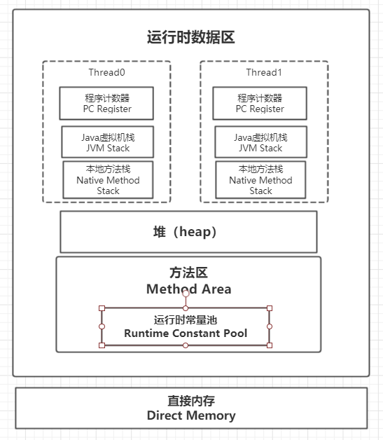
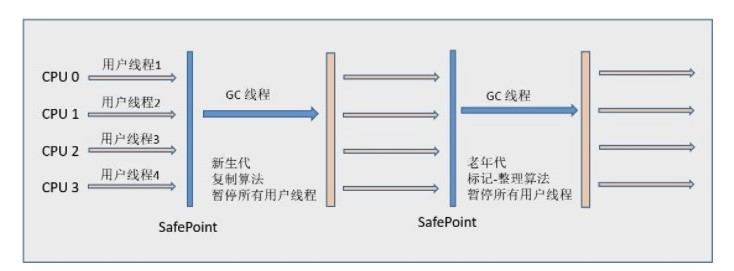

## 运行时数据区



### 程序计数器

程序计数器（ProgramCounter），也叫PC寄存器，每个Java虚拟机线程都有自己的程序计数器，会记录正在执行的字节码指令的地址或者行号（如果执行的是Native方法，则为undefined）

**程序计数器主要有两个作用**: 

1. 字节码解释器通过改变程序计数器来依次读取指令，从而实现代码的流程控制，如：顺序执行、选择、循环、异常处理。
2. 在多线程的情况下，程序计数器用于记录当前线程执行的位置，当线程被切换回来时能够知道该线程上次运行到哪里。

### Java虚拟机栈

每个Java虚拟机线程都有自己私有的**Java虚拟机栈**，这个栈和线程同时创建，用于存储**栈帧**；

用来存储当前线程运行方法所需要的数据、指令、返回地址（栈帧）

可以通过-Xss 这个虚拟机参数来指定每个线程的Java 虚拟机栈内存大小，-Xss2M；在JDK 1.4 中默认为256K，而在JDK1.5+ 默认为1M；

异常： 

1. 线程请求分配的栈容量超过Java虚拟机栈的最大容量时，会抛出StackOverflowError 异常；一般无限递归会出现这个错误
2. 如果Java虚拟机栈可以动态扩展，并且动态扩展时没有申请到足够的内存；或者创建新的线程时没有足够的内存去创建一个新的Java虚拟机栈，或抛出OutOfMemoryError

在做多线程开发时，当创建很多线程时，容易出现OOM(OutOfMemoryError)，这时可以通过具体情况，减少最大堆容量，或者栈容量来解决问题，如下:

**线程数\*(最大栈容量)+最大堆值+其他内存(忽略不计或者一般不改动)=机器最大内存**

当线程数比较多时，且无法通过业务上削减线程数，那么再不换机器的情况下，你只能把最大栈容量设置小一点，或者把最大堆值设置小一点。

### 本地方法栈

本地方法栈和Java虚拟机栈相似，本地方法栈是为Native方法服务的

### Java堆

Java虚拟机中，堆是所有线程共享的内存区域，所有类实例对象和数组对象分配内存的区域，在Java虚拟机启动时创建；是垃圾回收的主要区域（**GC堆**）

### 方法区

方法区也是所有线程共享的内存区域，用来存储已被虚拟机加载的类信息、常量（字面量）、静态变量、即时编译器编译后的代码等数据（动态代理动态生成的class）；

方法区是一个JVM 规范，永久代与元空间都是其一种实现方式。在JDK 1.8 之后，原来永久代的数据被分到了堆和元空间中。方法区是一个概念上的东西，在1.8之后被拆分成两部分；**元空间存储类的元信息**，静态变量和常量池等放入堆中。

**永久代和方法区的关系**：《Java虚拟机规范》只是规定了有方法区这么个概念和它的作用，并没有规定如何去实现它；在jdk1.7之前，JVM通过永久代实现方法区；所以当时==**永久代=方法区**==；

在jdk1.7之前，永久代是存放在堆中老年代；和老年代共享堆空间，永久代的垃圾收集是和老年代捆绑在一起的；因此无论谁满了都会触发GC；

### 运行时常量池

在class字节码文件中，Java会把所有需要使用的数据和方法提取出来，然后运行的时候放入常量池

运行时常量池是方法区的一部分，用于存储编译器生成的各种字面量和符号引用；

除了在编译期生成的常量，还允许动态生成，例如String 类的intern()。

### 直接内存

直接内存并不是虚拟机运行时数据区的一部分，在JDK1.4加入了NIO类，引入了基于通道（Channel）和缓冲区（Buffer）的IO方式，可以使用Native函数直接分配堆外内存，然后通过一个存储在Java堆中的DirectByteBuffer对象作为这块内存的引用进行操作，这样在一些场景中能显著提高性能，避免了在Java堆和Native堆中来回复制数据；

## 栈帧

**栈帧是JVM虚拟机进行方法调用和方法执行的数据结构**；是运行时数据区中Java虚拟机栈或者本地方法栈的栈元素。栈帧存储了局部变量表、操作数栈、动态链接和方法返回地址等信息。每一个方法从调用开始到执行结束的过程，都对应一个栈帧在虚拟机栈中从入栈到出栈的过程

简单来说，当线程调用某个方法时，就会把这个方法的相关数据压入一个虚拟机栈（或者本地方法栈），然后这个方法的相关数据就是一个栈帧（局部变量表、操作数栈、动态链接和方法返回地址）

### 局部变量表

局部变量表是一组变量值存储空间，用来存储方法的参数和方法内部定义的局部变量；

### 操作数栈

每个方法对应一个栈帧，那方法中指令执行的容器就是操作数栈，方法执行过程中，每个指令会往操作数栈中写入和读取数据，这个过程就是指令的入栈和出栈操作

### 动态链接

在Class文件中的常量持中存有大量的符号引用。字节码中的方法调用指令就以常量池中指向方法的符号引用作为参数。这些符号引用一部分在类的加载阶段**（解析）**或第一次使用的时候就转化为了直接引用（指向数据所存地址的指针或句柄等），这种转化称为静态链接。而相反的，另一部分在运行期间转化为直接引用，就称为动态链接。

### 方法返回地址

一个方法开始执行，有两种方式退出这个方法，一种是执行引擎遇到返回指令，另一种是执行过程中遇到了异常

## Java对象

### 对象的创建

1. **类加载检查**：首先检查当前类是否被加载到JVM中，如果没有，先执行类的加载过程

2. **分配内存**：类加载完成后，通过类对象获取到类信息，可以确定类所需的内存大小；然后分配所需的内存

   内存分配的两种方式**: 指针碰撞和空闲列表**

3. **初始化零值**：内存分配完成后，虚拟机需要将分配到的内存空间都初始化为零值

4. **设置对象头**：初始化零值完成之后，**虚拟机要对对象进行必要的设置**，例如对象的哈希码、对象的 GC 分代年龄等信息。 **这些信息存放在对象头中。** 另外，根据虚拟机当前运行状态的不同，如是否启用偏向锁等，对象头会有不同的设置方式。

5. **执行init方法**：执行构造方法，为变量赋值

### 对象的访问定位

Java运行过程中通过栈上的对象引用地址来访问对应的对象；存在两种方式**: 使用句柄和直接指针**

**句柄**：使用句柄的话，那么 Java 堆中将会划分出一块内存来作为句柄池，reference 中存储的就是对象的句柄地址，而句柄中包含了对象实例数据与类型数据各自的具体地址信息；需要跳转两次访问对象


**直接指针**:  如果使用直接指针访问，那么 Java 堆对象的布局中就必须考虑如何放置访问类型数据的相关信息，而 reference 中存储的直接就是对象的地址。GC中的复制算法，标记整理都需要考虑对象引用的修改


使用句柄来访问的最大好处是 reference 中存储的是稳定的句柄地址，在对象被移动时只会改变句柄中的实例数据指针，而 reference 本身不需要修改。使用直接指针访问方式最大的好处就是速度快，它节省了一次指针定位的时间开销。 

## 垃圾回收

垃圾回收主要针对堆和方法区；程序计数器、虚拟机栈和本地方法栈属于线程私有，线程结束之后就会消失

### 判断一个对象是否可以被回收

**引用计数法**

为对象添加一个引用计数器，当有的地方引用这个对象时，计数器+1；引用失效时，计数器-1，引用计数为0的对象可以被回收；

问题：当对象A引用对象B,对象B引用对象A；出现循环引用时，引用计数永远不会为0，对象无法被回收

**可达性分析**

以GC Roots 为起点，开始搜索，搜索所走过的路径称为引用链，当一个对象到GC Roots 没有任何引用链相连，这个对象就是GC Roots 不可达的对象，则这个对象是需要回收的

可以作为GC Roots的对象包括

- Java虚拟机栈中引用的对象（栈帧中的局部变量表引用的对象）
- 本地方法栈中引用的对象
- 方法区中类静态属性引用的对象
- 方法区中常量引用的对象

**方法区的回收**

因为方法区主要存放永久代对象，而永久代对象的回收率比新生代低很多，所以在方法区上进行回收性价比不高。

主要是对常量池的回收和对类的卸载。

### 引用类型

- 强引用

   被强引用关联的对象不会被回收

  ```java
  Object obj = new Object();
  ```

- 软引用

  被软引用关联的对象只有在内存不够的情况下才会被回收。

  ```java
  Object obj = new Object();
  log.debug("obj:{}",obj);
  SoftReference<Object> sf = new SoftReference<Object>(obj);
  obj = null;
  System.gc();
  log.debug("gc之后:{}",sf.get()); // gc之后，两个obj是相同的，说明obj 没有被回收
  ```

- 弱引用

  被弱引用关联的对象一定会被回收，也就是说它只能存活到下一次垃圾回收发生之前。

  ```java
  Object obj = new Object();
  log.debug("obj:{}",obj);
  WeakReference<Object> wf = new WeakReference<Object>(obj);
  obj = null;
  log.debug("gc之前:{}",wf.get()); // gc 之前不为 null
  System.gc();
  log.debug("gc之后:{}",wf.get()); // gc 之后为 null
  ```

- 虚引用

  又称为幽灵引用或者幻影引用，一个对象是否有虚引用的存在，不会对其生存时间造成影响，也无法通过虚引用得到一个对象。为一个对象设置虚引用的唯一目的是能在这个**对象被回收时收到一个系统通知**。

  ```java
  ReferenceQueue<Object> queue = new ReferenceQueue<>();
  Object obj = new Object();
  PhantomReference<Object> pf = new PhantomReference<Object>(obj, queue);
  obj = null;
  Thread.sleep(0);
  log.debug("gc之前:{}",queue.poll());
  System.gc();
  Thread.sleep(0);
  log.debug("gc之后:{}",queue.poll()); // 回收的时候，会把对象放入队列，达到通知的目的
  ```

### 垃圾回收算法

**标记-清除**


- 标记阶段：把所有可回收的对象（GC Roots不可达）打上标记（一般会有STW）
- 清除阶段：把标记的对象统一回收

缺点

- 标记和清除效率都不高
- 会产生大量不连续的内存碎片

**标记-整理**


- 标记阶段：把所有可回收的对象（GC Roots不可达）打上标记（一般会有STW）
- 整理阶段：把所有存活的对象向一端移动，然后清理剩下的内存

优点：不会产生内存碎片

缺点：需要移动大量对象，效率低下

**复制算法**


把内存分成大小相等的两块，每次只使用一块，当一块内存用完，将存活的对象（GC Roots可达）复制到另一块内存，然后把已使用的内存清理掉；

主要不足是内存需要翻倍，只能使用一半；

现在的商业虚拟机都采用复制算法回收新生代对象，分为新生代和老年代

**分代收集**

现在的商业虚拟机都采用分代收集算法，根据对象存活的不同生命周期把内存分为新生代和老年代，然后采用适当的回收算法

- 新生代：每次回收都有大量对象被回收，少量对象存活，采用复制算法；只需要复制少量对象完成回收
- 老年代：对象存活率高，没有担保机制，采用标记-清除或者标记-整理

### 垃圾收集器


**Serial收集器**


单线程收集器:  只使用一个gc线程进行垃圾回收，回收的时候会STW(stop the world),其他线程会全部停止；例如：打扫卫生时所有人必须停下手头的工作，这个时间系统是无法响应的；

它的优点是简单高效，在单个 CPU 环境下，由于没有线程交互的开销，因此拥有最高的单线程收集效率。

**Parnew收集器**


Serial 收集器的多线程版本，会有多个GC线程进行垃圾回收，可以搭配CMS的多线程收集器

**Parallel Scavenge 收集器**

多线程收集器，目标是提高系统的吞吐量，吞吐量= 运行用户代码时间/（运行用户代码时间+GC时间）；虚拟机运行100分钟，GC花费了1分钟，吞吐量为99%；

提高吞吐量的好处：提高系统的响应速度，使得用户获得更好的体验；代价就是会自动调节新生代Eden和Survivor区的比例；会对GC回收的效果产生影响；

缩短停顿时间是以牺牲吞吐量和新生代空间来换取的：新生代空间变小，垃圾回收变得频繁，导致吞吐量下降。

**Serial Old收集器**



Serial收集器的老年代版本，单线程回收，采用标记-整理算法

**Parallel Old收集器**

Parallel Scavenge 收集器的老年代版本；多线程回收，采用标记-整理算法

**CMS收集器**


CMS目标：获取最短回收停顿时间；停顿时间短可以提高系统的响应速度，带来更好的用户体验；采用标记-清除算法；

分为以下四个流程：

- 初始标记：仅仅只是标记一下GC Roots 能直接关联到的对象，速度很快，需要停顿（STW）。
- 并发标记：进行GC Roots Tracing 的过程，它在整个回收过程中耗时最长，不需要停顿。
- 重新标记：为了修正并发标记期间因用户程序继续运作而导致标记产生变动的那一部分对象的标记记录，需要停顿。
- 并发清除：不需要停顿。

缺点：

- 对CPU资源非常敏感：低停顿时间是以牺牲吞吐量为代价的（并发的时候会使吞吐量下降），导致CPU 利用率不够高。并发阶段会始终占用一个用户线程，导致系统可用线程减少（对双核双线程的CPU来说，并发阶段吞吐量直接降低50%）
- 无法处理浮动垃圾：
- 标记-清除算法导致的空间碎片问题：

**G1收集器**

G1（Garbage-First） 把堆划分成多个固定大小的独立区域（Region），新生代和老年代不再物理隔离。


通过引入 Region 的概念，从而将原来的一整块内存空间划分成多个 （默认2000多个）大小相同的小空间（Region） ，使得每个小空间可以单独进行垃圾回收。这种划分方法带来了很大的灵活性，使得可预测的停顿时间模型成为可能。通过记录每个 Region 垃圾回收时间以及回收所获得的空间（这两个值是通过过去回收的经验获得），并维护一个优先列表，每次根据允许的收集时间，优先回收价值最大的 Region。

**RSet**

每个 Region 都有一个 Remembered Set (RSet)，用来记录并跟踪其它Region执行该Region中对象的引用 （类似反向指针），通过使用 Remembered Set，可以确定引用本分区内的对象是否存活，在做可达性分析的时候就可以避免全堆扫描。

事实上，并非所有的引用都需要记录在RSet中，如果一个分区确定需要GC Root扫描，那么无需RSet也可以无遗漏的得到引用关系。那么引用源自本分区的对象，当然不用落入RSet中；同时，G1 GC每次都会对年轻代进行整体收集，因此引用源自年轻代的对象，也不需要在RSet中记录。最后只有老年代的分区可能会有RSet记录。

> 
>
>  如图： Region1和Region3中有对象引用了Region2的对象，则在Region2的Rset中记录了这些引用。 [引用来源](https://www.jianshu.com/p/870abddaba41)

**Young GC**: 

**Mixed GC**: 

G1的收集过程**可能**有4个阶段：

1.新生代GC；2.并发标记周期；3.混合收集；4.如果需要，可能会进行Full GC

**新生代 GC**：

- 堆一整块内存空间，被分为多个heap区(regions).
- 新生代内存由一组不连续的heap区组成。这使得在需要时很容易进行容量调整.
- 新生代的垃圾收集，或者叫 young GCs，会有 stop the world 事件， 在操作时所有的应用程序线程都会被暂停(stopped).
- 新生代 GC 通过多线程并行进行.
- 存活的对象被拷贝到新的 survivor 区或者老年代.

**并发标记周期**: 

G1 收集器：

- **初始标记**：标记GC Roots 能直接关联到的对象，这个阶段会伴随着一次young GC，需要停顿（STW）
- **根分区扫描 **：由于初始标记必然会伴随一次young GC，所以在初始化标记后，eden被清空，并且存活对象被移入 survivor区；在这个阶段，将扫描survivor区直接可达的老年代区域，并标记这些直接可达的对象。这个过程可以和应用程序并发执行。但是根区域扫描不能和young GC同时执行(因为根区域扫描依赖 survivor区的对象，而young GC会修改这个区域)，因此如果恰巧在此时需要进行young GC，GC就需要等待根区域扫描结束后才能进行，如果发生这种情况，这次新生代GC的时间就会延长。
- **并发标记**：和CMS类似，并发标记会扫描并查找整个堆的存活对象，并做好标记。这是一个并发的过程，并且可以被新一次的young GC打断
- **最终标记**：和CMS一样，重新标记也是会STW。由于在并发标记过程中，应用程序依然在运行，因此标记结果可能需要进行修正，所以在此阶段对上一次的标记结果进行补充。在G1中，这个过程使用SATB( Snapshot-At-The- Beginning)算法完成，该算法会在标记之初为存活对象创建一个快照，这个快照有助于加速重新标记的速度。会比CMS快很多
- **独占清理**：这个阶段是会STW，它将计算各个区域的存活对象和GC回收比例并进行排序，识别可供混合回收的区域，在这个阶段，还会更新记忆集( Remebered Set)。该阶段给出了需要被混合回收的区域并进行了标记，在混合回收阶段，需要这些信息。
- **并发清理阶段**：这个阶段会识别并清理完全空闲的区域。它是并发的清理，不会引起停顿。

**混合收集**: 

在并发标记周期中，虽然有部分对象被回收，但是总体上说，回收的比例是相当低的。但是在并发标记周期后，G1已经明确知道哪些区域含有比较多的垃圾对象，在混合回收阶段，就可以专门针对这些区域进行回收。当然，G1会优先回收垃圾比例较高的区域，因为回收这些区域的性价比也比较高。而这也正是G1名字的由来。

这个阶段叫作混合回收，是因为在这个阶段，既会执行正常的young GC，也会选取一些被标记的老年代区域进行回收，它同时处理了新生代和老年代；因为young GC的原因，eden区域必然被清空，此外，垃圾比例最高的区域被清。被清理区域中的存活对象会被移动到其他区域，这样的好处是可以减少空间碎片。

**必要时的Full GC：**

和CMS类似，并发收集由于让应用程序和GC线程交替工作，因此总是不能完全避免在特别繁忙的场合会出现在回收过程中内存不充足的情况。当遇到这种情况时，G1也会转入一个Full GC进行回收.

转移失败(Evacuation Failure)是指当G1无法在堆空间中申请新的分区时，G1便会触发担保机制，执行一次STW式的、单线程的Full GC。Full GC会对整堆做标记清除和压缩，最后将只包含纯粹的存活对象。

G1在以下场景中会触发Full GC，同时会在日志中记录to-space-exhausted以及Evacuation Failure：

* 从年轻代分区拷贝存活对象时，无法找到可用的空闲分区
* 从老年代分区转移存活对象时，无法找到可用的空闲分区
* 分配巨型对象时在老年代无法找到足够的连续分区

由于G1的应用场合往往堆内存都比较大，所以Full GC的收集代价非常昂贵，应该避免Full GC的发生。 

**G1收集器特点**: 

- **并行性：**G1在回收期间，可以由多个GC线程同时工作，有效利用多核CPU的计算能力
- **并发性：**G1拥有与应用程序交替执行的能力，部分工作可以和应用程序同时执行，不会在整个回收期间STW
- **分代GC：**G1依然是一个分代收集器，但是与其它收集器不同，G1同时兼顾新生代和老年代
- **空间整理：**G1在回收过程中，会进行适当的对象移动，不像CMS只是简单的标记清除，在若干次GC后，CMS必须进行一次碎片整理；G1不同，它每次回收都会有效的复制对象，减少空间碎片
- **可预见性**: 由于分区的原因，G1可以选择部分区域进行内存回收，缩小回收范围，从而控制全局停顿STW

## 内存分配和回收策略

### Minor GC 和Full GC

- Minor GC：回收新生代，因为新生代对象存活时间很短，因此Minor GC 会频繁执行，执行的速度一般也会比较快。
- Full GC：回收老年代和新生代，老年代对象其存活时间长，因此Full GC 很少执行，执行速度会比Minor GC慢很多。

### 内存分配策略

1. **对象优先在Eden分配**

   大多数情况下，新建的对象在Eden区分配内存，当Eden区内存不足时，进行Minor GC

2. **大对象直接进入老年代**

   大对象是指需要连续内存空间的对象，最典型的大对象是那种很长的字符串以及数组。
   经常出现大对象会提前触发垃圾收集以获取足够的连续空间分配给大对象。
   -XX:PretenureSizeThreshold，大于此值的对象直接在老年代分配，避免在Eden 和Survivor 之间的大量内存复制。

3. **长期存活的对象进入老年代**

   对象头中有一个年龄计数器，对象在Eden出生后，经过Minor GC存活，就会移动到Survivor中，年龄+1，然后没熬过一次Minor GC（两个Survivor），年龄+1，达到一定年龄（默认15）移动到老年代

   -XX:MaxTenuringThreshold 用来定义年龄的阈值。

4. **动态对象年龄判定**

   为了适应不同的内存情况，Java虚拟机不会永远要求对象年龄达到MaxTenuringThreshold才进入老年代，当某个年龄的对象空间占比达到Survivor区的一半时，则年龄大于等于该年龄的对象全部进入老年代，无需等到年龄达到MaxTenuringThreshold 

5. **空间分配担保**

   在发生Minor GC 之前，虚拟机会先检查老年代最大连续可用空间是否大于新生代总空间

### Full GC 的触发条件

Minor GC只要Eden区空间不足就会触发

调用System.gc()

老年代空间不足

空间分配担保失败

## 类加载机制

类是在运行期间动态加载的，虽然会在类加载时增加一定的开销，但是可用提高Java程序的灵活性；而且一次性加载全部的类会占用很多的内存

### 类加载时机

类从加载到虚拟机内存开始到卸载出内存为止，生命周期包括：加载、验证、准备、解析、初始化、使用、卸载

**类初始化的五种条件（主动引用）**：

1. 遇到new、getstatic、putstatic、invokestatic这4条字节码指令时，如果类没有进行初始化，则需要先触发初始化；Java代码场景：new关键字实例化对象、读写类的静态字段（final常量除外）、调用类的静态方法
2. 使用java.lang.reflect包下的方法对类进行反射调用时，如果类没有进行过初始化，则需要触发初始化
3. 当初始化一个类时，如果其父类还没有被初始化，需要先触发父类的初始化
4. 当虚拟机启动时，执行main方法的类会先被初始化
5. 当使用JDK 1.7 的动态语言支持时，如果一个java.lang.invoke.MethodHandle 实例最后的解析结果为
   REF_getStatic, REF_putStatic, REF_invokeStatic 的方法句柄，并且这个方法句柄所对应的类没有进行过初始
   化，则需要先触发其初始化；

**被动引用（类不会初始化）**: 

- 通过子类引用父类的静态字段，子类不会初始化
- 通过数组定义的引用类，不会初始化；
- 常量（static final修饰的字段）会在编译阶段存入常量池，不会触发类的初始化
- 通过类名获取Class对象，不会触发类的初始化
- 通过Class.forName加载指定类，并且initialize为false时，不会触发初始化
- ClassLoader.loadClass不会触发初始化

### 类加载过程


1. **加载**

   加载是类加载的第一步，不能混淆；加载过程中完成3件事情

   1）通过一个类的全限定名获取类的二进制字节流

   2）将字节流中类的静态存储结构转为方法区中的运行时数据结构

   3）在内存中生成一个代表这个类的Class对象，作为方法区这个类的访问入口

2. **验证**

   验证是连接虚拟机的第一步，目的是确保Class文件中的字节码符合当前虚拟机的规范，保证当前虚拟机的运行安全；因为会存在没有经过编译，直接生成的class文件

3. **准备**

   准备阶段：为类变量（static修饰的变量）分配内存空间，并设置初始值

   ~~~java
   public static int value = 123;  // 非常量-初始值为0（类型初始值）
   public static final int value = 123; // final常量初始值为123
   ~~~

4. **解析**

   将常量池中的符合引用替换为直接引用；解析动作主要针对类或接口、字段、类方法、接口方法、方法类型、方法句柄和调用限定符7类符号引用进行。

   符号引用：在编译时，Java类并不知道所引用的类的实际地址，因此只能使用符号引用来代替

   直接引用：

   （1）直接指向目标的指针（比如，指向“类型”【Class对象】、类变量、类方法的直接引用可能是指向方法区的指针）

   （2）相对偏移量（比如，指向实例变量、实例方法的直接引用都是偏移量）

   （3）一个能间接定位到目标的句柄

5. **初始化**

   初始化阶段才开始真正执行类中定义的Java代码；初始化阶段是执行类类构造器\<client>()；不是类的构造方法（实例化才执行）
   
   \<client>()方法是编译器自动收集所有类变量（static变量）的赋值操作和静态代码块（static{}）中的语句按先后顺序合并产生的；类变量访问前必须先声明
   
   ```java
   static {    
       i = 0; // 给变量赋值可以正常编译通过    
       System.out.print(i); // 这句编译器会提示“非法向前引用”
   }
   static int i = 1;
   ```

## 类加载器

### 类与类加载器

对于任何一个类，都需要加载它的类加载器和类本身共同确定类在Java虚拟机中的唯一性，每个类加载器都有自己独立的类名称空间；比较两个类是否相等，需要在同一个类加载器下才有意义；

~~~java
public class ClassLoadTest {
    public static void main(String[] args) {
        ClassLoader myClassLoader = new ClassLoader() {
            @Override
            public Class<?> loadClass(String name) throws ClassNotFoundException {
                try {
                    String fileName = name.substring(name.lastIndexOf(".") + 1) 
                        + ".class";
                    InputStream is = getClass().getResourceAsStream(fileName);
                    if (Objects.isNull(is)) {
                        return super.loadClass(name);
                    }
                    byte[] bytes = new byte[is.available()];

                    is.read(bytes);
                    return defineClass(name,bytes,0,bytes.length);
                } catch (IOException e) {
                    throw new ClassNotFoundException(name);
                }
            }
        };
        try {
            Object obj = myClassLoader.
                loadClass("com.qinfengsa.classload.ClassLoadTest").newInstance(); 
            System.out.println(obj.getClass());
            // class com.qinfengsa.classload.ClassLoadTest
            System.out.println(obj instanceof ClassLoadTest); // false 两个class不同
            // 如果把class名称换成 java.lang.String
        } catch (ClassNotFoundException e) {
            e.printStackTrace();
        } catch (IllegalAccessException e) {
            e.printStackTrace();
        } catch (InstantiationException e) {
            e.printStackTrace();
        }
    }
}
~~~

### 类加载器分类

Java的程序入口：sun.misc.Launcher

**启动类加载器（Bootstrap ClassLoader）**: 负责<JAVA_HOME>/lib下或者-Xbootclasspath参数指定的路径下，并且是虚拟机识别的（仅按照文件名识别，如rt.jar，名字不符合的类库即使放在lib目录中也不会被加载）；如果文件名不被虚拟机识别，即使把jar包丢到lib目录下也是没有作用的（出于安全考虑，Bootstrap启动类加载器只加载包名为java、javax、sun等开头的类）。

**扩展类加载器（Extension ClassLoader）**: 这个类加载器是由
ExtClassLoader（sun.misc.Launcher$ExtClassLoader）实现的。它负责将<JAVA_HOME>/lib/ext 或者被
java.ext.dir 系统变量所指定路径中的所有类库加载到内存中，开发者可以直接使用扩展类加载器。

**应用程序类加载器（Application ClassLoader）**: 这个类加载器是由
AppClassLoader（sun.misc.Launcher$AppClassLoader）实现的。由于这个类加载器是ClassLoader 中的
getSystemClassLoader() 方法的返回值，因此一般称为系统类加载器。它负责加载用户类路径（ClassPath）
上所指定的类库，开发者可以直接使用这个类加载器，如果应用程序中没有自定义过自己的类加载器，一般情
况下这个就是程序中默认的类加载器。

### 双亲委派模型


除了启动类加载器，每个类加载器都有自己的父类加载器，这里类加载器的父子关系一般不会以继承来实现。而是使用组合关系来复用父加载器的代码

**工作过程**: 如果一个类加载器收到了类加载的请求，会优先把请求委派给自己的父类加载器，只有当父类加载器反馈无法完成加载请求时，子加载器才会尝试加载类。

**优点**: 使用双亲委派模型来组织类加载器的关系，可以使Java类随着它的类加载器一起具备了一种带有优先级的层次关系；

例如java.lang.Object 存放在rt.jar 中，如果编写另外一个java.lang.Object 并放到ClassPath 中，程序可以编译通过。由于双亲委派模型的存在，所以在rt.jar 中的Object 比在ClassPath 中的Object 优先级更高，这是因为rt.jar中的Object 使用的是启动类加载器，而ClassPath 中的Object 使用的是应用程序类加载器。rt.jar 中的Object 优先级更高，那么程序中所有的Object 都是这个Object。

**实现**: 

~~~java
protected Class<?> loadClass(String name, boolean resolve) throws ClassNotFoundException{
    synchronized (getClassLoadingLock(name)) { // 根据类名获取锁对象
        Class<?> c = findLoadedClass(name); // 检查是否已经加载
        if (c == null) {
            long t0 = System.nanoTime();
            try {
                if (parent != null) { 
                    c = parent.loadClass(name, false);
                } else { // parent为null，说明父类加载器是启动类加载器（Bootstrap ClassLoader）
                    c = findBootstrapClassOrNull(name);
                }
            } catch (ClassNotFoundException e) {
                // 如果父类加载器抛出异常 ClassNotFoundException  
                // 说明父类加载器无法完成加载请求
            }

            if (c == null) {
                // 在父类加载器无法加载的情况下
                // 调用自己的findClass加载
                long t1 = System.nanoTime();
                c = findClass(name); 
                sun.misc.PerfCounter.getParentDelegationTime().addTime(t1 - t0);
                sun.misc.PerfCounter.getFindClassTime().addElapsedTimeFrom(t1);
                sun.misc.PerfCounter.getFindClasses().increment();
            }
        }
        if (resolve) {
            resolveClass(c);
        }
        return c;
    }
}
~~~


### 破坏双亲委派模型

重写loadClass（）方法可以破坏双亲委派模型，目前已经不提倡重写这个方法，需要重写findClass（）

**JNDI破坏双亲委派模型**  

JNDI是Java标准服务，它的代码由启动类加载器去加载。但是JNDI需要回调独立厂商实现的代码，而类加载器无法识别这些回调代码（SPI）。 为了解决这个问题，引入了一个**线程上下文类加载器。** 可通过Thread.setContextClassLoader()设置。 利用线程上下文类加载器去加载所需要的SPI代码，即父类加载器请求子类加载器去完成类加载的过程，而破坏了双亲委派模型。 

~~~java
// 建立连接，通过SPI机制自动找到com.mysql.cj.jdbc.Driver
// DriverManager在rt.jar目录下，类加载器是启动类加载器，
// 按照双亲委派机制，是无法加载com.mysql.cj.jdbc.Driver类
connection = DriverManager.getConnection(url,name,password);

public class DriverManager {
    // 静态代码块
    static {
        loadInitialDrivers(); // 加载所有java.sql.Driver的实现类
        println("JDBC DriverManager initialized");
    }
    private static void loadInitialDrivers() {
        String drivers;
        try {
            drivers = AccessController.doPrivileged(new PrivilegedAction<String>() {
                public String run() {
                    return System.getProperty("jdbc.drivers");
                }
            });
        } catch (Exception ex) {
            drivers = null;
        } 

        AccessController.doPrivileged(new PrivilegedAction<Void>() {
            public Void run() {
				// SPI 机制
                ServiceLoader<Driver> loadedDrivers = ServiceLoader.load(Driver.class);
                Iterator<Driver> driversIterator = loadedDrivers.iterator();
 
                try{
                    while(driversIterator.hasNext()) {
                        driversIterator.next();
                    }
                } catch(Throwable t) {
                // Do nothing
                }
                return null;
            }
        });

        println("DriverManager.initialize: jdbc.drivers = " + drivers);

        if (drivers == null || drivers.equals("")) {
            return;
        }
        String[] driversList = drivers.split(":");
        println("number of Drivers:" + driversList.length);
        for (String aDriver : driversList) {
            try {
                println("DriverManager.Initialize: loading " + aDriver);
                Class.forName(aDriver, true,
                        ClassLoader.getSystemClassLoader());
            } catch (Exception ex) {
                println("DriverManager.Initialize: load failed: " + ex);
            }
        }
    }
    // 建立连接
    private static Connection getConnection(
        String url, java.util.Properties info, Class<?> caller) throws SQLException {
        // callerCL为空的时候，其实说明这个ClassLoader是启动类加载器，但是这个启动类加载并不能识别rt.jar之外的类，
        // 这个时候就把callerCL赋值为Thread.currentThread().getContextClassLoader();也就是应用程序启动类
        ClassLoader callerCL = caller != null ? caller.getClassLoader() : null;
        synchronized(DriverManager.class) {
            // synchronize loading of the correct classloader.
            if (callerCL == null) {
                callerCL = Thread.currentThread().getContextClassLoader();
            }
        }

        if(url == null) {
            throw new SQLException("The url cannot be null", "08001");
        }

        println("DriverManager.getConnection(\"" + url + "\")");

        // Walk through the loaded registeredDrivers attempting to make a connection.
        // Remember the first exception that gets raised so we can reraise it.
        SQLException reason = null;

        for(DriverInfo aDriver : registeredDrivers) {
            // If the caller does not have permission to load the driver then
            // skip it.
            // 类加载
            if(isDriverAllowed(aDriver.driver, callerCL)) {
                try {
                    println("    trying " + aDriver.driver.getClass().getName());
                    Connection con = aDriver.driver.connect(url, info);
                    if (con != null) {
                        // Success!
                        println("getConnection returning " + aDriver.driver.getClass().getName());
                        return (con);
                    }
                } catch (SQLException ex) {
                    if (reason == null) {
                        reason = ex;
                    }
                }

            } else {
                println("    skipping: " + aDriver.getClass().getName());
            } 
        }

        // if we got here nobody could connect.
        if (reason != null)    {
            println("getConnection failed: " + reason);
            throw reason;
        }

        println("getConnection: no suitable driver found for "+ url);
        throw new SQLException("No suitable driver found for "+ url, "08001");
    }
    // 
    private static boolean isDriverAllowed(Driver driver, ClassLoader classLoader) {
        boolean result = false;
        if(driver != null) {
            Class<?> aClass = null;
            try {
                aClass =  Class.forName(driver.getClass().getName(), true, classLoader);
            } catch (Exception ex) {
                result = false;
            }

            result = ( aClass == driver.getClass() ) ? true : false;
        }

        return result;
    }
}

~~~

## 参考

* [ Java学习+面试指南 ](https://github.com/Snailclimb/JavaGuide)
* [Java 提高篇](http://cmsblogs.com/?p=3740)
* [CS-Notes  技术面试必备 ](https://github.com/CyC2018/CS-Notes)
* [JVM源码分析系列](https://www.jianshu.com/p/2394abce3f03)

