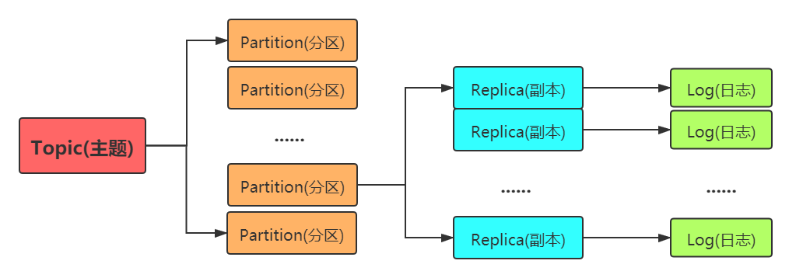

## Kafka 基本介绍

Kafka 是一个基于发布/订阅的分布式消息系统。目前 Kafka定位为一个分布式流式处理平台，它以高吞吐、可持久化、可水平扩展、支持流数据处理等多种特性而被广泛使用

消息系统的基本功能

1. 消息的发送和接收；需要涉及到网络通信就一定会涉及到NIO
2. 消息中心的消息存储（持久化/非持久化）
3. 消息的序列化和反序列化
4. 是否跨语言
5. 消息的确认机制，如何避免消息重发

高级功能

1. 消息的有序性
2. 是否支持事务消息
3. 消息收发的性能，对高并发大数据量的支持
4. 是否支持集群
5. 消息的可靠性存储
6. 是否支持多协议

**三大角色**

* 消息系统：Kafka和传统的消息系统（也称作消息中间件）都具备系统解耦、冗余存储、流量削峰、缓冲、异步通信、扩展性、可恢复性等功能。与此同时， Kafka还提供了大多数消息系统难以实现的消息顺序性保障及回溯消费的功能。
* 存储系统：Kafka把消息持久化到磁盘，相比于其他基于内存存储的系统而言，有效地降低了数据丢失的风险。也正是得益于 Kafka的消息持久化功能和多副本机制，我们可以把 Kafka作为长期的数据存储系统来使用，只需要把对应的数据保留策略设置为“永久”或启用主题的日志压缩功能即可。
* 流式处理平台：Kafka不仅为每个流行的流式处理框架提供了可靠的数据来源，还提供了一个完整的流式处理类库，比如窗口、连接、变换和聚合等各类操作 

  Kafka的特性:
- 高吞吐量、低延迟：kafka每秒可以处理几十万条消息，它的延迟最低只有几毫秒，每个topic可以分多个partition, consumer group 对partition进行consume操作。
- 可扩展性：kafka集群支持热扩展
- 持久性、可靠性：消息被持久化到本地磁盘，并且支持数据备份防止数据丢失
- 容错性：允许集群中节点失败（若副本数量为n,则允许n-1个节点失败）
- 高并发：支持数千个客户端同时读写

Kafka的使用场景：
- 日志收集：一个公司可以用Kafka可以收集各种服务的log，通过kafka以统一接口服务的方式开放给各种consumer，例如hadoop、Hbase、Solr等。
- 消息系统：解耦和生产者和消费者、缓存消息等。
- 用户活动跟踪：Kafka经常被用来记录web用户或者app用户的各种活动，如浏览网页、搜索、点击等活动，这些活动信息被各个服务器发布到kafka的topic中，然后订阅者通过订阅这些topic来做实时的监控分析，或者装载到hadoop、数据仓库中做离线分析和挖掘。
- 运营指标：Kafka也经常用来记录运营监控数据。包括收集各种分布式应用的数据，生产各种操作的集中反馈，比如报警和报告。
- 流式处理：比如spark streaming和storm

应用场景

1. 活动跟踪：Kafka最初的使用场景是跟踪用户的活动。网站用户与前端应用程序发生交互，前端应用程序生成用户活动相关的消息。
2. 传递消息：Kafka的另一个基本用途是传递消息。应用程序向用户发送通知（比如邮件）就是通过传递消息来实现的。这些应用程序组件可以生成消息，而不需要关心消息的格式，也不需要关心消息是如何被发送的。
3. 度量指标和日志记录：Kafka也可以用于收集应用程序和系统度量指标以及日志
4. 提交日志：Kafka的基本概念来源于提交日志，所以使用Kafka作为提交日志是件顺理成章的事。
5. 流处理：流处理是又一个能提供多种类型应用程序的领域。

### 基本概念

**Producer**

生产者，生产消息的一方，负责生产消息，然后发送到Kafka中

**Consumer**

消费者，接收消息的一方，连接到Kafka并接收消息，然后对其进行业务处理

**Broker**

服务代理节点，Kafka集群包含一个或多个服务器，这种服务器被称为broker，负责消息的存储和转发

**Topic**

消息类别，Kafka 按照topic 来分类消息，topic 是一个逻辑上的概念，由多个partition组成

**Partition**

topic 的分区，一个topic 可以包含多个partition，topic 消息保存在各个partition 上

**offset**

消息在日志中的位置，可以理解是消息在partition 上的偏移量，也是代表该消息的唯一序号

offset是消息在分区中的唯一标识， Kafka通过它来保证消息在分区内的顺序性，不过offset并不跨越分区，所以Kafka保证的是分区有序而不是主题有序

**Consumer Group**

消费者分组，每个Consumer 必须属于一个group

Kaka为分区引入了多副本（ Replica）机制，通过增加副本数量可以提升容灾能力。同分区的不同副本中保存的是相同的消息（在同一时刻，副本之间并非完全一样），副本之间是一主多从的关系，其中 leader副本负责处理读写请求， follower副本只负责与 leader副本的消息同步。副本处于不同的 broker中，当 leader副本出现故障时，从 follower副本中重新选举新的 leader副本对外提供服务。Kaka通过多副本机制实现了故障的自动转移，当 Kafka集群中某个 broker失效时仍然能保证服务可用

生产者和消费者只与 leader副本进行交互，而 follower副本只负责消息的同步，很多时候 follower副本中的消息相对 leader副本而言会有一定的滞后。

Kafka消费端也具备一定的容灾能力。 Consumer使用拉（Pull）模式从服务端拉取消息，并且保存消费的具体位置，当消费者宕机后恢复上线时可以根据之前保存的消费位置重新拉取需要的消息进行消费，这样就不会造成消息丢失。

**AR**: 分区中的所有副本统称为AR（ Assigned Replicas）

分区中的所有副本统称为AR（ Assigned Replicas）。所有与 leader副本保持一定程度同步的副本（包括 leader副本在内）组成ISR（Im- Sync Replicas），ISR集合是AR集合中的一个子集。消息会先发送到 leader副本，然后 follower副本才能从 leader副本中拉取消息进行同步，同步期间内 follower副本相对于 leader副本而言会有一定程度的滞后。前面所说的“一定程度的同步”是指可忍受的滞后范围，这个范围可以通过参数进行配置。与 leader副本同步滞后过多的副本（不包括 leader副本）组成OSR（Out- of-Sync Replicas），由此可见，AR=ISR+OSR。
在正常情况下，所有的 follower副本都应该与 leader副本保持一定程度的同步，即AR=ISR, OSR集合为空。

## 生产者

~~~java
public class KafkaProducerTest { 
    // 地址
    public static final String brokerList = "192.168.7.101:9092,192.168.7.102:9092,192.168.7.103:9092";
    // 生产 topic
    public static final String topic = "topic1";
	// 初始化 配置
    public static Properties initConfig() {
        Properties properties = new Properties();
        // 生产者连接Kafka集群所需的 broker 地址清单
        properties.put(ProducerConfig.BOOTSTRAP_SERVERS_CONFIG, brokerList);
        // 对 key 进行序列化
        properties.put(ProducerConfig.KEY_SERIALIZER_CLASS_CONFIG, StringSerializer.class.getName());
        // 对 value 进行序列化
        properties.put(ProducerConfig.VALUE_SERIALIZER_CLASS_CONFIG, StringSerializer.class.getName());
        // 生产者id
        properties.put(ProducerConfig.CLIENT_ID_CONFIG,"producer1");
        return properties;
    } 
    public static void main(String[] args) {
        Properties properties = initConfig();
        // 根据 properties 创建生产者
        KafkaProducer<String, String> producer = new KafkaProducer<>(properties);
        ProducerRecord<String, String> record = new ProducerRecord<>(topic, "hello, Kafka1 ");
        try {
            producer.send(record);
            TimeUnit.SECONDS.sleep(2);
        } catch(Exception e){
            e.printStackTrace(); 
        }
    }
}
~~~

### 消息发送

#### **ProducerRecord**

~~~java
public class ProducerRecord<K, V> { 
    private final String topic; // 主题
    private final Integer partition; // 分区，可以指定分区 发送消息
    private final Headers headers; // 头信息，可以实现自定义的某些功能，默认未序列化
    private final K key; // key
    private final V value; // value 发送的信息
    private final Long timestamp; // 时间戳

    public ProducerRecord(String topic, Integer partition, Long timestamp, K key, V value, 
                          Iterable<Header> headers);
    public ProducerRecord(String topic, Integer partition, Long timestamp, K key, V value);
    public ProducerRecord(String topic, Integer partition, K key, V value, Iterable<Header> headers);
    public ProducerRecord(String topic, Integer partition, K key, V value);
    public ProducerRecord(String topic, K key, V value);
    public ProducerRecord(String topic, V value);
}
~~~

#### send

创建生产者实例和构建消息之后，就可以开始发送消息了。发送消息主要有三种模式：发后即忘(fire-and-forget)、同步(sync)及异步Casync)

~~~java
// 发送消息的
ProducerRecord<Integer, String> record = new ProducerRecord<>(topic, 100,"hello, Kafka1 "); 
// 1.发后即忘,本身是异步的,不能保证每次都发送成功
producer.send(record);
// 2.同步,Future对象的get()方法如果没执行完会阻塞
Future<RecordMetadata> future = producer.send(record);
RecordMetadata data = future.get(); 
// 3.异步,通过Callback进行回调
producer.send(record, new Callback() {
    @Override
    public void onCompletion(RecordMetadata recordMetadata, Exception e) {
        // 处理回调数据
    }
});
// lambda 表达式
producer.send(record,(metadata, exception)-> { }) ;
~~~

虽然send方法本身是异步的，但由于Future的get()方法在执行完之前阻塞的，所以get()方法何时调用就会存在问题

Callback的方式非常简洁明了，Kafka有响应时就会回调，要么发送成功，要么抛出异常

### 序列化

生产者需要用序列化器(Serializer)把对象转换成字节数组才能通过网络发送给Kafka。消费者需要用反序列化器(Deserializer)把从Kafka中收到的字节数组转换成相应的对象

~~~java
// 序列化接口
public interface Serializer<T> extends Closeable {
    // 读取配置信息
    default void configure(Map<String, ?> configs, boolean isKey) {
    } 
    // 序列化方法，将对象转换成字节数组
    byte[] serialize(String var1, T var2); 
    default byte[] serialize(String topic, Headers headers, T data) {
        return this.serialize(topic, data);
    } 
    default void close() {
    }
}
~~~

### 分区器

消息在通过send()方法发往broker 的过程中，有可能需要经过拦截器(Interceptor)、序列化器(Serializer)和分区器(Partitioner)的一系列作用之后才能被真正地发往broker

分区器(Partitioner)的作用是通过指定的算法来控制消息发送到broker 的哪个分区

~~~java
public interface Partitioner extends Configurable, Closeable {
    // 确定分区号
    int partition(String var1, Object var2, byte[] var3, Object var4, byte[] var5, Cluster var6);
    void close();
}

// 默认的分区器
public class DefaultPartitioner implements Partitioner {
    private final ConcurrentMap<String, AtomicInteger> topicCounterMap = new ConcurrentHashMap(); 
    // 确定分区号
    public int partition(String topic, Object key, byte[] keyBytes, Object value, byte[] valueBytes, 
                         Cluster cluster) {
        // 获取集群中当前topic 的所以分区
        List<PartitionInfo> partitions = cluster.partitionsForTopic(topic);
        // 分区数量
        int numPartitions = partitions.size();
        if (keyBytes == null) {
            // 每次自增，实现轮询
            int nextValue = this.nextValue(topic);
            // 获取可用分区数量
            List<PartitionInfo> availablePartitions = cluster.availablePartitionsForTopic(topic);
            if (availablePartitions.size() > 0) {
                // nextValue%可用分区数量 获取分区编号
                int part = Utils.toPositive(nextValue) % availablePartitions.size();
                return ((PartitionInfo)availablePartitions.get(part)).partition();
            } else {
                return Utils.toPositive(nextValue) % numPartitions;
            }
        } else {
            // 如果key不为空，通过计算hash然后取模获取分区
            return Utils.toPositive(Utils.murmur2(keyBytes)) % numPartitions;
        }
    }
	// 通过原子类试下自增 
    private int nextValue(String topic) {
        AtomicInteger counter = (AtomicInteger)this.topicCounterMap.get(topic);
        if (null == counter) {
            counter = new AtomicInteger(ThreadLocalRandom.current().nextInt());
            AtomicInteger currentCounter = (AtomicInteger)this.topicCounterMap.putIfAbsent(topic, counter);
            if (currentCounter != null) {
                counter = currentCounter;
            }
        } 
        return counter.getAndIncrement();
    } 
}
~~~

### 生产者拦截器

生产者拦截器既可以用来在消息发送前做一些准备工作，比如按照某个规则过滤不符合要求的消息、修改消息的内容等，也可以用来在发送回调逻辑前做一些定制化的需求，比如统计类工作。

~~~java
public interface ProducerInterceptor<K, V> extends Configurable {
    // 通过onSend方法对消息进行处理
    ProducerRecord<K, V> onSend(ProducerRecord<K, V> var1);
	// 在消息被应答之前或消息发送失败时调用 onAcknowledgement方法， 优先于用户设定的Callback
    void onAcknowledgement(RecordMetadata var1, Exception var2);

    void close();
}
~~~

整个生产者客户端由两个线程协调运行，这两个线程分别为主线程和 Sender线程（发送线程）。在主线程中由 KafkaProducer创建消息，然后通过可能的拦截器、序列化器和分区器的作用之后缓存到消息累加器（ RecordAccumulator，也称为消息收集器）中。 Sender线程负责从RecordAccumulator中获取消息并将其发送到 Kafka中。

### 源码KafkaProducer

## 消费者

**消费者(Consumer)**：负责订阅Kafka 中的主题(Topic), 并且从订阅的主题上拉取消息。

**消费组(Consumer Group)**：每个消费者都有一个消费组，当消息发布到Kafka的Topic后，只会被投递给订阅它的每个消费组中的一个消费者，而不是全部消费者

如果所有的消费者都隶属于同一个消费组，那么所有的消息都会被均衡地投递给每一个消费者，即每条消息只会被一个消费者处理，这就相当于点对点模式的应用。

如果所有的消费者都隶属于不同的消费组，那么所有的消息都会被广播给所有的消费者，即每条消息会被所有的消费者处理，这就相当于发布/订阅模式的应用。

~~~java
public class KafkaConsumerTest {
	// 地址
    public static final String brokerList = "192.168.7.101:9092,192.168.7.102:9092,192.168.7.103:9092";
    public static final String topic = "topic1"; // 消费topic
    public static final String groupid = "group1"; // 消费group
    public static Properties initConfig() {
        Properties properties = new Properties();
        // key - value反序列化
        properties.put(ConsumerConfig.KEY_DESERIALIZER_CLASS_CONFIG, IntegerDeserializer.class.getName());
        properties.put(ConsumerConfig.VALUE_DESERIALIZER_CLASS_CONFIG, StringDeserializer.class.getName());
		// 消费者连接Kafka集群所需的 broker 地址清单
        properties.put(ConsumerConfig.BOOTSTRAP_SERVERS_CONFIG, brokerList); 
        properties.put(ConsumerConfig.CLIENT_ID_CONFIG,"consumer1");
        // 消费者group
        properties.put(ConsumerConfig.GROUP_ID_CONFIG,groupid);
        return properties;
    }
    public static void main(String[] args) {
        Properties properties = initConfig();
        KafkaConsumer<Integer, String> consumer= new KafkaConsumer<>(properties);
        consumer.subscribe(Collections.singleton(topic));// 添加topic，可以添加多个
        try {
            while (true) { 
                ConsumerRecords<Integer,String> consumerRecords=consumer.poll(Duration.ofSeconds(1));
                consumerRecords.forEach(record->{ 
                    System.out.println(record.key()+"->"+record.value()+"->"+record.offset());
                });
            }
        } catch(Exception e) {
            log.error(e.getMessage(), e);
        } finally{
            consumer.close(); 
        }
    }
}
~~~

### 订阅主题

~~~java
// 使用Collection集合订阅主题
public void subscribe(Collection<String> topics) {
    this.subscribe((Collection)topics, new NoOpConsumerRebalanceListener());
}
// 使用正则表达式 Pattern 订阅主题
public void subscribe(Pattern pattern) {
    this.subscribe((Pattern)pattern, new NoOpConsumerRebalanceListener());
} 
// new NoOpConsumerRebalanceListener() 设置相应的再均衡监听器 
~~~

### 反序列化

~~~java
public interface Deserializer<T> extends Closeable {
     // 读取配置信息
    default void configure(Map<String, ?> configs, boolean isKey) {
    }
     // 反序列化方法，将字节数组转换成对象
    T deserialize(String var1, byte[] var2); 
    default T deserialize(String topic, Headers headers, byte[] data) {
        return this.deserialize(topic, data);
    }
    default void close() {
    }
}
~~~

### 消息消费

Kafka中的消费是基于poll模式的，Kafka中的消息消费是一个不断轮询的过程，消费者需要不断调用poll()方法，而poll()方法返回的是所订阅的主题（分区）上的一组消息

~~~java
// 1s 轮询一次
ConsumerRecords<Integer,String> consumerRecords=consumer.poll(Duration.ofSeconds(1));
consumerRecords.forEach(record->{ 
    System.out.println(record.key()+"->"+record.value()+"->"+record.offset());
});
~~~

消费端信息ConsumerRecord

~~~java
public class ConsumerRecord<K, V> {  
    private final String topic; // 主题
    private final int partition; // 分区
    private final long offset; // 偏移量
    private final long timestamp;// 时间戳
    private final TimestampType timestampType;
    private final int serializedKeySize;
    private final int serializedValueSize;
    private final Headers headers;
    private final K key;
    private final V value;
    private final Optional<Integer> leaderEpoch;
    private volatile Long checksum;
}
~~~

### 消费者拦截器

~~~java
public interface ConsumerInterceptor<K, V> extends Configurable, AutoCloseable {
    ConsumerRecords<K, V> onConsume(ConsumerRecords<K, V> var1); 
    void onCommit(Map<TopicPartition, OffsetAndMetadata> var1); 
    void close();
}
~~~

## 主题和分区

**Topic**: 消息类别，Kafka 按照topic 来分类消息

**Partition**: topic 的分区，一个topic 可以包含多个partition，topic 消息保存在各个partition 上

**replication-factor**: 副本因子，用来设置Topic的副本数。每个Topic可以有多个副本，副本位于集群中不同的broker上，保证有效的数据冗余，防止宕机造成的数据丢失；同时副本的数量不能超过broker的数量，否则topic创建失败。

topic和partition都是提供给上层用户的抽象，而在副本层面或更加确切地说是Log层面才有实际物理上的存在

优先副本的选举

分区使用多副本机制来提升可靠性，但只有 leader副本对外提供读写服务，而 follower副本只负责在内部进行消息的同步。如果一个分区的 leader副本不可用，那么就意味着整个分区变得不可用，此时就需要 Kafka从剩尔的 follower副本中挑选一个新的 leader副本来继续对外提供服务。虽然不够严谨，但从某种程度上说， broker节点中 leader副本个数的多少决定了这个节点负载的高低。

分区重分配

当集群中的一个节点突然宕机下线时，如果节点上的分区是单副本的，那么这些分区就变得不可用了，在节点恢复前，相应的数据也就处于丢失状态；如果节点上的分区是多副本的，那么位于这个节点上的 leader副本的角色会转交到集群的其他 f follower副本中。总而言之，这个节点上的分区副本都已经处于功能失效的状态， Kaf ka并不会将这些失效的分区副本自动地迁移到集群中剩余的可用 broker节点上，如果放任不管，则不仅会影响整个集群的均衡负载还会影响整体服务的可用性和可靠性。

## Kafka 存储原理

可靠性