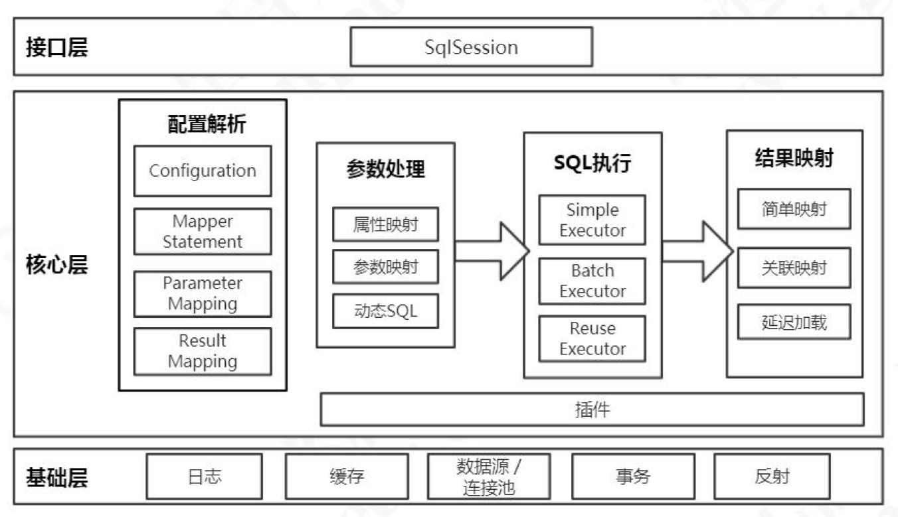

## MyBatis 整体架构



**反射模块**：对Java原生的反射进行了良好的封装，提供了更加简洁的API，对反射操作进行了优化

**反射工具箱**

MyBatis在进行参数处理、结果映射等操作时,会涉及大量的反射操作。Java中的反射虽然功能强大，但是代码编写起来比较复杂且容易出错，为了简化反射操作的相关代码，MyBatis提供了专门的反射模块，该模块位于org.apache.ibatis.eflection包中，它对常见的反射操作做了进一步封装，提供了更加简洁方便的反射API。 

~~~java
public class DefaultReflectorFactory implements ReflectorFactory {
    private boolean classCacheEnabled = true; // 是否开启Reflector对象缓存
    private final ConcurrentMap<Class<?>, Reflector> reflectorMap = 
        new ConcurrentHashMap<>(); // 用ConcurrentHashMap集合缓存Reflector对象
   
    @Override
    public Reflector findForClass(Class<?> type) {
        if (classCacheEnabled) {
            // 把Reflector对象放入缓存集合
            return reflectorMap.computeIfAbsent(type, Reflector::new);
        } else {
            return new Reflector(type);
        }
    } 
}
~~~

### 接口层
接口层相对简单，其核心是SqlSession 接口，该接口中定义了MyBatis 暴露给应用程序调用的API ，也就是上层应用与MyBatis 交互的桥梁。接口层在接收到调用请求时，会调用核心处理层的相应模块来完成具体的数据库操作。

### 核心处理层

在核心处理层中实现了MyBatis 的核心处理流程，其中包括MyBatis 的初始化以及完成一次数据库操作的涉及的全部流程。

核心处理层主要做了这几件事：

1. 把接口中传入的参数解析并且映射成JDBC 类型；
2. 解析xml 文件中的SQL 语句，包括插入参数，和动态SQL 的生成；
3. 执行SQL 语句；
4. 处理结果集，并映射成Java 对象。

插件也属于核心层，这是由它的工作方式和拦截的对象决定的。

### 基础支持层

基础支持层主要是一些抽取出来的通用的功能（实现复用），用来支持核心处理层的功能。比如数据源、缓存、日志、xml 解析、反射、IO、事务等等这些功能。

## MyBatis 工作流程

### 配置解析

解析 config 配置文件、Mapper 文件、Mapper 接口上的注解 。通过对象Configuration 存放全部的配置信息，它在属性里面还有各种各样的容器。最后，返回了一个DefaultSqlSessionFactory，里面持有了Configuration 的实例。

~~~java
String resource = "mybatis-config.xml";
InputStream inputStream = Resources.getResourceAsStream(resource);
SqlSessionFactory sqlSessionFactory = new SqlSessionFactoryBuilder().build(inputStream); // 入口
// SqlSessionFactory构造器
public class SqlSessionFactoryBuilder {
    public SqlSessionFactory build(InputStream inputStream, String environment, Properties properties) {
        try {
            // XMLConfigBuilder 读取XML配置信息
            XMLConfigBuilder parser = new XMLConfigBuilder(inputStream, environment, properties);
            return build(parser.parse());
        } catch (Exception e) {
            throw ExceptionFactory.wrapException("Error building SqlSession.", e);
        } finally {
            ErrorContext.instance().reset();
            try {
                inputStream.close();
            } catch (IOException e) {
                // Intentionally ignore. Prefer previous error.
            }
        }
    }
  	public SqlSessionFactory build(Configuration config) {
        // 通过配置类config构造SqlSessionFactory
    	return new DefaultSqlSessionFactory(config);
  	}
}
// XML配置构造器
public class XMLConfigBuilder extends BaseBuilder {
    // 构造函数
    private XMLConfigBuilder(XPathParser parser, String environment, Properties props) {
        // 构建配置类Configuration
        super(new Configuration());
        ErrorContext.instance().resource("SQL Mapper Configuration");
        this.configuration.setVariables(props);
        this.parsed = false;
        this.environment = environment;
        this.parser = parser;
    }
    public Configuration parse() {
        if (parsed) {
          	throw new BuilderException("Each XMLConfigBuilder can only be used once.");
        }
        parsed = true;
        parseConfiguration(parser.evalNode("/configuration")); // 解析配置文件
        return configuration;
    }
    
    //从root节点解析XML配置文件 
  	private void parseConfiguration(XNode root) {
        try { 
            // 解析 properties 配置信息
            propertiesElement(root.evalNode("properties"));
            // 解析 settings 配置信息
            Properties settings = settingsAsProperties(root.evalNode("settings"));
            loadCustomVfs(settings);
            loadCustomLogImpl(settings); // 加载日志配置
            typeAliasesElement(root.evalNode("typeAliases")); // 解析 类型别名
            pluginElement(root.evalNode("plugins")); // 解析插件 plugins
            objectFactoryElement(root.evalNode("objectFactory"));
            objectWrapperFactoryElement(root.evalNode("objectWrapperFactory"));
            reflectorFactoryElement(root.evalNode("reflectorFactory"));
            settingsElement(settings); // 对<settings>标签里面的所有子标签进行处理
            // 解析 environments
            environmentsElement(root.evalNode("environments"));
            databaseIdProviderElement(root.evalNode("databaseIdProvider"));
            // 解析 typeHandlers
            typeHandlerElement(root.evalNode("typeHandlers"));
            // 解析 Mapper的配置文件，最主要的有两个：一个是sql的定义，一个是resultMap
            mapperElement(root.evalNode("mappers"));
        } catch (Exception e) {
          	throw new BuilderException("Error parsing SQL Mapper Configuration. Cause: " + e, e);
        }
    }
}
~~~


### 创建会话


### 获得Mapper 对象


### 执行SQL

## XML配置

**属性（properties）**

这些属性都是可外部配置且可动态替换的，既可以在典型的 Java 属性文件中配置，亦可通过 properties 元素的子元素来传递。

~~~xml
<properties resource="db.properties">
  	<property name="username" value="dev_user"/>
  	<property name="password" value="F2Fa3!33TYyg"/>
</properties>
~~~

**设置（settings）**

这是 MyBatis 中极为重要的调整设置，它们会改变 MyBatis 的运行时行为。

**类型别名（typeAliases）**

类型别名是为 Java 类型设置一个短的名字。 它只和 XML 配置有关，存在的意义仅在于用来减少类完全限定名的冗余。

~~~xml
<typeAliases>
    <typeAlias alias="blog" type="com.qinfengsa.mybatis.domain.Blog" />
    <typeAlias alias="author" type="com.qinfengsa.mybatis.domain.Author" />
    <typeAlias alias="comment" type="com.qinfengsa.mybatis.domain.Comment" />
</typeAliases>
~~~

也可以指定一个包名，MyBatis 会在包名下面搜索需要的 Java Bean 

~~~xml
<typeAliases>
    <package name="com.qinfengsa.mybatis.domain"/>
</typeAliases>
~~~

**类型处理器（typeHandlers）**

把数据库中字段的类型转换为Java中的类型

**对象工厂（objectFactory）**

**插件（plugins）**

**环境配置（environments）**

MyBatis 可以配置成适应多种环境，然后不同的环境配置不同的数据库

~~~xml
<environments default="development"> <!-- 可以配置多个environment，但必须有默认 -->
    <environment id="development"> <!-- id必填  -->
        <transactionManager type="JDBC">  <!-- 事务管理器的配置 -->
            <property name="..." value="..."/>
        </transactionManager>
        <dataSource type="POOLED"> <!-- 数据源的配置 -->
            <property name="driver" value="${driver}"/>
            <property name="url" value="${url}"/>
            <property name="username" value="${username}"/>
            <property name="password" value="${password}"/>
        </dataSource>
    </environment>
</environments>
~~~

~~~java
// Environment 配置类
public final class Environment {
    private final String id; // id 
    private final TransactionFactory transactionFactory; // 事务管理器
    private final DataSource dataSource; // 数据源
    public Environment(String id, TransactionFactory transactionFactory, DataSource dataSource) {
        if (id == null) {
            throw new IllegalArgumentException("Parameter 'id' must not be null");
        }
        if (transactionFactory == null) {
            throw new IllegalArgumentException("Parameter 'transactionFactory' must not be null");
        }
        this.id = id;
        if (dataSource == null) {
            throw new IllegalArgumentException("Parameter 'dataSource' must not be null");
        }
        this.transactionFactory = transactionFactory;
        this.dataSource = dataSource;
    }
}
~~~

**映射器（mappers）**


### 原理

首先，MyBatis配置信息全部存在Configuration类中

~~~java
public class Configuration {
    protected Environment environment; // 环境信息
    protected boolean safeRowBoundsEnabled; // 允许在嵌套语句中使用分页（RowBounds）如果允许使用则设置为false
    protected boolean safeResultHandlerEnabled = true;
    protected boolean mapUnderscoreToCamelCase;
    protected boolean aggressiveLazyLoading;
    protected boolean multipleResultSetsEnabled = true;
    protected boolean useGeneratedKeys;
    protected boolean useColumnLabel = true;
    protected boolean cacheEnabled = true;
    protected boolean callSettersOnNulls;
    protected boolean useActualParamName = true;
    protected boolean returnInstanceForEmptyRow;

    protected String logPrefix; // MyBatis 增加到日志名称的前缀 
    protected Class<? extends Log> logImpl; //  MyBatis 所用日志的具体实现
    protected Class<? extends VFS> vfsImpl;
    protected LocalCacheScope localCacheScope = LocalCacheScope.SESSION;
    protected JdbcType jdbcTypeForNull = JdbcType.OTHER;
    protected Set<String> lazyLoadTriggerMethods 
        = new HashSet<>(Arrays.asList("equals", "clone", "hashCode", "toString"));
    protected Integer defaultStatementTimeout;
    protected Integer defaultFetchSize;
    protected ResultSetType defaultResultSetType;
    protected ExecutorType defaultExecutorType = ExecutorType.SIMPLE;
    protected AutoMappingBehavior autoMappingBehavior = AutoMappingBehavior.PARTIAL;
    protected AutoMappingUnknownColumnBehavior autoMappingUnknownColumnBehavior 
        = AutoMappingUnknownColumnBehavior.NONE;

    protected Properties variables = new Properties();
    // 反射工厂
    protected ReflectorFactory reflectorFactory = new DefaultReflectorFactory();
    protected ObjectFactory objectFactory = new DefaultObjectFactory();
    protected ObjectWrapperFactory objectWrapperFactory = new DefaultObjectWrapperFactory();

    protected boolean lazyLoadingEnabled = false;
    protected ProxyFactory proxyFactory = new JavassistProxyFactory(); // 代理工具	CGLIB | JAVASSIST 
    protected String databaseId;

    protected Class<?> configurationFactory;
	// mapper 注册 根据对应的class找到mapper
    protected final MapperRegistry mapperRegistry = new MapperRegistry(this);
    protected final InterceptorChain interceptorChain = new InterceptorChain();
    protected final TypeHandlerRegistry typeHandlerRegistry = new TypeHandlerRegistry();
    protected final TypeAliasRegistry typeAliasRegistry = new TypeAliasRegistry();
    protected final LanguageDriverRegistry languageRegistry = new LanguageDriverRegistry();

    protected final Map<String, MappedStatement> mappedStatements 
        = new StrictMap<MappedStatement>("Mapped Statements collection")
        .conflictMessageProducer((savedValue, targetValue) ->
         ". please check " + savedValue.getResource() + " and " + targetValue.getResource());
    protected final Map<String, Cache> caches = new StrictMap<>("Caches collection");
    protected final Map<String, ResultMap> resultMaps = new StrictMap<>("Result Maps collection");
    protected final Map<String, ParameterMap> parameterMaps = new StrictMap<>("Parameter Maps collection");
    protected final Map<String, KeyGenerator> keyGenerators = new StrictMap<>("Key Generators collection");

    protected final Set<String> loadedResources = new HashSet<>();
    protected final Map<String, XNode> sqlFragments 
        = new StrictMap<>("XML fragments parsed from previous mappers");

    protected final Collection<XMLStatementBuilder> incompleteStatements = new LinkedList<>();
    protected final Collection<CacheRefResolver> incompleteCacheRefs = new LinkedList<>();
    protected final Collection<ResultMapResolver> incompleteResultMaps = new LinkedList<>();
    protected final Collection<MethodResolver> incompleteMethods = new LinkedList<>();

 	// 
    protected final Map<String, String> cacheRefMap = new HashMap<>();

    public Configuration(Environment environment) {
        this();
        this.environment = environment;
    }
	// 构造函数
    public Configuration() {
        // 注册别名，通过别名找到对应的Class
        typeAliasRegistry.registerAlias("JDBC", JdbcTransactionFactory.class);
        typeAliasRegistry.registerAlias("MANAGED", ManagedTransactionFactory.class);
        typeAliasRegistry.registerAlias("JNDI", JndiDataSourceFactory.class);
        typeAliasRegistry.registerAlias("POOLED", PooledDataSourceFactory.class);
        typeAliasRegistry.registerAlias("UNPOOLED", UnpooledDataSourceFactory.class);
        typeAliasRegistry.registerAlias("PERPETUAL", PerpetualCache.class);
        typeAliasRegistry.registerAlias("FIFO", FifoCache.class);
        typeAliasRegistry.registerAlias("LRU", LruCache.class);
        typeAliasRegistry.registerAlias("SOFT", SoftCache.class);
        typeAliasRegistry.registerAlias("WEAK", WeakCache.class);
        typeAliasRegistry.registerAlias("DB_VENDOR", VendorDatabaseIdProvider.class);
        typeAliasRegistry.registerAlias("XML", XMLLanguageDriver.class);
        typeAliasRegistry.registerAlias("RAW", RawLanguageDriver.class);
        typeAliasRegistry.registerAlias("SLF4J", Slf4jImpl.class);
        typeAliasRegistry.registerAlias("COMMONS_LOGGING", JakartaCommonsLoggingImpl.class);
        typeAliasRegistry.registerAlias("LOG4J", Log4jImpl.class);
        typeAliasRegistry.registerAlias("LOG4J2", Log4j2Impl.class);
        typeAliasRegistry.registerAlias("JDK_LOGGING", Jdk14LoggingImpl.class);
        typeAliasRegistry.registerAlias("STDOUT_LOGGING", StdOutImpl.class);
        typeAliasRegistry.registerAlias("NO_LOGGING", NoLoggingImpl.class);
        typeAliasRegistry.registerAlias("CGLIB", CglibProxyFactory.class);
        typeAliasRegistry.registerAlias("JAVASSIST", JavassistProxyFactory.class);

        languageRegistry.setDefaultDriverClass(XMLLanguageDriver.class);
        languageRegistry.register(RawLanguageDriver.class);
    }
}
~~~

**配置解析**

~~~java
String resource = "mybatis-config.xml";
InputStream inputStream = Resources.getResourceAsStream(resource);
SqlSessionFactory sqlSessionFactory = new SqlSessionFactoryBuilder().build(inputStream); // 入口
// SqlSessionFactory构造器
public class SqlSessionFactoryBuilder {
    public SqlSessionFactory build(InputStream inputStream, String environment, Properties properties) {
        try {
            // XMLConfigBuilder 读取XML配置信息
            XMLConfigBuilder parser = new XMLConfigBuilder(inputStream, environment, properties);
            return build(parser.parse());
        } catch (Exception e) {
            throw ExceptionFactory.wrapException("Error building SqlSession.", e);
        } finally {
            ErrorContext.instance().reset();
            try {
                inputStream.close();
            } catch (IOException e) {
                // Intentionally ignore. Prefer previous error.
            }
        }
    }
  	public SqlSessionFactory build(Configuration config) {
        // 通过配置类config构造SqlSessionFactory
    	return new DefaultSqlSessionFactory(config);
  	}
}
// XML配置构造器
public class XMLConfigBuilder extends BaseBuilder {
    // 构造函数
    private XMLConfigBuilder(XPathParser parser, String environment, Properties props) {
        // 构建配置类Configuration
        super(new Configuration());
        ErrorContext.instance().resource("SQL Mapper Configuration");
        this.configuration.setVariables(props);
        this.parsed = false;
        this.environment = environment;
        this.parser = parser;
    }
    public Configuration parse() {
        if (parsed) {
          	throw new BuilderException("Each XMLConfigBuilder can only be used once.");
        }
        parsed = true;
        parseConfiguration(parser.evalNode("/configuration")); // 解析配置文件
        return configuration;
    }
    
    //从root节点解析XML配置文件 
  	private void parseConfiguration(XNode root) {
        try { 
            // 解析 properties 配置信息
            propertiesElement(root.evalNode("properties"));
            // 解析 settings 配置信息
            Properties settings = settingsAsProperties(root.evalNode("settings"));
            loadCustomVfs(settings);
            loadCustomLogImpl(settings); // 加载日志配置
            typeAliasesElement(root.evalNode("typeAliases")); // 解析 类型别名
            pluginElement(root.evalNode("plugins")); // 解析插件 plugins
            objectFactoryElement(root.evalNode("objectFactory"));
            objectWrapperFactoryElement(root.evalNode("objectWrapperFactory"));
            reflectorFactoryElement(root.evalNode("reflectorFactory"));
            settingsElement(settings);
            // 解析 environments
            environmentsElement(root.evalNode("environments"));
            databaseIdProviderElement(root.evalNode("databaseIdProvider"));
            // 解析 typeHandlers
            typeHandlerElement(root.evalNode("typeHandlers"));
            // 解析 Mapper的配置文件，最主要的有两个：一个是sql的定义，一个是resultMap
            mapperElement(root.evalNode("mappers"));
        } catch (Exception e) {
          	throw new BuilderException("Error parsing SQL Mapper Configuration. Cause: " + e, e);
        }
    }
}
~~~

## XML映射

**select查询语句**


**insert, update 和 delete**

**resultMap**


~~~java
// XML配置构造器
public class XMLConfigBuilder extends BaseBuilder {
    // 解析Mapper配置
    private void mapperElement(XNode parent) throws Exception {
        if (parent != null) {
            for (XNode child : parent.getChildren()) {
                if ("package".equals(child.getName())) {
                    String mapperPackage = child.getStringAttribute("name");
                    configuration.addMappers(mapperPackage);
                } else {
                    String resource = child.getStringAttribute("resource");
                    String url = child.getStringAttribute("url");
                    String mapperClass = child.getStringAttribute("class");
                    if (resource != null && url == null && mapperClass == null) {
                        ErrorContext.instance().resource(resource);
                        InputStream inputStream = Resources.getResourceAsStream(resource);
                        // 构建XMLMapperBuilder 用来解析Mapper文件
                        XMLMapperBuilder mapperParser = new XMLMapperBuilder(inputStream, configuration, 
                            resource, configuration.getSqlFragments());
                        mapperParser.parse(); // 注册
                    } else if (resource == null && url != null && mapperClass == null) {
                        ErrorContext.instance().resource(url);
                        InputStream inputStream = Resources.getUrlAsStream(url);
                        // 构建XMLMapperBuilder 用来解析Mapper文件
                        XMLMapperBuilder mapperParser = new XMLMapperBuilder(inputStream, configuration, 
                         	url, configuration.getSqlFragments());
                        mapperParser.parse(); // 注册
                    } else if (resource == null && url == null && mapperClass != null) {
                        Class<?> mapperInterface = Resources.classForName(mapperClass);
                        configuration.addMapper(mapperInterface);
                    } else {
                        throw new BuilderException(" ");
                    }
                }
            }
        }
    }
}
~~~

MyBatis通过XMLMapperBuilder来解析Mapper文件，核心代码如下

~~~java
XMLMapperBuilder mapperParser = new XMLMapperBuilder(inputStream, configuration, 
	resource, configuration.getSqlFragments());
mapperParser.parse();
~~~

### 原理

~~~java
public class XMLMapperBuilder extends BaseBuilder {
    private final XPathParser parser;
  	private final MapperBuilderAssistant builderAssistant;
  	private final Map<String, XNode> sqlFragments;
  	private final String resource;
    // 对Mapper 映射器的解析
    public void parse() {
        if (!configuration.isResourceLoaded(resource)) {
            configurationElement(parser.evalNode("/mapper"));// 解析所有的子标签
            configuration.addLoadedResource(resource);
            bindMapperForNamespace();
        } 
        parsePendingResultMaps();
        parsePendingCacheRefs();
        parsePendingStatements();
    }
    // 解析mapper下所有的子标签
    private void configurationElement(XNode context) {
        try {
            String namespace = context.getStringAttribute("namespace");
            if (namespace == null || namespace.equals("")) {
                throw new BuilderException("Mapper's namespace cannot be empty");
            }
            builderAssistant.setCurrentNamespace(namespace);
            cacheRefElement(context.evalNode("cache-ref"));
            cacheElement(context.evalNode("cache"));
            parameterMapElement(context.evalNodes("/mapper/parameterMap"));
            resultMapElements(context.evalNodes("/mapper/resultMap"));
            sqlElement(context.evalNodes("/mapper/sql"));
            buildStatementFromContext(context.evalNodes("select|insert|update|delete"));
        } catch (Exception e) {
          	throw new BuilderException("Error parsing Mapper XML. The XML location is '" 
                                     + resource + "'. Cause: " + e, e);
        }
    }
}
~~~


## 动态SQL

**if**： 通过参数动态调整SQL

```xml
<select id="findActiveBlogLike" resultType="Blog">
  SELECT * FROM BLOG WHERE state = ‘ACTIVE’
  <if test="title != null"> 
    AND title like #{title}
  </if>
  <if test="author != null and author.name != null">
    AND author_name like #{author.name}
  </if>
</select>
```

**choose, when, otherwise**：类似Java 中的 switch 语句

```xml
<select id="findActiveBlogLike" resultType="Blog">
  SELECT * FROM BLOG WHERE state = ‘ACTIVE’
  <choose>
    <when test="title != null">
      AND title like #{title}
    </when>
    <when test="author != null and author.name != null">
      AND author_name like #{author.name}
    </when>
    <otherwise>
      AND featured = 1
    </otherwise>
  </choose>
</select>
```

**trim, where, set**

<where>元素能动态调整where，在where条件为空是去掉where关键字，防止SQL错误

<set>元素在update语句中能动态前置 SET 关键字，同时也会删掉无关的逗号

<trim>

**foreach**：对一个集合进行遍历，通常是在构建 IN 条件语句的时候

~~~xml
<select id="selectPostIn" resultType="domain.blog.Post">
  SELECT * FROM POST P
  WHERE ID in
  <foreach item="item" index="index" collection="list"
      open="(" separator="," close=")">
        #{item}
  </foreach>
</select>
~~~

