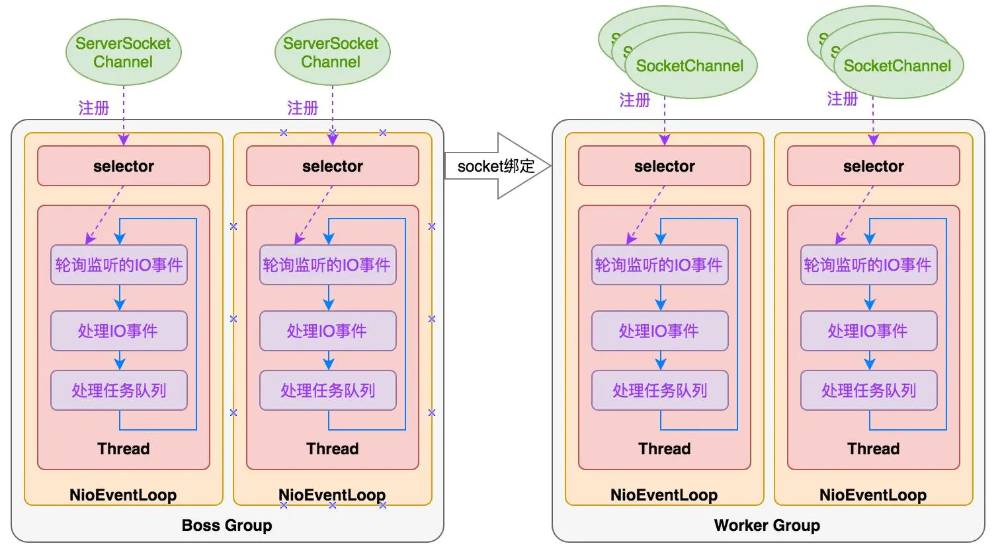

## Reactor

### BIO模式

BIO模式是最简单的，也是最符合人类思维模式的，但是效率太低，为什么呢？

一个连接完整的网络处理过程一般分为accept、read、decode、process、encode、send这几步，但是，

Reactor模式主要是提高系统的吞吐量，在有限的资源下处理更多的事情。

 

在单核的机上，多线程并不能提高系统的性能，除非在有一些阻塞的情况发生。否则线程切换的开销会使处理的速度变慢。就像你一个人做两件事情，1、削一个苹果。2、切一个西瓜。那你可以一件一件的做，我想你也会一件一件的做。如果这个时候你使用多线程，一会儿削苹果，一会切西瓜，可以相像究竟是哪个速度快。这也就是说为什么在单核机上多线程来处理可能会更慢。

但当有阻碍操作发生时，多线程的优势才会显示出来，现在你有另外两件事情去做，1、削一个苹果。2、烧一壶开水。我想没有人会去做完一件再做另一件，你肯定会一边烧水，一边就把苹果削了。

Reactor实际上采用了**分而治之**和**事件驱动**的思想

**分而治之**： 一个完整的网络处理过程一般分为 accept，read，decode，process，encode，send这几步。Reactor模式将每个步骤映射为 一个Task，服务端线程执行的最小逻辑单元不再是一个完整的网络请求，而是 Task，且采用非阻塞方式执行。

**事件驱动**： 每个Task 对应特定的网络事件，当Task 准备就绪时，Reactor 收到对应的网络事件通知，并将Task 分发给绑定了对应网络事件的 Handler 执行。

## Netty

什么是Netty？Netty是一个基于java NIO 的网络应用框架

**Netty 线程模型**

## Bootstrap

Bootstrap类是Netty提供的一个可以通过简单配置来设置或"引导"程序的一个很重要的类。

- Bootstrap用来连接远程主机，有1个EventLoopGroup
- ServerBootstrap用来绑定本地端口，有2个EventLoopGroup

## Netty服务端创建

1

## EventLoop 

**EventLoopGroup**

## Pipeline

**ChannelPipeline**

ChannelPipeline 就是 ChannelHandler 链的容器。

**Channel**

**Future or ChannelFuture**

**Channellnitializer**

**ChannelHandler**

ChannelHandler做下面一些事情：

- 传输数据时，将数据从一种格式转换到另一种格式
- 异常通知
- Channel变为有效或无效时获得通知
- Channel被注册或从EventLoop中注销时获得通知
- 通知用户特定事件

## Promise与Future

## 缓存ByteBuf

## 编解码器

利用Netty提供的半包编码和解码器LengthFieldPrepender和LengthFieldBasedFrameDecoder，可以轻松的解决TCP粘包和半包问题

**Decoder(解码器)**

- 解码字节到消息（ByteToMessageDecoder 和 ReplayingDecoder）
- 解码消息到消息（MessageToMessageDecoder）

**Encoder(编码器)**

- 编码从消息到字节（MessageToByteEncoder）
- 编码从消息到消息（MessageToMessageEncoder）