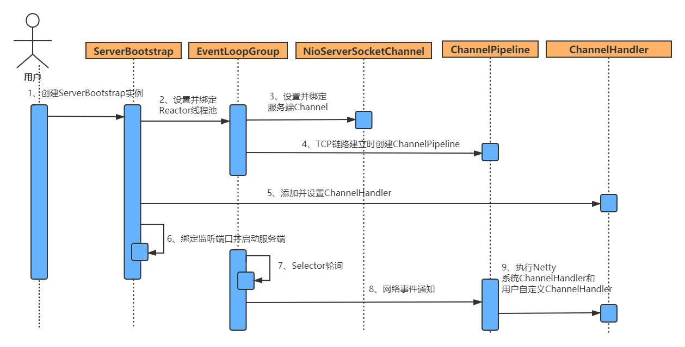

## Reactor

### BIO 模式


BIO模式是最简单的，也是最符合人类思维模式的，但是效率太低，为什么呢？

* BIO的核心是每个请求对应一个线程处理，因此严重依赖线程，线程是Java虚拟机中非常宝贵的资源，一旦并发访问量过大，会导致服务端性能急剧下降
* 服务端 accept 阶段由于网速、IO等原因是会阻塞的，如果有大量请求阻塞，会导致线程资源紧张，最终影响服务端性能

### **Reactor 模式**

Reactor模式的目的主要是提高系统的吞吐量，在有限的资源下处理更多的事情

在单核的机器上，多线程并不能提高系统的性能，除非在有一些阻塞的情况发生。否则线程切换的开销会使处理的速度变慢。就像你一个人做两件事情，1、削一个苹果。2、切一个西瓜。那你可以一件一件的做，我想你也会一件一件的做。如果这个时候你使用多线程，一会儿削苹果，一会切西瓜，可以相像究竟是哪个速度快。这也就是说为什么在单核机上多线程来处理可能会更慢。

但当有阻碍操作发生时，多线程的优势才会显示出来，现在你有另外两件事情去做，1、削一个苹果。2、烧一壶开水。我想没有人会去做完一件再做另一件，你肯定会一边烧水，一边就把苹果削了。


Reactor实际上采用了**分而治之**和**事件驱动**的思想

**分而治之**： 一个完整的网络处理过程一般分为 accept，read，decode，process，encode，send这几步。Reactor模式将每个步骤映射为 一个Task，服务端线程执行的最小逻辑单元不再是一个完整的网络请求，而是 Task，且采用非阻塞方式执行

**事件驱动**： 每个Task 对应特定的网络事件，当Task 准备就绪时，Reactor 收到对应的网络事件通知，并将Task 分发给绑定了对应网络事件的 Handler 执行


### Reactor 单线程模型


Reactor单线程模型，是指所有的IO操作都在同一个NIO线程上面完成

缺点：当其中某个Handler阻塞时，会导致其他Client 的Handler 都不能执行，更严重的情况会导致整个服务不能接收新的Client 请求

### Reactor 多线程模型


1. 一个专有线程，即Acceptor 线程用于监听Client 的TCP 连接请求
2. Client 的IO 操作都由一个特定的NIO 线程池负责，负责消息的读取、解码、编码和发送
3. Client连接有很多，但是NIO 线程数是比较少的，一个NIO 线程可以同时绑定到多个Client，同时一个Client只能对应一个线程，避免出现线程安全问题

在绝大多数情况下，Reactor 多线程模型可以满足高并发的网络请求

当并发量达到百万或者client连接需要进行验证且验证消耗很大时，单个 Acceptor线程可能会存在性能不足的问题

### Reactor 主从多线程模型


Reactor主从多线程模型和多线程模型的区别：服务端用于接收客户端连接的不再是一个单独的NIO线程，而是一个独立的NIO线程池

## Netty

什么是Netty？Netty是一个基于Java NIO 的网络应用框架

**不选择Java原生NIO编程的原因**

1. NlO的类库和API繁杂，使用麻烦，需要熟练掌握 Selector、 ServerSocketChannel、 SocketChannel、 ByteBuffer的使用
2. NIO编程涉及到 Reactor模式，对开发者的并发编程能力有一定的要求
3. 如果要保证通信的可靠性，开发会遇到很大的困难。例如客户端面临断连重连、网络闪断、半包读写、失败缓存、网络拥塞和异常码流的处理等问题，需要进行大量的调试和修改
4. Java原生NIO存在BUG，例如臭名昭著的 epoll bug，它会导致 Selector空轮询，最终导致CPU100%

**选择Netty的优势**

1. API使用简单，开发门槛低
2. 功能强大，预置了多种编解码功能，支持多种主流协议
3. 定制能力强，可以通过实现ChannelHandler接口进行灵活地扩展
4. 性能高，通过与其他业界主流的NO框架对比，Netty的综合性能最优
5. 成熟稳定， Netty修复了原生NIO存在的BUG
6. 经历了大规模的商业应用考验，质量得到验证

### **Netty 线程模型**


### TCP粘包/拆包

TCP是一个"流"的协议，传输的最小单位为一个报文段（segment），为了提高性能，避免频繁的连接请求，发送端会先将需要发送的数据放到缓冲区，等缓存区占满后，再将缓冲区的数据发送给接收方，同样接收方也存在用来接收数据的缓冲区

在这种情况下，会存在一些问题

* 如果缓冲区存在两组不同的请求数据，会被当做一组数据发送，导致解析出错，发生粘包问题
* 如果缓冲区较小，数据包一次无法完整发送，会被拆分成多个部分发送，产生拆包问题

#### **解决方案**

* 消息定长，例如每个报文的大小为固定长度200字节，如果不够，空位补空格
* 将回车换行符（或者其它特殊字符）作为消息结束符，进行分割，例如FTP协议
* 将消息分为消息头和消息体，消息头中包含表示消息总长度（或者消息体长度）的字段，通常设计思路为消息头的第一个字段使用int32来表示消息的总长度 

#### **Netty 解决方案**

##### FixedLengthFrameDecoder

FixedLengthFrameDecoder是固定长度解码器，按照指定长度进行解码，从而解决TCP粘包/拆包问题

~~~java
// 添加解码器
pipeline.addLast("frameDecoder",new FixedLengthFrameDecoder(20));
~~~

Netty 只提供了固定长度的解码器，对应的编码器需要我们手工实现

~~~java
public class FixedLengthFrameDecoder extends ByteToMessageDecoder {

    // 长度
    private final int frameLength; 
    
    public FixedLengthFrameDecoder(int frameLength) {
        // 校验 frameLength 不能小于等于0
        checkPositive(frameLength, "frameLength");
        this.frameLength = frameLength;
    }

    @Override
    protected final void decode(ChannelHandlerContext ctx, ByteBuf in, List<Object> out) throws Exception {
        Object decoded = decode(ctx, in);
        if (decoded != null) {
            out.add(decoded);
        }
    }
 
    protected Object decode(
            @SuppressWarnings("UnusedParameters") ChannelHandlerContext ctx, ByteBuf in) throws Exception {
        // 小于指定长度, 不读取
        if (in.readableBytes() < frameLength) {
            return null;
        } else {
            // 只返回指定长度的数据
            return in.readRetainedSlice(frameLength);
        }
    }
}
~~~


##### LineBasedFrameDecoder与DelimiterBasedFrameDecoder

同样，Netty 只提供了通过特殊字符作为消息结束符分割的解码器，对应的编码器需要我们手工实现

**LineBasedFrameDecoder**：通过换行符（`\n`或者`\r\n`）对数据进行处理

~~~java
// 现在最大长度1024
pipeline.addLast("frameDecoder",new LineBasedFrameDecoder(1024));
~~~


**DelimiterBasedFrameDecoder**：通过用户指定的分隔符对数据进行处理

~~~java
// 指定分隔符
ByteBuf delimiters = Unpooled.wrappedBuffer("_$".getBytes());
pipeline.addLast("frameDecoder",new DelimiterBasedFrameDecoder(1024,delimiters));
~~~


##### LengthFieldBasedFrameDecoder与LengthFieldPrepender

LengthFieldBasedFrameDecoder与LengthFieldPrepender需要配合起来使用，LengthFieldBasedFrameDecoder负责解码，LengthFieldPrepender负责编码；解决TCP粘包/拆包问题的原理是在生成的数据包中添加一个长度字段，用于记录当前数据包的长度。

LengthFieldPrepender会在响应的数据前面添加指定的字节数据，这个字节数据中保存了当前消息体的整体字节数据长度

LengthFieldBasedFrameDecoder会按照参数指定的长度偏移量数据对接收到的数据进行解码，从而得到目标消息体数据

~~~java
/* 解码器 入参有5个 
 * maxFrameLength：框架的最大长度。如果帧的长度大于此值，则将抛出TooLongFrameException。
 * lengthFieldOffset：长度字段的偏移量：即对应的长度字段在整个消息数据中得位置
 * lengthFieldLength：长度字段的长度：如：长度字段是int型表示，那么这个值就是4（long型就是8）
 * lengthAdjustment：要添加到长度字段值的补偿值
 * initialBytesToStrip：从解码帧中去除的第一个字节数
 */
pipeline.addLast("frameDecoder", new LengthFieldBasedFrameDecoder(Integer.MAX_VALUE, 0, 4, 0, 4));
// 编码器
pipeline.addLast("frameEncoder", new LengthFieldPrepender(4));
~~~

## 缓存ByteBuf

在NIO中主要使用ByteBuffer作为数据缓冲，ByteBuffer存在一些缺点

1. ByteBuffer长度固定，容量不能动态扩展和伸缩
2. ByteBuffer只有一个标识位置的指针 position，读写的时候需要手工调用flip()或rewind()
3. ByteBuffer的API功能有限，一些高级和实用的特性不支持


从内存分配的角度看， ByteBuf可以分为两类

1. 堆内存（ HeapByteBuf）字节缓冲区：特点是内存的分配和回收速度快，可以被JVM自动回收；缺点就是如果进行 Socket的IO读写，需要额外做一次内存复制，将堆内存对应的缓冲区复制到内核 Channel中，性能会有一定程度的下降
2. 直接内存（ DirectByteBuf）字节缓冲区：非堆内存，它在堆外进行内存分配，相比于堆内存，它的分配和回收速度会慢一些，但是将它写入或者从 Socket channel中读取时，由于少了一次内存复制，速度比堆内存快

正是因为各有利弊，所以Netty提供了多种 ByteBuf供开发者使用，经验表明，ByteBuf的最佳实践是在IO通信线程的读写缓冲区使用 DirectByteBuf，后端业务消息的编解码模块使用 HeapByteBuf，这样组合可以达到性能最优

从内存回收角度看，ByteBuf也分为两类

1. 基于对象池的 ByteBuf 
2. 普通 ByteBuf

**主要区别** ：基于对象池的 ByteBuf可以重用 ByteBuf对象，内部维护了一个内存池，可以循环利用已创建的 ByteBuf，提升内存的使用效率，降低由于高负载导致的频繁GC。测试表明使用内存池后的Nety在高负载、大并发的冲击下内存和GC更加平稳

### AbstractByteBuf

~~~java
public abstract class AbstractByteBuf extends ByteBuf {
    // 读索引
    int readerIndex;
    // 写索引
    int writerIndex;
    // mark 之后的读索引
    private int markedReaderIndex;
    // mark 之后的写索引
    private int markedWriterIndex;
    // 最大容量
    private int maxCapacity;
	// 构造方法
    protected AbstractByteBuf(int maxCapacity) {
        checkPositiveOrZero(maxCapacity, "maxCapacity");
        this.maxCapacity = maxCapacity;
    }
    
}
~~~


#### 读操作

~~~java
@Override
public ByteBuf readBytes(byte[] dst, int dstIndex, int length) {
    // 检查ByteBuf 读取的长度是否越界,
    // 如果 readerIndex + length > writerIndex 说明读取的数据越界
    checkReadableBytes(length);
    // 获取数据 抽象方法子类实现
    getBytes(readerIndex, dst, dstIndex, length);
    readerIndex += length;
    return this;
}
~~~

#### 写操作

~~~java
@Override
public ByteBuf writeBytes(ByteBuf src, int srcIndex, int length) {
    // 判断没有越界,并进行扩容
    // writerIndex + length > capacity 说明写入的数据越界,需要扩容
    ensureWritable(length);
    // 写入数据 抽象方法子类实现
    setBytes(writerIndex, src, srcIndex, length);
    writerIndex += length;
    return this;
}
~~~

##### ensureWritable

~~~java
final void ensureWritable0(int minWritableBytes) {
    final int writerIndex = writerIndex();
    final int targetCapacity = writerIndex + minWritableBytes;
    // 小于当前容量 直接返回
    if (targetCapacity <= capacity()) {
        ensureAccessible();
        return;
    }
    // 大于最大容量,抛出异常
    if (checkBounds && targetCapacity > maxCapacity) {
        ensureAccessible();
        throw new IndexOutOfBoundsException(String.format(
            "writerIndex(%d) + minWritableBytes(%d) exceeds maxCapacity(%d): %s",
            writerIndex, minWritableBytes, maxCapacity, this));
    }
 
    final int fastWritable = maxFastWritableBytes();
    // 计算新数组需要的容量
    int newCapacity = fastWritable >= minWritableBytes ? writerIndex + fastWritable
        : alloc().calculateNewCapacity(targetCapacity, maxCapacity);
 
    // 扩容, 子类实现
    capacity(newCapacity);
}
~~~

##### 计算容量

~~~java
/**
 * minNewCapacity 需要的支持的最小容量（写索引+当前写入字节）
 * maxCapacity 最大容量
 */
@Override
public int calculateNewCapacity(int minNewCapacity, int maxCapacity) {
    // 校验参数
    checkPositiveOrZero(minNewCapacity, "minNewCapacity");
    if (minNewCapacity > maxCapacity) {
        throw new IllegalArgumentException(String.format(
            "minNewCapacity: %d (expected: not greater than maxCapacity(%d)",
            minNewCapacity, maxCapacity));
    }
    // 容量计算阈值
    // 如果 Buffer 容量小于4M,则每次都扩容2倍，大于4M,则每次扩容4M
    final int threshold = CALCULATE_THRESHOLD; // 4 MiB page

    if (minNewCapacity == threshold) {
        return threshold;
    } 

    // 如果 minNewCapacity 超过 threshold
    if (minNewCapacity > threshold) {
        int newCapacity = minNewCapacity / threshold * threshold;
        // 如果扩容后超过最大值, 直接赋值为 maxCapacity
        if (newCapacity > maxCapacity - threshold) {
            newCapacity = maxCapacity;
        } else {
            // 每次扩容4M
            newCapacity += threshold;
        }
        return newCapacity;
    } 
    // 不超过 threshold 阈值 则每次扩容两倍, 64起步
    int newCapacity = 64;
    while (newCapacity < minNewCapacity) {
        newCapacity <<= 1;
    }

    return Math.min(newCapacity, maxCapacity);
}
~~~


#### 重用缓冲区

discardReadBytes 就相当于 NIO ByteBuffer 中的 compact() 方法，情况已经读取的数据，从而可以在缓冲区中写更多的数据

~~~java
@Override
public ByteBuf discardReadBytes() {
    // 如果 readerIndex = 0,说明没有已经读取过的数据，不需要 discard
    if (readerIndex == 0) {
        ensureAccessible();
        return this;
    }
    // 如果 readerIndex != writerIndex 调整读写索引位置,并移动数据
    if (readerIndex != writerIndex) {
        // 把readerIndex和writerIndex 之间的数据 复制 到 0 ~ writerIndex - readerIndex的位置
        setBytes(0, this, readerIndex, writerIndex - readerIndex);
        writerIndex -= readerIndex;
        // 调整 读标记 和 写标记
        adjustMarkers(readerIndex);
        // readerIndex 重置为0 , 清除了之前0 ~ readerIndex的数据
        readerIndex = 0;
    }
    // 如果读写索引相等,说明没有要读取的数据,则直接把 读写索引重置为0, 相当于清空索引
    else {
        ensureAccessible();
        // 调整 读标记 和 写标记
        adjustMarkers(readerIndex);
        // 读写索引重置为0 
        writerIndex = readerIndex = 0;
    }
    return this;
}
~~~


### AbstractReferenceCountedByteBuf

对引用进行计数，类似于JVM内存回收的对象引用计数器，用于跟踪对象的分配和销毁，做自动内存回收

~~~java
public abstract class AbstractReferenceCountedByteBuf extends AbstractByteBuf {
    // 它用于标识 refCnt 字段在 AbstractReferenceCountedByteBuf 中的内存地址
    private static final long REFCNT_FIELD_OFFSET =
            ReferenceCountUpdater.getUnsafeOffset(AbstractReferenceCountedByteBuf.class, "refCnt");
    // AtomicIntegerFieldUpdater 通过原子操作对成员变量进行更新等操作,以实现线程安全,消除锁
    private static final AtomicIntegerFieldUpdater<AbstractReferenceCountedByteBuf> AIF_UPDATER =
            AtomicIntegerFieldUpdater.newUpdater(AbstractReferenceCountedByteBuf.class, "refCnt");

    // 通过 ReferenceCountUpdater 实现引用计数的记录
    private static final ReferenceCountUpdater<AbstractReferenceCountedByteBuf> updater =
            new ReferenceCountUpdater<AbstractReferenceCountedByteBuf>() {
        @Override
        protected AtomicIntegerFieldUpdater<AbstractReferenceCountedByteBuf> updater() {
            return AIF_UPDATER;
        }
        @Override
        protected long unsafeOffset() {
            return REFCNT_FIELD_OFFSET;
        }
    }; 
    @SuppressWarnings("unused")
    // refCnt 用于跟踪对象的引用次数, volatile是为了解决多线程并发访问的可见性问题
    // 不直接使用,通过unsafe直接操作内存
    private volatile int refCnt = updater.initialValue();
    
    // 引用计数 +1, 通过ReferenceCountUpdater实现
    @Override
    public ByteBuf retain() {
        return updater.retain(this);
    }
    
    // 引用计数 -1, 通过ReferenceCountUpdater实现
    @Override
    public boolean release() {
        return handleRelease(updater.release(this));
    }
}
~~~


### UnpooledHeapByteBuf

UnpooledHeapByteBuf基于堆内存进行内存分配的缓冲区。没有基于对象池技术实现，每次IO操作都要创建一个新的UnpooledHeapByteBuf，频繁的进行大块的堆内存分配和回收对性能有一定影响

~~~java
public class UnpooledHeapByteBuf extends AbstractReferenceCountedByteBuf {

    // 内存分配
    private final ByteBufAllocator alloc;
    // byte数组,用于缓存
    byte[] array;
    // ByteBuffer 与 ByteBuf 内部转换使用
    private ByteBuffer tmpNioBuf;

}
~~~


#### 扩容

~~~java
@Override
public ByteBuf capacity(int newCapacity) {
    // newCapacity 新数组的容量
    checkNewCapacity(newCapacity);
    byte[] oldArray = array;
    int oldCapacity = oldArray.length;
    if (newCapacity == oldCapacity) {
        return this;
    }

    int bytesToCopy;
    if (newCapacity > oldCapacity) {
        bytesToCopy = oldCapacity;
    } else {
        trimIndicesToCapacity(newCapacity);
        bytesToCopy = newCapacity;
    }
    // 新建数组
    byte[] newArray = allocateArray(newCapacity);
    // 把旧数组的数据复制给新数组
    System.arraycopy(oldArray, 0, newArray, 0, bytesToCopy);
    // this.array重新赋值为新数组
    setArray(newArray);
    freeArray(oldArray);
    return this;
}
~~~

#### byte数组复制

~~~java
@Override
public ByteBuf setBytes(int index, byte[] src, int srcIndex, int length) {
    // 检查越界
    checkSrcIndex(index, length, srcIndex, src.length);
    // 把src数据复制到array
    System.arraycopy(src, srcIndex, array, index, length);
    return this;
}
~~~


#### 转换成ByteBuffer

~~~java
@Override
public ByteBuffer nioBuffer(int index, int length) {
    ensureAccessible();
    // 调用ByteBuffer.wrap 把 array 转换为ByteBuffer
    return ByteBuffer.wrap(array, index, length).slice();
}
~~~

### UnpooledDirectByteBuf

UnpooledDirectByteBuf主要通过NIO提供的DirectByteBuffer实现直接内存控制

~~~java
public class UnpooledDirectByteBuf extends AbstractReferenceCountedByteBuf {
    // 内存分配
    private final ByteBufAllocator alloc;
    // ByteBuffer 通过 DirectByteBuffer 实现直接内存
    ByteBuffer buffer; 
    // ByteBuf 和 ByteBuffer 内部转换使用
    private ByteBuffer tmpNioBuf;
    // 容量
    private int capacity;
    // 是否释放
    private boolean doNotFree;
}
~~~

#### 扩容

~~~java
@Override
public ByteBuf capacity(int newCapacity) {
    // newCapacity 新数组的容量 检查
    checkNewCapacity(newCapacity);
    int oldCapacity = capacity;
    if (newCapacity == oldCapacity) {
        return this;
    }
    int bytesToCopy;
    if (newCapacity > oldCapacity) {
        bytesToCopy = oldCapacity;
    } else {
        trimIndicesToCapacity(newCapacity);
        bytesToCopy = newCapacity;
    }
    ByteBuffer oldBuffer = buffer;
    // 新建 DirectByteBuffer
    ByteBuffer newBuffer = allocateDirect(newCapacity);
    oldBuffer.position(0).limit(bytesToCopy);
    newBuffer.position(0).limit(bytesToCopy);
    // 把旧ByteBuffer的数据复制给新ByteBuffer
    newBuffer.put(oldBuffer).clear();
    // 重新赋值 buffer, 释放旧ByteBuffer
    setByteBuffer(newBuffer, true);
    return this;
}
~~~

#### setByteBuffer

~~~java
void setByteBuffer(ByteBuffer buffer, boolean tryFree) {
    if (tryFree) {
        ByteBuffer oldBuffer = this.buffer;
        if (oldBuffer != null) {
            if (doNotFree) {
                doNotFree = false;
            } else {
                // 释放 oldBuffer
                freeDirect(oldBuffer);
            }
        }
    }
    // 重新赋值
    this.buffer = buffer;
    tmpNioBuf = null;
    // 容量
    capacity = buffer.remaining();
}
~~~


#### 转换成ByteBuffer

~~~java
@Override
public ByteBuffer nioBuffer(int index, int length) {
    // 检查是否越界
    checkIndex(index, length);
    // 通过 DirectByteBuffer 的方法复制一份新的ByteBuffer
    return ((ByteBuffer) buffer.duplicate().position(index).limit(index + length)).slice();
}
~~~

### PooledByteBuf

todo

### PooledHeapByteBuf

todo

### PooledDirectByteBuf

todo


## EventLoopGroup和EventLoop

### EventLoopGroup

Netty线程模型基于主从Reactor模型；Channel会绑定一个线程模型（EventLoopGroup），与该通道的读，写等事件都在一个EventLoopGroup中执行，避免了Handler执行的线程安全问题。

EventLoopGroup由对应的`EventLoop`组合而成，内部持有EventLoop数组

#### NioEventLoopGroup


~~~java
public class NioEventLoopGroup extends MultithreadEventLoopGroup {
    // 构造方法,线程数0
    public NioEventLoopGroup() {
        this(0);
    } 
    // 构造方法,指定线程数
    public NioEventLoopGroup(int nThreads) {
        this(nThreads, (Executor) null);
    }
    /**
     * 最终构造方法
     * @param nThreads 线程数
     * @param executor 线程池
     * @param selectorProvider 默认 DefaultSelectorProvider
     * @param selectStrategyFactory 默认 DefaultSelectStrategyFactory
     */
    public NioEventLoopGroup(int nThreads, Executor executor, final SelectorProvider selectorProvider,
                             final SelectStrategyFactory selectStrategyFactory) {
        // 调用父类
        super(nThreads, executor, selectorProvider, selectStrategyFactory, 
              RejectedExecutionHandlers.reject());
    } 
}
// 父类
public abstract class MultithreadEventLoopGroup extends MultithreadEventExecutorGroup 
    implements EventLoopGroup {
    
    protected MultithreadEventLoopGroup(int nThreads, Executor executor, Object... args) {
        // 如果线程数为0,默认 可用的处理器个数*2
        super(nThreads == 0 ? DEFAULT_EVENT_LOOP_THREADS : nThreads, executor, args);
    }
}
~~~

#### MultithreadEventExecutorGroup

~~~java
public abstract class MultithreadEventExecutorGroup extends AbstractEventExecutorGroup {
    // EventExecutor数组,长度固定,等于构造线程数
    private final EventExecutor[] children;
    // EventExecutor数组的副本,只读
    private final Set<EventExecutor> readonlyChildren;
    // EventExecutor 中断的数量
    private final AtomicInteger terminatedChildren = new AtomicInteger();
    private final Promise<?> terminationFuture = new DefaultPromise(GlobalEventExecutor.INSTANCE);
    // EventExecutor 选择器, 选择使用哪个 EventExecutor 去执行任务, 
    // 需要保证每个 EventExecutor 均匀执行任务, 类似轮询机制
    private final EventExecutorChooserFactory.EventExecutorChooser chooser;
    // 构造方法
    protected MultithreadEventLoopGroup(int nThreads, Executor executor, Object... args) {
        // 如果线程数为0,默认 可用的处理器个数*2
        super(nThreads == 0 ? DEFAULT_EVENT_LOOP_THREADS : nThreads, executor, args);
    }
    
    protected MultithreadEventExecutorGroup(int nThreads, Executor executor,
        EventExecutorChooserFactory chooserFactory, Object... args) {
        // 线程数 <= 0 异常
        if (nThreads <= 0) {
            throw new IllegalArgumentException(String.format("nThreads: %d (expected: > 0)", nThreads));
        }

        if (executor == null) {
            // 创建线程池 ThreadPerTaskExecutor
            executor = new ThreadPerTaskExecutor(newDefaultThreadFactory());
        }
        // 根据线程数创建对应大小的 EventExecutor 数组
        children = new EventExecutor[nThreads];
        // 遍历创建 EventExecutor
        for (int i = 0; i < nThreads; i ++) {
            boolean success = false;
            try {
                // newChild 抽象方法, 子类创建对应的 EventExecutor
                children[i] = newChild(executor, args);
                success = true;
            } catch (Exception e) { 
                throw new IllegalStateException("failed to create a child event loop", e);
            } finally {
                // 如果创建EventExecutor失败,关闭资源
                if (!success) {
                    for (int j = 0; j < i; j ++) {
                        children[j].shutdownGracefully();
                    } 
                    for (int j = 0; j < i; j ++) {
                        EventExecutor e = children[j];
                        try {
                            while (!e.isTerminated()) {
                                e.awaitTermination(Integer.MAX_VALUE, TimeUnit.SECONDS);
                            }
                        } catch (InterruptedException interrupted) { 
                            // 线程中断
                            Thread.currentThread().interrupt();
                            break;
                        }
                    }
                }
            }
        }
		// 创建 选择器 
        chooser = chooserFactory.newChooser(children);
        // 创建一个future的监听器用于监听终止结果
        final FutureListener<Object> terminationListener = new FutureListener<Object>() {
            @Override
            public void operationComplete(Future<Object> future) throws Exception { 
                // EventExecutor 关闭会进入该方法
                if (terminatedChildren.incrementAndGet() == children.length) {
                    // 如果 所有Children的EventExecutor 都关闭, 需要发起关闭通知
                    terminationFuture.setSuccess(null);
                }
            }
        };
        // 遍历children 为每个EventExecutor添加监听
        for (EventExecutor e: children) {
            e.terminationFuture().addListener(terminationListener);
        }
        // 创建一个children的副本
        Set<EventExecutor> childrenSet = new LinkedHashSet<EventExecutor>(children.length);
        Collections.addAll(childrenSet, children);
        // unmodifiableSet 设置只读
        readonlyChildren = Collections.unmodifiableSet(childrenSet);
    }
    protected abstract EventExecutor newChild(Executor executor, Object... args) throws Exception;
}
~~~

##### DefaultEventExecutorChooserFactory

EventExecutorChooserFactory目的是创建对应的选择器EventExecutorChooser

EventExecutorChooser 的目的是从EventExecutor数组中选择一个EventExecutor执行任务，需要保证均匀分配；采用原子递增和`取模`（2的次幂为`与运算`）实现均匀分配

~~~java
public final class DefaultEventExecutorChooserFactory implements EventExecutorChooserFactory {

    public static final DefaultEventExecutorChooserFactory INSTANCE = 
        new DefaultEventExecutorChooserFactory();

    private DefaultEventExecutorChooserFactory() { }

    // 创建对应的选择器EventExecutorChooser
    @SuppressWarnings("unchecked")
    @Override
    public EventExecutorChooser newChooser(EventExecutor[] executors) {
        // 判断是否2的次幂
        if (isPowerOfTwo(executors.length)) {
            return new PowerOfTwoEventExecutorChooser(executors);
        } else {
            return new GenericEventExecutorChooser(executors);
        }
    }
    // 判断是否2的次幂
    private static boolean isPowerOfTwo(int val) {
        return (val & -val) == val;
    }

    // 2的次幂 选择器
    private static final class PowerOfTwoEventExecutorChooser implements EventExecutorChooser {
        private final AtomicInteger idx = new AtomicInteger();
        private final EventExecutor[] executors;

        PowerOfTwoEventExecutorChooser(EventExecutor[] executors) {
            this.executors = executors;
        }

        @Override
        public EventExecutor next() {
            // 2的次幂 可以用 & 取哈希位置（类似 % 求余）, 保证 任务均匀分配
            return executors[idx.getAndIncrement() & executors.length - 1];
        }
    }
    // 非2的次幂 选择器
    private static final class GenericEventExecutorChooser implements EventExecutorChooser {
        private final AtomicInteger idx = new AtomicInteger();
        private final EventExecutor[] executors;

        GenericEventExecutorChooser(EventExecutor[] executors) {
            this.executors = executors;
        } 
        @Override
        public EventExecutor next() {
            // 非2的次幂 只能使用 % 求余 取哈希位置, 保证 任务均匀分配
            return executors[Math.abs(idx.getAndIncrement() % executors.length)];
        }
    }
}
~~~


#### **创建对应的EventLoop**

~~~java
public class NioEventLoopGroup extends MultithreadEventLoopGroup {	
	@Override
    protected EventLoop newChild(Executor executor, Object... args) throws Exception {
        EventLoopTaskQueueFactory queueFactory = args.length == 4 ? 
            (EventLoopTaskQueueFactory) args[3] : null;
        // 创建 NioEventLoop
        return new NioEventLoop(this, executor, (SelectorProvider) args[0],
            ((SelectStrategyFactory) args[1]).newSelectStrategy(), 
            (RejectedExecutionHandler) args[2], queueFactory);
    }
}
~~~

### EventLoop

每一个 NioEventLoop 开启一个线程，线程启动时会调用 NioEventLoop 的 run 方法，执行I/O任务和非I/O任务

**I/O任务**

I/O 任务就是处理 Nio 中 Selector 中注册的 4 种事件

> SelectionKey.OP_READ
> SelectionKey.OP_WRITE
> SelectionKey.OP_CONNECT
> SelectionKey.OP_ACCEPT

**非IO任务**

> **系统 Task**：通过调用 NioEventLoop 的 excute(Runnable task) 方法实现， Netty 有很多系统 Task，创建它们的主要原因：当 I/O 线程和用户线程同时操作网络资源时，为了防止并发操作导致的锁竞争，将用户线程操作封装成 Task 放入消息队列中，由 NioEventLoop 线程执行，由同一个线程执行，不需要考虑多线程并发问题。
>
> **定时任务**：通过调用 NioEventLoop 的 schedule(Runnable command，long delay，TimeUnit unit) 方法实现。


#### NioEventLoop

~~~java
public final class NioEventLoop extends SingleThreadEventLoop {
    
    // NIO-API 多路复用器selector
    private Selector selector;
    private Selector unwrappedSelector;
    // SelectionKey的Set集合
    private SelectedSelectionKeySet selectedKeys;
    // NIO-API  默认 DefaultSelectorProvider
    private final SelectorProvider provider;
    // 构造方法
    NioEventLoop(NioEventLoopGroup parent, Executor executor, SelectorProvider selectorProvider,
                 SelectStrategy strategy, RejectedExecutionHandler rejectedExecutionHandler,
                 EventLoopTaskQueueFactory queueFactory) {
        // newTaskQueue 创建任务队列
        super(parent, executor, false, newTaskQueue(queueFactory), newTaskQueue(queueFactory),
                rejectedExecutionHandler);
        // SelectorProvider NIO API; 默认 DefaultSelectorProvider
        this.provider = ObjectUtil.checkNotNull(selectorProvider, "selectorProvider");
        // 多路复用策略 提供控制选择循环行为的能力。例如，如果有事件要立即处理，则可以完全延迟或跳过阻塞选择操作。
        this.selectStrategy = ObjectUtil.checkNotNull(strategy, "selectStrategy");
        // 创建 Selector
        final SelectorTuple selectorTuple = openSelector();
        // 赋值 Selector
        this.selector = selectorTuple.selector;
        this.unwrappedSelector = selectorTuple.unwrappedSelector;
    }
}
~~~

##### openSelector

调用NIO 的API创建Selector

~~~java
/**
 * 获取 Selector
 * @return
 */
private SelectorTuple openSelector() {
    final Selector unwrappedSelector;
    try {
        // NIO-API 创建selector  等价于 Selector.open();
        unwrappedSelector = provider.openSelector();
    } catch (IOException e) {
        throw new ChannelException("failed to open a new selector", e);
    }
    // 2、判断是否开启优化开关，默认false 直接返回 unwrappedSelector
    if (DISABLE_KEY_SET_OPTIMIZATION) {
        return new SelectorTuple(unwrappedSelector);
    }
    // 用特权访问方式 加载SelectorImpl.class
    Object maybeSelectorImplClass = AccessController.doPrivileged(new PrivilegedAction<Object>() {
        @Override
        public Object run() {
            try {
                return Class.forName( "sun.nio.ch.SelectorImpl", false,
                    PlatformDependent.getSystemClassLoader());
            } catch (Throwable cause) {
                return cause;
            }
        }
    });
 	// ... 省略
    // 通过反射创建 SelectorImpl
    final Class<?> selectorImplClass = (Class<?>) maybeSelectorImplClass;
    // ... 省略
}
~~~

##### run

当 NioEventLoop 初始化后，开始运行会调用 run() 方法

~~~java
@Override
protected void run() {
    int selectCnt = 0;
    for (;;) {
        try {
            int strategy;
            try {
                // 获取 多路复用策略
                // 存在 task 调用 selectNowSupplier.get()
                strategy = selectStrategy.calculateStrategy(selectNowSupplier, hasTasks());
                switch (strategy) {
                    case SelectStrategy.CONTINUE:
                        continue;

                    case SelectStrategy.BUSY_WAIT: 
                    case SelectStrategy.SELECT:
                        long curDeadlineNanos = nextScheduledTaskDeadlineNanos();
                        if (curDeadlineNanos == -1L) {
                            curDeadlineNanos = NONE;  
                        }
                        nextWakeupNanos.set(curDeadlineNanos);
                        try {
                            if (!hasTasks()) {
                                // select 轮询
                                strategy = select(curDeadlineNanos);
                            }
                        } finally { 
                            nextWakeupNanos.lazySet(AWAKE);
                        } 
                    default:
                }
            } catch (IOException e) { 
                rebuildSelector0();
                selectCnt = 0;
                handleLoopException(e);
                continue;
            }
			// select 次数 + 1
            selectCnt++;
            cancelledKeys = 0;
            needsToSelectAgain = false;
            // 处理IO事件所需的时间和花费在处理 task 时间的比例 默认为 50%
            final int ioRatio = this.ioRatio;
            boolean ranTasks;
            if (ioRatio == 100) {
                try {
                    // 如果 IO 比例是100,表示每次都处理完IO事件后,才执行所有的task
                    if (strategy > 0) {
                        // 处理IO事件
                        processSelectedKeys();
                    }
                } finally { 
                    // 执行 task 任务
                    ranTasks = runAllTasks();
                }
            } else if (strategy > 0) {
                // 记录处理 IO 开始的执行时间
                final long ioStartTime = System.nanoTime();
                try {
                    // 处理IO事件
                    processSelectedKeys();
                } finally { 
                    // 计算处理 IO 所花费的时间
                    final long ioTime = System.nanoTime() - ioStartTime;
                    // 执行 task 任务,判断执行 task 任务时间是否超过配置的比例,如果超过则停止执行 task 任务
                    ranTasks = runAllTasks(ioTime * (100 - ioRatio) / ioRatio);
                }
            } else {
                ranTasks = runAllTasks(0);  
            }

            if (ranTasks || strategy > 0) { 
                selectCnt = 0;
            } else if (unexpectedSelectorWakeup(selectCnt)) { 
                // unexpectedSelectorWakeup 解决 空轮询bug
                selectCnt = 0;
            }
        } catch (CancelledKeyException e) { 
        } catch (Throwable t) {
            handleLoopException(t);
        } 
        try {
            if (isShuttingDown()) {
                closeAll();
                if (confirmShutdown()) {
                    return;
                }
            }
        } catch (Throwable t) {
            handleLoopException(t);
        }
    }
}

// io.netty.channel.DefaultSelectStrategy#calculateStrategy
public int calculateStrategy(IntSupplier selectSupplier, boolean hasTasks) throws Exception {
    //如果 hasTask 没有任务则调用则返回  SelectStrategy.SELECT，否则调用 selectNow
    return hasTasks ? selectSupplier.get() : SelectStrategy.SELECT;
}

// io.netty.channel.nio.NioEventLoop#selectNowSupplier
private final IntSupplier selectNowSupplier = new IntSupplier() {
    @Override
    public int get() throws Exception {
        // selectNow轮询: 非阻塞的,返回可操作的 Channel 的个数,如果没有返回 0 。
        return selectNow();
    }
};
~~~

###### 空轮询bug

空轮询Bug：即使select返回的事件数是0，本应阻塞的select还是在不断轮询

最新版的Netty修改了解决空轮询Bug的方法，在EventLoop的run()方法中进行处理

1. 每次执行任务时 run()方法 都会 selectCnt++，通过该次数可以判断是否触发了NIO中的 Selector 空轮询 bug
2. 如果selectCnt 超过SELECTOR_AUTO_REBUILD_THRESHOLD(默认512)，重新创建 Selector，并把原 Selector 上注册的 Channel 迁移到新的 Selector 上
3. 将新的 Selector 替换掉原来的 Selector

 ~~~java
private boolean unexpectedSelectorWakeup(int selectCnt) {
    if (Thread.interrupted()) { 
        return true;
    }
    // selector自动重建阈值 SELECTOR_AUTO_REBUILD_THRESHOLD 默认512
    if (SELECTOR_AUTO_REBUILD_THRESHOLD > 0 &&
        selectCnt >= SELECTOR_AUTO_REBUILD_THRESHOLD) {  
        // 重新创建 Selector,并把原 Selector 上注册的 Channel 迁移到新的 Selector 上
        rebuildSelector();
        return true;
    }
    return false;
}
 ~~~

###### rebuildSelector

重新创建 Selector，并把原 Selector 上注册的 Channel 迁移到新的 Selector 上，将新的 Selector 替换掉原来的 Selector

~~~java
private void rebuildSelector0() {
    final Selector oldSelector = selector;
    final SelectorTuple newSelectorTuple;

    if (oldSelector == null) {
        return;
    } 
    try {
        // 创建新的 Selector
        newSelectorTuple = openSelector();
    } catch (Exception e) { 
        return;
    }
 
    int nChannels = 0;
    // 循环原 Selector 上注册的所有的 SelectionKey
    for (SelectionKey key: oldSelector.keys()) {
        Object a = key.attachment();
        try {
            if (!key.isValid() || key.channel().keyFor(newSelectorTuple.unwrappedSelector) != null) {
                continue;
            }

            int interestOps = key.interestOps();
            key.cancel();
            SelectionKey newKey = key.channel().register(newSelectorTuple.unwrappedSelector, interestOps, a);
            if (a instanceof AbstractNioChannel) { 
                ((AbstractNioChannel) a).selectionKey = newKey;
            }
            nChannels ++;
        } catch (Exception e) {
            logger.warn("Failed to re-register a Channel to the new Selector.", e);
            if (a instanceof AbstractNioChannel) {
                AbstractNioChannel ch = (AbstractNioChannel) a;
                ch.unsafe().close(ch.unsafe().voidPromise());
            } else {
                @SuppressWarnings("unchecked")
                NioTask<SelectableChannel> task = (NioTask<SelectableChannel>) a;
                invokeChannelUnregistered(task, key, e);
            }
        }
    }
    // 将新的 Selector 替换 原 Selector
    selector = newSelectorTuple.selector;
    unwrappedSelector = newSelectorTuple.unwrappedSelector;

    try { 
        // 关闭 旧的Selector
        oldSelector.close();
    } catch (Throwable t) { 
    }
 
}
~~~

##### select轮询

~~~java
private int select(long deadlineNanos) throws IOException {
    // NIO-API 调用 selector.select()
    if (deadlineNanos == NONE) {
        return selector.select();
    }
    // 超时机制
    long timeoutMillis = deadlineToDelayNanos(deadlineNanos + 995000L) / 1000000L;
    return timeoutMillis <= 0 ? selector.selectNow() : selector.select(timeoutMillis);
}
~~~

##### 处理IO事件

~~~java
private void processSelectedKeys() {
    if (selectedKeys != null) {
        processSelectedKeysOptimized();
    } else {
        // selectedKeys == null 重新获取selectedKeys
        processSelectedKeysPlain(selector.selectedKeys());
    }
}
~~~

###### processSelectedKeysOptimized

这个方法经过优化，selectedKeys不为空时执行

~~~java
private void processSelectedKeysOptimized() {
    // 遍历 selectedKeys
    for (int i = 0; i < selectedKeys.size; ++i) {
        final SelectionKey k = selectedKeys.keys[i]; 
        selectedKeys.keys[i] = null;
        // attachment 变量,通过源码分析我们发现,attachment在注册阶段进行赋值,有两个来源
        // 1. AbstractNioChannel.doRegister() 注册 AbstractNioChannel
        // 2. NioEventLoop.register0() 注册 NioTask
        final Object a = k.attachment();

        if (a instanceof AbstractNioChannel) {
            // 处理 channel
            processSelectedKey(k, (AbstractNioChannel) a);
        } else {
            // 处理 NioTask
            @SuppressWarnings("unchecked")
            NioTask<SelectableChannel> task = (NioTask<SelectableChannel>) a;
            processSelectedKey(k, task);
        }
		// 再次select
        if (needsToSelectAgain) { 
            selectedKeys.reset(i + 1); 
            selectAgain();
            i = -1;
        }
    }
}
~~~

###### processSelectedKeysPlain

~~~java
private void processSelectedKeysPlain(Set<SelectionKey> selectedKeys) { 
    if (selectedKeys.isEmpty()) {
        return;
    }

    Iterator<SelectionKey> i = selectedKeys.iterator();
    // 不停的执行,可能在遍历过程中,会有新的channel
    for (;;) {
        final SelectionKey k = i.next();
        final Object a = k.attachment();
        i.remove();

        if (a instanceof AbstractNioChannel) {
            // 处理 channel
            processSelectedKey(k, (AbstractNioChannel) a);
        } else {
            // 处理 NioTask
            @SuppressWarnings("unchecked")
            NioTask<SelectableChannel> task = (NioTask<SelectableChannel>) a;
            processSelectedKey(k, task);
        }
        // SelectionKey 跳出循环
        if (!i.hasNext()) {
            break;
        }
        // 再次select
        if (needsToSelectAgain) {
            selectAgain();
            selectedKeys = selector.selectedKeys(); 
            if (selectedKeys.isEmpty()) {
                break;
            } else {
                i = selectedKeys.iterator();
            }
        }
    }
}
~~~

###### 处理 channel

通过unsafe完成channel的连接，读写

~~~java
private void processSelectedKey(SelectionKey k, AbstractNioChannel ch) {
    final AbstractNioChannel.NioUnsafe unsafe = ch.unsafe();
    if (!k.isValid()) {
        final EventLoop eventLoop;
        try {
            eventLoop = ch.eventLoop();
        } catch (Throwable ignored) { 
            return;
        } 
        if (eventLoop == this) { 
            unsafe.close(unsafe.voidPromise());
        }
        return;
    }

    try {
        // 获取channel状态
        int readyOps = k.readyOps(); 
        // OP_CONNECT 事件 相当于 k.isConnectable()
        if ((readyOps & SelectionKey.OP_CONNECT) != 0) { 

            // 修改状态
            int ops = k.interestOps();
            // 这个算法会使得  原来状态是 OP_CONNECT 会清0,其他状态不变
            ops &= ~SelectionKey.OP_CONNECT;
            k.interestOps(ops);
            // 完成连接
            unsafe.finishConnect();
        }
 
        // OP_WRITE 事件, flush写数据
        if ((readyOps & SelectionKey.OP_WRITE) != 0) {
            // 强制flush写入,一旦全部写入,更新为read状态 
            ch.unsafe().forceFlush();
        }
 
        // OP_READ 或 OP_ACCEPT 事件 调用 unsafe.read() 进行读取数据
        if ((readyOps & (SelectionKey.OP_READ | SelectionKey.OP_ACCEPT)) != 0 || readyOps == 0) {
            unsafe.read();
        }
    } catch (CancelledKeyException ignored) {
        unsafe.close(unsafe.voidPromise());
    }
}
~~~


#### SingleThreadEventLoop

~~~java
public abstract class SingleThreadEventLoop extends SingleThreadEventExecutor implements EventLoop {
 
	// 队尾 任务队列
    private final Queue<Runnable> tailTasks;
    // 构造方法
    protected SingleThreadEventLoop(EventLoopGroup parent, Executor executor,
        boolean addTaskWakesUp, Queue<Runnable> taskQueue, Queue<Runnable> tailTaskQueue,
        RejectedExecutionHandler rejectedExecutionHandler) {
        super(parent, executor, addTaskWakesUp, taskQueue, rejectedExecutionHandler);
        // 赋值
        tailTasks = ObjectUtil.checkNotNull(tailTaskQueue, "tailTaskQueue");
    } 
}
~~~

#### SingleThreadEventExecutor

~~~java
public abstract class SingleThreadEventExecutor extends AbstractScheduledEventExecutor 
    implements OrderedEventExecutor {
    // 任务队列 默认LinkedBlockingQueue 阻塞队列
	private final Queue<Runnable> taskQueue;
	// 线程
    private volatile Thread thread;
    
    // 构造方法
    protected SingleThreadEventExecutor(EventExecutorGroup parent, Executor executor,
        boolean addTaskWakesUp, Queue<Runnable> taskQueue, RejectedExecutionHandler rejectedHandler) {
        super(parent);
        this.addTaskWakesUp = addTaskWakesUp;
        this.maxPendingTasks = DEFAULT_MAX_PENDING_EXECUTOR_TASKS;
        // 创建 executor 线程执行器 对NioEventLoop  executor = ThreadPerTaskExecutor
        // 这里会创建新线程
        this.executor = ThreadExecutorMap.apply(executor, this);
        // 创建 任务队列 长度为maxPendingTasks的LinkedBlockingQueue
        this.taskQueue = ObjectUtil.checkNotNull(taskQueue, "taskQueue");
        this.rejectedExecutionHandler = ObjectUtil.checkNotNull(rejectedHandler, "rejectedHandler");
    }
}
~~~

##### executor

这里的executor是一个抽象类

~~~java
// 创建 executor 线程执行器 对NioEventLoop  executor = ThreadPerTaskExecutor()
this.executor = ThreadExecutorMap.apply(executor, this);
~~~

###### **ThreadExecutorMap**

~~~java
public final class ThreadExecutorMap {
	public static Executor apply(final Executor executor, final EventExecutor eventExecutor) {
        ObjectUtil.checkNotNull(executor, "executor");
        ObjectUtil.checkNotNull(eventExecutor, "eventExecutor");
        // 返回一个抽象类Executor, 实际预先交给executor（ThreadPerTaskExecutor）
        return new Executor() {
            @Override
            public void execute(final Runnable command) {
                executor.execute(apply(command, eventExecutor));
            }
        };
    }
}
~~~

###### **ThreadPerTaskExecutor**


~~~java
// 创建线程池 ThreadPerTaskExecutor 
executor = new ThreadPerTaskExecutor(newDefaultThreadFactory());
protected ThreadFactory newDefaultThreadFactory() {
    return new DefaultThreadFactory(getClass());
}
~~~

ThreadPerTaskExecutor在创建时，会指定ThreadFactory

当执行execute方法时，ThreadFactory会创建对应的线程并启动

~~~java
public final class ThreadPerTaskExecutor implements Executor {
    private final ThreadFactory threadFactory;
	// threadFactory 默认 DefaultThreadFactory
    public ThreadPerTaskExecutor(ThreadFactory threadFactory) {
        this.threadFactory = ObjectUtil.checkNotNull(threadFactory, "threadFactory");
    }

    // 在这里创建并启动新线程
    @Override
    public void execute(Runnable command) {
        threadFactory.newThread(command).start();
    }
}
~~~

###### **DefaultThreadFactory**

最终创建的线程是FastThreadLocalThread，FastThreadLocalThread继承了Thread

~~~java
public class DefaultThreadFactory implements ThreadFactory {	
	@Override
    public Thread newThread(Runnable r) {
        // 自动设置线程name
        Thread t = newThread(FastThreadLocalRunnable.wrap(r), prefix + nextId.incrementAndGet());
        try {
            if (t.isDaemon() != daemon) {
                t.setDaemon(daemon);
            }

            if (t.getPriority() != priority) {
                t.setPriority(priority);
            }
        } catch (Exception ignored) {
            // Doesn't matter even if failed to set.
        }
        return t;
    }

    protected Thread newThread(Runnable r, String name) {
        return new FastThreadLocalThread(threadGroup, r, name);
    }
}
public class FastThreadLocalThread extends Thread {
}
~~~


##### execute

执行task

~~~java
private void execute(Runnable task, boolean immediate) {
    boolean inEventLoop = inEventLoop();
    // 添加任务
    addTask(task);
    // 如果当前线程 不等于 当前EventLoop持有的线程
    if (!inEventLoop) {
        // 启动线程
        startThread();
        // 正在关闭
        if (isShutdown()) {
            boolean reject = false;
            try {
                if (removeTask(task)) {
                    reject = true;
                }
            } catch (UnsupportedOperationException e) { 
            }
            // 拒绝任务
            if (reject) {
                reject();
            }
        }
    } 
    if (!addTaskWakesUp && immediate) {
        wakeup(inEventLoop);
    }
}
~~~

##### startThread

启动线程，excutor.execute在执行时，会创建对应的线程并启动

~~~java
private void startThread() {
    if (state == ST_NOT_STARTED) {
        // CAS 修改更新状态
        if (STATE_UPDATER.compareAndSet(this, ST_NOT_STARTED, ST_STARTED)) {
            boolean success = false;
            try {
                // 启动线程
                doStartThread();
                success = true;
            } finally {
                if (!success) {
                    STATE_UPDATER.compareAndSet(this, ST_STARTED, ST_NOT_STARTED);
                }
            }
        }
    }
}
private void doStartThread() {
    assert thread == null;
    executor.execute(new Runnable() {
        @Override
        public void run() {
            // 获取当前线程
            thread = Thread.currentThread();
            if (interrupted) {
                thread.interrupt();
            } 
            boolean success = false;
            updateLastExecutionTime();
            try {
                // 执行run() 方法 NioEventLoop 具体实现
                SingleThreadEventExecutor.this.run();
                success = true;
            } catch (Throwable t) {
                logger.warn("Unexpected exception from an event executor: ", t);
            } finally {
				// ... 省略
            }
        }
    });
}
~~~


## Channel

io. netty channel. Channel是Netty网络操作抽象类，实现了以下功能：

* IO读、写，客户端发起连接，主动关闭连接，链路关闭，获取通信双方的网络地址
* 获取该 Channel的 Eventloop，获取缓冲分配器 ByteBufAllocator和 pipeline


### AbstractChannel

~~~java
public abstract class AbstractChannel extends DefaultAttributeMap implements Channel {
    // 代表父类 Channel
    private final Channel parent;
    // 采用默认方式生成的全局唯一ID
    private final ChannelId id;
    // Unsafe实例, 封装 ByteBuf 的读写操作
    private final Unsafe unsafe;
    // 当前 Channel 关联的 Pipeline 对象 DefaultChannelPipeline
    private final DefaultChannelPipeline pipeline;
    private final VoidChannelPromise unsafeVoidPromise = new VoidChannelPromise(this, false);
    private final CloseFuture closeFuture = new CloseFuture(this);
    // 本地地址
    private volatile SocketAddress localAddress;
    // 远端地址
    private volatile SocketAddress remoteAddress;
    // 当前 Channel注册的 EventLoop, 内部封装了Selector
    private volatile EventLoop eventLoop;
    // 是否注册
    private volatile boolean registered;
    // 是否发起关闭
    private boolean closeInitiated;
    // 导致关闭的异常
    private Throwable initialCloseCause;
    
    // 构造方法
    protected AbstractChannel(Channel parent) {
        this.parent = parent;
        id = newId();
        // 创建 Unsafe  抽象方法 NioMessageUnsafe
        unsafe = newUnsafe();
        // 创建 ChannelPipeline 默认 DefaultChannelPipeline
        pipeline = newChannelPipeline();
    }
}
~~~

#### IO操作

通过源码我们发现，Channel所有的IO操作都是交给`DefaultChannelPipeline`完成的

~~~java
// 当前 Channel 关联的 Pipeline 对象 DefaultChannelPipeline
private final DefaultChannelPipeline pipeline;
// 绑定指定的本地Socket地址 localAddress
@Override
public ChannelFuture bind(SocketAddress localAddress) {
    return pipeline.bind(localAddress);
}
// 向服务端地址 remoteAddress 发起连接请求
@Override
public ChannelFuture connect(SocketAddress remoteAddress) {
    return pipeline.connect(remoteAddress);
}

@Override
public ChannelFuture connect(SocketAddress remoteAddress, SocketAddress localAddress) {
    return pipeline.connect(remoteAddress, localAddress);
}
 // 从当前的 Channel中读取数据 到第一个 inbound缓冲区中
// 如果数据被成功读取,触发 ChannelInboundHandler.channelRead(ChannelHandlerContext ctx, Object msg) 事件。
@Override
public Channel read() {
    pipeline.read();
    return this;
}

// 请求将当前的msg通过 ChannelPipeline 写入到目标 Channel 中
// 只有调用flush才会发送信息
@Override
public ChannelFuture write(Object msg) {
    return pipeline.write(msg);
}
@Override
public ChannelFuture write(Object msg, ChannelPromise promise) {
    return pipeline.write(msg, promise);
}
// 向Channel写入消息并发送 等价于 write + flush
@Override
public ChannelFuture writeAndFlush(Object msg) {
    return pipeline.writeAndFlush(msg);
}
// 将之前写入的消息写入到Channel中,然后发送
@Override
public Channel flush() {
    pipeline.flush();
    return this;
}
~~~

### AbstractNioChannel 

~~~java
public abstract class AbstractNioChannel extends AbstractChannel {
	// 抽象了 SocketChannel 和 ServerSocketChannel 的公共的父类
    // 是 AbstractNioChannel 可以在客户端和服务端共用
    private final SelectableChannel ch;
    // NIO API 中的 SelectionKey.OP_READ, 读事件
    protected final int readInterestOp;
    // NIO API SelectionKey: 注册到 selector 上返回的 SelectionKey
    volatile SelectionKey selectionKey;
    // 是否还有待读的数据
    boolean readPending;
    // 任务 清除待读数据
    private final Runnable clearReadPendingRunnable = new Runnable() {
        @Override
        public void run() {
            clearReadPending0();
        }
    };
    // 连接操作的结果
    private ChannelPromise connectPromise;
    // 定时任务 定时处理超时连接
    private ScheduledFuture<?> connectTimeoutFuture;
    // 客户端地址
    private SocketAddress requestedRemoteAddress;
    
    // 构造方法
    protected AbstractNioChannel(Channel parent, SelectableChannel ch, int readInterestOp) {
        super(parent);
        this.ch = ch;
        // 状态 readInterestOp = OP_ACCEPT  
        this.readInterestOp = readInterestOp;
        try {
            // 设置为非阻塞
            ch.configureBlocking(false);
        } catch (IOException e) {
            try {
                ch.close();
            } catch (IOException e2) { 
            } 
            throw new ChannelException("Failed to enter non-blocking mode.", e);
        }
    }
}
~~~

#### doRegister

将Channel注册到Selector上

~~~java
/**
 * 将 SelectableChannel 注册到 当前 eventLoop(主线程)的 Selector 上
 * 不监听任何事件,仅完成注册操作
 * 覆盖父类的方法 在AbstractUnsafe.register 中调用
 * @throws Exception
 */
@Override
protected void doRegister() throws Exception {
    boolean selected = false;
    for (;;) {
        try {
            // 将 SelectableChannel(SocketChannel 和 ServerSocketChannel 的公共的父类)
            // 注册到 当前 eventLoop(主线程)的 Selector 上
            // ops == 0 不监听任何事件,仅完成注册操作
            selectionKey = javaChannel().register(eventLoop().unwrappedSelector(), 0, this);
            return;
        } catch (CancelledKeyException e) {
            // 第一次失败 selected == false, 会重新尝试注册
            if (!selected) { 
                eventLoop().selectNow();
                selected = true;
            } else {
                // 第二次之后抛出异常 
                throw e;
            }
        }
    }
}
~~~

#### doBeginRead

注册读事件，等价于NIO中的` channel.register(selector,SelectionKey.OP_READ);`

~~~java
/**
 * 修改 selectionKey 为 读状态
 * 等价于注册读事件 channel.register(selector,SelectionKey.OP_READ);
 * @throws Exception
 */
@Override
protected void doBeginRead() throws Exception { 
    final SelectionKey selectionKey = this.selectionKey;
    // 判断 selectionKey 是否可用
    if (!selectionKey.isValid()) {
        return;
    } 
    readPending = true;
    final int interestOps = selectionKey.interestOps();
    // 如果当前状态 位运算与 读状态 等于0
    // 则说明该 Channel 没有在 selelctor 上注册读事件
    if ((interestOps & readInterestOp) == 0) {
        // 修改 selectionKey 为 读状态
        selectionKey.interestOps(interestOps | readInterestOp);
    }
}
~~~

### AbstractNioMessageChannel

~~~java
public abstract class AbstractNioMessageChannel extends AbstractNioChannel {
    // 是否关闭 Channel
    boolean inputShutdown;

    // 构造方法
    protected AbstractNioMessageChannel(Channel parent, SelectableChannel ch, int readInterestOp) {
        // readInterestOp = OP_ACCEPT  
        super(parent, ch, readInterestOp);
    }
    // newUnsafe
    @Override
    protected AbstractNioUnsafe newUnsafe() {
        return new NioMessageUnsafe();
    }
    // 注册读事件 
    @Override
    protected void doBeginRead() throws Exception {
        if (inputShutdown) {
            return;
        }
        // 调用 父类方法
        super.doBeginRead();
    }
}
~~~

#### doWrite

~~~java
@Override
protected void doWrite(ChannelOutboundBuffer in) throws Exception {
    // 获取 SelectionKey
    final SelectionKey key = selectionKey();
    // SelectionKey 的状态
    final int interestOps = key.interestOps();

    for (;;) {
        // 从 ChannelOutboundBuffer 中弹出一条消息进行处理
        Object msg = in.current();
        // 如果消息为空,说明发送缓冲区为空,所有消息都已经被发送完成
        if (msg == null) { 
            // 清除写状态
            if ((interestOps & SelectionKey.OP_WRITE) != 0) {
                key.interestOps(interestOps & ~SelectionKey.OP_WRITE);
            }
            break;
        }
        try {
            // 消息是否全部发送
            boolean done = false;
            for (int i = config().getWriteSpinCount() - 1; i >= 0; i--) {
                // doWriteMessage 判断消息是否发送成功
                if (doWriteMessage(msg, in)) {
                    done = true;
                    break;
                }
            }
            // 如果消息发送成功,将消息从缓冲数组中移除
            if (done) {
                in.remove();
            } else { 
                // 没有发送成功, 重新设置为写状态
                if ((interestOps & SelectionKey.OP_WRITE) == 0) {
                    key.interestOps(interestOps | SelectionKey.OP_WRITE);
                }
                break;
            }
        } catch (Exception e) {
            if (continueOnWriteError()) {
                in.remove(e);
            } else {
                throw e;
            }
        }
    }
}
~~~


### NioServerSocketChannel

NioServerSocketChannel是通过Constructor反射创建的

~~~java
public class NioServerSocketChannel extends AbstractNioMessageChannel
	implements io.netty.channel.socket.ServerSocketChannel {	
	// 默认 DefaultSelectorProvider  
    private static final SelectorProvider DEFAULT_SELECTOR_PROVIDER = SelectorProvider.provider(); 
    // 配置信息
    private final ServerSocketChannelConfig config;
    private static ServerSocketChannel newSocket(SelectorProvider provider) {
        try { 
            // 打开Channel通道
            return provider.openServerSocketChannel();
        } catch (IOException e) {
            throw new ChannelException("Failed to open a server socket.", e);
        }
    }
    // 构造方法
	public NioServerSocketChannel() {
        this(newSocket(DEFAULT_SELECTOR_PROVIDER));
    }
    public NioServerSocketChannel(ServerSocketChannel channel) {
        // ACCEPT 状态
        super(null, channel, SelectionKey.OP_ACCEPT);
        // 配置信息赋值
        config = new NioServerSocketChannelConfig(this, javaChannel().socket());
    }
}
~~~

#### doReadMessages

 获取客户端的连接，读取客户端的消息

~~~java
@Override
protected int doReadMessages(List<Object> buf) throws Exception {
    // NIO-API ServerSocketChannel.accept() 获取客户端的连接
    SocketChannel ch = SocketUtils.accept(javaChannel());

    try {
        // 如果 SocketChannel(客户端连接)不为空
        if (ch != null) {
            // 创建新的NioSocketChannel, 放入计划buf中
            buf.add(new NioSocketChannel(this, ch));
            // 返回1,表示服务端消息读取成功
            return 1;
        }
    } catch (Throwable t) { 
        try {
            ch.close();
        } catch (Throwable t2) { 
        }
    } 
    return 0;
}
~~~

#### doBind

绑定地址和端口

~~~java
@SuppressJava6Requirement(reason = "Usage guarded by java version check")
@Override
protected void doBind(SocketAddress localAddress) throws Exception {
    if (PlatformDependent.javaVersion() >= 7) {
        // NIO-API ServerSocketChannel.bind 绑定监听端口
        javaChannel().bind(localAddress, config.getBacklog());
    } else {
        javaChannel().socket().bind(localAddress, config.getBacklog());
    }
}
~~~

#### isActive

~~~java
 @Override
public boolean isActive() { 
    // channel 打开 且 绑定了地址
    return isOpen() && javaChannel().socket().isBound();
}
~~~


### AbstractNioByteChannel

~~~java
public abstract class AbstractNioByteChannel extends AbstractNioChannel {
    // 任务 负责flush发送缓存中的数据
    private final Runnable flushTask = new Runnable() {
        @Override
        public void run() { 
            ((AbstractNioUnsafe) unsafe()).flush0();
        }
    };
    protected AbstractNioByteChannel(Channel parent, SelectableChannel ch) {
        // 调用父类构造方法
        super(parent, ch, SelectionKey.OP_READ);
    }
}
~~~

#### doWrite

~~~java
@Override
protected void doWrite(ChannelOutboundBuffer in) throws Exception {
    // 获取循环发送的次数 默认 16
    int writeSpinCount = config().getWriteSpinCount();
    do {
        // 从 ChannelOutboundBuffer 中弹出一条消息进行处理
        Object msg = in.current();
        // 如果消息为空,说明发送缓冲区为空,所有消息都已经被发送完成
        if (msg == null) { 
            // 清除写状态
            clearOpWrite(); 
            return;
        }
        // 写入消息, 减少循环次数
        writeSpinCount -= doWriteInternal(in, msg);
    } while (writeSpinCount > 0);
    // 完成写入 
    incompleteWrite(writeSpinCount < 0);
}
// 清除写状态
protected final void clearOpWrite() {
    final SelectionKey key = selectionKey(); 
    if (!key.isValid()) {
        return;
    }
    // 清除写状态
    final int interestOps = key.interestOps();
    if ((interestOps & SelectionKey.OP_WRITE) != 0) {
        key.interestOps(interestOps & ~SelectionKey.OP_WRITE);
    }
}
 
// 发送消息
private int doWriteInternal(ChannelOutboundBuffer in, Object msg) throws Exception {
    // ByteBuf 类型的消息
    if (msg instanceof ByteBuf) {
        ByteBuf buf = (ByteBuf) msg;
        // 判断 buf 是否可读
        if (!buf.isReadable()) {
            // 不可读,将消息从缓冲数组中移除
            in.remove();
            return 0;
        }
        // 调用 doWriteBytes() 方法发送消息,返回发送的字节数
        final int localFlushedAmount = doWriteBytes(buf);
        if (localFlushedAmount > 0) {
            // 如果发送的字节数大于0,调用 in.progress() 更新消息发送的进度
            in.progress(localFlushedAmount);
            // 如果发送成功,将消息从缓冲数组中移除
            if (!buf.isReadable()) {
                in.remove();
            }
            return 1;
        }
    } else if (msg instanceof FileRegion) {
        FileRegion region = (FileRegion) msg;
        if (region.transferred() >= region.count()) {
            in.remove();
            return 0;
        }

        long localFlushedAmount = doWriteFileRegion(region);
        if (localFlushedAmount > 0) {
            in.progress(localFlushedAmount);
            if (region.transferred() >= region.count()) {
                in.remove();
            }
            return 1;
        }
    } else { 
        throw new Error();
    }
    return WRITE_STATUS_SNDBUF_FULL;
}

protected final void incompleteWrite(boolean setOpWrite) { 
    // 消息未发送完成, 设置为 写状态
    if (setOpWrite) {
        setOpWrite();
    } else { 
        // 清除写状态
        clearOpWrite(); 
        // 执行flush任务
        eventLoop().execute(flushTask);
    }
}
~~~


### NioSocketChannel

~~~java
public class NioSocketChannel extends AbstractNioByteChannel implements io.netty.channel.socket.SocketChannel {	
    // NIO API 默认 DefaultSelectorProvider
    private static final SelectorProvider DEFAULT_SELECTOR_PROVIDER = SelectorProvider.provider();
	// 配置信息
    private final ServerSocketChannelConfig config;
    private static SocketChannel newSocket(SelectorProvider provider) {
        try { 
            // 打开Channel通道
            return provider.openSocketChannel();
        } catch (IOException e) {
            throw new ChannelException("Failed to open a socket.", e);
        }
    }
    // 构造方法
    public NioSocketChannel() {
        this(DEFAULT_SELECTOR_PROVIDER);
    } 
    public NioSocketChannel(SelectorProvider provider) {
        this(newSocket(provider));
    } 
    public NioSocketChannel(SocketChannel socket) {
        this(null, socket);
    } 
    public NioSocketChannel(Channel parent, SocketChannel socket) {
        // 父类构造方法
        super(parent, socket); 
        // 配置信息赋值
        config = new NioSocketChannelConfig(this, socket.socket());
    }
}
~~~

#### doConnect 

连接远程地址 remoteAddress

~~~java
@Override
protected boolean doConnect(SocketAddress remoteAddress, SocketAddress localAddress) throws Exception {
    if (localAddress != null) {
        // 绑定 本地IP
        doBind0(localAddress);
    }

    boolean success = false;
    try {
        // 发起连接,连接到remoteAddress
        boolean connected = SocketUtils.connect(javaChannel(), remoteAddress);
        if (!connected) {
            // 没有连接成功, 修改状态为 OP_CONNECT, 之后会再次连接
            selectionKey().interestOps(SelectionKey.OP_CONNECT);
        }
        success = true;
        return connected;
    } finally {
        if (!success) {
            doClose();
        }
    }
}
// 绑定 地址
private void doBind0(SocketAddress localAddress) throws Exception {
    if (PlatformDependent.javaVersion() >= 7) {
        // NIO-API SocketChannel.bind 绑定监听端口
        SocketUtils.bind(javaChannel(), localAddress);
    } else {
        SocketUtils.bind(javaChannel().socket(), localAddress);
    }
}
~~~

#### doReadBytes

```java
@Override
protected int doReadBytes(ByteBuf byteBuf) throws Exception {
    final RecvByteBufAllocator.Handle allocHandle = unsafe().recvBufAllocHandle();
    // 尝试读取数据 
    // byteBuf.writableBytes() 可已写入的字节数
    allocHandle.attemptedBytesRead(byteBuf.writableBytes());
    // 传输数据到缓冲区
    return byteBuf.writeBytes(javaChannel(), allocHandle.attemptedBytesRead());
}
```

#### doWrite

~~~java
@Override
protected void doWrite(ChannelOutboundBuffer in) throws Exception {
    SocketChannel ch = javaChannel();
    // 获取循环发送的次数 默认 16
    int writeSpinCount = config().getWriteSpinCount();
    do {
        // 消息发送缓冲区为空,所有消息都已经被发送完成
        if (in.isEmpty()) { 
            // 清除写状态,取消写事件
            clearOpWrite(); 
            return;
        } 
        int maxBytesPerGatheringWrite = ((NioSocketChannelConfig) config).getMaxBytesPerGatheringWrite();
        // ByteBuffer数组
        ByteBuffer[] nioBuffers = in.nioBuffers(1024, maxBytesPerGatheringWrite);
        // 获取 ChannelOutboundBuffer 中 ByteBuf 的数量　
        int nioBufferCnt = in.nioBufferCount(); 
        switch (nioBufferCnt) {

            case 0:
                // 个数为0,可能是其他内容的数据 
                writeSpinCount -= doWrite0(in);
                break;
            case 1: { 
                // 只有一个 ByteBuffer 
                ByteBuffer buffer = nioBuffers[0];
                int attemptedBytes = buffer.remaining();
                // NIO-API 写入 buffer
                final int localWrittenBytes = ch.write(buffer);
                if (localWrittenBytes <= 0) {
                    // 完成写入
                    incompleteWrite(true);
                    return;
                }
                adjustMaxBytesPerGatheringWrite(attemptedBytes, localWrittenBytes, 
                    maxBytesPerGatheringWrite);
                in.removeBytes(localWrittenBytes);
                --writeSpinCount;
                break;
            }
            default: { 
                // 有多个 ByteBuffer
                long attemptedBytes = in.nioBufferSize();
                // NIO-API  写入 ByteBuffer数组 nioBuffers
                final long localWrittenBytes = ch.write(nioBuffers, 0, nioBufferCnt);
                if (localWrittenBytes <= 0) {
                    incompleteWrite(true);
                    return;
                } 
                adjustMaxBytesPerGatheringWrite((int) attemptedBytes, (int) localWrittenBytes,
                                                maxBytesPerGatheringWrite);
                in.removeBytes(localWrittenBytes);
                --writeSpinCount;
                break;
            }
        }
    } while (writeSpinCount > 0);
    // 完成写入
    incompleteWrite(writeSpinCount < 0);
}
~~~


#### isActive

```java
@Override
public boolean isActive() {
    SocketChannel ch = javaChannel();
    // channel 打开 且 处于连接状态
    return ch.isOpen() && ch.isConnected();
}
```

### Unsafe

Unsafe接口是 Channel接口的辅助接口，是一个内部接口。所有IO读写操作都是由 Channel直接或间接调用Unsafe接口完成的


#### AbstractUnsafe

~~~java
protected abstract class AbstractUnsafe implements Unsafe {
    // Netty 向外输出数据的过程统一通过 ChannelOutboundBuffer 类进行封装
    private volatile ChannelOutboundBuffer outboundBuffer = new ChannelOutboundBuffer(AbstractChannel.this);
     
}
~~~


##### register

注册 channel

```java
@Override
public final void register(EventLoop eventLoop, final ChannelPromise promise) {
    ObjectUtil.checkNotNull(eventLoop, "eventLoop");
    // 已注册
    if (isRegistered()) {
        // 返回异常结果
        promise.setFailure(new IllegalStateException("registered to an event loop already"));
        return;
    }
    if (!isCompatible(eventLoop)) {
        // 返回异常结果
        promise.setFailure(new IllegalStateException("incompatible event loop type: " 
          	+ eventLoop.getClass().getName()));
        return;
    }

    AbstractChannel.this.eventLoop = eventLoop;
    // 如果当前线程和eventLoop的线程相同,直接执行
    if (eventLoop.inEventLoop()) {
        register0(promise);
    } else {
        // 否则, 交给对应eventLoop执行
        try {
            eventLoop.execute(new Runnable() {
                @Override
                public void run() {
                    register0(promise);
                }
            });
        } catch (Throwable t) { 
            closeForcibly();
            closeFuture.setClosed();
            safeSetFailure(promise, t);
        }
    }
}

private void register0(ChannelPromise promise) {
    try { 
        if (!promise.setUncancellable() || !ensureOpen(promise)) {
            return;
        }
        boolean firstRegistration = neverRegistered;
        // 将channel注册到selector, 抽象方法,对应的Channel实现
        doRegister();
        neverRegistered = false;
        registered = true; 
        // SocketChannel首次注册到selector后,对应的pipeline的invokeHandlerAddedIfNeeded方法
        // AbstractChannelHandlerContext.callHandlerAdded() =>ChannelHandler.handlerAdded()
        pipeline.invokeHandlerAddedIfNeeded();

        safeSetSuccess(promise);
        pipeline.fireChannelRegistered(); 
        // channel 是否active
        if (isActive()) {
            // firstRegistration 首次注册标识
            if (firstRegistration) {
                // 首次注册 触发 ChannelActive 事件
                pipeline.fireChannelActive();
            } else if (config().isAutoRead()) { 
                // 触发一次读操作
                beginRead();
            }
        }
    } catch (Throwable t) { 
        closeForcibly();
        closeFuture.setClosed();
        safeSetFailure(promise, t);
    }
}

@Override
public final void beginRead() {
    assertEventLoop();

    if (!isActive()) {
        return;
    }
    try {
        // 抽象方法,对应的Channel实现
        doBeginRead();
    } catch (final Exception e) {
        invokeLater(new Runnable() {
            @Override
            public void run() {
                pipeline.fireExceptionCaught(e);
            }
        });
        close(voidPromise());
    }
}
```

##### bind

bind方法主要用于绑定指定的端口

* 服务端：用于绑定监听端口 
* 客户端：用于指定客户端 Channel的Socket地址

~~~java
@Override
public final void bind(final SocketAddress localAddress, final ChannelPromise promise) {
    assertEventLoop();
    if (!promise.setUncancellable() || !ensureOpen(promise)) {
        return;
    } 
    // 是否激活状态（服务端: 开启状态且已绑定; 客户端: channel 打开且处于连接状态）
    boolean wasActive = isActive();
    try {
        // 抽象方法,对应的Channel实现
        doBind(localAddress);
    } catch (Throwable t) {
        // 返回失败信息
        safeSetFailure(promise, t);
        closeIfClosed();
        return;
    }
    // 如果之前未激活,绑定后激活
    if (!wasActive && isActive()) {
        // 触发 ChannelActive 事件
        invokeLater(new Runnable() {
            @Override
            public void run() {
                pipeline.fireChannelActive();
            }
        });
    }
    // 返回成功
    safeSetSuccess(promise);
}
~~~


##### disconnect

disconnect用于客户端或者服务端主动关闭连接

~~~java
@Override
public final void disconnect(final ChannelPromise promise) {
    assertEventLoop();

    if (!promise.setUncancellable()) {
        return;
    }
	// 是否激活状态（服务端: 开启状态且已绑定; 客户端: channel 打开且处于连接状态）
    boolean wasActive = isActive();
    try {
        // 抽象方法,对应的Channel实现
        doDisconnect();
        // Reset remoteAddress and localAddress
        remoteAddress = null;
        localAddress = null;
    } catch (Throwable t) {
        safeSetFailure(promise, t);
        closeIfClosed();
        return;
    }
    // 如果之前激活,断开连接未激活
    if (wasActive && !isActive()) {
        // 触发 ChannelInactive 事件,调用 ChannelInboundHandler.channelInactive()
        invokeLater(new Runnable() {
            @Override
            public void run() {
                pipeline.fireChannelInactive();
            }
        });
    }

    safeSetSuccess(promise);
    closeIfClosed();  
}
~~~


##### write

write方法实际上将消息添加到ChannelOutboundBuffer 中，并不是真正的写入 Channel

~~~java
@Override
public final void write(Object msg, ChannelPromise promise) {
    assertEventLoop(); 
    // 每个 Channel 的 Unsafe 都有一个绑定的 ChannelOutboundBuffer
    // Netty 向外输出数据都是通过 ChannelOutboundBuffer 类进行的
    ChannelOutboundBuffer outboundBuffer = this.outboundBuffer;
    // 如果outboundBuffer为空,说明Channel已关闭,因此需要立即失败
    if (outboundBuffer == null) { 
        safeSetFailure(promise, newClosedChannelException(initialCloseCause)); 
        ReferenceCountUtil.release(msg);
        return;
    }

    int size;
    try {
        msg = filterOutboundMessage(msg);
        size = pipeline.estimatorHandle().size(msg);
        if (size < 0) {
            size = 0;
        }
    } catch (Throwable t) {
        safeSetFailure(promise, t);
        ReferenceCountUtil.release(msg);
        return;
    }
	// 把消息放入outboundBuffer的链表中
    outboundBuffer.addMessage(msg, size, promise);
}
~~~


##### flush

flush方法负责将发送缓冲区中待发送的消息全部写入到 Channel中，并发送给通信方

~~~java
@Override
public final void flush() {
    assertEventLoop();

    ChannelOutboundBuffer outboundBuffer = this.outboundBuffer;
    if (outboundBuffer == null) {
        return;
    }
    // 调用该方法,记录了flushedEntry指针的位置和需要flush的链表长度（flushed字段）
    outboundBuffer.addFlush();
    // 真正的flush方法,把数据发送到channel
    flush0();
}
protected void flush0() {
    // 正在flush
    if (inFlush0) { 
        return;
    } 
    final ChannelOutboundBuffer outboundBuffer = this.outboundBuffer;
    if (outboundBuffer == null || outboundBuffer.isEmpty()) {
        return;
    }

    inFlush0 = true; 
    // 如果channel未激活, 则将所有待处理的写请求标记为失败
    if (!isActive()) {
        try {
            if (isOpen()) {
                outboundBuffer.failFlushed(new NotYetConnectedException(), true);
            } else {
                // Do not trigger channelWritabilityChanged because the channel is closed already.
                outboundBuffer.failFlushed(newClosedChannelException(initialCloseCause), false);
            }
        } finally {
            inFlush0 = false;
        }
        return;
    }

    try {
        // 写入数据 AbstractChannel.doWrite 抽象方法,对应的Channel实现
        doWrite(outboundBuffer);
    } catch (Throwable t) {
        if (t instanceof IOException && config().isAutoClose()) { 
            initialCloseCause = t;
            close(voidPromise(), t, newClosedChannelException(t), false);
        } else {
            try {
                shutdownOutput(voidPromise(), t);
            } catch (Throwable t2) {
                initialCloseCause = t;
                close(voidPromise(), t2, newClosedChannelException(t), false);
            }
        }
    } finally {
        inFlush0 = false;
    }
}
~~~


#### AbstractNioUnsafe

AbstractNioUnsafe是 AbstractUnsafe类的NlO实现，主要实现了 connect、 finishConnect等方法

##### connect

发起远程连接

~~~java
public final void connect(
    final SocketAddress remoteAddress, final SocketAddress localAddress, final ChannelPromise promise) {
    if (!promise.setUncancellable() || !ensureOpen(promise)) {
        return;
    }

    try {
        if (connectPromise != null) { 
            throw new ConnectionPendingException();
        }
        // 是否激活状态（开启状态且已绑定）
        boolean wasActive = isActive();
        // 连接成功:AbstractNioChannel.doConnect 抽象方法,对应的Channel实现
        if (doConnect(remoteAddress, localAddress)) {
            // 返回连接结果promise
            fulfillConnectPromise(promise, wasActive);
        } else {
            // 连接失败设置定时任务
            connectPromise = promise;
            requestedRemoteAddress = remoteAddress;

            // Schedule connect timeout.
            int connectTimeoutMillis = config().getConnectTimeoutMillis();
            if (connectTimeoutMillis > 0) {
                // 添加定时任务
                connectTimeoutFuture = eventLoop().schedule(new Runnable() {
                    @Override
                    public void run() {
                        // 返回异常
                        ChannelPromise connectPromise = AbstractNioChannel.this.connectPromise;
                        ConnectTimeoutException cause =
                            new ConnectTimeoutException("connection timed out: " + remoteAddress);
                        // 释放资源
                        if (connectPromise != null && connectPromise.tryFailure(cause)) {
                            close(voidPromise());
                        }
                    }
                }, connectTimeoutMillis, TimeUnit.MILLISECONDS);
            }
            // 添加连接结果监听器
            promise.addListener(new ChannelFutureListener() {
                @Override
                public void operationComplete(ChannelFuture future) throws Exception {
                    // 连接关闭
                    if (future.isCancelled()) {
                        if (connectTimeoutFuture != null) {
                            // 取消定时任务
                            connectTimeoutFuture.cancel(false);
                        }
                        // 释放资源
                        connectPromise = null;
                        close(voidPromise());
                    }
                }
            });
        }
    } catch (Throwable t) {
        promise.tryFailure(annotateConnectException(t, remoteAddress));
        closeIfClosed();
    }
}
~~~


##### finishConnect

~~~java
@Override
public final void finishConnect() { 
    assert eventLoop().inEventLoop();

    try {
        // 是否激活状态（服务端: 开启状态且已绑定; 客户端: channel 打开且处于连接状态）
        boolean wasActive = isActive();
        // 抽象方法,对应的channel实现
        doFinishConnect();
        // 返回连接结果promise
        fulfillConnectPromise(connectPromise, wasActive);
    } catch (Throwable t) {
        fulfillConnectPromise(connectPromise, annotateConnectException(t, requestedRemoteAddress));
    } finally { 
        if (connectTimeoutFuture != null) {
            connectTimeoutFuture.cancel(false);
        }
        connectPromise = null;
    }
}
~~~

#### NioByteUnsafe

主要负责数据读取，AbstractNioByteChannel的内部类，对应客户端

~~~java
protected class NioByteUnsafe extends AbstractNioUnsafe {
    @Override
    public final void read() {
        // 配置信息
        final ChannelConfig config = config();
        if (shouldBreakReadReady(config)) {
            clearReadPending();
            return;
        }
        final ChannelPipeline pipeline = pipeline();
        // 用于ByteBuf内存分配
        final ByteBufAllocator allocator = config.getAllocator();
        // 内存分配处理
        final RecvByteBufAllocator.Handle allocHandle = recvBufAllocHandle();
        allocHandle.reset(config);

        ByteBuf byteBuf = null;
        boolean close = false;
        try {
            do {
                // 分配内存给ByteBuf,用于接收通道中的数据
                byteBuf = allocHandle.allocate(allocator);
                // doReadBytes 从channel中读取数据 抽象方法子类实现
                allocHandle.lastBytesRead(doReadBytes(byteBuf));
                if (allocHandle.lastBytesRead() <= 0) { 
                    byteBuf.release();
                    byteBuf = null;
                    close = allocHandle.lastBytesRead() < 0;
                    if (close) {
                        // There is nothing left to read as we received an EOF.
                        readPending = false;
                    }
                    break;
                }

                allocHandle.incMessagesRead(1);
                readPending = false;
                // 触发ChannelRead事件,最终调用  ChannelInboundHandler.channelRead
                pipeline.fireChannelRead(byteBuf);
                byteBuf = null;
            } while (allocHandle.continueReading());

            allocHandle.readComplete();
            // 触发ChannelReadComplete事件,最终调用  ChannelInboundHandler.channelReadComplete
            pipeline.fireChannelReadComplete();

            if (close) {
                closeOnRead(pipeline);
            }
        } catch (Throwable t) {
            handleReadException(pipeline, byteBuf, t, close, allocHandle);
        } finally { 
            if (!readPending && !config.isAutoRead()) {
                // 移除读状态
                removeReadOp();
            }
        }
    }
}
~~~


#### NioMessageUnsafe

主要负责数据读取，AbstractNioMessageChannel的内部类，对应服务端

~~~java
private final class NioMessageUnsafe extends AbstractNioUnsafe {
    // 数据列表
    private final List<Object> readBuf = new ArrayList<Object>();

    @Override
    public void read() {
        assert eventLoop().inEventLoop();
        // 配置信息
        final ChannelConfig config = config();
        final ChannelPipeline pipeline = pipeline();
        // 用于ByteBuf内存分配的处理
        final RecvByteBufAllocator.Handle allocHandle = unsafe().recvBufAllocHandle();
        allocHandle.reset(config);

        boolean closed = false;
        Throwable exception = null;
        try {
            try {
                do {
                    // / doReadMessages 从channel中读取数据 模板方法子类实现
                    int localRead = doReadMessages(readBuf);
                    if (localRead == 0) {
                        break;
                    }
                    if (localRead < 0) {
                        closed = true;
                        break;
                    }

                    allocHandle.incMessagesRead(localRead);
                } while (allocHandle.continueReading());
            } catch (Throwable t) {
                exception = t;
            }

            int size = readBuf.size();
            for (int i = 0; i < size; i ++) {
                readPending = false;
                // 触发ChannelRead事件,最终调用  ChannelInboundHandler.channelRead
                pipeline.fireChannelRead(readBuf.get(i));
            }
            readBuf.clear();

            allocHandle.readComplete();
            // 触发ChannelReadComplete事件,最终调用  ChannelInboundHandler.channelReadComplete
            pipeline.fireChannelReadComplete();

            if (exception != null) {
                closed = closeOnReadError(exception);

                pipeline.fireExceptionCaught(exception);
            }

            if (closed) {
                inputShutdown = true;
                if (isOpen()) {
                    close(voidPromise());
                }
            }
        } finally { 
            if (!readPending && !config.isAutoRead()) {
                // 移除读状态
                removeReadOp();
            }
        }
    }
}
~~~


### ChannelOutboundBuffer 

每个 Channel 的 Unsafe 都有一个绑定的 ChannelOutboundBuffer，Netty 向外输出数据都是通过 ChannelOutboundBuffer 类进行的，调用 write 的时候，数据并没有写到 SocketChannel，而是写到了 ChannelOutboundBuffer 这里，当调用 flush 的时候，才真正写入到SocketChannel，完成数据传输


~~~java
public final class ChannelOutboundBuffer {
    
    // 对应的 channel
    private final Channel channel; 
    // 缓存链表中被flush的第一个元素
    private Entry flushedEntry; 
    // 缓存链表中中第一个未flush的元素
    private Entry unflushedEntry; 
    // 缓存链表中的尾元素
    private Entry tailEntry; 
    // flush但还没有写入到 channel 的数量
    private int flushed;
    // nioBuffer的个数
    private int nioBufferCount;
    // nioBuffer的字节大小
    private long nioBufferSize;
}
~~~

#### Entry

静态内部类，Entry 是链表的结点，封装了待写入的 ByteBuf

~~~java
static final class Entry {
    // 使用对象池
    private static final ObjectPool<Entry> RECYCLER = ObjectPool.newPool(new ObjectCreator<Entry>() {
        @Override
        public Entry newObject(Handle<Entry> handle) {
            return new Entry(handle);
        }
    });
    // 负责回收 Entry
    private final Handle<Entry> handle;
    // next 结点
    Entry next;
    // 消息内容 ByteBuf
    Object msg;
    // 一般情况,一个 ByteBuf 底层对应一个 ByteBuffer
    // bufs 多数时候为空, 只有 buf 会被赋值
    ByteBuffer[] bufs;
    ByteBuffer buf;
    // 回调结果,promise 是可写的 future
    ChannelPromise promise;
    // ByteBuf 中已写入的字节数
    long progress;
    // ByteBuf 可读的字节数
    long total;
    int pendingSize;
    int count = -1;
    boolean cancelled;

    private Entry(Handle<Entry> handle) {
        this.handle = handle;
    }

    static Entry newInstance(Object msg, int size, long total, ChannelPromise promise) {
        // 通过对象池创建
        Entry entry = RECYCLER.get();
        entry.msg = msg;
        entry.pendingSize = size + CHANNEL_OUTBOUND_BUFFER_ENTRY_OVERHEAD;
        entry.total = total;
        entry.promise = promise;
        return entry;
    }
}
~~~


#### addMessage

向ChannelOutboundBuffer中添加消息，新建一个Entry 加入链表尾部

~~~java
public void addMessage(Object msg, int size, ChannelPromise promise) {
    // 创建一个 新的Entry
    Entry entry = Entry.newInstance(msg, size, total(msg), promise);
    if (tailEntry == null) {
        flushedEntry = null;
    } else {
        Entry tail = tailEntry;
        tail.next = entry;
    }
    // 将新添加的 Entry 设置为 链表的 tailEntry
    tailEntry = entry;
    if (unflushedEntry == null) {
        unflushedEntry = entry;
    } 
    // 使用 CAS 修改 totalPendingSize
    incrementPendingOutboundBytes(entry.pendingSize, false);
}
~~~


#### addFlush

当 addMessage 成功添加进 ChannelOutboundBuffer 后,就需要 flush 到 channel 中，但是addFlush并没有flush数据,而是记录了flushedEntry指针的位置和需要flush的链表长度（flushed字段）

~~~java
public void addFlush() { 
    // 拿到未flush的头结点
    Entry entry = unflushedEntry;
    if (entry != null) {
        // flushedEntry 被flush的结点为空
        if (flushedEntry == null) { 
            // 设置未当前结点 entry
            flushedEntry = entry;
        }
        do {
            flushed ++;
            if (!entry.promise.setUncancellable()) { 
                int pending = entry.cancel();
                decrementPendingOutboundBytes(pending, false, true);
            }
            entry = entry.next;
        } while (entry != null);
 
        // 清空unflushedEntry
        unflushedEntry = null;
    }
}
~~~


#### remove

移除已flush的Entry

~~~java
public boolean remove() {
    Entry e = flushedEntry;
    if (e == null) {
        // 清空 NioBuffers
        clearNioBuffers();
        return false;
    }
    Object msg = e.msg;

    ChannelPromise promise = e.promise;
    int size = e.pendingSize;
    // 从链表中移除 已flush的Entry
    removeEntry(e);

    if (!e.cancelled) { 
        ReferenceCountUtil.safeRelease(msg);
        safeSuccess(promise);
        decrementPendingOutboundBytes(size, false, true);
    } 
    // 回收entry, GC
    e.recycle();

    return true;
}
 // 从链表中移除 Entry
private void removeEntry(Entry e) {
    if (-- flushed == 0) {
        // processed everything
        flushedEntry = null;
        if (e == tailEntry) {
            tailEntry = null;
            unflushedEntry = null;
        }
    } else {
        flushedEntry = e.next;
    }
}
~~~


## ChannelPipeline和 ChannelHandler

Netty的 ChannelPipeline和 ChannelHandler机制类似于 Servlet和 Filter过滤器，这类拦截器实际上是职责链模式的一种变形，主要是为了方便事件的拦截和用户业务逻辑的定制

### **ChannelPipeline**

ChannelPipeline 是 ChannelHandler 的容器，负责 ChannelHandler 的管理和事件的拦截与调度


~~~java
public class DefaultChannelPipeline implements ChannelPipeline {
    // 双向链表的头结点和尾结点
    final AbstractChannelHandlerContext head;
    final AbstractChannelHandlerContext tail;

    private final Channel channel;
    // Future 和 Promise
    private final ChannelFuture succeededFuture;
    private final VoidChannelPromise voidPromise;
    
    protected DefaultChannelPipeline(Channel channel) {
        this.channel = ObjectUtil.checkNotNull(channel, "channel");
        // 创建 Future 和 Promise
        succeededFuture = new SucceededChannelFuture(channel, null);
        voidPromise =  new VoidChannelPromise(channel, true);
        // 默认创建双向链表
        tail = new TailContext(this);
        head = new HeadContext(this);

        head.next = tail;
        tail.prev = head;
    }
}
~~~


#### ChannelHandler链表

ChannelPipeline 对外提供了 增删改查 的功能，这样对开发来说也有更多的操作空间

**addLast**: 链表尾部添加结点

~~~java
@Override
public final ChannelPipeline addLast(EventExecutorGroup group, String name, ChannelHandler handler) {
    final AbstractChannelHandlerContext newCtx;
    // 锁住当前对象,保证线程安全
    synchronized (this) {
        checkMultiplicity(handler);
        // 创建 DefaultChannelHandlerContext 分钟
        newCtx = newContext(group, filterName(name, handler), handler);
        // 加入链表 放到tail前一位
        addLast0(newCtx); 
        if (!registered) {
            // 设置状态: 即将调用handlerAdded()
            newCtx.setAddPending();
            callHandlerCallbackLater(newCtx, true);
            return this;
        }

        EventExecutor executor = newCtx.executor();
        if (!executor.inEventLoop()) {
            // 调用ChannelHandler.handlerAdded()方法,交给executor处理
            callHandlerAddedInEventLoop(newCtx, executor);
            return this;
        }
    }
    // 调用ChannelHandler.handlerAdded()方法
    callHandlerAdded0(newCtx);
    return this;
}

private void addLast0(AbstractChannelHandlerContext newCtx) {
    AbstractChannelHandlerContext prev = tail.prev;
    newCtx.prev = prev;
    newCtx.next = tail;
    prev.next = newCtx;
    tail.prev = newCtx;
}
~~~

**addFirst**: 链表头部添加结点

~~~java
@Override
public final ChannelPipeline addFirst(EventExecutorGroup group, String name, ChannelHandler handler) {
    final AbstractChannelHandlerContext newCtx;
    synchronized (this) {
        // 检查 ChannelHandler @Sharable 注解
        // 如果是 @Sharable 类型的就可以添加到多个 ChannelPipeline 中
        // 如果不是 @Sharable 类型添加到多个ChannelPipeline 中就会抛出 ChannelPipelineException
        checkMultiplicity(handler);
        // 设置name
        name = filterName(name, handler);
        // 创建 DefaultChannelHandlerContext
        newCtx = newContext(group, name, handler);
        // 插入链表
        addFirst0(newCtx);
 
        if (!registered) {
            // 设置状态: 即将调用handlerAdded()
            newCtx.setAddPending();
            callHandlerCallbackLater(newCtx, true);
            return this;
        }

        EventExecutor executor = newCtx.executor();
        if (!executor.inEventLoop()) {
            // 调用ChannelHandler.handlerAdded()方法,交给executor处理
            callHandlerAddedInEventLoop(newCtx, executor);
            return this;
        }
    }
    // 调用ChannelHandler.handlerAdded()方法
    callHandlerAdded0(newCtx);
    return this;
}

private void addFirst0(AbstractChannelHandlerContext newCtx) {
    AbstractChannelHandlerContext nextCtx = head.next;
    newCtx.prev = head;
    newCtx.next = nextCtx;
    head.next = newCtx;
    nextCtx.prev = newCtx;
}
~~~


**addBefore**: 指定结点前添加结点

**addAfter**: 指定结点后添加结点

**remove**:  移除结点


### ChannelHandlerContext


#### AbstractChannelHandlerContext

~~~java
abstract class AbstractChannelHandlerContext implements ChannelHandlerContext, ResourceLeakHint {
    // 后继结点
    volatile AbstractChannelHandlerContext next;
    // 前驱结点
    volatile AbstractChannelHandlerContext prev;
    // HANDLER 状态
    private static final AtomicIntegerFieldUpdater<AbstractChannelHandlerContext> HANDLER_STATE_UPDATER =
            AtomicIntegerFieldUpdater.newUpdater(AbstractChannelHandlerContext.class, "handlerState");
 
    // 状态: 即将调用handlerAdded()
    private static final int ADD_PENDING = 1; 
    // 状态: 已调用handlerAdded()
    private static final int ADD_COMPLETE = 2; 
    // 状态: 已调用handlerRemoved()
    private static final int REMOVE_COMPLETE = 3; 
    // 状态: 初始状态
    private static final int INIT = 0;

    private final DefaultChannelPipeline pipeline;
    // Handler 名称
    private final String name;
    private final boolean ordered;
    private final int executionMask; 
    // 执行器 
    final EventExecutor executor;
    // 执行结果
    private ChannelFuture succeededFuture; 
    private Tasks invokeTasks;
	// Handler 状态
    private volatile int handlerState = INIT;
}
~~~


##### Inbound的IN事件

* Inbound 事件是通知事件，当某件事情已经就绪后，通知上层
* Inbound 事件发起者是 unsafe，处理者是 Channel
* 如果用户没有实现自定义的处理方法，Inbound 事件默认的处理者是 TailContext, 并且其处理方法是空实现
* Inbound 事件在 Pipeline 中传输方向是 head -> tail

~~~java
public interface ChannelInboundInvoker {	
    // Channel注册
	ChannelInboundInvoker fireChannelRegistered();
 	// Channel取消注册
    ChannelInboundInvoker fireChannelUnregistered();
	// Channel激活
    ChannelInboundInvoker fireChannelActive();
 	// Channel取消激活
    ChannelInboundInvoker fireChannelInactive();
 	// 捕获异常
    ChannelInboundInvoker fireExceptionCaught(Throwable cause);
 	// 用户事件触发
    ChannelInboundInvoker fireUserEventTriggered(Object event);
 	// channelRead事件
    ChannelInboundInvoker fireChannelRead(Object msg);
    // channelRead完成事件
    ChannelInboundInvoker fireChannelReadComplete();
	// channel可写性修改事件
    ChannelInboundInvoker fireChannelWritabilityChanged();
}
~~~

###### findContextInbound

根据事件标记mask，在链表中找到下一个mask事件的结点

~~~java
private AbstractChannelHandlerContext findContextInbound(int mask) {
    // ctx初始化为指向当前context, 也就是this
    AbstractChannelHandlerContext ctx = this;
    do {
        // 然后指向ctx的next指针
        ctx = ctx.next;
    } while ((ctx.executionMask & mask) == 0);
    // (ctx.executionMask & mask) != 0 表示 ctx.executionMask = mask
    return ctx;
}
~~~


以fireChannelRegistered为例，调用过程都是相似的

~~~java
@Override
public ChannelHandlerContext fireChannelRegistered() {
    // 找到下一个REGISTERED事件结点,触发事件
    invokeChannelRegistered(findContextInbound(MASK_CHANNEL_REGISTERED));
    return this;
}

static void invokeChannelRegistered(final AbstractChannelHandlerContext next) {
    // 获取执行器EventLoop
    EventExecutor executor = next.executor();
    // 如果当前线程和eventLoop的线程相同,直接执行
    if (executor.inEventLoop()) {
        next.invokeChannelRegistered();
    } else {
        // 否则交给executor执行
        executor.execute(new Runnable() {
            @Override
            public void run() {
                next.invokeChannelRegistered();
            }
        });
    }
}

private void invokeChannelRegistered() {
    // 检查是否已经调用了handlerAdded()
    if (invokeHandler()) {
        try {
            // 调用 ChannelInboundHandler.channelRegistered
            ((ChannelInboundHandler) handler()).channelRegistered(this);
        } catch (Throwable t) {
            notifyHandlerException(t);
        }
    } else {
        // 重新触发
        fireChannelRegistered();
    }
}
~~~


##### Outbound的Out事件

* Outbound 事件是请求事件(由 Connect 发起一个请求，并最终由 unsafe 处理这个请求)
* Outbound 事件的发起者是 Channel，处理者是 unsafe
* Outbound 事件在 Pipeline 中的传输方向是 tail -> head

~~~java
public interface ChannelOutboundInvoker {
	// 绑定地址
    ChannelFuture bind(SocketAddress localAddress);
    // 通过ChannelPromise可以获取返回结果
    ChannelFuture bind(SocketAddress localAddress, ChannelPromise promise);
	// 连接远程地址
    ChannelFuture connect(SocketAddress remoteAddress);

    ChannelFuture connect(SocketAddress remoteAddress, SocketAddress localAddress);
    // 通过ChannelPromise可以获取返回结果
    ChannelFuture connect(SocketAddress remoteAddress, ChannelPromise promise);
    
    ChannelFuture connect(SocketAddress remoteAddress, SocketAddress localAddress, ChannelPromise promise);
	// 断开连接
    ChannelFuture disconnect();
    // 通过ChannelPromise可以获取返回结果
    ChannelFuture disconnect(ChannelPromise promise);
	// channel关闭
    ChannelFuture close();
    // 通过ChannelPromise可以获取返回结果
    ChannelFuture close(ChannelPromise promise);
	// channel注销
    ChannelFuture deregister();
	// 通过ChannelPromise可以获取返回结果
    ChannelFuture deregister(ChannelPromise promise);

 	// 从channel获取到对应的ChannelOutboundInvoker
    ChannelOutboundInvoker read();
	// 写入信息msg,通过ChannelPromise可以获取返回结果
    ChannelFuture write(Object msg);

    ChannelFuture write(Object msg, ChannelPromise promise);
	// flush 发送数据
    ChannelOutboundInvoker flush();
	// 写入并 flush 信息msg
    ChannelFuture writeAndFlush(Object msg, ChannelPromise promise);

    ChannelFuture writeAndFlush(Object msg);

    // 返回一个新建的ChannelPromise
    ChannelPromise newPromise();
    ChannelProgressivePromise newProgressivePromise();
	ChannelPromise voidPromise();
	// 返回一个新建的ChannelFuture（成功或失败结果）
    ChannelFuture newSucceededFuture();

    ChannelFuture newFailedFuture(Throwable cause);
    
}
~~~

###### findContextOutbound

根据事件标记mask，在链表中找到下一个mask事件的结点

~~~java
private AbstractChannelHandlerContext findContextOutbound(int mask) {
    // ctx初始化为指向当前context, 也就是this
    AbstractChannelHandlerContext ctx = this;
    do {
        // 然后指向ctx的prev指针
        ctx = ctx.prev;
    } while ((ctx.executionMask & mask) == 0);
     // (ctx.executionMask & mask) != 0 表示 ctx.executionMask = mask
    return ctx;
}
~~~


以bind为例，调用过程都是相似的

~~~java
@Override
public ChannelFuture bind(SocketAddress localAddress) {
    return bind(localAddress, newPromise());
}
@Override
public ChannelFuture bind(final SocketAddress localAddress, final ChannelPromise promise) {
    ObjectUtil.checkNotNull(localAddress, "localAddress");
    if (isNotValidPromise(promise, false)) {
        // cancelled
        return promise;
    }
	// 找到下一个BIND事件结点,触发事件
    final AbstractChannelHandlerContext next = findContextOutbound(MASK_BIND);
    EventExecutor executor = next.executor();
    // 如果当前线程和eventLoop的线程相同,直接执行 
        
    if (executor.inEventLoop()) {
        next.invokeBind(localAddress, promise);
    } else {
        // 否则交给executor执行
        safeExecute(executor, new Runnable() {
            @Override
            public void run() {
                next.invokeBind(localAddress, promise);
            }
        }, promise, null, false);
    }
    return promise;
}
private void invokeBind(SocketAddress localAddress, ChannelPromise promise) {
    // 检查是否已经调用了handlerAdded() 
    if (invokeHandler()) {
        try {
            // 调用 ChannelOutboundHandler.bind
            ((ChannelOutboundHandler) handler()).bind(this, localAddress, promise);
        } catch (Throwable t) {
            notifyOutboundHandlerException(t, promise);
        }
    } else {
        // 重新触发事件
        bind(localAddress, promise);
    }
}
~~~


#### DefaultChannelHandlerContext

~~~java
final class DefaultChannelHandlerContext extends AbstractChannelHandlerContext {
    // 处理接口
    private final ChannelHandler handler;

    // 构造方法
    DefaultChannelHandlerContext(
            DefaultChannelPipeline pipeline, EventExecutor executor, String name, ChannelHandler handler) {
        super(pipeline, executor, name, handler.getClass());
        this.handler = handler;
    }

    @Override
    public ChannelHandler handler() {
        return handler;
    }
}
~~~


#### HeadContext


#### TailContext


### **ChannelHandler**

ChannelHandler类似于 Servlet的 Filter过滤器，负责对IO事件或者I/O操作进行拦截和处理

ChannelHandler支持注解,目前支持的注解有两种.

* @Sharable: 多个 ChannelPipeline共用同一个 ChannelHandler;
* @Skip: 被Skip注解的方法不会被调用,直接被忽略.

ChannelHandler做下面一些事情：

- 传输数据时，将数据从一种格式转换到另一种格式
- 异常通知
- Channel变为有效或无效时获得通知
- Channel被注册或从EventLoop中注销时获得通知
- 通知用户特定事件

#### ChannelInitializer


ChannelInitializer继承了ChannelHandlerAdapter，是一个比较特殊的handler， 当一个Channel被注册到它的EventLoop时，提供一个简单的方式用于初始化。它的实现类通常在Bootstrap.handler(ChannelHandler)/ServerBootstrap.handler(ChannelHandler)和ServerBootstrap.childHandler(ChannelHandler)的上下文中使用，用于构建channel的ChannelPipeline

ChannelInitializer在完成初始化工作后会从pipeline中移除，只会初始化一次


~~~java
public abstract class ChannelInitializer<C extends Channel> extends ChannelInboundHandlerAdapter {
    // ChannelHandlerContext 集合
    private final Set<ChannelHandlerContext> initMap = Collections.newSetFromMap(
            new ConcurrentHashMap<ChannelHandlerContext, Boolean>());
    
    // 当前 handler 加入ChannelHandler链表时触发
    @Override
    public void handlerAdded(ChannelHandlerContext ctx) throws Exception {
        // 已注册
        if (ctx.channel().isRegistered()) { 
            // 初始化Channel
            if (initChannel(ctx)) { 
                // 成功初始化,移除ctx
                removeState(ctx);
            }
        }
    }
    
    @SuppressWarnings("unchecked")
    private boolean initChannel(ChannelHandlerContext ctx) throws Exception {
        // 向集合中添加ctx
        if (initMap.add(ctx)) { // Guard against re-entrance.
            try {
                // 模板方法
                initChannel((C) ctx.channel());
            } catch (Throwable cause) { 
                exceptionCaught(ctx, cause);
            } finally {
                ChannelPipeline pipeline = ctx.pipeline();
                if (pipeline.context(this) != null) {
                    pipeline.remove(this);
                }
            }
            return true;
        }
        return false;
    }
    // 模板方法
    protected abstract void initChannel(C ch) throws Exception;
}
~~~


## Promise与Future

Future用于获取异步操作的结果

promise 是可写的 future，因为 future 不支持写操作接口，netty 使用 promise 扩展了 future, 可以对异步操作结果进行设置

### AbstractFuture

~~~java
public abstract class AbstractFuture<V> implements Future<V> {

    // 获取异步结果 
    @Override
    public V get() throws InterruptedException, ExecutionException {

        // 阻塞等到 调用完成,失败或返回结果
        await();

        // 获取失败异常信息
        Throwable cause = cause();
        // 如果异常信息为null,直接获取响应结果
        if (cause == null) {
            return getNow();
        }
        //异常不为null,抛出异常
        if (cause instanceof CancellationException) {
            throw (CancellationException) cause;
        }
        throw new ExecutionException(cause);
    }

    // 带超时机制的异步结果
    @Override
    public V get(long timeout, TimeUnit unit) throws InterruptedException, 
    	ExecutionException, TimeoutException {
        // 带超时的阻塞
        if (await(timeout, unit)) {
            Throwable cause = cause();
            if (cause == null) {
                return getNow();
            }
            if (cause instanceof CancellationException) {
                throw (CancellationException) cause;
            }
            throw new ExecutionException(cause);
        }
        // 超时异常
        throw new TimeoutException();
    }
}
~~~

### DefaultPromise

~~~java
public class DefaultPromise<V> extends AbstractFuture<V> implements Promise<V> {
    // 返回结果result的原子更新器
    @SuppressWarnings("rawtypes")
    private static final AtomicReferenceFieldUpdater<DefaultPromise, Object> RESULT_UPDATER =
            AtomicReferenceFieldUpdater.newUpdater(DefaultPromise.class, Object.class, "result");
    // 常量: 成功返回标记
    private static final Object SUCCESS = new Object();
    // 常量: 不可取消标记
    private static final Object UNCANCELLABLE = new Object();
    // 常量: 异常返回
    private static final CauseHolder CANCELLATION_CAUSE_HOLDER = 
        new CauseHolder(ThrowableUtil.unknownStackTrace(
            new CancellationException(), DefaultPromise.class, "cancel(...)"));
    private static final StackTraceElement[] CANCELLATION_STACK = 
        CANCELLATION_CAUSE_HOLDER.cause.getStackTrace();

    // 返回结果 volatile 修饰
    private volatile Object result;
    // 执行任务的线程 一般是 EventLoop
    private final EventExecutor executor; 
    // 事件监听器 单个或多个 类型为 DefaultFutureListeners(列表) 或 GenericFutureListener(单个)
    private Object listeners; 
    // wait线程的数量
    private short waiters; 
    
    // true 表示正在进行通知Listeners, false 表示通知结束, 防止并发  
    private boolean notifyingListeners;
}
~~~

#### 设置执行结果

~~~java
// 设置成功结果
@Override
public Promise<V> setSuccess(V result) {
    if (setSuccess0(result)) {
        return this;
    }
    throw new IllegalStateException("complete already: " + this);
}
private boolean setSuccess0(V result) {
    return setValue0(result == null ? SUCCESS : result);
}
// 设置失败结果
@Override
public Promise<V> setFailure(Throwable cause) {
    if (setFailure0(cause)) {
        return this;
    }
    throw new IllegalStateException("complete already: " + this, cause);
}
// 设置失败标志
private boolean setFailure0(Throwable cause) {
    return setValue0(new CauseHolder(checkNotNull(cause, "cause")));
}

// 更新result
private boolean setValue0(Object objResult) {
    // 通过CAS更新result结果
    if (RESULT_UPDATER.compareAndSet(this, null, objResult) ||
        RESULT_UPDATER.compareAndSet(this, UNCANCELLABLE, objResult)) {
        if (checkNotifyWaiters()) {
            //  唤醒所有阻塞线程
            notifyListeners();
        }
        return true;
    }
    return false;
}
~~~

#### await

~~~java
@Override
public Promise<V> await() throws InterruptedException {
    if (isDone()) {
        return this;
    }

    if (Thread.interrupted()) {
        throw new InterruptedException(toString());
    }

    checkDeadLock();

    synchronized (this) {
        while (!isDone()) {
            // 执行wait()之前,waiters加1
            incWaiters();
            try {
                wait();
            } finally {
                // wait()结束之后,waiters减1
                decWaiters();
            }
        }
    }
    return this;
}
~~~


#### notify

~~~java
// 检查waiter线程
private synchronized boolean checkNotifyWaiters() {
    if (waiters > 0) {
        // 通知全部wait线程
        notifyAll();
    }
    return listeners != null;
}

private void notifyListeners() {
    EventExecutor executor = executor();
    // 当前线程 等于 当前EventLoop持有的线程
    if (executor.inEventLoop()) {
        final InternalThreadLocalMap threadLocals = InternalThreadLocalMap.get();
        final int stackDepth = threadLocals.futureListenerStackDepth();
        if (stackDepth < MAX_LISTENER_STACK_DEPTH) {
            threadLocals.setFutureListenerStackDepth(stackDepth + 1);
            try {
                notifyListenersNow();
            } finally {
                threadLocals.setFutureListenerStackDepth(stackDepth);
            }
            return;
        }
    }
    // 交给EventLoop持有的线程执行
    safeExecute(executor, new Runnable() {
        @Override
        public void run() {
            notifyListenersNow();
        }
    });
}

private void notifyListenersNow() {
    Object listeners;
    synchronized (this) { 
        // 正在执行通知
        if (notifyingListeners || this.listeners == null) {
            return;
        }
        notifyingListeners = true;
        listeners = this.listeners;
        // 通知完之后就置空,不再通知第二次
        this.listeners = null;
    }
    // 循环执行
    for (;;) {
        if (listeners instanceof DefaultFutureListeners) {
            notifyListeners0((DefaultFutureListeners) listeners);
        } else {
            notifyListener0(this, (GenericFutureListener<?>) listeners);
        }
        synchronized (this) {
            // 不存在新的 listeners, 执行结束
            if (this.listeners == null) { 
                notifyingListeners = false;
                return;
            }
            // 存在新的 listeners, 重新循环
            listeners = this.listeners;
            this.listeners = null;
        }
    }
}
~~~

#### 获取结果

~~~java
@Override
public V get() throws InterruptedException, ExecutionException {
    Object result = this.result;
    // 如果没有执行完毕
    if (!isDone0(result)) {
        // 阻塞等到await()调用完成
        await();
        result = this.result;
    }
    if (result == SUCCESS || result == UNCANCELLABLE) {
        return null;
    }
    // 获取异常信息
    Throwable cause = cause0(result);
    if (cause == null) {
        return (V) result;
    }
    if (cause instanceof CancellationException) {
        throw (CancellationException) cause;
    }
    throw new ExecutionException(cause);
}

private static boolean isDone0(Object result) {
    return result != null && result != UNCANCELLABLE;
}
~~~


## 编解码器

利用Netty提供的半包编码和解码器LengthFieldPrepender和LengthFieldBasedFrameDecoder，可以轻松的解决TCP粘包和半包问题

**Decoder(解码器)**

- 解码字节到消息（ByteToMessageDecoder 和 ReplayingDecoder）
- 解码消息到消息（MessageToMessageDecoder）

**Encoder(编码器)**

- 编码从消息到字节（MessageToByteEncoder）
- 编码从消息到消息（MessageToMessageEncoder）

## Bootstrap

Bootstrap类是Netty提供的一个可以通过简单配置来设置或"引导"程序的一个很重要的类。

- Bootstrap用来连接远程主机，有1个EventLoopGroup
- ServerBootstrap用来绑定本地端口，有2个EventLoopGroup

### AbstractBootstrap

~~~java
public abstract class AbstractBootstrap<B extends AbstractBootstrap<B, C>, C extends Channel> 
    implements Cloneable { 
    // 这里的EventLoopGroup 对应 Reactor模式的 Acceptor 线程, 负责处理客户端的请求接入
    volatile EventLoopGroup group;
    // 创建 Channel 的工厂 根据传入的class 通过反射创建 对应的Channel
    @SuppressWarnings("deprecation")
    private volatile ChannelFactory<? extends C> channelFactory;
    // 用来绑定的地址
    private volatile SocketAddress localAddress; 
    // 记录 Channel 的配置信息
    private final Map<ChannelOption<?>, Object> options = new LinkedHashMap<ChannelOption<?>, Object>();
    private final Map<AttributeKey<?>, Object> attrs = new ConcurrentHashMap<AttributeKey<?>, Object>();

    // ChannelHandler 负责处理 Channel 的IO事件
    private volatile ChannelHandler handler;
    
}
~~~


#### group

绑定线程

~~~java
public B group(EventLoopGroup group) {
    ObjectUtil.checkNotNull(group, "group");
    if (this.group != null) {
        throw new IllegalStateException("group set already");
    }
    // 绑定一个 EventLoopGroup,对应 Reactor模式的 Acceptor 线程
    this.group = group;
    return self();
}
~~~

#### channel

设置对应的Channel，Netty通过ChannelFactory创建不同的Channel

* 服务端: NioServerSocketChannel.class  
* 客户端: NioSocketChannel.class

~~~java
public B channel(Class<? extends C> channelClass) {
    // 创建反射工厂ReflectiveChannelFactory, ReflectiveChannelFactory 通过反射创建 对应的Channel
    return channelFactory(new ReflectiveChannelFactory<C>(
        ObjectUtil.checkNotNull(channelClass, "channelClass")
    ));
}
public B channelFactory(io.netty.channel.ChannelFactory<? extends C> channelFactory) {
    return channelFactory((ChannelFactory<C>) channelFactory);
}
@Deprecated
public B channelFactory(ChannelFactory<? extends C> channelFactory) {
    ObjectUtil.checkNotNull(channelFactory, "channelFactory");
    if (this.channelFactory != null) {
        throw new IllegalStateException("channelFactory set already");
    }
    // 记录 channelFactory,通过ChannelFactory创建对应的Channnel
    this.channelFactory = channelFactory;
    return self();
} 
~~~

##### ReflectiveChannelFactory

通过ReflectiveChannelFactory创建对应的Channnel

~~~java
public class ReflectiveChannelFactory<T extends Channel> implements ChannelFactory<T> {
    // 记录Channel的 Constructor
    private final Constructor<? extends T> constructor;
	// 构造方法
    public ReflectiveChannelFactory(Class<? extends T> clazz) {
        ObjectUtil.checkNotNull(clazz, "clazz");
        try {
            this.constructor = clazz.getConstructor();
        } catch (NoSuchMethodException e) {
            throw new IllegalArgumentException();
        }
    }
    // 通过Constructor反射创建对应 Channel
    @Override
    public T newChannel() {
        try {
            return constructor.newInstance();
        } catch (Throwable t) {
            throw new ChannelException();
        }
    }
}
~~~

#### option

设置一些Channel相关参数 

~~~java
// 记录 Channel 的配置信息
private final Map<ChannelOption<?>, Object> options = new LinkedHashMap<ChannelOption<?>, Object>();
// 设置参数
public <T> B option(ChannelOption<T> option, T value) {
    ObjectUtil.checkNotNull(option, "option");
    synchronized (options) {
        if (value == null) {
            // 如果value为null则删除该key
            options.remove(option);
        } else {
            options.put(option, value);
        }
    }
    return self();
}
~~~


#### handler

设置Handler，一般是客户端使用，服务端使用`childHandler`

~~~java
public B handler(ChannelHandler handler) {
    this.handler = ObjectUtil.checkNotNull(handler, "handler");
    return self();
}
~~~

#### initAndRegister

创建并注册Channel

~~~java
final ChannelFuture initAndRegister() {
    Channel channel = null;
    try {
        // channelFactory 反射创建 对应的Channel
        channel = channelFactory.newChannel();
        // 初始化 模板方法,子类实现
        init(channel);
    } catch (Throwable t) {
        if (channel != null) {
            // 如果出错, 强行关闭这个channel 
            channel.unsafe().closeForcibly(); 
            return new DefaultChannelPromise(channel, GlobalEventExecutor.INSTANCE).setFailure(t);
        } 
        // 返回失败信息
        return new DefaultChannelPromise(new FailedChannel(), GlobalEventExecutor.INSTANCE).setFailure(t);
    }
    // acceptor 线程 注册 channel
    ChannelFuture regFuture = config().group().register(channel);
    // 注册出错
    if (regFuture.cause() != null) {
        if (channel.isRegistered()) {
            channel.close();
        } else {
            channel.unsafe().closeForcibly();
        }
    } 
    return regFuture;
}
~~~


#### bind

绑定端口，对该端口进行监听

~~~java
public ChannelFuture bind(int inetPort) {
    return bind(new InetSocketAddress(inetPort));
}
public ChannelFuture bind(SocketAddress localAddress) {
    // 校验
    validate();
    return doBind(ObjectUtil.checkNotNull(localAddress, "localAddress"));
}
~~~

##### doBind

~~~java
private ChannelFuture doBind(final SocketAddress localAddress) {
    // 创建并注册Channel
    final ChannelFuture regFuture = initAndRegister();
    final Channel channel = regFuture.channel();
    // 注册异常,返回移除信息
    if (regFuture.cause() != null) {
        return regFuture;
    }
    // 是否注册成功
    if (regFuture.isDone()) { 
        ChannelPromise promise = channel.newPromise();
        // 绑定 交给EventLoop执行
        doBind0(regFuture, channel, localAddress, promise);
        return promise;
    } else { 
        final PendingRegistrationPromise promise = new PendingRegistrationPromise(channel);
        regFuture.addListener(new ChannelFutureListener() {
            @Override
            public void operationComplete(ChannelFuture future) throws Exception {
                Throwable cause = future.cause();
                if (cause != null) { 
                    // 返回错误信息
                    promise.setFailure(cause);
                } else { 
                    promise.registered();
                    // 绑定
                    doBind0(regFuture, channel, localAddress, promise);
                }
            }
        });
        return promise;
    }
}
~~~


##### doBind0

执行真正的bind操作，交给Reactor线程（服务端）执行

~~~java
private static void doBind0(
    final ChannelFuture regFuture, final Channel channel,
    final SocketAddress localAddress, final ChannelPromise promise) { 
    
    channel.eventLoop().execute(new Runnable() {
        @Override
        public void run() {
            // 检查注册是否成功
            if (regFuture.isSuccess()) {
                // 绑定localAddress到channel, 添加监听-> bind失败关闭channel
                channel.bind(localAddress, promise).addListener(ChannelFutureListener.CLOSE_ON_FAILURE);
            } else {
                // 返回失败信息
                promise.setFailure(regFuture.cause());
            }
        }
    });
}
~~~

### ServerBootstrap

ServerBootstrap是服务端的启动类，内部采用了Reactor模式

~~~java
public class ServerBootstrap extends AbstractBootstrap<ServerBootstrap, ServerChannel> {	
    // 记录 worker Channel 的配置信息
	private final Map<ChannelOption<?>, Object> childOptions = new LinkedHashMap<ChannelOption<?>, Object>();
    private final Map<AttributeKey<?>, Object> childAttrs = new ConcurrentHashMap<AttributeKey<?>, Object>();
    // 配置信息
    private final ServerBootstrapConfig config = new ServerBootstrapConfig(this);
    // 记录 worker 线程（Reactor模式的从线程）
    private volatile EventLoopGroup childGroup;
    // worker 线程 对应的 Handler
    private volatile ChannelHandler childHandler;
}
~~~

#### group

绑定线程，采用Reactor模式，需要绑定boss线程（Acceptor线程）和 worker 线程（Reactor 线程）

~~~java
public class ServerBootstrap extends AbstractBootstrap<ServerBootstrap, ServerChannel> {	
	public ServerBootstrap group(EventLoopGroup parentGroup, EventLoopGroup childGroup) {
        // 设置 boss 线程
        super.group(parentGroup);
        if (this.childGroup != null) {
            throw new IllegalStateException("childGroup set already");
        }
        // worker 线程
        this.childGroup = ObjectUtil.checkNotNull(childGroup, "childGroup");
        return this;
    }
}
~~~

#### childHandler

 对于服务端而言，由于采用了Reactor模式，有两种Channel需要处理 

* ServerSocketChannel：用于处理客户端连接的accept操作
* SocketChannel：对应客户端连接请求

childHandler用于处理客户端的请求

~~~java
public ServerBootstrap childHandler(ChannelHandler childHandler) {
    // childHandler 赋值
    this.childHandler = ObjectUtil.checkNotNull(childHandler, "childHandler");
    return this;
}
~~~

#### init

init是一个模板方法，父类doBind() -> initAndRegister() -> init()

~~~java
@Override
void init(Channel channel) {
    // 设置 Channel 选项配置 和 attrs 配置
    setChannelOptions(channel, newOptionsArray(), logger);
    setAttributes(channel, attrs0().entrySet().toArray(EMPTY_ATTRIBUTE_ARRAY));
    // 获取 channel 的 pipeline
    ChannelPipeline p = channel.pipeline();
    // worker 从线程和 从线程对应的 Handler
    final EventLoopGroup currentChildGroup = childGroup;
    final ChannelHandler currentChildHandler = childHandler;
    final Entry<ChannelOption<?>, Object>[] currentChildOptions;
    synchronized (childOptions) {
        currentChildOptions = childOptions.entrySet().toArray(EMPTY_OPTION_ARRAY);
    }
    final Entry<AttributeKey<?>, Object>[] currentChildAttrs = 
        childAttrs.entrySet().toArray(EMPTY_ATTRIBUTE_ARRAY);
    //3 为NioServerSocketChannel设置通过handler方法指定的处理器
    p.addLast(new ChannelInitializer<Channel>() {
        @Override
        public void initChannel(final Channel ch) {
            final ChannelPipeline pipeline = ch.pipeline();
            // config.handler() => bootstrap.handler()
            // 这里将 boss 线程（acceptor 线程）对应的 handler 添加到 ChannelPipeline 的双向链表中
            ChannelHandler handler = config.handler();
            if (handler != null) {
                pipeline.addLast(handler);
            }
            // 添加一个默认的处理器ServerBootstrapAcceptor 用于接收客户端的连接请求
            // 对应 Reactor 模式的 acceptor 线程, 接收请求并转发
            ch.eventLoop().execute(new Runnable() {
                @Override
                public void run() {
                    pipeline.addLast(new ServerBootstrapAcceptor(
                        ch, currentChildGroup, currentChildHandler, currentChildOptions, currentChildAttrs));
                }
            });
        }
    });
}
~~~

#### ServerBootstrapAcceptor

~~~java
private static class ServerBootstrapAcceptor extends ChannelInboundHandlerAdapter {
    // worker 线程
    private final EventLoopGroup childGroup;
    // worker 线程处理器
    private final ChannelHandler childHandler;
    private final Entry<ChannelOption<?>, Object>[] childOptions;
    private final Entry<AttributeKey<?>, Object>[] childAttrs;
    private final Runnable enableAutoReadTask;

    // 构造方法
    ServerBootstrapAcceptor(
        final Channel channel, EventLoopGroup childGroup, ChannelHandler childHandler,
        Entry<ChannelOption<?>, Object>[] childOptions, Entry<AttributeKey<?>, Object>[] childAttrs) {
        this.childGroup = childGroup;
        this.childHandler = childHandler;
        this.childOptions = childOptions;
        this.childAttrs = childAttrs; 
        enableAutoReadTask = new Runnable() {
            @Override
            public void run() {
                channel.config().setAutoRead(true);
            }
        };
    }

    @Override
    @SuppressWarnings("unchecked")
    public void channelRead(ChannelHandlerContext ctx, Object msg) {
        // 将客户端传入的对象转成Channel对象
        final Channel child = (Channel) msg;
        // 客户端的连接 添加 childHandler
        child.pipeline().addLast(childHandler);
        // 设置 channel参数
        setChannelOptions(child, childOptions, logger);
        setAttributes(child, childAttrs);

        try {
            // worker 线程注册 channel, 交给childGroup(Reactor 线程)处理
            childGroup.register(child).addListener(new ChannelFutureListener() {
                @Override
                public void operationComplete(ChannelFuture future) throws Exception {
                    if (!future.isSuccess()) {
                        // 强制关闭
                        forceClose(child, future.cause());
                    }
                }
            });
        } catch (Throwable t) {
            // 强制关闭
            forceClose(child, t);
        }
    }
}
~~~


### Bootstrap

#### connect

客户端连接服务的远程地址

~~~java
public ChannelFuture connect(InetAddress inetHost, int inetPort) {
    return connect(new InetSocketAddress(inetHost, inetPort));
} 
public ChannelFuture connect(SocketAddress remoteAddress) {
    ObjectUtil.checkNotNull(remoteAddress, "remoteAddress");
    validate();
    // 连接
    return doResolveAndConnect(remoteAddress, config.localAddress());
}
~~~

#### doResolveAndConnect

~~~java
private ChannelFuture doResolveAndConnect(final SocketAddress remoteAddress,final SocketAddress localAddress) {
    // 创建并注册Channel
    final ChannelFuture regFuture = initAndRegister();
    final Channel channel = regFuture.channel();
    // 是否注册完成
    if (regFuture.isDone()) {
        // 注册失败,返回
        if (!regFuture.isSuccess()) {
            return regFuture;
        }
        // 远程连接
        return doResolveAndConnect0(channel, remoteAddress, localAddress, channel.newPromise());
    } else { 
        final PendingRegistrationPromise promise = new PendingRegistrationPromise(channel);
        regFuture.addListener(new ChannelFutureListener() {
            @Override
            public void operationComplete(ChannelFuture future) throws Exception { 
                Throwable cause = future.cause();
                if (cause != null) { 
                    // 返回错误信息
                    promise.setFailure(cause);
                } else {
                    // Registration was successful, so set the correct executor to use.
                    // See https://github.com/netty/netty/issues/2586
                    promise.registered();
                    // 远程连接
                    doResolveAndConnect0(channel, remoteAddress, localAddress, promise);
                }
            }
        });
        return promise;
    }
}
~~~


#### init

init是一个模板方法，doResolveAndConnect() -> initAndRegister() -> init()

~~~java
@Override
@SuppressWarnings("unchecked")
void init(Channel channel) {
    // 取channel的ChannelPipeline
    ChannelPipeline p = channel.pipeline();
    // 增加当前Bootstrap的handler 到ChannelPipeline中
    p.addLast(config.handler());
    // 设置 Options 配置 和 attrs
    setChannelOptions(channel, newOptionsArray(), logger);
    setAttributes(channel, attrs0().entrySet().toArray(EMPTY_ATTRIBUTE_ARRAY));
}
~~~


#### doResolveAndConnect0

~~~java
private ChannelFuture doResolveAndConnect0(final Channel channel, SocketAddress remoteAddress,
    final SocketAddress localAddress, final ChannelPromise promise) {
    try {
        final EventLoop eventLoop = channel.eventLoop();
        final AddressResolver<SocketAddress> resolver = this.resolver.getResolver(eventLoop);

        if (!resolver.isSupported(remoteAddress) || resolver.isResolved(remoteAddress)) { 
            // 连接远程地址
            doConnect(remoteAddress, localAddress, promise);
            return promise;
        }

        final Future<SocketAddress> resolveFuture = resolver.resolve(remoteAddress);

        if (resolveFuture.isDone()) {
            final Throwable resolveFailureCause = resolveFuture.cause();

            if (resolveFailureCause != null) {
                // Failed to resolve immediately
                channel.close();
                // 设置失败信息
                promise.setFailure(resolveFailureCause);
            } else { 
                // 连接远程地址
                doConnect(resolveFuture.getNow(), localAddress, promise);
            }
            return promise;
        } 
        // 添加监听,等待完成连接
        resolveFuture.addListener(new FutureListener<SocketAddress>() {
            @Override
            public void operationComplete(Future<SocketAddress> future) throws Exception {
                // 连接失败
                if (future.cause() != null) {
                    // 关闭 channel 设置失败信息
                    channel.close();

                    promise.setFailure(future.cause());
                } else {
                    doConnect(future.getNow(), localAddress, promise);
                }
            }
        });
    } catch (Throwable cause) {
        promise.tryFailure(cause);
    }
    return promise;
}
~~~


#### doConnect

~~~java
private static void doConnect(final SocketAddress remoteAddress, final SocketAddress localAddress, 
    final ChannelPromise connectPromise) { 
    final Channel channel = connectPromise.channel();
    // 取当前channel的eventLoop, 执行连接任务
    channel.eventLoop().execute(new Runnable() {
        @Override
        public void run() {
            // 调用DefaultChannelPipeline.connect
            if (localAddress == null) {
                channel.connect(remoteAddress, connectPromise);
            } else {
                channel.connect(remoteAddress, localAddress, connectPromise);
            }
            // 添加监听, 返回失败关闭Channel
            connectPromise.addListener(ChannelFutureListener.CLOSE_ON_FAILURE);
        }
    });
}
~~~

## Netty 流程

### 服务端启动

~~~java
public class NettyServer { 
    public void bind(int port) {
        // 配置 Reactor 线程 
        // boss 线程: 负责接收客户端的连接, 连接成功后吧请求转发给worker线程
        EventLoopGroup bossGroup = new NioEventLoopGroup(1);
        // worker 线程: 负责处理 客户端的读写请求
        EventLoopGroup workerGroup = new NioEventLoopGroup();
        try {
            ServerBootstrap server = new ServerBootstrap( );
            server.group(bossGroup,workerGroup)
                // 选择 NioServerSocketChannel
                .channel(NioServerSocketChannel.class) 
                .option(ChannelOption.SO_BACKLOG,1024)
                // 添加childHandler worker 线程负责处理的IO事件
                .childHandler(new ChannelInitializer<SocketChannel>() {

                    @Override
                    protected void initChannel(SocketChannel ch) throws Exception {
                        ChannelPipeline pipeline = ch.pipeline();
                        // 自定义协议解码器 解决 TCP 的 粘包拆包问题
                        /* 入参有5个，分别解释如下
                         maxFrameLength：框架的最大长度。如果帧的长度大于此值，则将抛出TooLongFrameException。
                         lengthFieldOffset：长度字段的偏移量：即对应的长度字段在整个消息数据中得位置
                         lengthFieldLength：长度字段的长度：如：长度字段是int型表示，那么这个值就是4（long型就是8）
                         lengthAdjustment：要添加到长度字段值的补偿值
                         initialBytesToStrip：从解码帧中去除的第一个字节数
                         */
                        pipeline.addLast("frameDecoder", 
                                         new LengthFieldBasedFrameDecoder(Integer.MAX_VALUE, 0, 4, 0, 4));
                        // 自定义协议编码器
                        pipeline.addLast("frameEncoder", new LengthFieldPrepender(4));

                        // 自定义Handler
                        pipeline.addLast(new NettyServerHandler());
                 

                        // Hessian 序列化处理
                        // new HessianCodec(pipeline,true).addHandler();
                    }
                });
            // bind绑定端口,sync同步等待
            ChannelFuture future = server.bind(port).sync();
            log.debug("{},服务器开始监听端口，等待客户端连接.........",Thread.currentThread().getName() );
            // 等待端口关闭
            future.channel().closeFuture().sync();
        } catch (InterruptedException e) {
            e.printStackTrace();
        } finally {
            // 线程终止
            bossGroup.shutdownGracefully();
            workerGroup.shutdownGracefully();
        }
    }

    public static void main(String[] args) {
        int port = 8080;
        new NettyServer().bind(port);
    }
}
~~~





~~~java
ChannelFuture future = server.bind(port).sync();
=> 
~~~


### 客户端启动

~~~java
@Slf4j
public class NettyClient {

    static ExecutorService pool = Executors.newFixedThreadPool(10);


    public NettyClient(String address,int port) {
        connect(address,port);
    }

    public void connect(String host,int port) {
        // 客户端 IO 线程组
        EventLoopGroup clientGroup = new NioEventLoopGroup();

        try {
            // Bootstrap 用于启动NIO 客户端
            Bootstrap client = new Bootstrap();
            client.group(clientGroup)
                // 选择 NioSocketChannel
                .channel(NioSocketChannel.class)
                // TCP 参数
                .option(ChannelOption.TCP_NODELAY,true)
                // handler 负责处理 IO事件
                .handler(new ChannelInitializer<SocketChannel>() {
                    @Override
                    protected void initChannel(SocketChannel ch) throws Exception {
                        ChannelPipeline pipeline = ch.pipeline();
                        //自定义协议解码器
                        pipeline.addLast("frameDecoder", 
                                         new LengthFieldBasedFrameDecoder(Integer.MAX_VALUE, 0, 4, 0, 4));
                        //自定义协议编码器
                        pipeline.addLast("frameEncoder", new LengthFieldPrepender(4));

                        pipeline.addLast(new NettyClientHandler());

                    }
                });

            // connect 发起连接请求 sync 等待连接
            ChannelFuture future = client.connect(host,port).sync();
            log.debug("{},客户端发起异步连接.........",Thread.currentThread().getName() );
            // 等待连接关闭
            future.channel().closeFuture().sync();

        } catch (InterruptedException e) {
            e.printStackTrace();
        } finally {
            clientGroup.shutdownGracefully();
        }
    }

    public static void main(String[] args) {
        final String host = "localhost";
        final int port = 8080;
        for (int i = 0; i < 20; i++) {
            pool.execute(() -> {
                new NettyClient(host,port);
            });
        }
        pool.shutdown();
    }

}
~~~


