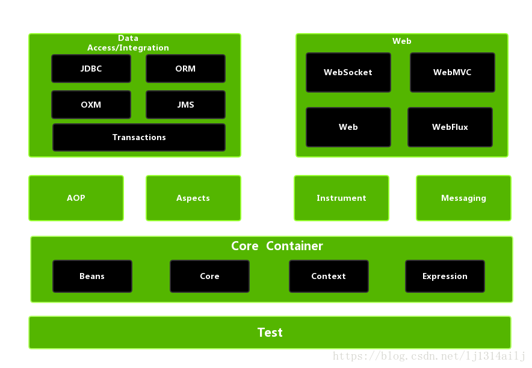

## Spring概述

Spring是一个企业级Java应用开发框架，他能使java开发更简单，它提供了企业级Java开发环境所需要的一切，能根据需求灵活的构建多种类型的体系架构，并支持 Groovy 和Kotlin；核心思想**简化开发**

**Spring的特点**

- **轻量：**Spring 是轻量的，基本的版本大约2MB
- **控制反转：**Spring通过控制反转实现了松散耦合，对象们给出它们的依赖，而不是创建或查找依赖的对象们
- **面向切面的编程(AOP)：**Spring支持面向切面的编程，并且把应用业务逻辑和系统服务分开
- **容器：**Spring 包含并管理应用中对象的生命周期和配置
- **MVC框架：**Spring 的WEB框架是个精心设计的框架，是Web框架的一个很好的替代品
- **事务管理：**Spring 提供一个持续的事务管理接口，可以扩展到上至本地事务下至全局事务（JTA）
- **异常处理：**Spring 提供方便的API把具体技术相关的异常（比如由JDBC，Hibernate or JDO抛出的）转化为一致的unchecked 异常

## Spring体系架构



### 核心容器

**spring-core: **提供了框架的基本组成部分，包括 IOC 和依赖注入功能

**spring-beans: **提供了核心接口**BeanFactory**，只有一个实现类**DefaultListableBeanFactory**完成了创建Bean的功能，其他实现类都是把委派给DefaultListableBeanFactory实现的

**spring-context: **在spring-core和spring-beans的基础上，添加了国际化、事件传播、资源加载和透明地创建上下文（比如，通过Servelet容器）等功能；核心接口**ApplicationContext**继承了BeanFactory并进行了扩展

**spring-expression: **提供了强大的表达式语言，用于在运行时查询和操作对象图

### 数据访问与集成

**spring-jdbc: **

**spring-orm: **

**spring-oxm: **

**spring-jms: **

**spring-tx: **

### Web组件

**spring-web: **

**spring-webmvc: **

**spring-webflux: **

**spring-websocket: **

### 测试模块

**spring-test: **


## Spring IOC

**IOC控制反转**：把创建对象的任务，交给Spring容器实现，我们自己不需要考虑创建对象复制的过程，以及对象间复杂的依赖关系

实现IOC容器需要哪些步骤：

IOC核心流程

~~~java
// ClassPathXmlApplicationContext的构造方法
public ClassPathXmlApplicationContext(
    String[] configLocations, boolean refresh, @Nullable ApplicationContext parent)
    throws BeansException {

    super(parent);
    setConfigLocations(configLocations);
    if (refresh) {
        refresh();
    }
}
// AbstractApplicationContext 定义的IOC 流程模版
public void refresh() throws BeansException, IllegalStateException {
    synchronized (this.startupShutdownMonitor) {
        // 准备方法：设置启动日期，启动标志，关闭标志
        prepareRefresh();
        // 通知子类执行refreshBeanFactory()方法，创建BeanFactory
        ConfigurableListableBeanFactory beanFactory = obtainFreshBeanFactory();
        // 为BeanFactory配置容器特性，例如类加载器、事件处理器等
        prepareBeanFactory(beanFactory);
        try {
            // 提供子类覆盖的额外处理，即子类处理自定义的BeanFactoryPostProcess
            postProcessBeanFactory(beanFactory);

            // 激活各种BeanFactory处理器.
            invokeBeanFactoryPostProcessors(beanFactory);

            // 注册拦截Bean创建的Bean处理器，即注册 BeanPostProcessor
            registerBeanPostProcessors(beanFactory);

            // 初始化信息源，和国际化相关.
            initMessageSource();

            // 初始化容器事件传播器.
            initApplicationEventMulticaster();

            // 给子类扩展初始化其他Bean
            onRefresh();

            // 在所有bean中查找listener bean，然后注册到广播器中
            registerListeners();

            // 初始化剩下的单例Bean(非延迟加载的)
            finishBeanFactoryInitialization(beanFactory);

            // 完成刷新过程,通知生命周期处理器lifecycleProcessor刷新过程,同时发出ContextRefreshEvent通知
            finishRefresh();
        } catch (BeansException ex) { 
            // 销毁已经创建的Bean
            destroyBeans(); 
            // 重置容器激活标签
            cancelRefresh(ex); 
            throw ex;
        }   finally {
            // Reset common introspection caches in Spring's core, since we
            // might not ever need metadata for singleton beans anymore...
            resetCommonCaches();
        }
    }
}
~~~


### 配置阶段

把我们需要注册给IOC容器的Bean，用配置文件进行描述；然后把配置文件路径传给Spring；XML是描述Bean关系的一种方式

~~~xml
<?xml version="1.0" encoding="UTF-8"?>
<beans xmlns="http://www.springframework.org/schema/beans"
       xmlns:xsi="http://www.w3.org/2001/XMLSchema-instance"
       xmlns:context="http://www.springframework.org/schema/context"
       xsi:schemaLocation="http://www.springframework.org/schema/beans  http://www.springframework.org/schema/beans/spring-beans.xsd
       http://www.springframework.org/schema/context http://www.springframework.org/schema/context/spring-context-4.1.xsd">
    <bean id = "helloService" class="com.qinfengsa.spring.service.HelloServiceImpl">
        <property name="message" value="my test start!"/> 
        <!--必须有set方法才能注入，原因是注入Property需要通过反射调用set方法-->
        <property name="calculateService" ref="calculateService"/>
    </bean>
    <bean id = "calculateService" class="com.qinfengsa.spring.service.CalculateServiceImpl">
    </bean>
</beans>
~~~

**Bean描述**

| 属性            | 描述                                                         |
| --------------- | ------------------------------------------------------------ |
| class           | 用来创建 bean 的 class，这个属性是强制性的                   |
| id/name         | bean的唯一标识符。在基于 XML 的配置元数据中， 可以使用 ID 或者name 属性来指定 bean |
| scope           | 定义bean 的作用域                                            |
| constructor-arg | 基于构造函数的依赖注入，                                     |
| properties      | 基于set方法的依赖注入                                        |
| autowire        | 它是用来注入依赖关系的，并会在接下来的章节中进行讨论。       |
| lazy-init       | 是否延迟加载                                                 |
| init-method     | 在 bean 的所有必需的属性被容器设置之后，调用回调方法。       |
| destroy-method  | 当包含该 bean 的容器被销毁时，回调方法。                     |

**Bean 作用域**

| 作用域         | 描述                                                         |
| -------------- | ------------------------------------------------------------ |
| singleton      | 在IOC容器仅存在一个Bean实例，Bean以单例方式存在，默认值      |
| prototype      | 每次从容器中调用Bean时，都返回一个新的实例，即每次调用getBean()时，相当于执行newXxxBean() |
| request        | 每次HTTP请求都会创建一个新的Bean，                           |
| session        | 同一个HTTP Session共享一个Bean，不同Session使用不同的Bean    |
| global-session | 该属性仅用于HTTP Session，同session作用域不同的是，所有的Session共享一个Bean实例 |

Bean的生命周期可以表达为：Bean的定义——Bean的初始化——Bean的使用——Bean的销毁 

**BeanPostProcessor**

BeanPostProcessor ：Bean后置处理器，我们可以通过自定义BeanPostProcessor拦截所有的bean（在bean实例化之前和之后拦截）；


**Bean生命周期**

1. Spring 容器根据实例化策略对 Bean 进行实例化。
2. 实例化完成后，如果该 bean 设置了一些属性的话，则利用 set 方法设置一些属性（依赖注入）。
3. 如果该 Bean 实现了 BeanNameAware 接口，则调用 `setBeanName()` 方法。
4. 如果该 bean 实现了 BeanClassLoaderAware 接口，则调用 `setBeanClassLoader()` 方法。
5. 如果该 bean 实现了 BeanFactoryAware接口，则调用 `setBeanFactory()` 方法。
6. 如果该容器注册了 BeanPostProcessor，则会调用`postProcessBeforeInitialization()` 方法完成 bean 前置处理
7. 如果该 bean 实现了 InitializingBean 接口，则调用 。`afterPropertiesSet()` 方法。
8. 如果该 bean 配置了 init-method 方法，则调用 init-method 指定的方法。
9. 初始化完成后，如果该容器注册了 BeanPostProcessor 则会调用 `postProcessAfterInitialization()` 方法完成 bean 的后置处理。
10. 对象完成初始化，开始方法调用。
11. 在容器进行关闭之前，如果该 bean 实现了 DisposableBean 接口，则调用 `destroy()` 方法。
12. 在容器进行关闭之前，如果该 bean 配置了 destroy-mehod，则调用其指定的方法。
13. 到这里一个 bean 也就完成了它的一生。


**这里以ClassPathXmlApplicationContext作为入口**

### 定位阶段

前面Spring已经定义好了配置文件，现在需要将配件文件从硬盘目录中读取出来，并扫描相关的注解，这个阶段就是定位阶段

加载配置文件需要资源解析器，为了职能划分明确，Spring最常用的办法委托给别的类（接口）；

**获取加载配置文件的资源解析器**

```java
public abstract class AbstractApplicationContext extends DefaultResourceLoader
		implements ConfigurableApplicationContext {
	// 内置资源解析器，初始化的是创建，看上去是委托给别的类实现的	
	private ResourcePatternResolver resourcePatternResolver;
	// 构造函数，创建资源解析器
	public AbstractApplicationContext() {
		this.resourcePatternResolver = getResourcePatternResolver();
	}
	// 获取一个Spring Source的加载器用于读入Spring Bean定义资源文件
	protected ResourcePatternResolver getResourcePatternResolver() {
		// AbstractApplicationContext继承DefaultResourceLoader，因此也是一个资源加载器
		// Spring资源加载器，其getResource(String location)方法用于载入资源
		// 最后你会发现，饶了一圈，最终解析配置文件的还是当前类 AbstractApplicationContext
		// 因为当前类继承了DefaultResourceLoader，本身就是一个ResourceLoader
		// 为什么这么设计，单一职责原则，如果以后更换ResourceLoader，或者把ResourceLoader去掉
		// 这种设计就会比直接调用自身方法侵入性更小，日后也容易扩展
		return new PathMatchingResourcePatternResolver(this);
	}
}
public class PathMatchingResourcePatternResolver implements ResourcePatternResolver {
	public PathMatchingResourcePatternResolver(ResourceLoader resourceLoader) {
		Assert.notNull(resourceLoader, "ResourceLoader must not be null");
		// 设置Spring的资源加载器
		this.resourceLoader = resourceLoader;
	}
}
```

```java
// 默认的资源解析器
public class DefaultResourceLoader implements ResourceLoader {
    @Nullable
	private ClassLoader classLoader;

	private final Set<ProtocolResolver> protocolResolvers = new LinkedHashSet<>(4);

	private final Map<Class<?>, Map<Resource, ?>> resourceCaches = new ConcurrentHashMap<>(4);
    public DefaultResourceLoader() {
		this.classLoader = ClassUtils.getDefaultClassLoader();
	}
    @Override
	public Resource getResource(String location) {
		Assert.notNull(location, "Location must not be null");
		// 看下缓存里有没有
		for (ProtocolResolver protocolResolver : this.protocolResolvers) {
			Resource resource = protocolResolver.resolve(location, this);
			if (resource != null) {
				return resource;
			}
		}
		// 如果是路径方式，调用getResourceByPath解析配置文件
		if (location.startsWith("/")) {
			return getResourceByPath(location);
		}// 如果classpath:开头，调用ClassPathResource
		else if (location.startsWith(CLASSPATH_URL_PREFIX)) {
			return new ClassPathResource(location.substring(CLASSPATH_URL_PREFIX.length()),getClassLoader());
		}
		else {
			try {
				// 通过URL判断配置文件是否URL，通过URL解析
				URL url = new URL(location);
				return (ResourceUtils.isFileURL(url) ? new FileUrlResource(url) : new UrlResource(url));
			}
			catch (MalformedURLException ex) {
				// 不是URL，默认以路径解析
				return getResourceByPath(location);
			}
		}
	}
}
```

资源解析器创建后，需要记录配置文件的路径，然后开始解析

~~~java
public abstract class AbstractRefreshableConfigApplicationContext 
    extends AbstractRefreshableApplicationContext implements BeanNameAware, InitializingBean {
    // 通过String数组记录配置文件的路径
	private String[] configLocations;
   	public void setConfigLocations(@Nullable String... locations) {
		if (locations != null) {
			Assert.noNullElements(locations, "Config locations must not be null");
			this.configLocations = new String[locations.length];
			for (int i = 0; i < locations.length; i++) {
                // resolvePath 将字符串解析为路径 
				this.configLocations[i] = resolvePath(locations[i]).trim(); // 去除空格
			}
		} else {
			this.configLocations = null;
		}
	}
}
~~~


### 加载阶段

解析配置信息，然后装载BeanDefinition

~~~java
public abstract class AbstractRefreshableApplicationContext extends AbstractApplicationContext {
    // 创建beanFactory时 通知子类执行refreshBeanFactory()方法 
    @Override
    protected final void refreshBeanFactory() throws BeansException {
        //如果已经有容器，销毁容器中的bean，关闭容器
        if (hasBeanFactory()) {
            destroyBeans();
            closeBeanFactory();
        }
        try {
            // 创建IOC容器, IOC容器的实现类只有一个DefaultListableBeanFactory
            DefaultListableBeanFactory beanFactory = createBeanFactory();
            beanFactory.setSerializationId(getId());
            // 对IOC容器进行定制化，如设置启动参数，开启注解的自动装配等
            customizeBeanFactory(beanFactory);
            // 调用载入Bean定义的方法，委派给子类执行 
            loadBeanDefinitions(beanFactory);
            synchronized (this.beanFactoryMonitor) {
                this.beanFactory = beanFactory;
            }
        }
        catch (IOException ex) {
            throw new ApplicationContextException("I/O error parsing bean definition source for " + 						getDisplayName(), ex);
        }
    }
}
// AbstractXmlApplicationContext中的loadBeanDefinitions
public abstract class AbstractXmlApplicationContext extends AbstractRefreshableConfigApplicationContext {
    
    @Override
    protected void loadBeanDefinitions(DefaultListableBeanFactory beanFactory) 
        throws BeansException, IOException {
        // Create a new XmlBeanDefinitionReader for the given BeanFactory.
        // 创建XmlBeanDefinitionReader，即创建Bean读取器 
        // ！这里需要注意 DefaultListableBeanFactory 做了转换，beanFactory 转变成了 beanDefinitionReader
        // DefaultListableBeanFactory 实现了 BeanDefinitionRegistry接口 后面有用到
        XmlBeanDefinitionReader beanDefinitionReader = new XmlBeanDefinitionReader(beanFactory);

        // 为Bean读取器设置Spring资源加载器，AbstractXmlApplicationContext的
        // 父类AbstractApplicationContext继承DefaultResourceLoader，因此，容器本身也是一个资源加载器
        beanDefinitionReader.setEnvironment(this.getEnvironment());
        beanDefinitionReader.setResourceLoader(this); // this也是一个ResourceLoader
        // 为Bean读取器设置SAX xml解析器
        beanDefinitionReader.setEntityResolver(new ResourceEntityResolver(this));

        // 当Bean读取器读取Bean定义的Xml资源文件时，启用Xml的校验机制
        initBeanDefinitionReader(beanDefinitionReader);
        // Bean读取器真正实现加载的方法
        loadBeanDefinitions(beanDefinitionReader);
    } 
}

public class XmlBeanDefinitionReader extends AbstractBeanDefinitionReader {
    // 最终通过XmlBeanDefinitionReader解析XML配置文件
    public int loadBeanDefinitions(EncodedResource encodedResource) throws BeanDefinitionStoreException {
        Assert.notNull(encodedResource, "EncodedResource must not be null");
        if (logger.isInfoEnabled()) {
            logger.info("Loading XML bean definitions from " + encodedResource.getResource());
        }
        Set<EncodedResource> currentResources = this.resourcesCurrentlyBeingLoaded.get();
        if (currentResources == null) {
            currentResources = new HashSet<>(4);
            this.resourcesCurrentlyBeingLoaded.set(currentResources);
        }
        if (!currentResources.add(encodedResource)) {
            throw new BeanDefinitionStoreException(
                "Detected cyclic loading of " + encodedResource + " - check your import definitions!");
        }
        try {
            // 把配置文件转换为IO流
            InputStream inputStream = encodedResource.getResource().getInputStream();
            try {
                // 从InputStream中得到XML的解析源
                InputSource inputSource = new InputSource(inputStream);
                if (encodedResource.getEncoding() != null) {
                    inputSource.setEncoding(encodedResource.getEncoding());
                }
                // 这里是具体的读取过程
                return doLoadBeanDefinitions(inputSource, encodedResource.getResource());
            }
            finally {
                // 关闭从Resource中得到的IO流
                inputStream.close();
            }
        }
        catch (IOException ex) {
            throw new BeanDefinitionStoreException(
                "IOException parsing XML document from " + encodedResource.getResource(), ex);
        }
        finally {
            currentResources.remove(encodedResource);
            if (currentResources.isEmpty()) {
                this.resourcesCurrentlyBeingLoaded.remove();
            }
        }
    } 
    // 真正干活的方法
    protected int doLoadBeanDefinitions(InputSource inputSource, Resource resource)
        throws BeanDefinitionStoreException {
        try {
            // 将XML文件转换为DOM对象，解析过程由documentLoader实现
            Document doc = doLoadDocument(inputSource, resource);
            // 开始解析配置文件，进入注册阶段
            return registerBeanDefinitions(doc, resource);
        }
        catch (BeanDefinitionStoreException ex) {
            throw ex;
        } ...// 省略
    }
}
~~~

### 注册阶段

把配置文件读取到内存中只会，需要将BeanDefinition注册到IOC容器中

~~~java
public class XmlBeanDefinitionReader extends AbstractBeanDefinitionReader {	
	// 按照Spring的Bean语义要求将Bean定义资源解析并转换为容器内部数据结构
	public int registerBeanDefinitions(Document doc, Resource resource) throws BeanDefinitionStoreException {
		// 创建BeanDefinitionDocumentReader解析配置文件
		BeanDefinitionDocumentReader documentReader = createBeanDefinitionDocumentReader();
		// 获得容器中注册的Bean数量
		int countBefore = getRegistry().getBeanDefinitionCount(); 
		// 委托给documentReader进行注册BeanDefinition
		documentReader.registerBeanDefinitions(doc, createReaderContext(resource));
		// 统计解析的Bean数量
		return getRegistry().getBeanDefinitionCount() - countBefore;
	}
}
// BeanDefinitionDocumentReader 开始注册BeanDefinition
public class DefaultBeanDefinitionDocumentReader implements BeanDefinitionDocumentReader {
    public void registerBeanDefinitions(Document doc, XmlReaderContext readerContext) {
		// 获得XML描述符
		this.readerContext = readerContext; 
		// 获得Document的根元素
		Element root = doc.getDocumentElement();
		doRegisterBeanDefinitions(root);
	}

	// 开始干活，从xml的root节点开始解析
	protected void doRegisterBeanDefinitions(Element root) { 
		// 具体的解析过程委托给BeanDefinitionParserDelegate实现 
		BeanDefinitionParserDelegate parent = this.delegate;
		this.delegate = createDelegate(getReaderContext(), root, parent); 
		if (this.delegate.isDefaultNamespace(root)) {
			String profileSpec = root.getAttribute(PROFILE_ATTRIBUTE);
			if (StringUtils.hasText(profileSpec)) {
				String[] specifiedProfiles = StringUtils.tokenizeToStringArray(
						profileSpec, BeanDefinitionParserDelegate.MULTI_VALUE_ATTRIBUTE_DELIMITERS);
				if (!getReaderContext().getEnvironment().acceptsProfiles(specifiedProfiles)) {
					return;
				}
			}
		} 
		// 在解析XML之前，提供了扩展方法 
		preProcessXml(root);
		// 从Document的root开始进行BeanDefinition的解析，委托给delegate
		parseBeanDefinitions(root, this.delegate);
		// 在解析XML之后，提供了扩展方法 
		postProcessXml(root); 
		this.delegate = parent;
	}
    
    protected void parseBeanDefinitions(Element root, BeanDefinitionParserDelegate delegate) {
		//Bean定义的Document对象使用了Spring默认的XML命名空间
		if (delegate.isDefaultNamespace(root)) {
			//获取Bean定义的Document对象根元素的所有子节点
			NodeList nl = root.getChildNodes();
			for (int i = 0; i < nl.getLength(); i++) {
				Node node = nl.item(i);
				//获得Document节点是XML元素节点
				if (node instanceof Element) {
					Element ele = (Element) node;
					//Bean定义的Document的元素节点使用的是Spring默认的XML命名空间
					if (delegate.isDefaultNamespace(ele)) {
						//使用Spring的Bean规则解析元素节点
						parseDefaultElement(ele, delegate);
					}
					else {
						//没有使用Spring默认的XML命名空间，则使用用户自定义的解//析规则解析元素节点
						delegate.parseCustomElement(ele);
					}
				}
			}
		}
		else {
			//Document的根节点没有使用Spring默认的命名空间，则使用用户自定义的
			//解析规则解析Document根节点
			delegate.parseCustomElement(root);
		}
	} 
	// 使用Spring的Bean规则解析Document元素节点
	private void parseDefaultElement(Element ele, BeanDefinitionParserDelegate delegate) {
		// 对 <Import> 标签的解析
		if (delegate.nodeNameEquals(ele, IMPORT_ELEMENT)) {
			importBeanDefinitionResource(ele);
		}
		// 对 <Alias> 标签的解析
		else if (delegate.nodeNameEquals(ele, ALIAS_ELEMENT)) {
			processAliasRegistration(ele);
		} 
		// 对 <bean> 标签的解析
		else if (delegate.nodeNameEquals(ele, BEAN_ELEMENT)) {
			processBeanDefinition(ele, delegate);
        // 对 <beans> 标签的解析
		} else if (delegate.nodeNameEquals(ele, NESTED_BEANS_ELEMENT)) {
			// recurse
			doRegisterBeanDefinitions(ele);
		}
	}
    
    // 解析BeanDefinition
	protected void processBeanDefinition(Element ele, BeanDefinitionParserDelegate delegate) {
        // 把ele节点（bean节点）封装成BeanDefinitionHolder
		BeanDefinitionHolder bdHolder = delegate.parseBeanDefinitionElement(ele);
		if (bdHolder != null) {
			bdHolder = delegate.decorateBeanDefinitionIfRequired(ele, bdHolder);
			try { 
				// 向Spring IOC容器注册解析得到的BeanDefinition 
                // getReaderContext().getRegistry() 实际就是DefaultListableBeanFactory
				BeanDefinitionReaderUtils.registerBeanDefinition(bdHolder, getReaderContext().getRegistry());
			}
			catch (BeanDefinitionStoreException ex) {
				getReaderContext().error("Failed to register bean definition with name '" +
						bdHolder.getBeanName() + "'", ele, ex);
			} 
			// 在完成向Spring IOC容器注册解析得到的Bean定义之后，发送注册事件
			getReaderContext().fireComponentRegistered(new BeanComponentDefinition(bdHolder));
		}
	}
}
public class BeanDefinitionReaderUtils {
	// 将解析的BeanDefinitionHold注册到容器中
	public static void registerBeanDefinition(
			BeanDefinitionHolder definitionHolder, BeanDefinitionRegistry registry)
			throws BeanDefinitionStoreException {  
		// 获取解析的BeanDefinition的名称
		String beanName = definitionHolder.getBeanName();
		// registry（DefaultListableBeanFactory）向IOC容器注册BeanDefinition
        // DefaultListableBeanFactory 就是 IOC容器
		registry.registerBeanDefinition(beanName, definitionHolder.getBeanDefinition());
 
		// 如果解析的BeanDefinition有别名，向容器为其注册别名
		String[] aliases = definitionHolder.getAliases();
		if (aliases != null) {
			for (String alias : aliases) {
				registry.registerAlias(beanName, alias);
			}
		}
	}
}
// IOC容器
public class DefaultListableBeanFactory extends AbstractAutowireCapableBeanFactory
		implements ConfigurableListableBeanFactory, BeanDefinitionRegistry, Serializable {
		
	// 存储注册信息的BeanDefinition，使用ConcurrentHashMap存储
	private final Map<String, BeanDefinition> beanDefinitionMap = new ConcurrentHashMap<>(256);	
	// 记录所有BeanDefinition的name
	private volatile List<String> beanDefinitionNames = new ArrayList<>(256);
	// 单例bean名称Set,按顺序登记  
	private volatile Set<String> manualSingletonNames = new LinkedHashSet<>(16);
	// 向IOC容器注册解析的BeanDefiniton
	@Override
	public void registerBeanDefinition(String beanName, BeanDefinition beanDefinition)
			throws BeanDefinitionStoreException { 
		Assert.hasText(beanName, "Bean name must not be empty");
		Assert.notNull(beanDefinition, "BeanDefinition must not be null");

		// 校验 BeanDefiniton
		if (beanDefinition instanceof AbstractBeanDefinition) {
			try {
				((AbstractBeanDefinition) beanDefinition).validate();
			} catch (BeanDefinitionValidationException ex) {
				throw new BeanDefinitionStoreException(beanDefinition.getResourceDescription(), beanName,
						"Validation of bean definition failed", ex);
			}
		} 
		 BeanDefinition oldBeanDefinition;
		// 根据beanName 判断 BeanDefinition是否已被注册
		oldBeanDefinition = this.beanDefinitionMap.get(beanName);

		if (oldBeanDefinition != null) {
			if (!isAllowBeanDefinitionOverriding()) {
				throw new BeanDefinitionStoreException(beanDefinition.getResourceDescription(), beanName,
						"Cannot register bean definition [" + beanDefinition + "] for bean '" + beanName +
						"': There is already [" + oldBeanDefinition + "] bound.");
			} else if (oldBeanDefinition.getRole() < beanDefinition.getRole()) {
				//...省略
			} else if (!beanDefinition.equals(oldBeanDefinition)) {
				//...省略
			} else {
				//...省略
			} 
			// 覆盖掉旧的
			this.beanDefinitionMap.put(beanName, beanDefinition);
		} else {
			if (hasBeanCreationStarted()) { 
				// 注册的过程中需要synchronized，保证数据一致性
				synchronized (this.beanDefinitionMap) {
					this.beanDefinitionMap.put(beanName, beanDefinition);
					// 把当前beanName 添加到beanDefinitionNames列表
					List<String> updatedDefinitions = new ArrayList<>(this.beanDefinitionNames.size() + 1);
					updatedDefinitions.addAll(this.beanDefinitionNames);
					updatedDefinitions.add(beanName);
					this.beanDefinitionNames = updatedDefinitions;
					if (this.manualSingletonNames.contains(beanName)) {
						Set<String> updatedSingletons = new LinkedHashSet<>(this.manualSingletonNames);
						updatedSingletons.remove(beanName);
						this.manualSingletonNames = updatedSingletons;
					}
				}
			} else {
				// Still in startup registration phase
				this.beanDefinitionMap.put(beanName, beanDefinition);
				this.beanDefinitionNames.add(beanName);
				this.manualSingletonNames.remove(beanName);
			}
			this.frozenBeanDefinitionNames = null;
		}

		// 检查是否有同名的BeanDefinition已经在IOC容器中注册
		if (oldBeanDefinition != null || containsSingleton(beanName)) {
			// 重置所有已经注册过的BeanDefinition的缓存
			resetBeanDefinition(beanName);
		}
	}
}
~~~

**BeanDefinition的创建过程**

~~~java
// 开始解析<bean>标签
public class BeanDefinitionParserDelegate {
    // 解析Bean定义资源文件中的<Bean>元素，这个方法中主要处理<Bean>元素的id，name和别名属性
	@Nullable
	public BeanDefinitionHolder parseBeanDefinitionElement(Element ele,  BeanDefinition containingBean) {
		// 获取<bean>元素中的id属性值
		String id = ele.getAttribute(ID_ATTRIBUTE);
		// 获取<bean>元素中的name属性值
		String nameAttr = ele.getAttribute(NAME_ATTRIBUTE); 
		// 获取<bean>元素中的alias属性值
		List<String> aliases = new ArrayList<>(); 
		// 将<bean>的name属性值存放到别名List中
		if (StringUtils.hasLength(nameAttr)) {
			String[] nameArr = StringUtils.tokenizeToStringArray(nameAttr, MULTI_VALUE_ATTRIBUTE_DELIMITERS);
			aliases.addAll(Arrays.asList(nameArr));
		} 
		String beanName = id;
		// 如果<bean>元素中没有配置id属性时，将别名中的第一个值赋值给beanName
		if (!StringUtils.hasText(beanName) && !aliases.isEmpty()) {
			beanName = aliases.remove(0);
			if (logger.isDebugEnabled()) {
				logger.debug("No XML 'id' specified - using '" + beanName +
						"' as bean name and " + aliases + " as aliases");
			}
		}

		// 检查<bean>元素所配置的id或者name的唯一性，containingBean标识<Bean>
		// 元素中是否包含子<bean>元素
		if (containingBean == null) {
			//检查<bean>元素所配置的id、name或者别名是否重复
			checkNameUniqueness(beanName, aliases, ele);
		} 
		// 详细解析<bean>元素的其他属性
		AbstractBeanDefinition beanDefinition = parseBeanDefinitionElement(ele, beanName, containingBean);
		if (beanDefinition != null) {
			if (!StringUtils.hasText(beanName)) {
				try {
					if (containingBean != null) {
						// 如果<bean>元素中没有配置id、别名或者name，且没有包含子元素
						// <bean>元素，为解析的Bean生成一个唯一beanName并注册
						beanName = BeanDefinitionReaderUtils.generateBeanName(
								beanDefinition, this.readerContext.getRegistry(), true);
					} else {
						// 如果<Bean>元素中没有配置id、别名或者name，且包含了子元素
						// <Bean>元素，为解析的Bean使用别名向IOC容器注册
						beanName = this.readerContext.generateBeanName(beanDefinition); 
						String beanClassName = beanDefinition.getBeanClassName();
						if (beanClassName != null && beanName.startsWith(beanClassName) 
                            && beanName.length() > beanClassName.length() && 
                            !this.readerContext.getRegistry().isBeanNameInUse(beanClassName)) {
							aliases.add(beanClassName);
						}
					}
					if (logger.isDebugEnabled()) {
						logger.debug("Neither XML 'id' nor 'name' specified - " +
								"using generated bean name [" + beanName + "]");
					}
				} catch (Exception ex) {
					error(ex.getMessage(), ele);
					return null;
				}
			}
			String[] aliasesArray = StringUtils.toStringArray(aliases);
			return new BeanDefinitionHolder(beanDefinition, beanName, aliasesArray);
		}
		// 当解析出错时，返回null
		return null;
	}
    // 对<bean>元素的其他属性进行解析
	@Nullable
	public AbstractBeanDefinition parseBeanDefinitionElement(
			Element ele, String beanName, @Nullable BeanDefinition containingBean) {
		// 记录解析的<bean>
		this.parseState.push(new BeanEntry(beanName));

		// 这里只读取<bean>元素中配置的class名字，然后载入到BeanDefinition中去
		// 只是记录配置的class名字，不做实例化，对象的实例化在依赖注入时完成
		String className = null;

		// 如果<bean>元素中配置了parent属性，则获取parent属性的值
		if (ele.hasAttribute(CLASS_ATTRIBUTE)) {
			className = ele.getAttribute(CLASS_ATTRIBUTE).trim();
		}
		String parent = null;
		if (ele.hasAttribute(PARENT_ATTRIBUTE)) {
			parent = ele.getAttribute(PARENT_ATTRIBUTE);
		} 
		try {
			// 根据<bean>元素配置的class名称和parent属性值创建BeanDefinition
			// 为载入Bean定义信息做准备
			AbstractBeanDefinition bd = createBeanDefinition(className, parent);
			// 解析<bean>元素的配置 singleton,scope,abstract,lazy-init,autowire 等属性
			parseBeanDefinitionAttributes(ele, beanName, containingBean, bd);
			// 解析<bean>的Description属性
			bd.setDescription(DomUtils.getChildElementValueByTagName(ele, DESCRIPTION_ELEMENT));
			// 解析<bean>的meta(元信息)属性 
			parseMetaElements(ele, bd);
			// 解析<bean>元素的lookup-method属性
			parseLookupOverrideSubElements(ele, bd.getMethodOverrides());
			// 解析<bean>元素的replaced-method属性
			parseReplacedMethodSubElements(ele, bd.getMethodOverrides());
			// 解析<bean>元素的构造方法 
			parseConstructorArgElements(ele, bd);
			// 解析<bean>元素的<property> 
			parsePropertyElements(ele, bd);
			// 解析<bean>元素的qualifier属性
			parseQualifierElements(ele, bd);
			// 为当前解析的bean设置所需的资源和依赖对象
			bd.setResource(this.readerContext.getResource());
			bd.setSource(extractSource(ele)); 
			return bd;
		} catch (ClassNotFoundException ex) {
			error("Bean class [" + className + "] not found", ele, ex);
		} catch (NoClassDefFoundError err) {
			error("Class that bean class [" + className + "] depends on not found", ele, err);
		} catch (Throwable ex) {
			error("Unexpected failure during bean definition parsing", ele, ex);
		} finally {
			this.parseState.pop();
		} 
		// 解析<bean>元素出错时，返回null
		return null;
	}
    
}
public class BeanDefinitionReaderUtils {
    // 创建BeanDefinition
	public static AbstractBeanDefinition createBeanDefinition(
			@Nullable String parentName, @Nullable String className, @Nullable ClassLoader classLoader) 	
        throws ClassNotFoundException {
		// 默认使用GenericBeanDefinition
		GenericBeanDefinition bd = new GenericBeanDefinition();
        // 主要设置Parent和Class
		bd.setParentName(parentName);
		if (className != null) {
			if (classLoader != null) {
				bd.setBeanClass(ClassUtils.forName(className, classLoader));
			} else {
				bd.setBeanClassName(className);
			}
		}
		return bd;
	}
}
~~~


## Spring 依赖注入

**依赖注入：**或者依赖查找，IOC容器中的对象A在被创建的时候，IOC容器会把对象中的依赖的实体对象B的引用传递给对象A，这个过程被称为依赖注入，对象A的依赖（对象B）通过这种方式注入了自身，从而构建了一个完整的对象；

**基于构造函数的依赖注入**

~~~java
public class IocUser {
    private int age; 
    private String name; 
    private HelloService helloService;
    public IocUser(int age,  String name, HelloService helloService) {
        this.age = age;
        this.name = name;
        this.helloService = helloService;
    } 
    public void sayHello() {
        helloService.sayHello(this.name);
    } 
}
~~~

~~~xml
<?xml version="1.0" encoding="UTF-8"?>
<beans xmlns="http://www.springframework.org/schema/beans"
       xmlns:xsi="http://www.w3.org/2001/XMLSchema-instance"
       xmlns:context="http://www.springframework.org/schema/context"
       xsi:schemaLocation="http://www.springframework.org/schema/beans http://www.springframework.org/schema/beans/spring-beans.xsd
       http://www.springframework.org/schema/context http://www.springframework.org/schema/context/spring-context-4.1.xsd">
    <!-- 构造函数注入 -->
    <bean class="com.qinfengsa.spring.bean.IocUser" lazy-init="false">
        <constructor-arg ref="helloService" />
        <constructor-arg type="int" value="1"/>
        <constructor-arg  index="1" type="java.lang.String" value="qin"/>
    </bean>
    <bean id = "helloService" class="com.qinfengsa.spring.service.HelloServiceImpl" >
    </bean>
</beans>
~~~

constructor-arg会自动根据类型匹配，当出现相同类型时会按顺序注入，也可以通过index属性确定构造参数位置

**基于set方法的依赖注入**

必须有set方法才能注入

~~~java
public class HelloWorld {
    private String message1;
    private String message2;
    private HelloService helloService;
    public HelloService getHelloService() {
        return helloService;
    }
    public void setHelloService(HelloService helloService) {
        this.helloService = helloService;
    }
    public void setMessage1(String message){
        this.message1  = message;
    }
    public void setMessage2(String message){
        this.message2  = message;
    }
    public String getMessage1(){
        log.info("World Message1 : {}" , message1);
        return message1;
    }
    public String getMessage2(){
        log.info("World Message2 : {}" , message2);
        return message2;
    }
}

~~~

~~~xml
<?xml version="1.0" encoding="UTF-8"?>
<beans xmlns="http://www.springframework.org/schema/beans"
       xmlns:xsi="http://www.w3.org/2001/XMLSchema-instance"
       xmlns:context="http://www.springframework.org/schema/context"
       xsi:schemaLocation="http://www.springframework.org/schema/beans http://www.springframework.org/schema/beans/spring-beans.xsd
       http://www.springframework.org/schema/context http://www.springframework.org/schema/context/spring-context-4.1.xsd">
    <bean id = "helloWorld" class="com.qinfengsa.spring.bean.HelloWorld" >
        <property name="message1" value="Hello World!"/>
        <property name="message2" value="Hello Second World!"/>
        <property name="helloService" ref="helloService" />
    </bean>
    <bean id = "helloService" class="com.qinfengsa.spring.service.HelloServiceImpl" /> 
</beans>
~~~


**注入内部 Beans**

```xml
<?xml version="1.0" encoding="UTF-8"?>
<beans xmlns="http://www.springframework.org/schema/beans"
       xmlns:xsi="http://www.w3.org/2001/XMLSchema-instance"
       xmlns:context="http://www.springframework.org/schema/context"
       xsi:schemaLocation="http://www.springframework.org/schema/beans http://www.springframework.org/schema/beans/spring-beans.xsd
       http://www.springframework.org/schema/context http://www.springframework.org/schema/context/spring-context-4.1.xsd">
    <bean id = "helloWorld" class="com.qinfengsa.spring.bean.HelloWorld" >
        <property name="message1" value="Hello World!"/>
        <property name="message2" value="Hello Second World!"/>
        <property name="helloService"  >
             <bean class="com.qinfengsa.spring.service.HelloServiceImpl" >
        </property>
    </bean> 
</beans>
```

**注入集合**

~~~java
@Data // 必须有set方法才能注入
public class IocCollection {
    private List<Integer> myList;
    private Set<String> mySet;
    private Map<String,String> myMap;
    private Properties  myProperties;
}
~~~

~~~xml
<?xml version="1.0" encoding="UTF-8"?>
<beans xmlns="http://www.springframework.org/schema/beans"
       xmlns:xsi="http://www.w3.org/2001/XMLSchema-instance"
       xmlns:context="http://www.springframework.org/schema/context"
       xsi:schemaLocation="http://www.springframework.org/schema/beans http://www.springframework.org/schema/beans/spring-beans.xsd
       http://www.springframework.org/schema/context http://www.springframework.org/schema/context/spring-context-4.1.xsd"> 
    <bean class="com.qinfengsa.spring.bean.IocCollection">
        <property name="myList">
            <list>
                <value>17</value>
                <value>29</value>
                <value>31</value>
                <value>37</value>
            </list>
        </property>
        <property name="mySet">
            <set>
                <value>29</value>
                <value>29</value>
                <value>31</value>
                <value>37</value>
            </set>
        </property>
        <property name="myMap">
            <map>
                <entry key="1" value="17"/>
                <entry key="2" value="29"/>
                <entry key="3" value="31"/>
                <entry key="4" value="37"/>
            </map>
        </property>
        <property name="myProperties">
            <props>
                <prop key="name">qin</prop>
                <prop key="age">18</prop>
                <prop key="addr">China</prop>
                <prop key="sex">boy</prop>
            </props>
        </property>
    </bean>
</beans>
~~~

### 依赖注入流程

在IOC中，Spring创建了BeanDefinition，DefaultListableBeanFactory通过CurrentHashMap保存了BeanDefinition；BeanDefinition保存了<bean>标签的全部属性，BeanFactory可以通过这些属性创建Bean

**将Bean实例化**

Bean实例化的入口BeanFactory的getBean()方法

~~~java
public abstract class AbstractBeanFactory extends FactoryBeanRegistrySupport implements 
    ConfigurableBeanFactory {
    @Override
	public Object getBean(String name) throws BeansException {
		// doGetBean才是真正干活
		return doGetBean(name, null, null, false);
	}  
    // 向IOC容器注册并获取Bean，触发依赖注入 
	protected <T> T doGetBean(final String name, @Nullable final Class<T> requiredType,
			@Nullable final Object[] args, boolean typeCheckOnly) throws BeansException {
		// 获取 beanName，这里是一个转换动作，将 name 转换为 beanName
        // 例如把beanName中的&去掉，把alias别名转换为className
		final String beanName = transformedBeanName(name);
		Object bean;    
        // 先从缓存中取被创建的单例bean，对于单例模式的Bean整个IOC容器中只创建一次
		Object sharedInstance = getSingleton(beanName);
		// IOC容器创建单例模式Bean实例对象
		if (sharedInstance != null && args == null) {
			if (logger.isDebugEnabled()) { 
				if (isSingletonCurrentlyInCreation(beanName)) {
					logger.debug("Returning eagerly cached instance of singleton bean '" + beanName +
							"' that is not fully initialized yet - a consequence of a circular reference");
				} else {
					logger.debug("Returning cached instance of singleton bean '" + beanName + "'");
				}
			}
			// 获取给定Bean的实例对象，主要是完成FactoryBean的相关处理
			// 注意：BeanFactory是管理容器中Bean的工厂，而FactoryBean是创建对象的工厂Bean，两者之间有区别
			bean = getObjectForBeanInstance(sharedInstance, name, beanName, null);
		} else { 
			if (isPrototypeCurrentlyInCreation(beanName)) {
				throw new BeanCurrentlyInCreationException(beanName);
			} 
			// 如果容器中没有找到，则从父类容器中加载
			BeanFactory parentBeanFactory = getParentBeanFactory();
			// 当前容器的父级容器存在，且当前容器中不存在指定名称的Bean
			if (parentBeanFactory != null && !containsBeanDefinition(beanName)) {
				// 解析指定Bean名称的原始名称
				String nameToLookup = originalBeanName(name);
				if (parentBeanFactory instanceof AbstractBeanFactory) {
					return ((AbstractBeanFactory) parentBeanFactory).doGetBean(
							nameToLookup, requiredType, args, typeCheckOnly);
				} else if (args != null) { 
					// 委派父级容器根据指定名称和显式的参数查找
					return (T) parentBeanFactory.getBean(nameToLookup, args);
				} else { 
					// 委派父级容器根据指定名称和类型查找
					return parentBeanFactory.getBean(nameToLookup, requiredType);
				}
			} 
			// 创建的Bean是否需要进行类型验证，一般不需要
			if (!typeCheckOnly) {
				// 向容器标记指定的Bean已经被创建
				markBeanAsCreated(beanName);
			} 
			try {
				// 根据指定Bean名称获取其父级的Bean定义
				// 主要解决Bean继承时子类合并父类公共属性问题
				final RootBeanDefinition mbd = getMergedLocalBeanDefinition(beanName);
				checkMergedBeanDefinition(mbd, beanName, args);
 
				// 获取当前Bean所有依赖Bean的名称
				String[] dependsOn = mbd.getDependsOn();
				// 如果当前Bean有依赖Bean
				if (dependsOn != null) {
					for (String dep : dependsOn) {
						if (isDependent(beanName, dep)) {
							throw new BeanCreationException(mbd.getResourceDescription(), beanName,
                          		"Circular depends-on relationship between '" + beanName 
                                   + "' and '" + dep + "'");
						}
						//递归调用getBean方法，获取当前Bean的依赖Bean
						registerDependentBean(dep, beanName);
						// 把被依赖Bean注册给当前依赖的Bean
						getBean(dep);
					}
				}  
				// 创建单例模式Bean的实例对象
				if (mbd.isSingleton()) {
					//这里使用了一个匿名内部类，创建Bean实例对象，并且注册给所依赖的对象
					sharedInstance = getSingleton(beanName, () -> {
						try {
							//创建一个指定Bean实例对象，如果有父级继承，则合并子类和父类的定义
							return createBean(beanName, mbd, args);
						} catch (BeansException ex) { 
							//显式地从容器单例模式Bean缓存中清除实例对象
							destroySingleton(beanName);
							throw ex;
						}
					});
					//获取给定Bean的实例对象
					bean = getObjectForBeanInstance(sharedInstance, name, beanName, mbd);
				} 
				//IOC容器创建原型模式Bean实例对象
				else if (mbd.isPrototype()) { 
					//原型模式(Prototype)是每次都会创建一个新的对象
					Object prototypeInstance = null;
					try {
						//回调beforePrototypeCreation方法，默认的功能是注册当前创建的原型对象
						beforePrototypeCreation(beanName);
						//创建指定Bean对象实例
						prototypeInstance = createBean(beanName, mbd, args);
					} finally {
						//回调afterPrototypeCreation方法，默认的功能告诉IOC容器指定Bean的原型对象不再创建
						afterPrototypeCreation(beanName);
					}
					//获取给定Bean的实例对象
					bean = getObjectForBeanInstance(prototypeInstance, name, beanName, mbd);
				}

				// 要创建的Bean既不是单例模式，也不是原型模式，则根据Bean定义资源中
				// 配置的生命周期范围，选择实例化Bean的合适方法，这种在Web应用程序中
				// 比较常用，如：request、session等生命周期
				else {
					String scopeName = mbd.getScope();
					final Scope scope = this.scopes.get(scopeName);
					// Bean定义资源中没有配置生命周期范围，则Bean定义不合法
					if (scope == null) {
						throw new IllegalStateException("No Scope registered for scope name '" 
                                                        + scopeName + "'");
					}
					try {
						//这里又使用了一个匿名内部类，获取一个指定生命周期范围的实例
						Object scopedInstance = scope.get(beanName, () -> {
							beforePrototypeCreation(beanName);
							try {
								return createBean(beanName, mbd, args);
							} finally {
								afterPrototypeCreation(beanName);
							}
						});
						//获取给定Bean的实例对象
						bean = getObjectForBeanInstance(scopedInstance, name, beanName, mbd);
					} catch (IllegalStateException ex) { 
                        //...省略
					}
				}
			} catch (BeansException ex) {
				cleanupAfterBeanCreationFailure(beanName);
				throw ex;
			}
		}
 
		//对创建的Bean实例对象进行类型检查
		if (requiredType != null && !requiredType.isInstance(bean)) {
			try {
				T convertedBean = getTypeConverter().convertIfNecessary(bean, requiredType);
				if (convertedBean == null) {
					throw new BeanNotOfRequiredTypeException(name, requiredType, bean.getClass());
				}
				return convertedBean;
			} catch (TypeMismatchException ex) {
				if (logger.isDebugEnabled()) {
					logger.debug("Failed to convert bean '" + name + "' to required type '" +
							ClassUtils.getQualifiedName(requiredType) + "'", ex);
				}
				throw new BeanNotOfRequiredTypeException(name, requiredType, bean.getClass());
			}
		}
		return (T) bean;
	}
}

public abstract class AbstractAutowireCapableBeanFactory extends AbstractBeanFactory
		implements AutowireCapableBeanFactory {
	// 真正创建Bean的方法
	protected Object doCreateBean(final String beanName, final RootBeanDefinition mbd, 
		final @Nullable Object[] args) throws BeanCreationException {
 
		// 用BeanWrapper封装被创建的Bean对象
		BeanWrapper instanceWrapper = null;
		if (mbd.isSingleton()) {
			instanceWrapper = this.factoryBeanInstanceCache.remove(beanName);
		}
		if (instanceWrapper == null) {
			// 创建bean实例
			instanceWrapper = createBeanInstance(beanName, mbd, args);
		}
		final Object bean = instanceWrapper.getWrappedInstance();
		// 获取实例化对象的类型
		Class<?> beanType = instanceWrapper.getWrappedClass();
		if (beanType != NullBean.class) {
			mbd.resolvedTargetType = beanType;
		} 
		// 调用PostProcessor后置处理器
		synchronized (mbd.postProcessingLock) {
			if (!mbd.postProcessed) {
				try {
					applyMergedBeanDefinitionPostProcessors(mbd, beanType, beanName);
				} catch (Throwable ex) {
					throw new BeanCreationException(mbd.getResourceDescription(), beanName,
							"Post-processing of merged bean definition failed", ex);
				}
				mbd.postProcessed = true;
			}
		} 
		// 向容器中缓存单例模式的Bean对象，以防循环引用
		boolean earlySingletonExposure = (mbd.isSingleton() && this.allowCircularReferences &&
				isSingletonCurrentlyInCreation(beanName));
		if (earlySingletonExposure) {
			if (logger.isDebugEnabled()) {
				logger.debug("Eagerly caching bean '" + beanName +
						"' to allow for resolving potential circular references");
			}
			// 这里是一个匿名内部类，为了防止循环引用，尽早持有对象的引用
			addSingletonFactory(beanName, () -> getEarlyBeanReference(beanName, mbd, bean));
		} 
		// Bean对象的初始化，依赖注入在此触发
		// 这个exposedObject在初始化完成之后返回作为依赖注入完成后的Bean
		Object exposedObject = bean;
		try {
			// 将Bean实例对象封装，并且BeanDefinition中配置的属性值赋值给实例对象
			populateBean(beanName, mbd, instanceWrapper);
			// 初始化Bean对象
			exposedObject = initializeBean(beanName, exposedObject, mbd);
		}
		catch (Throwable ex) {
			if (ex instanceof BeanCreationException 
				&& beanName.equals(((BeanCreationException) ex).getBeanName())) {
				throw (BeanCreationException) ex;
			} else {
				throw new BeanCreationException(
						mbd.getResourceDescription(), beanName, "Initialization of bean failed", ex);
			}
		}

		if (earlySingletonExposure) {
			// 获取指定名称的已注册的单例模式Bean对象
			Object earlySingletonReference = getSingleton(beanName, false);
			if (earlySingletonReference != null) {
				// 根据名称获取的已注册的Bean和正在实例化的Bean是同一个
				if (exposedObject == bean) {
					// 当前实例化的Bean初始化完成
					exposedObject = earlySingletonReference;
				}
				//当前Bean依赖其他Bean，并且当发生循环引用时不允许新创建实例对象
				else if (!this.allowRawInjectionDespiteWrapping && hasDependentBean(beanName)) {
					String[] dependentBeans = getDependentBeans(beanName);
					Set<String> actualDependentBeans = new LinkedHashSet<>(dependentBeans.length);
					//获取当前Bean所依赖的其他Bean
					for (String dependentBean : dependentBeans) {
						//对依赖Bean进行类型检查
						if (!removeSingletonIfCreatedForTypeCheckOnly(dependentBean)) {
							actualDependentBeans.add(dependentBean);
						}
					}
					if (!actualDependentBeans.isEmpty()) {
						// ...省略
					}
				}
			}
		}
 
		// 注册完成依赖注入的Bean
		try {
			registerDisposableBeanIfNecessary(beanName, bean, mbd);
		}
		catch (BeanDefinitionValidationException ex) {
			throw new BeanCreationException(
					mbd.getResourceDescription(), beanName, "Invalid destruction signature", ex);
		}

		return exposedObject;
	}
}
~~~


**为实例化的Bean注入依赖**

~~~java
public abstract class AbstractAutowireCapableBeanFactory extends AbstractBeanFactory
		implements AutowireCapableBeanFactory {
	// 将BeanDefinition的属性注入到生成的实例对象上
	protected void populateBean(String beanName, RootBeanDefinition mbd, @Nullable BeanWrapper bw) {
		if (bw == null) {
			if (mbd.hasPropertyValues()) {
				throw new BeanCreationException( mbd.getResourceDescription(), beanName, 
						"Cannot apply property values to null instance");
			} else { 
				return;
			}
		} 
		boolean continueWithPropertyPopulation = true; 
		if (!mbd.isSynthetic() && hasInstantiationAwareBeanPostProcessors()) {
			for (BeanPostProcessor bp : getBeanPostProcessors()) {
				if (bp instanceof InstantiationAwareBeanPostProcessor) {
					InstantiationAwareBeanPostProcessor ibp = (InstantiationAwareBeanPostProcessor) bp;
					if (!ibp.postProcessAfterInstantiation(bw.getWrappedInstance(), beanName)) {
						continueWithPropertyPopulation = false;
						break;
					}
				}
			}
		} 
		if (!continueWithPropertyPopulation) {
			return;
		}
		// 获取BeanDefinition中设置的属性值
		PropertyValues pvs = (mbd.hasPropertyValues() ? mbd.getPropertyValues() : null);
		// 判断BeanDefinition有没有配置 自动装配autowire
		if (mbd.getResolvedAutowireMode() == RootBeanDefinition.AUTOWIRE_BY_NAME ||
				mbd.getResolvedAutowireMode() == RootBeanDefinition.AUTOWIRE_BY_TYPE) {
			MutablePropertyValues newPvs = new MutablePropertyValues(pvs); 
			// 根据Bean名称进行 自动装配 
			if (mbd.getResolvedAutowireMode() == RootBeanDefinition.AUTOWIRE_BY_NAME) {
				autowireByName(beanName, mbd, bw, newPvs);
			} 
			// 根据Bean类型进行 自动装配
			if (mbd.getResolvedAutowireMode() == RootBeanDefinition.AUTOWIRE_BY_TYPE) {
				autowireByType(beanName, mbd, bw, newPvs);
			} 
			pvs = newPvs;
		} 
		boolean hasInstAwareBpps = hasInstantiationAwareBeanPostProcessors();
		boolean needsDepCheck = (mbd.getDependencyCheck() != RootBeanDefinition.DEPENDENCY_CHECK_NONE);
		if (hasInstAwareBpps || needsDepCheck) {
			if (pvs == null) {
				pvs = mbd.getPropertyValues();
			}
			PropertyDescriptor[] filteredPds = 
				filterPropertyDescriptorsForDependencyCheck(bw, mbd.allowCaching);
			if (hasInstAwareBpps) {
				for (BeanPostProcessor bp : getBeanPostProcessors()) {
					if (bp instanceof InstantiationAwareBeanPostProcessor) {
						InstantiationAwareBeanPostProcessor ibp = (InstantiationAwareBeanPostProcessor) bp;
						pvs = ibp.postProcessPropertyValues(pvs, filteredPds, 
							bw.getWrappedInstance(), beanName);
						if (pvs == null) {
							return;
						}
					}
				}
			}
			if (needsDepCheck) {
				checkDependencies(beanName, mbd, filteredPds, pvs);
			}
		} 

		if (pvs != null) {
			// 对Property进行注入
			applyPropertyValues(beanName, mbd, bw, pvs);
		}
	}
	
	// 解析Property注入依赖
	protected void applyPropertyValues(String beanName, BeanDefinition mbd, BeanWrapper bw, 
		PropertyValues pvs) {
		if (pvs.isEmpty()) {
			return;
		} 
		// 封装属性值
		MutablePropertyValues mpvs = null;
		List<PropertyValue> original; 
		if (System.getSecurityManager() != null) {
			if (bw instanceof BeanWrapperImpl) {
				// 设置安全上下文，JDK安全机制
				((BeanWrapperImpl) bw).setSecurityContext(getAccessControlContext());
			}
		}

		if (pvs instanceof MutablePropertyValues) {
			mpvs = (MutablePropertyValues) pvs;
			// 属性值已经转换
			if (mpvs.isConverted()) { 
				try {
					// 为实例化对象设置Property
					bw.setPropertyValues(mpvs);
					return;
				} catch (BeansException ex) {
					throw new BeanCreationException(
							mbd.getResourceDescription(), beanName, "Error setting property values", ex);
				}
			}
			// 获取属性值对象的原始类型值
			original = mpvs.getPropertyValueList();
		} else {
			original = Arrays.asList(pvs.getPropertyValues());
		} 
		// 获取用户自定义的类型转换
		TypeConverter converter = getCustomTypeConverter();
		if (converter == null) {
			converter = bw;
		}
		// 创建一个BeanDefinition属性值解析器，将BeanDefinition中的属性值解析为Bean实例对象的实际值
		BeanDefinitionValueResolver valueResolver = 
			new BeanDefinitionValueResolver(this, beanName, mbd, converter);
 
		// 为属性的解析值创建一个拷贝，将拷贝的数据注入到实例对象中
		List<PropertyValue> deepCopy = new ArrayList<>(original.size());
		boolean resolveNecessary = false;
		for (PropertyValue pv : original) {
			//属性值不需要转换
			if (pv.isConverted()) {
				deepCopy.add(pv);
			}
			//属性值需要转换
			else {
				String propertyName = pv.getName();
				//原始的属性值，即转换之前的属性值
				Object originalValue = pv.getValue();
				//转换属性值，例如将引用转换为IOC容器中实例化对象引用
				Object resolvedValue = valueResolver.resolveValueIfNecessary(pv, originalValue);
				//转换之后的属性值
				Object convertedValue = resolvedValue;
				//属性值是否可以转换
				boolean convertible = bw.isWritableProperty(propertyName) &&
						!PropertyAccessorUtils.isNestedOrIndexedProperty(propertyName);
				if (convertible) {
					//使用用户自定义的类型转换器转换属性值
					convertedValue = convertForProperty(resolvedValue, propertyName, bw, converter);
				} 
				//存储转换后的属性值，避免每次属性注入时的转换工作
				if (resolvedValue == originalValue) {
					if (convertible) {
						//设置属性转换之后的值
						pv.setConvertedValue(convertedValue);
					}
					deepCopy.add(pv);
				}
				//属性是可转换的，且属性原始值是字符串类型，且属性的原始类型值不是
				//动态生成的字符串，且属性的原始值不是集合或者数组类型
				else if (convertible && originalValue instanceof TypedStringValue &&
						!((TypedStringValue) originalValue).isDynamic() &&
						!(convertedValue instanceof Collection || ObjectUtils.isArray(convertedValue))) {
					pv.setConvertedValue(convertedValue);
					// 重新封装属性的值
					deepCopy.add(pv);
				} else {
					resolveNecessary = true;
					deepCopy.add(new PropertyValue(pv, convertedValue));
				}
			}
		}
		if (mpvs != null && !resolveNecessary) {
			// 标记属性值已经转换过
			mpvs.setConverted();
		} 
		// 进行属性依赖注入
		try {
			bw.setPropertyValues(new MutablePropertyValues(deepCopy));
		} catch (BeansException ex) {
			throw new BeanCreationException(
					mbd.getResourceDescription(), beanName, "Error setting property values", ex);
		}
	}
}
// BeanDefinition属性值解析器
class BeanDefinitionValueResolver {
	// 解析属性值，对注入类型进行转换
	@Nullable
	public Object resolveValueIfNecessary(Object argName, @Nullable Object value) {
		// 对引用类型的属性进行解析
		if (value instanceof RuntimeBeanReference) {
			RuntimeBeanReference ref = (RuntimeBeanReference) value;
			// 调用引用类型属性的解析方法
			return resolveReference(argName, ref);
		}
		// 对bean的引用进行极限 ref = "XXX"
		else if (value instanceof RuntimeBeanNameReference) {
			String refName = ((RuntimeBeanNameReference) value).getBeanName();
			refName = String.valueOf(doEvaluate(refName));
			//从容器中获取指定名称的Bean
			if (!this.beanFactory.containsBean(refName)) {
				throw new BeanDefinitionStoreException(
						"Invalid bean name '" + refName + "' in bean reference for " + argName);
			}
			return refName;
		}
		// 内部 Bean 解析
		else if (value instanceof BeanDefinitionHolder) { 
			BeanDefinitionHolder bdHolder = (BeanDefinitionHolder) value;
			return resolveInnerBean(argName, bdHolder.getBeanName(), bdHolder.getBeanDefinition());
		}
		else if (value instanceof BeanDefinition) {
			// Resolve plain BeanDefinition, without contained name: use dummy name.
			BeanDefinition bd = (BeanDefinition) value;
			String innerBeanName = "(inner bean)" + BeanFactoryUtils.GENERATED_BEAN_NAME_SEPARATOR +
					ObjectUtils.getIdentityHexString(bd);
			return resolveInnerBean(argName, innerBeanName, bd);
		}
		// 对集合数组类型的属性解析
		else if (value instanceof ManagedArray) { 
			ManagedArray array = (ManagedArray) value;
			// 获取数组的类型
			Class<?> elementType = array.resolvedElementType;
			if (elementType == null) {
				// 获取数组元素的类型
				String elementTypeName = array.getElementTypeName();
				if (StringUtils.hasText(elementTypeName)) {
					try {
						// 使用反射机制创建指定类型的对象
						elementType = ClassUtils.forName(elementTypeName, 
							this.beanFactory.getBeanClassLoader());
						array.resolvedElementType = elementType;
					} catch (Throwable ex) {  
						throw new BeanCreationException(
								this.beanDefinition.getResourceDescription(), this.beanName,
								"Error resolving array type for " + argName, ex);
					}
				}
				//没有获取到数组的类型，也没有获取到数组元素的类型
				//则直接设置数组的类型为Object
				else {
					elementType = Object.class;
				}
			}
			//创建指定类型的数组
			return resolveManagedArray(argName, (List<?>) value, elementType);
		}
		//解析list类型的属性值
		else if (value instanceof ManagedList) { 
			return resolveManagedList(argName, (List<?>) value);
		}
		//解析set类型的属性值
		else if (value instanceof ManagedSet) {
			// May need to resolve contained runtime references.
			return resolveManagedSet(argName, (Set<?>) value);
		}
		//解析map类型的属性值
		else if (value instanceof ManagedMap) {
			// May need to resolve contained runtime references.
			return resolveManagedMap(argName, (Map<?, ?>) value);
		}
		//解析props类型的属性值，props其实就是key和value均为字符串的map
		else if (value instanceof ManagedProperties) {
			Properties original = (Properties) value;
			//创建一个拷贝，用于作为解析后的返回值
			Properties copy = new Properties();
			original.forEach((propKey, propValue) -> {
				if (propKey instanceof TypedStringValue) {
					propKey = evaluate((TypedStringValue) propKey);
				}
				if (propValue instanceof TypedStringValue) {
					propValue = evaluate((TypedStringValue) propValue);
				}
				if (propKey == null || propValue == null) {
					// ...省略
				}
				copy.put(propKey, propValue);
			});
			return copy;
		}
		//解析字符串类型的属性值
		else if (value instanceof TypedStringValue) { 
			TypedStringValue typedStringValue = (TypedStringValue) value;
			Object valueObject = evaluate(typedStringValue);
			try {
				// 获取属性的目标类型
				Class<?> resolvedTargetType = resolveTargetType(typedStringValue);
				if (resolvedTargetType != null) {
					// 对目标类型的属性进行解析，递归调用
					return this.typeConverter.convertIfNecessary(valueObject, resolvedTargetType);
				}
				// 没有获取到属性的目标对象，则按Object类型返回
				else {
					return valueObject;
				}
			} catch (Throwable ex) { 
				throw new BeanCreationException(
						this.beanDefinition.getResourceDescription(), this.beanName,
						"Error converting typed String value for " + argName, ex);
			}
		} else if (value instanceof NullBean) {
			return null;
		} else {
			return evaluate(value);
		}
	}
}

~~~


## Spring 自动装配 

自动装配属性autowire的值有三个：

* autowire="byName"：根据bean 的**name/id**找到对应的bean，然后进行注入
* autowire="byType"：根据bean的**class类型**找到对应的bean，然后进行注入
* autowire="constructor"：根据bean的**class类型**找到对应的bean，然后注入到构造函数

## Spring 注解驱动

@Bean注解：

@Configuration注解：

@Import 注解:

@Scope注解：

## Spring AOP

**AOP 术语**

| 项                      | 描述                                                         |
| :---------------------- | :----------------------------------------------------------- |
| 切面(Aspect)            | 一个关注点的模块化，这个关注点可能会横切多个对象             |
| 连接点(Joinpoint)       | 程序执行过程中的某一行为                                     |
| 切入点(Pointcut)        | 匹配连接点的断言，在AOP 中通知和一个切入点表达式关联         |
| 通知(Advice)            | “切面”对于某个“连接点”所产生的动作。其中，一个“切面”可以包含多个“Advice” |
| 目标对象(Target Object) | 被一个或者多个切面所通知的对象，被代理对象或者被通知对象     |
| AOP 代理(AOP Proxy)     | 有两种代理方式，JDK 动态代理和CGLib 代理                     |

**通知的类型**

| 通知           | 描述                                                     |
| -------------- | -------------------------------------------------------- |
| 前置通知       | 方法执行之前，执行通知。                                 |
| 后置通知       | 方法执行之后，不管正常返回还是异常退出，执行通知。       |
| 返回后通知     | 方法执行之后，只有正常完成后执行通知。（抛出异常不考虑） |
| 抛出异常后通知 | 方法执行抛出异常退出时，执行通知                         |
| 环绕通知       | 在方法调用之前和之后，执行通知。                         |

### 原理

Spring 的AOP 是通过接入BeanPostProcessor 后置处理器开始的；BeanPostProcessor 是Bean 后置处理器，允许在调用初始化方法前后对 Bean 进行增强处理；

**创建代理对象**

在initializeBean方法中调用applyBeanPostProcessorsAfterInitialization方法，处理BeanPostProcessor接口的后置方法；

在这里，Bean会被替换为代理Bean

~~~java
public abstract class AbstractAutowireCapableBeanFactory extends AbstractBeanFactory
		implements AutowireCapableBeanFactory {
	@Override
	// 调用BeanPostProcessor后置方法
	public Object applyBeanPostProcessorsAfterInitialization(Object existingBean, String beanName)
			throws BeansException { 
		Object result = existingBean;
		// 遍历容器所有的BeanPostProcessor后置处理器
		for (BeanPostProcessor beanProcessor : getBeanPostProcessors()) { 
			//Bean实例对象初始化之后做一些自定义的处理操作
			Object current = beanProcessor.postProcessAfterInitialization(result, beanName);
			if (current == null) {
				return result;
			}
			result = current;
		}
		return result;
	}
}
// 实现了BeanPostProcessor 接口，重新前置和后置方法
public abstract class AbstractAutoProxyCreator extends ProxyProcessorSupport
		implements SmartInstantiationAwareBeanPostProcessor, BeanFactoryAware {
	// 重写postProcessAfterInitialization 后置方法
	@Override
	public Object postProcessAfterInitialization(@Nullable Object bean, String beanName) 
        throws BeansException {
		if (bean != null) {
			Object cacheKey = getCacheKey(bean.getClass(), beanName);
			if (!this.earlyProxyReferences.contains(cacheKey)) {
				return wrapIfNecessary(bean, beanName, cacheKey);
			}
		}
		return bean;
	}
	// 创建代理
	protected Object wrapIfNecessary(Object bean, String beanName, Object cacheKey) {
		if (StringUtils.hasLength(beanName) && this.targetSourcedBeans.contains(beanName)) {
			return bean;
		}
		if (Boolean.FALSE.equals(this.advisedBeans.get(cacheKey))) {
			return bean;
		}
		if (isInfrastructureClass(bean.getClass()) || shouldSkip(bean.getClass(), beanName)) {
			this.advisedBeans.put(cacheKey, Boolean.FALSE);
			return bean;
		} 
		// 获取这个bean 的advice通知 
		Object[] specificInterceptors = getAdvicesAndAdvisorsForBean(bean.getClass(), beanName, null);
		if (specificInterceptors != DO_NOT_PROXY) {
			this.advisedBeans.put(cacheKey, Boolean.TRUE);
			// 创建代理对象
			Object proxy = createProxy(
					bean.getClass(), beanName, specificInterceptors, new SingletonTargetSource(bean));
			this.proxyTypes.put(cacheKey, proxy.getClass());
			return proxy;
		} 
		this.advisedBeans.put(cacheKey, Boolean.FALSE);
		return bean;
	}
	// 创建代理对象
	protected Object createProxy(Class<?> beanClass, @Nullable String beanName,
			@Nullable Object[] specificInterceptors, TargetSource targetSource) {

		if (this.beanFactory instanceof ConfigurableListableBeanFactory) {
			AutoProxyUtils.exposeTargetClass((ConfigurableListableBeanFactory) this.beanFactory, 
				beanName, beanClass);
		}
		// 创建代理工厂，通过工厂生产代理对象
		ProxyFactory proxyFactory = new ProxyFactory();
		proxyFactory.copyFrom(this);
		// 配置代理工厂参数
		if (!proxyFactory.isProxyTargetClass()) {
			if (shouldProxyTargetClass(beanClass, beanName)) {
				proxyFactory.setProxyTargetClass(true);
			} else {
				evaluateProxyInterfaces(beanClass, proxyFactory);
			}
		}
		Advisor[] advisors = buildAdvisors(beanName, specificInterceptors);
		proxyFactory.addAdvisors(advisors);
		proxyFactory.setTargetSource(targetSource);
		customizeProxyFactory(proxyFactory);
		proxyFactory.setFrozen(this.freezeProxy);
		if (advisorsPreFiltered()) {
			proxyFactory.setPreFiltered(true);
		}
		// 通过工厂生产代理对象
		return proxyFactory.getProxy(getProxyClassLoader());
	}
}
// 默认AOP代理工厂，唯一实现
public class DefaultAopProxyFactory implements AopProxyFactory, Serializable {
	@Override
	public AopProxy createAopProxy(AdvisedSupport config) throws AopConfigException {
		// config aop参数
		if (config.isOptimize() || config.isProxyTargetClass() || hasNoUserSuppliedProxyInterfaces(config)) {
			Class<?> targetClass = config.getTargetClass();
			if (targetClass == null) {
				throw new AopConfigException("TargetSource cannot determine target class: " +
						"Either an interface or a target is required for proxy creation.");
			}
			// 目标Class是接口，或者是代理类 JDK动态代理
			if (targetClass.isInterface() || Proxy.isProxyClass(targetClass)) {
				return new JdkDynamicAopProxy(config);
			}
			return new ObjenesisCglibAopProxy(config);
		} else {
			return new JdkDynamicAopProxy(config);
		}
	}
}
~~~

**调用阶段**

以JDK动态代理JdkDynamicAopProxy为例调用

~~~java
final class JdkDynamicAopProxy implements AopProxy, InvocationHandler, Serializable {
    // 代理配置信息
    private final AdvisedSupport advised;
    
    public Object invoke(Object proxy, Method method, Object[] args) throws Throwable {
		MethodInvocation invocation;
		Object oldProxy = null;
		boolean setProxyContext = false;
		TargetSource targetSource = this.advised.targetSource;
		Object target = null;
		try {
			// eqauls()方法 
			if (!this.equalsDefined && AopUtils.isEqualsMethod(method)) { 
				return equals(args[0]);
			}
			// hashCode()方法 
			else if (!this.hashCodeDefined && AopUtils.isHashCodeMethod(method)) { 
				return hashCode();
			} else if (method.getDeclaringClass() == DecoratingProxy.class) { 
				return AopProxyUtils.ultimateTargetClass(this.advised);
			}
			// Advised接口或者其父接口中定义的方法,直接反射调用,不应用通知
			else if (!this.advised.opaque && method.getDeclaringClass().isInterface() &&
					method.getDeclaringClass().isAssignableFrom(Advised.class)) { 
				return AopUtils.invokeJoinpointUsingReflection(this.advised, method, args);
			}

			Object retVal;

			if (this.advised.exposeProxy) { 
				oldProxy = AopContext.setCurrentProxy(proxy);
				setProxyContext = true;
			} 
			// 获得目标对象的类
			target = targetSource.getTarget();
			Class<?> targetClass = (target != null ? target.getClass() : null);
 
			// 获取可以应用到此方法上的Interceptor列表
			List<Object> chain = this.advised
                .getInterceptorsAndDynamicInterceptionAdvice(method, targetClass);
 
			// 如果没有可以应用到此方法的通知(Interceptor)，此直接反射调用 method.invoke(target, args)
			if (chain.isEmpty()) { 
				Object[] argsToUse = AopProxyUtils.adaptArgumentsIfNecessary(method, args);
				retVal = AopUtils.invokeJoinpointUsingReflection(target, method, argsToUse);
			}
			else { 
				// 创建MethodInvocation
				invocation = new ReflectiveMethodInvocation(proxy, target, method, args, targetClass, chain);
				// Proceed to the joinpoint through the interceptor chain.
				retVal = invocation.proceed();
			}

			// Massage return value if necessary.
			Class<?> returnType = method.getReturnType();
			if (retVal != null && retVal == target &&
					returnType != Object.class && returnType.isInstance(proxy) &&
					!RawTargetAccess.class.isAssignableFrom(method.getDeclaringClass())) { 
				retVal = proxy;
			}
			else if (retVal == null && returnType != Void.TYPE && returnType.isPrimitive()) {
				throw new AopInvocationException(
						"Null return value from advice does not match primitive return type for: " + method);
			}
			return retVal;
		} finally {
			if (target != null && !targetSource.isStatic()) {
				// Must have come from TargetSource.
				targetSource.releaseTarget(target);
			}
			if (setProxyContext) {
				// Restore old proxy.
				AopContext.setCurrentProxy(oldProxy);
			}
		}
	}
}
~~~


**通知阶段**

## Spring JDBC


## Spring 事务管理


## Spring MVC


## Spring扩展接口分析

**Aware接口**：Aware 接口是 Spring 容器的核心接口，实现了该接口的 bean 会通过事件回调机制完成Spring容器的通知功能；

在AbstractAutowireCapableBeanFactory中的initializeBean方法会调用Aware接口的方法

~~~java
private void invokeAwareMethods(final String beanName, final Object bean) {
    if (bean instanceof Aware) {
        // 实现 BeanNameAware 接口，会执行 setBeanName
        if (bean instanceof BeanNameAware) { 
            ((BeanNameAware) bean).setBeanName(beanName);
        }
         // 实现 BeanClassLoaderAware 接口，会执行 setBeanClassLoader
        if (bean instanceof BeanClassLoaderAware) {
            ClassLoader bcl = getBeanClassLoader();
            if (bcl != null) {
                ((BeanClassLoaderAware) bean).setBeanClassLoader(bcl);
            }
        }
         // 实现 BeanFactoryAware 接口，会执行 setBeanFactory
        if (bean instanceof BeanFactoryAware) {
            ((BeanFactoryAware) bean).setBeanFactory(AbstractAutowireCapableBeanFactory.this);
        }
    }
}
~~~

**BeanPostProcessor接口：**在 Bean 实例化前后，我们可以做增强处理（前、后置处理），相当于bean实例化前后插入了方法 

~~~java
public interface BeanPostProcessor { 
	//为在Bean的初始化前提供回调入口
	@Nullable
	default Object postProcessBeforeInitialization(Object bean, String beanName) throws BeansException {
		return bean;
	} 
	//为在Bean的初始化之后提供回调入口
	@Nullable
	default Object postProcessAfterInitialization(Object bean, String beanName) throws BeansException {
		return bean;
	} 
}
// 原理 applyBeanPostProcessorsBeforeInitialization方法和applyBeanPostProcessorsAfterInitialization
public abstract class AbstractAutowireCapableBeanFactory extends AbstractBeanFactory
		implements AutowireCapableBeanFactory {
	protected Object initializeBean(final String beanName, final Object bean, RootBeanDefinition mbd) {
 
		Object wrappedBean = bean;
		//对BeanPostProcessor后置处理器的postProcessBeforeInitialization
		//回调方法的调用，为Bean实例初始化前做一些处理
		if (mbd == null || !mbd.isSynthetic()) {
			wrappedBean = applyBeanPostProcessorsBeforeInitialization(wrappedBean, beanName);
		}

		//调用Bean实例对象初始化的方法，这个初始化方法是在Spring Bean定义配置
		//文件中通过init-method属性指定的
		try {
			invokeInitMethods(beanName, wrappedBean, mbd);
		}
		catch (Throwable ex) {
			throw new BeanCreationException(
					(mbd != null ? mbd.getResourceDescription() : null),
					beanName, "Invocation of init method failed", ex);
		}
		// 对BeanPostProcessor后置处理器的postProcessAfterInitialization
		// 回调方法的调用，为Bean实例初始化之后做一些处理
		if (mbd == null || !mbd.isSynthetic()) {
			wrappedBean = applyBeanPostProcessorsAfterInitialization(wrappedBean, beanName);
		} 
		return wrappedBean;
	}
	//调用BeanPostProcessor后置处理器->实例化对象之前
	@Override 
	public Object applyBeanPostProcessorsBeforeInitialization(Object existingBean, String beanName)
			throws BeansException {
		Object result = existingBean;
		// 遍历 所有BeanPostProcessor 
		for (BeanPostProcessor beanProcessor : getBeanPostProcessors()) { 
			// 在Bean实例初始化之前做一些自定义的处理操作
			Object current = beanProcessor.postProcessBeforeInitialization(result, beanName);
			if (current == null) {
				return result;
			}
			result = current;
		}
		return result;
	}
	//调用BeanPostProcessor后置处理器->实例化对象之前
	@Override 
	public Object applyBeanPostProcessorsAfterInitialization(Object existingBean, String beanName)
			throws BeansException { 
		Object result = existingBean;
		//遍历 所有BeanPostProcessor 
		for (BeanPostProcessor beanProcessor : getBeanPostProcessors()) { 
			// 在Bean实例初始化之后做一些自定义的处理操作
			Object current = beanProcessor.postProcessAfterInitialization(result, beanName);
			if (current == null) {
				return result;
			}
			result = current;
		}
		return result;
	}
}
~~~

**InitializingBean 和 init-method**

Spring 的 InitializingBean 接口为 bean 提供了定义初始化方法的方式，它仅包含了一个方法：`afterPropertiesSet()`。

~~~java
public interface InitializingBean { 
	void afterPropertiesSet() throws Exception; 
}
public abstract class AbstractAutowireCapableBeanFactory extends AbstractBeanFactory
		implements AutowireCapableBeanFactory {
	// 在进行 “Aware 接口” 和 “BeanPostProcessor 前置处理”之后
	// 执行invokeInitMethods方法，判断bean有没有实现InitializingBean接口
	protected void invokeInitMethods(String beanName, final Object bean, @Nullable RootBeanDefinition mbd)
			throws Throwable { 
		// 判断bean有没有实现InitializingBean接口
		boolean isInitializingBean = (bean instanceof InitializingBean);
		if (isInitializingBean && (mbd == null || 
			!mbd.isExternallyManagedInitMethod("afterPropertiesSet"))) {
			if (logger.isDebugEnabled()) {
				logger.debug("Invoking afterPropertiesSet() on bean with name '" + beanName + "'");
			}
			// 存在安全机制，执行native方法
			if (System.getSecurityManager() != null) {
				try {
					AccessController.doPrivileged((PrivilegedExceptionAction<Object>) () -> {
						((InitializingBean) bean).afterPropertiesSet();
						return null;
					}, getAccessControlContext());
				}
				catch (PrivilegedActionException pae) {
					throw pae.getException();
				}
			} else { // 否则直接执行
				((InitializingBean) bean).afterPropertiesSet();
			}
		}
		if (mbd != null && bean.getClass() != NullBean.class) {
			// 判断当前bean的init-method属性，通过反射调用
			String initMethodName = mbd.getInitMethodName();
			if (StringUtils.hasLength(initMethodName) &&
					!(isInitializingBean && "afterPropertiesSet".equals(initMethodName)) &&
					!mbd.isExternallyManagedInitMethod(initMethodName)) {
				invokeCustomInitMethod(beanName, bean, mbd);
			}
		}
	}	
} 
~~~

**BeanFactoryPostProcessor接口：**在容器启动阶段，允许我们在容器实例化 Bean 之前对注册到该容器的 BeanDefinition 做出修改

~~~java
// 提供扩展机制，允许在bean实例化之前，对bean的BeanDefinition做出修改 
public class BeanFactoryPostProcessorTest implements BeanFactoryPostProcessor {
    @Override
    public void postProcessBeanFactory(ConfigurableListableBeanFactory configurableListableBeanFactory) 
        throws BeansException {
        // 获取指定的 BeanDefinition
        BeanDefinition bd = configurableListableBeanFactory.getBeanDefinition("student");
        MutablePropertyValues mpv = bd.getPropertyValues();
        // 修改 BeanDefinition
        mpv.addPropertyValue("name","bcd");
        mpv.addPropertyValue("age",11);
    }
}
~~~

一般情况下我们是不会主动去自定义 BeanFactoryPostProcessor ，其实 Spring 为我们提供了几个常用的BeanFactoryPostProcessor，他们是PropertyPlaceholderConfigurer 和 PropertyOverrideConfigurer ；