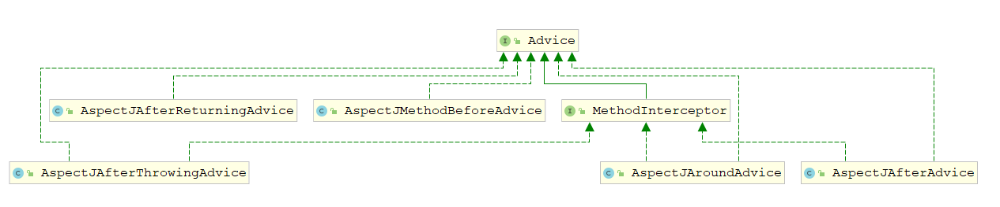

# Spring AOP

**AOP 术语**

| 项                      | 描述                                                         |
| :---------------------- | :----------------------------------------------------------- |
| 切面(Aspect)            | 一个关注点的模块化，这个关注点可能会横切多个对象             |
| 连接点(Joinpoint)       | 程序执行过程中的某一行为                                     |
| 切入点(Pointcut)        | 匹配连接点的断言，在AOP 中通知和一个切入点表达式关联         |
| 通知(Advice)            | “切面”对于某个“连接点”所产生的动作。其中，一个“切面”可以包含多个“Advice” |
| 目标对象(Target Object) | 被一个或者多个切面所通知的对象，被代理对象或者被通知对象     |
| AOP 代理(AOP Proxy)     | 有两种代理方式，JDK 动态代理和CGLib 代理                     |

**通知的类型**

| 通知           | 描述                                                     |
| -------------- | -------------------------------------------------------- |
| 前置通知       | 方法执行之前，执行通知。                                 |
| 后置通知       | 方法执行之后，不管正常返回还是异常退出，执行通知。       |
| 返回后通知     | 方法执行之后，只有正常完成后执行通知。（抛出异常不考虑） |
| 抛出异常后通知 | 方法执行抛出异常退出时，执行通知                         |
| 环绕通知       | 在方法调用之前和之后，执行通知。                         |

Spring 解析扩展元素解析BeanDefinition时，会解析到AOP相关的标签，AopNamespaceHandler基于Spring实现命名空间处理的扩展 

~~~java
public class AopNamespaceHandler extends NamespaceHandlerSupport { 
	@Override
	public void init() {
		// In 2.0 XSD as well as in 2.1 XSD.
        // aop:config 用来配置pointcut, advisor, aspect
		registerBeanDefinitionParser("config", new ConfigBeanDefinitionParser());
        // aop:aspectj-autoproxy  开启对于@AspectJ注解风格AOP的支持 
		registerBeanDefinitionParser("aspectj-autoproxy", new AspectJAutoProxyBeanDefinitionParser());
        // aop:scoped-proxy 通过代理引用该对象,对已注入的依赖bean的scope进行正确的代理
        // 单例bean引用一个beanB(prototype bean);通过依赖注入之后调用的beanB是同一个不变的,不符合预想
        // 添加<aop:scoped-proxy/> 之后每次调用beanB会生成新的，符合定义的scope 
		registerBeanDefinitionDecorator("scoped-proxy", new ScopedProxyBeanDefinitionDecorator());

		// Only in 2.0 XSD: moved to context namespace as of 2.1
		registerBeanDefinitionParser("spring-configured", new SpringConfiguredBeanDefinitionParser());
	} 
}
~~~

# aop:config

~~~java
class ConfigBeanDefinitionParser implements BeanDefinitionParser {	
    
	public BeanDefinition parse(Element element, ParserContext parserContext) {
		CompositeComponentDefinition compositeDef =
				new CompositeComponentDefinition(element.getTagName(), parserContext.extractSource(element));
		parserContext.pushContainingComponent(compositeDef);
 		// 注册自动代理模式BeanDefinition,其作用于<aop:config>
		configureAutoProxyCreator(parserContext, element);

		List<Element> childElts = DomUtils.getChildElements(element);
        // 解析其aop:config子节点下的aop:pointcut/aop:advisor/aop:aspect
		for (Element elt: childElts) {
			String localName = parserContext.getDelegate().getLocalName(elt);
			if (POINTCUT.equals(localName)) {
				parsePointcut(elt, parserContext);
			}
			else if (ADVISOR.equals(localName)) {
				parseAdvisor(elt, parserContext);
			}
			else if (ASPECT.equals(localName)) {
				parseAspect(elt, parserContext);
			}
		}

		parserContext.popAndRegisterContainingComponent();
		return null;
	}
}
~~~

## AspectJAwareAdvisorAutoProxyCreator

配置注册自动代理创建器的BeanDefinition

configureAutoProxyCreator最终会调用AopConfigUtils#registerAspectJAnnotationAutoProxyCreatorIfNecessary方法

~~~java
public abstract class AopConfigUtils {	
	public static BeanDefinition registerAspectJAnnotationAutoProxyCreatorIfNecessary(
        BeanDefinitionRegistry registry,
			@Nullable Object source) {
		// 选择AnnotationAwareAspectJAutoProxyCreator.class作为beanClass
		return registerOrEscalateApcAsRequired(AnnotationAwareAspectJAutoProxyCreator.class, 
                                               registry, source);
	}
    private static BeanDefinition registerOrEscalateApcAsRequired(Class<?> cls, 
        BeanDefinitionRegistry registry,@Nullable Object source) {

		Assert.notNull(registry, "BeanDefinitionRegistry must not be null");

		if (registry.containsBeanDefinition(AUTO_PROXY_CREATOR_BEAN_NAME)) {
			BeanDefinition apcDefinition = registry.getBeanDefinition(AUTO_PROXY_CREATOR_BEAN_NAME);
			if (!cls.getName().equals(apcDefinition.getBeanClassName())) {
				int currentPriority = findPriorityForClass(apcDefinition.getBeanClassName());
				int requiredPriority = findPriorityForClass(cls);
				if (currentPriority < requiredPriority) {
					apcDefinition.setBeanClassName(cls.getName());
				}
			}
			return null;
		}
		// 创建 BeanDefinition beanClass = AnnotationAwareAspectJAutoProxyCreator.class
		RootBeanDefinition beanDefinition = new RootBeanDefinition(cls);
		beanDefinition.setSource(source);
		beanDefinition.getPropertyValues().add("order", Ordered.HIGHEST_PRECEDENCE);
		beanDefinition.setRole(BeanDefinition.ROLE_INFRASTRUCTURE);
        // 向容器注册 beanDefinition
		registry.registerBeanDefinition(AUTO_PROXY_CREATOR_BEAN_NAME, beanDefinition);
		return beanDefinition;
	}
}
~~~

## 解析配置

### proxy-target-class & expose-proxy

proxy-target-class代表是否为被代理这生成CGLIB子类，默认false，采用JDK动态代理

expose-proxy代表是否将代理bean暴露给用户，如果暴露，可以通过Spring AopContext类获得，默认不暴露

configureAutoProxyCreator方法会调用AopNamespaceUtils#useClassProxyingIfNecessary方法，

~~~java
public abstract class AopNamespaceUtils {
	private static void useClassProxyingIfNecessary(BeanDefinitionRegistry registry, Element sourceElement) {
		if (sourceElement != null) {
            // proxy-target-class
			boolean proxyTargetClass = Boolean.valueOf(
                sourceElement.getAttribute(PROXY_TARGET_CLASS_ATTRIBUTE));
			if (proxyTargetClass) {
                // 向自动代理的BeanDefinition添加proxy-target-class属性
				AopConfigUtils.forceAutoProxyCreatorToUseClassProxying(registry);
			}
            // expose-proxy
			boolean exposeProxy = Boolean.valueOf(sourceElement.getAttribute(EXPOSE_PROXY_ATTRIBUTE));
			if (exposeProxy) {
                // 向自动代理的BeanDefinition添加expose-proxy属性
				AopConfigUtils.forceAutoProxyCreatorToExposeProxy(registry);
			}
		}
	}
}
~~~

### aop:pointcut

解析切入点，切入点无法单独工作，必须配合advisor或者aspect完成AOP功能

~~~java
private AbstractBeanDefinition parsePointcut(Element pointcutElement, ParserContext parserContext) {
    // 切入点的唯一标识 <aop:pointcut> id是必须设置的
    String id = pointcutElement.getAttribute(ID);
    // 获取切入点的表达式
    String expression = pointcutElement.getAttribute(EXPRESSION);

    AbstractBeanDefinition pointcutDefinition = null;

    try {
        // 切入点入栈
        this.parseState.push(new PointcutEntry(id));
        // 创建切入点BeanDefinition  beanClass为AspectJExpressionPointcut.class;并且设置属性expression
        // 之后Spring可以通过BeanDefinition 创建 bean
        pointcutDefinition = createPointcutDefinition(expression);
        pointcutDefinition.setSource(parserContext.extractSource(pointcutElement));

        String pointcutBeanName = id;
        if (StringUtils.hasText(pointcutBeanName)) {
            // 注册BeanDefinition
            parserContext.getRegistry().registerBeanDefinition(pointcutBeanName, pointcutDefinition);
        } else {
            // id 为空,注册BeanDefinition并生成一个name
            pointcutBeanName = parserContext.getReaderContext()
                .registerWithGeneratedName(pointcutDefinition);
        }

        parserContext.registerComponent(
            new PointcutComponentDefinition(pointcutBeanName, pointcutDefinition, expression));
    } finally {
        // 创建完成后出栈
        this.parseState.pop();
    } 
    return pointcutDefinition; 
}
// 创建BeanDefinition 
protected AbstractBeanDefinition createPointcutDefinition(String expression) {
    // AspectJExpressionPointcut
    RootBeanDefinition beanDefinition = new RootBeanDefinition(AspectJExpressionPointcut.class);
    beanDefinition.setScope(BeanDefinition.SCOPE_PROTOTYPE);
    // synthetic 设置为true,表示由程序生成
    beanDefinition.setSynthetic(true);
    beanDefinition.getPropertyValues().add(EXPRESSION, expression);
    return beanDefinition;
}
~~~

### aop:advisor

配置

~~~xml
<!--advisor advice-ref必填-->
<aop:advisor id="" order="" advice-ref="aopAdvice" pointcut="" pointcut-ref="" />
<!--advice 必须试下 advice 接口-->
<bean id = "testAdvisor" class="com.qinfengsa.spring.aop.TestAdvice"/>
~~~

解析通知器

~~~java
private void parseAdvisor(Element advisorElement, ParserContext parserContext) {
    // 创建通知器BeanDefinition,beanClass为`DefaultBeanFactoryPointcutAdvisor`
    // advice-ref属性必须定义,通过advice接口实现通知机制，MethodBeforeAdvice, AfterReturningAdvice
    // 可以自定义pointcut切入点表达式,也可以配合<aop:pointcut>使用,定义pointcut-ref
    AbstractBeanDefinition advisorDef = createAdvisorBeanDefinition(advisorElement, parserContext);
    // 获取id属性
    String id = advisorElement.getAttribute(ID);

    try {
        // 入栈
        this.parseState.push(new AdvisorEntry(id));
        String advisorBeanName = id;
        if (StringUtils.hasText(advisorBeanName)) {
            // 注册BeanDefinition
            parserContext.getRegistry().registerBeanDefinition(advisorBeanName, advisorDef);
        } else {
            // id 为空,注册BeanDefinition并生成一个name
            advisorBeanName = parserContext.getReaderContext().registerWithGeneratedName(advisorDef);
        }
 		// 解析point-cut属性并赋值到DefaultBeanFactoryPointcutAdvisor#pointcut内部属性
        Object pointcut = parsePointcutProperty(advisorElement, parserContext);
        // 表示定义了point-cut属性,表达式转成BeanDefinition
        if (pointcut instanceof BeanDefinition) {
            advisorDef.getPropertyValues().add(POINTCUT, pointcut);
            parserContext.registerComponent(
                new AdvisorComponentDefinition(advisorBeanName, advisorDef, (BeanDefinition) pointcut));
        }
        // 表示定义了pointcut-ref属性 
        else if (pointcut instanceof String) {
            // 添加Bean引用
            advisorDef.getPropertyValues().add(POINTCUT, new RuntimeBeanReference((String) pointcut));
            parserContext.registerComponent(
                new AdvisorComponentDefinition(advisorBeanName, advisorDef));
        }
    } finally {
        // 出栈
        this.parseState.pop();
    } 
}
// 创建通知器BeanDefinition
private AbstractBeanDefinition createAdvisorBeanDefinition(Element advisorElement, 
                                                           ParserContext parserContext) {
    // DefaultBeanFactoryPointcutAdvisor
    RootBeanDefinition advisorDefinition = new RootBeanDefinition(DefaultBeanFactoryPointcutAdvisor.class);
    advisorDefinition.setSource(parserContext.extractSource(advisorElement));

    String adviceRef = advisorElement.getAttribute(ADVICE_REF);
    if (!StringUtils.hasText(adviceRef)) {
        parserContext.getReaderContext().error(
            "'advice-ref' attribute contains empty value.", advisorElement, this.parseState.snapshot());
    } else {
        // 记录 advice-ref 定义的bean
        advisorDefinition.getPropertyValues().add(
            ADVICE_BEAN_NAME, new RuntimeBeanNameReference(adviceRef));
    }

    if (advisorElement.hasAttribute(ORDER_PROPERTY)) {
        advisorDefinition.getPropertyValues().add(
            ORDER_PROPERTY, advisorElement.getAttribute(ORDER_PROPERTY));
    }

    return advisorDefinition;
}
~~~

#### 解析pointcut

解析通知器的pointcut和pointcut-ref属性

~~~java
// 切入点表达式
private static final String POINTCUT = "pointcut"; 
// 切入点aop:pointcut的id,通过id引用对应的切入点
private static final String POINTCUT_REF = "pointcut-ref";

// 开始解析
private Object parsePointcutProperty(Element element, ParserContext parserContext) {
    // 如果两个都定义,错误;所以pointcut和pointcut-ref只能使用一个
    if (element.hasAttribute(POINTCUT) && element.hasAttribute(POINTCUT_REF)) {
        parserContext.getReaderContext().error(
            "Cannot define both 'pointcut' and 'pointcut-ref' on <advisor> tag.",
            element, this.parseState.snapshot());
        return null;
    }
    // 解析pointcut切入点表达式
    else if (element.hasAttribute(POINTCUT)) {
        // Create a pointcut for the anonymous pc and register it.
        String expression = element.getAttribute(POINTCUT);
        // 根据切入点表达式创建一个切入点BeanDefinition
        AbstractBeanDefinition pointcutDefinition = createPointcutDefinition(expression);
        pointcutDefinition.setSource(parserContext.extractSource(element));
        return pointcutDefinition;
    }
    // 解析切入点aop:pointcut
    else if (element.hasAttribute(POINTCUT_REF)) {
        // 直接返回切入点的id
        String pointcutRef = element.getAttribute(POINTCUT_REF);
        if (!StringUtils.hasText(pointcutRef)) {
            parserContext.getReaderContext().error(
                "'pointcut-ref' attribute contains empty value.", element, this.parseState.snapshot());
            return null;
        }
        return pointcutRef;
    }
    else {
        parserContext.getReaderContext().error(
            "Must define one of 'pointcut' or 'pointcut-ref' on <advisor> tag.",
            element, this.parseState.snapshot());
        return null;
    }
}
~~~

### aop:aspect

配置

~~~xml
<!-- aop -->
<aop:config >
    <!--配置一个切入点,相当于@Pointcut -->
    <aop:pointcut expression="execution(* com.qinfengsa.spring.service..*(..))" id="simplePointcut"/>

    <aop:aspect id="myAspect" ref="xmlAspect"> 
        <!--配置通知,相当于@Before、@After、@AfterReturn、@Around、@AfterThrowing -->
        <aop:before pointcut-ref="simplePointcut" method="before"/>
        <aop:after pointcut-ref="simplePointcut" method="after"/>
        <aop:after-returning pointcut-ref="simplePointcut" method="afterReturn"/>
        <aop:after-throwing pointcut-ref="simplePointcut" method="afterThrow" throwing="ex"/>
        <aop:around pointcut-ref="simplePointcut"  method="around"/>
    </aop:aspect>
</aop:config>
~~~

**解析切面**

~~~java
private void parseAspect(Element aspectElement, ParserContext parserContext) {
    // <aop:aspect> id属性
    String aspectId = aspectElement.getAttribute(ID);
    // <aop:aspect> ref属性,必须配置,代表切面执行的bean
    String aspectName = aspectElement.getAttribute(REF);

    try {
        // 入栈
        this.parseState.push(new AspectEntry(aspectId, aspectName));
        List<BeanDefinition> beanDefinitions = new ArrayList<>();
        List<BeanReference> beanReferences = new ArrayList<>();
		// 解析<aop:aspect>下的declare-parents节点 
        List<Element> declareParents = DomUtils.getChildElementsByTagName(aspectElement, DECLARE_PARENTS);
        for (int i = METHOD_INDEX; i < declareParents.size(); i++) {
            Element declareParentsElement = declareParents.get(i);
            // 创建切入点BeanDefinition  beanClass为DeclareParentsAdvisor.class;
            beanDefinitions.add(parseDeclareParents(declareParentsElement, parserContext));
        }

        // We have to parse "advice" and all the advice kinds in one loop, to get the
        // ordering semantics right.
        // 解析剩下的advice节点
        NodeList nodeList = aspectElement.getChildNodes();
        boolean adviceFoundAlready = false;
        for (int i = 0; i < nodeList.getLength(); i++) {
            Node node = nodeList.item(i);
            // 是否为advice:before;advice:after;advice:after-returning;advice:after-throwing;advice:around节点
            if (isAdviceNode(node, parserContext)) {
                if (!adviceFoundAlready) {
                    adviceFoundAlready = true;
                     // 校验aop:aspect必须有ref属性，否则无法对切入点 进行功能增强
                    if (!StringUtils.hasText(aspectName)) {
                        parserContext.getReaderContext().error(
                        "<aspect> tag needs aspect bean reference via 'ref' attribute when declaring advices"
                            ,aspectElement, this.parseState.snapshot());
                        return;
                    }
                    beanReferences.add(new RuntimeBeanReference(aspectName));
                }
                // 解析advice节点并注册到bean工厂中
                AbstractBeanDefinition advisorDefinition = parseAdvice(aspectName, i, aspectElement, 
                    (Element) node, parserContext, beanDefinitions, beanReferences);
                beanDefinitions.add(advisorDefinition);
            }
        }

        AspectComponentDefinition aspectComponentDefinition = createAspectComponentDefinition(
            aspectElement, aspectId, beanDefinitions, beanReferences, parserContext);
        parserContext.pushContainingComponent(aspectComponentDefinition);
 		// 解析aop:point-cut节点并注册到bean工厂
        List<Element> pointcuts = DomUtils.getChildElementsByTagName(aspectElement, POINTCUT);
        for (Element pointcutElement : pointcuts) {
            parsePointcut(pointcutElement, parserContext);
        }

        parserContext.popAndRegisterContainingComponent();
    } finally {
        // 出栈
        this.parseState.pop();
    } 
}
~~~

#### aop:declare-parents

DeclareParents可以用来给被代理对象添加一些方法

~~~xml
<aop:config>
    <aop:aspect>
        <aop:declare-parents implement-interface="com.qinfengsa.spring.service.HelloWorldService"
                             types-matching="com.qinfengsa.spring.service.HelloServiceImpl+"
                             default-impl="com.qinfengsa.spring.service.HelloWorldServiceImpl"
                             />
    </aop:aspect>
</aop:config>
~~~

**解析**

~~~java
private AbstractBeanDefinition parseDeclareParents(Element declareParentsElement, 
                                                   ParserContext parserContext) {
    // beanClass = DeclareParentsAdvisor.class
    BeanDefinitionBuilder builder = BeanDefinitionBuilder.rootBeanDefinition(DeclareParentsAdvisor.class);
    builder.addConstructorArgValue(declareParentsElement.getAttribute(IMPLEMENT_INTERFACE));
    builder.addConstructorArgValue(declareParentsElement.getAttribute(TYPE_PATTERN));
	// default-impl 和 delegate-ref
    String defaultImpl = declareParentsElement.getAttribute(DEFAULT_IMPL);
    String delegateRef = declareParentsElement.getAttribute(DELEGATE_REF);
	// default-impl 和 delegate-ref 只能二选一
    if (StringUtils.hasText(defaultImpl) && !StringUtils.hasText(delegateRef)) {
        builder.addConstructorArgValue(defaultImpl);
    } else if (StringUtils.hasText(delegateRef) && !StringUtils.hasText(defaultImpl)) {
        builder.addConstructorArgReference(delegateRef);
    } else {
        parserContext.getReaderContext().error(
            "Exactly one of the " + DEFAULT_IMPL + " or " + DELEGATE_REF + " attributes must be specified",
            declareParentsElement, this.parseState.snapshot());
    }
	// 通过builder 创建 BeanDefinition
    AbstractBeanDefinition definition = builder.getBeanDefinition();
    definition.setSource(parserContext.extractSource(declareParentsElement));
    parserContext.getReaderContext().registerWithGeneratedName(definition);
    return definition;
}
~~~

#### 其他Advice

advice:before，advice:after等advice节点

~~~java
rivate AbstractBeanDefinition parseAdvice(
    String aspectName, int order, Element aspectElement, Element adviceElement, ParserContext parserContext,
    List<BeanDefinition> beanDefinitions, List<BeanReference> beanReferences) {

    try {
        this.parseState.push(new AdviceEntry(parserContext.getDelegate().getLocalName(adviceElement)));
        // 创建method工厂BeanDefinition,beanClass为MethodLocatingFactoryBean.class;
        RootBeanDefinition methodDefinition = new RootBeanDefinition(MethodLocatingFactoryBean.class);
        methodDefinition.getPropertyValues().add("targetBeanName", aspectName);
        methodDefinition.getPropertyValues().add("methodName", adviceElement.getAttribute("method"));
        // synthetic 设置为true,表示由程序生成
        methodDefinition.setSynthetic(true);

        // 创建实例工厂BeanDefinition,beanClass为 SimpleBeanFactoryAwareAspectInstanceFactory.class;
        RootBeanDefinition aspectFactoryDef =
            new RootBeanDefinition(SimpleBeanFactoryAwareAspectInstanceFactory.class);
        aspectFactoryDef.getPropertyValues().add("aspectBeanName", aspectName);
        // synthetic 设置为true,表示由程序生成
        aspectFactoryDef.setSynthetic(true);

        // register the pointcut
        AbstractBeanDefinition adviceDef = createAdviceDefinition(
            adviceElement, parserContext, aspectName, order, methodDefinition, aspectFactoryDef,
            beanDefinitions, beanReferences);

        // 为adviceDef 配置通知(前置,后置通知) 
        RootBeanDefinition advisorDefinition = new RootBeanDefinition(AspectJPointcutAdvisor.class);
        advisorDefinition.setSource(parserContext.extractSource(adviceElement));
        advisorDefinition.getConstructorArgumentValues().addGenericArgumentValue(adviceDef);
        if (aspectElement.hasAttribute(ORDER_PROPERTY)) {
            advisorDefinition.getPropertyValues().add(
                ORDER_PROPERTY, aspectElement.getAttribute(ORDER_PROPERTY));
        }

        // register the final advisor
        parserContext.getReaderContext().registerWithGeneratedName(advisorDefinition);

        return advisorDefinition;
    }
    finally {
        this.parseState.pop();
    }
}
~~~

##### 创建通知器

~~~java
private AbstractBeanDefinition createAdviceDefinition(
    Element adviceElement, ParserContext parserContext, String aspectName, int order,
    RootBeanDefinition methodDef, RootBeanDefinition aspectFactoryDef,
    List<BeanDefinition> beanDefinitions, List<BeanReference> beanReferences) {
	// 根据元素的类型(advice:before;advice:after;advice:after-returning;advice:after-throwing;advice:around) 
    // 创建不同的BeanDefinition
    RootBeanDefinition adviceDefinition = new RootBeanDefinition(
        getAdviceClass(adviceElement, parserContext));
    adviceDefinition.setSource(parserContext.extractSource(adviceElement));

    adviceDefinition.getPropertyValues().add(ASPECT_NAME_PROPERTY, aspectName);
    adviceDefinition.getPropertyValues().add(DECLARATION_ORDER_PROPERTY, order);

    if (adviceElement.hasAttribute(RETURNING)) {
        adviceDefinition.getPropertyValues().add(
            RETURNING_PROPERTY, adviceElement.getAttribute(RETURNING));
    }
    if (adviceElement.hasAttribute(THROWING)) {
        adviceDefinition.getPropertyValues().add(
            THROWING_PROPERTY, adviceElement.getAttribute(THROWING));
    }
    if (adviceElement.hasAttribute(ARG_NAMES)) {
        adviceDefinition.getPropertyValues().add(
            ARG_NAMES_PROPERTY, adviceElement.getAttribute(ARG_NAMES));
    }

    ConstructorArgumentValues cav = adviceDefinition.getConstructorArgumentValues();
    cav.addIndexedArgumentValue(METHOD_INDEX, methodDef);
    
	// 解析point-cut和pointcut-ref属性并赋值到DefaultBeanFactoryPointcutAdvisor#pointcut内部属性
    // point-cut和pointcut-ref 二选一
    Object pointcut = parsePointcutProperty(adviceElement, parserContext);
    // 表示定义了point-cut属性,表达式转成BeanDefinition
    if (pointcut instanceof BeanDefinition) {
        cav.addIndexedArgumentValue(POINTCUT_INDEX, pointcut);
        beanDefinitions.add((BeanDefinition) pointcut);
    }
    // 表示定义了pointcut-ref属性 
    else if (pointcut instanceof String) {
        // 添加Bean引用
        RuntimeBeanReference pointcutRef = new RuntimeBeanReference((String) pointcut);
        cav.addIndexedArgumentValue(POINTCUT_INDEX, pointcutRef);
        beanReferences.add(pointcutRef);
    }
     
    cav.addIndexedArgumentValue(ASPECT_INSTANCE_FACTORY_INDEX, aspectFactoryDef);

    return adviceDefinition;
}
// 根据元素的类型返回不同的Class,
private Class<?> getAdviceClass(Element adviceElement, ParserContext parserContext) {
    String elementName = parserContext.getDelegate().getLocalName(adviceElement);
    if (BEFORE.equals(elementName)) {
        return AspectJMethodBeforeAdvice.class;
    }
    else if (AFTER.equals(elementName)) {
        return AspectJAfterAdvice.class;
    }
    else if (AFTER_RETURNING_ELEMENT.equals(elementName)) {
        return AspectJAfterReturningAdvice.class;
    }
    else if (AFTER_THROWING_ELEMENT.equals(elementName)) {
        return AspectJAfterThrowingAdvice.class;
    }
    else if (AROUND.equals(elementName)) {
        return AspectJAroundAdvice.class;
    }
    else {
        throw new IllegalArgumentException("Unknown advice kind [" + elementName + "].");
    }
}
~~~

## 代理子类生成

解析配置阶段，容器中注入了自动代理模式创建器的BeanDefinition；类型为AnnotationAwareAspectJAutoProxyCreator

AnnotationAwareAspectJAutoProxyCreator实现了InstantiationAwareBeanPostProcessor和BeanPostProcessor两大接口，分别在实例化前后和初始化前后调用接口的方法

最终我们发现，AbstractAutoProxyCreator重写了`postProcessBeforeInstantiation`和`postProcessAfterInitialization`方法，对bean实例化前和初始化后做了处理

### InstantiationAwareBeanPostProcessor

这里targetSource在Spring中是空的，只能通过自定义扩展实现

~~~java
public abstract class AbstractAutoProxyCreator extends ProxyProcessorSupport
		implements SmartInstantiationAwareBeanPostProcessor, BeanFactoryAware {
    @Override
	public Object postProcessBeforeInstantiation(Class<?> beanClass, String beanName) throws BeansException {
		Object cacheKey = getCacheKey(beanClass, beanName);
		// 无需代理的场景，返回null则表示未对bean进行修改
		if (!StringUtils.hasLength(beanName) || !this.targetSourcedBeans.contains(beanName)) {
			if (this.advisedBeans.containsKey(cacheKey)) {
				return null;
			}
            // 用于实现AOP的Spring基础类 Advice,Pointcut,Advisor,AopInfrastructureBean不需要代理
            // 跳过AspectJPointcutAdvisor类
            // 在解析过程中,advice:before，advice:after等advice节点会被解析为AspectJPointcutAdvisor
			if (isInfrastructureClass(beanClass) || shouldSkip(beanClass, beanName)) {
				this.advisedBeans.put(cacheKey, Boolean.FALSE);
				return null;
			}
		}

		// Create proxy here if we have a custom TargetSource.
		// Suppresses unnecessary default instantiation of the target bean:
		// The TargetSource will handle target instances in a custom fashion.
        // 自定义TargetSource,只能扩展
		TargetSource targetSource = getCustomTargetSource(beanClass, beanName);
        // 对于自定义的TargetSource,Spring会立即执行代理子类的创建
        // 阻止目标bean的不必要的默认实例化
		if (targetSource != null) {
			if (StringUtils.hasLength(beanName)) {
				this.targetSourcedBeans.add(beanName);
			}
            // 获取匹配的拦截器通知数组,空方法 交给子类
			Object[] specificInterceptors = getAdvicesAndAdvisorsForBean(beanClass, beanName, targetSource);
			// 创建代理
            Object proxy = createProxy(beanClass, beanName, specificInterceptors, targetSource);
			this.proxyTypes.put(cacheKey, proxy.getClass());
			return proxy;
		}

		return null;
	}
    // 实例化后调用,没有重写
    @Override
    public boolean postProcessAfterInstantiation(Object bean, String beanName) {
		return true;
	}
    
    // customTargetSourceCreators是没有赋值的,总是返回null,需要自定义赋值
    protected TargetSource getCustomTargetSource(Class<?> beanClass, String beanName) {
		// We can't create fancy target sources for directly registered singletons.
		if (this.customTargetSourceCreators != null &&
				this.beanFactory != null && this.beanFactory.containsBean(beanName)) {
			for (TargetSourceCreator tsc : this.customTargetSourceCreators) {
				TargetSource ts = tsc.getTargetSource(beanClass, beanName);
				if (ts != null) {
					// Found a matching TargetSource.
					if (logger.isTraceEnabled()) {
						logger.trace("TargetSourceCreator [" + tsc +
								"] found custom TargetSource for bean with name '" + beanName + "'");
					}
					return ts;
				}
			}
		}

		// No custom TargetSource found.
		return null;
	}
}
~~~

#### 创建代理

~~~java
public class DefaultAopProxyFactory implements AopProxyFactory, Serializable {
	@Override
	public AopProxy createAopProxy(AdvisedSupport config) throws AopConfigException {
		// config aop参数
		if (config.isOptimize() || config.isProxyTargetClass() || hasNoUserSuppliedProxyInterfaces(config)) {
			Class<?> targetClass = config.getTargetClass();
			if (targetClass == null) {
				throw new AopConfigException("TargetSource cannot determine target class: " +
						"Either an interface or a target is required for proxy creation.");
			}
			// 目标Class是接口，或者是代理类 JDK动态代理
			if (targetClass.isInterface() || Proxy.isProxyClass(targetClass)) {
				return new JdkDynamicAopProxy(config);
			}
			return new ObjenesisCglibAopProxy(config);
		} else {
			return new JdkDynamicAopProxy(config);
		}
	}
}
~~~

### BeanPostProcessor

~~~java
public abstract class AbstractAutoProxyCreator extends ProxyProcessorSupport
		implements SmartInstantiationAwareBeanPostProcessor, BeanFactoryAware {	
    // 初始化前调用,没有重写
	@Override
	public Object postProcessBeforeInitialization(Object bean, String beanName) {
		return bean;
	} 
	// 初始化后调用
	@Override
	public Object postProcessAfterInitialization(@Nullable Object bean, String beanName) {
		if (bean != null) {
			Object cacheKey = getCacheKey(bean.getClass(), beanName);
            // 判断是否已经提前暴露
			if (this.earlyProxyReferences.remove(cacheKey) != bean) {
                // 如果没有被代理过则代理
				return wrapIfNecessary(bean, beanName, cacheKey);
			}
		}
		return bean;
	}
}
~~~

#### wrapIfNecessary

~~~Java
public abstract class AbstractAutoProxyCreator extends ProxyProcessorSupport
		implements SmartInstantiationAwareBeanPostProcessor, BeanFactoryAware {		
	protected Object wrapIfNecessary(Object bean, String beanName, Object cacheKey) {
        // targetSourcedBeans包含beanName，说明前面创建过
		if (StringUtils.hasLength(beanName) && this.targetSourcedBeans.contains(beanName)) {
			return bean;
		}
		if (Boolean.FALSE.equals(this.advisedBeans.get(cacheKey))) {
			return bean;
		}
		if (isInfrastructureClass(bean.getClass()) || shouldSkip(bean.getClass(), beanName)) {
			this.advisedBeans.put(cacheKey, Boolean.FALSE);
			return bean;
		}

		// 获取这个bean 的advice通知器
		Object[] specificInterceptors = getAdvicesAndAdvisorsForBean(bean.getClass(), beanName, null);
		if (specificInterceptors != DO_NOT_PROXY) {
			this.advisedBeans.put(cacheKey, Boolean.TRUE);
            // 创建代理对象
			Object proxy = createProxy(
					bean.getClass(), beanName, specificInterceptors, new SingletonTargetSource(bean));
			this.proxyTypes.put(cacheKey, proxy.getClass());
			return proxy;
		}

		this.advisedBeans.put(cacheKey, Boolean.FALSE);
		return bean;
	} 
	// 创建代理对象  
	protected Object createProxy(Class<?> beanClass, @Nullable String beanName,
			@Nullable Object[] specificInterceptors, TargetSource targetSource) {

		if (this.beanFactory instanceof ConfigurableListableBeanFactory) {
			AutoProxyUtils.exposeTargetClass((ConfigurableListableBeanFactory) this.beanFactory, 
                                             beanName, beanClass);
		}
		// 创建代理工厂,通过工厂生产代理对象
		ProxyFactory proxyFactory = new ProxyFactory();
        // 把配置copy过来
		proxyFactory.copyFrom(this); 
        // 是否代理目标类,也就是对<aop:config>节点的proxy-target-class属性进行判断
		if (!proxyFactory.isProxyTargetClass()) {
            // 为true时表示通过CGLIB进行代理
			if (shouldProxyTargetClass(beanClass, beanName)) {
				proxyFactory.setProxyTargetClass(true);
			}
            // 为false时表示通过JDK进行代理，需要实现接口
			else {
				evaluateProxyInterfaces(beanClass, proxyFactory);
			}
		}
		// 创建通知数组
		Advisor[] advisors = buildAdvisors(beanName, specificInterceptors);
		proxyFactory.addAdvisors(advisors);
		proxyFactory.setTargetSource(targetSource);
		customizeProxyFactory(proxyFactory);

		proxyFactory.setFrozen(this.freezeProxy);
		if (advisorsPreFiltered()) {
			proxyFactory.setPreFiltered(true);
		}
		// 创建并返回代理对象 根据配置或由Spring自动决定使用JDK或CGLIB方式生成代理对象
        // 最终实现在DefaultAopProxyFactory类中
		return proxyFactory.getProxy(getProxyClassLoader());
	} 
}
~~~

#### 获取匹配的拦截器

~~~java
public abstract class AbstractAdvisorAutoProxyCreator extends AbstractAutoProxyCreator {
	protected Object[] getAdvicesAndAdvisorsForBean(Class<?> beanClass, String beanName, 
        @Nullable TargetSource targetSource) {
		List<Advisor> advisors = findEligibleAdvisors(beanClass, beanName);
		if (advisors.isEmpty()) {
			return DO_NOT_PROXY;
		}
		return advisors.toArray();
	}
    
    protected List<Advisor> findEligibleAdvisors(Class<?> beanClass, String beanName) {
        // 获取全部拦截器
		List<Advisor> candidateAdvisors = findCandidateAdvisors();
        // 过滤
		List<Advisor> eligibleAdvisors = findAdvisorsThatCanApply(candidateAdvisors, beanClass, beanName);
		extendAdvisors(eligibleAdvisors);
		if (!eligibleAdvisors.isEmpty()) {
            //排序
			eligibleAdvisors = sortAdvisors(eligibleAdvisors);
		}
		return eligibleAdvisors;
	} 
   
}
~~~

##### 获取所有拦截器

~~~java
protected List<Advisor> findCandidateAdvisors() {
    Assert.state(this.advisorRetrievalHelper != null, "No BeanFactoryAdvisorRetrievalHelper available");
    return this.advisorRetrievalHelper.findAdvisorBeans();
}
// 子类AnnotationAwareAspectJAutoProxyCreator有重写findCandidateAdvisors方法
@Override
protected List<Advisor> findCandidateAdvisors() {
    // Add all the Spring advisors found according to superclass rules.
    List<Advisor> advisors = super.findCandidateAdvisors();
    // 添加AspectJ注解的Advisor拦截器
    if (this.aspectJAdvisorsBuilder != null) {
        advisors.addAll(this.aspectJAdvisorsBuilder.buildAspectJAdvisors());
    }
    return advisors;
}
public class BeanFactoryAdvisorRetrievalHelper {
    // 缓存的AdvisorBean的名称数组
    private String[] cachedAdvisorBeanNames;
    
	public List<Advisor> findAdvisorBeans() {
		// Determine list of advisor bean names, if not cached already.
		String[] advisorNames = null;
		synchronized (this) {
			advisorNames = this.cachedAdvisorBeanNames;
			if (advisorNames == null) {
				// 根据类型 Advisor.class获取bean容器及其父容器中所有试下Advisor接口的 bean的名称 
                // 使用数组保存
				advisorNames = BeanFactoryUtils.beanNamesForTypeIncludingAncestors(
						this.beanFactory, Advisor.class, true, false);
				this.cachedAdvisorBeanNames = advisorNames;
			}
		}
		if (advisorNames.length == 0) {
			return new LinkedList<>();
		}
		// 创建Advisor 集合
		List<Advisor> advisors = new LinkedList<>();
        // 遍历所有Advisor bean
		for (String name : advisorNames) {
            // isEligibleBean方法没有子类AspectJAwareAdvisorAutoProxyCreator被重写,返回true
			if (isEligibleBean(name)) {
				if (this.beanFactory.isCurrentlyInCreation(name)) { 
				}
				else {
					try {
                        // 通过getBean获取Advisor的实例,放入advisors集合
						advisors.add(this.beanFactory.getBean(name, Advisor.class));
					}
					// ... catch (BeanCreationException ex)  
				}
			}
		}
		return advisors;
	}
}
~~~

##### 规则过滤

前面已经获取到所有的Advisor实例的集合，然后过滤获取符合规则的Advisor

~~~java
protected List<Advisor> findAdvisorsThatCanApply( List<Advisor> candidateAdvisors, 
    Class<?> beanClass, String beanName) {

    ProxyCreationContext.setCurrentProxiedBeanName(beanName);
    try {
        return AopUtils.findAdvisorsThatCanApply(candidateAdvisors, beanClass);
    }
    finally {
        ProxyCreationContext.setCurrentProxiedBeanName(null);
    }
}
public abstract class AopUtils {
	public static List<Advisor> findAdvisorsThatCanApply(List<Advisor> candidateAdvisors, Class<?> clazz) {
		if (candidateAdvisors.isEmpty()) {
			return candidateAdvisors;
		}
		List<Advisor> eligibleAdvisors = new LinkedList<>();
        // 循环处理IntroductionAdvisor类型的Advisor
		for (Advisor candidate : candidateAdvisors) {
			if (candidate instanceof IntroductionAdvisor && canApply(candidate, clazz)) {
				eligibleAdvisors.add(candidate);
			}
		}
		boolean hasIntroductions = !eligibleAdvisors.isEmpty();
        // 循环处理非IntroductionAdvisor类型的Advisor
		for (Advisor candidate : candidateAdvisors) {
			if (candidate instanceof IntroductionAdvisor) {
				// already processed
				continue;
			}
			if (canApply(candidate, clazz, hasIntroductions)) {
				eligibleAdvisors.add(candidate);
			}
		}
		return eligibleAdvisors;
	}
}
~~~

###### 是否符合规则

~~~java
public abstract class AopUtils {
    
    // 判断 advisor 能否匹配targetClass, hasIntroductions = false
    public static boolean canApply(Advisor advisor, Class<?> targetClass, boolean hasIntroductions) {
		if (advisor instanceof IntroductionAdvisor) {
            // 匹配targetClass
			return ((IntroductionAdvisor) advisor).getClassFilter().matches(targetClass);
		} else if (advisor instanceof PointcutAdvisor) {
			PointcutAdvisor pca = (PointcutAdvisor) advisor;
			return canApply(pca.getPointcut(), targetClass, hasIntroductions);
		} else {
			// It doesn't have a pointcut so we assume it applies.
			return true;
		}
	}
    // 判断一个切点能否匹配targetClass,是否支持引入匹配 
    public static boolean canApply(Pointcut pc, Class<?> targetClass, boolean hasIntroductions) {
		Assert.notNull(pc, "Pointcut must not be null");
        // 匹配targetClass
		if (!pc.getClassFilter().matches(targetClass)) {
			return false;
		}
		// 匹配方法
		MethodMatcher methodMatcher = pc.getMethodMatcher();
		if (methodMatcher == MethodMatcher.TRUE) {
			// No need to iterate the methods if we're matching any method anyway...
			return true;
		}

		IntroductionAwareMethodMatcher introductionAwareMethodMatcher = null;
		if (methodMatcher instanceof IntroductionAwareMethodMatcher) {
			introductionAwareMethodMatcher = (IntroductionAwareMethodMatcher) methodMatcher;
		}

		Set<Class<?>> classes = new LinkedHashSet<>(ClassUtils.getAllInterfacesForClassAsSet(targetClass));
		classes.add(targetClass);
		for (Class<?> clazz : classes) {
            // 通过反射获得所有的方法
			Method[] methods = ReflectionUtils.getAllDeclaredMethods(clazz);
            // 遍历所有方法，找到匹配的方法就返回
			for (Method method : methods) {
				if ((introductionAwareMethodMatcher != null &&
						introductionAwareMethodMatcher.matches(method, targetClass, hasIntroductions)) ||
						methodMatcher.matches(method, targetClass)) {
					return true;
				}
			}
		}

		return false;
	}
}
~~~

#### 创建代理

~~~java
public class DefaultAopProxyFactory implements AopProxyFactory, Serializable {
	@Override
	public AopProxy createAopProxy(AdvisedSupport config) throws AopConfigException {
		// config aop参数
		if (config.isOptimize() || config.isProxyTargetClass() || hasNoUserSuppliedProxyInterfaces(config)) {
			Class<?> targetClass = config.getTargetClass();
			if (targetClass == null) {
				throw new AopConfigException("TargetSource cannot determine target class: " +
						"Either an interface or a target is required for proxy creation.");
			}
			// 目标Class是接口，或者是代理类 JDK动态代理
			if (targetClass.isInterface() || Proxy.isProxyClass(targetClass)) {
				return new JdkDynamicAopProxy(config);
			}
			return new ObjenesisCglibAopProxy(config);
		} else {
			return new JdkDynamicAopProxy(config);
		}
	}
}
~~~

##### JDK动态代理

~~~java
final class JdkDynamicAopProxy implements AopProxy, InvocationHandler, Serializable {	
	@Override
	public Object getProxy(@Nullable ClassLoader classLoader) { 
        // 找到可以用来进行代理的接口
		Class<?>[] proxiedInterfaces = AopProxyUtils.completeProxiedInterfaces(this.advised, true);
        // 用来代理的接口中是否定义了equals或者是hashCode方法
		findDefinedEqualsAndHashCodeMethods(proxiedInterfaces);
        // JDK动态代理对象
		return Proxy.newProxyInstance(classLoader, proxiedInterfaces, this);
	} 
}
~~~

## 方法调用

以JDK动态代理JdkDynamicAopProxy为例调用

~~~java
final class JdkDynamicAopProxy implements AopProxy, InvocationHandler, Serializable {
    // 代理配置信息
    private final AdvisedSupport advised;
    
    public Object invoke(Object proxy, Method method, Object[] args) throws Throwable {
		MethodInvocation invocation;
		Object oldProxy = null;
		boolean setProxyContext = false;
		TargetSource targetSource = this.advised.targetSource;
		Object target = null;
		try {
			// eqauls()方法 
			if (!this.equalsDefined && AopUtils.isEqualsMethod(method)) { 
				return equals(args[0]);
			}
			// hashCode()方法 
			else if (!this.hashCodeDefined && AopUtils.isHashCodeMethod(method)) { 
				return hashCode();
			} else if (method.getDeclaringClass() == DecoratingProxy.class) { 
				return AopProxyUtils.ultimateTargetClass(this.advised);
			}
			// Advised接口或者其父接口中定义的方法,直接反射调用,不应用通知
			else if (!this.advised.opaque && method.getDeclaringClass().isInterface() &&
					method.getDeclaringClass().isAssignableFrom(Advised.class)) { 
				return AopUtils.invokeJoinpointUsingReflection(this.advised, method, args);
			}

			Object retVal;

			if (this.advised.exposeProxy) { 
				oldProxy = AopContext.setCurrentProxy(proxy);
				setProxyContext = true;
			} 
			// 获得目标对象的类
			target = targetSource.getTarget();
			Class<?> targetClass = (target != null ? target.getClass() : null);
 
			// 获取目标方法对应的拦截器链
			List<Object> chain = this.advised
                .getInterceptorsAndDynamicInterceptionAdvice(method, targetClass);
 
			// 如果没有可以应用到此方法的通知(Interceptor)，此直接反射调用 method.invoke(target, args)
			if (chain.isEmpty()) { 
				Object[] argsToUse = AopProxyUtils.adaptArgumentsIfNecessary(method, args);
				retVal = AopUtils.invokeJoinpointUsingReflection(target, method, argsToUse);
			} else { 
				// 拦截器链不为空，创建一个调用
				invocation = new ReflectiveMethodInvocation(proxy, target, method, args, targetClass, chain);
				// 开始调用拦截器链和目标方法.
				retVal = invocation.proceed();
			}

			// Massage return value if necessary.
			Class<?> returnType = method.getReturnType();
			if (retVal != null && retVal == target &&
					returnType != Object.class && returnType.isInstance(proxy) &&
					!RawTargetAccess.class.isAssignableFrom(method.getDeclaringClass())) { 
				retVal = proxy;
			}
			else if (retVal == null && returnType != Void.TYPE && returnType.isPrimitive()) {
				throw new AopInvocationException(
						"Null return value from advice does not match primitive return type for: " + method);
			}
			return retVal;
		} finally {
			if (target != null && !targetSource.isStatic()) {
				// Must have come from TargetSource.
				targetSource.releaseTarget(target);
			}
			if (setProxyContext) {
				// Restore old proxy.
				AopContext.setCurrentProxy(oldProxy);
			}
		}
	}
}
~~~

###  获取拦截器链

拦截器链是怎么来的，在AbstractAutoProxyCreator#createProxy方法中

~~~java
// 创建通知数组, 生成代理类过程中匹配的拦截器被赋值给proxyFactory
Advisor[] advisors = buildAdvisors(beanName, specificInterceptors);
proxyFactory.addAdvisors(advisors);

proxyFactory.getProxy(getProxyClassLoader());

public Object getProxy(@Nullable ClassLoader classLoader) {
    return createAopProxy().getProxy(classLoader);
}

protected final synchronized AopProxy createAopProxy() { 
    return getAopProxyFactory().createAopProxy(this);
}
// 最终proxyFactory转换为AdvisedSupport 配置 
public AopProxy createAopProxy(AdvisedSupport config) throws AopConfigException {
	// config 被赋值给JdkDynamicAopProxy, 所有代理对象内部可以通过config直接获取拦截器	 
    return new JdkDynamicAopProxy(config); 
}
~~~

~~~java
// this.advised 就是 前面的创建代理时的config,内置了拦截器数组advisors
List<Object> chain = this.advised.getInterceptorsAndDynamicInterceptionAdvice(method, targetClass);

public class AdvisedSupport extends ProxyConfig implements Advised {	
    // method缓存
    private transient Map<MethodCacheKey, List<Object>> methodCache;
    
	public List<Object> getInterceptorsAndDynamicInterceptionAdvice(Method method, 
        @Nullable Class<?> targetClass) {
		MethodCacheKey cacheKey = new MethodCacheKey(method);
		List<Object> cached = this.methodCache.get(cacheKey);
		if (cached == null) {
            // 获取拦截器和动态通知, this内置了拦截器数组advisors
			cached = this.advisorChainFactory.getInterceptorsAndDynamicInterceptionAdvice(
					this, method, targetClass);
			this.methodCache.put(cacheKey, cached);
		}
		return cached;
	}
}
public class DefaultAdvisorChainFactory implements AdvisorChainFactory, Serializable {
 
	@Override
	public List<Object> getInterceptorsAndDynamicInterceptionAdvice(
			Advised config, Method method, @Nullable Class<?> targetClass) {

		// This is somewhat tricky... We have to process introductions first,
		// but we need to preserve order in the ultimate list.
		List<Object> interceptorList = new ArrayList<>(config.getAdvisors().length);
		Class<?> actualClass = (targetClass != null ? targetClass : method.getDeclaringClass());
 
		boolean hasIntroductions = hasMatchingIntroductions(config, actualClass);
		// 创建注册器,用来注册AdvisorAdapter
		AdvisorAdapterRegistry registry = GlobalAdvisorAdapterRegistry.getInstance();
		// 遍历config内置的拦截器数组advisors
		for (Advisor advisor : config.getAdvisors()) {
			if (advisor instanceof PointcutAdvisor) {
				// Add it conditionally.
				PointcutAdvisor pointcutAdvisor = (PointcutAdvisor) advisor;
				if (config.isPreFiltered() || 
                    pointcutAdvisor.getPointcut().getClassFilter().matches(actualClass)) {
			 
					// 将Advisor转化成Interceptor
					MethodInterceptor[] interceptors = registry.getInterceptors(advisor);
					// 检查当前advisor的pointcut是否可以匹配当前方法
					MethodMatcher mm = pointcutAdvisor.getPointcut().getMethodMatcher();
					if (MethodMatchers.matches(mm, method, actualClass, hasIntroductions)) {
						if (mm.isRuntime()) {
							// Creating a new object instance in the getInterceptors() method
							// isn't a problem as we normally cache created chains.
							for (MethodInterceptor interceptor : interceptors) {
								interceptorList.add(new InterceptorAndDynamicMethodMatcher(interceptor, mm));
							}
						}
						else {
							interceptorList.addAll(Arrays.asList(interceptors));
						}
					}
				}
			}
			else if (advisor instanceof IntroductionAdvisor) {
				IntroductionAdvisor ia = (IntroductionAdvisor) advisor;
				if (config.isPreFiltered() || ia.getClassFilter().matches(actualClass)) {
					Interceptor[] interceptors = registry.getInterceptors(advisor);
					interceptorList.addAll(Arrays.asList(interceptors));
				}
			}
			else {
				Interceptor[] interceptors = registry.getInterceptors(advisor);
				interceptorList.addAll(Arrays.asList(interceptors));
			}
		}

		return interceptorList;
	}

}
~~~

#### 将Advisor转化成Interceptor

可以看出，在解析过程中注册的5种Advice中，After，Around，AfterThrowing实现了MethodInterceptor接口，Before和AfterReturn没有实现，Before和AfterReturn需要转换

~~~java
public MethodInterceptor[] getInterceptors(Advisor advisor) throws UnknownAdviceTypeException {
    List<MethodInterceptor> interceptors = new ArrayList<>(3);
    Advice advice = advisor.getAdvice();
    // 如果实现了MethodInterceptor接口直接添加
    if (advice instanceof MethodInterceptor) {
        interceptors.add((MethodInterceptor) advice);
    }
    for (AdvisorAdapter adapter : this.adapters) {
        // 适配器模式,转换类型
        if (adapter.supportsAdvice(advice)) {
            // 其他通过adapter做转换 Before和AfterReturn
            interceptors.add(adapter.getInterceptor(advisor));
        }
    }
    if (interceptors.isEmpty()) {
        throw new UnknownAdviceTypeException(advisor.getAdvice());
    }
    return interceptors.toArray(new MethodInterceptor[interceptors.size()]);
}
// BeforeAdvice适配器
class MethodBeforeAdviceAdapter implements AdvisorAdapter, Serializable { 
	@Override
	public boolean supportsAdvice(Advice advice) {
		return (advice instanceof MethodBeforeAdvice);
	} 
	@Override
	public MethodInterceptor getInterceptor(Advisor advisor) {
		MethodBeforeAdvice advice = (MethodBeforeAdvice) advisor.getAdvice();
		return new MethodBeforeAdviceInterceptor(advice);
	} 
}
// AfterReturningAdvice适配器
class AfterReturningAdviceAdapter implements AdvisorAdapter, Serializable { 
	@Override
	public boolean supportsAdvice(Advice advice) {
		return (advice instanceof AfterReturningAdvice);
	} 
	@Override
	public MethodInterceptor getInterceptor(Advisor advisor) {
		AfterReturningAdvice advice = (AfterReturningAdvice) advisor.getAdvice();
		return new AfterReturningAdviceInterceptor(advice);
	} 
}
~~~

### 调用方法

~~~java
public class ReflectiveMethodInvocation implements ProxyMethodInvocation, Cloneable {
    // 拦截器链 在构造方法里被赋值
    protected final List<?> interceptorsAndDynamicMethodMatchers;
    // 当前执行的文章
    private int currentInterceptorIndex = -1;
    
    public Object proceed() throws Throwable { 
		// 如果Interceptor执行完了，则执行joinPoint
		if (this.currentInterceptorIndex == this.interceptorsAndDynamicMethodMatchers.size() - 1) {
			return invokeJoinpoint();
		}
		// 获取当前执行的Advice
		Object interceptorOrInterceptionAdvice =
				this.interceptorsAndDynamicMethodMatchers.get(++this.currentInterceptorIndex);
	 
		if (interceptorOrInterceptionAdvice instanceof InterceptorAndDynamicMethodMatcher) {
			// Evaluate dynamic method matcher here: static part will already have
			// been evaluated and found to match.
			InterceptorAndDynamicMethodMatcher dm =
					(InterceptorAndDynamicMethodMatcher) interceptorOrInterceptionAdvice;
			// 动态匹配 运行时参数是否满足匹配条件
			if (dm.methodMatcher.matches(this.method, this.targetClass, this.arguments)) {
                // 调用的时候会把this传过去
				return dm.interceptor.invoke(this);
			} else { 
				// 动态匹配失败时,递归,调用下一个Interceptor(currentInterceptorIndex会自增)
				return proceed();
			}
		} else {
			// It's an interceptor, so we just invoke it: The pointcut will have
			// been evaluated statically before this object was constructed.
			// 执行当前Intercetpor
			return ((MethodInterceptor) interceptorOrInterceptionAdvice).invoke(this);
		}
	}
}
~~~

#### 调用Advice

##### **before**

~~~java
public class MethodBeforeAdviceInterceptor implements MethodInterceptor, Serializable {

	private MethodBeforeAdvice advice; 
	@Override
	public Object invoke(MethodInvocation mi) throws Throwable {
        // 前置方法
		this.advice.before(mi.getMethod(), mi.getArguments(), mi.getThis() );
        // 这里的mi对应上文中的this,会回调ReflectiveMethodInvocation.proceed()
		return mi.proceed();
	} 
}
~~~

##### After

~~~java
public class AspectJAfterAdvice extends AbstractAspectJAdvice
		implements MethodInterceptor, AfterAdvice, Serializable { 
	@Override
	public Object invoke(MethodInvocation mi) throws Throwable {
		try {
			return mi.proceed();
		} finally {
            // 后置方法
			invokeAdviceMethod(getJoinPointMatch(), null, null);
		}
	}  
}
~~~

##### Around

~~~java
public class AspectJAroundAdvice extends AbstractAspectJAdvice implements MethodInterceptor, Serializable {

	@Override
	public Object invoke(MethodInvocation mi) throws Throwable {
		if (!(mi instanceof ProxyMethodInvocation)) {
			throw new IllegalStateException("MethodInvocation is not a Spring ProxyMethodInvocation: " + mi);
		}
		ProxyMethodInvocation pmi = (ProxyMethodInvocation) mi;
		ProceedingJoinPoint pjp = lazyGetProceedingJoinPoint(pmi);
		JoinPointMatch jpm = getJoinPointMatch(pmi);
		return invokeAdviceMethod(pjp, jpm, null, null);
	} 
}
~~~

##### AfterReturn

~~~java
public class AfterReturningAdviceInterceptor implements MethodInterceptor, AfterAdvice, Serializable {

	private final AfterReturningAdvice advice; 
	@Override
	public Object invoke(MethodInvocation mi) throws Throwable {
        // 先执行，retVal保存返回结果
		Object retVal = mi.proceed();
        // 然后调用
		this.advice.afterReturning(retVal, mi.getMethod(), mi.getArguments(), mi.getThis());
        // 返回结果
		return retVal;
	}
}
~~~

##### AfterThrowing 

~~~java
public class AspectJAfterThrowingAdvice extends AbstractAspectJAdvice
		implements MethodInterceptor, AfterAdvice, Serializable { 

	@Override
	public Object invoke(MethodInvocation mi) throws Throwable {
		try {
			return mi.proceed();
		} catch (Throwable ex) {
			if (shouldInvokeOnThrowing(ex)) {
                // 异常调用
				invokeAdviceMethod(getJoinPointMatch(), null, ex);
			}
			throw ex;
		}
	} 

}

~~~

# aop:aspectj-autoproxy

开启对于@AspectJ注解风格AOP的支持，解析AspectJAutoProxyBeanDefinitionParser

~~~java
class AspectJAutoProxyBeanDefinitionParser implements BeanDefinitionParser {

	@Override
	@Nullable
	public BeanDefinition parse(Element element, ParserContext parserContext) {
        // 配置注册自动代理创建器的BeanDefinition 		
        // 调用AopConfigUtils#registerAspectJAnnotationAutoProxyCreatorIfNecessary方法
		AopNamespaceUtils.registerAspectJAnnotationAutoProxyCreatorIfNecessary(parserContext, element);
        // 对注解的子类处理，扩展操作
		extendBeanDefinition(element, parserContext);
		return null;
	}
}
~~~

内部实现依然通过AnnotationAwareAspectJAutoProxyCreator实现，和XML相比代码没有变化

**扩展**

~~~java
class AspectJAutoProxyBeanDefinitionParser implements BeanDefinitionParser {	
    
	private void extendBeanDefinition(Element element, ParserContext parserContext) {
		BeanDefinition beanDef =
				parserContext.getRegistry().getBeanDefinition(AopConfigUtils.AUTO_PROXY_CREATOR_BEAN_NAME);
		if (element.hasChildNodes()) {
            // 添加匹配表达式
			addIncludePatterns(element, parserContext, beanDef);
		}
	}
	// 添加匹配表达式
	private void addIncludePatterns(Element element, ParserContext parserContext, BeanDefinition beanDef) {
		ManagedList<TypedStringValue> includePatterns = new ManagedList<>();
		NodeList childNodes = element.getChildNodes();
		for (int i = 0; i < childNodes.getLength(); i++) {
			Node node = childNodes.item(i);
			if (node instanceof Element) {
				Element includeElement = (Element) node;
				TypedStringValue valueHolder = new TypedStringValue(includeElement.getAttribute("name"));
				valueHolder.setSource(parserContext.extractSource(includeElement));
				includePatterns.add(valueHolder);
			}
		}
		if (!includePatterns.isEmpty()) {
			includePatterns.setSource(parserContext.extractSource(element));
			beanDef.getPropertyValues().add("includePatterns", includePatterns);
		}
	}
}
~~~

## @EnableAspectJAutoProxy

使用注解@EnableAspectJAutoProxy同样可以实现对于@AspectJ注解风格AOP的支持，实现注解驱动；

~~~java
@Target(ElementType.TYPE)
@Retention(RetentionPolicy.RUNTIME)
@Documented
// 这里导入了一个类,相当于XML配置的<import>标签
@Import(AspectJAutoProxyRegistrar.class)
public @interface EnableAspectJAutoProxy { 
	boolean proxyTargetClass() default false; 
	boolean exposeProxy() default false; 
}

// 注入AspectJAutoProxyRegistrar
class AspectJAutoProxyRegistrar implements ImportBeanDefinitionRegistrar { 
	@Override
	public void registerBeanDefinitions(
			AnnotationMetadata importingClassMetadata, BeanDefinitionRegistry registry) {
		// 最终会调用AopConfigUtils#registerAspectJAnnotationAutoProxyCreatorIfNecessary方法
		AopConfigUtils.registerAspectJAnnotationAutoProxyCreatorIfNecessary(registry);
		// 解析注解中的两个参数 "proxyTargetClass" 和 "exposeProxy"
		AnnotationAttributes enableAspectJAutoProxy =
				AnnotationConfigUtils.attributesFor(importingClassMetadata, EnableAspectJAutoProxy.class);
		if (enableAspectJAutoProxy != null) {
			if (enableAspectJAutoProxy.getBoolean("proxyTargetClass")) {
				AopConfigUtils.forceAutoProxyCreatorToUseClassProxying(registry);
			}
			if (enableAspectJAutoProxy.getBoolean("exposeProxy")) {
				AopConfigUtils.forceAutoProxyCreatorToExposeProxy(registry);
			}
		}
	}

}

~~~

调用AopConfigUtils#registerAspectJAnnotationAutoProxyCreatorIfNecessary，实现方式和XML配置是一样的

~~~java
public abstract class AopConfigUtils {	
    // 调用
    public static BeanDefinition registerAspectJAnnotationAutoProxyCreatorIfNecessary(
        BeanDefinitionRegistry registry) {
		return registerAspectJAnnotationAutoProxyCreatorIfNecessary(registry, null);
	}

	public static BeanDefinition registerAspectJAnnotationAutoProxyCreatorIfNecessary(
        BeanDefinitionRegistry registry,
			@Nullable Object source) {
		// 选择AnnotationAwareAspectJAutoProxyCreator.class作为beanClass
		return registerOrEscalateApcAsRequired(AnnotationAwareAspectJAutoProxyCreator.class, 
                                               registry, source);
	}
    private static BeanDefinition registerOrEscalateApcAsRequired(Class<?> cls, 
        BeanDefinitionRegistry registry,@Nullable Object source) {

		Assert.notNull(registry, "BeanDefinitionRegistry must not be null");

		if (registry.containsBeanDefinition(AUTO_PROXY_CREATOR_BEAN_NAME)) {
			BeanDefinition apcDefinition = registry.getBeanDefinition(AUTO_PROXY_CREATOR_BEAN_NAME);
			if (!cls.getName().equals(apcDefinition.getBeanClassName())) {
				int currentPriority = findPriorityForClass(apcDefinition.getBeanClassName());
				int requiredPriority = findPriorityForClass(cls);
				if (currentPriority < requiredPriority) {
					apcDefinition.setBeanClassName(cls.getName());
				}
			}
			return null;
		}
		// 创建 BeanDefinition beanClass = AnnotationAwareAspectJAutoProxyCreator.class
		RootBeanDefinition beanDefinition = new RootBeanDefinition(cls);
		beanDefinition.setSource(source);
		beanDefinition.getPropertyValues().add("order", Ordered.HIGHEST_PRECEDENCE);
		beanDefinition.setRole(BeanDefinition.ROLE_INFRASTRUCTURE);
        // 向容器注册 beanDefinition
		registry.registerBeanDefinition(AUTO_PROXY_CREATOR_BEAN_NAME, beanDefinition);
		return beanDefinition;
	}
}
~~~

# aop:scoped-proxy

aop:scoped-proxy 通过代理引用该对象,对已注入的依赖bean的scope进行正确的代理

~~~xml
<!-- 单例bean引用一个helloService; -->
<bean class="com.qinfengsa.spring.bean.IocUser"  >
    <!-- 通过依赖注入之后,调用的helloService是同一个不变的,不符合预器 -->
    <constructor-arg ref="helloService" />
    <constructor-arg type="int" value="1"/>
    <constructor-arg index="1" type="java.lang.String" value="qin"/>
</bean>
<!-- helloService 是 prototype，每次调用都应该创建新的bean -->   
<bean id = "helloService" class="com.qinfengsa.spring.service.HelloServiceImpl" scope="prototype">
    <!-- 添加<aop:scoped-proxy/> 之后每次调用会生成新的，符合定义的scope  -->
    <aop:scoped-proxy/>
</bean>
~~~

