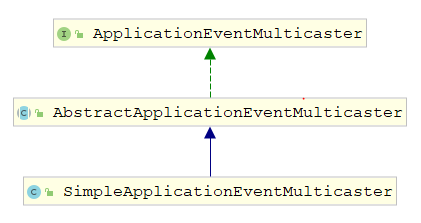

# Spring启动代码

**配置文件**

把我们需要注册给IOC容器的Bean，用配置文件进行描述；然后把配置文件路径传给Spring；XML是描述Bean关系的一种方式

~~~xml
<?xml version="1.0" encoding="UTF-8"?>
<beans xmlns="http://www.springframework.org/schema/beans"
       xmlns:xsi="http://www.w3.org/2001/XMLSchema-instance"
       xmlns:context="http://www.springframework.org/schema/context"
       xsi:schemaLocation="http://www.springframework.org/schema/beans  http://www.springframework.org/schema/beans/spring-beans.xsd
       http://www.springframework.org/schema/context http://www.springframework.org/schema/context/spring-context-4.1.xsd">
    <bean id = "helloService" class="com.qinfengsa.spring.service.HelloServiceImpl">
        <property name="message" value="my test start!"/> 
        <!--必须有set方法才能注入，原因是注入Property需要通过反射调用set方法-->
        <property name="calculateService" ref="calculateService"/>
    </bean>
    <bean id = "calculateService" class="com.qinfengsa.spring.service.CalculateServiceImpl">
    </bean>
</beans>
~~~

**Bean描述**

| 属性            | 描述                                                         |
| --------------- | ------------------------------------------------------------ |
| class           | 用来创建 bean 的 class，这个属性是强制性的                   |
| id/name         | bean的唯一标识符。在基于 XML 的配置元数据中， 可以使用 ID 或者name 属性来指定 bean |
| scope           | 定义bean 的作用域                                            |
| constructor-arg | 基于构造函数的依赖注入，                                     |
| properties      | 基于set方法的依赖注入                                        |
| autowire        | 自动装配（byName、byType、constructor）                      |
| lazy-init       | 是否延迟加载                                                 |
| init-method     | 在 bean 的所有必需的属性被容器设置之后，调用回调方法。       |
| destroy-method  | 当包含该 bean 的容器被销毁时，回调方法。                     |

**Bean 作用域**

| 作用域         | 描述                                                         |
| -------------- | ------------------------------------------------------------ |
| singleton      | 在IOC容器仅存在一个Bean实例，Bean以单例方式存在，默认值      |
| prototype      | 每次从容器中调用Bean时，都返回一个新的实例，即每次调用getBean()时，相当于执行newXxxBean() |
| request        | 每次HTTP请求都会创建一个新的Bean，                           |
| session        | 同一个HTTP Session共享一个Bean，不同Session使用不同的Bean    |
| global-session | 该属性仅用于HTTP Session，同session作用域不同的是，所有的Session共享一个Bean实例 |

**启动代码**

~~~java
public static void main(String[] args) {
    ApplicationContext context = new ClassPathXmlApplicationContext("classpath:spring-context4.xml");
    HelloService helloService = context.getBean(HelloService.class);
    helloService.sayHello("qin");
}
~~~

# IOC 流程

ClassPathXmlApplicationContext继承体系，核心的抽象类AbstractApplicationContext，AbstractApplicationContext即实现了BeanFactory接口，同时继承DefaultResourceLoader，因此也是一个资源加载器；


## 构造方法

~~~java
public ClassPathXmlApplicationContext(
    String[] configLocations, boolean refresh, @Nullable ApplicationContext parent) throws BeansException { 
    super(parent); // parent默认是null
    setConfigLocations(configLocations); // 配件文件解析
    // 默认true
    if (refresh) {
        refresh();
    }
}
~~~

父类构造器，最终调用AbstractApplicationContext的构造方法

```java
public abstract class AbstractApplicationContext extends DefaultResourceLoader
		implements ConfigurableApplicationContext {
	// 内置资源解析器，初始化的时候创建，看上去是委托给别的类实现的，其实是它本身	
	private ResourcePatternResolver resourcePatternResolver;
	// 构造函数，创建资源解析器
	public AbstractApplicationContext() {
		this.resourcePatternResolver = getResourcePatternResolver();
	}
    public AbstractApplicationContext(@Nullable ApplicationContext parent) {
		this();
		setParent(parent);
	}
	// 返回资源解析器，用于解析配置文件
	protected ResourcePatternResolver getResourcePatternResolver() {
		// 由于AbstractApplicationContext继承DefaultResourceLoader，因此也是一个资源解析器
		// 其getResource(String location)方法用于载入资源
		// 最后你会发现，饶了一圈，最终解析配置文件的还是当前类 AbstractApplicationContext
		// 因为当前类继承了DefaultResourceLoader，本身就是一个ResourceLoader
		// 为什么这么设计，单一职责原则，如果以后更换ResourceLoader，或者把ResourceLoader去掉
		// 这种设计就会比直接调用自身方法侵入性更小，日后也容易扩展
		return new PathMatchingResourcePatternResolver(this);
	}
}
```

```java
public class PathMatchingResourcePatternResolver implements ResourcePatternResolver {
	public PathMatchingResourcePatternResolver(ResourceLoader resourceLoader) {
		Assert.notNull(resourceLoader, "ResourceLoader must not be null");
		// 设置Spring的资源解析器，真身是 AbstractApplicationContext 类
		this.resourceLoader = resourceLoader;
	}
}
```

### Resource

默认的资源解析器，AbstractApplicationContext继承DefaultResourceLoader

~~~java
 public class DefaultResourceLoader implements ResourceLoader {
    @Nullable
	private ClassLoader classLoader;

	private final Set<ProtocolResolver> protocolResolvers = new LinkedHashSet<>(4);

	private final Map<Class<?>, Map<Resource, ?>> resourceCaches = new ConcurrentHashMap<>(4);
    public DefaultResourceLoader() {
		this.classLoader = ClassUtils.getDefaultClassLoader();
	}
    @Override
	public Resource getResource(String location) {
		Assert.notNull(location, "Location must not be null");
		// 看下缓存里有没有
		for (ProtocolResolver protocolResolver : this.protocolResolvers) {
			Resource resource = protocolResolver.resolve(location, this);
			if (resource != null) {
				return resource;
			}
		}
		// 如果是路径方式，调用getResourceByPath解析配置文件
		if (location.startsWith("/")) {
			return getResourceByPath(location);
		}
        // 如果classpath:开头，调用ClassPathResource
		else if (location.startsWith(CLASSPATH_URL_PREFIX)) {
			return new ClassPathResource(location.substring(CLASSPATH_URL_PREFIX.length()),getClassLoader());
		} else {
			try {
				// 通过URL判断配置文件是否URL，通过URL解析
				URL url = new URL(location);
				return (ResourceUtils.isFileURL(url) ? new FileUrlResource(url) : new UrlResource(url));
			}
			catch (MalformedURLException ex) {
				// 不是URL，默认以路径解析
				return getResourceByPath(location);
			}
		}
	}
}
~~~


## 配置文件路径

调用方法 AbstractRefreshableConfigApplicationContext.setConfigLocations:

```java
public abstract class AbstractRefreshableConfigApplicationContext extends 
    AbstractRefreshableApplicationContext implements BeanNameAware, InitializingBean {
    // 通过String数组记录配置文件的路径
	private String[] configLocations;
    // 解析配置路径
    public void setConfigLocations(@Nullable String... locations) {
		if (locations != null) {
			Assert.noNullElements(locations, "Config locations must not be null");
			this.configLocations = new String[locations.length];
            // resolvePath 将字符串(占位符classpath:等)解析为实际路径
			for (int i = 0; i < locations.length; i++) {
				this.configLocations[i] = resolvePath(locations[i]).trim();
			}
		} else {
			this.configLocations = null;
		}
	}
    protected String resolvePath(String path) {
		return getEnvironment().resolveRequiredPlaceholders(path);
	}
    
}
public abstract class AbstractApplicationContext extends DefaultResourceLoader
		implements ConfigurableApplicationContext {
    // environment 变量，用于实际解析配置路径
    @Nullable
	private ConfigurableEnvironment environment;
    // environment 默认使用StandardEnvironment创建
    public ConfigurableEnvironment getEnvironment() {
		if (this.environment == null) {
			this.environment = createEnvironment();
		}
		return this.environment;
	}
    protected ConfigurableEnvironment createEnvironment() {
		return new StandardEnvironment();
	}
}
```

### Environment


Environment接口**代表了当前应用所处的环境**。Spring实现多环境配置功能的接口，其主要和Profiles、Property相关

配置XML

~~~xml
<?xml version="1.0" encoding="UTF-8"?>
<beans xmlns="http://www.springframework.org/schema/beans"
       xmlns:xsi="http://www.w3.org/2001/XMLSchema-instance"
       xmlns:context="http://www.springframework.org/schema/context"
       xsi:schemaLocation="http://www.springframework.org/schema/beans http://www.springframework.org/schema/beans/spring-beans.xsd
       http://www.springframework.org/schema/context http://www.springframework.org/schema/context/spring-context-4.1.xsd">  
    <bean id="helloWorld" class="com.qinfengsa.spring.bean.HelloWorld" > 
    </bean>
 	<!-- 环境配置，必须放在最后 -->
    <beans profile="dev">
        <context:property-placeholder location="classpath:properties/qin-dev.properties"/>
    </beans>
    <beans profile="test">
        <context:property-placeholder location="classpath:properties/qin-test.properties"/>
    </beans>
</beans>
~~~

配置环境注解：`@Profile("dev") `

~~~java
@Component  
@Profile("dev")  
public class DataSource{
	//…………
}
~~~


**切换Environment**

* 在web.xml中添加一个context-param来切换当前环境：

  ~~~xml
  <context-param> 
      <param-name>spring.profiles.active</param-name> 
      <param-value>dev</param-value> 
  </context-param> 
  ~~~

* **注解ActiveProfiles**

  ~~~java
  @RunWith(SpringJUnit4ClassRunner.class)
  @ContextConfiguration(locations = "classpath:spring-environment.xml")
  @ActiveProfiles("dev")
  public class EnvironmentTest {
  }
  ~~~

#### 构造方法

~~~java
public abstract class AbstractEnvironment implements ConfigurableEnvironment {
    // active 环境集合 和 默认环境集合 
    private final Set<String> activeProfiles = new LinkedHashSet<>(); 
	private final Set<String> defaultProfiles = new LinkedHashSet<>(getReservedDefaultProfiles());
    public static final String ACTIVE_PROFILES_PROPERTY_NAME = "spring.profiles.active";
    // 配置属性信息集合
    private final MutablePropertySources propertySources = new MutablePropertySources();
    // 构造方法
    public AbstractEnvironment() {
		customizePropertySources(this.propertySources); 
	}
    // 定义模板，交给子类
    protected void customizePropertySources(MutablePropertySources propertySources) {
	}
    // 获得当前 active 环境集合
    @Override
	public String[] getActiveProfiles() {
		return StringUtils.toStringArray(doGetActiveProfiles());
	} 
	protected Set<String> doGetActiveProfiles() {
		synchronized (this.activeProfiles) {
			if (this.activeProfiles.isEmpty()) {
				// 获取 spring.profiles.active 参数，然后放入集合activeProfiles
				String profiles = getProperty(ACTIVE_PROFILES_PROPERTY_NAME);
				if (StringUtils.hasText(profiles)) {
					setActiveProfiles(StringUtils.commaDelimitedListToStringArray(
							StringUtils.trimAllWhitespace(profiles)));
				}
			}
			return this.activeProfiles;
		}
	}
}

public class StandardEnvironment extends AbstractEnvironment { 
	/** System environment property source name: {@value}. */
	public static final String SYSTEM_ENVIRONMENT_PROPERTY_SOURCE_NAME = "systemEnvironment"; 
	/** JVM system properties property source name: {@value}. */
	public static final String SYSTEM_PROPERTIES_PROPERTY_SOURCE_NAME = "systemProperties";
 
	@Override
	protected void customizePropertySources(MutablePropertySources propertySources) {
		propertySources.addLast(
			new PropertiesPropertySource(SYSTEM_PROPERTIES_PROPERTY_SOURCE_NAME, getSystemProperties()));
		propertySources.addLast(
			new SystemEnvironmentPropertySource(SYSTEM_ENVIRONMENT_PROPERTY_SOURCE_NAME, 	
                                                getSystemEnvironment()));
	}
}
~~~

#### PropertySources

属性来源集合

~~~java
public class MutablePropertySources implements PropertySources {
    // 使用CopyOnWriteArrayList存储 PropertySource 对象
    private final List<PropertySource<?>> propertySourceList = new CopyOnWriteArrayList<>();
    // 添加 PropertySource对象
    public void addLast(PropertySource<?> propertySource) {
		removeIfPresent(propertySource);
		this.propertySourceList.add(propertySource);
	}
}
~~~

#### PropertySource

PropertySource代表了Property来源，MapPropertySource采用Map<String, Object>存储Property的k-v

~~~java
public abstract class PropertySource<T> { 
	// 名称 systemProperties,systemEnvironment
	protected final String name;

	protected final T source; 
	public PropertySource(String name, T source) {
		Assert.hasText(name, "Property source name must contain at least one character");
		Assert.notNull(source, "Property source must not be null");
		this.name = name;
		this.source = source;
	}
}
// MapPropertySource 采用Map<String, Object>存储Property的k-v
public class MapPropertySource extends EnumerablePropertySource<Map<String, Object>> {

	public MapPropertySource(String name, Map<String, Object> source) {
		super(name, source);
	} 
	@Override
	@Nullable
	public Object getProperty(String name) {
		return this.source.get(name);
	} 
	@Override
	public boolean containsProperty(String name) {
		return this.source.containsKey(name);
	} 
	@Override
	public String[] getPropertyNames() {
		return StringUtils.toStringArray(this.source.keySet());
	}

}
~~~

获取系统属性System.getProperties转换成Map

~~~java
public abstract class AbstractEnvironment implements ConfigurableEnvironment {
    public Map<String, Object> getSystemProperties() {
		try {
			return (Map) System.getProperties();
		} catch (AccessControlException ex) {
			return (Map) new ReadOnlySystemAttributesMap() {
				@Override
				@Nullable
				protected String getSystemAttribute(String attributeName) {
					try {
						return System.getProperty(attributeName);
					}
					catch (AccessControlException ex) { 
						return null;
					}
				}
			};
		}
	}
}
~~~

### PropertyResolver

解析占位符，"${"，"}"，":"

~~~java
public abstract class AbstractEnvironment implements ConfigurableEnvironment {
    // 属性解析器
    private final ConfigurablePropertyResolver propertyResolver =
			new PropertySourcesPropertyResolver(this.propertySources);
    @Override
	public String resolveRequiredPlaceholders(String text) throws IllegalArgumentException {
		return this.propertyResolver.resolveRequiredPlaceholders(text);
	}
}
~~~

ConfigurablePropertyResolver

~~~java
public abstract class AbstractPropertyResolver implements ConfigurablePropertyResolver {
	/** 前缀 "${" */
    private String placeholderPrefix = SystemPropertyUtils.PLACEHOLDER_PREFIX;
	/** 后缀 "}" */ 
	private String placeholderSuffix = SystemPropertyUtils.PLACEHOLDER_SUFFIX;
	/** 键值对 ":" */
	@Nullable
	private String valueSeparator = SystemPropertyUtils.VALUE_SEPARATOR;
    // 解析占位符
	@Override
	public String resolveRequiredPlaceholders(String text) throws IllegalArgumentException {
		if (this.strictHelper == null) {
			this.strictHelper = createPlaceholderHelper(false);
		}
		return doResolvePlaceholders(text, this.strictHelper);
	} 
    private PropertyPlaceholderHelper createPlaceholderHelper(boolean ignoreUnresolvablePlaceholders) {
		return new PropertyPlaceholderHelper(this.placeholderPrefix, this.placeholderSuffix,
				this.valueSeparator, ignoreUnresolvablePlaceholders);
	}
    private String doResolvePlaceholders(String text, PropertyPlaceholderHelper helper) {
        // Lambda表达式，指向方法getPropertyAsRawString
		return helper.replacePlaceholders(text, this::getPropertyAsRawString);
	}
    // 抽象方法，子类实现
    @Nullable
	protected abstract String getPropertyAsRawString(String key);
}
~~~


~~~java
public class PropertySourcesPropertyResolver extends AbstractPropertyResolver {
    @Override
	@Nullable
	protected String getPropertyAsRawString(String key) {
		return getProperty(key, String.class, false);
	} 
	@Nullable
	protected <T> T getProperty(String key, Class<T> targetValueType, boolean resolveNestedPlaceholders) {
		if (this.propertySources != null) {
			for (PropertySource<?> propertySource : this.propertySources) {
				if (logger.isTraceEnabled()) {
					logger.trace("Searching for key '" + key + "' in PropertySource '" +
							propertySource.getName() + "'");
				}
				Object value = propertySource.getProperty(key);
				if (value != null) {
					if (resolveNestedPlaceholders && value instanceof String) {
						value = resolveNestedPlaceholders((String) value);
					}
					logKeyFound(key, propertySource, value);
					return convertValueIfNecessary(value, targetValueType);
				}
			}
		}
		if (logger.isDebugEnabled()) {
			logger.debug("Could not find key '" + key + "' in any property source");
		}
		return null;
	}
}
~~~


## refresh

AbstractApplicationContext 定义的IOC 流程模版

~~~java
public void refresh() throws BeansException, IllegalStateException {
    synchronized (this.startupShutdownMonitor) {
        // 准备方法: 设置启动时间,启动标志,关闭标志
        prepareRefresh();
        // 通知子类执行refreshBeanFactory()方法,创建BeanFactory
        ConfigurableListableBeanFactory beanFactory = obtainFreshBeanFactory();
        // 为BeanFactory配置容器特性，例如类加载器、事件处理器等
        prepareBeanFactory(beanFactory);
        try {
            // 子类在所有的bean尚未初始化之前注册BeanPostProcessor,默认空实现
            postProcessBeanFactory(beanFactory);
            // 实例化并调用所有注册的BeanFactoryPostProcessor接口的bean
            invokeBeanFactoryPostProcessors(beanFactory);
            // 注册拦截Bean创建的Bean处理器,即注册 BeanPostProcessor
            registerBeanPostProcessors(beanFactory);
            // 初始化信息源，和国际化相关.
            initMessageSource();
            // 初始化容器事件传播器.
            initApplicationEventMulticaster();
            // 给子类扩展初始化其他Bean
            onRefresh();
            // 在所有bean中查找listener bean，然后注册到广播器中
            registerListeners();
            // 初始化剩下的单例Bean(非延迟加载的)
            finishBeanFactoryInitialization(beanFactory);
            // 完成刷新过程,通知生命周期处理器lifecycleProcessor刷新过程,同时发出ContextRefreshEvent通知
            finishRefresh();
        } catch (BeansException ex) { 
            // 销毁已经创建的Bean
            destroyBeans(); 
            // 重置容器激活标签
            cancelRefresh(ex); 
            throw ex;
        }   finally {
            // Reset common introspection caches in Spring's core, since we
            // might not ever need metadata for singleton beans anymore...
            resetCommonCaches();
        }
    }
}
~~~

### prepareRefresh

~~~java
public abstract class AbstractApplicationContext extends DefaultResourceLoader
		implements ConfigurableApplicationContext {
    protected void prepareRefresh() {
        // 设置启动时间、启动标志、关闭标志
		this.startupDate = System.currentTimeMillis();
		this.closed.set(false);
		this.active.set(true); 
		if (logger.isInfoEnabled()) {
			logger.info("Refreshing " + this);
		}
		// 空方法，web相关的几个类有重写，和servlet配置信息有关
		initPropertySources();
		// 校验必需的属性
		// see ConfigurablePropertyResolver#setRequiredProperties
		getEnvironment().validateRequiredProperties();

		this.earlyApplicationEvents = new LinkedHashSet<>();
	}
}
~~~

#### 属性校验

~~~java
public abstract class AbstractEnvironment implements ConfigurableEnvironment {
    // 属性解析器
    private final ConfigurablePropertyResolver propertyResolver =
			new PropertySourcesPropertyResolver(this.propertySources);
    // 校验属性
    @Override
	public void validateRequiredProperties() throws MissingRequiredPropertiesException {
		this.propertyResolver.validateRequiredProperties();
	}
}
public abstract class AbstractPropertyResolver implements ConfigurablePropertyResolver {
    // 必须属性集合
    private final Set<String> requiredProperties = new LinkedHashSet<>();
    // 校验必须属性
	@Override
	public void validateRequiredProperties() {
		MissingRequiredPropertiesException ex = new MissingRequiredPropertiesException();
		for (String key : this.requiredProperties) {
			if (this.getProperty(key) == null) {
				ex.addMissingRequiredProperty(key);
			}
		}
		if (!ex.getMissingRequiredProperties().isEmpty()) {
			throw ex;
		}
	}
}
~~~

### 获取BeanFactory

~~~java
public abstract class AbstractApplicationContext extends DefaultResourceLoader
		implements ConfigurableApplicationContext {
    protected ConfigurableListableBeanFactory obtainFreshBeanFactory() {
		// refreshBeanFactory抽象方法，委派给子类
		refreshBeanFactory();
        // getBeanFactory抽象方法
		ConfigurableListableBeanFactory beanFactory = getBeanFactory();
		if (logger.isDebugEnabled()) {
			logger.debug("Bean factory for " + getDisplayName() + ": " + beanFactory);
		}
		return beanFactory;
	}
}
public abstract class AbstractRefreshableApplicationContext extends AbstractApplicationContext { 
	// beanFactory 容器，IOC容器的实现类只有一个DefaultListableBeanFactory
	@Nullable
	private DefaultListableBeanFactory beanFactory; 
    // 同步锁对象
	private final Object beanFactoryMonitor = new Object();
	@Override
	public final ConfigurableListableBeanFactory getBeanFactory() {
        // 同步锁
		synchronized (this.beanFactoryMonitor) {
			if (this.beanFactory == null) {
				throw new IllegalStateException("BeanFactory not initialized or already closed - " +
						"call 'refresh' before accessing beans via the ApplicationContext");
			}
			return this.beanFactory;
		}
	}
}
~~~

#### 创建BeanFactory

~~~java
public abstract class AbstractRefreshableApplicationContext extends AbstractApplicationContext {
    // 创建beanFactory时 通知子类执行refreshBeanFactory()方法 
    @Override
    protected final void refreshBeanFactory() throws BeansException {
        // 如果已经有容器，销毁容器中的bean，关闭容器
        if (hasBeanFactory()) {
            destroyBeans();
            closeBeanFactory();
        }
        try {
            // 创建IOC容器, IOC容器的实现类只有一个DefaultListableBeanFactory
            DefaultListableBeanFactory beanFactory = createBeanFactory();
            beanFactory.setSerializationId(getId());
            // 对IOC容器进行定制化，如设置启动参数，开启注解的自动装配等
            customizeBeanFactory(beanFactory);
            // 调用载入Bean定义的方法，委派给子类执行 
            loadBeanDefinitions(beanFactory);
            synchronized (this.beanFactoryMonitor) {
                this.beanFactory = beanFactory;
            }
        } catch (IOException ex) {
            throw new ApplicationContextException("I/O error parsing bean definition source for " + 						getDisplayName(), ex);
        }
    }
    // 创建 DefaultListableBeanFactory
    protected DefaultListableBeanFactory createBeanFactory() {
		return new DefaultListableBeanFactory(getInternalParentBeanFactory());
	}
}
~~~

#### BeanFactory定制化

~~~java
public abstract class AbstractRefreshableApplicationContext extends AbstractApplicationContext {	
    // 允许覆盖BeanDefinition 默认null
	private Boolean allowBeanDefinitionOverriding; 
	// 允许循环引用 默认null
	private Boolean allowCircularReferences;
	protected void customizeBeanFactory(DefaultListableBeanFactory beanFactory) {
        // 默认null
		if (this.allowBeanDefinitionOverriding != null) { 
			beanFactory.setAllowBeanDefinitionOverriding(this.allowBeanDefinitionOverriding);
		}
		if (this.allowCircularReferences != null) { 
			beanFactory.setAllowCircularReferences(this.allowCircularReferences);
		}
	}
}
~~~

### 加载BeanDefinition

加载BeanDefinition : AbstractXmlApplicationContext.loadBeanDefinitions

```java
public abstract class AbstractXmlApplicationContext extends AbstractRefreshableConfigApplicationContext {
    @Override
    protected void loadBeanDefinitions(DefaultListableBeanFactory beanFactory) 
        throws BeansException, IOException {
        // Create a new XmlBeanDefinitionReader for the given BeanFactory.
        // 创建XmlBeanDefinitionReader，即创建Bean读取器 
        // ！这里需要注意 DefaultListableBeanFactory 做了转换，beanFactory 转变成了 beanDefinitionReader
        // DefaultListableBeanFactory 实现了 BeanDefinitionRegistry接口 后面有用到
        XmlBeanDefinitionReader beanDefinitionReader = new XmlBeanDefinitionReader(beanFactory);

        beanDefinitionReader.setEnvironment(this.getEnvironment());
        // 为Bean读取器设置Spring资源加载器，AbstractXmlApplicationContext的
        // 父类AbstractApplicationContext继承DefaultResourceLoader，因此，容器本身也是一个资源加载器 
        beanDefinitionReader.setResourceLoader(this); // this也是一个ResourceLoader
        // 为BeanDefinitionReader设置SAX xml解析器
        beanDefinitionReader.setEntityResolver(new ResourceEntityResolver(this));

        // BeanDefinitionReader 读取Bean定义的Xml资源文件时，启用xml的校验机制
        initBeanDefinitionReader(beanDefinitionReader);
        // BeanDefinitionReader 真正实现加载的方法
        loadBeanDefinitions(beanDefinitionReader);
    } 
    // 启用xml的校验机制
    protected void initBeanDefinitionReader(XmlBeanDefinitionReader reader) {
		reader.setValidating(this.validating);
	}
    
    // XmlBeanDefinitionReader加载BeanDefinition
	protected void loadBeanDefinitions(XmlBeanDefinitionReader reader) throws BeansException, IOException {
		// 获取ConfigResource，getConfigResources()方法在ClassPathXmlApplicationContext中有实现，其他为null
        // 当前configResources == null
		Resource[] configResources = getConfigResources();
		if (configResources != null) { 
			reader.loadBeanDefinitions(configResources);
		}
		// 获取configLocations，之前调用过setConfigLocations 
		String[] configLocations = getConfigLocations();
		if (configLocations != null) { 
			reader.loadBeanDefinitions(configLocations);
		}
	}
}
```
#### BeanDefinitionReader

对不同类型的配置文件选择响应的BeanDefinitionReader策略


调用AbstractBeanDefinitionReader.loadBeanDefinitions 

~~~java
public abstract class AbstractBeanDefinitionReader implements EnvironmentCapable, BeanDefinitionReader {
    // 构造方法
    protected AbstractBeanDefinitionReader(BeanDefinitionRegistry registry) {
		Assert.notNull(registry, "BeanDefinitionRegistry must not be null");
		this.registry = registry; 
		if (this.registry instanceof ResourceLoader) {
			this.resourceLoader = (ResourceLoader) this.registry;
		} else {
			this.resourceLoader = new PathMatchingResourcePatternResolver();
		}
		if (this.registry instanceof EnvironmentCapable) {
			this.environment = ((EnvironmentCapable) this.registry).getEnvironment();
		} else {
			this.environment = new StandardEnvironment();
		}
	}
	public int loadBeanDefinitions(String... locations) throws BeanDefinitionStoreException {
		Assert.notNull(locations, "Location array must not be null");
		int counter = 0;
		for (String location : locations) {
			counter += loadBeanDefinitions(location);
		}
		return counter;
	}
    @Override
	public int loadBeanDefinitions(String location) throws BeanDefinitionStoreException {
		return loadBeanDefinitions(location, null);
	}
    public int loadBeanDefinitions(String location, @Nullable Set<Resource> actualResources) 
        throws BeanDefinitionStoreException {
		// 获取在IoC容器初始化过程中设置的资源加载器
        // 这里 resourceLoader = new PathMatchingResourcePatternResolver();
		ResourceLoader resourceLoader = getResourceLoader();
		if (resourceLoader == null) {
			throw new BeanDefinitionStoreException(
            "Cannot import bean definitions from location [" + location + "]: no ResourceLoader available");
		} 
		if (resourceLoader instanceof ResourcePatternResolver) { 
			try { 
                // 通过路径获取资源文件，把路径转换为Resource文件
				Resource[] resources = ((ResourcePatternResolver) resourceLoader).getResources(location);
				// 最终委派调用其子类XmlBeanDefinitionReader的方法，实现加载功能
				int loadCount = loadBeanDefinitions(resources);
				if (actualResources != null) {
					for (Resource resource : resources) {
						actualResources.add(resource);
					}
				} 
				return loadCount;
			} catch (IOException ex) {
				throw new BeanDefinitionStoreException(
						"Could not resolve bean definition resource pattern [" + location + "]", ex);
			}
		} else { 
            // 通过路径获取资源文件，把路径转换为Resource文件
			Resource resource = resourceLoader.getResource(location); 
			int loadCount = loadBeanDefinitions(resource);
			if (actualResources != null) {
				actualResources.add(resource);
			}
			if (logger.isDebugEnabled()) {
				logger.debug("Loaded " + loadCount + " bean definitions from location [" + location + "]");
			}
			return loadCount;
		}
	} 
}
~~~

#### getResoutce

通过路径获取XML配置文件资源

~~~java
public class PathMatchingResourcePatternResolver implements ResourcePatternResolver {
    @Override
	public Resource[] getResources(String locationPattern) throws IOException {
		Assert.notNull(locationPattern, "Location pattern must not be null");
        // 处理以"classpath*:"开头的路径, CLASSPATH_ALL_URL_PREFIX = "classpath*:";
		if (locationPattern.startsWith(CLASSPATH_ALL_URL_PREFIX)) {
			// a class path resource (multiple resources for same name possible)
			if (getPathMatcher().isPattern(locationPattern.substring(CLASSPATH_ALL_URL_PREFIX.length()))) {
				// a class path resource pattern
				return findPathMatchingResources(locationPattern);
			} else {
				// all class path resources with the given name
				return findAllClassPathResources(
                    locationPattern.substring(CLASSPATH_ALL_URL_PREFIX.length()));
			}
		} else {
			// Generally only look for a pattern after a prefix here,
			// and on Tomcat only after the "*/" separator for its "war:" protocol.
			int prefixEnd = (locationPattern.startsWith("war:") ? locationPattern.indexOf("*/") + 1 :
					locationPattern.indexOf(":") + 1);
			if (getPathMatcher().isPattern(locationPattern.substring(prefixEnd))) {
				// a file pattern
				return findPathMatchingResources(locationPattern);
			} else {
				// a single resource with the given name
				return new Resource[] {getResourceLoader().getResource(locationPattern)};
			}
		}
	} 
}
~~~

isPattern，配置文件路径是支持ant风格`"spring-*.xml"`

```java
@Override
public boolean isPattern(String path) {
    return (path.indexOf('*') != -1 || path.indexOf('?') != -1);
}
```

#### 配置文件加载

把Resource得到的文件加载到内存中

~~~java
public class XmlBeanDefinitionReader extends AbstractBeanDefinitionReader {
    
    // XmlBeanDefinitionReader加载资源的入口 
	@Override
	public int loadBeanDefinitions(Resource resource) throws BeanDefinitionStoreException {
		// 将读入的XML资源进行特殊编码处理
		return loadBeanDefinitions(new EncodedResource(resource));
	} 
	// 载入XML形式的BeanDefinition 
	public int loadBeanDefinitions(EncodedResource encodedResource) throws BeanDefinitionStoreException {
        // 通过Set集合记录读取的xml文件，防止重复读入
        Set<EncodedResource> currentResources = this.resourcesCurrentlyBeingLoaded.get();
		if (currentResources == null) {
			currentResources = new HashSet<>(4);
			this.resourcesCurrentlyBeingLoaded.set(currentResources);
		}
        // 重复读入报错，例如xml文件 <import> 相互导入
		if (!currentResources.add(encodedResource)) {
			throw new BeanDefinitionStoreException(
					"Detected cyclic loading of " + encodedResource + " - check your import definitions!");
		}
		try {
			// 将资源文件转为InputStream的IO流
			InputStream inputStream = encodedResource.getResource().getInputStream();
			try {
				// 从InputStream中得到XML的解析源
                // org.xml.sax.InputSource 通过SAX API把XML读取到内存中
				InputSource inputSource = new InputSource(inputStream);
				if (encodedResource.getEncoding() != null) {
					inputSource.setEncoding(encodedResource.getEncoding());
				}
				// 具体的读取过程
				return doLoadBeanDefinitions(inputSource, encodedResource.getResource());
			} finally {
				// 关闭IO流
				inputStream.close();
			}
		} catch (IOException ex) { 
		} 
	} 
    // 真正干活的方法
    protected int doLoadBeanDefinitions(InputSource inputSource, Resource resource)
        throws BeanDefinitionStoreException {
        try {
            // 将XML文件转换为DOM对象，解析过程由documentLoader实现
            Document doc = doLoadDocument(inputSource, resource);
            // 开始解析BeanDefinition，解析过程会用到Spring的Bean配置规则
            return registerBeanDefinitions(doc, resource);
        }  catch (BeanDefinitionStoreException ex) {
            throw ex;
        } //... 省略
    }
    // 把XML转换为Document
    private DocumentLoader documentLoader = new DefaultDocumentLoader();
    protected Document doLoadDocument(InputSource inputSource, Resource resource) throws Exception {
		return this.documentLoader.loadDocument(inputSource, getEntityResolver(), this.errorHandler,
				getValidationModeForResource(resource), isNamespaceAware());
	}
}
~~~

##### **Document加载**

~~~java
public class DefaultDocumentLoader implements DocumentLoader { 
    // 使用标准的JAXP将InputSource转换成document对象
	@Override
	public Document loadDocument(InputSource inputSource, EntityResolver entityResolver,
			ErrorHandler errorHandler, int validationMode, boolean namespaceAware) throws Exception {
		// 创建Document解析器工厂
		DocumentBuilderFactory factory = createDocumentBuilderFactory(validationMode, namespaceAware); 
		// 创建Document解析器
		DocumentBuilder builder = createDocumentBuilder(factory, entityResolver, errorHandler);
		// 解析XML获得Document对象
		return builder.parse(inputSource);
	}
}
~~~


#### 解析BeanDefinition

把配置文件读取到内存中之后，需要将BeanDefinition注册到容器beanDefinitionMap中，使用ConcurrentHashMap存储

~~~java
public class XmlBeanDefinitionReader extends AbstractBeanDefinitionReader {	
	// 按照Spring的Bean语义要求将Bean定义资源解析并转换为容器内部数据结构
	public int registerBeanDefinitions(Document doc, Resource resource) throws BeanDefinitionStoreException {
		// 创建BeanDefinitionDocumentReader解析配置文件
		BeanDefinitionDocumentReader documentReader = createBeanDefinitionDocumentReader();
		// 获得容器中注册的Bean数量，注意：这里的getRegistry()得到的是 DefaultListableBeanFactory
		int countBefore = getRegistry().getBeanDefinitionCount(); 
		// 委托给documentReader进行注册BeanDefinition
		documentReader.registerBeanDefinitions(doc, createReaderContext(resource));
		// 统计解析的Bean数量
		return getRegistry().getBeanDefinitionCount() - countBefore;
	} 
    // 创建BeanDefinitionDocumentReader对象，解析Document对象
	protected BeanDefinitionDocumentReader createBeanDefinitionDocumentReader() {
		return BeanDefinitionDocumentReader.class.cast(BeanUtils.instantiateClass(this.documentReaderClass));
	} 
}
~~~

##### BeanDefinition

DefaultBeanDefinitionDocumentReader 开始注册BeanDefinition

~~~java
public class DefaultBeanDefinitionDocumentReader implements BeanDefinitionDocumentReader {
    public void registerBeanDefinitions(Document doc, XmlReaderContext readerContext) {
		// 获得XML描述符
		this.readerContext = readerContext; 
		// 获得Document的根元素
		Element root = doc.getDocumentElement();
		doRegisterBeanDefinitions(root);
	} 
	// 开始干活，从xml的root节点开始解析
	protected void doRegisterBeanDefinitions(Element root) { 
		// 具体的解析过程委托给BeanDefinitionParserDelegate实现 
		BeanDefinitionParserDelegate parent = this.delegate;
		this.delegate = createDelegate(getReaderContext(), root, parent); 
        // 判断 root元素是否属于Spring
		if (this.delegate.isDefaultNamespace(root)) {
            // 检查"profile"属性
			String profileSpec = root.getAttribute(PROFILE_ATTRIBUTE);
			if (StringUtils.hasText(profileSpec)) {
				String[] specifiedProfiles = StringUtils.tokenizeToStringArray(
						profileSpec, BeanDefinitionParserDelegate.MULTI_VALUE_ATTRIBUTE_DELIMITERS);
				if (!getReaderContext().getEnvironment().acceptsProfiles(specifiedProfiles)) {
					return;
				}
			}
		} 
		// 在解析XML之前，提供了扩展方法（空方法） 
		preProcessXml(root);
		// 从Document的root开始进行BeanDefinition的解析，委托给delegate
		parseBeanDefinitions(root, this.delegate);
		// 在解析XML之后，提供了扩展方法（空方法） 
		postProcessXml(root); 
		this.delegate = parent;
	}
    
    protected void parseBeanDefinitions(Element root, BeanDefinitionParserDelegate delegate) {
		// 判断 当前元素是否属于Spring
        // Spring默认的XML命名空间 http://www.springframework.org/schema/beans
		if (delegate.isDefaultNamespace(root)) {
			// 获取root的所有子节点
			NodeList nl = root.getChildNodes();
			for (int i = 0; i < nl.getLength(); i++) {
				Node node = nl.item(i);
				// 获得Document节点是XML元素节点
				if (node instanceof Element) {
					Element ele = (Element) node;
					// 判断 当前元素是否属于Spring
					if (delegate.isDefaultNamespace(ele)) {
						// 使用Spring的规则解析元素
						parseDefaultElement(ele, delegate);
					} else {
						// 自定义元素解析，对外提供扩展功能，通过BeanDefinitionParser解析元素
                        // 例如：DubboBeanDefinitionParser
						delegate.parseCustomElement(ele);
					}
				}
			}
		} else {
			// 自定义元素解析
			delegate.parseCustomElement(root);
		}
	}  
}
~~~

#### 默认元素解析

~~~java
public class DefaultBeanDefinitionDocumentReader implements BeanDefinitionDocumentReader {	
	// 使用Spring的Bean规则解析 Element
	private void parseDefaultElement(Element ele, BeanDefinitionParserDelegate delegate) {
		// 对 <import> 标签的解析
		if (delegate.nodeNameEquals(ele, IMPORT_ELEMENT)) {
			importBeanDefinitionResource(ele);
		}
		// 对 <alias> 标签的解析
		else if (delegate.nodeNameEquals(ele, ALIAS_ELEMENT)) {
			processAliasRegistration(ele);
		} 
		// 对 <bean> 标签的解析
		else if (delegate.nodeNameEquals(ele, BEAN_ELEMENT)) {
			processBeanDefinition(ele, delegate);
		} 
        // 对 <beans> 标签的解析
        else if (delegate.nodeNameEquals(ele, NESTED_BEANS_ELEMENT)) {
			// 递归操作
			doRegisterBeanDefinitions(ele);
		}
	} 
}
~~~

##### import

import配置

~~~xml
<import resource="classpath:spring-aop.xml" />
~~~


~~~java
public class DefaultBeanDefinitionDocumentReader implements BeanDefinitionDocumentReader {	
    protected void importBeanDefinitionResource(Element ele) {
		// 获得 import 的 resource属性
		String location = ele.getAttribute(RESOURCE_ATTRIBUTE);
		// resource 为空，则没有导入任何资源，直接返回
		if (!StringUtils.hasText(location)) {
			getReaderContext().error("Resource location must not be empty", ele);
			return;
		} 
		// 使用PropertyResolver解析占位符"${"，"}"，":"，然后替换
		location = getReaderContext().getEnvironment().resolveRequiredPlaceholders(location);
		// actualResources 记录
		Set<Resource> actualResources = new LinkedHashSet<>(4);
 
		// 是否绝对路径
		boolean absoluteLocation = false;
		try {
			absoluteLocation = ResourcePatternUtils.isUrl(location) || 
                ResourceUtils.toURI(location).isAbsolute();
		} catch (URISyntaxException ex) { 
		} 
		// 绝对路径
		if (absoluteLocation) {
			try {
				// AbstractBeanDefinitionReader.loadBeanDefinitions 加载BeanDefinition;
                // 开始解析另一个xml文件
				int importCount = getReaderContext().getReader()
                    .loadBeanDefinitions(location, actualResources);
				 
			} catch (BeanDefinitionStoreException ex) {
                //...
			}
		} else { // 相对路径
			try {
				int importCount; 
				Resource relativeResource = getReaderContext().getResource().createRelative(location);
				// 通过相对路径获得Resource，如果Resource存在
				if (relativeResource.exists()) { 
					importCount = getReaderContext().getReader().loadBeanDefinitions(relativeResource);
					actualResources.add(relativeResource);
				}
				// 如果Resource不存在
				else {
					// 获取baseLocation,通过baseLocation+location定位配置文件
					String baseLocation = getReaderContext().getResource().getURL().toString(); 
					importCount = getReaderContext().getReader().loadBeanDefinitions(
							StringUtils.applyRelativePath(baseLocation, location), actualResources);
				} 
			}
			// catch ...
		}
		Resource[] actResArray = actualResources.toArray(new Resource[actualResources.size()]);
		// 解析完<import>元素之后，触发导入完成事件
		getReaderContext().fireImportProcessed(location, actResArray, extractSource(ele));
	}
}
~~~

##### alias

配置

~~~xml
<alias name="a" alias="b"/>
~~~


~~~java
public class DefaultBeanDefinitionDocumentReader implements BeanDefinitionDocumentReader {	
    protected void processAliasRegistration(Element ele) {
		// 获取<alias>别名元素中name的属性值
		String name = ele.getAttribute(NAME_ATTRIBUTE);
		// 获取<alias>别名元素中alias的属性值
		String alias = ele.getAttribute(ALIAS_ATTRIBUTE);
		boolean valid = true;
		// <alias>别名元素的name属性值为空
		if (!StringUtils.hasText(name)) {
			getReaderContext().error("Name must not be empty", ele);
			valid = false;
		}
		// <alias>别名元素的alias属性值为空
		if (!StringUtils.hasText(alias)) {
			getReaderContext().error("Alias must not be empty", ele);
			valid = false;
		}
		if (valid) {
			try {
				// 注册alias,使用ConcurrentHashMap存储
				getReaderContext().getRegistry().registerAlias(name, alias);
			} catch (Exception ex) {
				getReaderContext().error("Failed to register alias '" + alias +
						"' for bean with name '" + name + "'", ele, ex);
			}
			// 解析完<alias>元素之后，触发完成事件
			getReaderContext().fireAliasRegistered(name, alias, extractSource(ele));
		}
	}
}
~~~

##### bean

解析bean元素

~~~java
public class DefaultBeanDefinitionDocumentReader implements BeanDefinitionDocumentReader {		
	// 解析Bean 
	protected void processBeanDefinition(Element ele, BeanDefinitionParserDelegate delegate) {
        // 把ele节点（bean节点）封装成BeanDefinitionHolder
		BeanDefinitionHolder bdHolder = delegate.parseBeanDefinitionElement(ele);
		if (bdHolder != null) {
			bdHolder = delegate.decorateBeanDefinitionIfRequired(ele, bdHolder);
			try { 
				// 向Spring IOC容器注册解析得到的BeanDefinition 
                // getReaderContext().getRegistry() 实际就是DefaultListableBeanFactory
				BeanDefinitionReaderUtils.registerBeanDefinition(bdHolder, getReaderContext().getRegistry());
			}
			catch (BeanDefinitionStoreException ex) {
				getReaderContext().error("Failed to register bean definition with name '" +
						bdHolder.getBeanName() + "'", ele, ex);
			} 
			// 在完成向Spring IOC容器注册解析得到的Bean定义之后，发送注册事件
			getReaderContext().fireComponentRegistered(new BeanComponentDefinition(bdHolder));
		}
	}
}
~~~

###### 解析BeanDefinition

~~~java
public class BeanDefinitionParserDelegate {
    // 解析BeanDefinition，这个方法中主要处理<bean>元素的id，name和别名属性
	@Nullable
	public BeanDefinitionHolder parseBeanDefinitionElement(Element ele,  BeanDefinition containingBean) {
		// 获取<bean>元素中的id属性值
		String id = ele.getAttribute(ID_ATTRIBUTE);
		// 获取<bean>元素中的name属性值
		String nameAttr = ele.getAttribute(NAME_ATTRIBUTE); 
		// alias集合 
		List<String> aliases = new ArrayList<>(); 
		// 将<bean>的name属性值存放到alias集合中
		if (StringUtils.hasLength(nameAttr)) {
			String[] nameArr = StringUtils.tokenizeToStringArray(nameAttr, MULTI_VALUE_ATTRIBUTE_DELIMITERS);
			aliases.addAll(Arrays.asList(nameArr));
		} 
		String beanName = id;
		// 如果<bean>元素中没有配置id属性时，将别名中的第一个值赋值给beanName
		if (!StringUtils.hasText(beanName) && !aliases.isEmpty()) {
			beanName = aliases.remove(0); 
		}
 
		// 是否包含子元素<bean> containingBean
		if (containingBean == null) {
			// 检查<bean>元素所配置的id、name或者别名是否重复
			checkNameUniqueness(beanName, aliases, ele);
		} 
		// 详细解析<bean>元素的其他属性，转换为beanDefinition
		AbstractBeanDefinition beanDefinition = parseBeanDefinitionElement(ele, beanName, containingBean);
		if (beanDefinition != null) {
            // 如果<bean>元素中没有配置id、别名或者name
            // 生成一个唯一beanName并注册
			if (!StringUtils.hasText(beanName)) {
				try {
					if (containingBean != null) { 
						beanName = BeanDefinitionReaderUtils.generateBeanName(
								beanDefinition, this.readerContext.getRegistry(), true);
					} else { 
						beanName = this.readerContext.generateBeanName(beanDefinition); 
						String beanClassName = beanDefinition.getBeanClassName();
						if (beanClassName != null && beanName.startsWith(beanClassName) 
                            && beanName.length() > beanClassName.length() && 
                            !this.readerContext.getRegistry().isBeanNameInUse(beanClassName)) {
							aliases.add(beanClassName);
						}
					} 
				} catch (Exception ex) {
					error(ex.getMessage(), ele);
					return null;
				}
			}
			String[] aliasesArray = StringUtils.toStringArray(aliases);
            // beanDefinition组装成BeanDefinitionHolder
			return new BeanDefinitionHolder(beanDefinition, beanName, aliasesArray);
		}
		// 当解析出错时，返回null
		return null;
	} 
}
~~~

###### BeanDefinition其他属性

~~~java
public class BeanDefinitionParserDelegate { 
    // 对<bean>元素的其他属性进行解析
	@Nullable
	public AbstractBeanDefinition parseBeanDefinitionElement(
			Element ele, String beanName, @Nullable BeanDefinition containingBean) {
		// 记录解析的<bean>
		this.parseState.push(new BeanEntry(beanName)); 
		String className = null;

		// 获取class属性的值
		if (ele.hasAttribute(CLASS_ATTRIBUTE)) {
			className = ele.getAttribute(CLASS_ATTRIBUTE).trim();
		}
		String parent = null;
        // 获取parent属性的值
		if (ele.hasAttribute(PARENT_ATTRIBUTE)) {
			parent = ele.getAttribute(PARENT_ATTRIBUTE);
		} 
		try {
			// 根据<bean>元素配置的class名称和parent属性值创建BeanDefinition 
			AbstractBeanDefinition bd = createBeanDefinition(className, parent);
			// 解析<bean>元素的配置 singleton,scope,abstract,lazy-init,autowire 等属性
			parseBeanDefinitionAttributes(ele, beanName, containingBean, bd);
			// 解析<bean>的Description属性
			bd.setDescription(DomUtils.getChildElementValueByTagName(ele, DESCRIPTION_ELEMENT));
			// 解析<bean>的meta(元信息)属性 
			parseMetaElements(ele, bd);
			// 解析<bean>元素的lookup-method属性,放入BeanDefinition的methodOverrides字段
			parseLookupOverrideSubElements(ele, bd.getMethodOverrides());
			// 解析<bean>元素的replaced-method属性,放入BeanDefinition的methodOverrides字段
			parseReplacedMethodSubElements(ele, bd.getMethodOverrides());
			// 解析<bean>元素的构造方法 
			parseConstructorArgElements(ele, bd);
			// 解析<bean>元素的<property> 
			parsePropertyElements(ele, bd);
			// 解析<bean>元素的qualifier属性
			parseQualifierElements(ele, bd);
			// 为当前解析的bean设置所需的资源和依赖对象
			bd.setResource(this.readerContext.getResource());
			bd.setSource(extractSource(ele)); 
			return bd;
		} // ..catch  
        finally {
			this.parseState.pop();
		} 
		// 解析<bean>元素出错时，返回null
		return null;
	} 
}
~~~

###### 创建BeanDefiniton

默认创建 GenericBeanDefinition

~~~java
public class BeanDefinitionParserDelegate {
	protected AbstractBeanDefinition createBeanDefinition(@Nullable String className, 
        @Nullable String parentName) throws ClassNotFoundException {
		return BeanDefinitionReaderUtils.createBeanDefinition(
				parentName, className, this.readerContext.getBeanClassLoader());
	}
}
public class BeanDefinitionReaderUtils { 
    // 创建BeanDefinition
	public static AbstractBeanDefinition createBeanDefinition(
			@Nullable String parentName, @Nullable String className, @Nullable ClassLoader classLoader) 	
        throws ClassNotFoundException {
		// 默认使用GenericBeanDefinition
		GenericBeanDefinition bd = new GenericBeanDefinition();
        // 主要设置Parent和Class
		bd.setParentName(parentName);
		if (className != null) {
			if (classLoader != null) {
				bd.setBeanClass(ClassUtils.forName(className, classLoader));
			} else {
				bd.setBeanClassName(className);
			}
		}
		return bd;
	}
}
~~~


###### 注册BeanDefiniton

BeanDefinitionReaderUtils.registerBeanDefinition

~~~java
public class BeanDefinitionReaderUtils {
	// 将解析的BeanDefinitionHold注册到容器中,这里registry实际是DefaultListableBeanFactory对象
	public static void registerBeanDefinition(
			BeanDefinitionHolder definitionHolder, BeanDefinitionRegistry registry)
			throws BeanDefinitionStoreException {  
		// 获取解析的BeanDefinition的名称
		String beanName = definitionHolder.getBeanName();
		// registry(DefaultListableBeanFactory)向IOC容器注册BeanDefinition
        // DefaultListableBeanFactory 就是 IOC容器
		registry.registerBeanDefinition(beanName, definitionHolder.getBeanDefinition());
 
		// 如果解析的BeanDefinition有别名，向容器注册别名
		String[] aliases = definitionHolder.getAliases();
		if (aliases != null) {
			for (String alias : aliases) {
				registry.registerAlias(beanName, alias);
			}
		}
	}
}
~~~

###### IOC容器

~~~java
public class DefaultListableBeanFactory extends AbstractAutowireCapableBeanFactory
		implements ConfigurableListableBeanFactory, BeanDefinitionRegistry, Serializable {
		
	// 存储注册信息的BeanDefinition，使用ConcurrentHashMap存储
	private final Map<String, BeanDefinition> beanDefinitionMap = new ConcurrentHashMap<>(256);	
	// 记录所有BeanDefinition的name
	private volatile List<String> beanDefinitionNames = new ArrayList<>(256);
	// 单例bean名称Set,按顺序登记  
	private volatile Set<String> manualSingletonNames = new LinkedHashSet<>(16);
	// 向IOC容器注册解析的BeanDefiniton
	@Override
	public void registerBeanDefinition(String beanName, BeanDefinition beanDefinition)
			throws BeanDefinitionStoreException { 
		Assert.hasText(beanName, "Bean name must not be empty");
		Assert.notNull(beanDefinition, "BeanDefinition must not be null");

		// 校验 BeanDefiniton
		if (beanDefinition instanceof AbstractBeanDefinition) {
			try {
				((AbstractBeanDefinition) beanDefinition).validate();
			} catch (BeanDefinitionValidationException ex) {
				throw new BeanDefinitionStoreException(beanDefinition.getResourceDescription(), beanName,
						"Validation of bean definition failed", ex);
			}
		} 
		BeanDefinition oldBeanDefinition;
		// 根据beanName 判断 BeanDefinition是否已被注册
		oldBeanDefinition = this.beanDefinitionMap.get(beanName);

		if (oldBeanDefinition != null) {
			if (!isAllowBeanDefinitionOverriding()) {
				//throws...省略
			} else if (oldBeanDefinition.getRole() < beanDefinition.getRole()) {
				//...省略
			} else if (!beanDefinition.equals(oldBeanDefinition)) {
				//...省略
			} else {
				//...省略
			} 
			// 覆盖掉旧的
			this.beanDefinitionMap.put(beanName, beanDefinition);
		} else {
			if (hasBeanCreationStarted()) { 
				// 注册的过程中需要synchronized，保证数据一致性
				synchronized (this.beanDefinitionMap) {
					this.beanDefinitionMap.put(beanName, beanDefinition);
					// 把当前beanName 添加到beanDefinitionNames列表
					List<String> updatedDefinitions = new ArrayList<>(this.beanDefinitionNames.size() + 1);
					updatedDefinitions.addAll(this.beanDefinitionNames);
					updatedDefinitions.add(beanName);
					this.beanDefinitionNames = updatedDefinitions;
					if (this.manualSingletonNames.contains(beanName)) {
						Set<String> updatedSingletons = new LinkedHashSet<>(this.manualSingletonNames);
						updatedSingletons.remove(beanName);
						this.manualSingletonNames = updatedSingletons;
					}
				}
			} else {
				// Still in startup registration phase
				this.beanDefinitionMap.put(beanName, beanDefinition);
				this.beanDefinitionNames.add(beanName);
				this.manualSingletonNames.remove(beanName);
			}
			this.frozenBeanDefinitionNames = null;
		}

		// 检查是否有同名的BeanDefinition已经在IOC容器中注册
		if (oldBeanDefinition != null || containsSingleton(beanName)) {
			// 重置所有已经注册过的BeanDefinition的缓存
			resetBeanDefinition(beanName);
		}
	}
}
~~~


###### BeanDefiniton数据结构

~~~java
public class GenericBeanDefinition extends AbstractBeanDefinition { 
    // 父bean名称
	private String parentName;
}
public abstract class AbstractBeanDefinition extends BeanMetadataAttributeAccessor
		implements BeanDefinition, Cloneable {
	// Class对象
	private volatile Object beanClass; 
    // 作用域，默认空，表示单例
	private String scope = SCOPE_DEFAULT;
	// 是否抽象类
	private boolean abstractFlag = false;
	// 是否延迟加载(懒加载)
	private boolean lazyInit = false;
	// bean属性注入方式,默认不采用自动注入
	private int autowireMode = AUTOWIRE_NO;
	// 依赖检查,默认不进行
	private int dependencyCheck = DEPENDENCY_CHECK_NONE;
	// 依赖的bean
	private String[] dependsOn;
	
	private boolean autowireCandidate = true;
	// 默认不是首选的
	private boolean primary = false;
	
	private final Map<String, AutowireCandidateQualifier> qualifiers = new LinkedHashMap<>(0);

	private Supplier<?> instanceSupplier;
	// 是否允许访问非public方法和属性，应用于构造函数、工厂方法、init、destroy方法的解析 默认是true 
	private boolean nonPublicAccessAllowed = true;

	private boolean lenientConstructorResolution = true;
	
    // 工厂类名  对应bean属性factory-bean
	private String factoryBeanName;
 	// 工厂方法名 对应bean属性factory-method
	private String factoryMethodName; 
    // 记录构造函数注入属性，对应bean属性constructor-arg
	private ConstructorArgumentValues constructorArgumentValues;
	// Bean属性的名称以及对应的值，这里不会存放构造函数相关的参数，只能通过setter注入依赖
	private MutablePropertyValues propertyValues;
	// 方法重写的持有者，记录lookup-method、replaced-method元素  @Lookup等
	private MethodOverrides methodOverrides;
	// init-method，bean创建时执行
	private String initMethodName;
	// destroy-method,bean销毁时执行
	private String destroyMethodName;
	// 是否执行init-method,destroy-method
	private boolean enforceInitMethod = true;
	private boolean enforceDestroyMethod = true;

    // 是否程序生成的bean，创建AOP代理时为true 
	private boolean synthetic = false;

	private int role = BeanDefinition.ROLE_APPLICATION; 
	// Bean的描述信息
	private String description;
	// Bean 的来源
	private Resource resource;
    
}
~~~


##### beans

beans相当于嵌套了其他元素，递归调用DefaultBeanDefinitionDocumentReader.parseBeanDefinitions。

#### 扩展元素解析

自定义元素解析，对外提供扩展功能，通过BeanDefinitionParser解析元素；例如：DubboBeanDefinitionParser

~~~java
public class BeanDefinitionParserDelegate { 
	public BeanDefinition parseCustomElement(Element ele, @Nullable BeanDefinition containingBd) {
		String namespaceUri = getNamespaceURI(ele);
		if (namespaceUri == null) {
			return null;
		}
        // 获得namespace获取对应的handler
		NamespaceHandler handler = this.readerContext.getNamespaceHandlerResolver().resolve(namespaceUri);
		if (handler == null) { 
			return null;
		}
        // handler 解析BeanDefinition
		return handler.parse(ele, new ParserContext(this.readerContext, this, containingBd));
	}
}
public abstract class NamespaceHandlerSupport implements NamespaceHandler {
    // 解析器计划
    private final Map<String, BeanDefinitionParser> parsers = new HashMap<>();
    
	public BeanDefinition parse(Element element, ParserContext parserContext) {
        // 获取对应的解析器
		BeanDefinitionParser parser = findParserForElement(element, parserContext);
		return (parser != null ? parser.parse(element, parserContext) : null);
	}
    
    @Nullable
	private BeanDefinitionParser findParserForElement(Element element, ParserContext parserContext) {
		String localName = parserContext.getDelegate().getLocalName(element);
        // 从map中拿到对应的 BeanDefinitionParser
		BeanDefinitionParser parser = this.parsers.get(localName);
		if (parser == null) {
			parserContext.getReaderContext().fatal(
					"Cannot locate BeanDefinitionParser for element [" + localName + "]", element);
		}
		return parser;
	}
    // map中添加元素
    protected final void registerBeanDefinitionParser(String elementName, BeanDefinitionParser parser) {
		this.parsers.put(elementName, parser);
	}
}
~~~

AopNamespaceHandler基于Spring实现命名空间处理的扩展，包含了AOP标签

~~~java
public class AopNamespaceHandler extends NamespaceHandlerSupport { 
	@Override
	public void init() {
		// In 2.0 XSD as well as in 2.1 XSD.
        // aop:config 用来配置pointcut, advisor, aspect
		registerBeanDefinitionParser("config", new ConfigBeanDefinitionParser());
        // aop:aspectj-autoproxy  开启对于@AspectJ注解风格AOP的支持，
		registerBeanDefinitionParser("aspectj-autoproxy", new AspectJAutoProxyBeanDefinitionParser());
        // aop:scoped-proxy 通过代理引用该对象,对已注入的依赖bean的scope进行正确的代理
        // 单例bean引用一个beanB(prototype bean);通过依赖注入之后调用的beanB是同一个不变的,不符合预想
        // 添加<aop:scoped-proxy/> 之后每次调用beanB会生成新的，符合定义的scope 
		registerBeanDefinitionDecorator("scoped-proxy", new ScopedProxyBeanDefinitionDecorator());

		// Only in 2.0 XSD: moved to context namespace as of 2.1
		registerBeanDefinitionParser("spring-configured", new SpringConfiguredBeanDefinitionParser());
	}
}
~~~

DubboNamespaceHandler基于Spring实现命名空间处理的扩展，增加了很多自定义标签

~~~java
public class DubboNamespaceHandler extends NamespaceHandlerSupport {
    static {
        Version.checkDuplicate(DubboNamespaceHandler.class);
    }
    @Override
    public void init() {
        registerBeanDefinitionParser("application", 
                                     new DubboBeanDefinitionParser(ApplicationConfig.class, true));
        registerBeanDefinitionParser("module", new DubboBeanDefinitionParser(ModuleConfig.class, true));
        registerBeanDefinitionParser("registry", new DubboBeanDefinitionParser(RegistryConfig.class, true));
        registerBeanDefinitionParser("config-center", 
                                     new DubboBeanDefinitionParser(ConfigCenterBean.class, true));
        registerBeanDefinitionParser("metadata-report", 
                                     new DubboBeanDefinitionParser(MetadataReportConfig.class, true));
        registerBeanDefinitionParser("monitor", new DubboBeanDefinitionParser(MonitorConfig.class, true));
        registerBeanDefinitionParser("metrics", new DubboBeanDefinitionParser(MetricsConfig.class, true));
        registerBeanDefinitionParser("provider", new DubboBeanDefinitionParser(ProviderConfig.class, true));
        registerBeanDefinitionParser("consumer", new DubboBeanDefinitionParser(ConsumerConfig.class, true));
        registerBeanDefinitionParser("protocol", new DubboBeanDefinitionParser(ProtocolConfig.class, true));
        registerBeanDefinitionParser("service", new DubboBeanDefinitionParser(ServiceBean.class, true));
        registerBeanDefinitionParser("reference", new DubboBeanDefinitionParser(ReferenceBean.class, false));
        registerBeanDefinitionParser("annotation", new AnnotationBeanDefinitionParser());
    }
}
~~~

### prepareBeanFactory

为BeanFactory配置容器特性，例如类加载器、事件处理器等

~~~java
public abstract class AbstractApplicationContext extends DefaultResourceLoader
		implements ConfigurableApplicationContext {
	protected void prepareBeanFactory(ConfigurableListableBeanFactory beanFactory) {
		// 设置beanFactory类加载器
		beanFactory.setBeanClassLoader(getClassLoader());
        // 设置 Bean表达式解析器 对 #{word}类似的字符串进行解析
		beanFactory.setBeanExpressionResolver(
            new StandardBeanExpressionResolver(beanFactory.getBeanClassLoader()));
        
        // 注册属性编辑器，功能:将XML等配置文件中的String转换为int,double等
		beanFactory.addPropertyEditorRegistrar(new ResourceEditorRegistrar(this, getEnvironment()));

		//  注册 BeanPostProcessor，提供回调，针对部分aware接口注册
		beanFactory.addBeanPostProcessor(new ApplicationContextAwareProcessor(this));
        // 设置 依赖注入 需要忽略的接口
		beanFactory.ignoreDependencyInterface(EnvironmentAware.class);
		beanFactory.ignoreDependencyInterface(EmbeddedValueResolverAware.class);
		beanFactory.ignoreDependencyInterface(ResourceLoaderAware.class);
		beanFactory.ignoreDependencyInterface(ApplicationEventPublisherAware.class);
		beanFactory.ignoreDependencyInterface(MessageSourceAware.class);
		beanFactory.ignoreDependencyInterface(ApplicationContextAware.class);
 
        // 将beanFactory和当前ClassPathXmlApplicationContext对象注册，放入IOC容器
		beanFactory.registerResolvableDependency(BeanFactory.class, beanFactory);
		beanFactory.registerResolvableDependency(ResourceLoader.class, this);
		beanFactory.registerResolvableDependency(ApplicationEventPublisher.class, this);
		beanFactory.registerResolvableDependency(ApplicationContext.class, this);

		// 注册 BeanPostProcessor，
        // 为 ApplicationContext(当前ClassPathXmlApplicationContext对象) 添加和销毁监听
        // 如果bean 是 ApplicationListener接口，添加到 ApplicationContext
		beanFactory.addBeanPostProcessor(new ApplicationListenerDetector(this));

		// Detect a LoadTimeWeaver and prepare for weaving, if found.
		if (beanFactory.containsBean(LOAD_TIME_WEAVER_BEAN_NAME)) {
			beanFactory.addBeanPostProcessor(new LoadTimeWeaverAwareProcessor(beanFactory));
			// Set a temporary ClassLoader for type matching.
			beanFactory.setTempClassLoader(
                new ContextTypeMatchClassLoader(beanFactory.getBeanClassLoader()));
		}

		// 向容器注册默认的environment beans. "environment","systemProperties","systemEnvironment"
		if (!beanFactory.containsLocalBean(ENVIRONMENT_BEAN_NAME)) {
			beanFactory.registerSingleton(ENVIRONMENT_BEAN_NAME, getEnvironment());
		}
		if (!beanFactory.containsLocalBean(SYSTEM_PROPERTIES_BEAN_NAME)) {
			beanFactory.registerSingleton(SYSTEM_PROPERTIES_BEAN_NAME, 
                                          getEnvironment().getSystemProperties());
		}
		if (!beanFactory.containsLocalBean(SYSTEM_ENVIRONMENT_BEAN_NAME)) {
			beanFactory.registerSingleton(SYSTEM_ENVIRONMENT_BEAN_NAME, 
                                          getEnvironment().getSystemEnvironment());
		}
	}
}
~~~

#### ApplicationContextAwareProcessor

实现了BeanPostProcessor接口，bean初始化前后对bean进行处理

~~~java
class ApplicationContextAwareProcessor implements BeanPostProcessor {
    
    // bean 初始化前调用
    @Override
	@Nullable
	public Object postProcessBeforeInitialization(final Object bean, String beanName) throws BeansException {
		AccessControlContext acc = null;

		if (System.getSecurityManager() != null &&
				(bean instanceof EnvironmentAware || bean instanceof EmbeddedValueResolverAware ||
				bean instanceof ResourceLoaderAware || bean instanceof ApplicationEventPublisherAware ||
				bean instanceof MessageSourceAware || bean instanceof ApplicationContextAware)) {
			acc = this.applicationContext.getBeanFactory().getAccessControlContext();
		}

		if (acc != null) {
			AccessController.doPrivileged((PrivilegedAction<Object>) () -> {
				invokeAwareInterfaces(bean);
				return null;
			}, acc);
		} else {
			invokeAwareInterfaces(bean);
		} 
		return bean;
	}
	// 调用 Aware 接口，ApplicationContextAware接口就是在这里调用，可以提高扩展性
	private void invokeAwareInterfaces(Object bean) {
		if (bean instanceof Aware) {
			if (bean instanceof EnvironmentAware) {
				((EnvironmentAware) bean).setEnvironment(this.applicationContext.getEnvironment());
			}
			if (bean instanceof EmbeddedValueResolverAware) {
				((EmbeddedValueResolverAware) bean).setEmbeddedValueResolver(this.embeddedValueResolver);
			}
			if (bean instanceof ResourceLoaderAware) {
				((ResourceLoaderAware) bean).setResourceLoader(this.applicationContext);
			}
			if (bean instanceof ApplicationEventPublisherAware) {
				((ApplicationEventPublisherAware) bean)
                .setApplicationEventPublisher(this.applicationContext);
			}
			if (bean instanceof MessageSourceAware) {
				((MessageSourceAware) bean).setMessageSource(this.applicationContext);
			}
			if (bean instanceof ApplicationContextAware) {
				((ApplicationContextAware) bean).setApplicationContext(this.applicationContext);
			}
		}
	}
	// bean 初始化后调用
	@Override
	public Object postProcessAfterInitialization(Object bean, String beanName) {
		return bean;
	}
}
~~~

#### ApplicationListenerDetector

~~~java
class ApplicationListenerDetector 
    implements DestructionAwareBeanPostProcessor, MergedBeanDefinitionPostProcessor {  

	private transient final Map<String, Boolean> singletonNames = new ConcurrentHashMap<>(256); 
 
	// bean 初始化前调用
	@Override
	public Object postProcessBeforeInitialization(Object bean, String beanName) {
		return bean;
	}
	// bean 初始化后调用
	@Override
	public Object postProcessAfterInitialization(Object bean, String beanName) {
        // 为 applicationContext 添加 ApplicationListener监听
		if (bean instanceof ApplicationListener) {
			// potentially not detected as a listener by getBeanNamesForType retrieval
			Boolean flag = this.singletonNames.get(beanName);
			if (Boolean.TRUE.equals(flag)) {
				// singleton bean (top-level or inner): register on the fly
				this.applicationContext.addApplicationListener((ApplicationListener<?>) bean);
			}
			else if (Boolean.FALSE.equals(flag)) {
				 
				this.singletonNames.remove(beanName);
			}
		}
		return bean;
	}
	// bean销毁前调用
	@Override
	public void postProcessBeforeDestruction(Object bean, String beanName) {
        // 销毁前 为 applicationContext 移除 ApplicationListener监听
		if (bean instanceof ApplicationListener) {
			try {
				ApplicationEventMulticaster multicaster = 
                    this.applicationContext.getApplicationEventMulticaster();
				multicaster.removeApplicationListener((ApplicationListener<?>) bean);
				multicaster.removeApplicationListenerBean(beanName);
			} catch (IllegalStateException ex) {
				// ApplicationEventMulticaster not initialized yet - no need to remove a listener
			}
		}
	} 
} 
~~~

### postProcessBeanFactory

此方法允许子类在所有的bean尚未初始化之前注册BeanPostProcessor，默认空实现

### invokeBeanFactoryPostProcessors

调用所有注册的BeanFactoryPostProcessor接口的Bean，BeanFactoryPostProcessor是Spring提供的扩展机制，允许在bean实例化之前，对bean的BeanDefinition做出修改

主要调用 BeanDefinitionRegistryPostProcessor 和 BeanFactoryPostProcessor 两个接口的方法

~~~java
public class BeanFactoryPostProcessorTest implements BeanFactoryPostProcessor {

    @Override
    public void postProcessBeanFactory(ConfigurableListableBeanFactory configurableListableBeanFactory) 
        throws BeansException { 
        // 获取指定的 BeanDefinition
        BeanDefinition bd = configurableListableBeanFactory.getBeanDefinition("student");
        MutablePropertyValues mpv = bd.getPropertyValues();
        // 修改 BeanDefinition
        mpv.addPropertyValue("name","bcd");
        mpv.addPropertyValue("age",11);
    }
}
~~~

关键代码

~~~java
public abstract class AbstractApplicationContext extends DefaultResourceLoader
		implements ConfigurableApplicationContext {    
    // BeanFactoryPostProcessor 集合
	private final List<BeanFactoryPostProcessor> beanFactoryPostProcessors = new ArrayList<>();
	protected void invokeBeanFactoryPostProcessors(ConfigurableListableBeanFactory beanFactory) {
        PostProcessorRegistrationDelegate.invokeBeanFactoryPostProcessors(beanFactory,
                                                                          getBeanFactoryPostProcessors());
    }	 
    // 只有这个方法能添加元素
	@Override
	public void addBeanFactoryPostProcessor(BeanFactoryPostProcessor postProcessor) {
		Assert.notNull(postProcessor, "BeanFactoryPostProcessor must not be null");
		this.beanFactoryPostProcessors.add(postProcessor);
	}
 	
	public List<BeanFactoryPostProcessor> getBeanFactoryPostProcessors() {
		return this.beanFactoryPostProcessors;
	}
}
~~~

getBeanFactoryPostProcessors()得到的结果是一个空集合，因为只有addBeanFactoryPostProcessor()能添加元素，对于xml配置方式，beanFactoryPostProcessors没有任何元素

~~~java
class PostProcessorRegistrationDelegate {

	public static void invokeBeanFactoryPostProcessors( ConfigurableListableBeanFactory beanFactory, 
        List<BeanFactoryPostProcessor> beanFactoryPostProcessors) {
        // 这里通过getBeanNamesForType获取到了所有BeanFactoryPostProcessor接口的实现类名称集合
        String[] postProcessorNames =
				beanFactory.getBeanNamesForType(BeanFactoryPostProcessor.class, true, false);
        // 之后通过beanFactory.getBean()得到对应的Bean,按优先级排序然后执行
        // 会提前初始化BeanFactoryPostProcessor接口的bean

		// Separate between BeanFactoryPostProcessors that implement PriorityOrdered,
		// Ordered, and the rest.
		List<BeanFactoryPostProcessor> priorityOrderedPostProcessors = new ArrayList<>();
        // 有定义排序的PostProcessor 和 无排序的PostProcessor
		List<String> orderedPostProcessorNames = new ArrayList<>();
		List<String> nonOrderedPostProcessorNames = new ArrayList<>();
		for (String ppName : postProcessorNames) {
			if (processedBeans.contains(ppName)) {
				// skip - already processed in first phase above
			}
			else if (beanFactory.isTypeMatch(ppName, PriorityOrdered.class)) {
				priorityOrderedPostProcessors.add(beanFactory.getBean(ppName,
                                                                      BeanFactoryPostProcessor.class));
			}
			else if (beanFactory.isTypeMatch(ppName, Ordered.class)) {
				orderedPostProcessorNames.add(ppName);
			}
			else {
				nonOrderedPostProcessorNames.add(ppName);
			}
		}

		// First, invoke the BeanFactoryPostProcessors that implement PriorityOrdered.
		sortPostProcessors(priorityOrderedPostProcessors, beanFactory); 
		invokeBeanFactoryPostProcessors(priorityOrderedPostProcessors, beanFactory);

		// Next, invoke the BeanFactoryPostProcessors that implement Ordered.
		List<BeanFactoryPostProcessor> orderedPostProcessors = new ArrayList<>();
		for (String postProcessorName : orderedPostProcessorNames) {
			orderedPostProcessors.add(beanFactory.getBean(postProcessorName, 
                                                          BeanFactoryPostProcessor.class));
		}
		sortPostProcessors(orderedPostProcessors, beanFactory);
		invokeBeanFactoryPostProcessors(orderedPostProcessors, beanFactory);

		// Finally, invoke all other BeanFactoryPostProcessors.
		List<BeanFactoryPostProcessor> nonOrderedPostProcessors = new ArrayList<>();
		for (String postProcessorName : nonOrderedPostProcessorNames) {
			nonOrderedPostProcessors.add(beanFactory.getBean(postProcessorName, 
                                                             BeanFactoryPostProcessor.class));
		}
		invokeBeanFactoryPostProcessors(nonOrderedPostProcessors, beanFactory);
    }
}
~~~

### 注册BeanPostProcessors

同样通过getBeanNamesForType获取到了所有BeanPostProcessor接口的实现类名称集合，之后通过beanFactory.getBean()得到对应的Bean，按优先级排序然后执行， 同样会提前初始化BeanPostProcessor接口的Bean

### MessageSource

~~~java
public abstract class AbstractApplicationContext extends DefaultResourceLoader
		implements ConfigurableApplicationContext {    
    public static final String MESSAGE_SOURCE_BEAN_NAME = "messageSource";
    protected void initMessageSource() {
		ConfigurableListableBeanFactory beanFactory = getBeanFactory();
        // 是否包含 beanName = "messageSource" 的 bean
		if (beanFactory.containsLocalBean(MESSAGE_SOURCE_BEAN_NAME)) {
			this.messageSource = beanFactory.getBean(MESSAGE_SOURCE_BEAN_NAME, MessageSource.class);
			// Make MessageSource aware of parent MessageSource.
			if (this.parent != null && this.messageSource instanceof HierarchicalMessageSource) {
				HierarchicalMessageSource hms = (HierarchicalMessageSource) this.messageSource;
				if (hms.getParentMessageSource() == null) {
					// Only set parent context as parent MessageSource if no parent MessageSource
					// registered already.
					hms.setParentMessageSource(getInternalParentMessageSource());
				}
			} 
		} else { 
            // 初始化一个DelegatingMessageSource对象，然后注册到IOC容器中
			DelegatingMessageSource dms = new DelegatingMessageSource();
			dms.setParentMessageSource(getInternalParentMessageSource());
			this.messageSource = dms;
			beanFactory.registerSingleton(MESSAGE_SOURCE_BEAN_NAME, this.messageSource); 
		}
	}
}
~~~

### 事件驱动

事件驱动也被称为观察者模式，或者发布-订阅模式

#### 事件


#### 发布者

主要有两个接口ApplicationEventPublisher和ApplicationEventMulticaster


ApplicationEventMulticaster





#### 监听器

主要接口ApplicationListener


#### 初始化

初始化容器事件传播器(发布者)

~~~java
public abstract class AbstractApplicationContext extends DefaultResourceLoader
		implements ConfigurableApplicationContext {  	
    public static final String APPLICATION_EVENT_MULTICASTER_BEAN_NAME = "applicationEventMulticaster";
    
	protected void initApplicationEventMulticaster() {
		ConfigurableListableBeanFactory beanFactory = getBeanFactory();
        // 是否包含 beanName = "applicationEventMulticaster" 的 bean
		if (beanFactory.containsLocalBean(APPLICATION_EVENT_MULTICASTER_BEAN_NAME)) {
			this.applicationEventMulticaster =
					beanFactory.getBean(APPLICATION_EVENT_MULTICASTER_BEAN_NAME, 
                                        ApplicationEventMulticaster.class); 
		} else {
            // 初始化一个SimpleApplicationEventMulticaster对象，然后注册到IOC容器中
			this.applicationEventMulticaster = new SimpleApplicationEventMulticaster(beanFactory);
			beanFactory.registerSingleton(APPLICATION_EVENT_MULTICASTER_BEAN_NAME, 
                                          this.applicationEventMulticaster); 
		}
	}
}
~~~

#### 注册ApplicationListener

注册监听器

~~~java
public abstract class AbstractApplicationContext extends DefaultResourceLoader
		implements ConfigurableApplicationContext {  	
	protected void registerListeners() {
		// Register statically specified listeners first.
		for (ApplicationListener<?> listener : getApplicationListeners()) {
			getApplicationEventMulticaster().addApplicationListener(listener);
		}

		// Do not initialize FactoryBeans here: We need to leave all regular beans
		// uninitialized to let post-processors apply to them!
        // 通过getBeanNamesForType获取到了所有ApplicationListener接口的实现类名称集合，没有初始化
		String[] listenerBeanNames = getBeanNamesForType(ApplicationListener.class, true, false);
		for (String listenerBeanName : listenerBeanNames) {
			getApplicationEventMulticaster().addApplicationListenerBean(listenerBeanName);
		}

		// Publish early application events now that we finally have a multicaster...
        // 找到需要提前发布的事件Event
		Set<ApplicationEvent> earlyEventsToProcess = this.earlyApplicationEvents;
		this.earlyApplicationEvents = null;
		if (earlyEventsToProcess != null) {
			for (ApplicationEvent earlyEvent : earlyEventsToProcess) {
                // 事件发布
				getApplicationEventMulticaster().multicastEvent(earlyEvent);
			}
		}
	}
}
~~~


#### 发布事件

当容器完成后，发送ContextRefreshedEvent事件

~~~Java
public abstract class AbstractApplicationContext extends DefaultResourceLoader
		implements ConfigurableApplicationContext { 	
	protected void finishRefresh() {
        // 发送ContextRefreshedEvent事件
        publishEvent(new ContextRefreshedEvent(this));
    }
    
    // 发送ContextRefreshedEvent事件 eventType = null
    protected void publishEvent(Object event, @Nullable ResolvableType eventType) {
		Assert.notNull(event, "Event must not be null"); 
		// Decorate event as an ApplicationEvent if necessary
		ApplicationEvent applicationEvent;
		if (event instanceof ApplicationEvent) {
			applicationEvent = (ApplicationEvent) event;
		} else {
			applicationEvent = new PayloadApplicationEvent<>(this, event);
			if (eventType == null) {
				eventType = ((PayloadApplicationEvent) applicationEvent).getResolvableType();
			}
		}

		// Multicast right now if possible - or lazily once the multicaster is initialized
		if (this.earlyApplicationEvents != null) {
			this.earlyApplicationEvents.add(applicationEvent);
		} else {
            // 发送事件
			getApplicationEventMulticaster().multicastEvent(applicationEvent, eventType);
		}
		// 如果parent不为null，通过parent发送事件，
		if (this.parent != null) {
			if (this.parent instanceof AbstractApplicationContext) {
             	// 调用AbstractApplicationContext.publishEvent，最终还是执行
                // SimpleApplicationEventMulticaster.multicastEvent();
				((AbstractApplicationContext) this.parent).publishEvent(event, eventType);
			} else {
				this.parent.publishEvent(event);
			}
		}
	}
}
~~~

##### 具体执行

最终调用了listener.onApplicationEvent(event)；监听器得到了event事件，然后处理

~~~java
public class SimpleApplicationEventMulticaster extends AbstractApplicationEventMulticaster {

	@Override
	public void multicastEvent(final ApplicationEvent event, @Nullable ResolvableType eventType) {
		ResolvableType type = (eventType != null ? eventType : resolveDefaultEventType(event));
		for (final ApplicationListener<?> listener : getApplicationListeners(event, type)) {
			Executor executor = getTaskExecutor();
            // 如果 executor不为空，那么监听器的执行是异步的
			if (executor != null) {
				executor.execute(() -> invokeListener(listener, event));
			} else {
				invokeListener(listener, event);
			}
		}
	}
    
    protected void invokeListener(ApplicationListener<?> listener, ApplicationEvent event) {
		ErrorHandler errorHandler = getErrorHandler();
		if (errorHandler != null) {
			try {
				doInvokeListener(listener, event);
			} catch (Throwable err) {
				errorHandler.handleError(err);
			}
		} else {
			doInvokeListener(listener, event);
		}
	}
    
    private void doInvokeListener(ApplicationListener listener, ApplicationEvent event) {
		try {
			listener.onApplicationEvent(event);
		}  //...
	}
}
~~~


### onRefresh

模板方法，调用子类的某些特殊Bean初始化方法

### 实例化singletons

实例化所有剩余的（非延迟加载）单例

~~~java
public abstract class AbstractApplicationContext extends DefaultResourceLoader
		implements ConfigurableApplicationContext {	
	protected void finishBeanFactoryInitialization(ConfigurableListableBeanFactory beanFactory) {
		// Initialize conversion service for this context. 
		//ConversionService 接口用于类型之间的转换 String转int
		if (beanFactory.containsBean(CONVERSION_SERVICE_BEAN_NAME) &&
				beanFactory.isTypeMatch(CONVERSION_SERVICE_BEAN_NAME, ConversionService.class)) {
			beanFactory.setConversionService(
					beanFactory.getBean(CONVERSION_SERVICE_BEAN_NAME, ConversionService.class));
		}

		// Register a default embedded value resolver if no bean post-processor
		// (such as a PropertyPlaceholderConfigurer bean) registered any before:
		// at this point, primarily for resolution in annotation attribute values.
		if (!beanFactory.hasEmbeddedValueResolver()) {
			beanFactory.addEmbeddedValueResolver(strVal -> getEnvironment().resolvePlaceholders(strVal));
		}

		// Initialize LoadTimeWeaverAware beans early to allow for registering their transformers early.
		String[] weaverAwareNames = beanFactory.getBeanNamesForType(LoadTimeWeaverAware.class, false, false);
		for (String weaverAwareName : weaverAwareNames) {
			getBean(weaverAwareName);
		}

		// Stop using the temporary ClassLoader for type matching. 
        // 停止使用临时类加载器进行类型匹配
		beanFactory.setTempClassLoader(null);

		// Allow for caching all bean definition metadata, not expecting further changes.
		beanFactory.freezeConfiguration();

		// Instantiate all remaining (non-lazy-init) singletons.
		// 对配置了lazy-init=false的单例Bean实例化
		beanFactory.preInstantiateSingletons();
	}
     
}
~~~

#### 实例化

~~~java
public class DefaultListableBeanFactory extends AbstractAutowireCapableBeanFactory
		implements ConfigurableListableBeanFactory, BeanDefinitionRegistry, Serializable {
 	// registerBeanDefinition 注册BeanDefinition过程中，记录了所有bean的name
    private volatile List<String> beanDefinitionNames = new ArrayList<>(256);
	@Override
	public void preInstantiateSingletons() throws BeansException { 

		// Iterate over a copy to allow for init methods which in turn register new bean definitions.
		// While this may not be part of the regular factory bootstrap, it does otherwise work fine.
		List<String> beanNames = new ArrayList<>(this.beanDefinitionNames);

		// Trigger initialization of all non-lazy singleton beans...
        // 遍历所有beanName
		for (String beanName : beanNames) {
			// 根据beanName获取对应的BeanDefinition
			RootBeanDefinition bd = getMergedLocalBeanDefinition(beanName);
			// bean不是抽象的，是单例，且lazy-init=false
			if (!bd.isAbstract() && bd.isSingleton() && !bd.isLazyInit()) {
				// bd 是 FactoryBean
				if (isFactoryBean(beanName)) {
					// FACTORY_BEAN_PREFIX=”&”，当Bean名称前面加”&”时，
                    // 获取的是产生容器对象本身，而不是容器产生的Bean
					final FactoryBean<?> factory = (FactoryBean<?>) getBean(FACTORY_BEAN_PREFIX + beanName);
					// 标识是否需要预实例化
					boolean isEagerInit;
					if (System.getSecurityManager() != null && factory instanceof SmartFactoryBean) {
						isEagerInit = AccessController.doPrivileged((PrivilegedAction<Boolean>) () ->
								((SmartFactoryBean<?>) factory).isEagerInit(),
								getAccessControlContext());
					} else {
						isEagerInit = (factory instanceof SmartFactoryBean &&
								((SmartFactoryBean<?>) factory).isEagerInit());
					}
					if (isEagerInit) {
						//调用getBean方法，Bean实例化和依赖注入过程
						getBean(beanName);
					}
				} else {
                    // 通过getBean实例化
					getBean(beanName);
				}
			}
		}

		// Trigger post-initialization callback for all applicable beans...
        // 遍历beanNames
		for (String beanName : beanNames) {
            // 从单例缓存singletonObjects中获取单例对象（已经实例化）
			Object singletonInstance = getSingleton(beanName);
            // 如果实现了SmartInitializingSingleton接口，调用afterSingletonsInstantiated
			if (singletonInstance instanceof SmartInitializingSingleton) {
				final SmartInitializingSingleton smartSingleton = 
                    (SmartInitializingSingleton) singletonInstance;
				if (System.getSecurityManager() != null) {
					AccessController.doPrivileged((PrivilegedAction<Object>) () -> {
						smartSingleton.afterSingletonsInstantiated();
						return null;
					}, getAccessControlContext());
				} else {
					smartSingleton.afterSingletonsInstantiated();
				}
			}
		}
	}
}
~~~


# 依赖注入

在IOC中，Spring创建了BeanDefinition，DefaultListableBeanFactory通过CurrentHashMap保存了BeanDefinition；BeanDefinition保存了\<bean>标签的全部属性，BeanFactory可以通过这些属性创建Bean

**将Bean实例化**

Bean实例化的入口BeanFactory的getBean()方法

~~~java
public abstract class AbstractBeanFactory extends FactoryBeanRegistrySupport implements 
    ConfigurableBeanFactory {
    @Override
	public Object getBean(String name) throws BeansException {
		// doGetBean才是真正干活
		return doGetBean(name, null, null, false);
	}  
    // 向IOC容器注册并获取Bean，触发依赖注入 
	protected <T> T doGetBean(final String name, @Nullable final Class<T> requiredType,
			@Nullable final Object[] args, boolean typeCheckOnly) throws BeansException {
		
	}
}
~~~

## 检查单例缓存

~~~java
// 根据beanName先从缓存中取是对应的Bean
// 对于单例模式的Bean,整个IOC容器中只创建一次,不需要重复创建
Object sharedInstance = getSingleton(beanName);
// 单例Bean实例对象不为空
if (sharedInstance != null && args == null) {  
    // 获取Bean的实例对象，主要是完成FactoryBean的相关处理
    bean = getObjectForBeanInstance(sharedInstance, name, beanName, null);
}
protected Object getObjectForBeanInstance(
    Object beanInstance, String name, String beanName, @Nullable RootBeanDefinition mbd) {
 
    // 以"&"开头却不是FactoryBean,抛错
    if (BeanFactoryUtils.isFactoryDereference(name) && !(beanInstance instanceof FactoryBean)) {
        throw new BeanIsNotAFactoryException(transformedBeanName(name), beanInstance.getClass());
    } 
    // 如果Bean实例不是工厂Bean,或者名称以"&"开头(获取工厂Bean),直接返回当前的Bean实例
    if (!(beanInstance instanceof FactoryBean) || BeanFactoryUtils.isFactoryDereference(name)) {
        return beanInstance;
    }
 
    Object object = null;
    if (mbd == null) {
        // factoryBeanObjectCache 从Bean工厂对象缓存中获取 单例Bean实例对象
        // 表示Bean工厂生产过对应的bean,mbd==null表示默认单例
        object = getCachedObjectForFactoryBean(beanName);
    } 
    if (object == null) {
        // 把当前实例对象 beanInstance 转换为 FactoryBean
        FactoryBean<?> factory = (FactoryBean<?>) beanInstance;
        // Bean是单例的 且 存在对应BeanDefinition
        if (mbd == null && containsBeanDefinition(beanName)) {
            // 从容器中获取BeanDefinition,如果继承基类,则合并基类相关属性
            mbd = getMergedLocalBeanDefinition(beanName);
        } 
        boolean synthetic = (mbd != null && mbd.isSynthetic()); 
        // 根据BeanDefinition,通过工厂创建对应的bean
        object = getObjectFromFactoryBean(factory, beanName, !synthetic);
    }
    return object;
}

protected Object getObjectFromFactoryBean(FactoryBean<?> factory, 
                                          String beanName, boolean shouldPostProcess) {
    // 单例模式,单例缓存中存在对应的bean
    if (factory.isSingleton() && containsSingleton(beanName)) {
        // 多线程同步,以防止数据不一致
        synchronized (getSingletonMutex()) {
            // 从Bean工厂对象缓存中获取指定名称的Bean实例对象
            Object object = this.factoryBeanObjectCache.get(beanName);
            // Bean工厂对象缓存没有对应的beanName实例对象，则生产该实例对象
            if (object == null) {
                // 调用Bean工厂的getObject方法生产指定Bean的实例对象
                object = doGetObjectFromFactoryBean(factory, beanName);
                // Only post-process and store if not put there already during getObject() call above
                // (e.g. because of circular reference processing triggered by custom getBean calls)
                Object alreadyThere = this.factoryBeanObjectCache.get(beanName);
                if (alreadyThere != null) {
                    object = alreadyThere;
                }
                else {
                    if (shouldPostProcess) {
                        try {
                            object = postProcessObjectFromFactoryBean(object, beanName);
                        }
                        catch (Throwable ex) {
                             
                        }
                    }
                    // 将生产的实例对象添加到Bean工厂对象缓存中
                    this.factoryBeanObjectCache.put(beanName, object);
                }
            }
            return object;
        }
    }
    // 调用Bean工厂的getObject方法生产指定Bean的实例对象
    else {
        Object object = doGetObjectFromFactoryBean(factory, beanName);
        if (shouldPostProcess) {
            try {
                object = postProcessObjectFromFactoryBean(object, beanName);
            }
            catch (Throwable ex) {
                 
            }
        }
        return object;
    }
}
~~~

## 检查父容器

如果父容器存在并且当前容器中不存在指定名称的BeanDefinition ，那么交由其父容器初始化:

```java
BeanFactory parentBeanFactory = getParentBeanFactory();
// 父级容器存在，且当前容器中不存在指定名称的BeanDefinition 
if (parentBeanFactory != null && !containsBeanDefinition(beanName)) {
    // Not found -> check parent.
    // 修改BeanName,转换未对应bean工厂的name("&"前缀)
    String nameToLookup = originalBeanName(name);
    // 通过getBean 获取实例
    // parentBeanFactory.getBean
    if (parentBeanFactory instanceof AbstractBeanFactory) {
        return ((AbstractBeanFactory) parentBeanFactory).doGetBean(
            nameToLookup, requiredType, args, typeCheckOnly);
    }
    else if (args != null) {
        // Delegation to parent with explicit args.
        return (T) parentBeanFactory.getBean(nameToLookup, args);
    }
    else if (requiredType != null) {
        // No args -> delegate to standard getBean method.
        return parentBeanFactory.getBean(nameToLookup, requiredType);
    }
    else {
        return (T) parentBeanFactory.getBean(nameToLookup);
    }
}
```

## 依赖初始化

依赖关系的保存是通过一个ConcurrentHashMap<String, Set\<String>>实现的，key是bean的name，Set<String>保存了当前bean依赖的所有bean；被依赖关系同样通过ConcurrentHashMap<String, Set\<String>>保存

~~~java
// 根据beanName从容器中获取BeanDefinition,如果继承基类,则合并基类相关属性
final RootBeanDefinition mbd = getMergedLocalBeanDefinition(beanName);
checkMergedBeanDefinition(mbd, beanName, args);

// 获取当前Bean所有依赖Bean的名称
String[] dependsOn = mbd.getDependsOn();
// 如果当前Bean有依赖Bean
if (dependsOn != null) {
    for (String dep : dependsOn) { 
        // 校验该依赖是否已经注册给当前 bean
        if (isDependent(beanName, dep)) {
            // throw new BeanCreationException()
        }
        // 注册依赖关系
        registerDependentBean(dep, beanName);
        // 递归调用getBean方法,把被依赖Bean注册给当前依赖的Bean
        getBean(dep);
    }
}  
~~~

### 判断依赖关系

~~~java
public class DefaultSingletonBeanRegistry extends SimpleAliasRegistry implements SingletonBeanRegistry {
    private boolean isDependent(String beanName, String dependentBeanName,Set<String> alreadySeen) {
        if (alreadySeen != null && alreadySeen.contains(beanName)) {
            return false;
        }
        // 处理Bean名称，将别名转换为规范的Bean名称
        String canonicalName = canonicalName(beanName);
        // 根据bean名称找到依赖的bean集合
        Set<String> dependentBeans = this.dependentBeanMap.get(canonicalName);
        if (dependentBeans == null) {
            return false;
        }
        if (dependentBeans.contains(dependentBeanName)) {
            return true;
        }
        // 递归检测依赖
        for (String transitiveDependency : dependentBeans) {
            if (alreadySeen == null) {
                alreadySeen = new HashSet<>();
            }
            alreadySeen.add(beanName);
            if (isDependent(transitiveDependency, dependentBeanName, alreadySeen)) {
                return true;
            }
        }
        return false;
    }
}
~~~

### 注册依赖关系

~~~java
public class DefaultSingletonBeanRegistry extends SimpleAliasRegistry implements SingletonBeanRegistry {
    // 依赖关系, key : beanName ,value : 当前bean依赖的bean集合 
	private final Map<String, Set<String>> dependentBeanMap = new ConcurrentHashMap<>(64);
	// 被依赖关系, key : beanName ,value : 所有依赖当前bean的bean集合 
	private final Map<String, Set<String>> dependenciesForBeanMap = new ConcurrentHashMap<>(64);

    public void registerDependentBean(String beanName, String dependentBeanName) { 
        
        // 处理Bean名称，将别名转换为规范的Bean名称
        String canonicalName = canonicalName(beanName);
		// 同步锁,注册依赖关系
		synchronized (this.dependentBeanMap) {
			Set<String> dependentBeans =
					this.dependentBeanMap.computeIfAbsent(canonicalName, k -> new LinkedHashSet<>(8));
			if (!dependentBeans.add(dependentBeanName)) {
				return;
			}
		}
		// 同步锁,注册被依赖关系
		synchronized (this.dependenciesForBeanMap) {
			Set<String> dependenciesForBean = this.dependenciesForBeanMap
                .computeIfAbsent(dependentBeanName, k -> new LinkedHashSet<>(8));
			dependenciesForBean.add(canonicalName);
		} 
    }
}
~~~

## Singleton初始化

~~~java
if (mbd.isSingleton()) {
    // 这里通过Lambda表达式实现了ObjectFactory<?>接口
    sharedInstance = getSingleton(beanName, () -> {
        try {
            // 创建Bean实例对象，如果有父级继承，则合并子类和父类的定义
            return createBean(beanName, mbd, args);
        }
        catch (BeansException ex) {
            // Explicitly remove instance from singleton cache: It might have been put there
            // eagerly by the creation process, to allow for circular reference resolution.
            // Also remove any beans that received a temporary reference to the bean.
            // 显式地从容器单例模式Bean缓存中清除实例对象
            destroySingleton(beanName);
            throw ex;
        }
    });
    // 获取Bean实例对象，处理FactoryBean
    bean = getObjectForBeanInstance(sharedInstance, name, beanName, mbd);
}
~~~

### getSingleton

~~~java
// 单例bean集合
private final Map<String, Object> singletonObjects = new ConcurrentHashMap<>(256);
// 获取单例bean
public Object getSingleton(String beanName, ObjectFactory<?> singletonFactory) {
    Assert.notNull(beanName, "Bean name must not be null");
    // 同步，保证线程安全
    synchronized (this.singletonObjects) {
        // 从缓存中获取单例bean,不存在则新建单例bean
        Object singletonObject = this.singletonObjects.get(beanName);
        if (singletonObject == null) {
            if (this.singletonsCurrentlyInDestruction) {
                // throw new BeanCreationNotAllowedException( );
            } 
            beforeSingletonCreation(beanName);
            boolean newSingleton = false;
            boolean recordSuppressedExceptions = (this.suppressedExceptions == null);
            if (recordSuppressedExceptions) {
                this.suppressedExceptions = new LinkedHashSet<>();
            }
            try {
                // 前面调用时采用了lambda表达式，调用createBean
                singletonObject = singletonFactory.getObject();
                newSingleton = true;
            }
            // catch ... 
            finally {
                if (recordSuppressedExceptions) {
                    this.suppressedExceptions = null;
                }
                afterSingletonCreation(beanName);
            }
            if (newSingleton) {
                // 添加到缓存
                addSingleton(beanName, singletonObject);
            }
        }
        return singletonObject;
    }
}
~~~

### 创建bean

~~~java
public abstract class AbstractAutowireCapableBeanFactory extends AbstractBeanFactory
		implements AutowireCapableBeanFactory {
    @Override
	protected Object createBean(String beanName, RootBeanDefinition mbd, @Nullable Object[] args)
			throws BeanCreationException { 
		RootBeanDefinition mbdToUse = mbd;

		// 确保此时的 bean 已经被解析了
        // 如果获取的class 属性不为null，则克隆该 BeanDefinition
        // 主要是因为该动态解析的 class 无法保存到到共享的 BeanDefinition
		Class<?> resolvedClass = resolveBeanClass(mbd, beanName);
		if (resolvedClass != null && !mbd.hasBeanClass() && mbd.getBeanClassName() != null) {
			mbdToUse = new RootBeanDefinition(mbd);
			mbdToUse.setBeanClass(resolvedClass);
		}

		// Prepare method overrides.
		// 校验和准备Bean中的方法覆盖
		try {
            // 针对 lookup-method 和 replace-method 属性
			mbdToUse.prepareMethodOverrides();
		}
		// catch ...  

		try {
			// 给 BeanPostProcessors 一个机会用来返回一个代理类而不是真正的类实例
            // AOP 的功能就是基于这个地方
			Object bean = resolveBeforeInstantiation(beanName, mbdToUse);
			if (bean != null) {
				return bean;
			}
		}
		// catch ...   

		try {
			// 创建Bean的入口
			Object beanInstance = doCreateBean(beanName, mbdToUse, args);
			return beanInstance;
		}
		// catch ...   
	}
	// 真正创建Bean的方法
	protected Object doCreateBean(final String beanName, final RootBeanDefinition mbd, 
		final @Nullable Object[] args) throws BeanCreationException {
 
		// 用BeanWrapper封装被创建的Bean对象
		BeanWrapper instanceWrapper = null;
		if (mbd.isSingleton()) {
			instanceWrapper = this.factoryBeanInstanceCache.remove(beanName);
		}
		if (instanceWrapper == null) {
			// 创建bean实例
			instanceWrapper = createBeanInstance(beanName, mbd, args);
		}
		final Object bean = instanceWrapper.getWrappedInstance();
		// 获取实例化对象的类型
		Class<?> beanType = instanceWrapper.getWrappedClass();
		if (beanType != NullBean.class) {
			mbd.resolvedTargetType = beanType;
		} 
		// 调用 MergedBeanDefinitionPostProcessor 接口
		synchronized (mbd.postProcessingLock) {
			if (!mbd.postProcessed) {
				try {
					applyMergedBeanDefinitionPostProcessors(mbd, beanType, beanName);
				} catch (Throwable ex) {
					throw new BeanCreationException(mbd.getResourceDescription(), beanName,
							"Post-processing of merged bean definition failed", ex);
				}
				mbd.postProcessed = true;
			}
		} 
		// 向容器中缓存单例模式的 bean对象，以防循环引用
		boolean earlySingletonExposure = (mbd.isSingleton() && this.allowCircularReferences &&
				isSingletonCurrentlyInCreation(beanName));
		if (earlySingletonExposure) {
			// 提前将创建的 bean 实例加入到缓存 中, 避免循环依赖
			addSingletonFactory(beanName, () -> getEarlyBeanReference(beanName, mbd, bean));
		} 
		// Bean对象的初始化，依赖注入在此触发
		// 这个exposedObject在初始化完成之后返回作为依赖注入完成后的Bean
		Object exposedObject = bean;
		try { 
            // 对 bean实例 进行填充，将各个属性值注入，可能存在依赖于其他 bean 的属性
            // 则会递归初始依赖 bean
			populateBean(beanName, mbd, instanceWrapper);
			// 初始化Bean对象
			exposedObject = initializeBean(beanName, exposedObject, mbd);
		}
		// ...catch 
		if (earlySingletonExposure) {
			// 获取指定名称的已注册的单例模式Bean对象
			Object earlySingletonReference = getSingleton(beanName, false);
			if (earlySingletonReference != null) {
				// 如果 exposedObject 没有在初始化方法中被改变，也就是没有被增强
				if (exposedObject == bean) { 
					exposedObject = earlySingletonReference;
				}
				// 当前Bean依赖其他Bean，并且当发生循环引用时不允许新创建实例对象
				else if (!this.allowRawInjectionDespiteWrapping && hasDependentBean(beanName)) {
					String[] dependentBeans = getDependentBeans(beanName);
					Set<String> actualDependentBeans = new LinkedHashSet<>(dependentBeans.length);
					//获取当前Bean所依赖的其他Bean
					for (String dependentBean : dependentBeans) {
						//对依赖Bean进行类型检查
						if (!removeSingletonIfCreatedForTypeCheckOnly(dependentBean)) {
							actualDependentBeans.add(dependentBean);
						}
					}
					if (!actualDependentBeans.isEmpty()) {
						// ...省略
					}
				}
			}
		}
 
		// 注册完成依赖注入的Bean
		try {
			registerDisposableBeanIfNecessary(beanName, bean, mbd);
		}
		// catch ...  

		return exposedObject;
	}
}
~~~

#### 方法覆盖准备

在bean元素解析的过程中，lookup-method和replaced-method属性被放入BeanDefinition的methodOverrides字段

~~~java
public void prepareMethodOverrides() throws BeanDefinitionValidationException {
    // Check that lookup methods exists.
    if (hasMethodOverrides()) {
        Set<MethodOverride> overrides = getMethodOverrides().getOverrides();
        synchronized (overrides) {
            for (MethodOverride mo : overrides) {
                prepareMethodOverride(mo);
            }
        }
    }
} 
protected void prepareMethodOverride(MethodOverride mo) throws BeanDefinitionValidationException {
    // 根据方法名称从 class 中获取该方法名的个数
    int count = ClassUtils.getMethodCountForName(getBeanClass(), mo.getMethodName());
    if (count == 0) {
        throw new BeanDefinitionValidationException( );
    }
    // count == 1 则设置该重载方法没有被重载
    else if (count == 1) {
        // 设置 overloaded = false,
        // 方法没有重载设置为false,通过反射调用方法时，可以直接通过方法名找到方法，不需要匹配参数，提高反射效率
        mo.setOverloaded(false);
    }
    // 超过1 根据参数类型来判断
}
~~~

#### InstantiationAwareBeanPostProcessor

InstantiationAwareBeanPostProcessor继承自BeanPostProcessor，InstantiationAwareBeanPostProcessor 调用时机是bean实例化（**Instantiation**）阶段，用于替换bean默认创建方式， 主要用于基础框架层面

~~~java
Object bean = resolveBeforeInstantiation(beanName, mbdToUse);
if (bean != null) {
    return bean;
}
~~~

~~~java
protected Object resolveBeforeInstantiation(String beanName, RootBeanDefinition mbd) {
    Object bean = null;
    if (!Boolean.FALSE.equals(mbd.beforeInstantiationResolved)) {
        // Make sure bean class is actually resolved at this point.
        if (!mbd.isSynthetic() && hasInstantiationAwareBeanPostProcessors()) {
            Class<?> targetType = determineTargetType(beanName, mbd);
            if (targetType != null) {
                bean = applyBeanPostProcessorsBeforeInstantiation(targetType, beanName);
                if (bean != null) {
                    bean = applyBeanPostProcessorsAfterInitialization(bean, beanName);
                }
            }
        }
        mbd.beforeInstantiationResolved = (bean != null);
    }
    return bean;
}
~~~

##### 前置方法

~~~java
protected Object applyBeanPostProcessorsBeforeInstantiation(Class<?> beanClass, String beanName) {
    for (BeanPostProcessor bp : getBeanPostProcessors()) {
        if (bp instanceof InstantiationAwareBeanPostProcessor) {
            // 只要其中一个postProcessBeforeInstantiation返回实例bean即结束回调， 
            // 这个bean将会直接返回给bean容器管理
            InstantiationAwareBeanPostProcessor ibp = (InstantiationAwareBeanPostProcessor) bp;
            Object result = ibp.postProcessBeforeInstantiation(beanClass, beanName);
            if (result != null) {
                return result;
            }
        }
    }
    return null;
}
~~~

后置方法在实例化之后执行，在方法populateBean()调用

#### 实例化

~~~java
protected BeanWrapper createBeanInstance(String beanName, RootBeanDefinition mbd, @Nullable Object[] args) {
    // Make sure bean class is actually resolved at this point.
    // 检查确认Bean是可实例化的
    Class<?> beanClass = resolveBeanClass(mbd, beanName); 
    
    if (beanClass != null && !Modifier.isPublic(beanClass.getModifiers())&&!mbd.isNonPublicAccessAllowed()) {
        // throw new  
    }

    Supplier<?> instanceSupplier = mbd.getInstanceSupplier();
    if (instanceSupplier != null) {
        return obtainFromSupplier(instanceSupplier, beanName);
    }
	// 调用工厂方法实例化
    if (mbd.getFactoryMethodName() != null)  {
        return instantiateUsingFactoryMethod(beanName, mbd, args);
    }

    // Shortcut when re-creating the same bean...
    // 使用容器的自动装配方法进行实例化
    boolean resolved = false;
    boolean autowireNecessary = false;
    if (args == null) {
        synchronized (mbd.constructorArgumentLock) {
            if (mbd.resolvedConstructorOrFactoryMethod != null) {
                resolved = true;
                autowireNecessary = mbd.constructorArgumentsResolved;
            }
        }
    }
    if (resolved) {
        if (autowireNecessary) {
            // 使用带参数（参数自动装配）构造方法实例化
            return autowireConstructor(beanName, mbd, null, null);
        } else {
            // 使用默认的无参构造方法实例化
            return instantiateBean(beanName, mbd);
        }
    }

    // Need to determine the constructor...
    // 使用Bean的带参数构造方法进行实例化
    Constructor<?>[] ctors = determineConstructorsFromBeanPostProcessors(beanClass, beanName);
    if (ctors != null ||
        mbd.getResolvedAutowireMode() == RootBeanDefinition.AUTOWIRE_CONSTRUCTOR ||
        mbd.hasConstructorArgumentValues() || !ObjectUtils.isEmpty(args))  {
        // 调用匹配的构造方法实例化
        return autowireConstructor(beanName, mbd, ctors, args);
    }

    // No special handling: simply use no-arg constructor.
    // 使用默认的无参构造方法实例化
    return instantiateBean(beanName, mbd);
}
~~~

#### 依赖注入（属性填充）

~~~java
public abstract class AbstractAutowireCapableBeanFactory extends AbstractBeanFactory
		implements AutowireCapableBeanFactory {
	// 将BeanDefinition的属性注入到生成的实例对象上
	protected void populateBean(String beanName, RootBeanDefinition mbd, @Nullable BeanWrapper bw) {
		if (bw == null) {
			if (mbd.hasPropertyValues()) {
				throw new BeanCreationException( mbd.getResourceDescription(), beanName, 
						"Cannot apply property values to null instance");
			} else { 
				return;
			}
		} 
        
		boolean continueWithPropertyPopulation = true; 
        // !mbd.isSynthetic() bean 不是程序生成的,不是AOP代理
		if (!mbd.isSynthetic() && hasInstantiationAwareBeanPostProcessors()) {
			for (BeanPostProcessor bp : getBeanPostProcessors()) {
				if (bp instanceof InstantiationAwareBeanPostProcessor) {
                    // InstantiationAwareBeanPostProcessor 的后置方法,实例化之后,初始化之前
					InstantiationAwareBeanPostProcessor ibp = (InstantiationAwareBeanPostProcessor) bp;
                    // 返回值为是否继续填充 bean 
					if (!ibp.postProcessAfterInstantiation(bw.getWrappedInstance(), beanName)) {
						continueWithPropertyPopulation = false;
						break;
					}
				}
			}
		} 
        // 停止填充 bean
		if (!continueWithPropertyPopulation) {
			return;
		}
		// 获取BeanDefinition中设置的属性值
		PropertyValues pvs = (mbd.hasPropertyValues() ? mbd.getPropertyValues() : null);
		// 判断BeanDefinition有没有配置 自动装配autowire
		if (mbd.getResolvedAutowireMode() == RootBeanDefinition.AUTOWIRE_BY_NAME ||
				mbd.getResolvedAutowireMode() == RootBeanDefinition.AUTOWIRE_BY_TYPE) {
			MutablePropertyValues newPvs = new MutablePropertyValues(pvs); 
			// 根据Bean名称进行 自动装配 
			if (mbd.getResolvedAutowireMode() == RootBeanDefinition.AUTOWIRE_BY_NAME) {
				autowireByName(beanName, mbd, bw, newPvs);
			} 
			// 根据Bean类型进行 自动装配
			if (mbd.getResolvedAutowireMode() == RootBeanDefinition.AUTOWIRE_BY_TYPE) {
				autowireByType(beanName, mbd, bw, newPvs);
			} 
			pvs = newPvs;
		} 
        // 处理 InstantiationAwareBeanPostProcessor 接口
		boolean hasInstAwareBpps = hasInstantiationAwareBeanPostProcessors();
		boolean needsDepCheck = (mbd.getDependencyCheck() != RootBeanDefinition.DEPENDENCY_CHECK_NONE);
		if (hasInstAwareBpps || needsDepCheck) {
			if (pvs == null) {
				pvs = mbd.getPropertyValues();
			}
			PropertyDescriptor[] filteredPds = 
				filterPropertyDescriptorsForDependencyCheck(bw, mbd.allowCaching);
			if (hasInstAwareBpps) {
				for (BeanPostProcessor bp : getBeanPostProcessors()) {
					if (bp instanceof InstantiationAwareBeanPostProcessor) {
						InstantiationAwareBeanPostProcessor ibp = (InstantiationAwareBeanPostProcessor) bp;
						pvs = ibp.postProcessPropertyValues(pvs, filteredPds, 
							bw.getWrappedInstance(), beanName);
						if (pvs == null) {
							return;
						}
					}
				}
			}
			if (needsDepCheck) {
				checkDependencies(beanName, mbd, filteredPds, pvs);
			}
		} 

		if (pvs != null) {
			// 对Property进行注入
			applyPropertyValues(beanName, mbd, bw, pvs);
		}
	} 
}
~~~

##### autowireByName

根据名称对属性进行自动依赖注入

~~~java
protected void autowireByName(
    String beanName, AbstractBeanDefinition mbd, BeanWrapper bw, MutablePropertyValues pvs) {
    // 对Bean对象中的非简单属性(原始类型，字符串，URL等都是简单属性)进行处理
    String[] propertyNames = unsatisfiedNonSimpleProperties(mbd, bw);
    for (String propertyName : propertyNames) {
        // 如果IOC容器中包含指定名称的Bean
        if (containsBean(propertyName)) {
            // 调用getBean方法向IOC容器获取指定名称的Bean实例，迭代触发属性的初始化和依赖注入
            Object bean = getBean(propertyName);
            // 为指定名称的属性赋予属性值
            pvs.add(propertyName, bean);
            // 注册依赖关系
            registerDependentBean(propertyName, beanName); 
        } else {
            //
        }
    }
}
~~~


##### autowireByType

根据类型对属性进行自动依赖注入

~~~java
protected void autowireByType(
    String beanName, AbstractBeanDefinition mbd, BeanWrapper bw, MutablePropertyValues pvs) {

    // 获取用户定义的类型转换器
    TypeConverter converter = getCustomTypeConverter();
    if (converter == null) {
        converter = bw;
    }

    // 存放要注入的属性
    Set<String> autowiredBeanNames = new LinkedHashSet<>(4);
    // 对Bean对象中的非简单属性进行处理
    String[] propertyNames = unsatisfiedNonSimpleProperties(mbd, bw);
    for (String propertyName : propertyNames) {
        try {
            // 获取指定属性名称的属性描述器
            PropertyDescriptor pd = bw.getPropertyDescriptor(propertyName);
            // Don't try autowiring by type for type Object: never makes sense,
            // even if it technically is a unsatisfied, non-simple property.
            // 不对Object类型的属性进行autowiring自动依赖注入
            if (Object.class != pd.getPropertyType()) {
                // 获取属性的set方法
                MethodParameter methodParam = BeanUtils.getWriteMethodParameter(pd);
                // Do not allow eager init for type matching in case of a prioritized post-processor.
                // 检查指定类型是否可以被转换为目标对象的类型
                boolean eager = !PriorityOrdered.class.isInstance(bw.getWrappedInstance());
                // 创建一个要被注入的依赖描述
                DependencyDescriptor desc = new AutowireByTypeDependencyDescriptor(methodParam, eager);
                // 解析指定 beanName 的属性所匹配的值，并把解析到的属性名称存储在 autowiredBeanNames 中
                // 当属性存在过个封装 bean 时将会找到所有匹配的 bean 并将其注入
                Object autowiredArgument = resolveDependency(desc, beanName, autowiredBeanNames, converter);
                if (autowiredArgument != null) {
                    // 为指定名称的属性赋予属性值
                    pvs.add(propertyName, autowiredArgument);
                }
                for (String autowiredBeanName : autowiredBeanNames) {
                    // 注册依赖关系
                    registerDependentBean(autowiredBeanName, beanName); 
                }
                // 释放已自动注入的属性集合
                autowiredBeanNames.clear();
            }
        } catch (BeansException ex) {
            // throw new UnsatisfiedDependencyException 
        }
    }
}
~~~


##### InstantiationAwareBeanPostProcessor

处理 InstantiationAwareBeanPostProcessor 接口

~~~java
boolean hasInstAwareBpps = hasInstantiationAwareBeanPostProcessors();
boolean needsDepCheck = (mbd.getDependencyCheck() != RootBeanDefinition.DEPENDENCY_CHECK_NONE);

if (hasInstAwareBpps || needsDepCheck) {
    if (pvs == null) {
        pvs = mbd.getPropertyValues();
    }
    PropertyDescriptor[] filteredPds = filterPropertyDescriptorsForDependencyCheck(bw, mbd.allowCaching);
    if (hasInstAwareBpps) {
        // 遍历所有的 BeanPostProcessors
        for (BeanPostProcessor bp : getBeanPostProcessors()) {
            if (bp instanceof InstantiationAwareBeanPostProcessor) {
                InstantiationAwareBeanPostProcessor ibp = (InstantiationAwareBeanPostProcessor) bp;
                pvs = ibp.postProcessPropertyValues(pvs, filteredPds, bw.getWrappedInstance(), beanName);
                if (pvs == null) {
                    return;
                }
            }
        }
    }
    if (needsDepCheck) {
        checkDependencies(beanName, mbd, filteredPds, pvs);
    }
}
~~~


##### 属性依赖注入

解析Property注入依赖

~~~java
protected void applyPropertyValues(String beanName, BeanDefinition mbd, BeanWrapper bw,PropertyValues pvs) {
    if (pvs.isEmpty()) {
        return;
    }  
    MutablePropertyValues mpvs = null;
    List<PropertyValue> original; 
    if (System.getSecurityManager() != null) {
        if (bw instanceof BeanWrapperImpl) {
            // 设置JDK安全机制
            ((BeanWrapperImpl) bw).setSecurityContext(getAccessControlContext());
        }
    }

    if (pvs instanceof MutablePropertyValues) {
        mpvs = (MutablePropertyValues) pvs;
        // 属性值已经转换
        if (mpvs.isConverted()) { 
            try {
                // 为实例化对象设置Property
                bw.setPropertyValues(mpvs);
                return;
            } catch (BeansException ex) {
                throw new BeanCreationException(
                    mbd.getResourceDescription(), beanName, "Error setting property values", ex);
            }
        }
        // 获取属性值对象的原始类型值
        original = mpvs.getPropertyValueList();
    } else {
        original = Arrays.asList(pvs.getPropertyValues());
    } 
    // 获取用户自定义的类型转换
    TypeConverter converter = getCustomTypeConverter();
    if (converter == null) {
        converter = bw;
    }
    // 创建一个BeanDefinition属性值解析器，将BeanDefinition中的属性值解析为Bean实例对象的实际值
    BeanDefinitionValueResolver valueResolver = 
        new BeanDefinitionValueResolver(this, beanName, mbd, converter);

    // 为属性的解析值创建一个拷贝，将拷贝的数据注入到实例对象中
    List<PropertyValue> deepCopy = new ArrayList<>(original.size());
    boolean resolveNecessary = false;
    // 遍历属性，将属性转换为对应类的对应属性的类型
    for (PropertyValue pv : original) {
        // 不需要转换
        if (pv.isConverted()) {
            deepCopy.add(pv);
        }
        // 需要转换
        else {
            String propertyName = pv.getName();
            // 原始的属性值，即转换之前的属性值
            Object originalValue = pv.getValue();
            // 转换属性值，例如将引用转换为IOC容器中实例化对象引用
            Object resolvedValue = valueResolver.resolveValueIfNecessary(pv, originalValue);
            // 转换之后的属性值
            Object convertedValue = resolvedValue;
            // 属性值是否可以转换
            boolean convertible = bw.isWritableProperty(propertyName) &&
                !PropertyAccessorUtils.isNestedOrIndexedProperty(propertyName);
            if (convertible) {
                // 使用用户自定义的类型转换器转换属性值
                convertedValue = convertForProperty(resolvedValue, propertyName, bw, converter);
            } 
            // 存储转换后的属性值，避免每次属性注入时的转换工作
            if (resolvedValue == originalValue) {
                if (convertible) {
                    // 设置属性转换之后的值
                    pv.setConvertedValue(convertedValue);
                }
                deepCopy.add(pv);
            } 
            else if (convertible && originalValue instanceof TypedStringValue &&
                     !((TypedStringValue) originalValue).isDynamic() &&
                     !(convertedValue instanceof Collection || ObjectUtils.isArray(convertedValue))) {
                pv.setConvertedValue(convertedValue);
                // 重新封装属性的值
                deepCopy.add(pv);
            } else {
                resolveNecessary = true;
                deepCopy.add(new PropertyValue(pv, convertedValue));
            }
        }
    }
    if (mpvs != null && !resolveNecessary) {
        // 标记属性值已经转换过
        mpvs.setConverted();
    } 
    // 进行属性依赖注入
    try {
        bw.setPropertyValues(new MutablePropertyValues(deepCopy));
    } catch (BeansException ex) {
        throw new BeanCreationException(
            mbd.getResourceDescription(), beanName, "Error setting property values", ex);
    }
}
~~~


#### 初始化

~~~java
protected Object initializeBean(final String beanName, final Object bean, @Nullable RootBeanDefinition mbd) {
    // JDK的安全机制验证权限
    if (System.getSecurityManager() != null) { 
        AccessController.doPrivileged((PrivilegedAction<Object>) () -> {
            // aware接口方法调用
            invokeAwareMethods(beanName, bean);
            return null;
        }, getAccessControlContext());
    }  else {
        // aware接口方法调用
        invokeAwareMethods(beanName, bean);
    }

    Object wrappedBean = bean;
    // BeanPostProcessor 接口的前置处理 
    if (mbd == null || !mbd.isSynthetic()) {
        wrappedBean = applyBeanPostProcessorsBeforeInitialization(wrappedBean, beanName);
    }
 
    // 初始化方法, InitializingBean接口和 init-method方法
    try {
        invokeInitMethods(beanName, wrappedBean, mbd);
    } catch (Throwable ex) {
        throw new BeanCreationException(
            (mbd != null ? mbd.getResourceDescription() : null),
            beanName, "Invocation of init method failed", ex);
    } 
    // BeanPostProcessor 接口的后置处理 
    if (mbd == null || !mbd.isSynthetic()) {
        wrappedBean = applyBeanPostProcessorsAfterInitialization(wrappedBean, beanName);
    }

    return wrappedBean;
}
~~~

##### Aware接口

这里只试下了3个：BeanNameAware，BeanClassLoaderAware和BeanFactoryAware；其他Aware接口是通过ApplicationContextAwareProcessor类（实现了BeanPostProcessor接口）试下的

~~~java
private void invokeAwareMethods(final String beanName, final Object bean) {
    if (bean instanceof Aware) {
        if (bean instanceof BeanNameAware) {
            ((BeanNameAware) bean).setBeanName(beanName);
        }
        if (bean instanceof BeanClassLoaderAware) {
            ClassLoader bcl = getBeanClassLoader();
            if (bcl != null) {
                ((BeanClassLoaderAware) bean).setBeanClassLoader(bcl);
            }
        }
        if (bean instanceof BeanFactoryAware) {
            ((BeanFactoryAware) bean).setBeanFactory(AbstractAutowireCapableBeanFactory.this);
        }
    }
}
~~~

##### BeanPostProcessor前置处理

~~~java
public Object applyBeanPostProcessorsBeforeInitialization(Object existingBean, String beanName)
    throws BeansException {
    Object result = existingBean;
    // 遍历所有的BeanPostProcessor接口类
    for (BeanPostProcessor beanProcessor : getBeanPostProcessors()) { 
        // 调用postProcessBeforeInitialization前置处理,初始化之前做一些自定义操作
        Object current = beanProcessor.postProcessBeforeInitialization(result, beanName);
        if (current == null) {
            return result;
        }
        result = current;
    }
    return result;
}
~~~


##### InitializingBean接口

~~~java
protected void invokeInitMethods(String beanName, final Object bean, @Nullable RootBeanDefinition mbd)
    throws Throwable {
	// 判断当前bean是否实现了InitializingBean接口
    boolean isInitializingBean = (bean instanceof InitializingBean);
    if (isInitializingBean && (mbd == null || !mbd.isExternallyManagedInitMethod("afterPropertiesSet"))) {
        if (System.getSecurityManager() != null) {
            try {
                AccessController.doPrivileged((PrivilegedExceptionAction<Object>) () -> {
                    ((InitializingBean) bean).afterPropertiesSet();
                    return null;
                }, getAccessControlContext());
            }
            catch (PrivilegedActionException pae) {
                throw pae.getException();
            }
        }  else {
            // 调用InitializingBean接口的方法
            ((InitializingBean) bean).afterPropertiesSet();
        }
    }
	
    if (mbd != null && bean.getClass() != NullBean.class) {
        // 获取beanDefinition的 init-method 方法
        String initMethodName = mbd.getInitMethodName();
        if (StringUtils.hasLength(initMethodName) &&
            !(isInitializingBean && "afterPropertiesSet".equals(initMethodName)) &&
            !mbd.isExternallyManagedInitMethod(initMethodName)) {
            invokeCustomInitMethod(beanName, bean, mbd);
        }
    }
}
~~~

##### BeanPostProcessor后置处理

~~~java
public Object applyBeanPostProcessorsAfterInitialization(Object existingBean, String beanName)
    throws BeansException {

    Object result = existingBean;
    // 遍历所有的BeanPostProcessor接口类
    for (BeanPostProcessor beanProcessor : getBeanPostProcessors()) { 
        // 调用postProcessBeforeInitialization后置处理,初始化之后做一些自定义操作
        Object current = beanProcessor.postProcessAfterInitialization(result, beanName);
        if (current == null) {
            return result;
        }
        result = current;
    }
    return result;
}
~~~

## Prototype初始化

~~~java
else if (mbd.isPrototype()) {
    // It's a prototype -> create a new instance.
    //原型模式(Prototype)是每次都会创建一个新的对象
    Object prototypeInstance = null;
    try {
        // 把当前beanName添加到ThreadLocal中,创建实例结束后在移除
        beforePrototypeCreation(beanName);
        // 创建指定Bean对象实例
        prototypeInstance = createBean(beanName, mbd, args);
    }
    finally {
        // 创建实例结束后,把beanName从ThreadLocal中移除
        afterPrototypeCreation(beanName);
    }
    // 获取Bean实例对象，处理FactoryBean
    bean = getObjectForBeanInstance(prototypeInstance, name, beanName, mbd);
}
~~~

### 保证创建安全

beforePrototypeCreation和afterPrototypeCreation用于确保在同一时刻只能有一个当前bean在初始化

~~~java
public abstract class AbstractBeanFactory extends FactoryBeanRegistrySupport 
    implements ConfigurableBeanFactory {
    // 通过ThreadLocal保证当前线程记录正在创建过程的bean,
    private final ThreadLocal<Object> prototypesCurrentlyInCreation =
			new NamedThreadLocal<>("Prototype beans currently in creation");
    // 把当前beanName添加到ThreadLocal中
	protected void beforePrototypeCreation(String beanName) {
		Object curVal = this.prototypesCurrentlyInCreation.get();
		if (curVal == null) {
			this.prototypesCurrentlyInCreation.set(beanName);
		}
		else if (curVal instanceof String) {
			Set<String> beanNameSet = new HashSet<>(2);
			beanNameSet.add((String) curVal);
			beanNameSet.add(beanName);
			this.prototypesCurrentlyInCreation.set(beanNameSet);
		}
		else {
			Set<String> beanNameSet = (Set<String>) curVal;
			beanNameSet.add(beanName);
		}
	}
    // 把当前beanName从ThreadLocal中移除
    protected void afterPrototypeCreation(String beanName) {
		Object curVal = this.prototypesCurrentlyInCreation.get();
		if (curVal instanceof String) {
			this.prototypesCurrentlyInCreation.remove();
		}
		else if (curVal instanceof Set) {
			Set<String> beanNameSet = (Set<String>) curVal;
			beanNameSet.remove(beanName);
			if (beanNameSet.isEmpty()) {
				this.prototypesCurrentlyInCreation.remove();
			}
		}
	}
}
~~~


## 其它Scope初始化

~~~java
else {
    String scopeName = mbd.getScope();
    // 维护一个scope列表
    final Scope scope = this.scopes.get(scopeName);
    // 没有配置生命周期范围，则不合法
    if (scope == null) {
        throw new IllegalStateException("No Scope registered for scope name '" + scopeName + "'");
    }
    try { 
        Object scopedInstance = scope.get(beanName, () -> {
            // beforePrototypeCreation和afterPrototypeCreation用于确保在同一时刻只能有一个当前bean在初始化
            beforePrototypeCreation(beanName);
            try {
                return createBean(beanName, mbd, args);
            }
            finally {
                afterPrototypeCreation(beanName);
            }
        });
        // 获取Bean实例对象，处理FactoryBean
        bean = getObjectForBeanInstance(scopedInstance, name, beanName, mbd);
    }
    catch (IllegalStateException ex) {
        // throw new BeanCreationException( 
    }
}
~~~

### Scope类

~~~java
public class SimpleThreadScope implements Scope { 
	// 其实内部维护的ThreadLocal缓存
	private final ThreadLocal<Map<String, Object>> threadScope =
			new NamedThreadLocal<Map<String, Object>>("SimpleThreadScope") {
				@Override
				protected Map<String, Object> initialValue() {
					return new HashMap<>();
				}
			};


	@Override
	public Object get(String name, ObjectFactory<?> objectFactory) {
        // 获取scope缓存
		Map<String, Object> scope = this.threadScope.get();
		Object scopedObject = scope.get(name);
		if (scopedObject == null) {
			scopedObject = objectFactory.getObject();
            // 加入缓存
			scope.put(name, scopedObject);
		}
		return scopedObject;
	}
}
~~~

## 循环依赖问题

循环依赖其就是循环引用，就是两个或者两个以上的 bean 互相引用对方，最终形成一个闭环，如 A 依赖 B，B 依赖 C，C 依赖A；循环依赖其实就是一个死循环的过程，在初始化 A 的时候发现引用了 B，这时就会去初始化 B，然后又发现 B 引用 C，跑去初始化 C，初始化 C 的时候发现引用了 A，则又会去初始化 A，依次循环永不退出，除非有终结条件

Spring 循环依赖的场景有两种：

1. 构造器的循环依赖
2. field 属性的循环依赖

对于构造器的循环依赖，Spring 是无法解决的，只能抛出 BeanCurrentlyInCreationException 异常表示循环依赖，Spring是通过缓存来解决循环依赖的问题的

### 检查单例缓存

调用 `getSingleton()` 方法从单例缓存中获取

~~~java
Object sharedInstance = getSingleton(beanName);

protected Object getSingleton(String beanName, boolean allowEarlyReference) {
    // 从单例缓存中查找bean实例
    Object singletonObject = this.singletonObjects.get(beanName);
    // isSingletonCurrentlyInCreation(beanName)表示当前bean在初始化
    if (singletonObject == null && isSingletonCurrentlyInCreation(beanName)) {
        // 同步锁保证线程安全
        synchronized (this.singletonObjects) {
            // 从提前曝光的单例缓存中查找bean实例 
            singletonObject = this.earlySingletonObjects.get(beanName);
            if (singletonObject == null && allowEarlyReference) {
                // 判断有没有对应的单例bean工厂 
                ObjectFactory<?> singletonFactory = this.singletonFactories.get(beanName);
                if (singletonFactory != null) {
                    singletonObject = singletonFactory.getObject();
                    this.earlySingletonObjects.put(beanName, singletonObject);
                    // 用完添加到earlySingletonObjects缓存，并移除不在生产
                    this.singletonFactories.remove(beanName);
                }
            }
        }
    }
    return singletonObject;
}
~~~

### 缓存结构

~~~java
// 单例对象的缓存  beanName --> bean实例    
private final Map<String, Object> singletonObjects = new ConcurrentHashMap<>(256);

// 单例工厂的缓存  beanName --> 对象工厂和创建对象的方法  
// 因为对象的实例不需要马上创建或者需要一些处理,把对象实例方法封装到ObjectFactory接口的实现类中
// 真正调用时在进行创建
private final Map<String, ObjectFactory<?>> singletonFactories = new HashMap<>(16);

// 提前曝光的单例对象的缓存  beanName --> bean实例 
private final Map<String, Object> earlySingletonObjects = new HashMap<>(16);
~~~

### 添加缓存

在AbstractAutowireCapableBeanFactory#doCreateBean方法中，

~~~java
boolean earlySingletonExposure = (mbd.isSingleton() && this.allowCircularReferences &&
                                  isSingletonCurrentlyInCreation(beanName));
if (earlySingletonExposure) { 
    // 创建一个对象工厂,放入对象工厂缓存
    addSingletonFactory(beanName, () -> getEarlyBeanReference(beanName, mbd, bean));
}

protected void addSingletonFactory(String beanName, ObjectFactory<?> singletonFactory) {
    Assert.notNull(singletonFactory, "Singleton factory must not be null");
    synchronized (this.singletonObjects) {
        if (!this.singletonObjects.containsKey(beanName)) {
            // 添加工厂缓存,移除提前曝光的缓存
            this.singletonFactories.put(beanName, singletonFactory);
            this.earlySingletonObjects.remove(beanName);
            this.registeredSingletons.add(beanName);
        }
    }
}
~~~

注册单例，会把单例添加到缓存

~~~java
public void registerSingleton(String beanName, Object singletonObject) throws IllegalStateException {
    Assert.notNull(beanName, "Bean name must not be null");
    Assert.notNull(singletonObject, "Singleton object must not be null");
    synchronized (this.singletonObjects) {
        Object oldObject = this.singletonObjects.get(beanName);
        if (oldObject != null) {
            // throw new IllegalStateException( );
        }
        // 添加单例缓存
        addSingleton(beanName, singletonObject);
    }
} 
protected void addSingleton(String beanName, Object singletonObject) {
    synchronized (this.singletonObjects) {
        // 添加单例缓存
        this.singletonObjects.put(beanName, singletonObject);
        // 同时移除对应的工厂缓存和提前曝光的缓存
        this.singletonFactories.remove(beanName);
        this.earlySingletonObjects.remove(beanName);
        this.registeredSingletons.add(beanName);
    }
}
~~~

