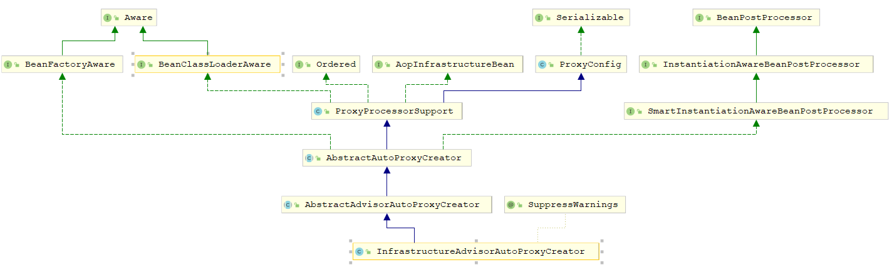

## JDBC

JDBC操作过程

~~~java
public void testPreparedStatement() {
    Connection connection = null; 
    PreparedStatement statement = null;
    List<User> list = new ArrayList<>();
    ResultSet rs = null;
    try {
        // 1、加载驱动类
        Class.forName("com.mysql.cj.jdbc.Driver");
        // 2、建立连接
        connection = DriverManager.getConnection(url,userName,password);
        // 3、创建语句集
        String sql = "select * from t_user where user_id = ?";
        statement = connection.prepareStatement(sql); 
        statement.setInt(1,2); // 设置参数
        // 4、执行语句集
        rs = statement.executeQuery();
        while (rs.next()) {
            // 5、获取结果集
            User user = new User();
            user.setUserId(rs.getInt("user_id"));
            user.setUserName(rs.getString("user_name"));
            user.setAge(rs.getInt("age"));
            user.setUserAddr(rs.getString("user_addr"));
            list.add(user);
        } 
        log.info("List:{}",list); 
    } catch (ClassNotFoundException e) {
        log.error(e.getMessage(),e);
    } catch (SQLException e) {
        log.error(e.getMessage(),e);
    } finally {
        // 6、关闭结果集、关闭语句集、关闭连接
        try { 
            if (Objects.nonNull(connection)) {
                connection.close();
            } 
            if (Objects.nonNull(statement)) {
                statement.close();
            } 
            if (Objects.nonNull(rs)) {
                rs.close();
            }
        } catch (SQLException e) {
            log.error(e.getMessage(),e);
        } 
    }
}
~~~

JDBC虽然操作简单，易于理解；但是操作过于繁琐，工作量大；需要连接，然后处理jdbc底层事务，处理数据类型，还需要操作Connection，Statement对象和ResultSet对象去拿数据并关闭；很难进行关联，忘记关闭Connection导致的异常很难定位，由于这些缺陷，在实际工作中我们很少直接使用jdbc进行编程

## JdbcTemplate

为了简化JDBC的操作过程，避免忘记关闭连接等常见错误；Spring对JDBC进行了封装，使JDBC更加易于使用。JdbcTemplate是Spring-JDBC的核心，运行核心的JDBC工作流，而我们只需要提供SQL语句和提取结果 

配置信息，首先需要设置数据源dataSource

~~~xml
<bean id="dataSource" class="com.alibaba.druid.pool.DruidDataSource"
      init-method="init" destroy-method="close">
    <property name="url">
        <value>${jdbc.url}</value>
    </property>
    <property name="username">
        <value>${jdbc.username}</value>
    </property>
    <property name="password">
        <value>${jdbc.password}</value>
    </property>
    <property name="initialSize">
        <value>${jdbc.initialSize}</value>
    </property>
    <property name="maxActive">
        <value>${jdbc.maxActive}</value>
    </property>
</bean>
~~~

JdbcTemplate执行

~~~java
@Slf4j
@RunWith(SpringJUnit4ClassRunner.class)
@ContextConfiguration(locations = "classpath:spring/spring-jdbc.xml")
public class SpringJdbcTest {
	// 注入数据源
    @Autowired
    private DataSource dataSource; 

    @Test
    public void jdbcTest() {
        String sql = "select * from t_user";
        // 创建 JdbcTemplate 对象
        JdbcTemplate jdbcTemplate = new JdbcTemplate(dataSource);
        List<User> list = jdbcTemplate.query(sql,new UserRowMapper());
        log.info("list:{}",list);
    }
}
~~~

### 核心方法excute

~~~java
// 普通Statement
public <T> T execute(StatementCallback<T> action) throws DataAccessException {
    Assert.notNull(action, "Callback object must not be null");
	// 获取数据库连接
    Connection con = DataSourceUtils.getConnection(obtainDataSource());
    Statement stmt = null;
    try {
        stmt = con.createStatement();
        applyStatementSettings(stmt);
        T result = action.doInStatement(stmt);
        handleWarnings(stmt);
        return result;
    }
    catch (SQLException ex) {
        // Release Connection early, to avoid potential connection pool deadlock
        // in the case when the exception translator hasn't been initialized yet.
        String sql = getSql(action);
        JdbcUtils.closeStatement(stmt);
        stmt = null;
        DataSourceUtils.releaseConnection(con, getDataSource());
        con = null;
        throw translateException("StatementCallback", sql, ex);
    }
    finally {
        JdbcUtils.closeStatement(stmt);
        DataSourceUtils.releaseConnection(con, getDataSource());
    }
}
// PreparedStatement
public <T> T execute(PreparedStatementCreator psc, PreparedStatementCallback<T> action)
    throws DataAccessException {

    Assert.notNull(psc, "PreparedStatementCreator must not be null");
    Assert.notNull(action, "Callback object must not be null");
    if (logger.isDebugEnabled()) {
        String sql = getSql(psc);
        logger.debug("Executing prepared SQL statement" + (sql != null ? " [" + sql + "]" : ""));
    }
	// 获取数据库连接
    Connection con = DataSourceUtils.getConnection(obtainDataSource());
    PreparedStatement ps = null;
    try {
        // 创建PreparedStatement 
        ps = psc.createPreparedStatement(con); 
        // 设置参数, 最大行数,超时时间
        applyStatementSettings(ps);
        // 调用回调函数
        T result = action.doInPreparedStatement(ps);
        // 警告处理
        handleWarnings(ps);
        return result;
    }
    catch (SQLException ex) {
        // Release Connection early, to avoid potential connection pool deadlock
        // in the case when the exception translator hasn't been initialized yet.
        if (psc instanceof ParameterDisposer) {
            ((ParameterDisposer) psc).cleanupParameters();
        }
        String sql = getSql(psc);
        psc = null;
        JdbcUtils.closeStatement(ps);
        ps = null;
        DataSourceUtils.releaseConnection(con, getDataSource());
        con = null;
        throw translateException("PreparedStatementCallback", sql, ex);
    }
    finally {
        // 清除参数,关闭Statement,关闭连接
        if (psc instanceof ParameterDisposer) {
            ((ParameterDisposer) psc).cleanupParameters();
        }
        JdbcUtils.closeStatement(ps);
        DataSourceUtils.releaseConnection(con, getDataSource());
    }
}
~~~

#### 获取数据库连接

~~~java
public abstract class DataSourceUtils {
    public static Connection getConnection(DataSource dataSource) throws CannotGetJdbcConnectionException {
		try {
			return doGetConnection(dataSource);
		}// catch...  
	} 
    public static Connection doGetConnection(DataSource dataSource) throws SQLException {
		Assert.notNull(dataSource, "No DataSource specified");
		// 从当前线程获取绑定的 ConnectionHolder ,事务的传递性
		ConnectionHolder conHolder = 
            (ConnectionHolder) TransactionSynchronizationManager.getResource(dataSource);
		// 如果不为空，并且内部持有连接，直接返回此连接
		if (conHolder != null && (conHolder.hasConnection() || conHolder.isSynchronizedWithTransaction())) {
			// 计数加1,代表获取这个conHolder的次数
			conHolder.requested();
			if (!conHolder.hasConnection()) {
				logger.debug("Fetching resumed JDBC Connection from DataSource");
				conHolder.setConnection(fetchConnection(dataSource));
			}
			return conHolder.getConnection();
		}
		// Else we either got no holder or an empty thread-bound holder here.

		logger.debug("Fetching JDBC Connection from DataSource");
		// 直接从给定的数据源获取连接 Connection con = dataSource.getConnection();
		Connection con = fetchConnection(dataSource);
		// 如果事务同步开启， 开启了一个空事务
		if (TransactionSynchronizationManager.isSynchronizationActive()) {
			try {
				// Use same Connection for further JDBC actions within the transaction.
				// Thread-bound object will get removed by synchronization at transaction completion.
				ConnectionHolder holderToUse = conHolder;
				// 使用这个连接创建一个ConnectionHolder
				if (holderToUse == null) {
					holderToUse = new ConnectionHolder(con);
				}
				else {
					holderToUse.setConnection(con);
				}
				holderToUse.requested();
				// 注册一个TransactionSynchronization  
				TransactionSynchronizationManager.registerSynchronization(
						new ConnectionSynchronization(holderToUse, dataSource));
				holderToUse.setSynchronizedWithTransaction(true);
				if (holderToUse != conHolder) {
					// 将这个连接绑定到当前线程
					TransactionSynchronizationManager.bindResource(dataSource, holderToUse);
				}
			}
			catch (RuntimeException ex) {
				// Unexpected exception from external delegation call -> close Connection and rethrow.
				releaseConnection(con, dataSource);
				throw ex;
			}
		} 
		return con;
	}
}
~~~

#### 设置连接参数

~~~java
protected void applyStatementSettings(Statement stmt) throws SQLException {
    int fetchSize = getFetchSize();
    if (fetchSize != -1) {
        stmt.setFetchSize(fetchSize);
    }
    // 设置最大行数
    int maxRows = getMaxRows();
    if (maxRows != -1) {
        stmt.setMaxRows(maxRows);
    }
    // 设置超时时间
    DataSourceUtils.applyTimeout(stmt, getDataSource(), getQueryTimeout());
}
~~~

#### 调用回调函数

参数action实现了PreparedStatementCallback<T> 接口，通过调用`T result = action.doInPreparedStatement(ps)`使Spring JDBC实现不同的操作

#### 警告处理

~~~java
protected void handleWarnings(Statement stmt) throws SQLException {
    // 设置为忽略时,打印日志
    if (isIgnoreWarnings()) {
        if (logger.isDebugEnabled()) {
            SQLWarning warningToLog = stmt.getWarnings();
            while (warningToLog != null) {
                logger.debug("SQLWarning ignored: SQL state '"+warningToLog.getSQLState()+"', error code '" 
                          + warningToLog.getErrorCode() + "', message [" + warningToLog.getMessage() + "]");
                warningToLog = warningToLog.getNextWarning();
            }
        }
    } else {
        // 抛出警告
        handleWarnings(stmt.getWarnings());
    }
}
~~~

#### 释放连接

~~~java
public abstract class DataSourceUtils {
    public static void releaseConnection(@Nullable Connection con, @Nullable DataSource dataSource) {
		try {
			doReleaseConnection(con, dataSource);
		}// catch...   
	}
    public static void doReleaseConnection(@Nullable Connection con, @Nullable DataSource dataSource) 
        throws SQLException {
		if (con == null) {
			return;
		}
		if (dataSource != null) {
			// 从当前线程获取绑定的 ConnectionHolder ,事务的传递性
			ConnectionHolder conHolder = 
                (ConnectionHolder) TransactionSynchronizationManager.getResource(dataSource);
			// 使用相同的连接,事务还没执行完 计数减一
			if (conHolder != null && connectionEquals(conHolder, con)) {
				// It's the transactional Connection: Don't close it.
				// 连接计数减一 而不是释放连接
				conHolder.released();
				return;
			}
		}
		//  事务执行完毕,释放连接 con.close()
		doCloseConnection(con, dataSource);
	}
    
}
~~~

### update

~~~java
protected int update(final PreparedStatementCreator psc, @Nullable final PreparedStatementSetter pss)
    throws DataAccessException {

    logger.debug("Executing prepared SQL update");
	// public <T> T execute(PreparedStatementCreator psc, PreparedStatementCallback<T> action)
    // excute 方法中会调用 ps = psc.createPreparedStatement(con); 创建PreparedStatement
    // 然后调用回调函数,调用 T result = action.doInPreparedStatement(ps);
    return updateCount(execute(psc, ps -> { // 这里使用了Lambda表达式
        try {
            if (pss != null) {
                // 设置PreparedStatement所需的参数
                pss.setValues(ps);
            }
            int rows = ps.executeUpdate();
            if (logger.isTraceEnabled()) {
                logger.trace("SQL update affected " + rows + " rows");
            }
            return rows;
        } finally {
            if (pss instanceof ParameterDisposer) {
                ((ParameterDisposer) pss).cleanupParameters();
            }
        }
    }));
}

//  PreparedStatementCallback<T> 接口
public interface PreparedStatementCallback<T> { 
	@Nullable
	T doInPreparedStatement(PreparedStatement ps) throws SQLException, DataAccessException; 
}
~~~

**参数**

~~~java
public class ArgumentPreparedStatementSetter implements PreparedStatementSetter, ParameterDisposer {
	// 参数数组
	@Nullable
	private final Object[] args; 
	public ArgumentPreparedStatementSetter(@Nullable Object[] args) {
		this.args = args;
	}

	@Override
	public void setValues(PreparedStatement ps) throws SQLException {
		if (this.args != null) {
            // 遍历数组,然后向PreparedStatement注入参数
			for (int i = 0; i < this.args.length; i++) {
				Object arg = this.args[i];
				doSetValue(ps, i + 1, arg);
			}
		}
	} 
    // 参数赋值
	protected void doSetValue(PreparedStatement ps, int parameterPosition, Object argValue) 
        throws SQLException {
		if (argValue instanceof SqlParameterValue) {
			SqlParameterValue paramValue = (SqlParameterValue) argValue;
			StatementCreatorUtils.setParameterValue(ps, parameterPosition, 
                                                    paramValue, paramValue.getValue());
		} else {
            // 没有设置参数类型 SqlTypeValue.TYPE_UNKNOWN
            // 先判断String ps.setString,然后判断时间和日期 ps.setTimestamp,最后ps.setObject
			StatementCreatorUtils.setParameterValue(ps, parameterPosition, 
                                                    SqlTypeValue.TYPE_UNKNOWN, argValue);
		}
	}

	@Override
	public void cleanupParameters() {
		StatementCreatorUtils.cleanupParameters(this.args);
	} 
} 
~~~

### query

基本流程和update一致

~~~java
public <T> List<T> queryForList(String sql, Object[] args, int[] argTypes, Class<T> elementType) 
    throws DataAccessException {
    return query(sql, args, argTypes, getSingleColumnRowMapper(elementType));
} 
public <T> List<T> query(String sql, Object[] args, int[] argTypes, RowMapper<T> rowMapper) 
    throws DataAccessException {
    return result(query(sql, args, argTypes, new RowMapperResultSetExtractor<>(rowMapper)));
}
public <T> T query(String sql, Object[] args, int[] argTypes, ResultSetExtractor<T> rse) 
    throws DataAccessException {
    return query(sql, newArgTypePreparedStatementSetter(args, argTypes), rse);
}
public <T> T query(String sql, @Nullable PreparedStatementSetter pss, ResultSetExtractor<T> rse) 
    throws DataAccessException {
    return query(new SimplePreparedStatementCreator(sql), pss, rse);
}
// 最终调用
public <T> T query( PreparedStatementCreator psc, @Nullable final PreparedStatementSetter pss, 
    final ResultSetExtractor<T> rse) throws DataAccessException { 
    Assert.notNull(rse, "ResultSetExtractor must not be null");
    logger.debug("Executing prepared SQL query");
	// public <T> T execute(PreparedStatementCreator psc, PreparedStatementCallback<T> action) 
    // excute 方法中会调用 ps = psc.createPreparedStatement(con); 创建PreparedStatement
    // 然后调用回调函数,调用 T result = action.doInPreparedStatement(ps);
    return execute(psc, new PreparedStatementCallback<T>() {
        @Override
        @Nullable
        public T doInPreparedStatement(PreparedStatement ps) throws SQLException {
            ResultSet rs = null;
            try {
                if (pss != null) {
                    // 设置PreparedStatement所需的参数
                    pss.setValues(ps);
                }
                // 执行executeQuery
                rs = ps.executeQuery();
                // 处理结果集
                return rse.extractData(rs);
            }
            finally {
                JdbcUtils.closeResultSet(rs);
                if (pss instanceof ParameterDisposer) {
                    ((ParameterDisposer) pss).cleanupParameters();
                }
            }
        }
    });
}
~~~

**处理结果集**

~~~java
@Override
public List<T> extractData(ResultSet rs) throws SQLException {
    // 创建list
    List<T> results = (this.rowsExpected > 0 ? new ArrayList<>(this.rowsExpected) : new ArrayList<>());
    int rowNum = 0;
    // 遍历 获取结果集
    while (rs.next()) {
        results.add(this.rowMapper.mapRow(rs, rowNum++));
    }
    return results;
}
~~~

## spring-tx

~~~xml
<!-- 注解驱动 -->
<tx:annotation-driven  transaction-manager="transactionManager"/>
<!-- 配置事务管理器 -->
<bean id="transactionManager"
      class="org.springframework.jdbc.datasource.DataSourceTransactionManager">
    <property name="dataSource" ref="dataSource"/>
</bean> 
~~~

Spring 解析扩展元素解析BeanDefinition时，会解析到事务相关的标签，TxNamespaceHandler基于Spring实现命名空间处理的扩展 

~~~java
public class TxNamespaceHandler extends NamespaceHandlerSupport { 
	@Override
	public void init() {
		registerBeanDefinitionParser("advice", new TxAdviceBeanDefinitionParser());
		registerBeanDefinitionParser("annotation-driven", new AnnotationDrivenBeanDefinitionParser());
		registerBeanDefinitionParser("jta-transaction-manager", 
                                     new JtaTransactionManagerBeanDefinitionParser());
	} 
}
~~~

### 解析

#### tx:advice

~~~xml
<!-- AOP 拦截 -->
<aop:config>
    <aop:pointcut expression="execution(public * com.qinfengsa.spring.service..*Service.*(..))"
                  id="transactionPointcut"/>
    <aop:advisor pointcut-ref="transactionPointcut" advice-ref="transactionAdvice"/>
</aop:config>
<!-- 事务控制配置,需要和AOP 配合使用 -->
<tx:advice id="transactionAdvice" transaction-manager="transactionManager">
    <tx:attributes>
        <tx:method name="get*" propagation="SUPPORTS" isolation="DEFAULT"  read-only="true" />
        <tx:method name="list*" propagation="SUPPORTS" isolation="DEFAULT"  read-only="true" />
        <tx:method name="count*" propagation="SUPPORTS" isolation="DEFAULT"  read-only="true" />
        <tx:method name="save*" propagation="REQUIRED"
                   rollback-for="Exception,RuntimeException,SQLException"/>
        <tx:method name="remove*" propagation="REQUIRED"
                   rollback-for="Exception,RuntimeException,SQLException"/>
        <tx:method name="update*" propagation="REQUIRED"
                   rollback-for="Exception,RuntimeException,SQLException"/>
    </tx:attributes>
</tx:advice> 
~~~

解析

~~~java
class TxAdviceBeanDefinitionParser extends AbstractSingleBeanDefinitionParser {
    
    @Override
	protected void doParse(Element element, ParserContext parserContext, BeanDefinitionBuilder builder) {
		// 添加 transactionManager 属性
		builder.addPropertyReference("transactionManager", 
                                     TxNamespaceHandler.getTransactionManagerName(element));
		// 获取 attributes 属性
		List<Element> txAttributes = DomUtils.getChildElementsByTagName(element, ATTRIBUTES_ELEMENT);
		if (txAttributes.size() > 1) {
			parserContext.getReaderContext().error(
					"Element <attributes> is allowed at most once inside element <advice>", element);
		}
		else if (txAttributes.size() == 1) {
			// Using attributes source.
			Element attributeSourceElement = txAttributes.get(0);
			// 解析 attributes
			RootBeanDefinition attributeSourceDefinition = 
                parseAttributeSource(attributeSourceElement, parserContext);
			builder.addPropertyValue("transactionAttributeSource", attributeSourceDefinition);
		} else {
			// Assume annotations source.
			builder.addPropertyValue("transactionAttributeSource",  new  RootBeanDefinition(                 
                "org.springframework.transaction.annotation.AnnotationTransactionAttributeSource"));
		}
	}
    
    private RootBeanDefinition parseAttributeSource(Element attrEle, ParserContext parserContext) {
		// 获取attributes的子结点 <tx:method>
		List<Element> methods = DomUtils.getChildElementsByTagName(attrEle, METHOD_ELEMENT);
		ManagedMap<TypedStringValue, RuleBasedTransactionAttribute> transactionAttributeMap =
				new ManagedMap<>(methods.size());
		transactionAttributeMap.setSource(parserContext.extractSource(attrEle));
		// 遍历 methods
		for (Element methodEle : methods) {
			// 获取 name 方法名的匹配模式，用作key
			String name = methodEle.getAttribute(METHOD_NAME_ATTRIBUTE);
			TypedStringValue nameHolder = new TypedStringValue(name);
			nameHolder.setSource(parserContext.extractSource(methodEle));
			// 创建RuleBasedTransactionAttribute 记录 事务信息
			RuleBasedTransactionAttribute attribute = new RuleBasedTransactionAttribute();
			String propagation = methodEle.getAttribute(PROPAGATION_ATTRIBUTE);
			String isolation = methodEle.getAttribute(ISOLATION_ATTRIBUTE);
			String timeout = methodEle.getAttribute(TIMEOUT_ATTRIBUTE);
			String readOnly = methodEle.getAttribute(READ_ONLY_ATTRIBUTE);
			if (StringUtils.hasText(propagation)) {
				attribute.setPropagationBehaviorName(RuleBasedTransactionAttribute.PREFIX_PROPAGATION 
                                                     + propagation);
			}
			if (StringUtils.hasText(isolation)) {
				attribute.setIsolationLevelName(RuleBasedTransactionAttribute.PREFIX_ISOLATION + isolation);
			}
			if (StringUtils.hasText(timeout)) {
				try {
					attribute.setTimeout(Integer.parseInt(timeout));
				}
				catch (NumberFormatException ex) {
					parserContext.getReaderContext()
                        .error("Timeout must be an integer value: [" + timeout + "]", methodEle);
				}
			}
			if (StringUtils.hasText(readOnly)) {
				attribute.setReadOnly(Boolean.parseBoolean(methodEle.getAttribute(READ_ONLY_ATTRIBUTE)));
			}

			List<RollbackRuleAttribute> rollbackRules = new LinkedList<>();
			if (methodEle.hasAttribute(ROLLBACK_FOR_ATTRIBUTE)) {
				String rollbackForValue = methodEle.getAttribute(ROLLBACK_FOR_ATTRIBUTE);
				addRollbackRuleAttributesTo(rollbackRules,rollbackForValue);
			}
			if (methodEle.hasAttribute(NO_ROLLBACK_FOR_ATTRIBUTE)) {
				String noRollbackForValue = methodEle.getAttribute(NO_ROLLBACK_FOR_ATTRIBUTE);
				addNoRollbackRuleAttributesTo(rollbackRules,noRollbackForValue);
			}
			attribute.setRollbackRules(rollbackRules);
			// 添加映射,通过 方法名的匹配模式 找到 事务信息
			transactionAttributeMap.put(nameHolder, attribute);
		}
		// 创建NameMatchTransactionAttributeSource的BeanDefinition
		RootBeanDefinition attributeSourceDefinition = 
            new RootBeanDefinition(NameMatchTransactionAttributeSource.class);
		attributeSourceDefinition.setSource(parserContext.extractSource(attrEle));
		attributeSourceDefinition.getPropertyValues().add("nameMap", transactionAttributeMap);
		return attributeSourceDefinition;
	}
}
~~~

#### tx:annotation-driven

~~~java
class AnnotationDrivenBeanDefinitionParser implements BeanDefinitionParser { 
	@Override
	@Nullable
	public BeanDefinition parse(Element element, ParserContext parserContext) {
		// 注册一个  TransactionalEventListenerFactory, 负责创建监听器
		registerTransactionalEventListenerFactory(parserContext);
		String mode = element.getAttribute("mode");
		if ("aspectj".equals(mode)) {
			// mode="aspectj"  使用 AspectJ (编译时增强) 控制事务
			registerTransactionAspect(element, parserContext);
			if (ClassUtils.isPresent("javax.transaction.Transactional", getClass().getClassLoader())) {
				registerJtaTransactionAspect(element, parserContext);
			}
		} else {
			// mode="proxy" 使用代理（运行时增强）控制事务
			AopAutoProxyConfigurer.configureAutoProxyCreator(element, parserContext);
		}
		return null;
	}
    // 内部类
    private static class AopAutoProxyConfigurer {

		public static void configureAutoProxyCreator(Element element, ParserContext parserContext) {
			// 注册代理生成器 与aop模块类似，最终注册 BeanDefinition
            // beanClass InfrastructureAdvisorAutoProxyCreator，
			AopNamespaceUtils.registerAutoProxyCreatorIfNecessary(parserContext, element);

			String txAdvisorBeanName = TransactionManagementConfigUtils.TRANSACTION_ADVISOR_BEAN_NAME;
			if (!parserContext.getRegistry().containsBeanDefinition(txAdvisorBeanName)) {
				Object eleSource = parserContext.extractSource(element);

				// Create the TransactionAttributeSource definition.
				// 创建AnnotationTransactionAttributeSource的BeanDefinition
				RootBeanDefinition sourceDef = new RootBeanDefinition(
						"org.springframework.transaction.annotation.AnnotationTransactionAttributeSource");
				sourceDef.setSource(eleSource);
				sourceDef.setRole(BeanDefinition.ROLE_INFRASTRUCTURE);
				String sourceName = parserContext.getReaderContext().registerWithGeneratedName(sourceDef);

				// Create the TransactionInterceptor definition.
				// 拦截器 创建TransactionInterceptor的BeanDefinition
				RootBeanDefinition interceptorDef = new RootBeanDefinition(TransactionInterceptor.class);
				interceptorDef.setSource(eleSource);
				interceptorDef.setRole(BeanDefinition.ROLE_INFRASTRUCTURE);
				// 注册事务管理器 interceptorDef添加属性
				registerTransactionManager(element, interceptorDef);
				interceptorDef.getPropertyValues().add("transactionAttributeSource", 
                                                       new RuntimeBeanReference(sourceName));
				String interceptorName = 
                    parserContext.getReaderContext().registerWithGeneratedName(interceptorDef);

				// Create the TransactionAttributeSourceAdvisor definition.
				// 通知器 创建BeanFactoryTransactionAttributeSourceAdvisor的BeanDefinition
				RootBeanDefinition advisorDef = 
                    new RootBeanDefinition(BeanFactoryTransactionAttributeSourceAdvisor.class);
				advisorDef.setSource(eleSource);
				advisorDef.setRole(BeanDefinition.ROLE_INFRASTRUCTURE);
				advisorDef.getPropertyValues().add("transactionAttributeSource", 
                                                   new RuntimeBeanReference(sourceName));
				advisorDef.getPropertyValues().add("adviceBeanName", interceptorName);
				// 设置order
				if (element.hasAttribute("order")) {
					advisorDef.getPropertyValues().add("order", element.getAttribute("order"));
				}
				parserContext.getRegistry().registerBeanDefinition(txAdvisorBeanName, advisorDef);

				CompositeComponentDefinition compositeDef = 
                    new CompositeComponentDefinition(element.getTagName(), eleSource);
				compositeDef.addNestedComponent(new BeanComponentDefinition(sourceDef, sourceName));
				compositeDef.addNestedComponent(
                    new BeanComponentDefinition(interceptorDef, interceptorName));
				compositeDef.addNestedComponent(new BeanComponentDefinition(advisorDef, txAdvisorBeanName));
				parserContext.registerComponent(compositeDef);
			}
		}
	}
}
~~~

### 代理子类生成

与aop模块类似，InfrastructureAdvisorAutoProxyCreator继承了AbstractAutoProxyCreator，会在初始化后创建代理对象

~~~java
@Override
public Object postProcessAfterInitialization(@Nullable Object bean, String beanName) {
    if (bean != null) {
        Object cacheKey = getCacheKey(bean.getClass(), beanName);
        // 判断是否已经提前暴露
        if (this.earlyProxyReferences.remove(cacheKey) != bean) {
            // 如果没有被代理过则代理
            return wrapIfNecessary(bean, beanName, cacheKey);
        }
    }
    return bean;
} 

protected Object wrapIfNecessary(Object bean, String beanName, Object cacheKey) {
    // targetSourcedBeans包含beanName，说明前面创建过
    if (StringUtils.hasLength(beanName) && this.targetSourcedBeans.contains(beanName)) {
        return bean;
    }
    if (Boolean.FALSE.equals(this.advisedBeans.get(cacheKey))) {
        return bean;
    }
    if (isInfrastructureClass(bean.getClass()) || shouldSkip(bean.getClass(), beanName)) {
        this.advisedBeans.put(cacheKey, Boolean.FALSE);
        return bean;
    }

    // 获取这个bean 的advice通知器
    Object[] specificInterceptors = getAdvicesAndAdvisorsForBean(bean.getClass(), beanName, null);
    if (specificInterceptors != DO_NOT_PROXY) {
        this.advisedBeans.put(cacheKey, Boolean.TRUE);
        // 创建代理对象
        Object proxy = createProxy(
            bean.getClass(), beanName, specificInterceptors, new SingletonTargetSource(bean));
        this.proxyTypes.put(cacheKey, proxy.getClass());
        return proxy;
    }

    this.advisedBeans.put(cacheKey, Boolean.FALSE);
    return bean;
} 
~~~

### TransactionInterceptor

之前创建了`TransactionInterceptor`的BeanDefinition，所有方法调用时会进入AOP中调用拦截器的invoke方法

~~~java
public class TransactionInterceptor extends TransactionAspectSupport 
    implements MethodInterceptor, Serializable {
    // invoke
    public Object invoke(MethodInvocation invocation) throws Throwable { 
		Class<?> targetClass = (invocation.getThis() != null ? 
                                AopUtils.getTargetClass(invocation.getThis()) : null); 
        // 调用父类的方法
		return invokeWithinTransaction(invocation.getMethod(), targetClass, invocation::proceed);
	}
}
~~~

调用父类的invokeWithinTransaction方法

~~~java
public abstract class TransactionAspectSupport implements BeanFactoryAware, InitializingBean {
    @Nullable
	protected Object invokeWithinTransaction(Method method, @Nullable Class<?> targetClass,
			final InvocationCallback invocation) throws Throwable {

		// If the transaction attribute is null, the method is non-transactional.
		// 获取对应事务的属性
		TransactionAttributeSource tas = getTransactionAttributeSource();
		final TransactionAttribute txAttr = (tas != null ? 
                                             tas.getTransactionAttribute(method, targetClass) : null);
		// 事务管理器
		final TransactionManager tm = determineTransactionManager(txAttr);
		// 响应式/反应式事务管理 用于支持MongoDB 等数据库
		if (this.reactiveAdapterRegistry != null && tm instanceof ReactiveTransactionManager) {
			ReactiveTransactionSupport txSupport = this.transactionSupportCache.computeIfAbsent(method, 
                 key -> {
				if (KotlinDetector.isKotlinType(method.getDeclaringClass()) && 
                    KotlinDelegate.isSuspend(method)) {
					throw new TransactionUsageException(
							"Unsupported annotated transaction on suspending function detected: " + method +
							". Use TransactionalOperator.transactional extensions instead.");
				}
				ReactiveAdapter adapter = this.reactiveAdapterRegistry.getAdapter(method.getReturnType());
				if (adapter == null) {
					throw new IllegalStateException( );
				}
				return new ReactiveTransactionSupport(adapter);
			});
			return txSupport.invokeWithinTransaction(
					method, targetClass, invocation, txAttr, (ReactiveTransactionManager) tm);
		}
		// 事务管理器
		PlatformTransactionManager ptm = asPlatformTransactionManager(tm);
		// 得到方法名
		final String joinpointIdentification = methodIdentification(method, targetClass, txAttr); 
		if (txAttr == null || !(ptm instanceof CallbackPreferringPlatformTransactionManager)) {
			// Standard transaction demarcation with getTransaction and commit/rollback calls.
			// 看是否有必要开启一个事务,根据事务传播行为,做出相应的判断
			TransactionInfo txInfo = createTransactionIfNecessary(ptm, txAttr, joinpointIdentification);

			Object retVal;
			try {
				// This is an around advice: Invoke the next interceptor in the chain.
				// This will normally result in a target object being invoked.
				// 回调方法执行
				retVal = invocation.proceedWithInvocation();
			}
			catch (Throwable ex) {
				// target invocation exception
				// 异常回滚
				completeTransactionAfterThrowing(txInfo, ex);
				throw ex;
			}
			finally {
				// 清除信息
				cleanupTransactionInfo(txInfo);
			}

			if (vavrPresent && VavrDelegate.isVavrTry(retVal)) {
				// Set rollback-only in case of Vavr failure matching our rollback rules...
				TransactionStatus status = txInfo.getTransactionStatus();
				if (status != null && txAttr != null) {
					retVal = VavrDelegate.evaluateTryFailure(retVal, txAttr, status);
				}
			}
			// 提交事务
			commitTransactionAfterReturning(txInfo);
			return retVal;
		}
		// 编程式事务 
		else {
			final ThrowableHolder throwableHolder = new ThrowableHolder();

			// It's a CallbackPreferringPlatformTransactionManager: pass a TransactionCallback in.
			try {
				Object result = ((CallbackPreferringPlatformTransactionManager) ptm).execute(txAttr, 
                         status -> {
					TransactionInfo txInfo = prepareTransactionInfo(ptm, txAttr, 
                                                                    joinpointIdentification, status);
					try {
						Object retVal = invocation.proceedWithInvocation();
						if (vavrPresent && VavrDelegate.isVavrTry(retVal)) {
							// Set rollback-only in case of Vavr failure matching our rollback rules...
							retVal = VavrDelegate.evaluateTryFailure(retVal, txAttr, status);
						}
						return retVal;
					}
					catch (Throwable ex) {
						if (txAttr.rollbackOn(ex)) {
							// A RuntimeException: will lead to a rollback.
							if (ex instanceof RuntimeException) {
								throw (RuntimeException) ex;
							}
							else {
								throw new ThrowableHolderException(ex);
							}
						}
						else {
							// A normal return value: will lead to a commit.
							throwableHolder.throwable = ex;
							return null;
						}
					}
					finally {
						cleanupTransactionInfo(txInfo);
					}
				});

				// Check result state: It might indicate a Throwable to rethrow.
				if (throwableHolder.throwable != null) {
					throw throwableHolder.throwable;
				}
				return result;
			} // catch ..
		}
	}
}
~~~

#### 事务管理器

获取事务管理器

~~~Java
public abstract class TransactionAspectSupport implements BeanFactoryAware, InitializingBean {
	@Nullable
	protected TransactionManager determineTransactionManager(@Nullable TransactionAttribute txAttr) {
		// Do not attempt to lookup tx manager if no tx attributes are set
		// 如果没有事务属性, 返回 this.transactionManager
		if (txAttr == null || this.beanFactory == null) {
			return getTransactionManager();
		}

		String qualifier = txAttr.getQualifier();

		if (StringUtils.hasText(qualifier)) {
			// 从transactionManagerCache获取事务管理器
			return determineQualifiedTransactionManager(this.beanFactory, qualifier);
		}
		else if (StringUtils.hasText(this.transactionManagerBeanName)) {
			return determineQualifiedTransactionManager(this.beanFactory, this.transactionManagerBeanName);
		}
		else {
			TransactionManager defaultTransactionManager = getTransactionManager();
			if (defaultTransactionManager == null) {
				// 先去缓存中取
				defaultTransactionManager = 
                    this.transactionManagerCache.get(DEFAULT_TRANSACTION_MANAGER_KEY);
				if (defaultTransactionManager == null) {
					// 通过getBean 创建 TransactionManager,然后放入缓存
					defaultTransactionManager = this.beanFactory.getBean(TransactionManager.class);
					this.transactionManagerCache.putIfAbsent(
							DEFAULT_TRANSACTION_MANAGER_KEY, defaultTransactionManager);
				}
			}
			return defaultTransactionManager;
		}
	}
}
~~~

##### 事务传播属性

| 常量名称                  | 传播行为                                                     |
| ------------------------- | ------------------------------------------------------------ |
| PROPAGATION_REQUIRED      | 如果当前没有事务，就新建一个事务，如果已经存在一个事务中，加入到这个事务中；Spring默认的事务传播 |
| PROPAGATION_SUPPORTS      | 支持当前事务，如果当前没有事务，就以非事务方式执行           |
| PROPAGATION_MANDATORY     | 支持当前事务，如果当前没有事务，就抛出异常                   |
| PROPAGATION_REQUIRES_NEW  | 新建事务，如果当前存在事务，把当前事务挂起                   |
| PROPAGATION_NOT_SUPPORTED | 以非事务方式执行，如果当前存在事务，就把当前事务挂起         |
| PROPAGATION_NEVER         | 以非事务方式执行，如果当前存在事务，则抛出异常               |
| PROPAGATION_NESTED        | 如果当前存在事务，则在嵌套事务内执行；否则按REQUIRED属性执行；它使用了一个单独的事务，这个事务拥有多个可以回滚的保护点。内部事务的回滚不会对外部事务造成影响。它只对DataSourceTransactionManager 事务管理器起效。 |

#### 事务开启

~~~java
protected TransactionInfo createTransactionIfNecessary(@Nullable PlatformTransactionManager tm,
    @Nullable TransactionAttribute txAttr, final String joinpointIdentification) { 
    // If no name specified, apply method identification as transaction name.
    if (txAttr != null && txAttr.getName() == null) {
        txAttr = new DelegatingTransactionAttribute(txAttr) {
            @Override
            public String getName() {
                return joinpointIdentification;
            }
        };
    }
    // 事务状态
    TransactionStatus status = null;
    if (txAttr != null) {
        if (tm != null) {
            // 获取事务状态
            status = tm.getTransaction(txAttr);
        } else {  }
    }
    // 把当前事务信息绑定到当前线程
    return prepareTransactionInfo(tm, txAttr, joinpointIdentification, status);
}
~~~

获取事务状态

~~~java
public abstract class AbstractPlatformTransactionManager implements PlatformTransactionManager,Serializable {	
	@Override
	public final TransactionStatus getTransaction(@Nullable TransactionDefinition definition)
			throws TransactionException {

		// Use defaults if no transaction definition given.
		TransactionDefinition def = (definition != null ? definition : TransactionDefinition.withDefaults());
		// 获取事务,模板方法交给子类
		Object transaction = doGetTransaction();
		boolean debugEnabled = logger.isDebugEnabled();
		// 判断当前事务是否存在
		if (isExistingTransaction(transaction)) {
			// Existing transaction found -> check propagation behavior to find out how to behave.
			// 处理存在的事务
			return handleExistingTransaction(def, transaction, debugEnabled);
		}

		// Check definition settings for new transaction.
		// 超时
		if (def.getTimeout() < TransactionDefinition.TIMEOUT_DEFAULT) {
			throw new InvalidTimeoutException("Invalid transaction timeout", def.getTimeout());
		}

		// No existing transaction found -> check propagation behavior to find out how to proceed.
		// 前面的代码没有找到事务,设置了PROPAGATION_MANDATORY
		// PROPAGATION_MANDATORY  支持当前事务，如果当前没有事务，就抛出异常
		if (def.getPropagationBehavior() == TransactionDefinition.PROPAGATION_MANDATORY) {
			throw new IllegalTransactionStateException(
					"No existing transaction found for transaction marked with propagation 'mandatory'");
		}
		// 前面的代码没有找到事务, 这3个传播行为需要新建事务
		else if (def.getPropagationBehavior() == TransactionDefinition.PROPAGATION_REQUIRED ||
				def.getPropagationBehavior() == TransactionDefinition.PROPAGATION_REQUIRES_NEW ||
				def.getPropagationBehavior() == TransactionDefinition.PROPAGATION_NESTED) {
			SuspendedResourcesHolder suspendedResources = suspend(null); 
			try {
				boolean newSynchronization = (getTransactionSynchronization() != SYNCHRONIZATION_NEVER);
				DefaultTransactionStatus status = newTransactionStatus(
						def, transaction, true, newSynchronization, debugEnabled, suspendedResources);
				// 开启新事务,子类实现
				doBegin(transaction, def);
				prepareSynchronization(status, def);
				return status;
			}
			catch (RuntimeException | Error ex) {
				resume(null, suspendedResources);
				throw ex;
			}
		}
		// PROPAGATION_SUPPORTS PROPAGATION_NOT_SUPPORTED PROPAGATION_NEVER
		// 前面的代码没有找到事务,以非事务状态运行
		else {
			// Create "empty" transaction: no actual transaction, but potentially synchronization.
			if (def.getIsolationLevel() != TransactionDefinition.ISOLATION_DEFAULT&&logger.isWarnEnabled()) {
				logger.warn("Custom isolation level specified but no actual transaction initiated; " +
						"isolation level will effectively be ignored: " + def);
			}
			boolean newSynchronization = (getTransactionSynchronization() == SYNCHRONIZATION_ALWAYS);
			return prepareTransactionStatus(def, null, true, newSynchronization, debugEnabled, null);
		}
	}
}
~~~

#####  获取当前事务

我们可以发现事务是和线程绑定的

~~~java
public class DataSourceTransactionManager extends AbstractPlatformTransactionManager
		implements ResourceTransactionManager, InitializingBean {
    
    @Override
	protected Object doGetTransaction() {
		DataSourceTransactionObject txObject = new DataSourceTransactionObject();
		txObject.setSavepointAllowed(isNestedTransactionAllowed());
		ConnectionHolder conHolder =
				(ConnectionHolder) TransactionSynchronizationManager.getResource(obtainDataSource());
		txObject.setConnectionHolder(conHolder, false);
		return txObject;
	}
}
public abstract class TransactionSynchronizationManager {
    // 事务保存在ThreadLocal的 map 对象中
	private static final ThreadLocal<Map<Object, Object>> resources =
			new NamedThreadLocal<>("Transactional resources");
	@Nullable
	private static Object doGetResource(Object actualKey) {
        // 从resources中获取事务的k-v
		Map<Object, Object> map = resources.get();
		if (map == null) {
			return null;
		}
		Object value = map.get(actualKey);
		// Transparently remove ResourceHolder that was marked as void...
		if (value instanceof ResourceHolder && ((ResourceHolder) value).isVoid()) {
			map.remove(actualKey);
			// Remove entire ThreadLocal if empty...
			if (map.isEmpty()) {
				resources.remove();
			}
			value = null;
		}
		return value;
	}
}
~~~

##### 处理存在事务

**判断事务是否存在**

~~~java
protected boolean isExistingTransaction(Object transaction) {
    DataSourceTransactionObject txObject = (DataSourceTransactionObject) transaction;
    // 首次开启事务 返回false,ConnectionHolder还未创建,
    return (txObject.hasConnectionHolder() && txObject.getConnectionHolder().isTransactionActive());
}
~~~

**处理**

~~~java
private TransactionStatus handleExistingTransaction(
    TransactionDefinition definition, Object transaction, boolean debugEnabled)
    throws TransactionException {
    // PROPAGATION_NEVER, 以非事务方式执行, 如果当前存在事务，则抛出异常
    if (definition.getPropagationBehavior() == TransactionDefinition.PROPAGATION_NEVER) {
        throw new IllegalTransactionStateException(
            "Existing transaction found for transaction marked with propagation 'never'");
    }
    // PROPAGATION_NOT_SUPPORTED 以非事务方式执行, 如果当前存在事务, 就把当前事务挂起
    if (definition.getPropagationBehavior() == TransactionDefinition.PROPAGATION_NOT_SUPPORTED) { 
        // 挂起当前事务
        Object suspendedResources = suspend(transaction);
        boolean newSynchronization = (getTransactionSynchronization() == SYNCHRONIZATION_ALWAYS);
        return prepareTransactionStatus(
            definition, null, false, newSynchronization, debugEnabled, suspendedResources);
    }
    // PROPAGATION_REQUIRES_NEW 新建事务, 如果当前存在事务, 把当前事务挂起
    if (definition.getPropagationBehavior() == TransactionDefinition.PROPAGATION_REQUIRES_NEW) { 
        // 先挂起当前事务
        SuspendedResourcesHolder suspendedResources = suspend(transaction);
        try {
            boolean newSynchronization = (getTransactionSynchronization() != SYNCHRONIZATION_NEVER);
            DefaultTransactionStatus status = newTransactionStatus(
                definition, transaction, true, newSynchronization, debugEnabled, suspendedResources);
            // 开启新事务,子类实现
            doBegin(transaction, definition);
            prepareSynchronization(status, definition);
            return status;
        }
        catch (RuntimeException | Error beginEx) {
            resumeAfterBeginException(transaction, suspendedResources, beginEx);
            throw beginEx;
        }
    }
    // 如果当前存在事务，则在嵌套事务内执行
    if (definition.getPropagationBehavior() == TransactionDefinition.PROPAGATION_NESTED) {
        if (!isNestedTransactionAllowed()) {
            // throw new NestedTransactionNotSupportedException( );
        } 
        if (useSavepointForNestedTransaction()) {
            // Create savepoint within existing Spring-managed transaction,
            // through the SavepointManager API implemented by TransactionStatus.
            // Usually uses JDBC 3.0 savepoints. Never activates Spring synchronization.
            DefaultTransactionStatus status =
                prepareTransactionStatus(definition, transaction, false, false, debugEnabled, null);
            status.createAndHoldSavepoint();
            return status;
        }
        else {
            // Nested transaction through nested begin and commit/rollback calls.
            // Usually only for JTA: Spring synchronization might get activated here
            // in case of a pre-existing JTA transaction.
            boolean newSynchronization = (getTransactionSynchronization() != SYNCHRONIZATION_NEVER);
            DefaultTransactionStatus status = newTransactionStatus(
                definition, transaction, true, newSynchronization, debugEnabled, null);
            // 开启新事务,子类实现
            doBegin(transaction, definition);
            prepareSynchronization(status, definition);
            return status;
        }
    }

    // Assumably PROPAGATION_SUPPORTS or PROPAGATION_REQUIRED.
    if (debugEnabled) {
        logger.debug("Participating in existing transaction");
    }
    if (isValidateExistingTransaction()) {
        if (definition.getIsolationLevel() != TransactionDefinition.ISOLATION_DEFAULT) {
            Integer currentIsolationLevel = TransactionSynchronizationManager
                .getCurrentTransactionIsolationLevel();
            if (currentIsolationLevel == null || currentIsolationLevel != definition.getIsolationLevel()) {
                Constants isoConstants = DefaultTransactionDefinition.constants;
                //throw new IllegalTransactionStateException( );
            }
        }
        if (!definition.isReadOnly()) {
            if (TransactionSynchronizationManager.isCurrentTransactionReadOnly()) {
               // throw new IllegalTransactionStateException( );
            }
        }
    }
    boolean newSynchronization = (getTransactionSynchronization() != SYNCHRONIZATION_NEVER);
    return prepareTransactionStatus(definition, transaction, false, newSynchronization, debugEnabled, null);
}
~~~

##### 开启新事务

~~~java
@Override
protected void doBegin(Object transaction, TransactionDefinition definition) {
    // 开启新事务
    DataSourceTransactionObject txObject = (DataSourceTransactionObject) transaction;
    Connection con = null; 
    try {
        if (!txObject.hasConnectionHolder() ||
            txObject.getConnectionHolder().isSynchronizedWithTransaction()) {
            // 从dataSource中获取一个Connection
            Connection newCon = obtainDataSource().getConnection();
            if (logger.isDebugEnabled()) {
                logger.debug("Acquired Connection [" + newCon + "] for JDBC transaction");
            }
            // 为当前Transaction设置ConnectionHolder
            txObject.setConnectionHolder(new ConnectionHolder(newCon), true);
        }

        txObject.getConnectionHolder().setSynchronizedWithTransaction(true);
        con = txObject.getConnectionHolder().getConnection();
        // 设置ReadOnly和隔离级别
        Integer previousIsolationLevel = DataSourceUtils.prepareConnectionForTransaction(con, definition);
        txObject.setPreviousIsolationLevel(previousIsolationLevel);
        txObject.setReadOnly(definition.isReadOnly());

        // Switch to manual commit if necessary. This is very expensive in some JDBC drivers,
        // so we don't want to do it unnecessarily (for example if we've explicitly
        // configured the connection pool to set it already).
        if (con.getAutoCommit()) {
            txObject.setMustRestoreAutoCommit(true);
            if (logger.isDebugEnabled()) {
                logger.debug("Switching JDBC Connection [" + con + "] to manual commit");
            }
            // 开启事务，设置autoCommit为false
            con.setAutoCommit(false);
        }

        prepareTransactionalConnection(con, definition);
        // 设置transactionActive为true,
        txObject.getConnectionHolder().setTransactionActive(true);

        int timeout = determineTimeout(definition);
        if (timeout != TransactionDefinition.TIMEOUT_DEFAULT) {
            txObject.getConnectionHolder().setTimeoutInSeconds(timeout);
        }

        // Bind the connection holder to the thread.
        if (txObject.isNewConnectionHolder()) {
            // 把事务绑定当前线程,放入ThreadLocal对象中
            TransactionSynchronizationManager.bindResource(obtainDataSource(), 
                                                           txObject.getConnectionHolder());
        }
    } catch (Throwable ex) {
        if (txObject.isNewConnectionHolder()) {
            DataSourceUtils.releaseConnection(con, obtainDataSource());
            txObject.setConnectionHolder(null, false);
        }
        throw new CannotCreateTransactionException("Could not open JDBC Connection for transaction", ex);
    }
}
~~~

#### 事务提交&回滚

提交操作，最终调用Connection的提交方法，基于JDBC封装

~~~java
protected void commitTransactionAfterReturning(TransactionInfo txInfo) {
    if (txInfo != null && txInfo.hasTransaction()) { 
        txInfo.getTransactionManager().commit(txInfo.getTransactionStatus());
    }
}
private void processCommit(DefaultTransactionStatus status) throws TransactionException {
    try {
        boolean beforeCompletionInvoked = false;

        try {
            boolean unexpectedRollback = false;
            prepareForCommit(status);
            triggerBeforeCommit(status);
            triggerBeforeCompletion(status);
            beforeCompletionInvoked = true;

            if (status.hasSavepoint()) {
                if (status.isDebug()) {
                    logger.debug("Releasing transaction savepoint");
                }
                unexpectedRollback = status.isGlobalRollbackOnly();
                // 提交到保护点
                status.releaseHeldSavepoint();
            }
            else if (status.isNewTransaction()) {
                if (status.isDebug()) {
                    logger.debug("Initiating transaction commit");
                }
                unexpectedRollback = status.isGlobalRollbackOnly();
                // 全部提交
                doCommit(status);
            }
            else if (isFailEarlyOnGlobalRollbackOnly()) {
                unexpectedRollback = status.isGlobalRollbackOnly();
            }

            // Throw UnexpectedRollbackException if we have a global rollback-only
            // marker but still didn't get a corresponding exception from commit.
            if (unexpectedRollback) {
                throw new UnexpectedRollbackException(
                    "Transaction silently rolled back because it has been marked as rollback-only");
            }
        } // catch ...  
        // Trigger afterCommit callbacks, with an exception thrown there
        // propagated to callers but the transaction still considered as committed.
        try {
            triggerAfterCommit(status);
        }
        finally {
            triggerAfterCompletion(status, TransactionSynchronization.STATUS_COMMITTED);
        }

    }
    finally {
        cleanupAfterCompletion(status);
    }
}
@Override
protected void doCommit(DefaultTransactionStatus status) {
    DataSourceTransactionObject txObject = (DataSourceTransactionObject) status.getTransaction();
    Connection con = txObject.getConnectionHolder().getConnection(); 
    try { 
        // Connection的提交方法,基于JDBC封装
        con.commit();
    }
    catch (SQLException ex) {
        throw new TransactionSystemException("Could not commit JDBC transaction", ex);
    }
}
~~~

异常回滚，最终调用Connection的回滚方法，基于JDBC封装

~~~java
protected void completeTransactionAfterThrowing(@Nullable TransactionInfo txInfo, Throwable ex) {
    if (txInfo != null && txInfo.getTransactionStatus() != null) { 
        // 判断是否需要回滚
        if (txInfo.transactionAttribute != null && txInfo.transactionAttribute.rollbackOn(ex)) {
            try {
                txInfo.getTransactionManager().rollback(txInfo.getTransactionStatus());
            } // catch ...  
        }
        else {
            // We don't roll back on this exception.
            // Will still roll back if TransactionStatus.isRollbackOnly() is true.
            try {
                txInfo.getTransactionManager().commit(txInfo.getTransactionStatus());
            } // catch ... 
        }
    }
}

private void processRollback(DefaultTransactionStatus status, boolean unexpected) {
    try {
        boolean unexpectedRollback = unexpected;

        try {
            triggerBeforeCompletion(status);

            if (status.hasSavepoint()) { 
                // 回滚到保护点
                status.rollbackToHeldSavepoint();
            }
            else if (status.isNewTransaction()) { 
                // 全部还原
                doRollback(status);
            }
            else {
                // Participating in larger transaction
                if (status.hasTransaction()) {
                    if (status.isLocalRollbackOnly() || isGlobalRollbackOnParticipationFailure()) { 
                        doSetRollbackOnly(status);
                    } 
                } 
                // Unexpected rollback only matters here if we're asked to fail early
                if (!isFailEarlyOnGlobalRollbackOnly()) {
                    unexpectedRollback = false;
                }
            }
        }
        catch (RuntimeException | Error ex) {
            triggerAfterCompletion(status, TransactionSynchronization.STATUS_UNKNOWN);
            throw ex;
        }

        triggerAfterCompletion(status, TransactionSynchronization.STATUS_ROLLED_BACK);

        // Raise UnexpectedRollbackException if we had a global rollback-only marker
        if (unexpectedRollback) {
            throw new UnexpectedRollbackException(
                "Transaction rolled back because it has been marked as rollback-only");
        }
    }
    finally {
        cleanupAfterCompletion(status);
    }
}
// 最终调用
@Override
protected void doRollback(DefaultTransactionStatus status) {
    DataSourceTransactionObject txObject = (DataSourceTransactionObject) status.getTransaction();
    Connection con = txObject.getConnectionHolder().getConnection(); 
    try {
        // Connection的回滚方法,基于JDBC封装
        con.rollback();
    }
    catch (SQLException ex) {
        throw new TransactionSystemException("Could not roll back JDBC transaction", ex);
    }
}
~~~

