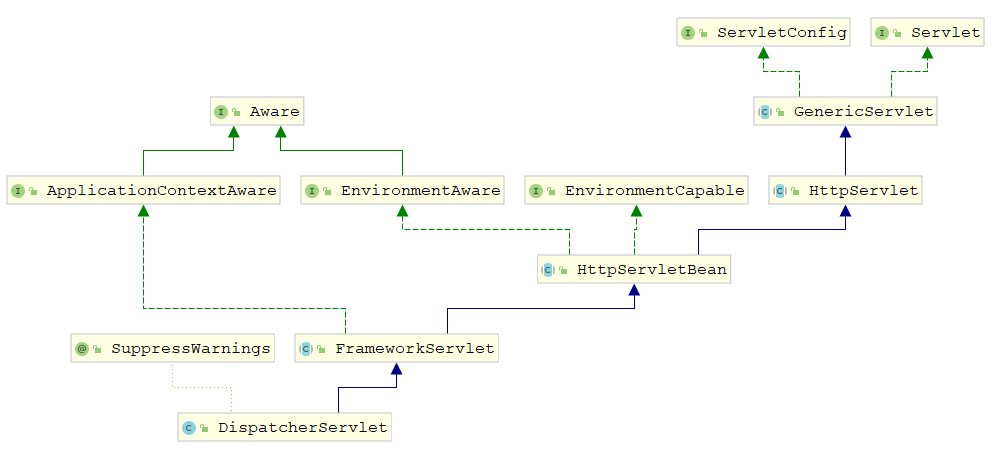
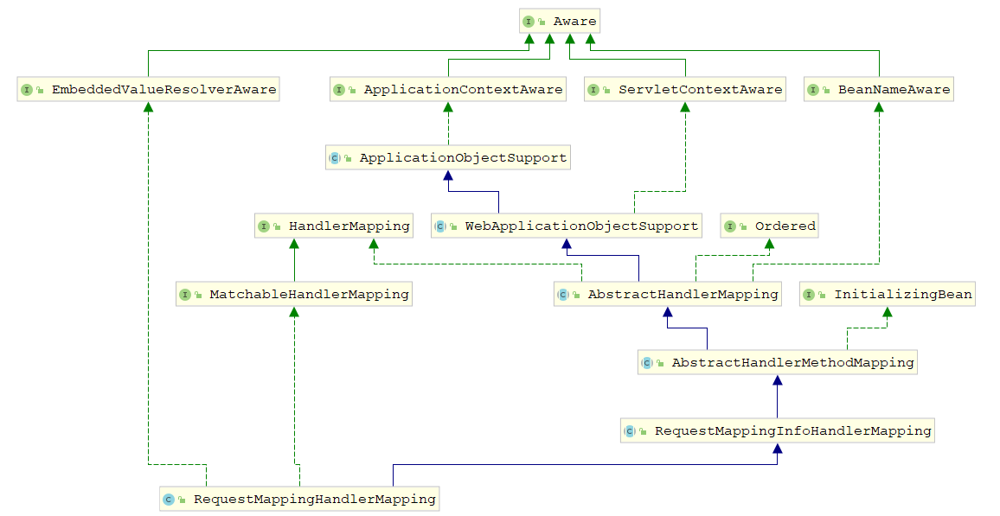
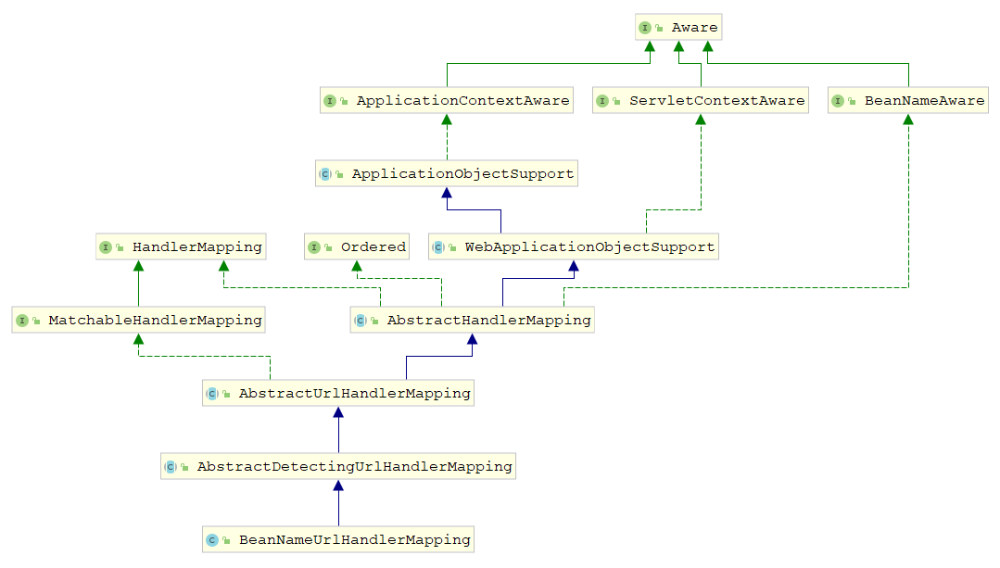
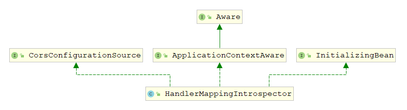

# 初始化

## DispatcherServlet



DispatcherServlet => FrameworkServlet => HttpServletBean 

 按照Servlet规范， Servlet容器在加载Servlet类的时候会调用init()方法，会调用HttpServletBean 的init()

~~~java
public abstract class HttpServletBean extends HttpServlet implements EnvironmentCapable, EnvironmentAware {
    @Override
	public final void init() throws ServletException {  
        // 把 Servlet 配置信息封装到PropertyValues对象
		PropertyValues pvs = new ServletConfigPropertyValues(getServletConfig(), this.requiredProperties);
		if (!pvs.isEmpty()) {
			try {
                // 包装DispatcherServlet，准备放入容器
				BeanWrapper bw = PropertyAccessorFactory.forBeanPropertyAccess(this);
                // 加载spring-mvc配置信息
				ResourceLoader resourceLoader = new ServletContextResourceLoader(getServletContext());
				bw.registerCustomEditor(Resource.class, 
                                        new ResourceEditor(resourceLoader, getEnvironment()));
                // 空方法,没有子类重写
				initBeanWrapper(bw);
				bw.setPropertyValues(pvs, true);
			} catch (BeansException ex) { 
				throw ex;
			}
		} 
		// 空方法,委派给子类执行其他初始化
		initServletBean();  
	}
}
~~~

委派给子类FrameworkServlet调用initServletBean

~~~java
public abstract class FrameworkServlet extends HttpServletBean implements ApplicationContextAware {
	protected final void initServletBean() throws ServletException {  
		try {
            // 初始化 WebApplicationContext 容器
			this.webApplicationContext = initWebApplicationContext();
            // 空方法,没有子类重写
			initFrameworkServlet();
		} //...catch  
		 
	}
    protected WebApplicationContext initWebApplicationContext() {
        // 容器查找,可以通过ContextLoaderListener创建容器
		WebApplicationContext rootContext =
				WebApplicationContextUtils.getWebApplicationContext(getServletContext());
		WebApplicationContext wac = null; 
		if (this.webApplicationContext != null) { 
			wac = this.webApplicationContext;
			if (wac instanceof ConfigurableWebApplicationContext) {
				ConfigurableWebApplicationContext cwac = (ConfigurableWebApplicationContext) wac;
				if (!cwac.isActive()) { 
					if (cwac.getParent() == null) { 
                        // 把rootContext设置为父容器  
						cwac.setParent(rootContext);
					}
					configureAndRefreshWebApplicationContext(cwac);
				}
			}
		}
		if (wac == null) { 
            // 在servletContext中查找是否有context实例
			wac = findWebApplicationContext();
		}
		if (wac == null) { 
            // 创建 ConfigurableWebApplicationContext容器，把rootContext设置为父容器  
            // 因此,同时设置DispatcherServlet 和 ContextLoaderListener会有两个不同的容器
			wac = createWebApplicationContext(rootContext);
		} 
		if (!this.refreshEventReceived) { 
            // 空方法，交给子类实现
			onRefresh(wac);
		}

		if (this.publishContext) {
			// Publish the context as a servlet context attribute.
			String attrName = getServletContextAttributeName();
            // 把容器保存在servletContext中
			getServletContext().setAttribute(attrName, wac); 
		} 
		return wac;
	}
}
~~~

## 容器初始化

### root容器查找

spring-mvc支持Spring容器与MVC容器共存，此时，Spring容器即根容器，mvc容器将根容器视为父容器

~~~xml
<!--使用 Contextloaderlistener 配置时,需要告诉它 Spring配置文件的位置 -->
<context-param id="context">
    <param-name>contextConfigLocation</param-name>
    <param-value>
        classpath:spring/spring-mvc.xml
    </param-value>
</context-param>
<!--配置上下文载入器-->
<!--上下文载入器载入除 Dispatcherserv1et载入的配置文件之外的其他上下文配置文件-->
<!--最常用的上下文载入器是一个serv1et监听器,其名称为 Contextloaderlistener-->
<listener>
    <listener-class>org.springframework.web.context.ContextLoaderListener</listener-class>
</listener>
~~~

根据Servlet规范，各组件的加载 顺序如下: listener --> filter --> servlet

#### ContextLoaderListener

ContextLoaderListener是可以脱离spring-mvc单独存在的，最早的Spring容器是和Struts配合使用的

~~~java
public class ContextLoaderListener extends ContextLoader implements ServletContextListener {	
	public void contextInitialized(ServletContextEvent event) {
      	// 创建 spring 容器
		initWebApplicationContext(event.getServletContext());
	}
}
public class ContextLoader { 
    
	public WebApplicationContext initWebApplicationContext(ServletContext servletContext) {
        // 不为空表示容器已经创建
		if (servletContext.getAttribute(WebApplicationContext.ROOT_WEB_APPLICATION_CONTEXT_ATTRIBUTE) 
            != null) {
			// throw new IllegalStateException( );
		} 

		try {
			// Store context in local instance variable, to guarantee that
			// it is available on ServletContext shutdown.
			if (this.context == null) {
                // 创建 spring 容器
				this.context = createWebApplicationContext(servletContext);
			}
			if (this.context instanceof ConfigurableWebApplicationContext) {
				ConfigurableWebApplicationContext cwac = (ConfigurableWebApplicationContext) this.context;
				if (!cwac.isActive()) {
					// The context has not yet been refreshed -> provide services such as
					// setting the parent context, setting the application context id, etc
					if (cwac.getParent() == null) {
						// loadParentContext现在直接返回null,应改可以交给子类重新,实现自定义配置
						ApplicationContext parent = loadParentContext(servletContext);
						cwac.setParent(parent);
					}
					configureAndRefreshWebApplicationContext(cwac, servletContext);
				}
			}
            // 向servletContext设置属性
			servletContext.setAttribute(WebApplicationContext.ROOT_WEB_APPLICATION_CONTEXT_ATTRIBUTE, 
                                        this.context);

			ClassLoader ccl = Thread.currentThread().getContextClassLoader();
			if (ccl == ContextLoader.class.getClassLoader()) {
				currentContext = this.context;
			} else if (ccl != null) {
				currentContextPerThread.put(ccl, this.context);
			} 

			return this.context;
		} // catch .. 
	}
}
~~~

#### servletContext

ContextLoaderListener创建容器的时候会被保存在ServletContext中，其key为`WebApplicationContext.class.getName() + ".ROOT"`，我们可以通过key来查找是否创建了root容器

~~~java
WebApplicationContext rootContext = WebApplicationContextUtils.getWebApplicationContext(getServletContext());
public abstract class WebApplicationContextUtils {
	public static WebApplicationContext getWebApplicationContext(ServletContext sc) { 
        // 找到默认的root容器属性名,查询容器
		return getWebApplicationContext(sc, WebApplicationContext.ROOT_WEB_APPLICATION_CONTEXT_ATTRIBUTE);
	}
    
    public static WebApplicationContext getWebApplicationContext(ServletContext sc, String attrName) {
		Assert.notNull(sc, "ServletContext must not be null");
        // 通过attrName向ServletContext中查询root容器
		Object attr = sc.getAttribute(attrName);
		if (attr == null) {
			return null;
		}
        // throws .. 
		return (WebApplicationContext) attr;
	}
}
~~~

### 容器创建

~~~java
public abstract class FrameworkServlet extends HttpServletBean implements ApplicationContextAware {
    
	protected WebApplicationContext createWebApplicationContext(@Nullable ApplicationContext parent) {
		Class<?> contextClass = getContextClass(); 
		if (!ConfigurableWebApplicationContext.class.isAssignableFrom(contextClass)) {
			// throw new ApplicationContextException( );
		}
        // 创建容器ConfigurableWebApplicationContext
		ConfigurableWebApplicationContext wac =
				(ConfigurableWebApplicationContext) BeanUtils.instantiateClass(contextClass);
		// 设置
		wac.setEnvironment(getEnvironment());
		wac.setParent(parent);
		String configLocation = getContextConfigLocation();
		if (configLocation != null) {
			wac.setConfigLocation(configLocation);
		}
        // 配置并刷新Cnotext
		configureAndRefreshWebApplicationContext(wac);

		return wac;
	}
    
    protected void configureAndRefreshWebApplicationContext(ConfigurableWebApplicationContext wac) {
        // 设置ID
		if (ObjectUtils.identityToString(wac).equals(wac.getId())) {
			// The application context id is still set to its original default value
			// -> assign a more useful id based on available information
			if (this.contextId != null) {
				wac.setId(this.contextId);
			} else {
				// Generate default id...
				wac.setId(ConfigurableWebApplicationContext.APPLICATION_CONTEXT_ID_PREFIX +
						ObjectUtils.getDisplayString(getServletContext().getContextPath()) +
                        '/' + getServletName());
			}
		}

		wac.setServletContext(getServletContext());
		wac.setServletConfig(getServletConfig());
		wac.setNamespace(getNamespace());
		wac.addApplicationListener(new SourceFilteringListener(wac, new ContextRefreshListener()));

		// The wac environment's #initPropertySources will be called in any case when the context
		// is refreshed; do it eagerly here to ensure servlet property sources are in place for
		// use in any post-processing or initialization that occurs below prior to #refresh
		ConfigurableEnvironment env = wac.getEnvironment();
		if (env instanceof ConfigurableWebEnvironment) {
			((ConfigurableWebEnvironment) env).initPropertySources(getServletContext(), getServletConfig());
		}

		postProcessWebApplicationContext(wac);
		applyInitializers(wac);
        // 调用 context的refresh方法,IOC容器的核心
		wac.refresh();
	}
}
~~~

### 配置解析

Spring 解析扩展元素解析BeanDefinition时，会解析到MVC相关的标签，MvcNamespaceHandler基于Spring实现命名空间处理的扩展 

~~~java
public class MvcNamespaceHandler extends NamespaceHandlerSupport {

	@Override
	public void init() {
        // 注解驱动
		registerBeanDefinitionParser("annotation-driven", new AnnotationDrivenBeanDefinitionParser());
        // 镜头资源处理
		registerBeanDefinitionParser("default-servlet-handler", 
                                     new DefaultServletHandlerBeanDefinitionParser());
        // 拦截器
		registerBeanDefinitionParser("interceptors", new InterceptorsBeanDefinitionParser());
        // resource 资源路径
		registerBeanDefinitionParser("resources", new ResourcesBeanDefinitionParser());
        // 控制器
		registerBeanDefinitionParser("view-controller", new ViewControllerBeanDefinitionParser());
		registerBeanDefinitionParser("redirect-view-controller", new ViewControllerBeanDefinitionParser());
		registerBeanDefinitionParser("status-controller", new ViewControllerBeanDefinitionParser());
        // 视图解析器
		registerBeanDefinitionParser("view-resolvers", new ViewResolversBeanDefinitionParser());
        // 视图配置器 tiles,freemarker
		registerBeanDefinitionParser("tiles-configurer", new TilesConfigurerBeanDefinitionParser());
        
		registerBeanDefinitionParser("freemarker-configurer", 
                                     new FreeMarkerConfigurerBeanDefinitionParser());
		registerBeanDefinitionParser("groovy-configurer", new GroovyMarkupConfigurerBeanDefinitionParser());
		registerBeanDefinitionParser("script-template-configurer", 
                                     new ScriptTemplateConfigurerBeanDefinitionParser());
		registerBeanDefinitionParser("cors", new CorsBeanDefinitionParser());
	}
}
~~~

#### 注解驱动

~~~xml
<mvc:annotation-driven/> <!-- XML配置 -->
~~~

开始解析，主要注册`HandlerMappings-url匹配器`、`HandlerAdapters-url匹配适配器`、`HandlerExceptionResolvers-异常解析器`、`UrlPathHelper-url请求路径获取帮助类`等beans，提前为mvc做好基础的准备

~~~java
class AnnotationDrivenBeanDefinitionParser implements BeanDefinitionParser {	
	public BeanDefinition parse(Element element, ParserContext context) {
		Object source = context.extractSource(element);
		// 获取XmlReaderContext
		XmlReaderContext readerContext = context.getReaderContext();

		CompositeComponentDefinition compDefinition = 
            new CompositeComponentDefinition(element.getTagName(), source);
		context.pushContainingComponent(compDefinition);
		// 内容协商
		RuntimeBeanReference contentNegotiationManager = 
            getContentNegotiationManager(element, source, context);
		// 请求处理映射器BeanDefinition, className = RequestMappingHandlerMapping.class
		RootBeanDefinition handlerMappingDef = new RootBeanDefinition(RequestMappingHandlerMapping.class);
		handlerMappingDef.setSource(source);
		handlerMappingDef.setRole(BeanDefinition.ROLE_INFRASTRUCTURE);
		handlerMappingDef.getPropertyValues().add("order", 0);
		handlerMappingDef.getPropertyValues().add("contentNegotiationManager", contentNegotiationManager);

		if (element.hasAttribute("enable-matrix-variables")) {
			Boolean enableMatrixVariables = Boolean.valueOf(element.getAttribute("enable-matrix-variables"));
			handlerMappingDef.getPropertyValues().add("removeSemicolonContent", !enableMatrixVariables);
		}
		// 设置handlerMapping路径匹配规则
		configurePathMatchingProperties(handlerMappingDef, element, context);
		readerContext.getRegistry().registerBeanDefinition(HANDLER_MAPPING_BEAN_NAME, handlerMappingDef);
		// 跨源资源共享
		RuntimeBeanReference corsRef = MvcNamespaceUtils.registerCorsConfigurations(null, context, source);
		handlerMappingDef.getPropertyValues().add("corsConfigurations", corsRef);

		// 获取参数conversion-service的属性值,是一个类型转换bean的引用
		RuntimeBeanReference conversionService = getConversionService(element, source, context);
		// 获取参数validator的属性值,是一个参数校验bean的引用
		RuntimeBeanReference validator = getValidator(element, source, context);
		// 获取参数message-codes-resolver的属性值,是一个消息编码解析器bean的引用
		RuntimeBeanReference messageCodesResolver = getMessageCodesResolver(element);

		// 可配置的Web绑定初始值设定项BeanDefinition, className = ConfigurableWebBindingInitializer.class
		RootBeanDefinition bindingDef = new RootBeanDefinition(ConfigurableWebBindingInitializer.class);
		bindingDef.setSource(source);
		bindingDef.setRole(BeanDefinition.ROLE_INFRASTRUCTURE);
		bindingDef.getPropertyValues().add("conversionService", conversionService);
		bindingDef.getPropertyValues().add("validator", validator);
		bindingDef.getPropertyValues().add("messageCodesResolver", messageCodesResolver);

		// 获取子标签 <mvc:message-converters>  获取所有消息转换器
		ManagedList<?> messageConverters = getMessageConverters(element, source, context);
		// 获取子标签 <mvc:argument-resolvers>  参数解析器
		ManagedList<?> argumentResolvers = getArgumentResolvers(element, context);
		// 获取子标签 <mvc:return-value-handlers>  返回值handler
		ManagedList<?> returnValueHandlers = getReturnValueHandlers(element, context);
		// 获取子标签 <mvc:async-support> 的参数default-timeout   异步超时时间
		String asyncTimeout = getAsyncTimeout(element);
		// 获取子标签 <mvc:async-support> 的参数task-executor   异步线程池
		RuntimeBeanReference asyncExecutor = getAsyncExecutor(element);
		// 获取<mvc:async-support>的子标签  <mvc:callable-interceptors>  有返回值的拦截器
		ManagedList<?> callableInterceptors = getCallableInterceptors(element, source, context);
		// 获取<mvc:async-support>的子标签  <mvc:deferred-result-interceptors>     延迟拦截器
		ManagedList<?> deferredResultInterceptors = getDeferredResultInterceptors(element, source, context);

		// 请求处理适配器BeanDefinition, className = RequestMappingHandlerAdapter.class
		RootBeanDefinition handlerAdapterDef = new RootBeanDefinition(RequestMappingHandlerAdapter.class);
		handlerAdapterDef.setSource(source);
		handlerAdapterDef.setRole(BeanDefinition.ROLE_INFRASTRUCTURE);
		handlerAdapterDef.getPropertyValues().add("contentNegotiationManager", contentNegotiationManager);
		handlerAdapterDef.getPropertyValues().add("webBindingInitializer", bindingDef);
		handlerAdapterDef.getPropertyValues().add("messageConverters", messageConverters);
		// 添加json请求通知处理器JsonViewRequestBodyAdvice
		addRequestBodyAdvice(handlerAdapterDef);
		// 添加json响应通知处理器JsonViewResponseBodyAdvice
		addResponseBodyAdvice(handlerAdapterDef);
		// 重定向操作是否默认不带参数
		if (element.hasAttribute("ignore-default-model-on-redirect")) {
			Boolean ignoreDefaultModel = Boolean.valueOf(
                element.getAttribute("ignore-default-model-on-redirect"));
			handlerAdapterDef.getPropertyValues().add("ignoreDefaultModelOnRedirect", ignoreDefaultModel);
		}
		if (argumentResolvers != null) {
			handlerAdapterDef.getPropertyValues().add("customArgumentResolvers", argumentResolvers);
		}
		if (returnValueHandlers != null) {
			handlerAdapterDef.getPropertyValues().add("customReturnValueHandlers", returnValueHandlers);
		}
		if (asyncTimeout != null) {
			// 异步请求超时时间
			handlerAdapterDef.getPropertyValues().add("asyncRequestTimeout", asyncTimeout);
		}
		if (asyncExecutor != null) {
			// 异步线程池
			handlerAdapterDef.getPropertyValues().add("taskExecutor", asyncExecutor);
		}

		handlerAdapterDef.getPropertyValues().add("callableInterceptors", callableInterceptors);
		handlerAdapterDef.getPropertyValues().add("deferredResultInterceptors", deferredResultInterceptors);
		// 注册 RequestMappingHandlerAdapter
		readerContext.getRegistry().registerBeanDefinition(HANDLER_ADAPTER_BEAN_NAME, handlerAdapterDef);
		// URI 组件
		RootBeanDefinition uriContributorDef =
				new RootBeanDefinition(CompositeUriComponentsContributorFactoryBean.class);
		uriContributorDef.setSource(source);
		uriContributorDef.getPropertyValues().addPropertyValue("handlerAdapter", handlerAdapterDef);
		uriContributorDef.getPropertyValues().addPropertyValue("conversionService", conversionService);
		String uriContributorName = MvcUriComponentsBuilder.MVC_URI_COMPONENTS_CONTRIBUTOR_BEAN_NAME;
		readerContext.getRegistry().registerBeanDefinition(uriContributorName, uriContributorDef);
		// 类型转换拦截BeanDefinition, className = ConversionServiceExposingInterceptor.class
		RootBeanDefinition csInterceptorDef = 
            new RootBeanDefinition(ConversionServiceExposingInterceptor.class);
		csInterceptorDef.setSource(source);
		csInterceptorDef.getConstructorArgumentValues().addIndexedArgumentValue(0, conversionService);
		// 映射拦截器BeanDefinition, className = MappedInterceptor.class
		RootBeanDefinition mappedInterceptorDef = new RootBeanDefinition(MappedInterceptor.class);
		mappedInterceptorDef.setSource(source);
		mappedInterceptorDef.setRole(BeanDefinition.ROLE_INFRASTRUCTURE);
		mappedInterceptorDef.getConstructorArgumentValues().addIndexedArgumentValue(0, (Object) null);
		mappedInterceptorDef.getConstructorArgumentValues().addIndexedArgumentValue(1, csInterceptorDef);
		String mappedInterceptorName = readerContext.registerWithGeneratedName(mappedInterceptorDef);
		// 方法异常处理解析器BeanDefinition, className = ExceptionHandlerExceptionResolver.class
		RootBeanDefinition methodExceptionResolver = 
            new RootBeanDefinition(ExceptionHandlerExceptionResolver.class);
		methodExceptionResolver.setSource(source);
		methodExceptionResolver.setRole(BeanDefinition.ROLE_INFRASTRUCTURE);
		methodExceptionResolver.getPropertyValues().
            add("contentNegotiationManager", contentNegotiationManager);
		methodExceptionResolver.getPropertyValues().add("messageConverters", messageConverters);
		methodExceptionResolver.getPropertyValues().add("order", 0);
		// 添加json响应通知处理器JsonViewResponseBodyAdvice,把异常信息转换成Json
		addResponseBodyAdvice(methodExceptionResolver);
		if (argumentResolvers != null) {
			methodExceptionResolver.getPropertyValues().
                add("customArgumentResolvers", argumentResolvers);
		}
		if (returnValueHandlers != null) {
			methodExceptionResolver.getPropertyValues().
                add("customReturnValueHandlers", returnValueHandlers);
		}
		String methodExResolverName = readerContext.registerWithGeneratedName(methodExceptionResolver);
		// 响应状态码异常解析器BeanDefinition, className = ResponseStatusExceptionResolver.class
		RootBeanDefinition statusExceptionResolver = 
            new RootBeanDefinition(ResponseStatusExceptionResolver.class);
		statusExceptionResolver.setSource(source);
		statusExceptionResolver.setRole(BeanDefinition.ROLE_INFRASTRUCTURE);
		statusExceptionResolver.getPropertyValues().add("order", 1);
		String statusExResolverName = readerContext.registerWithGeneratedName(statusExceptionResolver);
		// 默认异常处理解析器BeanDefinition, className = DefaultHandlerExceptionResolver.class
		RootBeanDefinition defaultExceptionResolver = 
            new RootBeanDefinition(DefaultHandlerExceptionResolver.class);
		defaultExceptionResolver.setSource(source);
		defaultExceptionResolver.setRole(BeanDefinition.ROLE_INFRASTRUCTURE);
		defaultExceptionResolver.getPropertyValues().add("order", 2);
		String defaultExResolverName = readerContext.registerWithGeneratedName(defaultExceptionResolver);

		context.registerComponent(new BeanComponentDefinition(handlerMappingDef, HANDLER_MAPPING_BEAN_NAME));
		context.registerComponent(new BeanComponentDefinition(handlerAdapterDef, HANDLER_ADAPTER_BEAN_NAME));
		context.registerComponent(new BeanComponentDefinition(uriContributorDef, uriContributorName));
		context.registerComponent(new BeanComponentDefinition(mappedInterceptorDef, mappedInterceptorName));
		context.registerComponent(
            new BeanComponentDefinition(methodExceptionResolver, methodExResolverName));
		context.registerComponent(
            new BeanComponentDefinition(statusExceptionResolver, statusExResolverName));
		context.registerComponent(
            new BeanComponentDefinition(defaultExceptionResolver, defaultExResolverName));

		// Ensure BeanNameUrlHandlerMapping (SPR-8289) and default HandlerAdapters are not "turned off"
		// 注册默认组件 BeanNameUrlHandlerMapping,HttpRequestHandlerAdapter,
		// SimpleControllerHandlerAdapter,HandlerMappingIntrospector
		MvcNamespaceUtils.registerDefaultComponents(context, source);

		context.popAndRegisterContainingComponent();

		return null;
	}
}
~~~

##### 内容协商

对web服务来说，进行数据交换可以使用多种格式（xml，json等），具体请求使用哪种格式是可以通过header信息沟通的，这里MVC需要创建一个内容协商管理器，保存当前web支持解析的格式

~~~java
private RuntimeBeanReference getContentNegotiationManager(
    Element element, @Nullable Object source, ParserContext context) {

    RuntimeBeanReference beanRef;
    if (element.hasAttribute("content-negotiation-manager")) {
        // 自定义实现
        String name = element.getAttribute("content-negotiation-manager");
        beanRef = new RuntimeBeanReference(name);
    } else {
        // 默认实现
        RootBeanDefinition factoryBeanDef = 
            new RootBeanDefinition(ContentNegotiationManagerFactoryBean.class);
        factoryBeanDef.setSource(source);
        factoryBeanDef.setRole(BeanDefinition.ROLE_INFRASTRUCTURE);
        // 添加默认的mediaTypes
        factoryBeanDef.getPropertyValues().add("mediaTypes", getDefaultMediaTypes());
        String name = CONTENT_NEGOTIATION_MANAGER_BEAN_NAME;
        context.getReaderContext().getRegistry().registerBeanDefinition(name, factoryBeanDef);
        context.registerComponent(new BeanComponentDefinition(factoryBeanDef, name));
        beanRef = new RuntimeBeanReference(name);
    }
    return beanRef;
}
~~~

默认的mediaTypes

~~~java
static {
    ClassLoader classLoader = AnnotationDrivenBeanDefinitionParser.class.getClassLoader();
    javaxValidationPresent = ClassUtils.isPresent("javax.validation.Validator", classLoader);
    // 判断当前包是否存在class,判断当前是否支持格式
    romePresent = ClassUtils.isPresent("com.rometools.rome.feed.WireFeed", classLoader);
    jaxb2Present = ClassUtils.isPresent("javax.xml.bind.Binder", classLoader);
    // json
    jackson2Present = ClassUtils.isPresent("com.fasterxml.jackson.databind.ObjectMapper", classLoader) &&
        ClassUtils.isPresent("com.fasterxml.jackson.core.JsonGenerator", classLoader);
    // xml
    jackson2XmlPresent = ClassUtils.isPresent("com.fasterxml.jackson.dataformat.xml.XmlMapper", classLoader);
    jackson2SmilePresent = ClassUtils
        .isPresent("com.fasterxml.jackson.dataformat.smile.SmileFactory", classLoader);
    jackson2CborPresent = ClassUtils
        .isPresent("com.fasterxml.jackson.dataformat.cbor.CBORFactory", classLoader);
    gsonPresent = ClassUtils.isPresent("com.google.gson.Gson", classLoader);
}

private Properties getDefaultMediaTypes() {
    Properties defaultMediaTypes = new Properties();
    if (romePresent) {
        defaultMediaTypes.put("atom", MediaType.APPLICATION_ATOM_XML_VALUE);
        defaultMediaTypes.put("rss", MediaType.APPLICATION_RSS_XML_VALUE);
    }
    if (jaxb2Present || jackson2XmlPresent) {
        // "application/xml"
        defaultMediaTypes.put("xml", MediaType.APPLICATION_XML_VALUE);
    }
    if (jackson2Present || gsonPresent) {
        // "application/json"
        defaultMediaTypes.put("json", MediaType.APPLICATION_JSON_VALUE);
    }
    if (jackson2SmilePresent) {
        defaultMediaTypes.put("smile", "application/x-jackson-smile");
    }
    if (jackson2CborPresent) {
        defaultMediaTypes.put("cbor", MediaType.APPLICATION_CBOR_VALUE);
    }
    return defaultMediaTypes;
}
~~~

##### 设置handlerMapping路径匹配规则

~~~java
private void configurePathMatchingProperties(
    RootBeanDefinition handlerMappingDef, Element element, ParserContext context) {

    Element pathMatchingElement = DomUtils.getChildElementByTagName(element, "path-matching");
    if (pathMatchingElement != null) {
        Object source = context.extractSource(element);
        // 后缀匹配
        if (pathMatchingElement.hasAttribute("suffix-pattern")) {
            Boolean useSuffixPatternMatch = 
                Boolean.valueOf(pathMatchingElement.getAttribute("suffix-pattern"));
            handlerMappingDef.getPropertyValues().add("useSuffixPatternMatch", useSuffixPatternMatch);
        }
        // 尾斜杠 /user也匹配/user/ 默认为true
        if (pathMatchingElement.hasAttribute("trailing-slash")) {
            Boolean useTrailingSlashMatch = 
                Boolean.valueOf(pathMatchingElement.getAttribute("trailing-slash"));
            handlerMappingDef.getPropertyValues().add("useTrailingSlashMatch", useTrailingSlashMatch);
        }
        // 是否采用对后缀匹配,比如*.json/*.xml。默认为false
        if (pathMatchingElement.hasAttribute("registered-suffixes-only")) {
            Boolean useRegisteredSuffixPatternMatch = 
                Boolean.valueOf(pathMatchingElement.getAttribute("registered-suffixes-only"));
            handlerMappingDef.getPropertyValues().add("useRegisteredSuffixPatternMatch",
                                                      useRegisteredSuffixPatternMatch);
        }
        // 路径解析帮助类,默认为UrlPathHelper
        RuntimeBeanReference pathHelperRef = null;
        if (pathMatchingElement.hasAttribute("path-helper")) {
            pathHelperRef = new RuntimeBeanReference(pathMatchingElement.getAttribute("path-helper"));
        }
        pathHelperRef = MvcNamespaceUtils.registerUrlPathHelper(pathHelperRef, context, source);
        handlerMappingDef.getPropertyValues().add("urlPathHelper", pathHelperRef);
        // 路径解析器,默认为AntPathMatcher解析器
        RuntimeBeanReference pathMatcherRef = null;
        if (pathMatchingElement.hasAttribute("path-matcher")) {
            pathMatcherRef = new RuntimeBeanReference(pathMatchingElement.getAttribute("path-matcher"));
        }
        pathMatcherRef = MvcNamespaceUtils.registerPathMatcher(pathMatcherRef, context, source);
        handlerMappingDef.getPropertyValues().add("pathMatcher", pathMatcherRef);
    }
}
~~~

##### RequestMappingHandlerMapping

注册url和Handler的映射关系



RequestMappingHandlerMapping被注入到Spring容器中，实现了ApplicationContextAware和InitializingBean接口

在bean 初始化前调用setApplicationContext方法

~~~java
public abstract class ApplicationObjectSupport implements ApplicationContextAware { 
    @Nullable
	private ApplicationContext applicationContext; 
    // ApplicationContextAware 接口在bean初始化时会执行 setApplicationContext 方法
    @Override
	public final void setApplicationContext(@Nullable ApplicationContext context) throws BeansException {
		if (context == null && !isContextRequired()) {
			// Reset internal context state.
			this.applicationContext = null;
			this.messageSourceAccessor = null;
		} else if (this.applicationContext == null) {
			// Initialize with passed-in context.
			if (!requiredContextClass().isInstance(context)) {
				// throw new ApplicationContextException( );
			}
            // applicationContext赋值,防止重复调用
			this.applicationContext = context;
			this.messageSourceAccessor = new MessageSourceAccessor(context);
            // 在这里执行了initApplicationContext,子类重写
			initApplicationContext(context);
		} else {
			// Ignore reinitialization if same context passed in.
			if (this.applicationContext != context) {
				// throw new ApplicationContextException( );
			}
		}
	}
}
~~~

在bean 初始化时调用afterPropertiesSet方法

~~~java
public abstract class AbstractHandlerMethodMapping<T> extends AbstractHandlerMapping 
    implements InitializingBean {
    // 子类有重写,但子类中也调用了这个方法
    @Override
	public void afterPropertiesSet() {
		initHandlerMethods();
	} 
    protected void initHandlerMethods() {
        // 遍历 beanName
		for (String beanName : getCandidateBeanNames()) {
			if (!beanName.startsWith(SCOPED_TARGET_NAME_PREFIX)) {
				// 处理 bean
				processCandidateBean(beanName);
			}
		}
		// 统计信息 mappings的数量,打印
		handlerMethodsInitialized(getHandlerMethods());
	}
    
    protected void processCandidateBean(String beanName) {
		Class<?> beanType = null;
		try {
			beanType = obtainApplicationContext().getType(beanName);
		} 
        // catch (Throwable ex) {  }
		// isHandler 子类实现,判断beanType 是否有 @Controller @RequestMapping
		if (beanType != null && isHandler(beanType)) {
			// 检测 beanName 包含的所有HandlerMethod
			detectHandlerMethods(beanName);
		}
	}
    // 检测 beanName 包含的所有HandlerMethod
    protected void detectHandlerMethods(Object handler) {
		Class<?> handlerType = (handler instanceof String ?
				obtainApplicationContext().getType((String) handler) : handler.getClass()); 
		if (handlerType != null) {
			Class<?> userType = ClassUtils.getUserClass(handlerType);
			// method -> RequestMappingInfo 的 map
			Map<Method, T> methods = MethodIntrospector.selectMethods(userType,
					(MethodIntrospector.MetadataLookup<T>) method -> {
						try {
							// 获取 RequestMappingInfo
							return getMappingForMethod(method, userType);
						}
						catch (Throwable ex) {
							throw new IllegalStateException("Invalid mapping on handler class [" +
									userType.getName() + "]: " + method, ex);
						}
					}); 
			// 遍历 methods,  注册
			methods.forEach((method, mapping) -> {
				Method invocableMethod = AopUtils.selectInvocableMethod(method, userType);
				registerHandlerMethod(handler, invocableMethod, mapping);
			});
		}
	} 
    // 注册
    protected void registerHandlerMethod(Object handler, Method method, T mapping) {
		this.mappingRegistry.register(mapping, handler, method);
	}
}
// RequestMappingHandlerMapping是AbstractHandlerMethodMapping的子类
// T 对应 RequestMappingInfo
public class RequestMappingHandlerMapping extends RequestMappingInfoHandlerMapping
		implements MatchableHandlerMapping, EmbeddedValueResolverAware {
    // 重写afterPropertiesSet
    @Override
	public void afterPropertiesSet() {
		this.config = new RequestMappingInfo.BuilderConfiguration();
		this.config.setUrlPathHelper(getUrlPathHelper());
		this.config.setPathMatcher(getPathMatcher());
		this.config.setSuffixPatternMatch(this.useSuffixPatternMatch);
		this.config.setTrailingSlashMatch(this.useTrailingSlashMatch);
		this.config.setRegisteredSuffixPatternMatch(this.useRegisteredSuffixPatternMatch);
		this.config.setContentNegotiationManager(getContentNegotiationManager());
		// 还会调用父类的方法
		super.afterPropertiesSet();
	}
	@Override
	@Nullable
	protected RequestMappingInfo getMappingForMethod(Method method, Class<?> handlerType) {
		// 获取 方法的 @RequestMapping 注解 然后封装成RequestMappingInfo对象
		RequestMappingInfo info = createRequestMappingInfo(method);
		if (info != null) {
			// 获取 controller 的 @RequestMapping 注解 然后封装成RequestMappingInfo对象
			RequestMappingInfo typeInfo = createRequestMappingInfo(handlerType);
			if (typeInfo != null) {
				// 合并
				info = typeInfo.combine(info);
			}
			// 路径前缀 例如 /api
			String prefix = getPathPrefix(handlerType);
			if (prefix != null) {
				info = RequestMappingInfo.paths(prefix).build().combine(info);
			}
		}
		return info;
	}
}
~~~

###### 注册

~~~java
// AbstractHandlerMethodMapping<T> 的内部类,T 对应 RequestMappingInfo
class MappingRegistry {
    private final Map<T, MappingRegistration<T>> registry = new HashMap<>();

    private final Map<T, HandlerMethod> mappingLookup = new LinkedHashMap<>();

    private final MultiValueMap<String, T> urlLookup = new LinkedMultiValueMap<>();

    private final Map<String, List<HandlerMethod>> nameLookup = new ConcurrentHashMap<>();

    private final Map<HandlerMethod, CorsConfiguration> corsLookup = new ConcurrentHashMap<>();

    private final ReentrantReadWriteLock readWriteLock = new ReentrantReadWriteLock();
    
    public void register(T mapping, Object handler, Method method) {
        // Assert that the handler method is not a suspending one.
        if (KotlinDetector.isKotlinType(method.getDeclaringClass()) && KotlinDelegate.isSuspend(method)) {
            throw new IllegalStateException("Unsupported suspending handler method detected: " + method);
        }
        // 加锁
        this.readWriteLock.writeLock().lock();
        try {
            // 创建 HandlerMethod
            HandlerMethod handlerMethod = createHandlerMethod(handler, method);
            // 验证是否存在
            validateMethodMapping(handlerMethod, mapping);
            // 注册 RequestMappingInfo -> HandlerMethod
            this.mappingLookup.put(mapping, handlerMethod);
            // 获取 url 集合, urlLookup
            List<String> directUrls = getDirectUrls(mapping);
            for (String url : directUrls) {
                this.urlLookup.add(url, mapping);
            }

            String name = null;
            if (getNamingStrategy() != null) {
                name = getNamingStrategy().getName(handlerMethod, mapping);
                addMappingName(name, handlerMethod);
            }

            CorsConfiguration corsConfig = initCorsConfiguration(handler, method, mapping);
            if (corsConfig != null) {
                this.corsLookup.put(handlerMethod, corsConfig);
            }

            this.registry.put(mapping, new MappingRegistration<>(mapping, handlerMethod, directUrls, name));
        }  finally {
            // 释放锁
            this.readWriteLock.writeLock().unlock();
        }
    }
}

~~~


##### 消息转换器

~~~java
private ManagedList<?> getMessageConverters(Element element, @Nullable Object source,ParserContext context) {
    Element convertersElement = DomUtils.getChildElementByTagName(element, "message-converters");
    // 消息转换器List
    ManagedList<Object> messageConverters = new ManagedList<>();
    if (convertersElement != null) {
        messageConverters.setSource(source);
        for (Element beanElement : DomUtils.getChildElementsByTagName(convertersElement, "bean", "ref")) {
            Object object = context.getDelegate().parsePropertySubElement(beanElement, null);
            messageConverters.add(object);
        }
    }
    // 是否注册默认值ByteArrayHttpMessageConverter
    if (convertersElement == null || 
        Boolean.parseBoolean(convertersElement.getAttribute("register-defaults"))) {
        messageConverters.setSource(source);
        // 添加 ByteArrayHttpMessageConverter
        messageConverters.add(createConverterDefinition(ByteArrayHttpMessageConverter.class, source));

        RootBeanDefinition stringConverterDef = 
            createConverterDefinition(StringHttpMessageConverter.class, source);
        stringConverterDef.getPropertyValues().add("writeAcceptCharset", false);
        // 添加 StringHttpMessageConverter
        messageConverters.add(stringConverterDef);
        // 添加 ResourceHttpMessageConverter
        messageConverters.add(createConverterDefinition(ResourceHttpMessageConverter.class, source));
        // 添加 ResourceRegionHttpMessageConverter
        messageConverters.add(createConverterDefinition(ResourceRegionHttpMessageConverter.class, source));
        // 添加 SourceHttpMessageConverter
        messageConverters.add(createConverterDefinition(SourceHttpMessageConverter.class, source));
       
        messageConverters.add(
            createConverterDefinition(AllEncompassingFormHttpMessageConverter.class, source));

        if (romePresent) {
            messageConverters.add(createConverterDefinition(AtomFeedHttpMessageConverter.class, source));
            messageConverters.add(createConverterDefinition(RssChannelHttpMessageConverter.class, source));
        }
        // json转xml转换器
        if (jackson2XmlPresent) {
            Class<?> type = MappingJackson2XmlHttpMessageConverter.class;
            RootBeanDefinition jacksonConverterDef = createConverterDefinition(type, source);
            GenericBeanDefinition jacksonFactoryDef = createObjectMapperFactoryDefinition(source);
            jacksonFactoryDef.getPropertyValues().add("createXmlMapper", true);
            jacksonConverterDef.getConstructorArgumentValues().addIndexedArgumentValue(0, jacksonFactoryDef);
            messageConverters.add(jacksonConverterDef);
        }
        //  实体类 xml转换器
        else if (jaxb2Present) {
            messageConverters.add(
                createConverterDefinition(Jaxb2RootElementHttpMessageConverter.class, source));
        }
        // Jackson json转换器
        if (jackson2Present) {
            Class<?> type = MappingJackson2HttpMessageConverter.class;
            RootBeanDefinition jacksonConverterDef = createConverterDefinition(type, source);
            GenericBeanDefinition jacksonFactoryDef = createObjectMapperFactoryDefinition(source);
            jacksonConverterDef.getConstructorArgumentValues().addIndexedArgumentValue(0, jacksonFactoryDef);
            messageConverters.add(jacksonConverterDef);
        }
        // Gson json转换器
        else if (gsonPresent) {
            messageConverters.add(createConverterDefinition(GsonHttpMessageConverter.class, source));
        }

        if (jackson2SmilePresent) {
            Class<?> type = MappingJackson2SmileHttpMessageConverter.class;
            RootBeanDefinition jacksonConverterDef = createConverterDefinition(type, source);
            GenericBeanDefinition jacksonFactoryDef = createObjectMapperFactoryDefinition(source);
            jacksonFactoryDef.getPropertyValues().add("factory", new SmileFactory());
            jacksonConverterDef.getConstructorArgumentValues().addIndexedArgumentValue(0, jacksonFactoryDef);
            messageConverters.add(jacksonConverterDef);
        }
        if (jackson2CborPresent) {
            Class<?> type = MappingJackson2CborHttpMessageConverter.class;
            RootBeanDefinition jacksonConverterDef = createConverterDefinition(type, source);
            GenericBeanDefinition jacksonFactoryDef = createObjectMapperFactoryDefinition(source);
            jacksonFactoryDef.getPropertyValues().add("factory", new CBORFactory());
            jacksonConverterDef.getConstructorArgumentValues().addIndexedArgumentValue(0, jacksonFactoryDef);
            messageConverters.add(jacksonConverterDef);
        }
    }
    return messageConverters;
}
~~~

##### 注册默认组件

~~~java
public static void registerDefaultComponents(ParserContext parserContext, @Nullable Object source) {
    // 注册 BeanNameUrlHandlerMapping
    registerBeanNameUrlHandlerMapping(parserContext, source);
    // 注册 HttpRequestHandlerAdapter
    registerHttpRequestHandlerAdapter(parserContext, source);
    // 注册 SimpleControllerHandlerAdapter
    registerSimpleControllerHandlerAdapter(parserContext, source);
    // 注册 HandlerMappingIntrospector
    registerHandlerMappingIntrospector(parserContext, source);
}
~~~


##### BeanNameUrlHandlerMapping

代码实现方式

~~~java
// 以斜杠开头,继承AbstractController
@Controller("/index")
public class BeanNameController extends AbstractController {
    @Override
    protected ModelAndView handleRequestInternal(HttpServletRequest request, HttpServletResponse response) 
        throws Exception {
        ModelAndView model = new ModelAndView("index");
        model.addObject("message", "JavaInterviewPoint"); 
        return model;
    }
}
~~~




BeanNameUrlHandlerMapping被注入到Spring容器中，由于实现了ApplicationContextAware接口，会在bean 初始化前调用setApplicationContext方法

~~~java
public abstract class ApplicationObjectSupport implements ApplicationContextAware {
    
    @Nullable
	private ApplicationContext applicationContext;
    
    // ApplicationContextAware 接口在bean初始化时会执行 setApplicationContext 方法
    @Override
	public final void setApplicationContext(@Nullable ApplicationContext context) throws BeansException {
		if (context == null && !isContextRequired()) {
			// Reset internal context state.
			this.applicationContext = null;
			this.messageSourceAccessor = null;
		} else if (this.applicationContext == null) {
			// Initialize with passed-in context.
			if (!requiredContextClass().isInstance(context)) {
				// throw new ApplicationContextException( );
			}
            // applicationContext赋值,防止重复调用
			this.applicationContext = context;
			this.messageSourceAccessor = new MessageSourceAccessor(context);
            // 在这里执行了initApplicationContext,子类重写
			initApplicationContext(context);
		} else {
			// Ignore reinitialization if same context passed in.
			if (this.applicationContext != context) {
				// throw new ApplicationContextException( );
			}
		}
	}
}
~~~

initApplicationContext()方法最终会调用AbstractDetectingUrlHandlerMapping的initApplicationContext()；AbstractDetectingUrlHandlerMapping是BeanNameUrlHandlerMapping 的父类

```java
public abstract class AbstractDetectingUrlHandlerMapping extends AbstractUrlHandlerMapping { 
    // 最终
	@Override
	public void initApplicationContext() throws ApplicationContextException {
        // 父类方法,处理拦截器
		super.initApplicationContext();
        // 建立映射关系
		detectHandlers();  
	}
    // 建立当前ApplicationContext中的所有controller和url的对应关系 
	protected void detectHandlers() throws BeansException {
		ApplicationContext applicationContext = obtainApplicationContext(); 
		// 获取ApplicationContext容器中所有bean的Name
		String[] beanNames = (this.detectHandlersInAncestorContexts ?
				BeanFactoryUtils.beanNamesForTypeIncludingAncestors(applicationContext, Object.class) :
				applicationContext.getBeanNamesForType(Object.class));

		// Take any bean name that we can determine URLs for.
		// 遍历beanNames,并找到这些bean对应的url
		for (String beanName : beanNames) {
			// 找bean上的所有url(controller上的url+方法上的url),该方法由对应的子类实现
			String[] urls = determineUrlsForHandler(beanName);
			if (!ObjectUtils.isEmpty(urls)) {
				// URL paths found: Let's consider it a handler.
				// 保存urls和beanName的对应关系,put it to Map<urls,beanName>,
                // 该方法在父类AbstractUrlHandlerMapping中实现
				registerHandler(urls, beanName);
			}  
		}
	}
    // 获取controller中所有方法的url,由子类实现,典型的模板模式 
	protected abstract String[] determineUrlsForHandler(String beanName);
}

public class BeanNameUrlHandlerMapping extends AbstractDetectingUrlHandlerMapping {
 	// 返回以"/"开头的beanName和别名集合
	@Override
	protected String[] determineUrlsForHandler(String beanName) {
		List<String> urls = new ArrayList<>();
		if (beanName.startsWith("/")) {
			urls.add(beanName);
		}
		String[] aliases = obtainApplicationContext().getAliases(beanName);
		for (String alias : aliases) {
			if (alias.startsWith("/")) {
				urls.add(alias);
			}
		}
		return StringUtils.toStringArray(urls);
	} 
}
```

###### 注册

~~~java
public abstract class AbstractUrlHandlerMapping extends AbstractHandlerMapping 
    implements MatchableHandlerMapping {	
	// 通过map保存url和bean的映射关系
    private final Map<String, Object> handlerMap = new LinkedHashMap<>();
    
	protected void registerHandler(String urlPath, Object handler) 
        throws BeansException, IllegalStateException {
		Assert.notNull(urlPath, "URL path must not be null");
		Assert.notNull(handler, "Handler object must not be null");
		Object resolvedHandler = handler;

		// Eagerly resolve handler if referencing singleton via name.
		if (!this.lazyInitHandlers && handler instanceof String) {
			String handlerName = (String) handler;
			ApplicationContext applicationContext = obtainApplicationContext();
			if (applicationContext.isSingleton(handlerName)) {
				resolvedHandler = applicationContext.getBean(handlerName);
			}
		}

		Object mappedHandler = this.handlerMap.get(urlPath);
		if (mappedHandler != null) {
			if (mappedHandler != resolvedHandler) {
				throw new IllegalStateException(
						"Cannot map " + getHandlerDescription(handler) + " to URL path [" + urlPath +
						"]: There is already " + getHandlerDescription(mappedHandler) + " mapped.");
			}
		} else {
			if (urlPath.equals("/")) { 
				setRootHandler(resolvedHandler);
			}
			else if (urlPath.equals("/*")) { 
				setDefaultHandler(resolvedHandler);
			}
			else {
				this.handlerMap.put(urlPath, resolvedHandler); 
			}
		}
	}
}
~~~


##### HandlerMappingIntrospector



HandlerMappingIntrospector注入到Spring容器中，实现了ApplicationContextAware和InitializingBean接口

~~~java
public class HandlerMappingIntrospector
		implements CorsConfigurationSource, ApplicationContextAware, InitializingBean {
    @Override
	public void setApplicationContext(ApplicationContext applicationContext) {
		// 设置 applicationContext
		this.applicationContext = applicationContext;
	}

	@Override
	public void afterPropertiesSet() {
		if (this.handlerMappings == null) {
			Assert.notNull(this.applicationContext, "No ApplicationContext");
			// 初始化 HandlerMappings
			this.handlerMappings = initHandlerMappings(this.applicationContext);
		}
	} 
    // 获取 HandlerMapping,排序
    private static List<HandlerMapping> initHandlerMappings(ApplicationContext applicationContext) {
		Map<String, HandlerMapping> beans = BeanFactoryUtils.beansOfTypeIncludingAncestors(
				applicationContext, HandlerMapping.class, true, false);
		if (!beans.isEmpty()) {
			List<HandlerMapping> mappings = new ArrayList<>(beans.values());
			AnnotationAwareOrderComparator.sort(mappings);
			return Collections.unmodifiableList(mappings);
		}
		return Collections.unmodifiableList(initFallback(applicationContext));
	}
}
~~~


#### 静态资源处理

在配置dispatchServlet时配置<url-pattern>/</url-pattern>拦截所有请求，这时候dispatchServlet完全取代了default servlet，将不会再访问容器中原始默认的servlet，而对静态资源的访问就是通过容器默认servlet处理的，故而这时候静态资源将不可访问；

如果要访问静态资源问，一种方式是dispatchServlet让拦截统一后缀（.html）的请求，但是不符合REST风格

另一种使用默认handler

~~~xml
<mvc:default-servlet-handler/>
~~~

default-servlet-handler对于静态资源的请求，就将请求转由Web应用服务器默认的Servlet处理，如果不是静态资源的请求，才由DispatcherServlet继续处理

~~~java
class DefaultServletHandlerBeanDefinitionParser implements BeanDefinitionParser {

	@Override
	@Nullable
	public BeanDefinition parse(Element element, ParserContext parserContext) {
		Object source = parserContext.extractSource(element);
		// 解析default-servlet-name属性值
		String defaultServletName = element.getAttribute("default-servlet-name"); 
        // 创建BeanDefinition  beanClass为DefaultServletHttpRequestHandler.class;
		RootBeanDefinition defaultServletHandlerDef = 
            new RootBeanDefinition(DefaultServletHttpRequestHandler.class);
		defaultServletHandlerDef.setSource(source);
		defaultServletHandlerDef.setRole(BeanDefinition.ROLE_INFRASTRUCTURE);
		if (StringUtils.hasText(defaultServletName)) {
			defaultServletHandlerDef.getPropertyValues().add("defaultServletName", defaultServletName);
		}
		String defaultServletHandlerName = 
            parserContext.getReaderContext().generateBeanName(defaultServletHandlerDef);
        // 注册BeanDefinition 容器的beanDefinitionMap中
		parserContext.getRegistry().registerBeanDefinition(defaultServletHandlerName, 
                                                           defaultServletHandlerDef);
		parserContext.registerComponent(
            new BeanComponentDefinition(defaultServletHandlerDef, defaultServletHandlerName));
		// 注册mapping
		Map<String, String> urlMap = new ManagedMap<>();
		urlMap.put("/**", defaultServletHandlerName);
 		// 创建BeanDefinition  beanClass为SimpleUrlHandlerMapping.class;
		RootBeanDefinition handlerMappingDef = new RootBeanDefinition(SimpleUrlHandlerMapping.class);
		handlerMappingDef.setSource(source);
		handlerMappingDef.setRole(BeanDefinition.ROLE_INFRASTRUCTURE);
		handlerMappingDef.getPropertyValues().add("urlMap", urlMap);

		String handlerMappingBeanName = parserContext.getReaderContext().generateBeanName(handlerMappingDef);
		parserContext.getRegistry().registerBeanDefinition(handlerMappingBeanName, handlerMappingDef);
		parserContext.registerComponent(
            new BeanComponentDefinition(handlerMappingDef, handlerMappingBeanName));

		// Ensure BeanNameUrlHandlerMapping (SPR-8289) and default HandlerAdapters are not "turned off"
		MvcNamespaceUtils.registerDefaultComponents(parserContext, source);

		return null;
	}
}
~~~

#### 拦截器

~~~java
class InterceptorsBeanDefinitionParser implements BeanDefinitionParser {

	public BeanDefinition parse(Element element, ParserContext context) {
		context.pushContainingComponent(
				new CompositeComponentDefinition(element.getTagName(), context.extractSource(element)));

		RuntimeBeanReference pathMatcherRef = null;
		// 解析路径匹配器
		if (element.hasAttribute("path-matcher")) {
			pathMatcherRef = new RuntimeBeanReference(element.getAttribute("path-matcher"));
		}
		// 获取所有拦截器 interceptor
		List<Element> interceptors = 
            DomUtils.getChildElementsByTagName(element, "bean", "ref", "interceptor");
		for (Element interceptor : interceptors) {
			RootBeanDefinition mappedInterceptorDef = new RootBeanDefinition(MappedInterceptor.class);
			mappedInterceptorDef.setSource(context.extractSource(interceptor));
			mappedInterceptorDef.setRole(BeanDefinition.ROLE_INFRASTRUCTURE);

			ManagedList<String> includePatterns = null;
			ManagedList<String> excludePatterns = null;
			Object interceptorBean;
			if ("interceptor".equals(interceptor.getLocalName())) {
				// 解析mvc:mapping节点中的path属性，保存里面的拦截路径集合
				includePatterns = getIncludePatterns(interceptor, "mapping");
				// 解析mvc:exclude-mapping节点中的path属性，保存里面的不拦截路径集合
				excludePatterns = getIncludePatterns(interceptor, "exclude-mapping");
				// 解析bean标签/ref标签，并封装成beanDefinition
				Element beanElem = DomUtils.getChildElementsByTagName(interceptor, "bean", "ref").get(0);
				interceptorBean = context.getDelegate().parsePropertySubElement(beanElem, null);
			}
			else {
				interceptorBean = context.getDelegate().parsePropertySubElement(interceptor, null);
			}
			mappedInterceptorDef.getConstructorArgumentValues().addIndexedArgumentValue(0, includePatterns);
			mappedInterceptorDef.getConstructorArgumentValues().addIndexedArgumentValue(1, excludePatterns);
			mappedInterceptorDef.getConstructorArgumentValues().addIndexedArgumentValue(2, interceptorBean);

			if (pathMatcherRef != null) {
				mappedInterceptorDef.getPropertyValues().add("pathMatcher", pathMatcherRef);
			}

			String beanName = context.getReaderContext().registerWithGeneratedName(mappedInterceptorDef);
			context.registerComponent(new BeanComponentDefinition(mappedInterceptorDef, beanName));
		}

		context.popAndRegisterContainingComponent();
		return null;
	}

	private ManagedList<String> getIncludePatterns(Element interceptor, String elementName) {
		List<Element> paths = DomUtils.getChildElementsByTagName(interceptor, elementName);
		ManagedList<String> patterns = new ManagedList<>(paths.size());
		for (Element path : paths) {
			patterns.add(path.getAttribute("path"));
		}
		return patterns;
	}

}
~~~


#### resource

~~~xml
<mvc:resources location="/static/" mapping="/static/**"/>
~~~

location元素：表示webapp目录下（即服务器根目录）的static包下的所有文件；

mapping元素：表示以/static开头的所有请求路径，如/static/a 或者/static/a/b；

配置作用：DispatcherServlet不会拦截以/static开头的所有请求路径，并当作静态资源交由Servlet处理；


~~~java
class ResourcesBeanDefinitionParser implements BeanDefinitionParser {
	@Override
	public BeanDefinition parse(Element element, ParserContext context) {
		Object source = context.extractSource(element);
		// url服务处理器,注册3个BeanDefinition
        // ResourceUrlProvider,ResourceUrlProviderExposingInterceptor, MappedInterceptor
		registerUrlProvider(context, source);
		// 路径匹配器
		RuntimeBeanReference pathMatcherRef = MvcNamespaceUtils.registerPathMatcher(null, context, source);
		// url路径匹配器
		RuntimeBeanReference pathHelperRef = MvcNamespaceUtils.registerUrlPathHelper(null, context, source);
		// 获取参数"location"  注册 ResourceHttpRequestHandler
		String resourceHandlerName = registerResourceHandler(context, element, pathHelperRef, source);
		if (resourceHandlerName == null) {
			return null;
		}

		Map<String, String> urlMap = new ManagedMap<>();
		// 获取参数"mapping"
		String resourceRequestPath = element.getAttribute("mapping");
		if (!StringUtils.hasText(resourceRequestPath)) {
			context.getReaderContext().error("The 'mapping' attribute is required.", 
                                             context.extractSource(element));
			return null;
		}
		// 添加映射 mapping -> location
		urlMap.put(resourceRequestPath, resourceHandlerName);
		// BeanDefinition  SimpleUrlHandlerMapping
		RootBeanDefinition handlerMappingDef = new RootBeanDefinition(SimpleUrlHandlerMapping.class);
		handlerMappingDef.setSource(source);
		handlerMappingDef.setRole(BeanDefinition.ROLE_INFRASTRUCTURE);
		handlerMappingDef.getPropertyValues().add("urlMap", urlMap);
		handlerMappingDef.getPropertyValues()
            .add("pathMatcher", pathMatcherRef).add("urlPathHelper", pathHelperRef);
		// order属性 执行顺序，越大优先级越低
		String orderValue = element.getAttribute("order"); 
		Object order = StringUtils.hasText(orderValue) ? orderValue : Ordered.LOWEST_PRECEDENCE - 1;
		handlerMappingDef.getPropertyValues().add("order", order);
		// 注册跨域bean支持BeanDefinition
		RuntimeBeanReference corsRef = MvcNamespaceUtils.registerCorsConfigurations(null, context, source);
		handlerMappingDef.getPropertyValues().add("corsConfigurations", corsRef);

		String beanName = context.getReaderContext().generateBeanName(handlerMappingDef);
		context.getRegistry().registerBeanDefinition(beanName, handlerMappingDef);
		context.registerComponent(new BeanComponentDefinition(handlerMappingDef, beanName));

		// Ensure BeanNameUrlHandlerMapping (SPR-8289) and default HandlerAdapters are not "turned off"
		// Register HttpRequestHandlerAdapter
        // 注册四个BeanDefinition BeanNameUrlHandlerMapping, HttpRequestHandlerAdapter
        // SimpleControllerHandlerAdapter, HandlerMappingIntrospector
		MvcNamespaceUtils.registerDefaultComponents(context, source);

		return null;
	}
}
~~~


#### 控制器

配置解析\<mvc:view-controller/>、\<mvc:redirect-view-controller/>、\<mvc:status-controller/>。

~~~java
class ViewControllerBeanDefinitionParser implements BeanDefinitionParser {  

	@Override
	@SuppressWarnings("unchecked")
	public BeanDefinition parse(Element element, ParserContext parserContext) {
		Object source = parserContext.extractSource(element);
 
		// 注册 SimpleUrlHandlerMapping
		BeanDefinition hm = registerHandlerMapping(parserContext, source); 
		// Ensure BeanNameUrlHandlerMapping (SPR-8289) and default HandlerAdapters are not "turned off"
		MvcNamespaceUtils.registerDefaultComponents(parserContext, source); 
		// 注册ParameterizableViewController BeanDefinition
		RootBeanDefinition controller = new RootBeanDefinition(ParameterizableViewController.class);
		controller.setSource(source);

		// 状态码
		HttpStatus statusCode = null;
		if (element.hasAttribute("status-code")) {
			int statusValue = Integer.parseInt(element.getAttribute("status-code"));
			statusCode = HttpStatus.valueOf(statusValue);
		}

		String name = element.getLocalName();
		// 解析view-controller属性值
		if (name.equals("view-controller")) {
			if (element.hasAttribute("view-name")) {
				controller.getPropertyValues().add("viewName", element.getAttribute("view-name"));
			}
			if (statusCode != null) {
				controller.getPropertyValues().add("statusCode", statusCode);
			}
		}
		// 解析redirect-view-controller
		else if (name.equals("redirect-view-controller")) {
			controller.getPropertyValues().add("view", getRedirectView(element, statusCode, source));
		}
		// 解析status-controller
		else if (name.equals("status-controller")) {
			controller.getPropertyValues().add("statusCode", statusCode);
			controller.getPropertyValues().add("statusOnly", true);
		}
		else {
			// Should never happen...
			throw new IllegalStateException("Unexpected tag name: " + name);
		}
		// 保存 path -> controller 的映射
		Map<String, BeanDefinition> urlMap = 
            (Map<String, BeanDefinition>) hm.getPropertyValues().get("urlMap");
		if (urlMap == null) {
			urlMap = new ManagedMap<>();
			hm.getPropertyValues().add("urlMap", urlMap);
		}
		urlMap.put(element.getAttribute("path"), controller);

		return null;
	}
}

~~~


#### 视图解析器

~~~java
public class ViewResolversBeanDefinitionParser implements BeanDefinitionParser { 

	@Override
	public BeanDefinition parse(Element element, ParserContext context) {
		Object source = context.extractSource(element);
		context.pushContainingComponent(new CompositeComponentDefinition(element.getTagName(), source));

		ManagedList<Object> resolvers = new ManagedList<>(4);
		resolvers.setSource(context.extractSource(element));
		// 支持以下视图
		String[] names = new String[] {
				"jsp", "tiles", "bean-name", "freemarker", "groovy", "script-template", "bean", "ref"};

		for (Element resolverElement : DomUtils.getChildElementsByTagName(element, names)) {
			String name = resolverElement.getLocalName();
			if ("bean".equals(name) || "ref".equals(name)) {
				resolvers.add(context.getDelegate().parsePropertySubElement(resolverElement, null));
				continue;
			}
			RootBeanDefinition resolverBeanDef;
			if ("jsp".equals(name)) {
				resolverBeanDef = new RootBeanDefinition(InternalResourceViewResolver.class);
				// 视图文件前缀
				resolverBeanDef.getPropertyValues().add("prefix", "/WEB-INF/");
				// 视图文件后缀
				resolverBeanDef.getPropertyValues().add("suffix", ".jsp");
				// 添加基于url的视图属性
				addUrlBasedViewResolverProperties(resolverElement, resolverBeanDef);
			}
			else if ("tiles".equals(name)) {
				resolverBeanDef = new RootBeanDefinition(TilesViewResolver.class);
				addUrlBasedViewResolverProperties(resolverElement, resolverBeanDef);
			}
			else if ("freemarker".equals(name)) {
				resolverBeanDef = new RootBeanDefinition(FreeMarkerViewResolver.class);
				resolverBeanDef.getPropertyValues().add("suffix", ".ftl");
				addUrlBasedViewResolverProperties(resolverElement, resolverBeanDef);
			}
			else if ("groovy".equals(name)) {
				resolverBeanDef = new RootBeanDefinition(GroovyMarkupViewResolver.class);
				resolverBeanDef.getPropertyValues().add("suffix", ".tpl");
				addUrlBasedViewResolverProperties(resolverElement, resolverBeanDef);
			}
			else if ("script-template".equals(name)) {
				resolverBeanDef = new RootBeanDefinition(ScriptTemplateViewResolver.class);
				addUrlBasedViewResolverProperties(resolverElement, resolverBeanDef);
			}
			else if ("bean-name".equals(name)) {
				resolverBeanDef = new RootBeanDefinition(BeanNameViewResolver.class);
			}
			else {
				// Should never happen
				throw new IllegalStateException("Unexpected element name: " + name);
			}
			resolverBeanDef.setSource(source);
			resolverBeanDef.setRole(BeanDefinition.ROLE_INFRASTRUCTURE);
			resolvers.add(resolverBeanDef);
		}

		String beanName = VIEW_RESOLVER_BEAN_NAME;
		RootBeanDefinition compositeResolverBeanDef = new RootBeanDefinition(ViewResolverComposite.class);
		compositeResolverBeanDef.setSource(source);
		compositeResolverBeanDef.setRole(BeanDefinition.ROLE_INFRASTRUCTURE);

		names = new String[] {"content-negotiation"};
		List<Element> contentNegotiationElements = DomUtils.getChildElementsByTagName(element, names);
		if (contentNegotiationElements.isEmpty()) {
			compositeResolverBeanDef.getPropertyValues().add("viewResolvers", resolvers);
		}
		else if (contentNegotiationElements.size() == 1) {
			BeanDefinition beanDef = 
                createContentNegotiatingViewResolver(contentNegotiationElements.get(0), context);
			beanDef.getPropertyValues().add("viewResolvers", resolvers);
			ManagedList<Object> list = new ManagedList<>(1);
			list.add(beanDef);
			compositeResolverBeanDef.getPropertyValues().add("order", Ordered.HIGHEST_PRECEDENCE);
			compositeResolverBeanDef.getPropertyValues().add("viewResolvers", list);
		}
		else {
			throw new IllegalArgumentException("Only one <content-negotiation> element is allowed.");
		}

		if (element.hasAttribute("order")) {
			compositeResolverBeanDef.getPropertyValues().add("order", element.getAttribute("order"));
		}

		context.getReaderContext().getRegistry().registerBeanDefinition(beanName, compositeResolverBeanDef);
		context.registerComponent(new BeanComponentDefinition(compositeResolverBeanDef, beanName));
		context.popAndRegisterContainingComponent();
		return null;
	}
}
~~~


#### 视图配置器

~~~java
public class FreeMarkerConfigurerBeanDefinitionParser extends AbstractSingleBeanDefinitionParser { 
	@Override
	protected void doParse(Element element, ParserContext parserContext, BeanDefinitionBuilder builder) {
		// 解析template-loader-path属性值
		List<Element> childElements = DomUtils.getChildElementsByTagName(element, "template-loader-path");
		if (!childElements.isEmpty()) {
			List<String> locations = new ArrayList<>(childElements.size());
			for (Element childElement : childElements) {
				// 解析location属性值
				locations.add(childElement.getAttribute("location"));
			}
			if (locations.isEmpty()) {
				// 路径目录,默认在/WEB-INF/下
				locations.add("/WEB-INF/");
			}
			builder.addPropertyValue("templateLoaderPaths", StringUtils.toStringArray(locations));
		}
	} 
} 
~~~


## MVC初始化

在容器初始化结束后，会调用一个onRefresh方法，委派给子类实现

~~~java
public class DispatcherServlet extends FrameworkServlet {
    // 实现父类定好的模板
    @Override
	protected void onRefresh(ApplicationContext context) {
		initStrategies(context);
	} 
    // 初始化策略
	protected void initStrategies(ApplicationContext context) { 
        // 多文件上传的组件
		initMultipartResolver(context); 
        // 初始化本地语言环境，国际化
		initLocaleResolver(context);    
        // 初始化模板处理器
		initThemeResolver(context);      
        // 初始化HandlerMapping
		initHandlerMappings(context);   
        // 初始化Handler适配器
		initHandlerAdapters(context);   
        // 初始化Handler异常解析器
		initHandlerExceptionResolvers(context);   
        // 初始化Request请求到ViewName的转换器
		initRequestToViewNameTranslator(context); 
        // 初始化视图转换器
		initViewResolvers(context);      
        // FlashMap 管理器
		initFlashMapManager(context);    
	}
}
~~~

### 文件上传

默认情况下，Spring是没有 multipart处理的，需要在Web应用的Context中添加 multipart解析器 

~~~xml
<!-- 定义文件上传解析器 -->
<bean id="multipartResolver"
      class="org.springframework.web.multipart.commons.CommonsMultipartResolver">
    <!-- 设定默认编码 -->
    <property name="defaultEncoding" value="UTF-8"></property>
    <!-- 设定文件上传的最大值5MB，5*1024*1024 -->
    <property name="maxUploadSize" value="5242880"></property>
</bean>
~~~

~~~java
private void initMultipartResolver(ApplicationContext context) {
    try {
        this.multipartResolver = context.getBean(MULTIPART_RESOLVER_BEAN_NAME, MultipartResolver.class);
    } catch (NoSuchBeanDefinitionException ex) {
        // Default is no multipart resolver.
        this.multipartResolver = null; 
    }
}
~~~


### 国际化

~~~java
private void initLocaleResolver(ApplicationContext context) {
    try {
        this.localeResolver = context.getBean(LOCALE_RESOLVER_BEAN_NAME, LocaleResolver.class); 
    } catch (NoSuchBeanDefinitionException ex) {
        // We need to use the default.
        this.localeResolver = getDefaultStrategy(context, LocaleResolver.class); 
    }
}
~~~


### 主题解析

~~~java
private void initThemeResolver(ApplicationContext context) {
    try {
        this.themeResolver = context.getBean(THEME_RESOLVER_BEAN_NAME, ThemeResolver.class); 
    } catch (NoSuchBeanDefinitionException ex) {
        // We need to use the default.
        this.themeResolver = getDefaultStrategy(context, ThemeResolver.class); 
    }
}
~~~


### HandlerMapping

~~~java
private void initHandlerMappings(ApplicationContext context) {
    this.handlerMappings = null;

    if (this.detectAllHandlerMappings) {
        // Find all HandlerMappings in the ApplicationContext, including ancestor contexts.
        Map<String, HandlerMapping> matchingBeans =
            BeanFactoryUtils.beansOfTypeIncludingAncestors(context, HandlerMapping.class, true, false);
        if (!matchingBeans.isEmpty()) {
            this.handlerMappings = new ArrayList<>(matchingBeans.values());
            // We keep HandlerMappings in sorted order.
            AnnotationAwareOrderComparator.sort(this.handlerMappings);
        }
    } else {
        try {
            HandlerMapping hm = context.getBean(HANDLER_MAPPING_BEAN_NAME, HandlerMapping.class);
            this.handlerMappings = Collections.singletonList(hm);
        } // catch (NoSuchBeanDefinitionException ex) 
    }

    // Ensure we have at least one HandlerMapping, by registering
    // a default HandlerMapping if no other mappings are found.
    if (this.handlerMappings == null) {
        this.handlerMappings = getDefaultStrategies(context, HandlerMapping.class); 
    }
}
~~~

### HandlerAdapter

~~~java
private void initHandlerAdapters(ApplicationContext context) {
    this.handlerAdapters = null;

    if (this.detectAllHandlerAdapters) {
        // Find all HandlerAdapters in the ApplicationContext, including ancestor contexts.
        Map<String, HandlerAdapter> matchingBeans =
            BeanFactoryUtils.beansOfTypeIncludingAncestors(context, HandlerAdapter.class, true, false);
        if (!matchingBeans.isEmpty()) {
            this.handlerAdapters = new ArrayList<>(matchingBeans.values());
            // We keep HandlerAdapters in sorted order.
            AnnotationAwareOrderComparator.sort(this.handlerAdapters);
        }
    }
    else {
        try {
            HandlerAdapter ha = context.getBean(HANDLER_ADAPTER_BEAN_NAME, HandlerAdapter.class);
            this.handlerAdapters = Collections.singletonList(ha);
        } // catch (NoSuchBeanDefinitionException ex)  
    }

    // Ensure we have at least some HandlerAdapters, by registering
    // default HandlerAdapters if no other adapters are found.
    if (this.handlerAdapters == null) {
        this.handlerAdapters = getDefaultStrategies(context, HandlerAdapter.class); 
    }
}
~~~


### HandlerException

~~~java
private void initHandlerExceptionResolvers(ApplicationContext context) {
    this.handlerExceptionResolvers = null;

    if (this.detectAllHandlerExceptionResolvers) {
        // Find all HandlerExceptionResolvers in the ApplicationContext, including ancestor contexts.
        Map<String, HandlerExceptionResolver> matchingBeans = BeanFactoryUtils
            .beansOfTypeIncludingAncestors(context, HandlerExceptionResolver.class, true, false);
        if (!matchingBeans.isEmpty()) {
            this.handlerExceptionResolvers = new ArrayList<>(matchingBeans.values());
            // We keep HandlerExceptionResolvers in sorted order.
            AnnotationAwareOrderComparator.sort(this.handlerExceptionResolvers);
        }
    }
    else {
        try {
            HandlerExceptionResolver her =
                context.getBean(HANDLER_EXCEPTION_RESOLVER_BEAN_NAME, HandlerExceptionResolver.class);
            this.handlerExceptionResolvers = Collections.singletonList(her);
        } // catch (NoSuchBeanDefinitionException ex)  
    }

    // Ensure we have at least some HandlerExceptionResolvers, by registering
    // default HandlerExceptionResolvers if no other resolvers are found.
    if (this.handlerExceptionResolvers == null) {
        this.handlerExceptionResolvers = getDefaultStrategies(context, HandlerExceptionResolver.class); 
    }
}
~~~


### RequestToViewName

~~~java
private void initRequestToViewNameTranslator(ApplicationContext context) {
    try {
        this.viewNameTranslator =
            context.getBean(REQUEST_TO_VIEW_NAME_TRANSLATOR_BEAN_NAME, RequestToViewNameTranslator.class); 
    } catch (NoSuchBeanDefinitionException ex) {
        // We need to use the default.
        this.viewNameTranslator = getDefaultStrategy(context, RequestToViewNameTranslator.class); 
    }
}
~~~


### ViewResolver

~~~java
private void initViewResolvers(ApplicationContext context) {
    this.viewResolvers = null;

    if (this.detectAllViewResolvers) {
        // Find all ViewResolvers in the ApplicationContext, including ancestor contexts.
        Map<String, ViewResolver> matchingBeans =
            BeanFactoryUtils.beansOfTypeIncludingAncestors(context, ViewResolver.class, true, false);
        if (!matchingBeans.isEmpty()) {
            this.viewResolvers = new ArrayList<>(matchingBeans.values());
            // We keep ViewResolvers in sorted order.
            AnnotationAwareOrderComparator.sort(this.viewResolvers);
        }
    }  else {
        try {
            ViewResolver vr = context.getBean(VIEW_RESOLVER_BEAN_NAME, ViewResolver.class);
            this.viewResolvers = Collections.singletonList(vr);
        } // catch (NoSuchBeanDefinitionException ex) 
    }

    // Ensure we have at least one ViewResolver, by registering
    // a default ViewResolver if no other resolvers are found.
    if (this.viewResolvers == null) {
        this.viewResolvers = getDefaultStrategies(context, ViewResolver.class); 
    }
}
~~~


### FlashMapManager

~~~java
private void initFlashMapManager(ApplicationContext context) {
    try {
        this.flashMapManager = context.getBean(FLASH_MAP_MANAGER_BEAN_NAME, FlashMapManager.class); 
    } catch (NoSuchBeanDefinitionException ex) {
        // We need to use the default.
        this.flashMapManager = getDefaultStrategy(context, FlashMapManager.class); 
    }
}
~~~


# 请求响应

Servlet标准定义了所有请求先由service方法处理，FrameworkServlet覆盖了service方法:

```java
public abstract class FrameworkServlet extends HttpServletBean implements ApplicationContextAware {
    @Override
    protected void service(HttpServletRequest request, HttpServletResponse response) {
        HttpMethod httpMethod = HttpMethod.resolve(request.getMethod());
        // patch 
        if (HttpMethod.PATCH == httpMethod || httpMethod == null) {
            processRequest(request, response);
        } else { // 其他请求会到父类对应的方法doGet,doPost方法
            super.service(request, response);
        }
    } 
    // doGet,doPost被重写,最终调用processRequest
    @Override
    protected final void doGet(HttpServletRequest request, HttpServletResponse response)
        throws ServletException, IOException { 
        processRequest(request, response);
    } 
    @Override
    protected final void doPost(HttpServletRequest request, HttpServletResponse response)
        throws ServletException, IOException { 
        processRequest(request, response);
    } 
    @Override
    protected final void doPut(HttpServletRequest request, HttpServletResponse response)
        throws ServletException, IOException { 
        processRequest(request, response);
    } 
    @Override
    protected final void doDelete(HttpServletRequest request, HttpServletResponse response)
        throws ServletException, IOException { 
        processRequest(request, response);
    }
    
    protected final void processRequest(HttpServletRequest request, HttpServletResponse response)
        throws ServletException, IOException {

        long startTime = System.currentTimeMillis();
        Throwable failureCause = null; 
        LocaleContext previousLocaleContext = LocaleContextHolder.getLocaleContext();
        LocaleContext localeContext = buildLocaleContext(request);
        // 获取请求绑定属性 
        RequestAttributes previousAttributes = RequestContextHolder.getRequestAttributes();
        ServletRequestAttributes requestAttributes = 
            buildRequestAttributes(request, response, previousAttributes);
        // 获取异步请求管理器
        WebAsyncManager asyncManager = WebAsyncUtils.getAsyncManager(request);
        asyncManager.registerCallableInterceptor(FrameworkServlet.class.getName(), 
                                                 new RequestBindingInterceptor());
        // 初始化Context
        initContextHolders(request, localeContext, requestAttributes); 

        try {
            // 空方法,委派给子类
            doService(request, response);
        } // catch ...  
        finally {
            resetContextHolders(request, previousLocaleContext, previousAttributes);
            if (requestAttributes != null) {
                requestAttributes.requestCompleted();
            }
            logResult(request, response, failureCause, asyncManager);
            // 发布请求处理事件
            publishRequestHandledEvent(request, response, startTime, failureCause);
        }
    }
}


```

最终会调用DispatcherServlet 的doService()；而doService()的核心方法是doDispatch()

~~~java
public class DispatcherServlet extends FrameworkServlet { 
    protected void doDispatch(HttpServletRequest request, HttpServletResponse response) throws Exception {
		HttpServletRequest processedRequest = request;
		HandlerExecutionChain mappedHandler = null;
		boolean multipartRequestParsed = false;
		// 获取异步请求管理器
		WebAsyncManager asyncManager = WebAsyncUtils.getAsyncManager(request);

		try {
			ModelAndView mv = null;
			Exception dispatchException = null;

			try {
				// 是否 上传文件请求
				processedRequest = checkMultipart(request);
				multipartRequestParsed = (processedRequest != request);

				// Determine handler for the current request.
				// 获取请求的handler
				// 获取处理当前请求的controller,这里也称为hanlder,
				// 返回一个HandlerExecutionChain请求处理器链 ,封装了handler和interceptors.
				mappedHandler = getHandler(processedRequest);
				// 如果handler为空,则返回404
				if (mappedHandler == null) {
					noHandlerFound(processedRequest, response);
					return;
				}

				// Determine handler adapter for the current request.
				// 获取当前请求的handler适配器
				HandlerAdapter ha = getHandlerAdapter(mappedHandler.getHandler());

				// Process last-modified header, if supported by the handler.
				// 处理 last-modified 请求头
				String method = request.getMethod();
				boolean isGet = "GET".equals(method);
				if (isGet || "HEAD".equals(method)) {
					long lastModified = ha.getLastModified(request, mappedHandler.getHandler());
					if (new ServletWebRequest(request, response).checkNotModified(lastModified) && isGet) {
						return;
					}
				}
				// 前置拦截 请求之前调用,可以进行编码、安全控制、权限校验等处理  执行 HandlerInterceptor.preHandle
				if (!mappedHandler.applyPreHandle(processedRequest, response)) {
					return;
				}

				// Actually invoke the handler.
				// 执行handler,返回结果视图对象
				mv = ha.handle(processedRequest, response, mappedHandler.getHandler());
				// 如果是异步直接返回
				if (asyncManager.isConcurrentHandlingStarted()) {
					return;
				}

				// 解析默认的视图
				applyDefaultViewName(processedRequest, mv);
				// 后置拦截器 请求执行完成后，生成视图之前执行 执行 HandlerInterceptor.postHandle
				mappedHandler.applyPostHandle(processedRequest, response, mv);
			} //  catch..  
			// 拦截器完成事件,在DispatcherServlet完全处理完请求后被调用,可用于清理资源等
			// 执行 HandlerInterceptor.afterCompletion
			processDispatchResult(processedRequest, response, mappedHandler, mv, dispatchException);
		}
		catch (Exception ex) {
            // 异常执行拦截器的完成事件
			triggerAfterCompletion(processedRequest, response, mappedHandler, ex);
		}
		catch (Throwable err) {
			triggerAfterCompletion(processedRequest, response, mappedHandler,
					new NestedServletException("Handler processing failed", err));
		}
		finally {
			if (asyncManager.isConcurrentHandlingStarted()) {
				// Instead of postHandle and afterCompletion
				if (mappedHandler != null) {
					mappedHandler.applyAfterConcurrentHandlingStarted(processedRequest, response);
				}
			}
			else {
				// 清理文件上传占用的资源
				// Clean up any resources used by a multipart request.
				if (multipartRequestParsed) {
					cleanupMultipart(processedRequest);
				}
			}
		}
	}
}
~~~

## 查找handler

~~~java
@Nullable
protected HandlerExecutionChain getHandler(HttpServletRequest request) throws Exception {
    if (this.handlerMappings != null) {
        // 遍历所有的HandlerMapping，一个个去匹配
        for (HandlerMapping mapping : this.handlerMappings) {
            // 获取request的handler执行链
            HandlerExecutionChain handler = mapping.getHandler(request);
            // handler != null 说明匹配成功
            if (handler != null) {
                return handler;
            }
        }
    }
    return null;
}
~~~

**获取request的handler执行链**

~~~java
public abstract class AbstractHandlerMapping extends WebApplicationObjectSupport
		implements HandlerMapping, Ordered, BeanNameAware {	
	public final HandlerExecutionChain getHandler(HttpServletRequest request) throws Exception {
		// 根据请求找到hander
		Object handler = getHandlerInternal(request);
		if (handler == null) {
			// 默认的handler
			handler = getDefaultHandler();
		}
		if (handler == null) {
			return null;
		}
		// Bean name or resolved handler?
		if (handler instanceof String) {
			// 如果handler是String类型,得到的handlerd额beanName
			String handlerName = (String) handler;
			// 通过handlerName去容器中找到bean对象
			handler = obtainApplicationContext().getBean(handlerName);
		}
		// 根据handler和request获取执行链 拦截器和要执行的handler
		HandlerExecutionChain executionChain = getHandlerExecutionChain(handler, request); 
		// 如果是跨域请求，header中有Origin
		if (hasCorsConfigurationSource(handler)) {
			CorsConfiguration config = (this.corsConfigurationSource != null ?
                                        this.corsConfigurationSource.getCorsConfiguration(request) : null);
			CorsConfiguration handlerConfig = getCorsConfiguration(handler, request);
			config = (config != null ? config.combine(handlerConfig) : handlerConfig);
			executionChain = getCorsHandlerExecutionChain(request, executionChain, config);
		}

		return executionChain;
	}
}
~~~

## 查找HandlerAdapter

~~~java
protected HandlerAdapter getHandlerAdapter(Object handler) throws ServletException {
    if (this.handlerAdapters != null) {
        // 遍历所有 handlerAdapters
        for (HandlerAdapter adapter : this.handlerAdapters) {
            // 是否适配,适配器模式
            if (adapter.supports(handler)) {
                return adapter;
            }
        }
    }
    // throw new ServletException( );
}
~~~

## 请求处理

### 前置拦截

请求之前调用，可以进行编码、安全控制、权限校验等处理 

~~~java
public class HandlerExecutionChain {	
	boolean applyPreHandle(HttpServletRequest request, HttpServletResponse response) throws Exception {
		// 获取handler的拦截器
		HandlerInterceptor[] interceptors = getInterceptors();
		if (!ObjectUtils.isEmpty(interceptors)) {
			for (int i = 0; i < interceptors.length; i++) {
				HandlerInterceptor interceptor = interceptors[i];
				//  执行拦截器的前置处理方法
				if (!interceptor.preHandle(request, response, this.handler)) {
					// 如果返回false 指向完成后方法
					triggerAfterCompletion(request, response, null);
					return false;
				}
				this.interceptorIndex = i;
			}
		}
		return true;
	}
}
~~~

### 执行handler

~~~java
public abstract class AbstractHandlerMethodAdapter extends WebContentGenerator 
    implements HandlerAdapter, Ordered {
    // 执行handler,返回ModelAndView
	public final ModelAndView handle(HttpServletRequest request, HttpServletResponse response, 
            Object handler) throws Exception {
		// 空方法,子类实现
		return handleInternal(request, response, (HandlerMethod) handler);
	}  
}

public class RequestMappingHandlerAdapter extends AbstractHandlerMethodAdapter
		implements BeanFactoryAware, InitializingBean {
    protected ModelAndView handleInternal(HttpServletRequest request,
			HttpServletResponse response, HandlerMethod handlerMethod) throws Exception {

		ModelAndView mav;
		// 检查请求
		checkRequest(request); 
		// Execute invokeHandlerMethod in synchronized block if required.
		// Session同步
		if (this.synchronizeOnSession) {
			HttpSession session = request.getSession(false);
			if (session != null) {
				Object mutex = WebUtils.getSessionMutex(session);
				synchronized (mutex) {
					//  执行handler的业务方法
					mav = invokeHandlerMethod(request, response, handlerMethod);
				}
			} else {
				// No HttpSession available -> no mutex necessary
				mav = invokeHandlerMethod(request, response, handlerMethod);
			}
		} else {
			// No synchronization on session demanded at all...
			mav = invokeHandlerMethod(request, response, handlerMethod);
		}
		//  响应消息头是否包含缓存
		if (!response.containsHeader(HEADER_CACHE_CONTROL)) {
			if (getSessionAttributesHandler(handlerMethod).hasSessionAttributes()) {
				applyCacheSeconds(response, this.cacheSecondsForSessionAttributeHandlers);
			}
			else {
				// 准备响应
				prepareResponse(response);
			}
		} 
		return mav;
	}
}
~~~

#### 执行handler方法

~~~java
public class RequestMappingHandlerAdapter extends AbstractHandlerMethodAdapter
		implements BeanFactoryAware, InitializingBean {	
    
	protected ModelAndView invokeHandlerMethod(HttpServletRequest request,
			HttpServletResponse response, HandlerMethod handlerMethod) throws Exception {

		ServletWebRequest webRequest = new ServletWebRequest(request, response);
		try {
			// 数据绑定
			WebDataBinderFactory binderFactory = getDataBinderFactory(handlerMethod);
			// 模板工厂
			ModelFactory modelFactory = getModelFactory(handlerMethod, binderFactory);
			// 把handlerMethod 封装成ServletInvocableHandlerMethod
			ServletInvocableHandlerMethod invocableMethod = createInvocableHandlerMethod(handlerMethod);
			// 参数解析器
			if (this.argumentResolvers != null) {
				invocableMethod.setHandlerMethodArgumentResolvers(this.argumentResolvers);
			}
			// 返回值解析器
			if (this.returnValueHandlers != null) {
				invocableMethod.setHandlerMethodReturnValueHandlers(this.returnValueHandlers);
			}
			invocableMethod.setDataBinderFactory(binderFactory);
			invocableMethod.setParameterNameDiscoverer(this.parameterNameDiscoverer);
			// 创建 ModelAndView 容器
			ModelAndViewContainer mavContainer = new ModelAndViewContainer();
			mavContainer.addAllAttributes(RequestContextUtils.getInputFlashMap(request));
			// 模板工厂初始化model
			modelFactory.initModel(webRequest, mavContainer, invocableMethod);
			mavContainer.setIgnoreDefaultModelOnRedirect(this.ignoreDefaultModelOnRedirect);
			// 创建异步请求
			AsyncWebRequest asyncWebRequest = WebAsyncUtils.createAsyncWebRequest(request, response);
			asyncWebRequest.setTimeout(this.asyncRequestTimeout);
			// 获取异步请求管理器
			WebAsyncManager asyncManager = WebAsyncUtils.getAsyncManager(request);
			asyncManager.setTaskExecutor(this.taskExecutor);
			asyncManager.setAsyncWebRequest(asyncWebRequest);
			asyncManager.registerCallableInterceptors(this.callableInterceptors);
			asyncManager.registerDeferredResultInterceptors(this.deferredResultInterceptors);

			if (asyncManager.hasConcurrentResult()) {
				Object result = asyncManager.getConcurrentResult();
				mavContainer = (ModelAndViewContainer) asyncManager.getConcurrentResultContext()[0];
				asyncManager.clearConcurrentResult();
				LogFormatUtils.traceDebug(logger, traceOn -> {
					String formatted = LogFormatUtils.formatValue(result, !traceOn);
					return "Resume with async result [" + formatted + "]";
				});
				invocableMethod = invocableMethod.wrapConcurrentResult(result);
			}
			// 方法执行
			invocableMethod.invokeAndHandle(webRequest, mavContainer);

			if (asyncManager.isConcurrentHandlingStarted()) {
				return null;
			}
			// 返回ModelAndView
			return getModelAndView(mavContainer, modelFactory, webRequest);
		} finally {
			// 请求完成
			webRequest.requestCompleted();
		}
	}
}
~~~


### 后置拦截器

请求执行完成后，生成视图之前执行

~~~java
public class HandlerExecutionChain {		
	void applyPostHandle(HttpServletRequest request, HttpServletResponse response, @Nullable ModelAndView mv)
			throws Exception {

		HandlerInterceptor[] interceptors = getInterceptors();
		if (!ObjectUtils.isEmpty(interceptors)) {
			for (int i = interceptors.length - 1; i >= 0; i--) {
				HandlerInterceptor interceptor = interceptors[i];
				// 执行业务handler拦截器后置方法
				interceptor.postHandle(request, response, this.handler, mv);
			}
		}
	}
}
public class HandlerExecutionChain {	
	void triggerAfterCompletion(HttpServletRequest request, HttpServletResponse response,  Exception ex)
			throws Exception {
		// 获取拦截器
		HandlerInterceptor[] interceptors = getInterceptors();
		if (!ObjectUtils.isEmpty(interceptors)) {
			for (int i = this.interceptorIndex; i >= 0; i--) {
				HandlerInterceptor interceptor = interceptors[i];
				try {
					// 执行拦截器的完成事件
					interceptor.afterCompletion(request, response, this.handler, ex);
				} // catch ...
			}
		}
	}
}
~~~


### 完成后处理

在DispatcherServlet完全处理完请求后被调用，可用于清理资源等

~~~java
private void processDispatchResult(HttpServletRequest request, HttpServletResponse response,
                                   @Nullable HandlerExecutionChain mappedHandler, @Nullable ModelAndView mv,
                                   @Nullable Exception exception) throws Exception {

    boolean errorView = false;
    // 异常不为空
    if (exception != null) {
        if (exception instanceof ModelAndViewDefiningException) { 
            mv = ((ModelAndViewDefiningException) exception).getModelAndView();
        }  else {
            // 使用异常解析器处理异常
            Object handler = (mappedHandler != null ? mappedHandler.getHandler() : null);
            mv = processHandlerException(request, response, handler, exception);
            errorView = (mv != null);
        }
    }

    // Did the handler return a view to render?
    if (mv != null && !mv.wasCleared()) {
        // 渲染视图
        render(mv, request, response);
        if (errorView) {
            WebUtils.clearErrorRequestAttributes(request);
        }
    }  else { 
    }

    if (WebAsyncUtils.getAsyncManager(request).isConcurrentHandlingStarted()) {
        // Concurrent handling started during a forward
        return;
    }

    if (mappedHandler != null) {
        // Exception (if any) is already handled..
        // 执行拦截器的处理完成事件  
        mappedHandler.triggerAfterCompletion(request, response, null);
    }
}
~~~

#### 渲染视图

