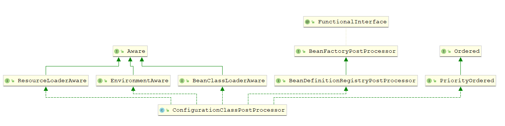
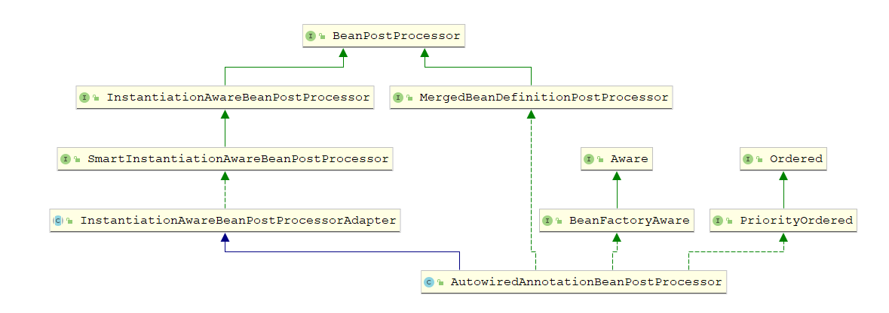

# 注解驱动

**配置Class**

~~~java
// 注解驱动配置文件 
@Configuration
// 扫描包
@ComponentScan(basePackages = "com.qinfengsa.spring")
// 配置文件
@PropertySource(value = "classpath:properties/qin-dev.properties")
public class SpringConfig {

    @Bean("student")
    // @Conditional条件注解
    @Conditional(TestCondition.class)
    public Student student() {

        return new Student(18,"qin");
    }
 

    // 内部配置类
    @Configuration
    class InnerConfig{

        @Bean("student2")
        public Student student() {

            return new Student(20,"win");
        }
    }
}

~~~

**启动代码**

~~~java
public static void main(String[] args) {
    AbstractApplicationContext context = new AnnotationConfigApplicationContext(SpringConfig.class);
    Student student = context.getBean("student",Student.class);
}
~~~

## 构造方法

~~~java
public class AnnotationConfigApplicationContext extends GenericApplicationContext 
    implements AnnotationConfigRegistry {
	// 注解BeanDefinition读取器
	private final AnnotatedBeanDefinitionReader reader;
	// 按类路径扫描的BeanDefinition扫描器
	private final ClassPathBeanDefinitionScanner scanner;
    
    public AnnotationConfigApplicationContext() {
		// 带注解的BeanDefinition的读取器
		this.reader = new AnnotatedBeanDefinitionReader(this);
		// 按类路径扫描的BeanDefinition扫描器
		this.scanner = new ClassPathBeanDefinitionScanner(this);
	}
    // 构造方法
    public AnnotationConfigApplicationContext(Class<?>... componentClasses) {
		// 创建注解的BeanDefinition的读取器 和 BeanDefinition扫描器
		this();
		// 注册 config配置类和类中定义的bean
		register(componentClasses);
		// 刷新context
		refresh();
	}

    
}
~~~

## AnnotatedBeanDefinitionReader

~~~java
public class AnnotatedBeanDefinitionReader {
    public AnnotatedBeanDefinitionReader(BeanDefinitionRegistry registry) {
		this(registry, getOrCreateEnvironment(registry));
	} 
	public AnnotatedBeanDefinitionReader(BeanDefinitionRegistry registry, Environment environment) {
		Assert.notNull(registry, "BeanDefinitionRegistry must not be null");
		Assert.notNull(environment, "Environment must not be null");
        // 注册器
		this.registry = registry;
        // 条件判断
		this.conditionEvaluator = new ConditionEvaluator(registry, environment, null);
		// 注册了6个 BeanDefinition
		// ConfigurationClassPostProcessor
		// AutowiredAnnotationBeanPostProcessor
		// CommonAnnotationBeanPostProcessor
		// PersistenceAnnotationBeanPostProcessor(需要判断当前是否支持JPA)
		// EventListenerMethodProcessor
		// DefaultEventListenerFactory
		AnnotationConfigUtils.registerAnnotationConfigProcessors(this.registry);
	}
}
~~~

通过AnnotationConfigUtils注册注解驱动需要的bean

~~~java
public abstract class AnnotationConfigUtils {
    public static Set<BeanDefinitionHolder> registerAnnotationConfigProcessors(
			BeanDefinitionRegistry registry, @Nullable Object source) { 
		DefaultListableBeanFactory beanFactory = unwrapDefaultListableBeanFactory(registry);
		if (beanFactory != null) {
			if (!(beanFactory.getDependencyComparator() instanceof AnnotationAwareOrderComparator)) {
				beanFactory.setDependencyComparator(AnnotationAwareOrderComparator.INSTANCE);
			}
			if (!(beanFactory.getAutowireCandidateResolver() 
                  instanceof ContextAnnotationAutowireCandidateResolver)) {
				beanFactory.setAutowireCandidateResolver(new ContextAnnotationAutowireCandidateResolver());
			}
		}

		Set<BeanDefinitionHolder> beanDefs = new LinkedHashSet<>(8);
		// 解析加了@Configuration的配置类，还会解析@ComponentScan、@ComponentScans注解扫描的包，
        // 以及解析@Import等注解。
		if (!registry.containsBeanDefinition(CONFIGURATION_ANNOTATION_PROCESSOR_BEAN_NAME)) {
			RootBeanDefinition def = new RootBeanDefinition(ConfigurationClassPostProcessor.class);
			def.setSource(source);
			beanDefs.add(registerPostProcessor(registry, def, CONFIGURATION_ANNOTATION_PROCESSOR_BEAN_NAME));
		}
		// @Autowired 注解扫描 自动注入
		if (!registry.containsBeanDefinition(AUTOWIRED_ANNOTATION_PROCESSOR_BEAN_NAME)) {
			RootBeanDefinition def = new RootBeanDefinition(AutowiredAnnotationBeanPostProcessor.class);
			def.setSource(source);
			beanDefs.add(registerPostProcessor(registry, def, AUTOWIRED_ANNOTATION_PROCESSOR_BEAN_NAME));
		}

		// Check for JSR-250 support, and if present add the CommonAnnotationBeanPostProcessor.
		// JSR-250 规范 对@PostConstruct和@PreDestroy注解的处理
		if (jsr250Present && !registry.containsBeanDefinition(COMMON_ANNOTATION_PROCESSOR_BEAN_NAME)) {
			RootBeanDefinition def = new RootBeanDefinition(CommonAnnotationBeanPostProcessor.class);
			def.setSource(source);
			beanDefs.add(registerPostProcessor(registry, def, COMMON_ANNOTATION_PROCESSOR_BEAN_NAME));
		}

		// Check for JPA support, and if present add the PersistenceAnnotationBeanPostProcessor.
		// 检查JPA支持,兼容JPA注解,如果存在支持的类 则添加PersistenceAnnotationBeanPostProcessor
		if (jpaPresent && !registry.containsBeanDefinition(PERSISTENCE_ANNOTATION_PROCESSOR_BEAN_NAME)) {
			RootBeanDefinition def = new RootBeanDefinition();
			try {
				def.setBeanClass(ClassUtils.forName(PERSISTENCE_ANNOTATION_PROCESSOR_CLASS_NAME,
						AnnotationConfigUtils.class.getClassLoader()));
			}
			catch (ClassNotFoundException ex) {
				// throw new IllegalStateException( );
			}
			def.setSource(source);
			beanDefs.add(registerPostProcessor(registry, def, PERSISTENCE_ANNOTATION_PROCESSOR_BEAN_NAME));
		}
		// 当所有bean（除了lazy）完成实例化之后调用；为context添加ApplicationListener  寻找@EventListener注解
		if (!registry.containsBeanDefinition(EVENT_LISTENER_PROCESSOR_BEAN_NAME)) {
			RootBeanDefinition def = new RootBeanDefinition(EventListenerMethodProcessor.class);
			def.setSource(source);
			beanDefs.add(registerPostProcessor(registry, def, EVENT_LISTENER_PROCESSOR_BEAN_NAME));
		}
		// 注册EventListenerFactory ,用于创建 ApplicationListener（在上面的EventListenerMethodProcessor会调用 ）
		if (!registry.containsBeanDefinition(EVENT_LISTENER_FACTORY_BEAN_NAME)) {
			RootBeanDefinition def = new RootBeanDefinition(DefaultEventListenerFactory.class);
			def.setSource(source);
			beanDefs.add(registerPostProcessor(registry, def, EVENT_LISTENER_FACTORY_BEAN_NAME));
		}

		return beanDefs;
	} 
}
~~~

### ConfigurationClassPostProcessor

ConfigurationClassPostProcessor实现了BeanDefinitionRegistryPostProcessor和BeanFactoryPostProcessor接口；功能是解析加@Configuration的配置类，还会解析@ComponentScan、@ComponentScans注解扫描的包，以及解析@Import等注解

**调用时机**

在refresh()方法中调用invokeBeanFactoryPostProcessors(beanFactory)方法中，最终调用所有注册的BeanFactoryPostProcessor接口的Bean

* BeanFactoryPostProcessor是Spring提供的扩展机制，允许在bean实例化之前，对bean的BeanDefinition做出修改
* 主要调用 BeanDefinitionRegistryPostProcessor 和 BeanFactoryPostProcessor 两个接口的方法

~~~java
public class ConfigurationClassPostProcessor implements BeanDefinitionRegistryPostProcessor,
		PriorityOrdered, ResourceLoaderAware, BeanClassLoaderAware, EnvironmentAware {
    // 处理 配置的class类     
    @Override
	public void postProcessBeanDefinitionRegistry(BeanDefinitionRegistry registry) {
		int registryId = System.identityHashCode(registry);
		if (this.registriesPostProcessed.contains(registryId)) {
			// throw new IllegalStateException();
		}
		if (this.factoriesPostProcessed.contains(registryId)) {
			// throw new IllegalStateException();
		}
		this.registriesPostProcessed.add(registryId);
		// 处理配置的BeanDefinition
		processConfigBeanDefinitions(registry);
	}
 
	@Override
	public void postProcessBeanFactory(ConfigurableListableBeanFactory beanFactory) {
		int factoryId = System.identityHashCode(beanFactory);
		if (this.factoriesPostProcessed.contains(factoryId)) {
			// throw new IllegalStateException();
		}
		this.factoriesPostProcessed.add(factoryId);
		if (!this.registriesPostProcessed.contains(factoryId)) {
			// BeanDefinitionRegistryPostProcessor hook apparently not supported...
			// Simply call processConfigurationClasses lazily at this point then.
			processConfigBeanDefinitions((BeanDefinitionRegistry) beanFactory);
		} 
		enhanceConfigurationClasses(beanFactory);
		beanFactory.addBeanPostProcessor(new ImportAwareBeanPostProcessor(beanFactory));
	}        
}
~~~

#### 处理配置

~~~java
public void processConfigBeanDefinitions(BeanDefinitionRegistry registry) {
    List<BeanDefinitionHolder> configCandidates = new ArrayList<>();
    String[] candidateNames = registry.getBeanDefinitionNames();

    for (String beanName : candidateNames) {
        BeanDefinition beanDef = registry.getBeanDefinition(beanName);
        if (beanDef.getAttribute(ConfigurationClassUtils.CONFIGURATION_CLASS_ATTRIBUTE) != null) {
            // ...
        }
        // 判断当前BeanDefinition是否配置类
        // 如果加了@Configuration，那么对应的BeanDefinition为full(完全模式,执行CGLIB提升)
        // 如果加了@Bean,@Component,@ComponentScan,@Import,@ImportResource这些注解，则为lite(轻量模式)
        else if (ConfigurationClassUtils
                 .checkConfigurationClassCandidate(beanDef, this.metadataReaderFactory)) {
            configCandidates.add(new BeanDefinitionHolder(beanDef, beanName));
        }
    }
 
    // 没有@Configuration注解直接返回
    if (configCandidates.isEmpty()) {
        return;
    }
 
    // 根据order排序
    configCandidates.sort((bd1, bd2) -> {
        int i1 = ConfigurationClassUtils.getOrder(bd1.getBeanDefinition());
        int i2 = ConfigurationClassUtils.getOrder(bd2.getBeanDefinition());
        return Integer.compare(i1, i2);
    });

    // Detect any custom bean name generation strategy supplied through the enclosing application context
    SingletonBeanRegistry sbr = null;
    if (registry instanceof SingletonBeanRegistry) {
        sbr = (SingletonBeanRegistry) registry;
        if (!this.localBeanNameGeneratorSet) {
            BeanNameGenerator generator = (BeanNameGenerator) sbr.getSingleton(
                AnnotationConfigUtils.CONFIGURATION_BEAN_NAME_GENERATOR);
            if (generator != null) {
                this.componentScanBeanNameGenerator = generator;
                this.importBeanNameGenerator = generator;
            }
        }
    }

    if (this.environment == null) {
        this.environment = new StandardEnvironment();
    }

    // Parse each @Configuration class
    // 解析 加了@Configuration注解的类
    ConfigurationClassParser parser = new ConfigurationClassParser(
        this.metadataReaderFactory, this.problemReporter, this.environment,
        this.resourceLoader, this.componentScanBeanNameGenerator, registry);

    Set<BeanDefinitionHolder> candidates = new LinkedHashSet<>(configCandidates);
    Set<ConfigurationClass> alreadyParsed = new HashSet<>(configCandidates.size());
    // 循环，直到candidates为空
    do {
        // 解析配置类上的注解(@ComponentScan @Import  @Bean方法 )
        parser.parse(candidates);
        parser.validate();
        // 创建配置class集合,并移除已解析的class
        Set<ConfigurationClass> configClasses = new LinkedHashSet<>(parser.getConfigurationClasses());
        configClasses.removeAll(alreadyParsed);

        // Read the model and create bean definitions based on its content
        if (this.reader == null) {
            this.reader = new ConfigurationClassBeanDefinitionReader(
                registry, this.sourceExtractor, this.resourceLoader, this.environment,
                this.importBeanNameGenerator, parser.getImportRegistry());
        }

        // 将@Import、@Bean等注解 注册的类解析成BeanDefinition
        // 例如实现了ImportBeanDefinitionRegistrar或者ImportSelector接口的bean
        this.reader.loadBeanDefinitions(configClasses);
        alreadyParsed.addAll(configClasses);

        candidates.clear();
        // 这里判断registry.getBeanDefinitionCount() > candidateNames.length的目的是
        // 为了向candidates集合添加 可能遗漏的配置类
        if (registry.getBeanDefinitionCount() > candidateNames.length) {
            String[] newCandidateNames = registry.getBeanDefinitionNames();
            Set<String> oldCandidateNames = new HashSet<>(Arrays.asList(candidateNames));
            Set<String> alreadyParsedClasses = new HashSet<>();
            for (ConfigurationClass configurationClass : alreadyParsed) {
                alreadyParsedClasses.add(configurationClass.getMetadata().getClassName());
            }
            for (String candidateName : newCandidateNames) {
                if (!oldCandidateNames.contains(candidateName)) {
                    BeanDefinition bd = registry.getBeanDefinition(candidateName);
                    // 如果存在依赖的配置class
                    if (ConfigurationClassUtils
                        .checkConfigurationClassCandidate(bd, this.metadataReaderFactory) &&
                        !alreadyParsedClasses.contains(bd.getBeanClassName())) {
                        candidates.add(new BeanDefinitionHolder(bd, candidateName));
                    }
                }
            }
            candidateNames = newCandidateNames;
        }
    }
    while (!candidates.isEmpty());

    // Register the ImportRegistry as a bean in order to support ImportAware @Configuration classes
    if (sbr != null && !sbr.containsSingleton(IMPORT_REGISTRY_BEAN_NAME)) {
        sbr.registerSingleton(IMPORT_REGISTRY_BEAN_NAME, parser.getImportRegistry());
    }

    if (this.metadataReaderFactory instanceof CachingMetadataReaderFactory) {
        // Clear cache in externally provided MetadataReaderFactory; this is a no-op
        // for a shared cache since it'll be cleared by the ApplicationContext.
        ((CachingMetadataReaderFactory) this.metadataReaderFactory).clearCache();
    }
}
~~~

#### 解析配置类

##### ConfigurationClassParser

遍历配置类然后依次解析，重载方法最终调用processConfigurationClass()方法

~~~java
class ConfigurationClassParser {
    public void parse(Set<BeanDefinitionHolder> configCandidates) {
        // 遍历 configCandidates
        for (BeanDefinitionHolder holder : configCandidates) {
            BeanDefinition bd = holder.getBeanDefinition();
            try {
                // 根据不同的类型调用不同的重载方法,最终都调用方法processConfigurationClass
                if (bd instanceof AnnotatedBeanDefinition) {
                    parse(((AnnotatedBeanDefinition) bd).getMetadata(), holder.getBeanName());
                }
                else if (bd instanceof AbstractBeanDefinition 
                         && ((AbstractBeanDefinition) bd).hasBeanClass()) {
                    parse(((AbstractBeanDefinition) bd).getBeanClass(), holder.getBeanName());
                }
                else {
                    parse(bd.getBeanClassName(), holder.getBeanName());
                }
            }
            catch (BeanDefinitionStoreException ex) {
                throw ex;
            }
            catch (Throwable ex) {
                // throw new BeanDefinitionStoreException( );
            }
        }
        // 最后处理 deferredImportSelectorHandler
        this.deferredImportSelectorHandler.process();
    }

    protected void processConfigurationClass(ConfigurationClass configClass) throws IOException {
        // 是否满足@Conditional装配条件,不满足跳过注册
        if (this.conditionEvaluator.shouldSkip(configClass.getMetadata(),
            ConfigurationPhase.PARSE_CONFIGURATION)) {
            return;
        }

        ConfigurationClass existingClass = this.configurationClasses.get(configClass);
        if (existingClass != null) {
            if (configClass.isImported()) {
                if (existingClass.isImported()) {
                    existingClass.mergeImportedBy(configClass);
                }
                // Otherwise ignore new imported config class; existing non-imported class overrides it.
                return;
            }
            else {
                // Explicit bean definition found, probably replacing an import.
                // Let's remove the old one and go with the new one.
                this.configurationClasses.remove(configClass);
                this.knownSuperclasses.values().removeIf(configClass::equals);
            }
        }

        // Recursively process the configuration class and its superclass hierarchy.
        SourceClass sourceClass = asSourceClass(configClass);
        // 从子类到父类层层解析
        do {
            // 真正干活的方法,返回父类
            sourceClass = doProcessConfigurationClass(configClass, sourceClass);
        }
        while (sourceClass != null);
        // 添加到映射 
        this.configurationClasses.put(configClass, configClass);
    }

    protected final SourceClass doProcessConfigurationClass(ConfigurationClass configClass, 
         SourceClass sourceClass) throws IOException {
        // 如果有 @Component 注解 ,处理sourceClass的内部类
        if (configClass.getMetadata().isAnnotated(Component.class.getName())) {
            // Recursively process any member (nested) classes first
            processMemberClasses(configClass, sourceClass);
        }

        // Process any @PropertySource annotations
        // 处理@PropertySource 注解
        for (AnnotationAttributes propertySource : AnnotationConfigUtils.attributesForRepeatable(
            sourceClass.getMetadata(), PropertySources.class,
            org.springframework.context.annotation.PropertySource.class)) {
            if (this.environment instanceof ConfigurableEnvironment) {
                // 解析properties文件
                processPropertySource(propertySource);
            }
            else {
                // logger 
            }
        }

        // Process any @ComponentScan annotations
        // 处理@ComponentScan 注解
        Set<AnnotationAttributes> componentScans = AnnotationConfigUtils.attributesForRepeatable(
            sourceClass.getMetadata(), ComponentScans.class, ComponentScan.class);
        if (!componentScans.isEmpty() &&
          !this.conditionEvaluator.shouldSkip(sourceClass.getMetadata(), ConfigurationPhase.REGISTER_BEAN)) {
            // 遍历 @ComponentScan和@ComponentScans注解的所有属性
            for (AnnotationAttributes componentScan : componentScans) { 
                // 解析@ComponentScan和@ComponentScans配置的扫描的包所包含的类
                Set<BeanDefinitionHolder> scannedBeanDefinitions =
                    this.componentScanParser.parse(componentScan, sourceClass.getMetadata().getClassName());

                // 遍历 扫描到的bean
                for (BeanDefinitionHolder holder : scannedBeanDefinitions) {
                    BeanDefinition bdCand = holder.getBeanDefinition().getOriginatingBeanDefinition();
                    if (bdCand == null) {
                        bdCand = holder.getBeanDefinition();
                    }
                    // 判断当前bdCand是否配置类
                    if (ConfigurationClassUtils
                        .checkConfigurationClassCandidate(bdCand, this.metadataReaderFactory)) {
                        parse(bdCand.getBeanClassName(), holder.getBeanName());
                    }
                }
            }
        }

        // Process any @Import annotations
        // 处理@Import 注解
        processImports(configClass, sourceClass, getImports(sourceClass), true);

        // Process any @ImportResource annotations
        // 处理@ImportResource 注解
        AnnotationAttributes importResource =
            AnnotationConfigUtils.attributesFor(sourceClass.getMetadata(), ImportResource.class);
        if (importResource != null) {
            String[] resources = importResource.getStringArray("locations");
            Class<? extends BeanDefinitionReader> readerClass = importResource.getClass("reader");
            for (String resource : resources) {
                String resolvedResource = this.environment.resolveRequiredPlaceholders(resource);
                configClass.addImportedResource(resolvedResource, readerClass);
            }
        }

        // Process individual @Bean methods
        // 处理带@Bean 注解的方法
        Set<MethodMetadata> beanMethods = retrieveBeanMethodMetadata(sourceClass);
        // 遍历@Bean注释的方法,添加到configClass
        for (MethodMetadata methodMetadata : beanMethods) {
            configClass.addBeanMethod(new BeanMethod(methodMetadata, configClass));
        }

        // Process default methods on interfaces
        // 处理接口上的默认方法
        processInterfaces(configClass, sourceClass);

        // Process superclass, if any
        if (sourceClass.getMetadata().hasSuperClass()) {
            String superclass = sourceClass.getMetadata().getSuperClassName();
            if (superclass != null && !superclass.startsWith("java") &&
                !this.knownSuperclasses.containsKey(superclass)) {
                this.knownSuperclasses.put(superclass, configClass);
                // 返回父类
                return sourceClass.getSuperClass();
            }
        }

        // No superclass -> processing is complete
        return null;
    }
}
~~~

##### 条件装配

Spring4提供了@Conditional注解，作用：根据条件，决定类是否加载到Spring容器中，在SpringBoot中有大量的运用

~~~java
@Configuration
public class SpringConfig { 
    @Bean("student")
    @Conditional(TestCondition.class)
    public Student student() { 
        return new Student(18,"qin");
    }
}
// Condition接口
public class TestCondition implements Condition { 
	// 判断是否加载bean;返回true表示加载
    @Override
    public boolean matches(ConditionContext context, AnnotatedTypeMetadata metadata) {
        Environment environment = context.getEnvironment();
        String config = environment.getProperty("com.test"); 
        if (Objects.equals(config,"yes")) {
            return true;
        }
        return false;
    }
} 
~~~

**实现原理**

判断当前bean是否跳过；最终执行Condition.matches方法，如果不满足条件返回true；表示跳过当前bean的注册

~~~java
public boolean shouldSkip(@Nullable AnnotatedTypeMetadata metadata, @Nullable ConfigurationPhase phase) {
    if (metadata == null || !metadata.isAnnotated(Conditional.class.getName())) {
        return false;
    } 
    if (phase == null) {
        if (metadata instanceof AnnotationMetadata &&
            ConfigurationClassUtils.isConfigurationCandidate((AnnotationMetadata) metadata)) {
            return shouldSkip(metadata, ConfigurationPhase.PARSE_CONFIGURATION);
        }
        return shouldSkip(metadata, ConfigurationPhase.REGISTER_BEAN);
    }
    // 获取Condition接口列表
    List<Condition> conditions = new ArrayList<>();
    for (String[] conditionClasses : getConditionClasses(metadata)) {
        for (String conditionClass : conditionClasses) {
            // 通过反射生成实例对象
            Condition condition = getCondition(conditionClass, this.context.getClassLoader());
            conditions.add(condition);
        }
    }

    AnnotationAwareOrderComparator.sort(conditions);

    for (Condition condition : conditions) {
        ConfigurationPhase requiredPhase = null;
        if (condition instanceof ConfigurationCondition) {
            // ConfigurationCondition 接口在SpringFramwork中没有具体实现，在SpringBoot中应用
            requiredPhase = ((ConfigurationCondition) condition).getConfigurationPhase();
        }
        // 执行Condition.matches方法,如果不满足,返回true,表示跳过 当前bean的注册
        if ((requiredPhase == null || requiredPhase == phase) && 
            !condition.matches(this.context, metadata)) {
            return true;
        }
    } 
    return false;
}
~~~

##### 内部类

配置class可能存在内部类，内部类持有相关注解，也需要进行解析

~~~java
private void processMemberClasses(ConfigurationClass configClass,SourceClass sourceClass)throws IOException {
    // 获取内部类
    Collection<SourceClass> memberClasses = sourceClass.getMemberClasses();
    if (!memberClasses.isEmpty()) {
        List<SourceClass> candidates = new ArrayList<>(memberClasses.size());
        for (SourceClass memberClass : memberClasses) {
            // 内部类是否有@Component @ComponentScan @Import @ImportResource 或者 有@Bean注解的方法
            if (ConfigurationClassUtils.isConfigurationCandidate(memberClass.getMetadata()) &&
                !memberClass.getMetadata().getClassName().equals(configClass.getMetadata().getClassName())) {
                candidates.add(memberClass);
            }
        }
        OrderComparator.sort(candidates);
        for (SourceClass candidate : candidates) {
            if (this.importStack.contains(configClass)) {
                this.problemReporter.error(new CircularImportProblem(configClass, this.importStack));
            }
            else {
                this.importStack.push(configClass);
                try {
                    // 递归处理嵌套的内部类
                    processConfigurationClass(candidate.asConfigClass(configClass));
                }
                finally {
                    this.importStack.pop();
                }
            }
        }
    }
}
~~~

##### @ComponentScan 注解

~~~java
// 处理@ComponentScan 注解,获取 @ComponentScan注解集合
Set<AnnotationAttributes> componentScans = AnnotationConfigUtils.attributesForRepeatable(
    sourceClass.getMetadata(), ComponentScans.class, ComponentScan.class);
if (!componentScans.isEmpty() &&
    !this.conditionEvaluator.shouldSkip(sourceClass.getMetadata(), ConfigurationPhase.REGISTER_BEAN)) {
    // 遍历 @ComponentScan和@ComponentScans注解的所有属性
    for (AnnotationAttributes componentScan : componentScans) { 
        // 解析@ComponentScan和@ComponentScans配置的扫描的包所包含的类
        Set<BeanDefinitionHolder> scannedBeanDefinitions =
            this.componentScanParser.parse(componentScan, sourceClass.getMetadata().getClassName());

        // 遍历 扫描到的bean
        for (BeanDefinitionHolder holder : scannedBeanDefinitions) {
            BeanDefinition bdCand = holder.getBeanDefinition().getOriginatingBeanDefinition();
            if (bdCand == null) {
                bdCand = holder.getBeanDefinition();
            }
            // 判断当前bdCand是否配置类
            if (ConfigurationClassUtils
                .checkConfigurationClassCandidate(bdCand, this.metadataReaderFactory)) {
                parse(bdCand.getBeanClassName(), holder.getBeanName());
            }
        }
    }
} 

public Set<BeanDefinitionHolder> parse(AnnotationAttributes componentScan, final String declaringClass) {
    // 创建 按类路径扫描的BeanDefinition扫描器
    ClassPathBeanDefinitionScanner scanner = new ClassPathBeanDefinitionScanner(this.registry,
  		componentScan.getBoolean("useDefaultFilters"), this.environment, this.resourceLoader);
    // 设置BeanName生成器
    Class<? extends BeanNameGenerator> generatorClass = componentScan.getClass("nameGenerator");
    boolean useInheritedGenerator = (BeanNameGenerator.class == generatorClass);
    scanner.setBeanNameGenerator(useInheritedGenerator ? this.beanNameGenerator :
                                 BeanUtils.instantiateClass(generatorClass));

    ScopedProxyMode scopedProxyMode = componentScan.getEnum("scopedProxy");
    if (scopedProxyMode != ScopedProxyMode.DEFAULT) {
        scanner.setScopedProxyMode(scopedProxyMode);
    }
    else {
        Class<? extends ScopeMetadataResolver> resolverClass = componentScan.getClass("scopeResolver");
        scanner.setScopeMetadataResolver(BeanUtils.instantiateClass(resolverClass));
    }

    scanner.setResourcePattern(componentScan.getString("resourcePattern"));
    // includeFilters 包含的类
    for (AnnotationAttributes filter : componentScan.getAnnotationArray("includeFilters")) {
        for (TypeFilter typeFilter : typeFiltersFor(filter)) {
            scanner.addIncludeFilter(typeFilter);
        }
    }
    // excludeFilters 排除的类
    for (AnnotationAttributes filter : componentScan.getAnnotationArray("excludeFilters")) {
        for (TypeFilter typeFilter : typeFiltersFor(filter)) {
            scanner.addExcludeFilter(typeFilter);
        }
    }

    boolean lazyInit = componentScan.getBoolean("lazyInit");
    if (lazyInit) {
        scanner.getBeanDefinitionDefaults().setLazyInit(true);
    }

    Set<String> basePackages = new LinkedHashSet<>();
    // 添加包名
    String[] basePackagesArray = componentScan.getStringArray("basePackages");
    for (String pkg : basePackagesArray) {
        String[] tokenized = StringUtils.tokenizeToStringArray(this.environment.resolvePlaceholders(pkg),
         	ConfigurableApplicationContext.CONFIG_LOCATION_DELIMITERS);
        Collections.addAll(basePackages, tokenized);
    }
    for (Class<?> clazz : componentScan.getClassArray("basePackageClasses")) {
        basePackages.add(ClassUtils.getPackageName(clazz));
    }
    // 如果没有指定包名,获取当前配置类所在的包
    if (basePackages.isEmpty()) {
        basePackages.add(ClassUtils.getPackageName(declaringClass));
    }
    // 设置排除类,当前已扫描的配置类declaringClass不在重新扫描
    scanner.addExcludeFilter(new AbstractTypeHierarchyTraversingFilter(false, false) {
        @Override
        protected boolean matchClassName(String className) {
            return declaringClass.equals(className);
        }
    });
    // 调用doScan扫描
    return scanner.doScan(StringUtils.toStringArray(basePackages));
}
~~~

##### @Import 注解

@Import注解可以导入3种类型的class

* ImportSelector 接口：调用selectImports方法
* ImportBeanDefinitionRegistrar 接口：加入集合importBeanDefinitionRegistrars；在后面执行的loadBeanDefinitions方法时调用
* 其他配置类（需要防止循环导入）：递归进行解析

~~~java
private void processImports(ConfigurationClass configClass, SourceClass currentSourceClass,
    Collection<SourceClass> importCandidates, boolean checkForCircularImports) {
    // 如果importCandidates为空,则直接return
    if (importCandidates.isEmpty()) {
        return;
    }
    // 是否存在循环导入
    if (checkForCircularImports && isChainedImportOnStack(configClass)) {
        this.problemReporter.error(new CircularImportProblem(configClass, this.importStack));
    }
    else {
        this.importStack.push(configClass);
        try {
            // 遍历导入的class
            for (SourceClass candidate : importCandidates) {
                // 实现了 ImportSelector 接口
                if (candidate.isAssignable(ImportSelector.class)) {
                    // Candidate class is an ImportSelector -> delegate to it to determine imports
                    Class<?> candidateClass = candidate.loadClass();
                    ImportSelector selector = ParserStrategyUtils.instantiateClass(candidateClass, 			  						ImportSelector.class, this.environment, this.resourceLoader, this.registry);
                    if (selector instanceof DeferredImportSelector) {
                        // 如果 实现了DeferredImportSelector 接口,则加入到deferredImportSelectors
                        // 延迟加载 最后处理,而不是立马导入
                        // 在@Configguration注解中的其他逻辑,包括@ImportResource、@Bean这些注解的处理 
                        this.deferredImportSelectorHandler
                            .handle(configClass, (DeferredImportSelector) selector);
                    }
                    else {
                        // 调用ImportSelector的selectImports方法，获取需要import的配置
                        String[] importClassNames = selector.selectImports(currentSourceClass.getMetadata());
                        Collection<SourceClass> importSourceClasses = asSourceClasses(importClassNames);
                        // 递归解析 import, 会把selectImports得到的类全部导入
                        processImports(configClass, currentSourceClass, importSourceClasses, false);
                    }
                }
                // 实现了 ImportBeanDefinitionRegistrar 接口;
                // 例如@EnableAspectJAutoProxy注解的@Import(AspectJAutoProxyRegistrar.class)
                else if (candidate.isAssignable(ImportBeanDefinitionRegistrar.class)) {
                    // Candidate class is an ImportBeanDefinitionRegistrar ->
                    // delegate to it to register additional bean definitions

                    Class<?> candidateClass = candidate.loadClass();
                    // 反射创建实例
                    ImportBeanDefinitionRegistrar registrar = ParserStrategyUtils
                        .instantiateClass(candidateClass, ImportBeanDefinitionRegistrar.class, 
                         this.environment, this.resourceLoader, this.registry);
                    // 加入集合 importBeanDefinitionRegistrars;在后面执行的loadBeanDefinitions方法调用
                    configClass.addImportBeanDefinitionRegistrar(registrar, 
                        currentSourceClass.getMetadata());
                }
                else {
                    // Candidate class not an ImportSelector or ImportBeanDefinitionRegistrar ->
                    // process it as an @Configuration class
                    this.importStack.registerImport(
                        currentSourceClass.getMetadata(), candidate.getMetadata().getClassName());
                    // 递归处理import的配置class(带@Configuration注解)
                    processConfigurationClass(candidate.asConfigClass(configClass));
                }
            }
        }
        // catch  ...
        finally {
            this.importStack.pop();
        }
    }
}
~~~

##### @Bean 注解

~~~java
// 处理带@Bean 注解的方法
// 获取所有带@Bean 注解的方法
Set<MethodMetadata> beanMethods = retrieveBeanMethodMetadata(sourceClass);
// 遍历@Bean注释的方法,添加到configClass
for (MethodMetadata methodMetadata : beanMethods) {
    configClass.addBeanMethod(new BeanMethod(methodMetadata, configClass));
}
~~~

##### 最后处理

之前导入的DeferredImportSelector接口，会保存到deferredImportSelectors集合中，等到需要的条件class都注册成功后最后处理

~~~java
private class DeferredImportSelectorHandler {
    // 延迟处理
    public void process() {
        List<DeferredImportSelectorHolder> deferredImports = this.deferredImportSelectors;
        this.deferredImportSelectors = null;
        try {
            if (deferredImports != null) {
                DeferredImportSelectorGroupingHandler handler = new DeferredImportSelectorGroupingHandler();
                deferredImports.sort(DEFERRED_IMPORT_COMPARATOR);
                // 遍历deferredImports集合 调用 register方法
                deferredImports.forEach(handler::register);
                // 处理 需要导入的类
                handler.processGroupImports();
            }
        }
        finally {
            this.deferredImportSelectors = new ArrayList<>();
        }
    }
}
private class DeferredImportSelectorGroupingHandler { 
    private final Map<Object, DeferredImportSelectorGrouping> groupings = new LinkedHashMap<>();

    private final Map<AnnotationMetadata, ConfigurationClass> configurationClasses = new HashMap<>();
	// 注册,把class 放入集合groupings和configurationClasses
    public void register(DeferredImportSelectorHolder deferredImport) {
        Class<? extends Group> group = deferredImport.getImportSelector()
            .getImportGroup();
        DeferredImportSelectorGrouping grouping = this.groupings.computeIfAbsent(
            (group != null ? group : deferredImport),
            key -> new DeferredImportSelectorGrouping(createGroup(group)));
        grouping.add(deferredImport);
        this.configurationClasses.put(deferredImport.getConfigurationClass().getMetadata(),
                                      deferredImport.getConfigurationClass());
    }
    // 处理
    public void processGroupImports() {
        // 遍历
        for (DeferredImportSelectorGrouping grouping : this.groupings.values()) {
            // grouping.getImports()返回Iterable<Group.Entry> 
            // 然后遍历处理配置class
            grouping.getImports().forEach(entry -> {
                ConfigurationClass configurationClass = this.configurationClasses.get(
                    entry.getMetadata());
                try {
                    // 处理导入的配置class
                    processImports(configurationClass, asSourceClass(configurationClass),
                                   asSourceClasses(entry.getImportClassName()), false);
                } // catch ...
            });
        }
    }
}
~~~

#### loadBeanDefinitions

将@Import、@Bean等注解 注册的类解析成BeanDefinition

~~~java
class ConfigurationClassBeanDefinitionReader {	
	public void loadBeanDefinitions(Set<ConfigurationClass> configurationModel) {
		TrackedConditionEvaluator trackedConditionEvaluator = new TrackedConditionEvaluator();
		// 遍历配置class集合
		for (ConfigurationClass configClass : configurationModel) {
			loadBeanDefinitionsForConfigurationClass(configClass, trackedConditionEvaluator);
		}
	}
    
    private void loadBeanDefinitionsForConfigurationClass(
			ConfigurationClass configClass, TrackedConditionEvaluator trackedConditionEvaluator) {
		// 根据@Conditional注解判断是否需要跳过这个配置类
		if (trackedConditionEvaluator.shouldSkip(configClass)) {
			String beanName = configClass.getBeanName();
			if (StringUtils.hasLength(beanName) && this.registry.containsBeanDefinition(beanName)) {
				this.registry.removeBeanDefinition(beanName);
			}
			this.importRegistry.removeImportingClass(configClass.getMetadata().getClassName());
			return;
		}
		// 如果 bean是通过@Import(ImportSelector)的方式添加到容器中的，那么此时configClass.isImported()返回的是true
		if (configClass.isImported()) {
			// 注册自己
			registerBeanDefinitionForImportedConfigurationClass(configClass);
		}
		// 遍历BeanMethods,依次进行注册.
		for (BeanMethod beanMethod : configClass.getBeanMethods()) {
			loadBeanDefinitionsForBeanMethod(beanMethod);
		}
		// 注册@ImportResource注解 解析bean
		loadBeanDefinitionsFromImportedResources(configClass.getImportedResources());
		// ImportBeanDefinitionRegistrar接口,则执行ImportBeanDefinitionRegistrar的registerBeanDefinitions()方法
		loadBeanDefinitionsFromRegistrars(configClass.getImportBeanDefinitionRegistrars());
	}
}
~~~

### AutowiredAnnotationBeanPostProcessor

AutowiredAnnotationBeanPostProcessor实现了MergedBeanDefinitionPostProcessor和InstantiationAwareBeanPostProcessor接口

~~~~java
public AutowiredAnnotationBeanPostProcessor() {
    // 添加@Autowired,@Value注解
    this.autowiredAnnotationTypes.add(Autowired.class);
    this.autowiredAnnotationTypes.add(Value.class);
    try {
        // JSR-330 规范
        this.autowiredAnnotationTypes.add((Class<? extends Annotation>) 
            lassUtils.forName("javax.inject.Inject", 
            AutowiredAnnotationBeanPostProcessor.class.getClassLoader()));
        logger.trace("JSR-330 'javax.inject.Inject' annotation found and supported for autowiring");
    }
    catch (ClassNotFoundException ex) {
        // JSR-330 API not available - simply skip.
    }
}
~~~~

#### postProcessMergedBeanDefinition

实现了MergedBeanDefinitionPostProcessor接口，会在bean实例化之后调用接口方法

**调用时机**

~~~java
protected Object doCreateBean(final String beanName, final RootBeanDefinition mbd, 
    final @Nullable Object[] args) throws BeanCreationException { 
    if (instanceWrapper == null) {
        // 创建bean实例
        instanceWrapper = createBeanInstance(beanName, mbd, args);
    }
    final Object bean = instanceWrapper.getWrappedInstance();
    // 获取实例化对象的类型
    Class<?> beanType = instanceWrapper.getWrappedClass();
    if (beanType != NullBean.class) {
        mbd.resolvedTargetType = beanType;
    } 
    // 调用 MergedBeanDefinitionPostProcessor 接口
    synchronized (mbd.postProcessingLock) {
        if (!mbd.postProcessed) {
            try {
                applyMergedBeanDefinitionPostProcessors(mbd, beanType, beanName);
            } catch (Throwable ex) {
                throw new BeanCreationException(mbd.getResourceDescription(), beanName,
                                                "Post-processing of merged bean definition failed", ex);
            }
            mbd.postProcessed = true;
        }
    } 
}
// applyMergedBeanDefinitionPostProcessors
protected void applyMergedBeanDefinitionPostProcessors(RootBeanDefinition mbd, 
    Class<?> beanType, String beanName) {
    // 遍历 MergedBeanDefinitionPostProcessor 接口
    for (BeanPostProcessor bp : getBeanPostProcessors()) {
        if (bp instanceof MergedBeanDefinitionPostProcessor) {
            MergedBeanDefinitionPostProcessor bdp = (MergedBeanDefinitionPostProcessor) bp;
            bdp.postProcessMergedBeanDefinition(mbd, beanType, beanName);
        }
    }
}
~~~

**调用的方法**

~~~java
public void postProcessMergedBeanDefinition(RootBeanDefinition beanDefinition, Class<?> beanType, String beanName) {
    // 获取指定bean的属性,注入元数据
    InjectionMetadata metadata = findAutowiringMetadata(beanName, beanType, null);
    metadata.checkConfigMembers(beanDefinition);
}
~~~

##### 获取属性

~~~java
private InjectionMetadata findAutowiringMetadata(String beanName, Class<?> clazz, @Nullable PropertyValues pvs) {
    // Fall back to class name as cache key, for backwards compatibility with custom callers.
    String cacheKey = (StringUtils.hasLength(beanName) ? beanName : clazz.getName());
    // Quick check on the concurrent map first, with minimal locking.
    InjectionMetadata metadata = this.injectionMetadataCache.get(cacheKey);
    // 双重检查锁
    if (InjectionMetadata.needsRefresh(metadata, clazz)) {
        synchronized (this.injectionMetadataCache) {
            metadata = this.injectionMetadataCache.get(cacheKey);
            if (InjectionMetadata.needsRefresh(metadata, clazz)) {
                if (metadata != null) {
                    metadata.clear(pvs);
                }
                // 把需要注入的字段和方法 放入集合返回；metadata为所有字段和方法的集合
                metadata = buildAutowiringMetadata(clazz);
                this.injectionMetadataCache.put(cacheKey, metadata);
            }
        }
    }
    return metadata;
}

private InjectionMetadata buildAutowiringMetadata(final Class<?> clazz) {
    if (!AnnotationUtils.isCandidateClass(clazz, this.autowiredAnnotationTypes)) {
        return InjectionMetadata.EMPTY;
    }
    List<InjectionMetadata.InjectedElement> elements = new ArrayList<>();
    Class<?> targetClass = clazz;
    // 循环遍历targetClass，从子类到父类一层层解析
    do {
        final List<InjectionMetadata.InjectedElement> currElements = new ArrayList<>();
        // 遍历targetClass所有字段
        ReflectionUtils.doWithLocalFields(targetClass, field -> {
            // 获取字段的@Autowired,@Value注解（如果引入JSR-330 规范,javax.inject.Inject）
            MergedAnnotation<?> ann = findAutowiredAnnotation(field);
            if (ann != null) {
                if (Modifier.isStatic(field.getModifiers())) { 
                    return;
                }
                boolean required = determineRequiredStatus(ann);
                currElements.add(new AutowiredFieldElement(field, required));
            }
        });
        // 遍历targetClass所有方法
        ReflectionUtils.doWithLocalMethods(targetClass, method -> {
            // 桥接方法
            Method bridgedMethod = BridgeMethodResolver.findBridgedMethod(method);
            if (!BridgeMethodResolver.isVisibilityBridgeMethodPair(method, bridgedMethod)) {
                return;
            }
            MergedAnnotation<?> ann = findAutowiredAnnotation(bridgedMethod);
            if (ann != null && method.equals(ClassUtils.getMostSpecificMethod(method, clazz))) {
                if (Modifier.isStatic(method.getModifiers())) { 
                    return;
                }
                if (method.getParameterCount() == 0) { 
                }
                boolean required = determineRequiredStatus(ann);
                PropertyDescriptor pd = BeanUtils.findPropertyForMethod(bridgedMethod, clazz);
                currElements.add(new AutowiredMethodElement(method, required, pd));
            }
        });

        elements.addAll(0, currElements);
        // targetClass 赋值为父类
        targetClass = targetClass.getSuperclass();
    }
    while (targetClass != null && targetClass != Object.class);

    return InjectionMetadata.forElements(elements, clazz);
}
~~~

##### **checkedElements**

~~~java
public class InjectionMetadata {
    public void checkConfigMembers(RootBeanDefinition beanDefinition) {
        Set<InjectedElement> checkedElements = new LinkedHashSet<>(this.injectedElements.size());
        // 遍历所有的字段和方法(injectedElements)
        for (InjectedElement element : this.injectedElements) {
            Member member = element.getMember();
            if (!beanDefinition.isExternallyManagedConfigMember(member)) {
                // 向beanDefinition注册
                beanDefinition.registerExternallyManagedConfigMember(member);
                checkedElements.add(element); 
            }
        }
        this.checkedElements = checkedElements;
    }
}
~~~

#### postProcessPropertyValues

~~~java
@Override
public PropertyValues postProcessPropertyValues(
    PropertyValues pvs, PropertyDescriptor[] pds, Object bean, String beanName) {

    return postProcessProperties(pvs, bean, beanName);
}
public PropertyValues postProcessProperties(PropertyValues pvs, Object bean, String beanName) {
    // 获取属性
    InjectionMetadata metadata = findAutowiringMetadata(beanName, bean.getClass(), pvs);
    try {
        // 注入字段和方法
        metadata.inject(bean, beanName, pvs);
    }
    catch (BeanCreationException ex) {
        throw ex;
    }
    catch (Throwable ex) {
        throw new BeanCreationException(beanName, "Injection of autowired dependencies failed", ex);
    }
    return pvs;
} 
~~~

##### **反射注入**

~~~java
public class InjectionMetadata {
    
    public void inject(Object target, @Nullable String beanName, @Nullable PropertyValues pvs) 
        throws Throwable {
        // 遍历 checkedElements
        Collection<InjectedElement> checkedElements = this.checkedElements;
        Collection<InjectedElement> elementsToIterate =
            (checkedElements != null ? checkedElements : this.injectedElements);
        if (!elementsToIterate.isEmpty()) {
            for (InjectedElement element : elementsToIterate) { 
                element.inject(target, beanName, pvs);
            }
        }
    }
	// 内部类
    public abstract static class InjectedElement {
        protected void inject(Object target, @Nullable String requestingBeanName, 
          	@Nullable PropertyValues pvs) throws Throwable {

            if (this.isField) {
                Field field = (Field) this.member;
                ReflectionUtils.makeAccessible(field);
                // 反射注入field
                field.set(target, getResourceToInject(target, requestingBeanName));
            }
            else {
                if (checkPropertySkipping(pvs)) {
                    return;
                }
                try {
                    Method method = (Method) this.member;
                    ReflectionUtils.makeAccessible(method);
                    // 反射调用method
                    method.invoke(target, getResourceToInject(target, requestingBeanName));
                }
                catch (InvocationTargetException ex) {
                    throw ex.getTargetException();
                }
            }
        }
    }
}
~~~

### EventListenerMethodProcessor

EventListenerMethodProcessor实现了SmartInitializingSingleton接口，在容器对配置了lazy-init=false的单例Bean实例化过程中调用该接口

~~~java
public class EventListenerMethodProcessor
		implements SmartInitializingSingleton, ApplicationContextAware, BeanFactoryPostProcessor {	
    
	@Override
	public void afterSingletonsInstantiated() {
		ConfigurableListableBeanFactory beanFactory = this.beanFactory;
		Assert.state(this.beanFactory != null, "No ConfigurableListableBeanFactory set");
		String[] beanNames = beanFactory.getBeanNamesForType(Object.class);
		for (String beanName : beanNames) {
			if (!ScopedProxyUtils.isScopedTarget(beanName)) {
				Class<?> type = null;
				try {
					type = AutoProxyUtils.determineTargetClass(beanFactory, beanName);
				}
				catch (Throwable ex) { 
				}
				if (type != null) {
					if (ScopedObject.class.isAssignableFrom(type)) {
						try {
							Class<?> targetClass = AutoProxyUtils.determineTargetClass(
									beanFactory, ScopedProxyUtils.getTargetBeanName(beanName));
							if (targetClass != null) {
								type = targetClass;
							}
						}
						catch (Throwable ex) { 
						}
					}
					try {
                        // 处理bean 
						processBean(beanName, type);
					}
					catch (Throwable ex) {
						throw new BeanInitializationException( );
					}
				}
			}
		}
	}

	private void processBean(final String beanName, final Class<?> targetType) {
		if (!this.nonAnnotatedClasses.contains(targetType) &&
				AnnotationUtils.isCandidateClass(targetType, EventListener.class) &&
				!isSpringContainerClass(targetType)) {

			Map<Method, EventListener> annotatedMethods = null;
			try {
				// 寻找@EventListener注解的方法
				annotatedMethods = MethodIntrospector.selectMethods(targetType,
						(MethodIntrospector.MetadataLookup<EventListener>) method ->
								AnnotatedElementUtils.findMergedAnnotation(method, EventListener.class));
			}
			catch (Throwable ex) { 
			}

			if (CollectionUtils.isEmpty(annotatedMethods)) {
				this.nonAnnotatedClasses.add(targetType); 
			}
			else {
				// Non-empty set of methods
				ConfigurableApplicationContext context = this.applicationContext;
				Assert.state(context != null, "No ApplicationContext set");
				List<EventListenerFactory> factories = this.eventListenerFactories;
				Assert.state(factories != null, "EventListenerFactory List not initialized");
				for (Method method : annotatedMethods.keySet()) {
                    // 遍历工厂
					for (EventListenerFactory factory : factories) {
                        // 是否支持
						if (factory.supportsMethod(method)) {
							Method methodToUse = AopUtils
                                .selectInvocableMethod(method, context.getType(beanName));
                            // 通过工厂创建ApplicationListener
							ApplicationListener<?> applicationListener =
									factory.createApplicationListener(beanName, targetType, methodToUse);
							if (applicationListener instanceof ApplicationListenerMethodAdapter) {
								((ApplicationListenerMethodAdapter) applicationListener)
                                .init(context, this.evaluator);
							}
							context.addApplicationListener(applicationListener);
							break;
						}
					}
				} 
			}
		}
	}
}
~~~

#### DefaultEventListenerFactory

~~~java
public class DefaultEventListenerFactory implements EventListenerFactory, Ordered {
 
	private int order = LOWEST_PRECEDENCE; 
	public void setOrder(int order) {
		this.order = order;
	}

	@Override
	public int getOrder() {
		return this.order;
	} 
	@Override
	public boolean supportsMethod(Method method) {
		return true;
	}
	// 创建ApplicationListener
	@Override
	public ApplicationListener<?> createApplicationListener(String beanName, Class<?> type, Method method) {
		return new ApplicationListenerMethodAdapter(beanName, type, method);
	} 
} 
~~~

## ClassPathBeanDefinitionScanner

~~~java
public class ClassPathBeanDefinitionScanner extends ClassPathScanningCandidateComponentProvider {
    // 最终调用的构造方法
    public ClassPathBeanDefinitionScanner(BeanDefinitionRegistry registry, boolean useDefaultFilters,
			Environment environment, @Nullable ResourceLoader resourceLoader) {

		Assert.notNull(registry, "BeanDefinitionRegistry must not be null");
		this.registry = registry;
		// useDefaultFilters 默认 true
		if (useDefaultFilters) {
			// 注册过滤器 @Component,用来判断哪些注解的bean需要注册
			registerDefaultFilters();
		}
		// 设置环境信息
		setEnvironment(environment);
		setResourceLoader(resourceLoader);
	}
}
// 父类
public class ClassPathScanningCandidateComponentProvider implements EnvironmentCapable, ResourceLoaderAware {
    
    // 添加注解
    protected void registerDefaultFilters() {
		// @Component 注解 通过 includeFilters 判断 基于注解的bean
		this.includeFilters.add(new AnnotationTypeFilter(Component.class));
		ClassLoader cl = ClassPathScanningCandidateComponentProvider.class.getClassLoader();
		try {
			// JSR-250 API 规范
			this.includeFilters.add(new AnnotationTypeFilter(
			((Class<? extends Annotation>) ClassUtils.forName("javax.annotation.ManagedBean", cl)), false));
			 
		}
		catch (ClassNotFoundException ex) {
			// JSR-250 1.1 API (as included in Java EE 6) not available - simply skip.
		}
		try {
			// JSR-330 API 规范
			this.includeFilters.add(new AnnotationTypeFilter(
					((Class<? extends Annotation>) ClassUtils.forName("javax.inject.Named", cl)), false));
			 
		}
		catch (ClassNotFoundException ex) {
			// JSR-330 API not available - simply skip.
		}
	}
}
~~~

### 扫描方法

~~~java
public int scan(String... basePackages) {
    int beanCountAtScanStart = this.registry.getBeanDefinitionCount();
	// 扫描
    doScan(basePackages);

    // Register annotation config processors, if necessary.
    // 必要时,注册annotation配置处理器;前面分析过了
    if (this.includeAnnotationConfig) { 
        AnnotationConfigUtils.registerAnnotationConfigProcessors(this.registry);
    }

    return (this.registry.getBeanDefinitionCount() - beanCountAtScanStart);
}
// 扫描basePackages下的class,解析成对应的BeanDefinition
protected Set<BeanDefinitionHolder> doScan(String... basePackages) {
    Assert.notEmpty(basePackages, "At least one base package must be specified");
    Set<BeanDefinitionHolder> beanDefinitions = new LinkedHashSet<>();
    // 遍历包名
    for (String basePackage : basePackages) {
        // 扫描basePackage包下带@Component注解的类
        Set<BeanDefinition> candidates = findCandidateComponents(basePackage);
        for (BeanDefinition candidate : candidates) {
            // 解析scope属性
            ScopeMetadata scopeMetadata = this.scopeMetadataResolver.resolveScopeMetadata(candidate);
            candidate.setScope(scopeMetadata.getScopeName());
            String beanName = this.beanNameGenerator.generateBeanName(candidate, this.registry);
            if (candidate instanceof AbstractBeanDefinition) {
                postProcessBeanDefinition((AbstractBeanDefinition) candidate, beanName);
            }
            if (candidate instanceof AnnotatedBeanDefinition) {
                // 处理常用注解: @Lazy @Primary @DependsOn @Role @Description
                AnnotationConfigUtils
                    .processCommonDefinitionAnnotations((AnnotatedBeanDefinition) candidate);
            }
            // 检查当前bean是否已经注册
            if (checkCandidate(beanName, candidate)) {
                BeanDefinitionHolder definitionHolder = new BeanDefinitionHolder(candidate, beanName);
                definitionHolder = AnnotationConfigUtils
                    .applyScopedProxyMode(scopeMetadata, definitionHolder, this.registry);
                beanDefinitions.add(definitionHolder);
                // 注册BeanDefinition
                registerBeanDefinition(definitionHolder, this.registry);
            }
        }
    }
    return beanDefinitions;
}
~~~

# 其他注解

## @EnableAspectJAutoProxy

导入了AspectJAutoProxyRegistrar类

~~~java
@Target(ElementType.TYPE)
@Retention(RetentionPolicy.RUNTIME)
@Documented
@Import(AspectJAutoProxyRegistrar.class)
public @interface EnableAspectJAutoProxy {  
	boolean proxyTargetClass() default false; 
    
	boolean exposeProxy() default false; 
}
~~~

### AspectJAutoProxyRegistrar

AspectJAutoProxyRegistrar实现了ImportBeanDefinitionRegistrar接口，前面分析@Import注解时，该接口最终会被调用

~~~java
class AspectJAutoProxyRegistrar implements ImportBeanDefinitionRegistrar { 
    // 解析过程中会被调用
	@Override
	public void registerBeanDefinitions(
			AnnotationMetadata importingClassMetadata, BeanDefinitionRegistry registry) {
		// 最终会调用AopConfigUtils#registerAspectJAnnotationAutoProxyCreatorIfNecessary方法
		AopConfigUtils.registerAspectJAnnotationAutoProxyCreatorIfNecessary(registry);
		// 解析注解中的两个参数 "proxyTargetClass" 和 "exposeProxy"
		AnnotationAttributes enableAspectJAutoProxy =
				AnnotationConfigUtils.attributesFor(importingClassMetadata, EnableAspectJAutoProxy.class);
		if (enableAspectJAutoProxy != null) {
			if (enableAspectJAutoProxy.getBoolean("proxyTargetClass")) {
				AopConfigUtils.forceAutoProxyCreatorToUseClassProxying(registry);
			}
			if (enableAspectJAutoProxy.getBoolean("exposeProxy")) {
				AopConfigUtils.forceAutoProxyCreatorToExposeProxy(registry);
			}
		}
	} 
}
~~~

最终注册AnnotationAwareAspectJAutoProxyCreator的bean，这个bean是AOP生成代理的核心类

AnnotationAwareAspectJAutoProxyCreator实现了InstantiationAwareBeanPostProcessor和BeanPostProcessor两大接口，重写了`postProcessBeforeInstantiation`和`postProcessAfterInitialization`方法，对bean实例化前和初始化后做了处理

~~~java
public abstract class AopConfigUtils {	
    // 调用
    public static BeanDefinition registerAspectJAnnotationAutoProxyCreatorIfNecessary(
        BeanDefinitionRegistry registry) {
		return registerAspectJAnnotationAutoProxyCreatorIfNecessary(registry, null);
	}

	public static BeanDefinition registerAspectJAnnotationAutoProxyCreatorIfNecessary(
        BeanDefinitionRegistry registry,
			@Nullable Object source) {
		// 选择AnnotationAwareAspectJAutoProxyCreator.class作为beanClass
		return registerOrEscalateApcAsRequired(AnnotationAwareAspectJAutoProxyCreator.class, 
                                               registry, source);
	}
    private static BeanDefinition registerOrEscalateApcAsRequired(Class<?> cls, 
        BeanDefinitionRegistry registry,@Nullable Object source) {

		Assert.notNull(registry, "BeanDefinitionRegistry must not be null");

		if (registry.containsBeanDefinition(AUTO_PROXY_CREATOR_BEAN_NAME)) {
			BeanDefinition apcDefinition = registry.getBeanDefinition(AUTO_PROXY_CREATOR_BEAN_NAME);
			if (!cls.getName().equals(apcDefinition.getBeanClassName())) {
				int currentPriority = findPriorityForClass(apcDefinition.getBeanClassName());
				int requiredPriority = findPriorityForClass(cls);
				if (currentPriority < requiredPriority) {
					apcDefinition.setBeanClassName(cls.getName());
				}
			}
			return null;
		}
		// 创建 BeanDefinition beanClass = AnnotationAwareAspectJAutoProxyCreator.class
		RootBeanDefinition beanDefinition = new RootBeanDefinition(cls);
		beanDefinition.setSource(source);
		beanDefinition.getPropertyValues().add("order", Ordered.HIGHEST_PRECEDENCE);
		beanDefinition.setRole(BeanDefinition.ROLE_INFRASTRUCTURE);
        // 向容器注册 beanDefinition
		registry.registerBeanDefinition(AUTO_PROXY_CREATOR_BEAN_NAME, beanDefinition);
		return beanDefinition;
	}
}
~~~

## @EnableWebMvc

导入了DelegatingWebMvcConfiguration类

~~~java
@Retention(RetentionPolicy.RUNTIME)
@Target(ElementType.TYPE)
@Documented
@Import(DelegatingWebMvcConfiguration.class)
public @interface EnableWebMvc {
}
~~~

### DelegatingWebMvcConfiguration

DelegatingWebMvcConfiguration加了@Configuration注解，是一个配置类，需要寻找@Bean注解的方法

最终我们可以发现，通过@Bean注解引入了启动MVC必要的bean

~~~java
@Configuration(proxyBeanMethods = false)
public class DelegatingWebMvcConfiguration extends WebMvcConfigurationSupport {
    
}
// 父类
public class WebMvcConfigurationSupport implements ApplicationContextAware, ServletContextAware {
    // RequestMappingHandlerMapping
    @Bean
	public RequestMappingHandlerMapping requestMappingHandlerMapping(
			@Qualifier("mvcContentNegotiationManager") ContentNegotiationManager contentNegotiationManager,
			@Qualifier("mvcConversionService") FormattingConversionService conversionService,
			@Qualifier("mvcResourceUrlProvider") ResourceUrlProvider resourceUrlProvider) {

		RequestMappingHandlerMapping mapping = createRequestMappingHandlerMapping();
		mapping.setOrder(0);
		mapping.setInterceptors(getInterceptors(conversionService, resourceUrlProvider));
		mapping.setContentNegotiationManager(contentNegotiationManager);
		mapping.setCorsConfigurations(getCorsConfigurations());

		PathMatchConfigurer configurer = getPathMatchConfigurer();

		Boolean useSuffixPatternMatch = configurer.isUseSuffixPatternMatch();
		if (useSuffixPatternMatch != null) {
			mapping.setUseSuffixPatternMatch(useSuffixPatternMatch);
		}
		Boolean useRegisteredSuffixPatternMatch = configurer.isUseRegisteredSuffixPatternMatch();
		if (useRegisteredSuffixPatternMatch != null) {
			mapping.setUseRegisteredSuffixPatternMatch(useRegisteredSuffixPatternMatch);
		}
		Boolean useTrailingSlashMatch = configurer.isUseTrailingSlashMatch();
		if (useTrailingSlashMatch != null) {
			mapping.setUseTrailingSlashMatch(useTrailingSlashMatch);
		}

		UrlPathHelper pathHelper = configurer.getUrlPathHelper();
		if (pathHelper != null) {
			mapping.setUrlPathHelper(pathHelper);
		}
		PathMatcher pathMatcher = configurer.getPathMatcher();
		if (pathMatcher != null) {
			mapping.setPathMatcher(pathMatcher);
		}
		Map<String, Predicate<Class<?>>> pathPrefixes = configurer.getPathPrefixes();
		if (pathPrefixes != null) {
			mapping.setPathPrefixes(pathPrefixes);
		}

		return mapping;
	}
    
    @Bean
	public PathMatcher mvcPathMatcher() {
		PathMatcher pathMatcher = getPathMatchConfigurer().getPathMatcher();
		return (pathMatcher != null ? pathMatcher : new AntPathMatcher());
	} 
	@Bean
	public UrlPathHelper mvcUrlPathHelper() {
		UrlPathHelper pathHelper = getPathMatchConfigurer().getUrlPathHelper();
		return (pathHelper != null ? pathHelper : new UrlPathHelper());
	}
 
	@Bean
	public ContentNegotiationManager mvcContentNegotiationManager() {
		if (this.contentNegotiationManager == null) {
			ContentNegotiationConfigurer configurer = new ContentNegotiationConfigurer(this.servletContext);
			configurer.mediaTypes(getDefaultMediaTypes());
			configureContentNegotiation(configurer);
			this.contentNegotiationManager = configurer.buildContentNegotiationManager();
		}
		return this.contentNegotiationManager;
	}
}
~~~

