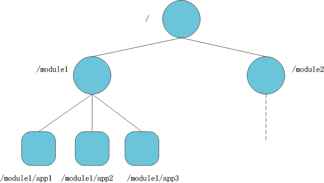
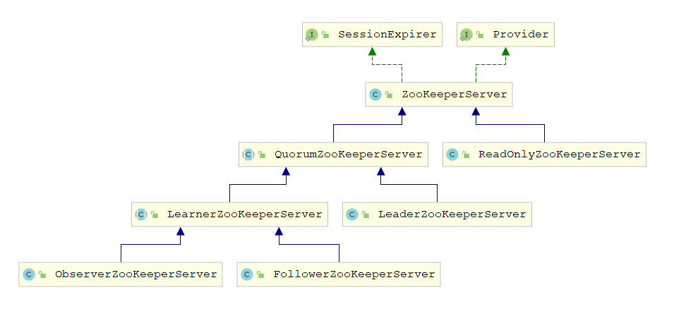
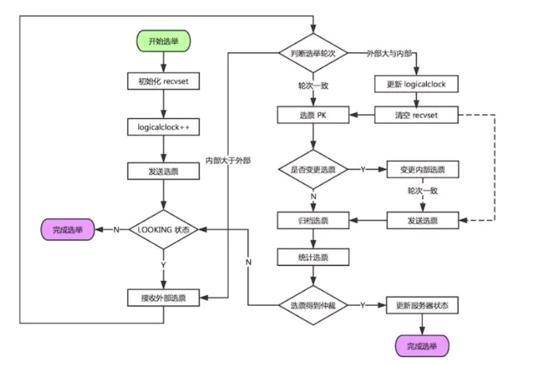

# ZooKeeper 

ZooKeeper 是一个开源的分布式协调服务，ZooKeeper 的设计目标是将那些复杂且容易出错的分布式一致性服务封装起来，构成一个高效可靠的原语集，并以一系列简单易用的接口提供给用户使用。ZooKeeper 是一个典型的分布式数据一致性解决方案，分布式应用程序可以基于 ZooKeeper 实现诸如数据发布/订阅、负载均衡、命名服务、分布式协调/通知、集群管理、Master 选举、分布式锁和分布式队列等功能。

ZooKeeper 将数据保存在内存中，这也就保证了 高吞吐量和低延迟（但是内存限制了能够存储的容量不太大，此限制也是保持ZNode中存储的数据量较小的进一步原因）。

ZooKeeper 底层其实只提供了两个功能：

* 管理（存储、读取）用户程序提交的数据
* 为用户程序提供数据结点监听服务

## ZooKeeper 重要概念

### 集群角色

ZooKeeper 本身就是一个分布式程序，为了保证高可用，需要以以集群形态来部署 ZooKeeper；ZooKeeper 集群是一个基于主从复制的高可用集群；有以下3种角色

| 角色     | 工作描述                                                     |
| -------- | ------------------------------------------------------------ |
| Leader   | 1. 事务请求的唯一调度和处理者，保证集群事务处理的顺序性; 2. 集群内部各服务器的调度者; |
| Follower | 1. 处理客户端非事务请求，转发事务请求给 Leader服务器； 2. 参与事务请求 Proposal的投票； 3. 参与 Leader选举投票. |
| Observer | 1. Observer和Follower类似，唯一的区别在于Observer不参与投票和选举； 2. 增加Observer可以在不影响写性能的情况下提高读性能 |

### 会话(Session)

- session是客户端与ZooKeeper 服务端之间建立的长链接；
- ZooKeeper 在一个会话中进行心跳检测来感知客户端链接的存活；
- ZooKeeper 客户端在一个会话中接收来自服务端的watch事件通知；
- ZooKeeper 可以给会话设置超时时间；

### 数据结点(ZNode)

- ZNode是ZooKeeper 树形结构中的数据结点，用于存储数据；
- ZNode分为持久结点和临时结点两种类型：
  - **持久结点(PERSISTENT)**：一旦创建，除非主动调用删除操作，否则一直存储在ZooKeeper 上；
  - **持久有序结点(PERSISTENT_SEQUENTIAL)**：每个结点都会为它的一级子结点维护一个顺序；
  - **临时结点(EPHEMERAL)**：临时结点的生命周期和客户端的会话绑定在一起，当客户端会话失效该结点自动清理；
  - **临时有序结点(EPHEMERAL_SEQUENTIAL)**：在临时结点的基础上多了一个顺序性
  - **CONTAINER**：当子结点都被删除后，Container 也随即删除
  - **PERSISTENT_WITH_TTL和PERSISTENT_SEQUENTIAL_WITH_TTL**：带TTL（time-to-live，存活时间）的永久结点，客户端断开连接后，结点在TTL时间之内没有得到更新并且没有孩子结点，就会被自动删除。

### 版本

- Version：代表当前ZNode的版本；
- CVersion：代表当前ZNode的子结点的版本，子结点发生变化时会增加该版本号的值；
- AVersion：代表当前ZNode的ACL(访问控制)的版本，修改结点的访问控制权限时会增加该版本号的值；

### Watcher

- watcher监听在ZNode结点上；
- 当结点的数据更新或子结点的状态发生变化都会使客户端的watcher得到通知；

### ACL(访问控制)

有以下几种访问控制权限：

- CREATE：创建子结点的权限；
- READ：获取结点数据和子结点列表的权限；
- WRITE：更新结点数据的权限；
- DELETE: 删除子结点的权限；
- ADMIN：设置结点ACL的权限；

## ZooKeeper 特点

- **顺序一致性**：从同一客户端发起的事务请求，最终将会严格地按照顺序被应用到 ZooKeeper 中去
- **原子性**：所有事务请求的处理结果在整个集群中所有机器上的应用情况是一致的，也就是说，要么整个集群中所有的机器都成功应用了某一个事务，要么都没有应用
- **单一系统映像**：无论客户端连到哪一个 ZooKeeper 服务器上，其看到的服务端数据模型都是一致的
- **可靠性**：一旦一次更改请求被应用，更改的结果就会被持久化，直到被下一次更改覆盖

## 一致性协议

### 2PC

**2PC**：是Two- Phase commit的缩写，即二阶段提交，是计算机网络尤其是在数据库领域内，为了使基于分布式系统架构下的所有结点在进行事务处理过程中能够保持原子性和一致性而设计的一种算法；

顾名思义，二阶段提交协议是将事务的提交过程分成了两个阶段来进行处理，其执行流程如下

**阶段一：提交事务请求**

类似投票阶段，而且是一票否决

1. **事务询问**

   协调者向所有的参与者发送事务内容，询问是否可以执行事务提交操作，并开始等待各参与者的响应 

2. **执行事务**

   各参与者结点执行事务操作，并将Undo和Redo信息记入事务日志中

3. **各参与者向协调者反馈事务响应**

   如果参与者成功执行了事务，反馈Yes响应，表示事务可以执行；

   如果参与者没有成功执行事务，反馈No响应，表示事务不可以执行。

**阶段二：执行事务提交**

在阶段二中，协调者会根据各参与者的反馈情况来决定最终是否可以进行事务提交操作，包含以下两种可能
**执行事务提交**：所有的反馈都是Yes响应

1. **发送提交请求**

   协调者向所有参与者结点发出 Commit请求

2. **事务提交**

   参与者接收到 Commit请求后，会正式执行事务提交操作，并在完成提交之后释放在整个事务执行期间占用的事务资源

3. **反馈事务提交结果**

   参与者在完成事务提交之后,向协调者发送Ack消息

4. **完成事务**

   协调者接收到所有参与者反馈的Ack消息后，完成事务

**中断事务：**任何一个参与者反馈了No响应，或者等待超时

1. **发送回滚请求**

   协调者向所有参与者结点发出 Rollback请求

2. **事务回滚**

   参与者接收到 Rollback请求后，会利用其在阶段一中记录的Undo信息来执行事务回滚操作，并在完成回滚之后释放在整个事务执行期间占用的资源

3. **反馈事务回滚结果**

   参与者在完成事务回滚之后，向协调者发送Ack消息

4. **中断事务**

   协调者接收到所有参与者反馈的Ack消息后，完成事务中断.

二阶段提交将一个事务的处理过程分为了投票和执行两个阶段，其核心是对每个事务都采用先尝试后提交的处理方式，因此也可以将二阶段提交看作一个强一致性的算法；

**优点：**原理简单，实现方便

**缺点：**同步阻塞、单点问题、数据不一致、容错性

* 同步阻塞：在二阶段提交的执行过程中，所有参与的事务都处于阻塞状态，会导致无法进行其他操作
* 单点问题：协调者在2PC过程中作用非常重要，职责过重，如果协调者出现问题，会导致整个事务操作不可用
* 数据不一致：如果阶段二提交过程中，Commit请求中发生网络异常等问题，会导致只有部分参与者进行事务提交，使得数据和其它未提交的参与者不一致
* 容错性：由于投票阶段使用一票否决制，导致在复杂的网络环境下容错性非常差，只要有一台参与者发生故障或网络问题，整个事务一直失败

### 3PC

**3PC**：是 Three-Phase Commit的缩写，即三阶段提交，是2PC的改进版，其将二阶段提交协议的"提交事务请求"过程一分为二，形成了由 Can Commit、 PreCommit和 do Commit三个阶段组成的事务处理协议；

**阶段一: Can Commit**

1. **事务询问**

   协调者向所有的参与者发送一个包含事务内容的can Commit请求，询问是否可以执行事务提交操作，并等待各参与者的响应. 

2. **各参与者向协调者反馈响应.**

   参与者在接收到来自协调者的 can Commit请求后，如果其自身认为可以顺利执行事务，反馈Yes响应，并进入预备状态，

   否则反馈No响应

**阶段二: Pre Commit**

在阶段二中，协调者会根据参与者的反馈情况来决定是否可以进行事务的 PreCommit操作，包含两种可能

**执行事务预提交**：所有的反馈都是Yes响应 

1. **发送预提交请求**

   协调者向所有参与者结点发出 pre Commit的请求，并进入 Prepared阶段.

2. **事务预提交**

   参与者接收到 pre Commit请求后，会执行事务操作，并将Undo和Redo信息记录到事务日志中 

3. **各参与者向协调者反馈事务执行的响应**

   如果参与者成功执行了事务操作，那么就会反馈给协调者Ack响应，同时等待最终的指令:提交( commit)或中止( abort)

**中断事务：**任何一个参与者反馈了No响应，或者等待超时

1. **发送中断请求**

   协调者向所有参与者结点发出 abort请求.

2. **中断事务**

   无论是收到来自协调者的abort请求，或者是在等待协调者请求过程中出现超时，参与者都会中断事务.

**阶段三: do Commit**

真正的事务提交，会存在以下两种可能的情况

**执行提交**

1. **发送提交请求**

   进入这一阶段，假设协调者处于正常工作状态，并且它接收到了来自所有参与者的Ack响应，那么它将从"预提交"状态转换到"提交"状态，并向所有的参与者发送 do Commit请求.

2. **事务提交**

   参与者接收到 do Commit请求后，会正式执行事务提交操作，并在完成提交之后释放在整个事务执行期间占用的事务资源

3. **反馈事务提交结果**

   参与者在完成事务提交之后，向协调者发送Ack消息

4. **完成事务**

   协调者接收到所有参与者反馈的Ack消息后，完成事务

**中断事务：**任何一个参与者反馈了No响应，或者等待超时

1. **发送中断请求**

   协调者向所有参与者结点发出 abort请求

2. **事务回滚**

   参与者接收到 abort请求后，会利用其在阶段二中记录的Undo信息来执行事务回滚操作，并在完成回滚之后释放在整个事务执行期间占用的资源

3. **反馈事务回滚结果**

   参与者在完成事务回滚之后，向协调者发送Ack消息

4. **中断事务**

   协调者接收到所有参与者反馈的Ack消息后，完成事务中断.

**优点：**相较于二阶段提交协议，三阶段提交协议最大的优点就是降低了参与者的阻塞范围，并且能够在出现单点故障后继续达成

**缺点：**三阶段提交协议在去除阻塞的同时也引入了新的问题，那就是在参与者接收到 pre Commit消息后，如果网络出现分区，此时协调者所在的结点和参与者无法进行正常的网络通信，在这种情况下，该参与者依然会进行事务的提交，这必然出现数据的不一致性.

### PAXOS协议

Paxos三种角色：Proposer, Acceptor, Learner 

* **Proposer**：只要 Proposer发的提案被半数以上 Acceptor接受，Proposer就认为该提案里的value被选定
* **Acceptor**：只要 Acceptor接受了某个提案，Acceptor 就认为该提案里的 value被选定了
* **Learner**: Acceptor告诉 Learner哪个 value被选定，Learner就认为那个value被选定

Paxos算法分为两个阶段：

**阶段一(准 leader 确定)**

1. Proposer选择一个提案编号N，然后向半数以上的 Acceptor发送编号为N的 Prepare请求
2. 如果一个 Acceptor收到一个编号为N的 Prepare请求，且N大于该 Acceptor已经响应过的所有 Prepare请求的编号，那么它就会将它已经接受过的编号最大的提案(如果有的话)作为响应反馈给 Proposer，同时该 Acceptor承诺不再接受任何编号小于N的提案

**阶段二( Leader确认)**

1. 如果 Proposer收到半数以上 Acceptor对其发出的编号为N的 Prepare请求的响应，那么它就会发送一个针对[N，V]提案的 Accept请求给半数以上的 Acceptor（注意：V就是收到的响应中编号最大的提案的value，如果响应中不包含任何提案，那么V就由 Proposer自己决定）
2. 如果 Acceptor收到一个针对编号为N的提案的 Accept请求，只要该 Acceptor没有对编号大于N的 Prepare请求做出过响应，它就接受该提案.

### ZAB 协议 

> ZAB协议的核心是定义了对于那些会改变ZooKeeper服务器数据状态的事务请求的处理方式，即：
>
> 所有事务请求必须由一个全局唯一的服务器来协调处理，这样的服务器被称为 Leader服务器，而余下的其他服务器则成为 Follower服务器。Leader服务器负责将一个客户端事务请求转换成一个事务 Proposal(提议)，并将该 Proposal分发给集群中所有的Follower服务器。之后 Leader服务器需要等待所有 Follower服务器的反馈，一旦超过半数的 Follower服务器进行了正确的反馈后，那么 Leader就会再次向所有的 Follower服务器分发 Commit消息，要求其将前一个 Proposal进行提交。

ZAB协议包括两种基本的模式，分别是 **崩溃恢复和消息广播**。

**消息广播：**广播的过程实际上是一个简化的2PC过程：

1. Leader 接收到消息请求后，将消息赋予一个全局唯一的 64 位自增 id(事务ID)，叫做：zxid，通过 zxid 的大小比较即可实现因果有序这一特性。
2. Leader 通过FIFO先进先出队列（通过 TCP 协议来实现，以此实现了全局有序这一特性）将带有 zxid 的消息作为一个提案（proposal）分发给所有 follower。
3. 当 follower 接收到 proposal，先将 proposal 写到硬盘，写硬盘成功后再向 leader 回一个 ACK。
4. 当 leader 接收到合法数量（超过半数结点）的 ACKs 后，leader 就向所有 follower 发送 COMMIT 命令，同事会在本地执行该消息。
5. 当 follower 收到消息的 COMMIT 命令时，就会执行该消息

在这种简化了的二阶段提交模型下，是无法处理 Leader服务器崩溃退出而带来的数据不一致问题的，因此在ZAB协议中添加了另一个模式，即釆用崩溃恢复模式来解决这个问题。另外，整个消息广播协议是基于具有FIFO特性的TCP协议来进行网络通信的，因此能够很容易地保证消息广播过程中消息接收与发送的顺序性。

**崩溃恢复：** ZAB 协议的广播部分不能处理 leader 挂掉的情况，ZAB 协议引入了恢复模式来处理这一问题。为了使 leader 挂了后系统能正常工作，需要解决以下两个问题：

**已经被处理的消息不能丢**

为了实现已经被处理的消息不能丢这个目的，ZAB 的恢复模式使用了以下的策略：

1. 选举拥有 proposal 最大值（即 zxid 最大） 的结点作为新的 leader：由于所有提案被 COMMIT 之前必须有合法数量的 follower ACK，即必须有合法数量的服务器的事务日志上有该提案的 proposal，因此，只要有合法数量的结点正常工作，就必然有一个结点保存了所有被 COMMIT 消息的 proposal 状态。
2. 新的 leader 将自己事务日志中 proposal 但未 COMMIT 的消息处理。
3. 新的 leader 与 follower 建立先进先出的队列， 先将自身有而 follower 没有的 proposal 发送给 follower，再将这些 proposal 的 COMMIT 命令发送给 follower，以保证所有的 follower 都保存了所有的 proposal、所有的 follower 都处理了所有的消息。
   通过以上策略，能保证已经被处理的消息不会丢

**被丢弃的消息不能再次出现**

ZAB 通过巧妙的设计 zxid 来实现这一目的。一个 zxid 是64位，高 32 是朝代（epoch）编号，每经过一次 leader 选举产生一个新的 leader，新 leader 会将 epoch 号 +1。低 32 位是消息计数器，每接收到一条消息这个值 +1，新 leader 选举后这个值重置为 0。这样设计的好处是旧的 leader 挂了后重启，它不会被选举为 leader，因为此时它的 zxid 肯定小于当前的新 leader。当旧的 leader 作为 follower 接入新的 leader 后，新的 leader 会让它将所有的拥有旧的 epoch 号的未被 COMMIT 的 proposal 清除。

ZAB 的核心：少数服从多数；资历老（处理的事务最多，zxid最大）的结点优先继位

## ZooKeeper 数据模型

在ZooKeeper中，结点也称为ZNode。由于对于程序员来说，对ZooKeeper 的操作主要是对ZNode的操作;

ZooKeeper采用了类似文件系统的的数据模型，其结点构成了一个具有层级关系的树状结构

ZNode是ZooKeeper 树形结构中的数据结点，用于存储数据；

ZNode分为持久结点和临时结点两种类型：

- **持久结点(PERSISTENT)**：一旦创建，除非主动调用删除操作，否则一直存储在ZooKeeper 上；
- **持久有序结点(PERSISTENT_SEQUENTIAL)**：每个结点都会为它的一级子结点维护一个顺序；
- **临时结点(EPHEMERAL)**：临时结点的生命周期和客户端的会话绑定在一起，当客户端会话失效该结点自动清理；
- **临时有序结点(EPHEMERAL_SEQUENTIAL)**：在临时结点的基础上多了一个顺序性
- **CONTAINER**：当子结点都被删除后，Container 也随即删除
- **PERSISTENT_WITH_TTL和PERSISTENT_SEQUENTIAL_WITH_TTL**：带TTL（time-to-live，存活时间）的永久结点，客户端断开连接后，结点在TTL时间之内没有得到更新并且没有孩子结点，就会被自动删除。

**事务ID**：在ZooKeeper中，事务是指能够改变 ZooKeeper 服务器状态的操作，我们也称之为事务操作或更新操作，一般包括数据结点创建与删除、数据结点内容更新和客户端会话创建与失效等操作。

**对于每一个事务请求，ZooKeeper 都会为其分配一个全局唯一的事务ID,用 ZXID 来表示**，通常是一个64位的数字。每一个ZXID对应一次更新操作，**从这些 ZXID 中可以间接地识别出ZooKeeper处理这些更新操作请求的全局顺序**。

实现中zxid 是一个64 位的数字，它高32 位是epoch（ZAB 协议通过epoch 编号来区分Leader 周期变化的策略）用来标识leader 关系是否改变，每次一个leader 被选出来，它都会有一个新的epoch=（原来的epoch+1），标识当前属于那个leader 的统治时期。低32 位用于递增计数。

### ZNode状态属性

|    状态属性    | 说明                                                         |
| :------------: | :----------------------------------------------------------- |
|     czxid      | Created ZXID，表示该数据节点被创建时的事务ID                 |
|     mzxid      | Modified ZXID，表示该节点最后一次被更新时的事务ID            |
|     ctime      | Created Time，表示节点被创建的时间                           |
|     mtime      | Modified Time，表示该节点最后一次被更新的时间                |
|    version     | 数据节点的版本号                                             |
|    cversion    | 子节点的版本号                                               |
|    aversion    | 节点的ACL版本号                                              |
| ephemeralOwner | 创建该临时节点的会话的 session；如果该节点是持久节点，那么这个属性值为0 |
|   dataLength   | 数据内容的长度                                               |
|  numChildren   | 当前节点的子节点个数                                         |
|     pzxid      | 表示该节点的子节点列表最后一次被修改时的事务ID； 注意：只有子节点列表变更了才会变更 pzxid，子节点内容变更不会影响 pzxid |

### 版本

**保证分布式数据原子性操作**

ZooKeeper中为数据结点引入了版本的概念，每个数据结点都具有三种类型的版本信息，对数据结点的任何更新操作都会引起版本号的变化 

| 版本类型 | 说明                                                         |
| -------- | ------------------------------------------------------------ |
| version  | 当前数据节点数据内容的版本号；每次对节点进行更新操作，version的值都会增加1 |
| cversion | 当前数据节点子节点的版本号                                   |
| aversion | 当前数据节点ACL变更版本号                                    |

## ZooKeeper 原理

### **ZooKeeper 一致性**

简单来说：顺序一致性是针对单个操作，单个数据对象。属于CAP 中C这个范畴。一个数据被更新后，能够立马被后续的读操作读到。

client 会记录自己已经读取到的最大的zxid，如果client 重连到server 发现 client 的zxid 更大。连接会失败；client 只要连接过一次ZooKeeper ，就不会有历史的倒退

### ZooKeeper 分布式锁

**利用结点的唯一性来实现分布式锁**

多个进程往ZooKeeper 的指定结点下创建一个相同名称的结点，只有一个能成功，其余创建失败；创建失败的结点全部通过ZooKeeper 的watcher 机制来监听ZooKeeper 这个子结点的变化，一旦监听到子结点的删除事件，则再次触发所有进程去写锁；

这种实现方式很简单，但是会产生“惊群效应”，简单来说就是如果存在许多的客户端在等待获取锁，当成功获取到锁的进程释放该结点后，所有处于等待状态的客户端都会被唤醒，这个时候ZooKeeper 在短时间内发送大量子结点变更事件给所有待获取锁的客户端，然后实际情况是只会有一个客户端获得锁。如果在集群规模比较大的情况下，会对ZooKeeper 服务器的性能产生比较的影响。

**利用临时有序结点来实现分布式锁**

- 多个进程往ZooKeeper 的指定结点下创建一个临时顺序结点
- 如果自己不是第一个结点，就对自己上一个结点加监听器
- 只要上一个结点释放锁，自己就可以获得锁，相当于是一个排队机制。

## Leader 选举

**myid：**每个ZooKeeper服务器，都需要在数据文件夹下创建一个名为myid的文件，该文件包含整个ZooKeeper集群唯一的ID（整数），编号越大在选举算法中的权重越大

**zxid：**事务ID，值越大说明数据越新，在选举算法中的权重也越大

**逻辑时钟（epoch –logicalclock）：**或者叫投票的次数，同一轮投票过程中的逻辑时钟值是相同的。每投完一次票这个数据就会增加，然后与接收到的其它服务器返回的投票信息中的数值相比，根据不同的值做出不同的判断。

**服务器状态：**

* LOOKING，竞选状态。
* FOLLOWING，随从状态，同步leader 状态，参与投票。
* OBSERVING，观察状态,同步leader 状态，不参与投票。
* LEADING，领导者状态。

### 启动期间的Leader 选举

每个结点启动的时候状态都是LOOKING，处于观望状态，接下来就开始进行选主流程

若进行Leader 选举，则至少需要两台机器，这里选取3 台机器组成的服务器集群为例。在集群初始化阶段，当有一台服务器Server1 启动时，其单独无法进行和完成Leader 选举，当第二台服务器Server2 启动时，此时两台机器可以相互通信，每台机器都试图找到Leader，于是进入Leader选举过程。选举过程如下

1. **每个Server 发出一个投票：**由于是初始情况，Server1 和Server2 都会将自己作为Leader 服务器来进行投票，每次投票会包含所推举的服务器的myid 和ZXID、epoch，使用(myid, ZXID,epoch)来表示，此时Server1 的投票为(1, 0)，Server2 的投票为(2, 0)，然后各自将这个投票发给集群中其他机器。

2. **接受来自各个服务器的投票：**集群的每个服务器收到投票后，首先判断该投票的有效性，如检查是否是本轮投票（epoch）、是否来自LOOKING 状态的服务器。

3. **处理投票：**针对每一个投票，服务器都需要将别人的投票和自己的投票进行PK，PK 规则如下

   i. 优先比较epoch

   ii. 其次检查ZXID。ZXID 比较大的服务器优先作为Leader

   iii. 如果ZXID 相同，那么就比较myid，myid 较大的服务器作为Leader 服务器

   对于Server1 而言，它的投票是(1, 0)，接收Server2 的投票为(2, 0)，首先会比较两者的ZXID，均为0，再比较myid，此Server2 的myid 最大，于是更新自己的投票为(2, 0)，然后重新投票，对于Server2 而言，其无须更新自己的投票，只是再次向集群中所有机器发出上一次投票信息即可。
   
4. **统计投票：**每次投票后，服务器都会统计投票信息，判断是否已经有过半机器接受到相同的投票信息，对于Server1、Server2 而言，都统计出集群中已经有两台机器接受了(2, 0)的投票信息，此时便认为已经选出了Leader。

5. **改变服务器状态：**一旦确定了Leader，每个服务器就会更新自己的状态，如果是Follower，那么就变更为FOLLOWING，如果是Leader，就变更为LEADING。

### 运行期间的Leader 选举

当集群中的leader 服务器出现宕机或者不可用的情况时，那么整个集群将无法对外提供服务，而是进入新一轮的Leader 选举，服务器运行期间的Leader 选举和启动时期的Leader 选举基本过程是一致的。

1. **变更状态**：Leader 挂后，余下的非Observer 服务器都会将自己的服务器状态变更为LOOKING，然后开始进入Leader 选举过程。
2. **每个Server 会发出一个投票**：在运行期间，每个服务器上的ZXID 可能不同，此时假定Server1 的ZXID 为123，Server3 的ZXID 为122；在第一轮投票中，Server1 和Server3 都会投自己，产生投票(1, 123)，(3, 122)，然后各自将投票发送给集群中所有机器。接收来自各个服务器的投票。与启动时过程相同。
3. **处理投票**：与启动时过程相同，此时，Server1 将会成为Leader。
4. **统计投票**：与启动时过程相同。
5. **改变服务器的状态**：与启动时过程相同

# 源码分析

## 基础类

### DataNode

~~~java
public class DataNode implements Record { 
    // 结点数据
    byte data[]; 
    // ACL权限信息
    Long acl; 
    // 状态信息
    public StatPersisted stat; 
    // 子结点集合
    private Set<String> children = null;
}
~~~

#### StatPersisted

状态信息

~~~java
public class StatPersisted implements Record {
    // Created ZXID，表示该数据结点被创建时的zxid
    private long czxid;
    // Modified ZXID，表示该结点最后一次被更新时的zxid
    private long mzxid;
    // 创建时间
    private long ctime;
    // 最后修改时间
    private long mtime;
    // 版本号
    private int version;
    // 子结点的版本号
    private int cversion;
    // 结点的ACL版本号
    private int aversion;
    // 创建该临时结点的会话的 session；如果该结点是持久结点，那么这个属性值为0
    private long ephemeralOwner;
    // 表示该结点的子结点列表最后一次被修改时的zxid
    private long pzxid;
}
~~~

### DataTree

~~~java
public class DataTree {
    // path 到 ZNode的映射
    private final ConcurrentHashMap<String, DataNode> nodes =
        new ConcurrentHashMap<String, DataNode>();
    // data 监听
    private final WatchManager dataWatches = new WatchManager();
    // 子结点监听
    private final WatchManager childWatches = new WatchManager();
	// 上次处理的zxid
    public volatile long lastProcessedZxid = 0;
    // 记录临时结点,key是sessionId,value是这个sessionId涉及到的path
    private final Map<Long, HashSet<String>> ephemerals = new ConcurrentHashMap<Long, HashSet<String>>(); 
    // container 结点集合 （当子结点都被删除后，Container 也随即删除）
    private final Set<String> containers =
            Collections.newSetFromMap(new ConcurrentHashMap<String, Boolean>());
 
    // ttl 结点集合
    // 带TTL（time-to-live，存活时间）的永久结点，客户端断开连接后，
    // 结点在TTL时间之内没有得到更新并且没有孩子结点，就会被自动删除
    private final Set<String> ttls = Collections.newSetFromMap(new ConcurrentHashMap<String, Boolean>());
}
~~~

### 序列化

## 网络通信

### 通信数据结构

#### packet

Packet是ClientCnxn内部定义的一个堆协议层的封装，用作ZooKeeper中请求和响应的载体

~~~java
static class Packet {
    // 请求头
    RequestHeader requestHeader;
    // 响应头
    ReplyHeader replyHeader;
    // 请求体
    Record request;
    // 响应体
    Record response;
    // 序列化后的字节数据
    ByteBuffer bb; 
    // client结点路径
    String clientPath; 
    // server结点路径
    String serverPath;
    // 是否完成
    boolean finished;
    // 异步回调
    AsyncCallback cb;
    // 上下文
    Object ctx;
    // 注册的watcher
    WatchRegistration watchRegistration;
    // 是否只读
    public boolean readOnly;
    // 取消注册的watcher
    WatchDeregistration watchDeregistration;
}
~~~

### Server

#### 启动过程

##### QuorumPeerMain.main 

启动方法中调用runFromConfig(config)

~~~java
public void runFromConfig(QuorumPeerConfig config) {
    ServerCnxnFactory cnxnFactory = null;
    ServerCnxnFactory secureCnxnFactory = null;

    if (config.getClientPortAddress() != null) {
        cnxnFactory = ServerCnxnFactory.createFactory();
        cnxnFactory.configure(config.getClientPortAddress(), config.getMaxClientCnxns(), false);
    }

    if (config.getSecureClientPortAddress() != null) {
        secureCnxnFactory = ServerCnxnFactory.createFactory();
       secureCnxnFactory.configure(config.getSecureClientPortAddress(),config.getMaxClientCnxns(),true);
    }
}
~~~

##### createFactory 

创建对应的通信工厂

~~~java
static public ServerCnxnFactory createFactory() throws IOException {
    // 获取参数
    String serverCnxnFactoryName = System.getProperty(ZOOKEEPER_SERVER_CNXN_FACTORY);
    // 默认NIOServerCnxnFactory
    if (serverCnxnFactoryName == null) {
        serverCnxnFactoryName = NIOServerCnxnFactory.class.getName();
    }
    try {
        // 加载class,通过反射创建实例
        ServerCnxnFactory serverCnxnFactory = (ServerCnxnFactory) Class.forName(serverCnxnFactoryName)
            .getDeclaredConstructor().newInstance(); 
        return serverCnxnFactory;
    } catch (Exception e) {
        IOException ioe = new IOException("Couldn't instantiate "  + serverCnxnFactoryName);
        ioe.initCause(e);
        throw ioe;
    }
}
~~~

##### ServerCnxnFactory

线程 quorumPeer启动过程中，启动ServerCnxnFactory

~~~java
public class QuorumPeer extends ZooKeeperThread implements QuorumStats.Provider {
    @Override
    public synchronized void start() { 
        // ...
        // 启动 网络通信 NIO 或 Netty
        startServerCnxnFactory();
        // ...
        // 线程启动 执行run()
        super.start();
    }
}
private void startServerCnxnFactory() {
    if (cnxnFactory != null) {
        cnxnFactory.start();
    }
    if (secureCnxnFactory != null) {
        secureCnxnFactory.start();
    }
}
~~~

##### NIOServerCnxnFactory

~~~java
public class NIOServerCnxnFactory extends ServerCnxnFactory {
    // 负责关闭到期的Session的线程
    private ConnectionExpirerThread expirerThread;
    // Reactor单线程模式的acceptor线程,负责接收请求,转发给SelectorThread
    private AcceptThread acceptThread;
    // Reactor单线程模式的worker线程,负责处理IO
    private final Set<SelectorThread> selectorThreads =  new HashSet<SelectorThread>();
    
    
    @Override
    public void start() {
        stopped = false;
        if (workerPool == null) {
            workerPool = new WorkerService(
                "NIOWorker", numWorkerThreads, false);
        }
        // Reactor单线程模式的worker线程,负责处理IO
        for(SelectorThread thread : selectorThreads) {
            if (thread.getState() == Thread.State.NEW) {
                thread.start();
            }
        } 
        // 启动acceptor线程,负责接收请求
        if (acceptThread.getState() == Thread.State.NEW) {
            acceptThread.start();
        }
        // 负责关闭到期的Session
        if (expirerThread.getState() == Thread.State.NEW) {
            expirerThread.start();
        }
    }
}
~~~

##### NettyServerCnxnFactory

~~~java
public class NettyServerCnxnFactory extends ServerCnxnFactory {	
    // Netty API
    private final ServerBootstrap bootstrap;
    private Channel parentChannel;
    private final ChannelGroup allChannels = 
        new DefaultChannelGroup("zkServerCnxns", new DefaultEventExecutor()); 
    private final Map<InetAddress, Set<NettyServerCnxn>> ipMap = new HashMap<>();
	NettyServerCnxnFactory() {
        x509Util = new ClientX509Util();
        // Netty API boss线程,默认为1
        EventLoopGroup bossGroup = NettyUtils.newNioOrEpollEventLoopGroup(
                NettyUtils.getClientReachableLocalInetAddressCount());
        // worker线程
        EventLoopGroup workerGroup = NettyUtils.newNioOrEpollEventLoopGroup();
        ServerBootstrap bootstrap = new ServerBootstrap()
                .group(bossGroup, workerGroup)
                .channel(NettyUtils.nioOrEpollServerSocketChannel())
                // parent channel options
                .option(ChannelOption.SO_REUSEADDR, true)
                // child channels options
                .childOption(ChannelOption.TCP_NODELAY, true)
                .childOption(ChannelOption.SO_LINGER, -1)
                .childHandler(new ChannelInitializer<SocketChannel>() {
                    @Override
                    protected void initChannel(SocketChannel ch) throws Exception {
                        ChannelPipeline pipeline = ch.pipeline();
                        if (secure) {
                            initSSL(pipeline);
                        }
                        pipeline.addLast("servercnxnfactory", channelHandler);
                    }
                });
        this.bootstrap = configureBootstrapAllocator(bootstrap);
        this.bootstrap.validate();
    }
	@Override
    public void start() {
        LOG.info("binding to port {}", localAddress);
        // 绑定地址
        parentChannel = bootstrap.bind(localAddress).syncUninterruptibly().channel();
        // Port changes after bind() if the original port was 0, update
        // localAddress to get the real port.
        localAddress = (InetSocketAddress) parentChannel.localAddress();
        LOG.info("bound to port " + getLocalPort());
    }
}
~~~

#### ServerCnxn

表示服务器连接，表示一个从客户端到服务器的连接

~~~java
public abstract class ServerCnxn implements Stats, Watcher {
    // 代表由本类提出的请求,设置所有者时使用
    final public static Object me = new Object(); 
    // 认证信息
    protected ArrayList<Id> authInfo = new ArrayList<Id>();
    // Zookeeper的Sasl服务器
    protected ZooKeeperSaslServer zooKeeperSaslServer = null;
    // 服务器状态
    protected abstract ServerStats serverStats();
    // 创建连接的时间
    protected final Date established = new Date();
    // 接受的packet数量
    protected final AtomicLong packetsReceived = new AtomicLong();
    //  发送的packet数量
    protected final AtomicLong packetsSent = new AtomicLong();
    // 最小延迟
    protected long minLatency;
    // 最大延迟
    protected long maxLatency;
    // 最后操作类型
    protected String lastOp;
    // 最后的cxid
    protected long lastCxid;
    // 最后的zxid
    protected long lastZxid;
    // 最后的响应时间
    protected long lastResponseTime;
    // 最后的延迟
    protected long lastLatency;
    // 数量
    protected long count;
    // 总的延迟
    protected long totalLatency;
}
~~~

##### 认证

~~~java
// 获取认证信息,返回不可修改的列表
public List<Id> getAuthInfo() {
    return Collections.unmodifiableList(authInfo);
}

// 添加认证信息
public void addAuthInfo(Id id) {
    if (authInfo.contains(id) == false) {
        authInfo.add(id);
    }
}
// 移除认证信息
public boolean removeAuthInfo(Id id) {
    return authInfo.remove(id);
}
~~~

##### 接收和发送packet

~~~java
// 接收数据包
protected void packetReceived() {
    // 增加接收的packet数量
    incrPacketsReceived();
    ServerStats serverStats = serverStats();
    if (serverStats != null) {
        serverStats().incrementPacketsReceived();
    }
}

// 发送数据包
protected void packetSent() {
    // 增加发送的packet数量
    incrPacketsSent();
    ServerStats serverStats = serverStats();
    if (serverStats != null) {
        serverStats.incrementPacketsSent();
    }
}
~~~

##### 发送响应

~~~java
public void sendResponse(ReplyHeader h, Record r, String tag) throws IOException {
    ByteArrayOutputStream baos = new ByteArrayOutputStream();
    // Make space for length
    BinaryOutputArchive bos = BinaryOutputArchive.getArchive(baos);
    try {
        baos.write(fourBytes);
        bos.writeRecord(h, "header");
        if (r != null) {
            bos.writeRecord(r, tag);
        }
        baos.close();
    } catch (IOException e) { 
    }
    byte b[] = baos.toByteArray();
    serverStats().updateClientResponseSize(b.length - 4);
    ByteBuffer bb = ByteBuffer.wrap(b);
    bb.putInt(b.length - 4).rewind();
    // 写入buffer
    sendBuffer(bb);
}
~~~

#### NIOServerCnxn

~~~java
public class NIOServerCnxn extends ServerCnxn {
    private static final Logger LOG = LoggerFactory.getLogger(NIOServerCnxn.class);
    // ServerCnxn工厂
    private final NIOServerCnxnFactory factory;
    // NIO channel
    private final SocketChannel sock;
    // selector 线程
    private final SelectorThread selectorThread;
    // 多路复用key
    private final SelectionKey sk;
    // 初始化标志
    private boolean initialized;
    // 分配四个字节缓冲区, 记录长度
    private final ByteBuffer lenBuffer = ByteBuffer.allocate(4);
    // 真正的缓冲区
    private ByteBuffer incomingBuffer = lenBuffer;
    // 缓冲队列
    private final Queue<ByteBuffer> outgoingBuffers = new LinkedBlockingQueue<ByteBuffer>();
    // 会话超时时间
    private int sessionTimeout;
    // ZooKeeperServer
    private final ZooKeeperServer zkServer; 
    // 已提交但尚未响应的请求数
    private final AtomicInteger outstandingRequests = new AtomicInteger(0); 
    // 会话ID
    private long sessionId;

    private final int outstandingLimit;
}
~~~

##### sendBuffer

~~~java
public void sendBuffer(ByteBuffer bb) { 
    // 加入缓冲队列
    outgoingBuffers.add(bb); 
    requestInterestOpsUpdate();
}
~~~

##### doIO

~~~java
void doIO(SelectionKey k) throws InterruptedException {
    try {
        if (isSocketOpen() == false) {  
            return;
        }
        // 可读状态
        if (k.isReadable()) {
            int rc = sock.read(incomingBuffer);
            if (rc < 0) {
                throw new EndOfStreamException( );
            }
            if (incomingBuffer.remaining() == 0) {
                boolean isPayload;
                if (incomingBuffer == lenBuffer) { // start of next request
                    incomingBuffer.flip();
                    isPayload = readLength(k);
                    incomingBuffer.clear();
                } else {
                    // continuation
                    isPayload = true;
                }
                if (isPayload) { // not the case for 4letterword
                    readPayload();
                }
                else {
                    // four letter words take care
                    // need not do anything else
                    return;
                }
            }
        }
        // 可写状态
        if (k.isWritable()) {
            // 写入数据
            handleWrite(k);

            if (!initialized && !getReadInterest() && !getWriteInterest()) {
                throw new CloseRequestException("responded to info probe");
            }
        }
    } catch // ...
}
void handleWrite(SelectionKey k) throws IOException, CloseRequestException {
    // 队列为空,返回
    if (outgoingBuffers.isEmpty()) {
        return;
    }
 
    ByteBuffer directBuffer = NIOServerCnxnFactory.getDirectBuffer();
    if (directBuffer == null) {
        ByteBuffer[] bufferList = new ByteBuffer[outgoingBuffers.size()]; 
        sock.write(outgoingBuffers.toArray(bufferList));

        // Remove the buffers that we have sent
        ByteBuffer bb;
        // 循环队列数据,全部发送
        while ((bb = outgoingBuffers.peek()) != null) {
            if (bb == ServerCnxnFactory.closeConn) {
                throw new CloseRequestException("close requested");
            }
            if (bb.remaining() > 0) {
                break;
            }
            // 发送数据包
            packetSent();
            outgoingBuffers.remove();
        }
    } // else ...
}
~~~

#### NettyServerCnxn

~~~java
public class NettyServerCnxn extends ServerCnxn { 
    // 通道
    private final Channel channel;
    // 复合字节缓冲区
    private CompositeByteBuf queuedBuffer;
    private final AtomicBoolean throttled = new AtomicBoolean(false);
    // 字节缓冲
    private ByteBuffer bb;
    // 分配四个字节缓冲区, 记录长度
    private final ByteBuffer bbLen = ByteBuffer.allocate(4);
    // 会话id
    private long sessionId;
    // 超时时间
    private int sessionTimeout;
    private AtomicLong outstandingCount = new AtomicLong();
    private Certificate[] clientChain;
    private volatile boolean closingChannel; 
    // Zookeeper服务器
    private volatile ZooKeeperServer zkServer;

    private final NettyServerCnxnFactory factory;
    // 是否初始化
    private boolean initialized;
}
~~~

##### receiveMessage

~~~java
private void receiveMessage(ByteBuf message) {
    checkIsInEventLoop("receiveMessage");
    try {
        // 可读状态
        while(message.isReadable() && !throttled.get()) {
            if (bb != null) { // bb不为null
                if (bb.remaining() > message.readableBytes()) {
                    int newLimit = bb.position() + message.readableBytes();
                    bb.limit(newLimit);
                }
                // 将message写入bb中
                message.readBytes(bb);
                bb.limit(bb.capacity()); 
                if (bb.remaining() == 0) { // 已经读完message,表示内容已经全部接收
                    // 统计接收信息
                    packetReceived();
                    bb.flip();

                    ZooKeeperServer zks = this.zkServer;
                    if (zks == null || !zks.isRunning()) {
                        throw new IOException("ZK down");
                    }
                    // 是否初始化
                    if (initialized) {
                        // TODO: if zks.processPacket() is changed to take a ByteBuffer[],
                        // we could implement zero-copy queueing.
                        zks.processPacket(this, bb);

                        if (zks.shouldThrottle(outstandingCount.incrementAndGet())) {
                            disableRecvNoWait();
                        }
                    } else { 
                        // 处理连接请求
                        zks.processConnectRequest(this, bb);
                        initialized = true;
                    }
                    bb = null;
                }
            } else { 
                if (message.readableBytes() < bbLen.remaining()) {
                    bbLen.limit(bbLen.position() + message.readableBytes());
                }
                message.readBytes(bbLen);
                bbLen.limit(bbLen.capacity());
                if (bbLen.remaining() == 0) {
                    bbLen.flip(); 
                    int len = bbLen.getInt(); 

                    bbLen.clear();
                    if (!initialized) {
                        if (checkFourLetterWord(channel, message, len)) {
                            return;
                        }
                    }
                    if (len < 0 || len > BinaryInputArchive.maxBuffer) {
                        throw new IOException("Len error " + len);
                    }
                    // 根据len重新分配缓冲，以便接收内容
                    bb = ByteBuffer.allocate(len);
                }
            }
        }
    } catch(IOException e) { 
        close();
    }
}
~~~

##### process

~~~java
@Override
public void process(WatchedEvent event) {
    // 创建响应头
    ReplyHeader h = new ReplyHeader(-1, -1L, 0); 
    // Convert WatchedEvent to a type that can be sent over the wire
    WatcherEvent e = event.getWrapper();

    try {
        // 发送响应到客户端
        sendResponse(h, e, "notification");
    } catch (IOException e1) { 
        close();
    }
}

@Override
public void sendResponse(ReplyHeader h, Record r, String tag)
    throws IOException {
    if (closingChannel || !channel.isOpen()) {
        return;
    }
    // 调用父类的方法
    super.sendResponse(h, r, tag);
    if (h.getXid() > 0) {
        // zks cannot be null otherwise we would not have gotten here!
        if (!zkServer.shouldThrottle(outstandingCount.decrementAndGet())) {
            enableRecv();
        }
    }
}
~~~

#### ServerCnxnFactory

服务端通信的工厂类

~~~java
public abstract class ServerCnxnFactory {	  	
    // 创建对应的Factory
	static public ServerCnxnFactory createFactory() throws IOException {
        // 获取参数
        String serverCnxnFactoryName =
            System.getProperty(ZOOKEEPER_SERVER_CNXN_FACTORY);
        // 默认NIOServerCnxnFactory
        if (serverCnxnFactoryName == null) {
            serverCnxnFactoryName = NIOServerCnxnFactory.class.getName();
        }
        try {
            // 加载class,通过反射创建实例
            ServerCnxnFactory serverCnxnFactory = (ServerCnxnFactory) Class.forName(serverCnxnFactoryName)
                    .getDeclaredConstructor().newInstance(); 
            return serverCnxnFactory;
        } catch (Exception e) {
            IOException ioe = new IOException("Couldn't instantiate "  + serverCnxnFactoryName);
            ioe.initCause(e);
            throw ioe;
        }
    }
}
~~~

#### NIOServerCnxnFactory

~~~java
public class NIOServerCnxnFactory extends ServerCnxnFactory {
	// 是否停止
    private volatile boolean stopped = true;
    // 负责关闭到期的Session的线程
    private ConnectionExpirerThread expirerThread;
    // Reactor单线程模式的acceptor线程,负责接收请求,转发给SelectorThread
    private AcceptThread acceptThread;
    // Reactor单线程模式的worker线程,负责接收accepter传过来的请求,然后交给worker处理
    private final Set<SelectorThread> selectorThreads = new HashSet<SelectorThread>();
    // worker线程,负责真正的IO
    protected WorkerService workerPool;
    // selector线程数量
    private int numSelectorThreads;
    // worker线程数量
    private int numWorkerThreads;
}
~~~

##### start

~~~java
@Override
public void start() {
    stopped = false;
    if (workerPool == null) {
        workerPool = new WorkerService(
            "NIOWorker", numWorkerThreads, false);
    }
    // Reactor单线程模式的worker线程,负责接收accepter传过来的请求,然后交给worker处理
    for(SelectorThread thread : selectorThreads) {
        if (thread.getState() == Thread.State.NEW) {
            thread.start();
        }
    } 
    // 启动acceptor线程,负责接收请求
    if (acceptThread.getState() == Thread.State.NEW) {
        acceptThread.start();
    }
    // 负责关闭到期的Session
    if (expirerThread.getState() == Thread.State.NEW) {
        expirerThread.start();
    }
}
~~~

##### AcceptThread

##### SelectorThread

#### NettyServerCnxnFactory

~~~java
public class NettyServerCnxnFactory extends ServerCnxnFactory {
    
    // Netty API 启动类
    private final ServerBootstrap bootstrap;
    private Channel parentChannel;
    private final ChannelGroup allChannels =
            new DefaultChannelGroup("zkServerCnxns", new DefaultEventExecutor()); 
    private final Map<InetAddress, Set<NettyServerCnxn>> ipMap = new HashMap<>();
    private InetSocketAddress localAddress;
    private int maxClientCnxns = 60;
    private final ClientX509Util x509Util;

    NettyServerCnxnFactory() {
        x509Util = new ClientX509Util();
        // Netty API boss线程,默认为1
        EventLoopGroup bossGroup = NettyUtils.newNioOrEpollEventLoopGroup(
                NettyUtils.getClientReachableLocalInetAddressCount());
        // worker线程
        EventLoopGroup workerGroup = NettyUtils.newNioOrEpollEventLoopGroup();
        ServerBootstrap bootstrap = new ServerBootstrap()
                .group(bossGroup, workerGroup)
                .channel(NettyUtils.nioOrEpollServerSocketChannel())
                // parent channel options
                .option(ChannelOption.SO_REUSEADDR, true)
                // child channels options
                .childOption(ChannelOption.TCP_NODELAY, true)
                .childOption(ChannelOption.SO_LINGER, -1)
                .childHandler(new ChannelInitializer<SocketChannel>() {
                    @Override
                    protected void initChannel(SocketChannel ch) throws Exception {
                        ChannelPipeline pipeline = ch.pipeline();
                        if (secure) {
                            initSSL(pipeline);
                        }
                        // CnxnChannelHandler 处理客户端的请求信息
                        pipeline.addLast("servercnxnfactory", channelHandler);
                    }
                });
        this.bootstrap = configureBootstrapAllocator(bootstrap);
        this.bootstrap.validate();
    }
}
~~~

##### start

~~~java
@Override
public void start() { 
    // 绑定地址
    parentChannel = bootstrap.bind(localAddress).syncUninterruptibly().channel();
    // 如果端口号是0,绑定是会随机分配端口,所以localHost需要重新赋值
    localAddress = (InetSocketAddress) parentChannel.localAddress(); 
}
~~~

##### channelHandler

### Client

以创建结点为例

~~~java
@Test
public void createNode() throws KeeperException, InterruptedException, IOException {
    // 创建ZooKeeper客户端
    ZooKeeper zooKeeper = new ZooKeeper("192.168.7.101:2181", 5000, new TestWatcher())
    // latch.await();
    log.debug("zookeeper test start");
    // 创建 ZooKeeper 结点 (znode ： zoo2, 数据： myData2 ，权限：OPEN_ACL_UNSAFE ，节点类型： Persistent");
    zooKeeper.create("/test/a","A".getBytes(), ZooDefs.Ids.OPEN_ACL_UNSAFE, CreateMode.PERSISTENT);  
}
~~~

#### ZooKeeper

ZooKeeper对象是客户端依赖的对象，客户端所有的功能都依赖于ZooKeeper实现

~~~java
public class ZooKeeper implements AutoCloseable {
	public ZooKeeper(String connectString, int sessionTimeout, Watcher watcher,
    		long sessionId, byte[] sessionPasswd, boolean canBeReadOnly,
    		HostProvider aHostProvider, ZKClientConfig clientConfig) throws IOException { 
        // 客户端配置信息
        if (clientConfig == null) {
            clientConfig = new ZKClientConfig();
        }
        this.clientConfig = clientConfig;
        // 使用 watchManager 管理监听; 默认ZKWatchManager
        watchManager = defaultWatchManager();
        watchManager.defaultWatcher = watcher;
        // 解析 连接的地址
        ConnectStringParser connectStringParser = new ConnectStringParser(
                connectString);
        hostProvider = aHostProvider;
        // 创建 ClientCnxn, 调用cnxn.start()
        cnxn = createConnection(connectStringParser.getChrootPath(),
                hostProvider, sessionTimeout, this, watchManager,
                getClientCnxnSocket(), canBeReadOnly);
        // 启动线程
        cnxn.start();
    }
    // 创建 ClientCnxn,连接服务端
    protected ClientCnxn createConnection(String chrootPath,
            HostProvider hostProvider, int sessionTimeout, ZooKeeper zooKeeper,
            ClientWatchManager watcher, ClientCnxnSocket clientCnxnSocket,
            boolean canBeReadOnly) throws IOException {
        return new ClientCnxn(chrootPath, hostProvider, sessionTimeout, this,
                watchManager, clientCnxnSocket, canBeReadOnly);
    }   
    // 创建ClientCnxnSocket, 默认 ClientCnxnSocketNIO
    private ClientCnxnSocket getClientCnxnSocket() throws IOException {
        String clientCnxnSocketName = getClientConfig().getProperty(
                ZKClientConfig.ZOOKEEPER_CLIENT_CNXN_SOCKET);
        if (clientCnxnSocketName == null) {
            clientCnxnSocketName = ClientCnxnSocketNIO.class.getName();
        }
        try {
            // 通过反射创建ClientCnxnSocket, 默认 ClientCnxnSocketNIO
            Constructor<?> clientCxnConstructor = 
                Class.forName(clientCnxnSocketName).getDeclaredConstructor(ZKClientConfig.class);
            ClientCnxnSocket clientCxnSocket = (ClientCnxnSocket) 
                clientCxnConstructor.newInstance(getClientConfig());
            return clientCxnSocket;
        } catch (Exception e) {
            IOException ioe = new IOException("Couldn't instantiate "
                    + clientCnxnSocketName);
            ioe.initCause(e);
            throw ioe;
        }
    }
}
~~~

##### createNode

创建结点

~~~java
public String create(final String path, byte data[], List<ACL> acl, CreateMode createMode)
    throws KeeperException, InterruptedException {
    final String clientPath = path;
    PathUtils.validatePath(clientPath, createMode.isSequential());
    EphemeralType.validateTTL(createMode, -1);

    final String serverPath = prependChroot(clientPath);
    // 请求头
    RequestHeader h = new RequestHeader();
    h.setType(createMode.isContainer() ? ZooDefs.OpCode.createContainer : ZooDefs.OpCode.create);
    // 请求体
    CreateRequest request = new CreateRequest();
    // 响应
    CreateResponse response = new CreateResponse();
    request.setData(data);
    request.setFlags(createMode.toFlag());
    request.setPath(serverPath);
    if (acl != null && acl.size() == 0) {
        throw new KeeperException.InvalidACLException();
    }
    request.setAcl(acl);
    // 提交请求
    ReplyHeader r = cnxn.submitRequest(h, request, response, null);
    if (r.getErr() != 0) {
        throw KeeperException.create(KeeperException.Code.get(r.getErr()), clientPath);
    }
    if (cnxn.chrootPath == null) {
        return response.getPath();
    } else {
        return response.getPath().substring(cnxn.chrootPath.length());
    }
}
~~~

#### ClientCnxn

~~~~java
public class ClientCnxn {	
	public ClientCnxn(String chrootPath, HostProvider hostProvider, int sessionTimeout, ZooKeeper zooKeeper,
            ClientWatchManager watcher, ClientCnxnSocket clientCnxnSocket,
            long sessionId, byte[] sessionPasswd, boolean canBeReadOnly) {
        this.zooKeeper = zooKeeper;
        this.watcher = watcher;
        this.sessionId = sessionId;
        this.sessionPasswd = sessionPasswd;
        this.sessionTimeout = sessionTimeout;
        this.hostProvider = hostProvider;
        this.chrootPath = chrootPath; 
        connectTimeout = sessionTimeout / hostProvider.size();
        readTimeout = sessionTimeout * 2 / 3;
        readOnly = canBeReadOnly;
        // send 线程  父类 ZooKeeperThread -> Thread
        sendThread = new SendThread(clientCnxnSocket);
        // event 线程 父类 ZooKeeperThread -> Thread
        eventThread = new EventThread();
        this.clientConfig = zooKeeper.getClientConfig();
        initRequestTimeout();
    }
    // 启动
    public void start() {
        // 启动两个线程 发送线程和事件线程
        sendThread.start();
        eventThread.start();
    }
}
~~~~

##### SendThread

1. 负责发送请求和响应接收数据，将客户端的API操作转换成相应的请求发送到服务端，并接收服务端的响应
2. 将来自服务端的事件传递给EventThread去处理

~~~java
class SendThread extends ZooKeeperThread {
    @Override
    public void run() {
        clientCnxnSocket.introduce(this, sessionId, outgoingQueue);
        clientCnxnSocket.updateNow();
        clientCnxnSocket.updateLastSendAndHeard();
        int to;
        long lastPingRwServer = Time.currentElapsedTime();
        final int MAX_SEND_PING_INTERVAL = 10000; //10 seconds
        InetSocketAddress serverAddress = null;
        // 当通信alive状态时, 会不停的自旋
        while (state.isAlive()) {
            try {
                // 当前socket 没有连接, 发起连接请求
                if (!clientCnxnSocket.isConnected()) {
                    // don't re-establish connection if we are closing
                    if (closing) {
                        break;
                    }
                    if (rwServerAddress != null) {
                        serverAddress = rwServerAddress;
                        rwServerAddress = null;
                    } else {
                        serverAddress = hostProvider.next(1000);
                    }
                    // 启动连接, 最终调用clientCnxnSocket.connect
                    startConnect(serverAddress);
                    clientCnxnSocket.updateLastSendAndHeard();
                }

                // ... 省略
                
                // 传输数据
                clientCnxnSocket.doTransport(to, pendingQueue, ClientCnxn.this);
            } catch (Throwable e) {
                if (closing) { 
                    break;
                } else { 
                    cleanAndNotifyState();
                }
            }
        }
        synchronized (state) { 
            cleanup();
        }
        clientCnxnSocket.close();
        if (state.isAlive()) {
            // 向队列中添加 断开连接的Watcher
            eventThread.queueEvent(new WatchedEvent(Event.EventType.None,
                 Event.KeeperState.Disconnected, null));
        }
        // 向队列中添加 关闭Watcher
        eventThread.queueEvent(new WatchedEvent(Event.EventType.None,Event.KeeperState.Closed, null)); 
    } 
}
~~~

##### EventThread

事件处理线程，负责客户端的事件处理，并触发客户端注册的Watcher监听

~~~java
class EventThread extends ZooKeeperThread {
    // 阻塞队列
    private final LinkedBlockingQueue<Object> waitingEvents = new LinkedBlockingQueue<Object>();
    // Event 线程 运行方法
    @Override 
    public void run() {
        try {
            isRunning = true;
            while (true) {
                // 从阻塞队列里取数据
                Object event = waitingEvents.take();
                if (event == eventOfDeath) {
                    wasKilled = true;
                } else {
                    // 处理 event
                    processEvent(event);
                }
                if (wasKilled)
                    synchronized (waitingEvents) {
                    if (waitingEvents.isEmpty()) {
                        isRunning = false;
                        break;
                    }
                }
            }
        } catch (InterruptedException e) { 
        } 
    }
    // 处理 event
    private void processEvent(Object event) {
        try {
            if (event instanceof WatcherSetEventPair) {
                // each watcher will process the event
                WatcherSetEventPair pair = (WatcherSetEventPair) event;
                for (Watcher watcher : pair.watchers) {
                    try {
                        // 调用 process 方法
                        watcher.process(pair.event);
                    } catch (Throwable t) { 
                    }
                }
            } else if (event instanceof LocalCallback) {
                // 省略 ... 
            } else {
                // 省略 ...  
            }
        } catch (Throwable t) { 
        }
    }
}
~~~

#### ClientCnxnSocket

~~~~java
abstract class ClientCnxnSocket { 
    // 是否初始化
    protected boolean initialized; 
    // 分配四个字节缓冲区, 记录传入数据长度
    protected final ByteBuffer lenBuffer = ByteBuffer.allocateDirect(4); 
    // 真正的缓冲区, 记录传入数据
    protected ByteBuffer incomingBuffer = lenBuffer;
    // 发送次数
    protected final AtomicLong sentCount = new AtomicLong(0L);
    // 接收次数
    protected final AtomicLong recvCount = new AtomicLong(0L);
    // 上次接收时间
    protected long lastHeard;
    // 上次发送时间
    protected long lastSend;
    // 当前时间
    protected long now;
    // 发送数据的线程
    protected ClientCnxn.SendThread sendThread;
    // 阻塞队列,记录向外发送的packet
    protected LinkedBlockingDeque<Packet> outgoingQueue;
    protected ZKClientConfig clientConfig;
    private int packetLen = ZKClientConfig.CLIENT_MAX_PACKET_LENGTH_DEFAULT; 
    // 会话id
    protected long sessionId;
}
~~~~

#### ClientCnxnSocketNIO

~~~java
public class ClientCnxnSocketNIO extends ClientCnxnSocket { 
    // NIO 开启多路复用器
    private final Selector selector = Selector.open();
    // NIO SelectionKey 
    private SelectionKey sockKey;
    // 本地地址
    private SocketAddress localSocketAddress;
    // 远程地址
    private SocketAddress remoteSocketAddress;
}
~~~

##### 连接

~~~java
@Override
void connect(InetSocketAddress addr) throws IOException {
    // 创建Channel
    SocketChannel sock = createSock();
    try {
        // 注册并连接
        registerAndConnect(sock, addr);
    } catch (IOException e) { 
        sock.close();
        throw e;
    }
    initialized = false; 
    lenBuffer.clear();
    incomingBuffer = lenBuffer;
}

void registerAndConnect(SocketChannel sock, InetSocketAddress addr)    throws IOException {
    // 向channel注册selector,连接事件
    sockKey = sock.register(selector, SelectionKey.OP_CONNECT);
    // NIO API 发起连接
    boolean immediateConnect = sock.connect(addr);
    if (immediateConnect) {
        sendThread.primeConnection();
    }
}
~~~

##### 发送数据

在SendThread中，会不停的调用clientCnxnSocket.doTransport方法

~~~java
@Override
void doTransport(int waitTimeOut, List<Packet> pendingQueue, ClientCnxn cnxn)
    throws IOException, InterruptedException {
    // NIO selector
    selector.select(waitTimeOut);
    Set<SelectionKey> selected;
    synchronized (this) {
        selected = selector.selectedKeys();
    } 
    updateNow();
    // 遍历SelectionKey
    for (SelectionKey k : selected) {
        SocketChannel sc = ((SocketChannel) k.channel());
        if ((k.readyOps() & SelectionKey.OP_CONNECT) != 0) {
            if (sc.finishConnect()) {
                updateLastSendAndHeard();
                updateSocketAddresses();
                sendThread.primeConnection();
            }
        } else if ((k.readyOps() & (SelectionKey.OP_READ | SelectionKey.OP_WRITE)) != 0) {
            // 判断selector状态,触发IO事件
            doIO(pendingQueue, cnxn);
        }
    }
    // 处理 outgoingQueue
    if (sendThread.getZkState().isConnected()) {
        if (findSendablePacket(outgoingQueue, sendThread.tunnelAuthInProgress()) != null) {
            // 修改selector为写状态 NIO
            enableWrite();
        }
    }
    selected.clear();
}
~~~

##### doIO

~~~java
void doIO(List<Packet> pendingQueue, ClientCnxn cnxn)
    throws InterruptedException, IOException {
    SocketChannel sock = (SocketChannel) sockKey.channel();
    if (sock == null) {
        throw new IOException("Socket is null!");
    } 
    // 可写状态
    if (sockKey.isWritable()) {
        // 从outgoingQueue拿取packet包
        Packet p = findSendablePacket(outgoingQueue, sendThread.tunnelAuthInProgress());

        if (p != null) {
            updateLastSend();
            // If we already started writing p, p.bb will already exist
            if (p.bb == null) {
                if ((p.requestHeader != null) &&
                    (p.requestHeader.getType() != OpCode.ping) &&
                    (p.requestHeader.getType() != OpCode.auth)) {
                    p.requestHeader.setXid(cnxn.getXid());
                }
                p.createBB();
            }
            // 发送数据
            sock.write(p.bb);
            if (!p.bb.hasRemaining()) {
                sentCount.getAndIncrement();
                outgoingQueue.removeFirstOccurrence(p);
                if (p.requestHeader != null  && p.requestHeader.getType() != OpCode.ping
                    && p.requestHeader.getType() != OpCode.auth) {
                    synchronized (pendingQueue) {
                        pendingQueue.add(p);
                    }
                }
            }
        }
        // 当队列为空,修改channel状态,停止写数据
        if (outgoingQueue.isEmpty()) { 
            disableWrite();
        } else if (!initialized && p != null && !p.bb.hasRemaining()) { 
            disableWrite();
        } else { 
            enableWrite();
        }
    }
}
~~~

#### ClientCnxnSocketNetty

~~~java
public class ClientCnxnSocketNetty extends ClientCnxnSocket {
    private static final Logger LOG = LoggerFactory.getLogger(ClientCnxnSocketNetty.class);
    // 线程模型
    private final EventLoopGroup eventLoopGroup;
    // NettyAPI channel 通道
    private Channel channel;
    private CountDownLatch firstConnect;
    // NettyAPI 异步返回结果
    private ChannelFuture connectFuture;
    // 连接锁
    private final Lock connectLock = new ReentrantLock();
    // 是否端口连接
    private final AtomicBoolean disconnected = new AtomicBoolean();
    private final AtomicBoolean needSasl = new AtomicBoolean();
    // 信号量
    private final Semaphore waitSasl = new Semaphore(0);

    private static final AtomicReference<ByteBufAllocator> TEST_ALLOCATOR = new AtomicReference<>(null);

    ClientCnxnSocketNetty(ZKClientConfig clientConfig) throws IOException {
        this.clientConfig = clientConfig; 
        // 单线程模型
        eventLoopGroup = NettyUtils.newNioOrEpollEventLoopGroup(1 /* nThreads */);
        initProperties();
    }

}
~~~

##### 连接

~~~java
@Override
void connect(InetSocketAddress addr) throws IOException {
    firstConnect = new CountDownLatch(1);
    // 创建 Bootstrap
    Bootstrap bootstrap = new Bootstrap()
        .group(eventLoopGroup)
        .channel(NettyUtils.nioOrEpollSocketChannel())
        .option(ChannelOption.SO_LINGER, -1)
        .option(ChannelOption.TCP_NODELAY, true)
        .handler(new ZKClientPipelineFactory(addr.getHostString(), addr.getPort()));
    bootstrap = configureBootstrapAllocator(bootstrap);
    bootstrap.validate();

    connectLock.lock();
    try {
        // NettyAPI 发起连接
        connectFuture = bootstrap.connect(addr);
        connectFuture.addListener(new ChannelFutureListener() {
            @Override
            public void operationComplete(ChannelFuture channelFuture) throws Exception {
                // ... 操作完成逻辑
            }
        });
    } finally {
        connectLock.unlock();
    }
}
~~~

##### 发送数据

~~~java
@Override
void doTransport(int waitTimeOut,  List<Packet> pendingQueue, ClientCnxn cnxn)
    throws IOException, InterruptedException {
    try {
        if (!firstConnect.await(waitTimeOut, TimeUnit.MILLISECONDS)) {
            return;
        }
        Packet head = null;
        if (needSasl.get()) {
            if (!waitSasl.tryAcquire(waitTimeOut, TimeUnit.MILLISECONDS)) {
                return;
            }
        } else {
            // 从阻塞队列中拿取数据
            head = outgoingQueue.poll(waitTimeOut, TimeUnit.MILLISECONDS);
        }
        // check if being waken up on closing.
        if (!sendThread.getZkState().isAlive()) {
            // adding back the packet to notify of failure in conLossPacket().
            addBack(head);
            return;
        }
        // channel disconnection happened
        if (disconnected.get()) {
            addBack(head);
            throw new EndOfStreamException( );
        }
        if (head != null) {
            // 发送数据
            doWrite(pendingQueue, head, cnxn);
        }
    } finally {
        updateNow();
    }
}
~~~

## 服务端启动

### Server类

**ZooKeeperServer**: 所有服务器的父类，请求处理链为PrepRequestProcessor => SyncRequestProcessor => FinalRequestProcessor

**QuorumZooKeeperServer**: 其是所有参与选举的服务器的父类，是抽象类，继承了ZooKeeperServer类

**LeaderZooKeeperServer**: Leader服务器，继承了QuorumZooKeeperServer类，其请求处理链为PrepRequestProcessor => ProposalRequestProcessor => CommitProcessor => Leader.ToBeAppliedRequestProcessor => FinalRequestProcessor

**LearnerZooKeeper**: Follower和Observer的父类，为抽象类，也继承了QuorumZooKeeperServer类

**FollowerZooKeeperServer**: Follower服务器，继承了LearnerZooKeeper，其请求处理链为FollowerRequestProcessor => CommitProcessor => FinalRequestProcessor

**ObserverZooKeeperServer**: Observer服务器，继承了LearnerZooKeeper

**ReadOnlyZooKeeperServer**: 只读服务器，不提供写服务；其处理链的第一个处理器为ReadOnlyRequestProcessor

#### ZooKeeperServer

~~~java
public class ZooKeeperServer implements SessionExpirer, ServerStats.Provider {
    // JMX服务
    protected ZooKeeperServerBean jmxServerBean;
    protected DataTreeBean jmxDataTreeBean; 
    // 默认心跳频率
    public static final int DEFAULT_TICK_TIME = 3000;
    protected int tickTime = DEFAULT_TICK_TIME; 
    // 最小会话过期时间
    protected int minSessionTimeout = -1; 
    // 最大会话过期时间
    protected int maxSessionTimeout = -1;
    // 会话跟踪器
    protected SessionTracker sessionTracker;
    // 事务日志快照
    private FileTxnSnapLog txnLogFactory = null;
    // Zookeeper内存数据库
    private ZKDatabase zkDb;
    // zxid
    private final AtomicLong hzxid = new AtomicLong(0);
    public final static Exception ok = new Exception("No prob");
    // 请求处理器
    protected RequestProcessor firstProcessor;
    // 运行状态
    protected volatile State state = State.INITIAL;
	
    protected enum State {
        // 初始状态,运行状态,关闭,错误
        INITIAL, RUNNING, SHUTDOWN, ERROR
    } 
    static final private long superSecret = 0XB3415C00L;
    // 处理中的请求数
    private final AtomicInteger requestsInProcess = new AtomicInteger(0);
    final Deque<ChangeRecord> outstandingChanges = new ArrayDeque<>();
    // this data structure must be accessed under the outstandingChanges lock
    final HashMap<String, ChangeRecord> outstandingChangesForPath =
        new HashMap<String, ChangeRecord>();
 	// 连接工厂
    protected ServerCnxnFactory serverCnxnFactory;
    protected ServerCnxnFactory secureServerCnxnFactory;
    // server 状态信息
    private final ServerStats serverStats;
    // 监听器
    private final ZooKeeperServerListener listener;
    private ZooKeeperServerShutdownHandler zkShutdownHandler;
    private volatile int createSessionTrackerServerId = 1;
    
    // 构造方法
    public ZooKeeperServer(FileTxnSnapLog txnLogFactory, int tickTime,
            int minSessionTimeout, int maxSessionTimeout, ZKDatabase zkDb) {
        // 服务器状态信息
        serverStats = new ServerStats(this);
        this.txnLogFactory = txnLogFactory;
        this.txnLogFactory.setServerStats(this.serverStats);
        // 数据存储
        this.zkDb = zkDb;
        this.tickTime = tickTime;
        setMinSessionTimeout(minSessionTimeout);
        setMaxSessionTimeout(maxSessionTimeout);
        // 创建监听器
        listener = new ZooKeeperServerListenerImpl(this); 
    }
    
}
~~~

##### startup

ZooKeeperServer是所有服务器的父类，其他Server启动过程中都会调用父类的startup()方法

~~~java
public synchronized void startup() {
    if (sessionTracker == null) {
        // 创建 会话跟踪器
        createSessionTracker();
    }
    // 启动线程 SessionTracker
    startSessionTracker();
    // 创建请求处理链, 启动 firstProcessor（是一个线程）
    setupRequestProcessors();

    registerJMX();
    // 设置状态
    setState(State.RUNNING);
    // 释放锁
    notifyAll();
}
protected void setupRequestProcessors() {
    // FinalRequestProcessor 请求处理链的最后一个处理器
    RequestProcessor finalProcessor = new FinalRequestProcessor(this);
    // FinalRequestProcessor 同步请求的处理器 nextProcessor = finalProcessor
    RequestProcessor syncProcessor = new SyncRequestProcessor(this, finalProcessor);
    // 启动SyncRequestProcessor线程
    ((SyncRequestProcessor)syncProcessor).start();
    // PrepRequestProcessor 请求处理链的第一个处理器 nextProcessor = syncProcessor
    firstProcessor = new PrepRequestProcessor(this, syncProcessor);
    // 启动 firstProcessor
    ((PrepRequestProcessor)firstProcessor).start();
}
~~~

##### loadData

恢复会话和数据

~~~java
public void loadData() throws IOException, InterruptedException { 
    // 已被初始化
    if(zkDb.isInitialized()){
        // zkDb 已被初始化
        // 获取zkDb最后处理的zxid
        setZxid(zkDb.getDataTreeLastProcessedZxid());
    } else {
        // loadDataBase方法 先从磁盘中恢复数据
        // 然后获取zxid
        setZxid(zkDb.loadDataBase());
    }

    // Clean up dead sessions
    LinkedList<Long> deadSessions = new LinkedList<Long>();
    // 遍历所有会话
    for (Long session : zkDb.getSessions()) {
        // 使用集合deadSessions 记录过期的会话
        if (zkDb.getSessionWithTimeOuts().get(session) == null) {
            deadSessions.add(session);
        }
    }

    for (long session : deadSessions) {
        // 删除过期的会话 
        killSession(session, zkDb.getDataTreeLastProcessedZxid());
    } 
    // 记录快照,把数据和会话保存到磁盘
    takeSnapshot();
}
~~~

##### submitRequest

提交请求

~~~java
public void submitRequest(Request si) {
    // 第一个处理器为空
    if (firstProcessor == null) {
        synchronized (this) {
            try { 
                // 如果服务处于初始状态,不停的等待,直到服务已启动 state == RUNNING
                while (state == State.INITIAL) {
                    wait(1000);
                }
            } catch (InterruptedException e) { 
            }
            if (firstProcessor == null || state != State.RUNNING) {
                throw new RuntimeException("Not started");
            }
        }
    }
    try { 
        // cnxn 表示服务端和客户端的连接
        // 判断session是否存在或者过期
        touch(si.cnxn);
        // 校验 request 请求是否合法
        boolean validpacket = Request.isValid(si.type);
        if (validpacket) {
            // 使用firstProcessor 处理请求
            firstProcessor.processRequest(si);
            // request请求的连接不为空
            if (si.cnxn != null) {
                // 处理中的请求数 + 1
                incInProcess();
            }
        } else { 
            new UnimplementedRequestProcessor().processRequest(si);
        }
    } catch (MissingSessionException e) { 
    } catch (RequestProcessorException e) { 
    }
}
~~~

##### processConnectRequest

处理连接请求

~~~java
public void processConnectRequest(ServerCnxn cnxn, ByteBuffer incomingBuffer) throws IOException {
    // 把ByteBuffer数据封装成BinaryInputArchive
    BinaryInputArchive bia = BinaryInputArchive.getArchive(new ByteBufferInputStream(incomingBuffer));
    // 创建 ConnectRequest
    ConnectRequest connReq = new ConnectRequest();
    // 把 bia中的connect信息反序列化到ConnectRequest对象
    connReq.deserialize(bia, "connect"); 
    boolean readOnly = false;
    try {
        // 数据是否为只读
        readOnly = bia.readBool("readOnly");
        cnxn.isOldClient = false;
    } catch (IOException e) { 
    }
    if (!readOnly && this instanceof ReadOnlyZooKeeperServer) { 
        throw new CloseRequestException(msg);
    }
    if (connReq.getLastZxidSeen() > zkDb.dataTree.lastProcessedZxid) { 
        throw new CloseRequestException(msg);
    }
    // 获取超时时间
    int sessionTimeout = connReq.getTimeOut();
    // 获取密码
    byte passwd[] = connReq.getPasswd();
    int minSessionTimeout = getMinSessionTimeout();
    if (sessionTimeout < minSessionTimeout) {
        sessionTimeout = minSessionTimeout;
    }
    int maxSessionTimeout = getMaxSessionTimeout();
    if (sessionTimeout > maxSessionTimeout) {
        sessionTimeout = maxSessionTimeout;
    }
    // 设置超时时间
    cnxn.setSessionTimeout(sessionTimeout);
    // We don't want to receive any packets until we are sure that the
    // session is setup
    cnxn.disableRecv();
    // 获取 sessionId
    long sessionId = connReq.getSessionId();
    if (sessionId == 0) {
        // 重新创建 session
        long id = createSession(cnxn, passwd, sessionTimeout); 
    } else {
        long clientSessionId = connReq.getSessionId(); 
        // 关闭会话
        if (serverCnxnFactory != null) {
            serverCnxnFactory.closeSession(sessionId);
        }
        if (secureServerCnxnFactory != null) {
            secureServerCnxnFactory.closeSession(sessionId);
        }
        // 设置会话id
        cnxn.setSessionId(sessionId);
        // 重新打开会话
        reopenSession(cnxn, sessionId, passwd, sessionTimeout);
    }
}
~~~

##### processPacket

处理数据包

~~~java
public void processPacket(ServerCnxn cnxn, ByteBuffer incomingBuffer) throws IOException { 
    // 把ByteBuffer数据封装成BinaryInputArchive
    InputStream bais = new ByteBufferInputStream(incomingBuffer);
    BinaryInputArchive bia = BinaryInputArchive.getArchive(bais);
    // 创建 RequestHeader
    RequestHeader h = new RequestHeader();
    // 把 bia中的header头信息反序列化到RequestHeader对象
    h.deserialize(bia, "header"); 
    incomingBuffer = incomingBuffer.slice();
    // 判断当前操作类型, 如果是 auth 授权
    if (h.getType() == OpCode.auth) {
        LOG.info("got auth packet " + cnxn.getRemoteSocketAddress());
        AuthPacket authPacket = new AuthPacket();
        // 把ByteBuffer数据转换成authPacket
        ByteBufferInputStream.byteBuffer2Record(incomingBuffer, authPacket);
        String scheme = authPacket.getScheme();
        AuthenticationProvider ap = ProviderRegistry.getProvider(scheme);
        Code authReturn = KeeperException.Code.AUTHFAILED;
        if(ap != null) {
            try {
                // 进行认证
                authReturn = ap.handleAuthentication(cnxn, authPacket.getAuth());
            } catch(RuntimeException e) { 
                // 失败
                authReturn = KeeperException.Code.AUTHFAILED;
            }
        }
        // 认证成功
        if (authReturn == KeeperException.Code.OK) { 
            // 构造响应头
            ReplyHeader rh = new ReplyHeader(h.getXid(), 0, KeeperException.Code.OK.intValue());
            // 发送响应
            cnxn.sendResponse(rh, null, null);
        } else { // 认证失败 
            // 构造响应头
            ReplyHeader rh = new ReplyHeader(h.getXid(), 0,
                                             KeeperException.Code.AUTHFAILED.intValue());
            // 发送响应
            cnxn.sendResponse(rh, null, null); 
            // 关闭连接
            cnxn.sendBuffer(ServerCnxnFactory.closeConn);
            // 不接收任何packet
            cnxn.disableRecv();
        }
        return;
    } else {
        // 为SASL类型
        if (h.getType() == OpCode.sasl) {
            // 处理sasl
            Record rsp = processSasl(incomingBuffer,cnxn);
            // 构造响应头
            ReplyHeader rh = new ReplyHeader(h.getXid(), 0, KeeperException.Code.OK.intValue());
            // 发送响应
            cnxn.sendResponse(rh,rsp, "response"); // not sure about 3rd arg..what is it?
            return;
        }
        else {
            // 封装请求对象
            Request si = new Request(cnxn, cnxn.getSessionId(), h.getXid(),
                                     h.getType(), incomingBuffer, cnxn.getAuthInfo());
            // 设置所有者
            si.setOwner(ServerCnxn.me); 
            setLocalSessionFlag(si);
            // 提交请求
            submitRequest(si);
        }
    }
    cnxn.incrOutstandingRequests(h);
}
~~~

#### LeaderZooKeeperServer

Leader服务器

~~~java
public class LeaderZooKeeperServer extends QuorumZooKeeperServer {
    // ZNodes 容器管理,只能由leader管理
    private ContainerManager containerManager;  // guarded by sync

    // 提交请求处理器
    CommitProcessor commitProcessor;
    
    // 重写方法
    @Override
    protected void setupRequestProcessors() {
        RequestProcessor finalProcessor = new FinalRequestProcessor(this);
        RequestProcessor toBeAppliedProcessor = 
            new Leader.ToBeAppliedRequestProcessor(finalProcessor, getLeader());
        commitProcessor = new CommitProcessor(toBeAppliedProcessor,
                Long.toString(getServerId()), false,
                getZooKeeperServerListener());
        commitProcessor.start();
        ProposalRequestProcessor proposalProcessor = new ProposalRequestProcessor(this,
                commitProcessor);
        proposalProcessor.initialize();
        prepRequestProcessor = new PrepRequestProcessor(this, proposalProcessor);
        prepRequestProcessor.start();
        firstProcessor = new LeaderRequestProcessor(this, prepRequestProcessor);

        setupContainerManager();
    }
}
~~~

##### startup

~~~java
@Override
public synchronized void startup() {
    // 调用父类的方法
    super.startup();
    // ZNodes 容器管理,只能由leader管理
    if (containerManager != null) {
        containerManager.start();
    }
}

~~~

##### setupRequestProcessors

设置请求处理器,会覆盖掉父类的方法

~~~java
@Override
protected void setupRequestProcessors() {
    // FinalRequestProcessor 请求处理链的最后一个处理器
    RequestProcessor finalProcessor = new FinalRequestProcessor(this);
    // ToBeAppliedRequestProcessor nextProcessor = finalProcessor
    RequestProcessor toBeAppliedProcessor = new Leader
        .ToBeAppliedRequestProcessor(finalProcessor, getLeader());
    // CommitProcessor 提交处理器
    commitProcessor = new CommitProcessor(toBeAppliedProcessor,  Long.toString(getServerId()), false,
        getZooKeeperServerListener());
    // 启动CommitProcessor
    commitProcessor.start();
    // ProposalRequestProcessor 事务投票处理器
    ProposalRequestProcessor proposalProcessor = new ProposalRequestProcessor(this, commitProcessor);
    // 初始化ProposalProcessor
    proposalProcessor.initialize();
    // PrepRequestProcessor 请求预处理器
    prepRequestProcessor = new PrepRequestProcessor(this, proposalProcessor);
    prepRequestProcessor.start();
    // LeaderRequestProcessor Leader服务器请求处理链的第一个处理器
    firstProcessor = new LeaderRequestProcessor(this, prepRequestProcessor);
    // 启动 ZNodes 容器管理
    setupContainerManager();
}
~~~

#### LearnerZooKeeperServer

LearnerZooKeeperServer是FollowerZooKeeperServer和ObserverZooKeeperServer的父类

~~~java
public abstract class LearnerZooKeeperServer extends QuorumZooKeeperServer {	
	// 提交请求处理器
    protected CommitProcessor commitProcessor;
    // 同步请求处理器
    protected SyncRequestProcessor syncProcessor;
	// 构造方法
    public LearnerZooKeeperServer(FileTxnSnapLog logFactory, int tickTime, int minSessionTimeout, 
    	int maxSessionTimeout, ZKDatabase zkDb, QuorumPeer self) throws IOException  {
        super(logFactory, tickTime, minSessionTimeout, maxSessionTimeout, zkDb, self);
    }
}
~~~

#### FollowerZooKeeperServer

~~~java
public class FollowerZooKeeperServer extends LearnerZooKeeperServer {
    // 待同步请求
    ConcurrentLinkedQueue<Request> pendingSyncs;
    // 待处理的事务请求
    LinkedBlockingQueue<Request> pendingTxns = new LinkedBlockingQueue<Request>();
    // 构造方法
    FollowerZooKeeperServer(FileTxnSnapLog logFactory,QuorumPeer self,
            ZKDatabase zkDb) throws IOException {
        super(logFactory, self.tickTime, self.minSessionTimeout,
                self.maxSessionTimeout, zkDb, self);
        this.pendingSyncs = new ConcurrentLinkedQueue<Request>();
    }
}
~~~

##### setupRequestProcessors

~~~java
@Override
protected void setupRequestProcessors() {
    // FinalRequestProcessor 请求处理链的最后一个处理器
    RequestProcessor finalProcessor = new FinalRequestProcessor(this);
    // CommitProcessor 提交请求处理器
    commitProcessor = new CommitProcessor(finalProcessor, Long.toString(getServerId()), 
        true, getZooKeeperServerListener());
    // 启动提交请求处理器
    commitProcessor.start();
    // FollowerRequestProcessor 将事务请求转发给Leader
    firstProcessor = new FollowerRequestProcessor(this, commitProcessor);
    ((FollowerRequestProcessor) firstProcessor).start();
    // SyncRequestProcessor 同步请求处理器
    syncProcessor = new SyncRequestProcessor(this, new SendAckRequestProcessor((Learner)getFollower()));
    // 启动同步请求处理器
    syncProcessor.start();
}
~~~

##### logRequest

记录请求,把请求放入到对应的队列中,等待处理

~~~java
public void logRequest(TxnHeader hdr, Record txn) {
    // 将请求头、事务、zxid封装成Request
    Request request = new Request(hdr.getClientId(), hdr.getCxid(), hdr.getType(), hdr, txn, hdr.getZxid());
    // zxid 不为0 事务请求
    if ((request.zxid & 0xffffffffL) != 0) {
        pendingTxns.add(request);
    }
    // 使用SyncRequestProcessor处理请求(将请求放在队列中,异步处理)
    syncProcessor.processRequest(request);
}
~~~

##### commit

收到leader的COMMIT消息后,最终将调用此方法，

如果COMMIT的zxid与pendingTxns队列的队首相匹配 （事务顺序正确），交给commitProcessor进行提交

~~~java
public void commit(long zxid) {
    // 没有等待处理的事务
    if (pendingTxns.size() == 0) { 
        return;
    }
    // 队首元素的zxid
    long firstElementZxid = pendingTxns.element().zxid;
    // 如果队首元素的zxid不等于需要提交的zxid,则退出程序
    if (firstElementZxid != zxid) { 
        System.exit(12);
    }
    // 从待处理事务请求队列中移除队首请求
    Request request = pendingTxns.remove();
    // 提交请求
    commitProcessor.commit(request);
}
~~~

##### sync

同步请求，leader对新加入的成员进行信息同步

~~~java
synchronized public void sync(){
    // 没有需要同步的请求
    if(pendingSyncs.size() == 0){ 
        return;
    }
    // 从待同步队列中移除队首请求
    Request r = pendingSyncs.remove();
    // 提交请求
    commitProcessor.commit(r);
} 
~~~

#### ObserverZooKeeperServer

~~~java
public class ObserverZooKeeperServer extends LearnerZooKeeperServer {
    // 同步处理器是否可用,默认未true
    private boolean syncRequestProcessorEnabled = this.self.getSyncEnabled(); 
    // 同步请求队列
    ConcurrentLinkedQueue<Request> pendingSyncs = new ConcurrentLinkedQueue<Request>();
    // 构造方法
    ObserverZooKeeperServer(FileTxnSnapLog logFactory, QuorumPeer self, ZKDatabase zkDb) throws IOException {
        super(logFactory, self.tickTime, self.minSessionTimeout, self.maxSessionTimeout, zkDb, self); 
    }
}
~~~

##### setupRequestProcessors

~~~java
@Override
protected void setupRequestProcessors() {       
    // FinalRequestProcessor 请求处理链的最后一个处理器
    RequestProcessor finalProcessor = new FinalRequestProcessor(this);
    // CommitProcessor 提交请求处理器
    commitProcessor = new CommitProcessor(finalProcessor, Long.toString(getServerId()), true,
        getZooKeeperServerListener());
    // 启动提交请求处理器
    commitProcessor.start();
    // Observer请求处理器
    firstProcessor = new ObserverRequestProcessor(this, commitProcessor);
    ((ObserverRequestProcessor) firstProcessor).start(); 
    if (syncRequestProcessorEnabled) {
        // SyncRequestProcessor 同步请求处理器
        syncProcessor = new SyncRequestProcessor(this, null);
        // 启动同步请求处理器
        syncProcessor.start();
    }
}
~~~

##### commit

~~~java
public void commitRequest(Request request) {
    // 同步处理器可用
    if (syncRequestProcessorEnabled) { 
        // 使用同步处理器处理请求
        syncProcessor.processRequest(request);
    }
    // 提交请求
    commitProcessor.commit(request);        
}
~~~

##### sync

~~~java
synchronized public void sync(){
    // 没有需要同步的请求
    if(pendingSyncs.size() ==0){
        LOG.warn("Not expecting a sync.");
        return;
    }
    // 从待同步队列中移除队首请求
    Request r = pendingSyncs.remove();
    // 提交请求
    commitProcessor.commit(r);
}
~~~

### Server启动

启动类QuorumPeerMain

~~~java
public class QuorumPeerMain {
    public static void main(String[] args) {
        QuorumPeerMain main = new QuorumPeerMain();
        try {
            // 初始化并运行
            main.initializeAndRun(args);
        } catch  // ..  
    }
    protected void initializeAndRun(String[] args) throws ConfigException, IOException, AdminServerException{
        // 解析配置
        QuorumPeerConfig config = new QuorumPeerConfig();
        if (args.length == 1) {
            config.parse(args[0]);
        } 
        DatadirCleanupManager purgeMgr = new DatadirCleanupManager(config
                .getDataDir(), config.getDataLogDir(), config
                .getSnapRetainCount(), config.getPurgeInterval());
        purgeMgr.start();

        if (args.length == 1 && config.isDistributed()) {
            // 集群启动
            runFromConfig(config);
        } else { 
            // 单机启动
            ZooKeeperServerMain.main(args);
        }
    }
    // 集群启动
    public void runFromConfig(QuorumPeerConfig config) throws IOException, AdminServerException  {
        try {
            ManagedUtil.registerLog4jMBeans();
        } catch (JMException e) { 
        } 
        try {
            ServerCnxnFactory cnxnFactory = null;
            ServerCnxnFactory secureCnxnFactory = null;
			// 创建网络通信工厂 ServerCnxnFactory
            if (config.getClientPortAddress() != null) {
                cnxnFactory = ServerCnxnFactory.createFactory();
                cnxnFactory.configure(config.getClientPortAddress(), config.getMaxClientCnxns(), false);
            } 
            if (config.getSecureClientPortAddress() != null) {
                secureCnxnFactory = ServerCnxnFactory.createFactory();
                secureCnxnFactory.configure(config.getSecureClientPortAddress(), config.getMaxClientCnxns(),
                                            true);
            }
            // 创建QuorumPeer ZooKeeperThread的子类, 是一个线程
            quorumPeer = getQuorumPeer(); 
            // ... 省略 quorumPeer set 参数

            quorumPeer.initialize();
            // quorumPeer 是一个线程, 启动
            quorumPeer.start();
            quorumPeer.join();
        } catch (InterruptedException e) {
            // warn, but generally this is ok
            LOG.warn("Quorum Peer interrupted", e);
        }
    }
}
~~~

#### QuorumPeer 

QuorumPeer是ZooKeeper执行同步、选主过程的线程

##### start

~~~java
public class QuorumPeer extends ZooKeeperThread implements QuorumStats.Provider {
    // 当前服务器角色
    private ServerState state = ServerState.LOOKING;
    public enum ServerState {
        LOOKING, FOLLOWING, LEADING, OBSERVING;
    }
    @Override
    public synchronized void start() {
        if (!getView().containsKey(myid)) {
            throw new RuntimeException("My id " + myid + " not in the peer list");
        }
        // 恢复快照数据
        loadDataBase();
        // 启动 网络通信 NIO 或 Netty
        startServerCnxnFactory();
        try {
            // // 启动adminServer, 运行命令的嵌入式管理服务
            adminServer.start();
        } catch (AdminServerException e) { 
            System.out.println(e);
        }
        // 开始选举
        startLeaderElection();
        // 线程启动 执行run()
        super.start();
    }
}
~~~

##### 线程运行

~~~java
@Override
public void run() {
    updateThreadName(); 
    // ... 省略 JMX 初始化代码  
    try { 
        while (running) {
            // 判断当前服务器参加选举后的角色
            switch (getPeerState()) {

                case LOOKING: 
                    // 当前服务是否 只读服务,只读不参加选举
                    if (Boolean.getBoolean("readonlymode.enabled")) { 
                        // ....
                    } else {
                        // ZooKeeper 启动时所有结点初始状态为Looking
                        // Follower 失去 Leader 后也会进入 Looking状态
                        try {
                            reconfigFlagClear();
                            if (shuttingDownLE) {
                                shuttingDownLE = false;
                                 // 开始 Leader 选举
                                startLeaderElection();
                            }
                            setCurrentVote(makeLEStrategy().lookForLeader());
                        } catch (Exception e) { 
                            setPeerState(ServerState.LOOKING);
                        }                        
                    }
                    break;
                case OBSERVING:
                    // 创建 Observer 服务
                    try { 
                        setObserver(makeObserver(logFactory));
                        observer.observeLeader();
                    } catch (Exception e) { 
                    } finally {
                        observer.shutdown();
                        setObserver(null);  
                        updateServerState();
                    }
                    break;
                case FOLLOWING:
                    // 创建 Follower 服务
                    try { 
                        setFollower(makeFollower(logFactory));
                        follower.followLeader();
                    } catch (Exception e) { 
                    } finally {
                        follower.shutdown();
                        setFollower(null);
                        updateServerState();
                    }
                    break;
                case LEADING:
                    // 创建 Leader 服务 
                    try {
                        setLeader(makeLeader(logFactory));
                        // lead() 线程在这里阻塞 
                        leader.lead();
                        setLeader(null);
                    } catch (Exception e) { 
                    } finally {
                        if (leader != null) { 
                            setLeader(null);
                        }
                        updateServerState();
                    }
                    break;
            }
            start_fle = Time.currentElapsedTime();
        }
    } finally { 
        //  ... 省略 JMX 代码   
    }
}
~~~

#### Leader

~~~java
public class Leader {		
	// leader端口的监听线程,专门用来监听新的follower
    volatile LearnerCnxAcceptor cnxAcceptor = null;
 
    // 所有learners集合
    private final HashSet<LearnerHandler> learners = new HashSet<LearnerHandler>();
}
~~~

##### makeLeader

~~~java
protected Leader makeLeader(FileTxnSnapLog logFactory) throws IOException, X509Exception {
    // 创建 LeaderZooKeeperServer
    return new Leader(this, new LeaderZooKeeperServer(logFactory, this, this.zkDb));
}
~~~

##### leader.lead()

~~~java
void lead() throws IOException, InterruptedException {
    self.end_fle = Time.currentElapsedTime();
    // 选举完成,记录选举时间
    long electionTimeTaken = self.end_fle - self.start_fle;
    self.setElectionTimeTaken(electionTimeTaken);
    LOG.info("LEADING - LEADER ELECTION TOOK - {} {}", electionTimeTaken,
             QuorumPeer.FLE_TIME_UNIT);
    self.start_fle = 0;
    self.end_fle = 0;
    // 注册JMX
    zk.registerJMX(new LeaderBean(this, zk), self.jmxLocalPeerBean);

    try {
        self.tick.set(0);
        // 从本地文件恢复会话和数据
        zk.loadData();
        // leader的状态信息
        leaderStateSummary = new StateSummary(self.getCurrentEpoch(), zk.getLastProcessedZxid());

        // 启动leader端口的监听线程,专门用来监听新的follower
        // LearnerCnxAcceptor -> ZooKeeperCriticalThread -> ZooKeeperThread
        cnxAcceptor = new LearnerCnxAcceptor();
        cnxAcceptor.start();
        // 等待足够多的follower进来,代表自己确实是 leader, 此处leader线程可能会等待
        long epoch = getEpochToPropose(self.getId(), self.getAcceptedEpoch());

        zk.setZxid(ZxidUtils.makeZxid(epoch, 0));

        // ... 省略
        // 启动 LeaderZooKeeperServer
        startZkServer();

        // ...省略

        while (true) {
            synchronized (this) {
                long start = Time.currentElapsedTime();
                long cur = start;
                long end = start + self.tickTime / 2;
                while (cur < end) {
                    wait(end - cur);
                    cur = Time.currentElapsedTime();
                }

                if (!tickSkip) {
                    self.tick.incrementAndGet();
                } 
                // 投票统计器: 用来跟踪learner,保证当前leader的统治地位
                SyncedLearnerTracker syncedAckSet = new SyncedLearnerTracker();
                syncedAckSet.addQuorumVerifier(self.getQuorumVerifier());
                if (self.getLastSeenQuorumVerifier() != null
                    && self.getLastSeenQuorumVerifier().getVersion() > self
                    .getQuorumVerifier().getVersion()) {
                    syncedAckSet.addQuorumVerifier(self
                                                   .getLastSeenQuorumVerifier());
                }

                syncedAckSet.addAck(self.getId());
                // 获取所有的learner,LearnerHandler是一个线程
                for (LearnerHandler f : getLearners()) { 
                    if (f.synced()) {
                        syncedAckSet.addAck(f.getSid());
                    }
                }

                if (!this.isRunning()) { 
                    shutdownMessage = "Unexpected internal error";
                    break;
                }

                if (!tickSkip && !syncedAckSet.hasAllQuorums()) { 
                    shutdownMessage = "Not sufficient followers synced, only synced with sids: [ "
                        + syncedAckSet.ackSetsToString() + " ]";
                    break;
                }
                tickSkip = !tickSkip;
            }
            // 获取所有的learner,LearnerHandler是一个线程
            for (LearnerHandler f : getLearners()) {
                // 向learner发送ping数据包,如果长时间没有响应,中断线程
                f.ping();
            }
        }
        if (shutdownMessage != null) {
            shutdown(shutdownMessage);
            // leader goes in looking state
        }
    } finally {
        zk.unregisterJMX(this);
    }
} 
~~~

#### Follower

##### makeFollower

~~~java
protected Follower makeFollower(FileTxnSnapLog logFactory) throws IOException {
    // 创建 FollowerZooKeeperServer
    return new Follower(this, new FollowerZooKeeperServer(logFactory, this, this.zkDb));
} 
~~~

##### follower.followLeader()

~~~java
void followLeader() throws InterruptedException {
    self.end_fle = Time.currentElapsedTime();
    long electionTimeTaken = self.end_fle - self.start_fle;
    self.setElectionTimeTaken(electionTimeTaken); 
    self.start_fle = 0;
    self.end_fle = 0;
    fzk.registerJMX(new FollowerBean(this, zk), self.jmxLocalPeerBean);
    try {
        // 根据sid找到对应leader，拿到lead连接信息
        QuorumServer leaderServer = findLeader();            
        try {
            // 连接到Leader
            connectToLeader(leaderServer.addr, leaderServer.hostname);
            long newEpochZxid = registerWithLeader(Leader.FOLLOWERINFO);
            if (self.isReconfigStateChange())
                throw new Exception("learned about role change"); 
            // 如果leader的epoch比当前follow结点的epoch还小,抛异常
            long newEpoch = ZxidUtils.getEpochFromZxid(newEpochZxid);
            if (newEpoch < self.getAcceptedEpoch()) { 
                throw new IOException("Error: Epoch of leader is lower");
            }
            // 和leader进行数据同步, 同步过程中会启动 FollowerZooKeeperServer
            syncWithLeader(newEpochZxid);                
            QuorumPacket qp = new QuorumPacket();
            while (this.isRunning()) {
                // 从leader读取数据包
                readPacket(qp);
                // 处理packet
                processPacket(qp);
            }
        } catch (Exception e) { 
            try {
                sock.close();
            } catch (IOException e1) {
                e1.printStackTrace();
            } 
            // clear pending revalidations
            pendingRevalidations.clear();
        }
    } finally {
        zk.unregisterJMX((Learner)this);
    }
}
~~~

#### Observer

##### makeObserver

~~~java
protected Observer makeObserver(FileTxnSnapLog logFactory) throws IOException {
    // 创建 ObserverZooKeeperServer
    return new Observer(this, new ObserverZooKeeperServer(logFactory, this, this.zkDb));
}
~~~

##### observer.observeLeader()

~~~java
public class Observer extends Learner{	
	void observeLeader() throws Exception {
        zk.registerJMX(new ObserverBean(this, zk), self.jmxLocalPeerBean);

        try {
            // 根据sid找到对应leader，拿到leader连接信息
            QuorumServer leaderServer = findLeader(); 
            try {
                // 连接到Leader
                connectToLeader(leaderServer.addr, leaderServer.hostname);
                long newLeaderZxid = registerWithLeader(Leader.OBSERVERINFO);
                if (self.isReconfigStateChange())
                   throw new Exception("learned about role change");
                // 和leader进行数据同步, 同步过程中会启动 ObserverZooKeeperServer
                syncWithLeader(newLeaderZxid);
                QuorumPacket qp = new QuorumPacket();
                // 不停的自旋,接收Leader消息并处理
                while (this.isRunning()) {
                    // 从leader读取数据包
                    readPacket(qp);
                    // 处理packet
                    processPacket(qp);
                }
            } catch (Exception e) { 
                try {
                    sock.close();
                } catch (IOException e1) {
                    e1.printStackTrace();
                } 
                // clear pending revalidations
                pendingRevalidations.clear();
            }
        } finally {
            zk.unregisterJMX(this);
        }
    }
}
~~~

### Leader选举

在QuorumPeer启动过程中会调用startLeaderElection()方法，开始选举

~~~java
synchronized public void startLeaderElection() {
    try {
        if (getPeerState() == ServerState.LOOKING) {
            // 初始化投票, 用于记录投票 
            currentVote = new Vote(myid, getLastLoggedZxid(), getCurrentEpoch());
        }
    } catch(IOException e) {
        RuntimeException re = new RuntimeException(e.getMessage());
        re.setStackTrace(e.getStackTrace());
        throw re;
    } 
    if (electionType == 0) {
        try {
            udpSocket = new DatagramSocket(getQuorumAddress().getPort());
            responder = new ResponderThread();
            responder.start();
        } catch (SocketException e) {
            throw new RuntimeException(e);
        }
    }
    // 选举算法
    this.electionAlg = createElectionAlgorithm(electionType);
}
protected Election createElectionAlgorithm(int electionAlgorithm){
    Election le=null;

    // 根据配置选择算法 默认值为3
    switch (electionAlgorithm) {
        case 0:
            le = new LeaderElection(this);
            break;
        case 1:
            le = new AuthFastLeaderElection(this);
            break;
        case 2:
            le = new AuthFastLeaderElection(this, true);
            break;
        case 3:
            // 默认 
            QuorumCnxManager qcm = createCnxnManager();
            QuorumCnxManager oldQcm = qcmRef.getAndSet(qcm);
            if (oldQcm != null) { 
                oldQcm.halt();
            }
            QuorumCnxManager.Listener listener = qcm.listener;
            if(listener != null){
                listener.start();
                // 当前默认选择FastLeaderElection,初始化
                FastLeaderElection fle = new FastLeaderElection(this, qcm);
                fle.start();
                le = fle;
            } else { 
            }
            break;
        default:
            assert false;
    }
    return le;
}
~~~

#### FastLeaderElection

~~~java
public class FastLeaderElection implements Election {
    // 构造方法
    public FastLeaderElection(QuorumPeer self, QuorumCnxManager manager){
        this.stop = false;
        this.manager = manager;
        starter(self, manager);
    }
    private void starter(QuorumPeer self, QuorumCnxManager manager) {
        this.self = self;
        proposedLeader = -1;
        proposedZxid = -1;
        // 发送队列
        sendqueue = new LinkedBlockingQueue<ToSend>();
        // 接收队列
        recvqueue = new LinkedBlockingQueue<Notification>();
        this.messenger = new Messenger(manager);
    }
}
~~~

##### Messenger

~~~java
protected class Messenger {
    Messenger(QuorumCnxManager manager) {
        // WorkerSender ZooKeeperThread的子类 用来发送消息
        this.ws = new WorkerSender(manager); 
        this.wsThread = new Thread(this.ws, "WorkerSender[myid=" + self.getId() + "]");
        this.wsThread.setDaemon(true);
        // WorkerReceiver ZooKeeperThread的子类 用来接收消息
        this.wr = new WorkerReceiver(manager);

        this.wrThread = new Thread(this.wr,  "WorkerReceiver[myid=" + self.getId() + "]");
        this.wrThread.setDaemon(true);
    }
}
~~~

##### 启动线程

~~~java
public class FastLeaderElection implements Election {	
	public void start() {
        this.messenger.start();
    }
}
protected class Messenger {
    void start(){
        // 启动两个线程,用于发送和接收消息
        this.wsThread.start();
        this.wrThread.start();
    }
}
~~~

#### 选举流程

选择好选举算法后，QuorumPeer线程启动，当前状态为Looking，执行下面的方法

~~~Java
// 设置投票
setCurrentVote(makeLEStrategy().lookForLeader());
~~~

##### lookForLeader

~~~java
public class FastLeaderElection implements Election {	
	public Vote lookForLeader() throws InterruptedException {
        try {
            self.jmxLeaderElectionBean = new LeaderElectionBean();
            MBeanRegistry.getInstance().register(
                    self.jmxLeaderElectionBean, self.jmxLocalPeerBean);
        } catch (Exception e) {
            self.jmxLeaderElectionBean = null;
        }
        if (self.start_fle == 0) {
           self.start_fle = Time.currentElapsedTime();
        }
        try {
            HashMap<Long, Vote> recvset = new HashMap<Long, Vote>();

            HashMap<Long, Vote> outofelection = new HashMap<Long, Vote>();

            int notTimeout = finalizeWait;

            synchronized(this){
                // 更新逻辑时钟,每进行一轮选举,都需要更新逻辑时钟
                logicalclock.incrementAndGet();
                // 更新选票  把当前结点的myid,zxid,epoch更新到本地的成员属性
                updateProposal(getInitId(), getInitLastLoggedZxid(), getPeerEpoch());
            }
            // 向其他服务器发送自己的选票 把信息放入阻塞队列sendqueue, 由wsThread 发送信息
            sendNotifications();
            // 状态为LOOKING并且还未选出leader
            while ((self.getPeerState() == ServerState.LOOKING) &&
                    (!stop)){
                // 从recvqueue接收队列中取出投票
                Notification n = recvqueue.poll(notTimeout,TimeUnit.MILLISECONDS);
                // 如果没有获取到外部的投票 有可能是集群之间的结点没有真正连接上
                if(n == null){
                    // 判断发送队列是否有数据
                    if(manager.haveDelivered()){
                        // 如果发送队列为空,重新发一次自己的选票
                        sendNotifications();
                    } else { // 发送队列不为空, 可能没有连接
                        // 重新连接
                        manager.connectAll();
                    }
                    int tmpTimeOut = notTimeout*2;
                    notTimeout = (tmpTimeOut < maxNotificationInterval?tmpTimeOut : maxNotificationInterval);
                }
                // 校验投票信息 判断服务器id是否在投票服务器集合中
                else if (validVoter(n.sid) && validVoter(n.leader)) {
                    switch (n.state) {
                        // LOOKING 服务器也是在找leader
                    case LOOKING: 
                        // 如果收到的投票的逻辑时钟大于当前的结点的逻辑时钟
                        if (n.electionEpoch > logicalclock.get()) {
                            // 重新赋值逻辑时钟
                            logicalclock.set(n.electionEpoch);
                            recvset.clear();
                            // 选出较优的服务器
                            if(totalOrderPredicate(n.leader, n.zxid, n.peerEpoch,
                                    getInitId(), getInitLastLoggedZxid(), getPeerEpoch())) {
                                updateProposal(n.leader, n.zxid, n.peerEpoch);
                            } else {
                                // 否则,说明当前结点的票据优先级更高,再次更新自己的票据
                                updateProposal(getInitId(),
                                        getInitLastLoggedZxid(),
                                        getPeerEpoch());
                            }
                            // 再次发送消息
                            sendNotifications();
                        } else if (n.electionEpoch < logicalclock.get()) {
                            // 如果小于，说明收到的票据已经过期了，直接把这张票丢掉 
                            break;
                        // epoch相同,并且能选出较优的服务器
                        } else if (totalOrderPredicate(n.leader, n.zxid, n.peerEpoch,
                                proposedLeader, proposedZxid, proposedEpoch)) {
                            updateProposal(n.leader, n.zxid, n.peerEpoch);
                            // 把收到的票据再发出去,告诉大家我要选n.leader为leader
                            sendNotifications();
                        }
 
                        // 将收到的投票信息放入投票的集合recvset 中, 用来作为  最终的"过半原则" 判断
                        recvset.put(n.sid, new Vote(n.leader, n.zxid, n.electionEpoch, n.peerEpoch));
                        // 判断选举是否结束
                        if (termPredicate(recvset,
                                new Vote(proposedLeader, proposedZxid,
                                        logicalclock.get(), proposedEpoch))) { 
                            // 遍历已经接收的投票集合
                            while((n = recvqueue.poll(finalizeWait,
                                    TimeUnit.MILLISECONDS)) != null){
                                // 能够选出较优的服务器
                                if(totalOrderPredicate(n.leader, n.zxid, n.peerEpoch,
                                        proposedLeader, proposedZxid, proposedEpoch)){
                                    recvqueue.put(n);
                                    break;
                                }
                            }

                            // 如果notifaction为空，说明Leader结点是可以确定好了
                            if (n == null) {
                                // 设置当前结点的状态
                                // 判断leader结点是不是自己,如果是,直接更新当前结点的state为LEADING 
                                // 否则,根据当前结点的特性进行判断 FOLLOWING还是OBSERVING
                                self.setPeerState((proposedLeader == self.getId()) ?
                                        ServerState.LEADING: learningState());
                                // 组装生成这次Leader 选举最终的投票的结果
                                Vote endVote = new Vote(proposedLeader,
                                        proposedZxid, logicalclock.get(), 
                                        proposedEpoch);
                                // 清空 recvqueue
                                leaveInstance(endVote);
                                // 返回最终的票据
                                return endVote;
                            }
                        }
                        break;
                    case OBSERVING:
                        // OBSERVING不参与leader选举
                        LOG.debug("Notification from observer: " + n.sid);
                        break;
                    case FOLLOWING:
                    case LEADING: 
                        if(n.electionEpoch == logicalclock.get()){
                            // 将该服务器和选票信息放入recvset中
                            recvset.put(n.sid, new Vote(n.leader, n.zxid, n.electionEpoch, n.peerEpoch));
                            // 判断是否完成了leader选举
                            if(termPredicate(recvset, new Vote(n.version, n.leader,
                                            n.zxid, n.electionEpoch, n.peerEpoch, n.state))
                                            && checkLeader(outofelection, n.leader, n.electionEpoch)) {
                                self.setPeerState((n.leader == self.getId()) ?
                                        ServerState.LEADING: learningState());
                                Vote endVote = new Vote(n.leader, 
                                        n.zxid, n.electionEpoch, n.peerEpoch);
                                leaveInstance(endVote);
                                return endVote;
                            }
                        }
 
                        outofelection.put(n.sid, new Vote(n.version, n.leader, 
                                n.zxid, n.electionEpoch, n.peerEpoch, n.state));
                        if (termPredicate(outofelection, new Vote(n.version, n.leader,
                                n.zxid, n.electionEpoch, n.peerEpoch, n.state))
                                && checkLeader(outofelection, n.leader, n.electionEpoch)) {
                            synchronized(this){
                                logicalclock.set(n.electionEpoch);
                                self.setPeerState((n.leader == self.getId()) ?
                                        ServerState.LEADING: learningState());
                            }
                            Vote endVote = new Vote(n.leader, n.zxid, 
                                    n.electionEpoch, n.peerEpoch);
                            leaveInstance(endVote);
                            return endVote;
                        }
                        break;
                    default: 
                        break;
                    }
                } else { 
                }
            }
            return null;
        } finally {
            try {
                if(self.jmxLeaderElectionBean != null){
                    MBeanRegistry.getInstance().unregister(  self.jmxLeaderElectionBean);
                }
            } catch (Exception e) { 
            }
            self.jmxLeaderElectionBean = null; 
        }
    }
}
~~~

###### sendNotifications

遍历所有的参与者投票集合，然后将自己的选票信息发送给所有的投票者集合，其并非同步发送，而是将ToSend消息放置于sendqueue中，之后由WorkerSender线程进行发送

~~~java
private void sendNotifications() {
    // 遍历投票参与者集合
    for (long sid : self.getCurrentAndNextConfigVoters()) {
        QuorumVerifier qv = self.getQuorumVerifier();
        // 构造发送消息
        ToSend notmsg = new ToSend(ToSend.mType.notification, proposedLeader,proposedZxid,
            logicalclock.get(),QuorumPeer.ServerState.LOOKING,sid,proposedEpoch, qv.toString().getBytes());
       
        // 将发送消息加入队列
        sendqueue.offer(notmsg);
    }
}
~~~

###### totalOrderPredicate

接收的投票与自身投票进行PK，查看是否消息中包含的服务器id是否更优，其按照epoch、zxid、id的优先级进行PK

~~~java
protected boolean totalOrderPredicate(long newId, long newZxid, long newEpoch, long curId, 
    long curZxid, long curEpoch) {
    // 使用计票器判断当前服务器的权重是否为0
    if(self.getQuorumVerifier().getWeight(newId) == 0){
        return false;
    }
    // 1. 判断消息里的epoch是不是比当前的大，如果大则消息中id对应的服务器就是leader
    // 2. 如果epoch相等则判断zxid，如果消息里的zxid大，则消息中id对应的服务器就是leader
    // 3. 如果前面两个都相等那就比较服务器id，如果大，则其就是leader
    return ((newEpoch > curEpoch) ||
            ((newEpoch == curEpoch) &&
             ((newZxid > curZxid) || ((newZxid == curZxid) && (newId > curId)))));
}
~~~

###### termPredicate

用于判断Leader选举是否结束

~~~java
protected boolean termPredicate(Map<Long, Vote> votes, Vote vote) {
    SyncedLearnerTracker voteSet = new SyncedLearnerTracker();
    voteSet.addQuorumVerifier(self.getQuorumVerifier());
    if (self.getLastSeenQuorumVerifier() != null
        && self.getLastSeenQuorumVerifier().getVersion() > self
        .getQuorumVerifier().getVersion()) {
        voteSet.addQuorumVerifier(self.getLastSeenQuorumVerifier());
    } 
    // 遍历已经接收的投票集合
    for (Map.Entry<Long, Vote> entry : votes.entrySet()) {
        // 将等于当前投票的项放入set
        if (vote.equals(entry.getValue())) {
            voteSet.addAck(entry.getKey());
        }
    }
    // 统计set,查看投某个id的票数是否超过一半
    return voteSet.hasAllQuorums();
}
~~~

图解

### 请求处理链

RequestProcessor是所有处理器的父接口，其定义了处理器的处理方法

~~~java
public interface RequestProcessor {
    @SuppressWarnings("serial")
    public static class RequestProcessorException extends Exception {
        public RequestProcessorException(String msg, Throwable t) {
            super(msg, t);
        }
    }

    // 处理请求
    void processRequest(Request request) throws RequestProcessorException;

    // 关闭
    void shutdown();
} 
~~~

ZooKeeper采用责任链模式应对不同的角色处理流程

#### PrepRequestProcessor

请求预处理器，通常是Leader服务端的第一个处理器，对事务请求进行预处理

~~~java
public class PrepRequestProcessor extends ZooKeeperCriticalThread implements RequestProcessor {
    // 请求队列
    LinkedBlockingQueue<Request> submittedRequests = new LinkedBlockingQueue<Request>();

    // 下一个处理器
    private final RequestProcessor nextProcessor;
    // ZooKeeper服务器
    ZooKeeperServer zks; 
}
~~~

##### processRequest

~~~java
public void processRequest(Request request) {
    // 向队列中添加请求
    submittedRequests.add(request);
}
~~~

##### run

PrepRequestProcessor继承了ZooKeeperCriticalThread，是一个线程，会不停的消费请求队列的请求

~~~java
@Override
public void run() {
    try {
        while (true) {
            // 不断从submittedRequests队列取出请求进行消费
            Request request = submittedRequests.take();
            long traceMask = ZooTrace.CLIENT_REQUEST_TRACE_MASK;
            if (request.type == OpCode.ping) {
                traceMask = ZooTrace.CLIENT_PING_TRACE_MASK;
            } 
            // death请求,中断线程
            if (Request.requestOfDeath == request) {
                break;
            }
            // 处理请求链
            pRequest(request);
        }
    } catch (RequestProcessorException e) {
        if (e.getCause() instanceof XidRolloverException) {
            LOG.info(e.getCause().getMessage());
        }
        handleException(this.getName(), e);
    } catch (Exception e) {
        handleException(this.getName(), e);
    } 
}
~~~

##### pRequest

处理请求，并调用请求处理链中下一个处理器

~~~java
protected void pRequest(Request request) throws RequestProcessorException { 
    request.setHdr(null);
    request.setTxn(null);

    try {
        // 根据请求类型调用不同的处理
        switch (request.type) {
            case OpCode.createContainer:
            case OpCode.create:
            case OpCode.create2:
                CreateRequest create2Request = new CreateRequest();
                pRequest2Txn(request.type, zks.getNextZxid(), request, create2Request, true);
                break;
            case OpCode.createTTL:
                CreateTTLRequest createTtlRequest = new CreateTTLRequest();
                pRequest2Txn(request.type, zks.getNextZxid(), request, createTtlRequest, true);
                break;
            case OpCode.deleteContainer:
            case OpCode.delete:
                DeleteRequest deleteRequest = new DeleteRequest();
                pRequest2Txn(request.type, zks.getNextZxid(), request, deleteRequest, true);
                break;
            case OpCode.setData:
                SetDataRequest setDataRequest = new SetDataRequest();                
                pRequest2Txn(request.type, zks.getNextZxid(), request, setDataRequest, true);
                break;
            // .... 省略
            default:
                LOG.warn("unknown type " + request.type);
                break;
        }
    }  //... catch (Exception e)  
    request.zxid = zks.getZxid();
    // 调用下一个处理器
    nextProcessor.processRequest(request);
}
~~~

#### ProposalRequestProcessor

事务投票处理器，Leader服务器事务处理流程的发起者

* 对于**非事务请求**: ProposalRequestProcessor会直接将请求转发到CommitProcessor处理器，不再做任何处理
* 对于**事务请求**: 除了将请求转发到CommitProcessor外，还会根据请求类型创建对应的Proposal提议，并发送给所有的Follower服务器来发起一次集群内的事务投票。同时，ProposalRequestProcessor还会将事务请求交付给SyncRequestProcessor进行事务日志的记录

~~~java
public class ProposalRequestProcessor implements RequestProcessor {
    // leader服务器,只有leader才有发起投票的功能
    LeaderZooKeeperServer zks;
    // 下一个处理器
    RequestProcessor nextProcessor;
    // 同步处理器
    SyncRequestProcessor syncProcessor;
    // 构造方法
    public ProposalRequestProcessor(LeaderZooKeeperServer zks, RequestProcessor nextProcessor) {
        this.zks = zks;
        this.nextProcessor = nextProcessor;
        AckRequestProcessor ackProcessor = new AckRequestProcessor(zks.getLeader());
        syncProcessor = new SyncRequestProcessor(zks, ackProcessor);
    }
    // 初始化
    public void initialize() {
        // 启动同步处理器 在LeaderZooKeeperServer.setupRequestProcessors()有调用
        syncProcessor.start();
    }
}
~~~

##### processRequest

~~~java
public void processRequest(Request request) throws RequestProcessorException { 
    // 如果是follower/observer的同步的请求
    if (request instanceof LearnerSyncRequest){
        // 发送同步信息
        zks.getLeader().processSync((LearnerSyncRequest)request);
    } else {
        // 交给下一个处理器（通常是CommitProcessor）处理
        nextProcessor.processRequest(request);
        // 事务请求
        if (request.getHdr() != null) { 
            try {
                // 制定提案发送给其他成员,进行投票
                zks.getLeader().propose(request);
            } catch (XidRolloverException e) {
                throw new RequestProcessorException(e.getMessage(), e);
            }
            // 记录事务日志
            syncProcessor.processRequest(request);
        }
    }
}
~~~

#### SyncRequestProcessor

事务日志记录处理器，主要用来将事务请求记录到事务日志文件中，同时还会触发 ZooKeeper进行数据快照

~~~java
public class SyncRequestProcessor extends ZooKeeperCriticalThread implements RequestProcessor {
    private final ZooKeeperServer zks;
    // 请求队列
    private final LinkedBlockingQueue<Request> queuedRequests =  new LinkedBlockingQueue<Request>();
    // 下一个处理器
    private final RequestProcessor nextProcessor;
    // 处理快照的线程
    private Thread snapInProcess = null;
    // 是否运行
    volatile private boolean running; 
    // 需要flush到磁盘的请求队列
    private final LinkedList<Request> toFlush = new LinkedList<Request>();
    
}
~~~

##### processRequest

~~~java
public void processRequest(Request request) { 
    // 将请求放入队列
    queuedRequests.add(request);
}
~~~

##### run

消费请求队列，批处理进行快照以及flush事务日志

~~~java
@Override
public void run() {
    try {
        int logCount = 0; 
        int randRoll = r.nextInt(snapCount/2);
        while (true) {
            Request si = null;
            // 没有要flush到磁盘的请求
            if (toFlush.isEmpty()) {
                // 消费请求队列
                si = queuedRequests.take();
            } else { 
                si = queuedRequests.poll();
                if (si == null) {
                    // flush到磁盘
                    flush(toFlush);
                    continue;
                }
            }
            // 结束请求标记
            if (si == requestOfDeath) {
                break;
            }
            if (si != null) {
                // track the number of records written to the log
                if (zks.getZKDatabase().append(si)) {
                    logCount++;
                    if (logCount > (snapCount / 2 + randRoll)) {
                        randRoll = r.nextInt(snapCount/2);
                        // roll the log
                        zks.getZKDatabase().rollLog();
                        // take a snapshot
                        if (snapInProcess != null && snapInProcess.isAlive()) { 
                        } else {
                            snapInProcess = new ZooKeeperThread("Snapshot Thread") {
                                public void run() {
                                    try {
                                        // 进行快照,将sessions和dataTree保存
                                        zks.takeSnapshot();
                                    } catch(Exception e) { }
                                }
                            };
                            // 启动线程, 处理快照
                            snapInProcess.start();
                        }
                        logCount = 0;
                    }
                } else if (toFlush.isEmpty()) { // flush队列为空 
                    if (nextProcessor != null) {
                        // 调用下个处理器处理
                        nextProcessor.processRequest(si);
                        if (nextProcessor instanceof Flushable) {
                            ((Flushable)nextProcessor).flush();
                        }
                    }
                    continue;
                }
                // 请求放入flush队列
                toFlush.add(si);
                // 数量超过1000,一起刷到磁盘
                if (toFlush.size() > 1000) {
                    flush(toFlush);
                }
            }
        }
    } catch (Throwable t) {
        handleException(this.getName(), t);
    } finally{
        running = false;
    }
} 
~~~

##### flush

把事务日志flush到磁盘

~~~java
private void flush(LinkedList<Request> toFlush)  throws IOException, RequestProcessorException {
    // 队列为空,没有需要flush
    if (toFlush.isEmpty())
        return;

    zks.getZKDatabase().commit();
    while (!toFlush.isEmpty()) {
        Request i = toFlush.remove();
        if (nextProcessor != null) {
            // 调用下个处理器进行处理
            nextProcessor.processRequest(i);
        }
    }
    if (nextProcessor != null && nextProcessor instanceof Flushable) {
        ((Flushable)nextProcessor).flush();
    }
}
~~~

#### AckRequestProcessor

Leader持有的处理器，主要负责在 SyncRequestProcessor处理器完成事务日志记录后，向 Proposal的投票收集器发送ACK反馈，以通知投票收集器当前服务器已经完成事务日志记录

~~~java
class AckRequestProcessor implements RequestProcessor {
	// leader
    Leader leader;

    AckRequestProcessor(Leader leader) {
        this.leader = leader;
    } 
    public void processRequest(Request request) {
        QuorumPeer self = leader.self;
        if(self != null)
            // 直接调用leader的处理方法
            leader.processAck(self.getId(), request.zxid, null);
        else
            LOG.error("Null QuorumPeer");
    }
}
~~~

#### CommitProcessor

事务提交处理器

~~~java
public class CommitProcessor extends ZooKeeperCriticalThread implements RequestProcessor {
    // 请求队列
    protected final LinkedBlockingQueue<Request> queuedRequests = new LinkedBlockingQueue<Request>(); 
    // 已提交的请求队列
    protected final LinkedBlockingQueue<Request> committedRequests = new LinkedBlockingQueue<Request>();
    // 下一个处理器
    RequestProcessor nextProcessor;
}
~~~

##### processRequest

~~~java
@Override
public void processRequest(Request request) {
    if (stopped) {
        return;
    } 
    // 把请求放入队列
    queuedRequests.add(request);
    if (!isWaitingForCommit()) {
        wakeup();
    }
}
~~~

##### run

~~~java
@Override
public void run() {
    Request request;
    try {
        // 线程还在运行
        while (!stopped) {
            synchronized(this) {
                while ( !stopped &&
                    ((queuedRequests.isEmpty() || isWaitingForCommit() || isProcessingCommit()) &&
                     (committedRequests.isEmpty() || isProcessingRequest()))) {
                    wait();
                }
            } 
            while (!stopped && !isWaitingForCommit() && !isProcessingCommit() &&
                   (request = queuedRequests.poll()) != null) {
                // 请求需要提交
                if (needCommit(request)) {
                    nextPending.set(request);
                } else {
                    sendToNextProcessor(request);
                }
            } 
            // 处理已提交的请求
            processCommitted();
        }
    } catch (Throwable e) {
        handleException(this.getName(), e);
    } 
}
~~~

#### ToBeAppliedRequestProcessor

leader内部有一个toBeApplied队列，用来存储那些已经被CommitProcessor处理过的可被提交的Proposal 

~~~java
static class ToBeAppliedRequestProcessor implements RequestProcessor {
    // 下个处理器
    private final RequestProcessor next;
    // leader 持有提案队列toBeApplied
    private final Leader leader;
    
    public void processRequest(Request request) throws RequestProcessorException {
        // 先调用下个处理器（通常是FinalRequestProcessor）
        next.processRequest(request); 
        if (request.getHdr() != null) {
            long zxid = request.getHdr().getZxid();
            // 遍历leader的提案队列
            Iterator<Proposal> iter = leader.toBeApplied.iterator();
            if (iter.hasNext()) {
                Proposal p = iter.next();
                if (p.request != null && p.request.zxid == zxid) {
                    iter.remove(); // 移除
                    return;
                }
            } 
        }
    }
}
~~~

#### FinalRequestProcessor

用来进行客户端请求返回之前的操作，包括创建客户端请求的响应；是处理链的最后一环

~~~java
public class FinalRequestProcessor implements RequestProcessor {
    // follower服务器
    FollowerZooKeeperServer zks;
    // 下一个处理器
    RequestProcessor nextProcessor;
    // 请求队列
    LinkedBlockingQueue<Request> queuedRequests = new LinkedBlockingQueue<Request>();
    // 是否完成
    boolean finished = false;
    // 
    public void processRequest(Request request) { 
        long traceMask = ZooTrace.CLIENT_REQUEST_TRACE_MASK;
        if (request.type == OpCode.ping) {
            traceMask = ZooTrace.SERVER_PING_TRACE_MASK;
        } 
        ProcessTxnResult rc = null;
        synchronized (zks.outstandingChanges) { 
            // 处理事务请求
            rc = zks.processTxn(request);
 
            if (request.getHdr() != null) {
                TxnHeader hdr = request.getHdr();
                Record txn = request.getTxn();
                long zxid = hdr.getZxid();
                while (!zks.outstandingChanges.isEmpty()  && zks.outstandingChanges.peek().zxid <= zxid) {
                    ChangeRecord cr = zks.outstandingChanges.remove(); 
                    if (zks.outstandingChangesForPath.get(cr.path) == cr) {
                        zks.outstandingChangesForPath.remove(cr.path);
                    }
                }
            }

            // do not add non quorum packets to the queue.
            if (request.isQuorum()) {
                zks.getZKDatabase().addCommittedProposal(request);
            }
        }
    }
}
~~~

#### FollowerRequestProcessor

FollowerRequestprocessor是 follower服务器的第一个请求处理器，主要识别出当前请求是否是事务请求。如果是事务请求，follower就会将该事务请求转发给leader

~~~java
public class FollowerRequestProcessor extends ZooKeeperCriticalThread implements RequestProcessor {
    // follower服务器
    FollowerZooKeeperServer zks;
    // 下一个处理器
    RequestProcessor nextProcessor;
    // 请求队列
    LinkedBlockingQueue<Request> queuedRequests = new LinkedBlockingQueue<Request>();
    // 是否完成
    boolean finished = false;
}
~~~

##### processRequest

~~~java
public void processRequest(Request request) {
    if (!finished) { 
        Request upgradeRequest = null;
        try {
            upgradeRequest = zks.checkUpgradeSession(request);
        } catch (KeeperException ke) {
            if (request.getHdr() != null) {
                request.getHdr().setType(OpCode.error);
                request.setTxn(new ErrorTxn(ke.code().intValue()));
            }
            request.setException(ke);
            LOG.info("Error creating upgrade request",  ke);
        } catch (IOException ie) {
            LOG.error("Unexpected error in upgrade", ie);
        }
        if (upgradeRequest != null) {
            queuedRequests.add(upgradeRequest);
        }
        // 把请求放入队列
        queuedRequests.add(request);
    }
}
~~~

##### run

~~~java
@Override
public void run() {
    try {
        while (!finished) {
            Request request = queuedRequests.take(); 
            if (request == Request.requestOfDeath) {
                break;
            } 
            // 调用下一个处理器
            nextProcessor.processRequest(request);
 
            switch (request.type) {
                case OpCode.sync:
                    zks.pendingSyncs.add(request);
                    zks.getFollower().request(request);
                    break;
                case OpCode.create:
                case OpCode.create2:
                case OpCode.createTTL:
                case OpCode.createContainer:
                case OpCode.delete:
                case OpCode.deleteContainer:
                case OpCode.setData:
                case OpCode.reconfig:
                case OpCode.setACL:
                case OpCode.multi:
                case OpCode.check:
                    // 发送请求到leader
                    zks.getFollower().request(request);
                    break;
                case OpCode.createSession:
                case OpCode.closeSession:
                    // Don't forward local sessions to the leader.
                    if (!request.isLocalSession()) {
                        zks.getFollower().request(request);
                    }
                    break;
            }
        }
    } catch (Exception e) {
        handleException(this.getName(), e);
    } 
}
~~~

#### SendAckRequestProcessor

follower完成事务日志记录后，会向 Leader服务器发送ACK消息以表明自身完成了事务日志的记录工作

~~~java
public class SendAckRequestProcessor implements RequestProcessor, Flushable {
     // follower/observer
    Learner learner;

    SendAckRequestProcessor(Learner peer) {
        this.learner = peer;
    }

    public void processRequest(Request si) {
        // 非同步请求
        if(si.type != OpCode.sync){
            // 创建ACK包
            QuorumPacket qp = new QuorumPacket(Leader.ACK, si.getHdr().getZxid(), null, null);
            try {
                // 发送ACK包给leader
                learner.writePacket(qp, false);
            } catch (IOException e) { 
            }
        }
    }
}
~~~

## Watcher 机制

ZooKeeper引入Watcher机制来实现分布式的通知功能

客户端向服务端注册一个Watcher监听，当服务端结点的指定事件触发时，服务端就会向客户端发送事件通知，客户端收到通知后从WacherManager中取出对象来执行回调逻辑

**特点**

* 一次性：一个watcher一旦被触发，ZooKeeper都会将其从相应的的存储中移除，每个注册的watcher只能触发一次
* 客户端串行执行：客户端watcher回调过程是一个串行同步的过程
* 轻量：watcher数据结构中只包含通知状态、事件类型和节点路径（）

### Event

#### WatchedEvent

`WatcherEvent`和`WatchedEvent`两者是不一样的，是同一个事物的不同马甲

* WatchedEvent : WatchedEvent是一个逻辑事件，用于服务端和客户端程序执行过程中所需的逻辑对象
* WatcherEvent :  WatchedEvent用于网络传输的封装类

~~~java
public class WatchedEvent {	
    // Zookeeper的状态
	final private KeeperState keeperState;
    // 事件类型
    final private EventType eventType;
    // 结点路径
    private String path;
    // 构造方法
    public WatchedEvent(EventType eventType, KeeperState keeperState, String path) {
        this.keeperState = keeperState;
        this.eventType = eventType;
        this.path = path;
    } 
    // 将 WatcherEvent 修改为 WatchedEvent ,两者是不一样的
    public WatchedEvent(WatcherEvent eventMessage) {
        keeperState = KeeperState.fromInt(eventMessage.getState());
        eventType = EventType.fromInt(eventMessage.getType());
        path = eventMessage.getPath();
    }
}
// WatcherEvent用于传输,对数据类型进行了简化
public class WatcherEvent implements Record {
    private int type;
    private int state;
    private String path;
    public WatcherEvent() {
    }
}
~~~

#### KeeperState

KeeperState是一个枚举类，其定义了在事件发生时ZooKeeper所处的各种状态

~~~java
public enum KeeperState {
    // 未知状态,不再使用 
    @Deprecated
    Unknown (-1),
	// 断开
    Disconnected (0), 
    // 未同步连接,不再使用
    @Deprecated
    NoSyncConnected (1),
    // 同步连接
    SyncConnected (3),
	// 认证失败
    AuthFailed (4),
    // 只读连接
    ConnectedReadOnly (5), 
    // SASL认证通过
    SaslAuthenticated(6), 
    // 过期
    Expired (-112), 
    // 关闭
    Closed (7);
} 
~~~

#### EventType

EventType是一个枚举类，其定义了事件的类型

~~~java
public enum EventType {
    // 无
    None (-1),
    // 创建结点
    NodeCreated (1),
    // 删除结点
    NodeDeleted (2),
    // 结点数据变化
    NodeDataChanged (3),
    // 当前结点的子结点变化
    NodeChildrenChanged (4),
    // 结点Watch 移除
    DataWatchRemoved (5),
    // 子结点Watch 移除
    ChildWatchRemoved (6);
}
~~~

#### WatcherSetEventPair

将Event以及对应需要触发的watches集合进行组合绑定

~~~java
// 将Event以及对应需要触发的watches集合进行组合绑定
private static class WatcherSetEventPair {
    // 事件触发需要被通知的watchers集合
    private final Set<Watcher> watchers;
    // event事件
    private final WatchedEvent event;

    public WatcherSetEventPair(Set<Watcher> watchers, WatchedEvent event) {
        this.watchers = watchers;
        this.event = event;
    }
}
~~~

### ClientWatchManager

客户端的watcher管理器，根据event找到该event的所有观察者，返回需要被通知的Watcher集合

~~~java
public interface ClientWatchManager { 
    // 返回需要被通知的Watcher集合
    public Set<Watcher> materialize(Watcher.Event.KeeperState state,
        Watcher.Event.EventType type, String path);
}

static class ZKWatchManager implements ClientWatchManager {
    // 数据变化的Watchers  
    private final Map<String, Set<Watcher>> dataWatches = new HashMap<String, Set<Watcher>>();
    // 结点存在与否的Watchers  
    private final Map<String, Set<Watcher>> existWatches = new HashMap<String, Set<Watcher>>();
    // 子结点变化的Watchers 
    private final Map<String, Set<Watcher>> childWatches = new HashMap<String, Set<Watcher>>();
    private boolean disableAutoWatchReset; 
    
}
~~~

#### materialize

根据Event得到需要通知的watcher集合

由于被触发的watches都从相应的类别(data,children,exist)中删除，所以在client端的watcher是一次性的

~~~java
@Override
public Set<Watcher> materialize(Watcher.Event.KeeperState state,
    Watcher.Event.EventType type, String clientPath) {
    // 需要被通知的Watcher集合
    Set<Watcher> result = new HashSet<Watcher>();

    switch (type) {
        // 无类型 全部添加,三个集合都会被清空
        case None:
            result.add(defaultWatcher);
            boolean clear = disableAutoWatchReset && state != Watcher.Event.KeeperState.SyncConnected;
            synchronized(dataWatches) {
                for(Set<Watcher> ws: dataWatches.values()) {
                    result.addAll(ws);
                }
                if (clear) {
                    dataWatches.clear();
                }
            } 
            synchronized(existWatches) {
                for(Set<Watcher> ws: existWatches.values()) {
                    result.addAll(ws);
                }
                if (clear) {
                    existWatches.clear();
                }
            } 
            synchronized(childWatches) {
                for(Set<Watcher> ws: childWatches.values()) {
                    result.addAll(ws);
                }
                if (clear) {
                    childWatches.clear();
                }
            }

            return result;
        // 结点数据变化 和 创建结点
        case NodeDataChanged:
        case NodeCreated:
            // 移除clientPath对应的Watcher, 加入集合
            synchronized (dataWatches) {
                addTo(dataWatches.remove(clientPath), result);
            }
            synchronized (existWatches) {
                addTo(existWatches.remove(clientPath), result);
            }
            break;
        // 子结点变化
        case NodeChildrenChanged:
            // 移除clientPath对应的Watcher, 加入集合
            synchronized (childWatches) {
                addTo(childWatches.remove(clientPath), result);
            }
            break;
        // 删除结点
        case NodeDeleted:
            // 移除clientPath对应的Watcher, 加入集合
            synchronized (dataWatches) {
                addTo(dataWatches.remove(clientPath), result);
            } 
            synchronized (existWatches) {
                Set<Watcher> list = existWatches.remove(clientPath);
                if (list != null) {
                    addTo(list, result); 
                }
            }
            synchronized (childWatches) {
                addTo(childWatches.remove(clientPath), result);
            }
            break;
        default:
            String msg = "Unhandled watch event type " + type
                + " with state " + state + " on path " + clientPath; 
            throw new RuntimeException(msg);
    } 
    // 返回watcher集合
    return result;
}
~~~

### WatchManager

服务端的watcher管理器

~~~java
class WatchManager { 
    // watcher表     路径 -> watcher集合
    // 这里的watcher的实际类似是 ServerCnxn (NIOServerCnxn 或 NettyServerCnxn)
    private final HashMap<String, HashSet<Watcher>> watchTable = new HashMap<String, HashSet<Watcher>>();
	// watcher到结点路径的映射   watcher -> 路径集合
    private final HashMap<Watcher, HashSet<String>> watch2Paths = new HashMap<Watcher, HashSet<String>>(); 
}
~~~

#### addWatch 

向watch2Paths和watchTable添加watcher

~~~java
synchronized void addWatch(String path, Watcher watcher) {
    // 根据路径获取对应的 Watcher集合
    HashSet<Watcher> list = watchTable.get(path);
    if (list == null) { 
        // 新建 Watcher 集合
        list = new HashSet<Watcher>(4);
        watchTable.put(path, list);
    }
    // 将watcher直接添加至 Watcher 集合
    list.add(watcher);
    // 通过watcher获取对应的 路径集合
    HashSet<String> paths = watch2Paths.get(watcher);
    if (paths == null) { 
        // 新建 paths 集合
        paths = new HashSet<String>();
        watch2Paths.put(watcher, paths);
    }
    // 将路径添加至paths集合
    paths.add(path);
}
~~~

#### removeWatcher

从watch2Paths和watchTable中移除该watcher

~~~java
synchronized void removeWatcher(Watcher watcher) {
    // 从wach2Paths中移除watcher , 返回watcher对应的path集合
    HashSet<String> paths = watch2Paths.remove(watcher);
    if (paths == null) {
        return;
    }
    // 遍历 paths
    for (String p : paths) {
        HashSet<Watcher> list = watchTable.get(p);
        if (list != null) {
            // 从list中移除该watcher
            list.remove(watcher);
            if (list.size() == 0) {
                watchTable.remove(p);
            }
        }
    }
}
~~~

#### triggerWatch

触发watch事件，并对事件进行处理，触发过程中会移除watcher，所以每个watcher只会触发一次

~~~java
Set<Watcher> triggerWatch(String path, EventType type) {
    return triggerWatch(path, type, null);
} 
Set<Watcher> triggerWatch(String path, EventType type, Set<Watcher> supress) {
    // 根据事件类型、连接状态、结点路径创建WatchedEvent
    WatchedEvent e = new WatchedEvent(type, KeeperState.SyncConnected, path);
    HashSet<Watcher> watchers;
    synchronized (this) {
        // 从watchTable中移除path,返回对应的watcher集合
        watchers = watchTable.remove(path);
        if (watchers == null || watchers.isEmpty()) { 
            return null;
        }
        // 遍历watcher集合
        for (Watcher w : watchers) {
            // 根据watcher和path 从watch2Paths移除对应的路径
            HashSet<String> paths = watch2Paths.get(w);
            if (paths != null) {
                paths.remove(path);
            }
        }
    }
    // 遍历watcher集合
    for (Watcher w : watchers) {
        if (supress != null && supress.contains(w)) {
            continue;
        }
        // 调用process,对watcher进行处理,这里的w是ServerCnxn,默认调用NIOServerCnxn#process
        w.process(e);
    }
    return watchers;
}
~~~

### 运行机制

#### 客户端注册Watcher

##### 注册API

~~~java
// 1.构造方法创建默认的Watcher
public ZooKeeper(String connectString, int sessionTimeout, Watcher watcher)
   
// 2.getData,getChildren和exist请求中注册自定义Watcher
public Stat exists(final String path, Watcher watcher);
public void exists(final String path, Watcher watcher, StatCallback cb, Object ctx);
public byte[] getData(final String path, Watcher watcher, Stat stat);
public void getData(final String path, Watcher watcher, DataCallback cb, Object ctx);
public List<String> getChildren(final String path, Watcher watcher);
public void getChildren(final String path, Watcher watcher, ChildrenCallback cb, Object ctx);
public List<String> getChildren(final String path, Watcher watcher, Stat stat);
public void getChildren(final String path, Watcher watcher, Children2Callback cb, Object ctx);
~~~

##### 调用API

这里以exists为例

~~~java
public Stat exists(final String path, Watcher watcher) throws KeeperException, InterruptedException {
    final String clientPath = path;
    PathUtils.validatePath(clientPath); 
    // the watch contains the un-chroot path
    WatchRegistration wcb = null;
    // 存在 watcher 封装
    if (watcher != null) {
        wcb = new ExistsWatchRegistration(watcher, clientPath);
    }

    final String serverPath = prependChroot(clientPath);
    // 生成请求头
    RequestHeader h = new RequestHeader();
    // 设置请求类型为exists
    h.setType(ZooDefs.OpCode.exists);
    ExistsRequest request = new ExistsRequest();
    request.setPath(serverPath);
    // 是否存在watch
    request.setWatch(watcher != null);
    // 响应信息
    SetDataResponse response = new SetDataResponse();
    // 发送请求,获取回复信息
    ReplyHeader r = cnxn.submitRequest(h, request, response, wcb);
    if (r.getErr() != 0) {
        if (r.getErr() == KeeperException.Code.NONODE.intValue()) {
            return null;
        }
        throw KeeperException.create(KeeperException.Code.get(r.getErr()), clientPath);
    }

    return response.getStat().getCzxid() == -1 ? null : response.getStat();
}
~~~

##### 发送请求

将请求封装为Packet,在RequestHeader记录是否需要watcher,记录放入生产者队列ClientCnxn#outgoingQueue

~~~java
public ReplyHeader submitRequest(RequestHeader h, Record request, Record response, 
    WatchRegistration watchRegistration) throws InterruptedException {
    return submitRequest(h, request, response, watchRegistration, null);
}

public ReplyHeader submitRequest(RequestHeader h, Record request, Record response, 
    WatchRegistration watchRegistration,WatchDeregistration watchDeregistration)throws InterruptedException {
    // 创建回复头
    ReplyHeader r = new ReplyHeader();
    // 创建Packet包,并把packet包放入outgoingQueue队列
    Packet packet = queuePacket(h, r, request, response, null, null, null,
        null, watchRegistration, watchDeregistration);
    // 等待请求完成
    synchronized (packet) {
        // 存在超时时间
        if (requestTimeout > 0) {
            // Wait for request completion with timeout
            waitForPacketFinish(r, packet);
        } else {
            // Wait for request completion infinitely
            // 无线等待
            while (!packet.finished) {
                packet.wait();
            }
        }
    }
    if (r.getErr() == Code.REQUESTTIMEOUT.intValue()) {
        sendThread.cleanAndNotifyState();
    }
    return r;
}

public Packet queuePacket(RequestHeader h, ReplyHeader r, Record request,
    Record response, AsyncCallback cb, String clientPath,String serverPath, 
    Object ctx, WatchRegistration watchRegistration,WatchDeregistration watchDeregistration) {
    Packet packet = null; 
    // 创建packet
    packet = new Packet(h, r, request, response, watchRegistration);
    packet.cb = cb;
    packet.ctx = ctx;
    packet.clientPath = clientPath;
    packet.serverPath = serverPath;
    packet.watchDeregistration = watchDeregistration; 
    synchronized (state) {
        if (!state.isAlive() || closing) {
            conLossPacket(packet);
        } else { 
            if (h.getType() == OpCode.closeSession) {
                closing = true;
            }
            // 加入 阻塞队列
            outgoingQueue.add(packet);
        }
    }
    sendThread.getClientCnxnSocket().packetAdded();
    return packet;
}
~~~

##### SendThread消费队列

SendThread:  为请求队列发送请求并生成心跳

~~~java
class SendThread extends ZooKeeperThread {
    @Override
    public void run() {
        // 为clientCnxnSocket的outgoingQueue队列赋值
        clientCnxnSocket.introduce(this, sessionId, outgoingQueue);
        // ...
        // 不停的运行
    	while (state.isAlive()) {
            // ...
            // 传输数据,通过NIO或者Netty实现
            clientCnxnSocket.doTransport(to, pendingQueue, ClientCnxn.this);
            // ....
        }
    }
}
~~~

ClientCnxnSocketNIO

~~~java
public class ClientCnxnSocketNIO extends ClientCnxnSocket {	 
	@Override
    void doTransport(int waitTimeOut, List<Packet> pendingQueue, ClientCnxn cnxn)
            throws IOException, InterruptedException {
        // NIO selector
        selector.select(waitTimeOut);
        Set<SelectionKey> selected;
        synchronized (this) {
            selected = selector.selectedKeys();
        } 
        updateNow(); 
        // 遍历SelectionKey
        for (SelectionKey k : selected) {
            SocketChannel sc = ((SocketChannel) k.channel());
            if ((k.readyOps() & SelectionKey.OP_CONNECT) != 0) {
                if (sc.finishConnect()) {
                    updateLastSendAndHeard();
                    updateSocketAddresses();
                    sendThread.primeConnection();
                }
            } else if ((k.readyOps() & (SelectionKey.OP_READ | SelectionKey.OP_WRITE)) != 0) {
                // 判断selector状态,触发IO事件
                doIO(pendingQueue, cnxn);
            }
        }
        // 处理 outgoingQueue
        if (sendThread.getZkState().isConnected()) {
            if (findSendablePacket(outgoingQueue, sendThread.tunnelAuthInProgress()) != null) {
                // 修改selector为写状态 NIO
                enableWrite();
            }
        }
        selected.clear();
    }
}
~~~

#### 服务器处理Watcher 

server收到请求后，会进行相应的处理，之后进行回复

服务端通道NIOServerCnxn收到请求，会调用readRequest()

~~~java
private void readRequest() throws IOException {
    zkServer.processPacket(this, incomingBuffer);
}
~~~

##### processPacket

~~~java
public void processPacket(ServerCnxn cnxn, ByteBuffer incomingBuffer) throws IOException {
   
    // 把ByteBuffer数据封装成BinaryInputArchive
    InputStream bais = new ByteBufferInputStream(incomingBuffer);
    BinaryInputArchive bia = BinaryInputArchive.getArchive(bais);
    // 创建 RequestHeader
    RequestHeader h = new RequestHeader();
    // 把 bia中的header头信息反序列化到RequestHeader对象
    h.deserialize(bia, "header"); 
    incomingBuffer = incomingBuffer.slice();
    // 判断当前操作类型, 如果是 auth 授权
    if (h.getType() == OpCode.auth) {
        // ... 省略
    } else {
        // 为SASL类型
        if (h.getType() == OpCode.sasl) { 
             // ... 省略
        }
        else {
            // 封装请求对象
            Request si = new Request(cnxn, cnxn.getSessionId(), h.getXid(),
                                     h.getType(), incomingBuffer, cnxn.getAuthInfo());
            // 设置所有者
            si.setOwner(ServerCnxn.me);
            // Always treat packet from the client as a possible
            // local request.
            setLocalSessionFlag(si);
            // 提交请求
            submitRequest(si);
        }
    }
    cnxn.incrOutstandingRequests(h);
}
~~~

##### submitRequest

~~~java
public void submitRequest(Request si) {
    // 第一个处理器为空
    if (firstProcessor == null) {
        synchronized (this) {
            try { 
                // 如果服务处于初始状态,不停的等待,直到服务已启动 state == RUNNING
                while (state == State.INITIAL) {
                    wait(1000);
                }
            } catch (InterruptedException e) { 
            }
            if (firstProcessor == null || state != State.RUNNING) {
                throw new RuntimeException("Not started");
            }
        }
    }
    try {
        // cnxn 表示服务端和客户端的连接
        // 判断session是否存在或者过期
        touch(si.cnxn);
        // 校验 request 请求是否合法
        boolean validpacket = Request.isValid(si.type);
        if (validpacket) {
            // 使用firstProcessor 处理请求
            firstProcessor.processRequest(si);
            // request请求的连接不为空
            if (si.cnxn != null) {
                // 处理中的请求数 + 1
                incInProcess();
            }
        } else { 
            new UnimplementedRequestProcessor().processRequest(si);
        }
    } catch (MissingSessionException e) { 
    } catch (RequestProcessorException e) { 
    }
}
~~~

##### FinalRequestProcessor

~~~java
public class FinalRequestProcessor implements RequestProcessor {
     public void processRequest(Request request) {
         // ... 省略
         case OpCode.exists: {// exists 请求
             lastOp = "EXIS";
             // TODO we need to figure out the security requirement for this!
             ExistsRequest existsRequest = new ExistsRequest();
             // 反序列化
             ByteBufferInputStream.byteBuffer2Record(request.request, existsRequest);
             String path = existsRequest.getPath();
             // 验证path对应的node是否存在
             if (path.indexOf('\0') != -1) {
                 throw new KeeperException.BadArgumentsException();
             }
             // 如果存在watch, Watcher就传cnxn
             Stat stat = zks.getZKDatabase().statNode(path, existsRequest.getWatch() ? cnxn : null);
             rsp = new ExistsResponse(stat);
             break;
         }
     }
    
}
~~~

##### addWatch

~~~java
public class DataTree {	
    // data的watcher管理器
    private final WatchManager dataWatches = new WatchManager();
    // child的watcher管理器
    private final WatchManager childWatches = new WatchManager();
	public Stat statNode(String path, Watcher watcher)
            throws KeeperException.NoNodeException {
        Stat stat = new Stat();
        DataNode n = nodes.get(path);
        if (watcher != null) {
            // 向watch2Paths和watchTable添加watcher
            dataWatches.addWatch(path, watcher);
        }
        if (n == null) {
            throw new KeeperException.NoNodeException();
        }
        synchronized (n) {
            n.copyStat(stat);
            return stat;
        }
    }
}
~~~

#### 服务端触发Watcher

##### triggerWatch

触发watch事件，并对事件进行处理，触发过程中会移除watcher，所以每个watcher只会触发一次

~~~java
Set<Watcher> triggerWatch(String path, EventType type) {
    return triggerWatch(path, type, null);
} 
Set<Watcher> triggerWatch(String path, EventType type, Set<Watcher> supress) {
    // 根据事件类型、连接状态、结点路径创建WatchedEvent
    WatchedEvent e = new WatchedEvent(type, KeeperState.SyncConnected, path);
    HashSet<Watcher> watchers;
    synchronized (this) {
        // 从watchTable中移除path,返回对应的watcher集合
        watchers = watchTable.remove(path);
        if (watchers == null || watchers.isEmpty()) { 
            return null;
        }
        // 遍历watcher集合
        for (Watcher w : watchers) {
            // 根据watcher和path 从watch2Paths移除对应的路径
            HashSet<String> paths = watch2Paths.get(w);
            if (paths != null) {
                paths.remove(path);
            }
        }
    }
    // 遍历watcher集合
    for (Watcher w : watchers) {
        if (supress != null && supress.contains(w)) {
            continue;
        }
        // 调用process,对watcher进行处理,这里的w是ServerCnxn,默认调用NIOServerCnxn#process
        w.process(e);
    }
    return watchers;
}
~~~

##### process

~~~java
public class NIOServerCnxn extends ServerCnxn {
    @Override
    public void process(WatchedEvent event) {
        // xid为-1表示为通知
        ReplyHeader h = new ReplyHeader(-1, -1L, 0); 
        // Convert WatchedEvent to a type that can be sent over the wire
        // 包装为WatcherEvent来提供网络传输
        WatcherEvent e = event.getWrapper();
        // 向client发送请求,通知WatchedEvent的发生
        sendResponse(h, e, "notification");
    }
}
~~~

#### 客户端回调Watcher

当服务端触发事件，会发送回复信息，客户端的SendThread线程的selector会收到read事件

~~~java
ClientCnxnSocketNIO#doTransport
=> ClientCnxnSocketNIO#doIO
=> ClientCnxn.SendThread#readResponse 
~~~

##### readResponse

~~~java
void readResponse(ByteBuffer incomingBuffer) throws IOException {
    // 表示当前的消息类型为一个notification(意味着是服务端的一个响应事件)
    if (replyHdr.getXid() == -1) {
        // -1 means notification
        if (LOG.isDebugEnabled()) {
            LOG.debug("Got notification sessionid:0x"
                      + Long.toHexString(sessionId));
        }
        // 创建 WatcherEvent
        WatcherEvent event = new WatcherEvent();
        event.deserialize(bbia, "response");

        // convert from a server path to a client path
        if (chrootPath != null) {
            String serverPath = event.getPath();
            if(serverPath.compareTo(chrootPath)==0)
                event.setPath("/");
            else if (serverPath.length() > chrootPath.length())
                event.setPath(serverPath.substring(chrootPath.length()));
            else { 
            }
        }
        // 将 WatcherEvent 修改为 WatchedEvent ,两者是不一样的
        WatchedEvent we = new WatchedEvent(event); 
        // 把 event 交给 eventThread ,最后被放入一个阻塞队列
        eventThread.queueEvent( we );
        return;
    } 
}
~~~

##### EventThread

~~~java
class EventThread extends ZooKeeperThread {
    // 阻塞队列
    private final LinkedBlockingQueue<Object> waitingEvents = new LinkedBlockingQueue<Object>();
    
    private void queueEvent(WatchedEvent event,  Set<Watcher> materializedWatchers) {
        if (event.getType() == EventType.None
            && sessionState == event.getState()) {
            return;
        }
        sessionState = event.getState();
        final Set<Watcher> watchers;
        if (materializedWatchers == null) {
            // materialize the watchers based on the event
            // 根据event 找到 该event的所有观察者
            watchers = watcher.materialize(event.getState(),
                                           event.getType(), event.getPath());
        } else {
            watchers = new HashSet<Watcher>();
            watchers.addAll(materializedWatchers);
        }
        // 封装 event
        WatcherSetEventPair pair = new WatcherSetEventPair(watchers, event);
        // queue the pair (watch set & event) for later processing
        // 加入阻塞队列
        waitingEvents.add(pair);
    }
    
    // Event 线程 运行方法
    @Override
    @SuppressFBWarnings("JLM_JSR166_UTILCONCURRENT_MONITORENTER")
    public void run() {
        try {
            isRunning = true;
            while (true) {
                // 从阻塞队列里取数据
                Object event = waitingEvents.take();
                if (event == eventOfDeath) {
                    wasKilled = true;
                } else {
                    // 处理 event
                    processEvent(event);
                }
                if (wasKilled)
                    synchronized (waitingEvents) {
                    if (waitingEvents.isEmpty()) {
                        isRunning = false;
                        break;
                    }
                }
            }
        } catch (InterruptedException e) { 
        } 
    }
	// 处理event
    private void processEvent(Object event) {
        try {
            if (event instanceof WatcherSetEventPair) { 
                WatcherSetEventPair pair = (WatcherSetEventPair) event;
                for (Watcher watcher : pair.watchers) {
                    try {
                        // 调用 watcher接口的process 方法
                        watcher.process(pair.event);
                    } catch (Throwable t) { 
                    }
                }
            }
        }
    }
}
~~~

