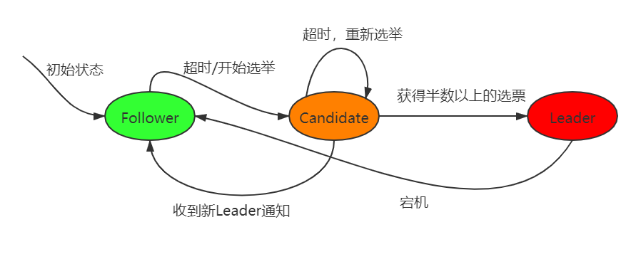
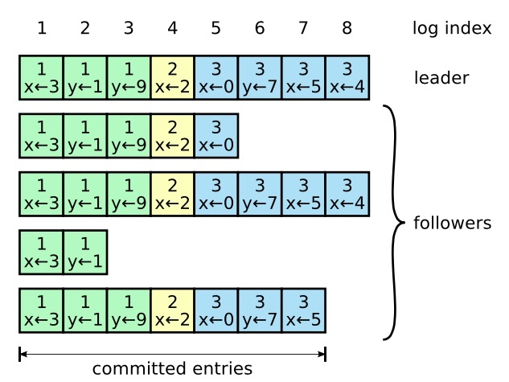
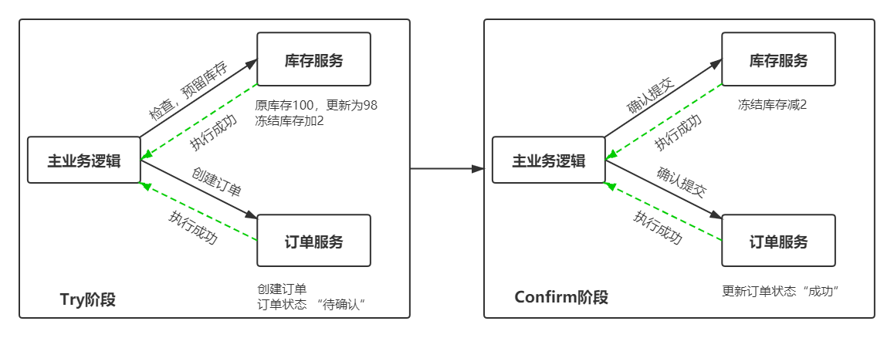
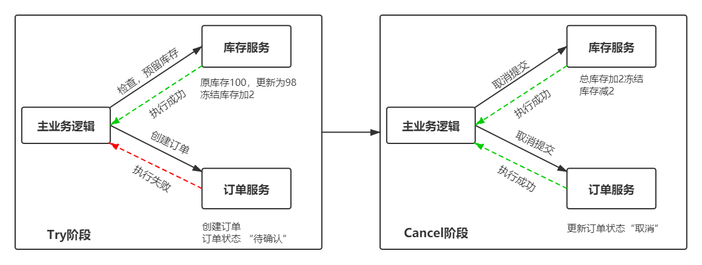
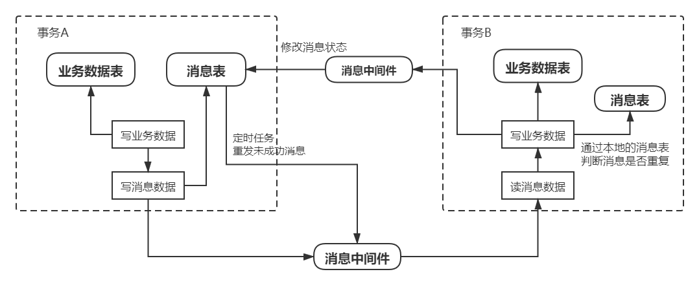
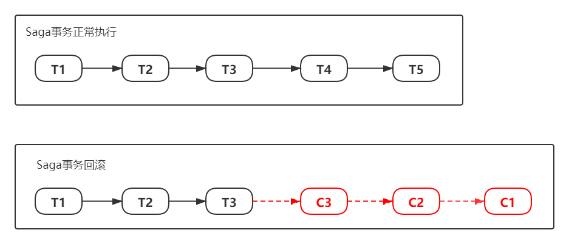
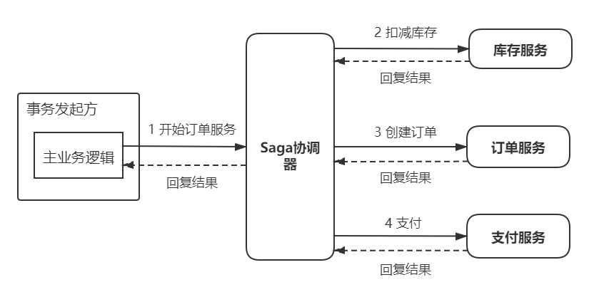
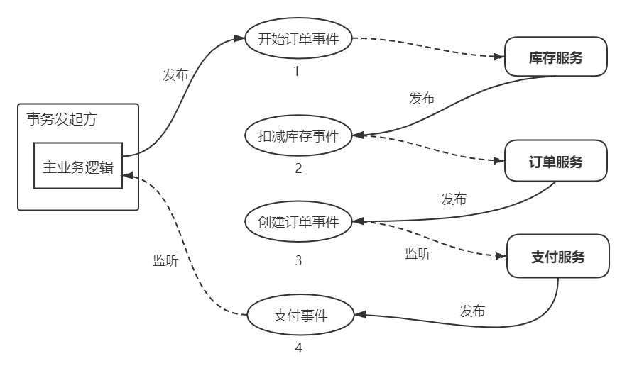

## CAP理论

分布式系统不可能同时满足一致性（C：Consistency）、可用性（A：Availability）和分区容错性（P：Partition Tolerance），最多只能同时满足其中两项

**一致性**：多个数据节点能否实时保持一致，如果一个数据更新成功，所有的用户(肯定会有不同的节点)都能读取到最新的值，这种就是强一致

**可用性**：系统提供的服务必须是可用的，即系统对每个操作请求必须在`一定的时间内`返回一个`明确的结果`

**分区容错性**：在存在网络分区的情况下，仍然可以对外提供满足一致性和可用性的服务

`网络分区`是指在分布式系统中，由于节点处于不同的子网络中，如果出现网络分区故障，导致网络互不相通，整个系统被切分成若干给子网络；分区容错性允许每个子网络对外提供服务

在分布式系统中，需要假设网络是不可靠的，分区容错性是必须的；此外，可用性对业务系统也尤为重要。在大谈用户体验的今天，如果业务系统时常出现“系统异常”、响应时间过长等情况，这使得用户对系统的好感度大打折扣，在互联网行业竞争激烈的今天，相同领域的竞争者不甚枚举，系统的间歇性不可用会立马导致用户流向竞争对手。因此，我们只能通过牺牲一致性（采用弱一致性或者最终一致性）来换取系统的可用性和分区容错性

### **BASE理论**

**Basically Available（基本可用）**

分布式系统在出现故障的时候，保证核心可用，允许损失部分可用性

**Soft state（软状态）**

允许数据中间状态，而不需要实现实时一致

**Eventually consistent（最终一致性）**

所有的数据副本，在经过一段时间的同步之后，最终都能够达到一个一致的状态

## 分布式锁

在分布式系统中，我们需要解决跨进程、跨服务器之间共享资源的协调问题，所以我们需要使用分布式锁；分布式锁具备的特点

* 排他性：在同一时间只能有一个客户端获取到锁，其他客户端无法获得
* 高性能、高可用：获取锁与释放锁必须高可用且性能佳
* 可重入：已获得锁的线程可以重新进入
* 防止死锁：具备锁失效机制，防止死锁

### 数据库

利用**数据库唯一索引**保证锁的排他性

获得锁时向表中插入一条记录，释放锁时删除这条记录。唯一索引可以保证该记录只被插入一次，那么就可以用这个记录是否存在来判断是否存于锁定状态。

存在问题：

- 锁没有失效时间，解锁失败的话其它进程无法再获得该锁
- 只能是非阻塞锁，插入失败直接就报错了，无法重试
- 不可重入，已经获得锁的进程也必须重新获取锁

### Redis

创建一个lock-key当前线程信息（key）和重入次数（value），lock-key存在失效时间，lock-key失效释放锁

**优点：**性能好，实现起来较为方便。

**缺点：**通过超时时间来控制锁的失效时间并不是十分的靠谱

**Lock**

1. 判断lock-key是否存在，不存在直接调用hash存储当前线程信息并且设置过期时间，返回nil，告诉客户端直接获取到锁。
2. 判断lock-key是否存在，且线程信息是否和当前线程相同，相同则将重入次数加1，并重新设置过期时间，返回nil，告诉客户端直接获取到锁。
3. 被其它线程已经锁定，返回锁有效期的剩余时间，告诉客户端需要等待。

**UnLock**

1. 如果lock-key不存在，发消息说锁已经可用，发送一个消息
2. 如果锁不是被当前线程锁定，则返回nil
3. 由于支持可重入，在解锁时将重入次数需要减1
4. 如果计算后的重入次数>0，则重新设置过期时间
5. 如果计算后的重入次数<=0，则发消息说锁已经可用

### Zookeeper

**利用节点的唯一性来实现分布式锁**

多个进程往ZooKeeper 的指定节点下创建一个相同名称的节点，只有一个能成功，其余创建失败；创建失败的节点全部通过ZooKeeper 的watcher 机制来监听ZooKeeper 这个子节点的变化，一旦监听到子节点的删除事件，则再次触发所有进程去写锁；

这种实现方式很简单，但是会产生“惊群效应”，简单来说就是如果存在许多的客户端在等待获取锁，当成功获取到锁的进程释放该节点后，所有处于等待状态的客户端都会被唤醒，这个时候ZooKeeper 在短时间内发送大量子节点变更事件给所有待获取锁的客户端，然后实际情况是只会有一个客户端获得锁。如果在集群规模比较大的情况下，会对ZooKeeper 服务器的性能产生比较的影响。

**利用临时有序节点来实现分布式锁**

- 多个进程往ZooKeeper 的指定节点下创建一个临时顺序节点
- 如果自己不是第一个节点，就对自己上一个节点加监听器
- 只要上一个节点释放锁，自己就可以获得锁，相当于是一个排队机制

## 一致性算法

### PAXOS协议

Paxos三种角色：Proposer, Acceptor, Learner 

* **Proposer**：只要 Proposer发的提案被半数以上 Acceptor接受，Proposer就认为该提案里的value被选定
* **Acceptor**：只要 Acceptor接受了某个提案，Acceptor 就认为该提案里的 value被选定了
* **Learner**: Acceptor告诉 Learner哪个 value被选定，Learner就认为那个value被选定

Paxos算法分为两个阶段：

#### 阶段一

1. Proposer选择一个**提案编号N**，然后向**半数以上**的 Acceptor 发送编号为N的 **Prepare请求**
2. 如果一个 Acceptor收到一个编号为N的 Prepare请求，且编号N大于该 Acceptor**已经响应**的所有 Prepare请求的编号，那么它就会将它已经批准过的最大编号的提案作为响应反馈给 Proposer，同时该 Acceptor会承诺不会再批准任何编号小于N的提案

#### 阶段二

1. 如果Proposer收到**半数以上**Acceptor对其发出的编号为N的Prepare请求的响应，那么它就会发送一个针对**[N，V]提案**的**Accept请求**给**半数以上**的Acceptor

   注：V就是收到的响应（编号最大的提案的value），如果响应中不包含任何提案，那么V就由Proposer自己决定

2. 如果Acceptor收到一个针对编号为N的提案的Accept请求，只要该Acceptor没有对编号大于N的Prepare请求做出过响应，它就接受该提案

### ZAB协议

> ZAB协议的核心是定义了对于那些会改变ZooKeeper服务器数据状态的事务请求的处理方式，即：
>
> 所有事务请求必须由一个全局唯一的服务器来协调处理，这样的服务器被称为 Leader服务器，而余下的其他服务器则成为 Follower服务器。Leader服务器负责将一个客户端事务请求转换成一个事务 Proposal(提议)，并将该 Proposal分发给集群中所有的Follower服务器。之后 Leader服务器需要等待所有 Follower服务器的反馈，一旦超过半数的 Follower服务器进行了正确的反馈后，那么 Leader就会再次向所有的 Follower服务器分发 Commit消息，要求其将前一个 Proposal进行提交。

ZAB协议包括两种基本的模式，分别是 **崩溃恢复和消息广播**。

#### 消息广播

广播的过程实际上是一个简化的2PC过程：

1. Leader 接收到消息请求后，将消息赋予一个全局唯一的 64 位自增 id(事务ID)，叫做：zxid，通过 zxid 的大小比较即可实现因果有序这一特性。
2. Leader 通过FIFO先进先出队列（通过 TCP 协议来实现，以此实现了全局有序这一特性）将带有 zxid 的消息作为一个提案（proposal）分发给所有 follower。
3. 当 follower 接收到 proposal，先将 proposal 写到硬盘，写硬盘成功后再向 leader 回一个 ACK。
4. 当 leader 接收到合法数量（超过半数节点）的 ACKs 后，leader 就向所有 follower 发送 COMMIT 命令，同事会在本地执行该消息。
5. 当 follower 收到消息的 COMMIT 命令时，就会执行该消息

在这种简化了的二阶段提交模型下，是无法处理 Leader服务器崩溃退出而带来的数据不一致问题的，因此在ZAB协议中添加了另一个模式，即釆用崩溃恢复模式来解决这个问题。另外，整个消息广播协议是基于具有FIFO特性的TCP协议来进行网络通信的，因此能够很容易地保证消息广播过程中消息接收与发送的顺序性。

####  崩溃恢复

Zab 协议的广播部分不能处理 leader 挂掉的情况，Zab 协议引入了恢复模式来处理这一问题。为了使 leader 挂了后系统能正常工作，需要解决以下两个问题：

**已经被处理的消息不能丢**

为了实现已经被处理的消息不能丢这个目的，Zab 的恢复模式使用了以下的策略：

1. 选举拥有 proposal 最大值（即 zxid 最大） 的节点作为新的 leader：由于所有提案被 COMMIT 之前必须有合法数量的 follower ACK，即必须有合法数量的服务器的事务日志上有该提案的 proposal，因此，只要有合法数量的节点正常工作，就必然有一个节点保存了所有被 COMMIT 消息的 proposal 状态。
2. 新的 leader 将自己事务日志中 proposal 但未 COMMIT 的消息处理。
3. 新的 leader 与 follower 建立先进先出的队列， 先将自身有而 follower 没有的 proposal 发送给 follower，再将这些 proposal 的 COMMIT 命令发送给 follower，以保证所有的 follower 都保存了所有的 proposal、所有的 follower 都处理了所有的消息。
   通过以上策略，能保证已经被处理的消息不会丢

**被丢弃的消息不能再次出现**

Zab 通过巧妙的设计 zxid 来实现这一目的。一个 zxid 是64位，高 32 是朝代（epoch）编号，每经过一次 leader 选举产生一个新的 leader，新 leader 会将 epoch 号 +1。低 32 位是消息计数器，每接收到一条消息这个值 +1，新 leader 选举后这个值重置为 0。这样设计的好处是旧的 leader 挂了后重启，它不会被选举为 leader，因为此时它的 zxid 肯定小于当前的新 leader。当旧的 leader 作为 follower 接入新的 leader 后，新的 leader 会让它将所有的拥有旧的 epoch 号的未被 COMMIT 的 proposal 清除。

ZAB 的核心：少数服从多数；资历老（处理的事务最多，zxid最大）的节点优先继位

### Raft协议

#### 角色

在Raft中，节点有三种角色或者三种状态，每个节点会在这三个状态之间进行变换 。客户端只能从主节点写数据，从节点里读数据

* Leader：负责接收客户端的请求
* Candidate：用于选举Leader的一种角色
* Follower：负责响应来自Leader或者Candidate的请求

#### Term（任期）

在Raft 中使用了任期（第几届Leader）的概念，每一轮选举都是一个Term 周期，在一个Term 中只能产生一个Leader；当某节点收到的请求中Term 比当前Term 小时则拒绝该请求。类似ZAB协议的epoch （朝代）。

* 每个节点存储当前的Term，单独递增

* 每次通信都会交换Term，目的：

  当前服务器的Term比其他服务器的小，说明更换了Leader(改朝换代)，则更新自己

  如果Leader或者Candidate发现自己的Term过期，把自己修改为Follower状态

  收到比当前Term 小的请求时，直接拒绝

#### Raft的安全规则

Raft保证每个安全属性：

选举安全：在一个特定的任期内，最多只能选出一名领导人。

Leader Append-Only：领导者只能在其日志中添加新条目（它既不能覆盖也不能删除条目）。

日志匹配：如果两个日志包含具有相同索引和术语的条目，则日志在通过给定索引的所有条目中都是相同的。

领导者完整性：如果在给定的术语中提交了日志条目，那么从该术语开始，它将出现在领导者的日志中。

状态机安全性：如果服务器已将特定日志条目应用于其状态机，则其他服务器不会对同一日志应用不同的命令。

前四节中描述的算法的细节保证了四个第一规则。选举过程受到限制，保证了国家机器安全。

 

#### Leader选举

**选举安全**

* 在一个Term 期间每个节点只能投票一次
* 每个 Term 只能选举出一个Leader

**选举过程**

1. 所有节点启动都是Follower状态，等100-300MS没有收到Leader节点的心跳就变候选人
2. 候选人给其他节点发选票，候选人获得过半数节点的选票就变成了Leader节点
3. Leader节点向其他节点发送心跳请求，以保持Leader 的正常运转，收到心跳请求（请求的Term更大）时Candidate变成Follower
4. 一段时间内没有收到过半的投票，选举失败，则重新发起选举

如果不做限制，选举可能会不停的失败。Raft 使用了一个限制来规避：每台服务器在选举的时候，使用一个随机数（150 -200），即每个服务器在不同的时间发出选举，尽量避免平票。

#### log复制

对于事务操作，请求会转发给Leader，非事务操作，可以由任意节点处理

**处理过程**

1. client请求到达Leader

   Leader首先将该请求转化成entry，然后添加到自己的log中，得到该entry的index信息。entry中就包含了当前leader的term信息和在log中的index信息

2. Leader复制上述entry到所有Follower

   Leader把请求作为日志条目（Log entries）加入到它的日志中，然后并行的向其他服务器发起 AppendEntries RPC请求，复制日志条目

3. Leader统计过半复制的entries

   Leader一旦发现有些entries已经被过半的Follower复制了，则就将该entry提交，将commitIndex提升至该entry的index

   一旦可以提交了，leader就将该entry应用到状态机中，然后给客户端回复OK，然后在下一次心跳请求中，将commitIndex就传给了所有的follower，对应的follower就可以将commitIndex以及之前的entry应用到各自的状态机中了

#### **集群恢复**

Raft增加了如下两条限制以保证安全性：

在Leader 宕机的情况下

- 拥有最新的已提交的log entry的Follower才有资格成为Leader

- Leader只能推进commit index来提交当前term的已经复制到大多数服务器上的日志，旧term日志的提交要等到提交当前term的日志来间接提交（log index 小于 commit index的日志被间接提交）

## 分布式事务

### 二阶段提交协议

顾名思义，二阶段提交协议是将事务的提交过程分成了两个阶段来进行处理，其执行流程如下

#### **阶段一：提交事务请求**

类似投票阶段，而且是一票否决

1. **事务询问**

   协调者向所有的参与者发送事务内容，询问是否可以执行事务提交操作，并开始等待各参与者的响应 

2. **执行事务**

   各参与者节点执行事务操作，并将Undo和Redo信息记入事务日志中

3. **各参与者向协调者反馈事务响应**

   如果参与者成功执行了事务，反馈Yes响应，表示事务可以执行；

   如果参与者没有成功执行事务，反馈No响应，表示事务不可以执行。

#### **阶段二：执行事务提交**

在阶段二中，协调者会根据各参与者的反馈情况来决定最终是否可以进行事务提交操作，包含以下两种可能

**执行事务提交**：所有的反馈都是Yes响应

1. **发送提交请求**

   协调者向所有参与者节点发出 Commit请求

2. **事务提交**

   参与者接收到 Commit请求后，会正式执行事务提交操作，并在完成提交之后释放在整个事务执行期间占用的事务资源

3. **反馈事务提交结果**

   参与者在完成事务提交之后,向协调者发送Ack消息

4. **完成事务**

   协调者接收到所有参与者反馈的Ack消息后，完成事务

**中断事务：**任何一个参与者反馈了No响应，或者等待超时

1. **发送回滚请求**

   协调者向所有参与者节点发出 Rollback请求

2. **事务回滚**

   参与者接收到 Rollback请求后，会利用其在阶段一中记录的Undo信息来执行事务回滚操作，并在完成回滚之后释放在整个事务执行期间占用的资源

3. **反馈事务回滚结果**

   参与者在完成事务回滚之后，向协调者发送Ack消息

4. **中断事务**

   协调者接收到所有参与者反馈的Ack消息后，完成事务中断.

二阶段提交将一个事务的处理过程分为了投票和执行两个阶段，其核心是对每个事务都采用先尝试后提交的处理方式，因此也可以将二阶段提交看作一个强一致性的算法

**优点：**原理简单，实现方便 

**缺点：**同步阻塞、单点问题、数据不一致、容错性

* 同步阻塞：在二阶段提交的执行过程中，所有参与的事务都处于阻塞状态，会导致无法进行其他操作
* 单点问题：协调者在2PC过程中作用非常重要，职责过重，如果协调者出现问题，会导致整个事务操作不可用
* 数据不一致：如果阶段二提交过程中，Commit请求中发生网络异常等问题，会导致只有部分参与者进行事务提交，使得数据和其它未提交的参与者不一致
* 容错性：由于投票阶段使用一票否决制，导致在复杂的网络环境下容错性非常差，只要有一台参与者发生故障或网络问题，整个事务一直失败

### 三阶段提交协议

三阶段提交，是二阶段提交的改进版，其将二阶段提交协议的"提交事务请求"过程一分为二，形成了由 canCommit、 preCommit和 doCommit三个阶段组成的事务处理协议；

#### **阶段一: can Commit**

1. **事务询问**

   协调者向所有的参与者发送一个包含事务内容的can Commit请求，询问是否可以执行事务提交操作，并等待各参与者的响应. 

2. **各参与者向协调者反馈响应**

   参与者在接收到来自协调者的 can Commit请求后，如果其自身认为可以顺利执行事务，反馈Yes响应，并进入预备状态，

   否则反馈No响应

#### **阶段二: pre Commit**

在阶段二中，协调者会根据参与者的反馈情况来决定是否可以进行事务的  pre Commit操作，包含两种可能

**执行事务预提交**：所有的反馈都是Yes响应 

1. **发送预提交请求**

   协调者向所有参与者节点发出 pre Commit的请求，并进入 Prepared阶段.

2. **事务预提交**

   参与者接收到 pre Commit请求后，会执行事务操作，并将Undo和Redo信息记录到事务日志中 

3. **各参与者向协调者反馈事务执行的响应**

   如果参与者成功执行了事务操作，那么就会反馈给协调者Ack响应，同时等待最终的指令:提交( commit)或中止( abort)

**中断事务：**任何一个参与者反馈了No响应，或者等待超时

1. **发送中断请求**

   协调者向所有参与者节点发出 abort请求.

2. **中断事务**

   无论是收到来自协调者的abort请求，或者是在等待协调者请求过程中出现超时，参与者都会中断事务.

#### **阶段三: do Commit**

真正的事务提交，会存在以下两种可能的情况

**执行提交**

1. **发送提交请求**

   进入这一阶段，假设协调者处于正常工作状态，并且它接收到了来自所有参与者的Ack响应，那么它将从"预提交"状态转换到"提交"状态，并向所有的参与者发送 do Commit请求.

2. **事务提交**

   参与者接收到 do Commit请求后，会正式执行事务提交操作，并在完成提交之后释放在整个事务执行期间占用的事务资源

3. **反馈事务提交结果**

   参与者在完成事务提交之后，向协调者发送Ack消息

4. **完成事务**

   协调者接收到所有参与者反馈的Ack消息后，完成事务

**中断事务：**任何一个参与者反馈了No响应，或者等待超时

1. **发送中断请求**

   协调者向所有参与者节点发出 abort请求

2. **事务回滚**

   参与者接收到 abort请求后，会利用其在阶段二中记录的Undo信息来执行事务回滚操作，并在完成回滚之后释放在整个事务执行期间占用的资源

3. **反馈事务回滚结果**

   参与者在完成事务回滚之后，向协调者发送Ack消息

4. **中断事务**

   协调者接收到所有参与者反馈的Ack消息后，完成事务中断.

**优点：**相较于二阶段提交协议，三阶段提交协议最大的优点就是降低了参与者的阻塞范围，并且能够在出现单点故障后继续达成

**缺点：**三阶段提交协议在去除阻塞的同时也引入了新的问题，那就是在参与者接收到 pre Commit消息后，如果网络出现分区，此时协调者所在的节点和参与者无法进行正常的网络通信，在这种情况下，该参与者依然会进行事务的提交，这必然出现数据的不一致性

### 柔性事务

柔性事务是基于BASE理论而提出的，只是一种规范，具体实现有很多方案

**基本可用**：分布式系统出现故障的时候，允许损失一部分可用性。比如，双11对一些非核心链路的功能进行降级处理。

**柔性状态**：允许系统存在中间状态，这个中间状态又不会影响系统整体可用性。比如，数据库读写分离，写库同步到读库（主库同步到从库）会有一个延时，这样实际是一种柔性状态。

**最终一致性**：主从复制经过数据同步延时之后，最终数据能达到一致。

#### 补偿型

通过记录日志，先提交，如果需要回滚通过日志执行反向操作

服务器A 发起事务，服务器B 参与事务，服务器A 的事务如果执行顺利，那么事务A 就先行提交

1. 如果事务B 也执行顺利，则事务B 也提交，整个事务就算完成
2. 如果事务B 执行失败，事务B 本身回滚，这时事务A 已经被提交，所以需要执行一个补偿操作，将已经提交的事务A 执行的操作作反操作，恢复到未执行前事务A 的状态。

#### 异步确保型

通过将一系列同步的事务操作变为基于消息执行的异步操作，避免了分布式事务中的同步阻塞操作的影响。例如将热点资源的更新操作汇总，通过发送可靠消息异步一次性执行多条语句

#### 最大努力型

通过消息中间件实现，允许失败，失败后发送消息，收到 消息重新执行（不停的重试，需要设置最大次数）

### 分布式事务方案

#### TCC

TCC（Try-Confirm-Cancel）分两个阶段执行，TCC事务的Try、Confirm、Cancel可以理解为SQL事务中的Lock、Commit、Rollback；

- Try阶段：尝试执行，完成所有业务检查( 一致性 )，预留必须的业务资源( 准隔离性 )
- Confirm阶段：执行真正的业务，只使用Try阶段预留的业务资源
- Cancel阶段：取消执行，释放Try阶段预留的业务资源

假设商品库存为100，购买数量为2，这里检查和更新库存的同时，冻结用户购买数量的库存，同时创建订单，订单状态为待确认

**Confirm**：当Try阶段服务全部正常执行， 执行确认业务逻辑操作

**Cancel**：当Try阶段存在服务执行失败， 进入Cancel阶段

##### 优点

* 只需要锁定需要的资源，无需锁定全部资源
* 在业务代码中锁定资源，减少DB压力

##### 缺点

TCC的Try、Confirm和Cancel都需要业务代码的支持，耦合度高，复用困难

#### 本地消息表

分布式事务肯定会涉及跨应用问题，本地消息表是为了解决多个应用间的事务问题，核心原理是事务A通过创建额外的事务消息表，用于记录分布式事务的状态，通过事务消息表实现分布式事务

* 执行业务代码，执行成功后，发送消息到MQ，并使用消息表记录该消息
* 通过定时任务去轮询消息表，把没有发送的消息重新发送
* 事务B收到消息后（判断重复），写入业务数据，成功后修改事务A中的消息状态
* 异常情况：事务A消息发送失败，通过消息表定时任务重发；事务B执行失败，通过发送消息，让事务A回滚

##### 优点

* 通过消息表实现消息的可靠性，弱化了对MQ可靠性的依赖
* 实现简单

##### 缺点

* 与具体的业务场景绑定，耦合性强，不可公用
* 消息表和业务表共用数据库，占用DB资源，DB的并发压力增大

#### MQ 事务

基于MQ(RocketMQ)的分布式事务方案其实是对本地消息表的封装，将本地消息表基于MQ 内部，其他方面的协议基本与本地消息表一致。

[TODO]()

**执行过程**

1. 发送Prepared消息时，拿到消息的地址
2. 执行本地事务
3. 通过第1阶段拿到的地址去访问消息，并修改消息的状态

##### 优点 

消息数据独立存储，降低业务系统与消息系统之间的耦合。

吞吐量优于本地消息表方案。

##### 缺点

一次消息发送需要两次网络请求(half消息 + commit/rollback)。

需要实现消息回查接口。

 

#### Saga 事务

Saga事务核心思想是将长事务拆分为多个本地短事务，由Saga事务协调器协调，如果正常结束那就正常完成，如果某个步骤失败，则根据相反顺序依次调用补偿操作

**Saga事务基本协议**

- 每个Saga事务由一系列幂等的有序子事务(sub-transaction) Ti 组成。
- 每个Ti 都有对应的幂等补偿动作Ci，补偿动作用于撤销Ti造成的结果。

Saga事务常见的有两种不同的实现方式

##### 命令协调

##### 事件编排

### 总结

|            | 2PC  | 3PC  | TCC  | 本地消息表 | MQ事务 | Saga |
| ---------- | ---- | ---- | ---- | ---------- | ------ | ---- |
| 数据一致性 | 强   | 强   | 弱   | 弱         | 弱     | 弱   |
| 容错性     | 低   | 低   | 高   | 高         | 高     | 高   |
| 复杂性     | 中   | 高   | 高   | 低         | 低     | 高   |
| 性能       | 低   | 低   | 中   | 中         | 高     | 中   |
| 维护成本   | 低   | 中   | 高   | 中         | 中     | 高   |

## 负载均衡

## 限流算法

## 熔断

## 微服务

单体架构在规模比较小的情况下工作情况良好，但是随着系统规模的扩大，它暴露出来的问题也越来越多，主要有以下几点：

**复杂性逐渐变高**

比如有的项目有几十万行代码，各个模块之间区别比较模糊，逻辑比较混乱，代码越多复杂性越高，越难解决遇到的问题。

**技术债务逐渐上升**

公司的人员流动是再正常不过的事情，有的员工在离职之前，疏于代码质量的自我管束，导致留下来很多坑，由于单体项目代码量庞大的惊人，留下的坑很难被发觉，这就给新来的员工带来很大的烦恼，人员流动越大所留下的坑越多，也就是所谓的技术债务越来越多。

**部署速度逐渐变慢**

这个就很好理解了，单体架构模块非常多，代码量非常庞大，导致部署项目所花费的时间越来越多，曾经有的项目启动就要一二十分钟，这是多么恐怖的事情啊，启动几次项目一天的时间就过去了，留给开发者开发的时间就非常少了。

**阻碍技术创新**

比如以前的某个项目使用struts2写的，由于各个模块之间有着千丝万缕的联系，代码量大，逻辑不够清楚，如果现在想用spring mvc来重构这个项目将是非常困难的，付出的成本将非常大，所以更多的时候公司不得不硬着头皮继续使用老的struts架构，这就阻碍了技术的创新。

**无法按需伸缩**

比如说电影模块是CPU密集型的模块，而订单模块是IO密集型的模块，假如我们要提升订单模块的性能，比如加大内存、增加硬盘，但是由于所有的模块都在一个架构下，因此我们在扩展订单模块的性能时不得不考虑其它模块的因素，因为我们不能因为扩展某个模块的性能而损害其它模块的性能，从而无法按需进行伸缩。

> 紧耦合的——业务逻辑的调用发生在编程语言层面,而不是通过实现中立的协议(如SOAP和REST).这大大增加了即使对应用程序组件进行小的修改也可能打破应用程序的其他部分并引入新漏洞的机会.
>
> 有漏洞的—一大多数大型软件应用程序都在管理着不同类型的数据.例如,客户关系管理(CRM)应用程序可能会管理客户、销售和产品信息.在传统的模型里,这些数据位于相同的数据模型中并在同一个数据存储中保存.即使数据之间存在明显的界限,在绝大多数的情况下,来自一个领域的团队也很容易直接访问属于另一个团队的数据.这种对数据的轻松访问引人了隐藏的依赖关系,并让组件的内部数据结构的实现细节泄漏到整个应用程序中.即使对单个数据库表的更改也可能需要在整个应用程序中进行大量的代码更改和回归测试.
>
> 单体的——由于传统应用程序的大多数组件都存放在多个团队共享的单个代码库中,任何时候更改代码,整个应用程序都必须重新编译、重新运行并且需要通过一个完整的测试周期并重新部署.无论是新客户的需求还是修复错误,应用程序代码库的微小变化都将变得昂贵和耗时,并且几乎不可能及时实现大规模的变化.
>
> 基于微服务的架构采用不同的方法来交付功能.具体来说,基于微服务的架构具有以下特点.
>
> 有约束的—微服务具有范围有限的单一职责集.微服务遵循UNX的理念,即应用程序是服务的集合,每个服务只做一件事,并只做好一件事.
>
> 松耦合的—基于微服务的应用程序是小型服务的集合,服务之间使用非专属调用协议(如HTTP和REST)通过非特定实现的接口彼此交互.与传统的应用程序架构相比,只要服务的接口没有改变,微服务的所有者可以更加自由地对服务进行修改
>
> 抽象的——微服务完全拥有自己的数据结构和数据源.微服务所拥有的数据只能由该服务修改.可以锁定微服务数据的数据库访问控制,仅允许该服务访问它.
>
> 独立的——微服务应用程序中的每个微服务可以独立于应用程序中使用的其他服务进行编译和部署.这意味着,与依赖更重的单体应用程序相比,这样对变化进行隔离和测试更容易.
>
> 为什么这些微服务架构属性对基于云的开发很重要?基于云的应用程序通常有以下特点.
>
> 拥有庞大而多样化的用户群—不同的客户需要不同的功能,他们不想在开始使用这些功能之前等待漫长的应用程序发布周期.微服务允许功能快速交付,因为每个服务的范围很小,并通过一个定义明确的接口进行访问.
>
> 极高的运行时间要求——由于微服务的分散性,基于微服务的应用程序可以更容易地将故障和问题隔离到应用程序的特定部分之中,而不会使整个应用程序崩溃.这可以减少应用程序的整体宕机时间,并使它们对问题更有抵御能力.
>
> 不均匀的容量需求——在企业数据中心内部部署的传统应用程序通常具有一致的使用模式,这些模式会随着时间的推移而定期出现,这使这种类型的应用程序的容量规划变得很简单.但在一个基于云的应用中, Twitter上的一条简单推文或 Slashdot上的一篇文章就能够极大带动对基于云计算的应用的需求.
> 因为微服务应用程序被分解成可以彼此独立部署的小组件,所以能够更容易将重点放在正处于高负载的组件上,并将这些组件在云中的多个服务器上进行水平伸缩.

### 开发

#### 微服务开发

服务粒度

通信协议

接口设计

配置管理

服务之间事件处理

#### 微服务路由

服务发现

服务路由

#### 客户端弹性

客户端负载均衡

断路器模式

后备模式

舱壁模式

#### 服务安全

验证

授权

凭据管理和传播

#### 日志记录和跟踪

日志关联

日志聚合

微服务跟踪

#### 构建和部署

## 参考

[理解分布式事务](https://juejin.im/post/5c0e5bf8e51d45063322fe50#heading-28)