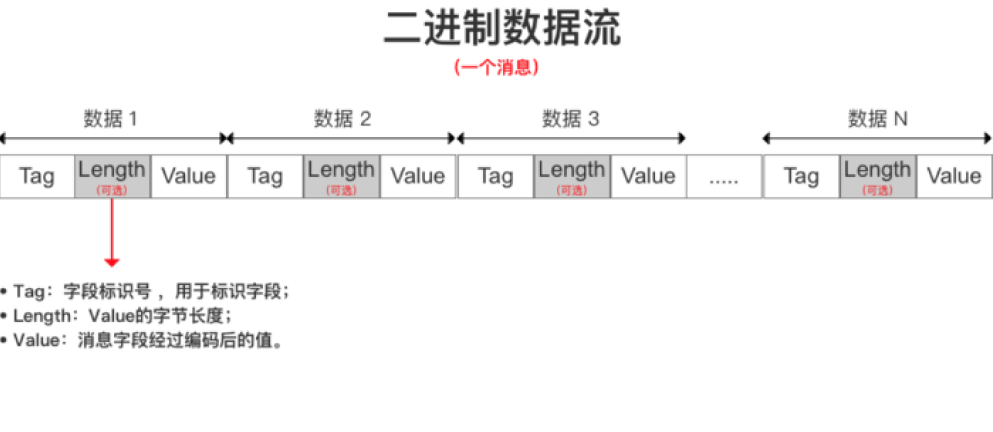

## 什么是序列化

序列化是把对象的信息转换为可以传输或者存储的格式（现阶段主要是二进制比特流）的过程；

## JDK原生序列化

可以借助commons-lang3工具包里面的类实现对象的序列化及反序列化

```java
@Slf4j
public class SerialTest {
    @Test // 序列化方法 
    public void test1() { 
        VipUser user = new VipUser();
        user.setVipNo("123456");
        user.setAddr("testAddr");
        user.setAge(18);
        user.setName("qin");
        byte [] bytes = SerializationUtils.serialize(user);
        VipUser user1 = SerializationUtils.deserialize(bytes);
        log.debug("user1:{}",user1);
        log.debug("age:{}",user1.getAge()); 
    }
}
```


- 序列化对象必须实现序列化接口。
- 序列化对象里面的属性是对象的话也要实现序列化接口。
- 类的对象序列化后，类的序列化ID不能轻易修改，不然反序列化会失败。
- 类的对象序列化后，类的属性有增加或者删除不会影响序列化，只是值会丢失。
- 如果父类序列化了，子类会继承父类的序列化，子类无需添加序列化接口。
- 如果父类没有序列化，子类序列化了，子类中的属性能正常序列化，但父类的属性会丢失，不能序列化。
- 用Java序列化的二进制字节数据只能由Java反序列化，不能被其他语言反序列化。如果要进行前后端或者不同语言之间的交互一般需要将对象转变成Json/Xml通用格式的数据，再恢复原来的对象。
- 如果某个字段不想序列化，在该字段前加上transient关键字即可。

### Java序列化的缺点

1. **无法跨语言：**Java序列化技术是Java内部的私有协议，其他语言不支持
2. **序列化后的码流太大：**序列化之后的码流大小对网络传输有很大的影响，会影响系统的吞吐量
3. **序列化性能太低：**

### Java反序列化漏洞简介

如果Java应用对用户输入，即不可信数据做了反序列化处理，那么攻击者可以通过构造恶意输入，让反序列化产生非预期的对象，非预期的对象在产生过程中就有可能带来任意代码执行

## ProtoBuf

**序列化过程：**

1. 判断每个字段是否有值，有值才进行编码
2. 根据字段的标识号和数据类型将字段值通过不同的编码方式进行编码
3. 将编码后的数据安装字段类型采用不同的存储方式封装成二进制比特流

**反序列化过程：**

1. 调用类的parseFrom(input)解析从输入流读入的二进制字节数据流
2. 将解析出来的数据按照指定的格式读取到对象中

### 编码方式

**Varint编码：**Varint编码是一种变长的编码方式，编码原理是用字节表示数字，值越小的数字，使用越少的字节数表示。因此，可以通过减少表示数字的字节数进行数据压缩。 

**Zigzag编码：**Zigazg编码是一种变长的编码方式，其编码原理是使用无符号数来表示有符号数字，使得绝对值小的数字都可以采用较少字节来表示，特别对表示负数的数据能更好地进行数据压缩。

Zigzag编码对Varint编码在表示负数时不足的补充，从而更好的帮助Protobuf进行数据的压缩。

### 数据存储方式

**T-L-V数据存储方式：**

T-L-V（Tag - Length - Value），即标识符-长度-字段值的存储方式，其原理是以标识符-长度-字段值表示单个数据，最终将所有数据拼接成一个字节流，从而实现数据存储的功能。



tag 的计算方式是field_number(当前字段的编号) << 3 | wire_type;（需要看二进制数才有意义）

wire_type最大为5，需要3位来表示1~5；field_number左移3位，用前面的高位表示field_number，低3位标识wire_type

**T-V数据存储方式：**

消息字段的标识号、数据类型、字段值经过Protobuf采用Varint和Zigzag编码后，以T-V（Tag-Value）方式进行数据存储。
对于Varint与Zigzag编码方式编码的数据，省略了T-L-V中的字节长度Length。

### 序列化原理

* Protocol Buffer将消息中的每个字段进行编码后，利用T - L - V 存储方式进行数据的存储，最终得到一个二进制字节流。

* ProtoBuf对于不同数据类型采用不同的序列化方式（数据编码方式与数据存储方式）

  

* ProtoBuf对于数据字段值的独特编码方式与T-L-V数据存储方式，使得 ProtoBuf序列化后数据量体积极小。

  

* WireType=0的序列化

  WireType=0的类型包括int32，int64，uint32，unint64，bool，enum以及sint32和sint64。

  编码方式采用Varint编码（如果为负数，采用Zigzag辅助编码），数据存储方式使用T-V方式存储二进制字节流。

* WireType=1的序列化

  WireType=1的类型包括fixed64，sfixed64，double。
  编码方式采用64bit编码（编码后数据大小为64bit，高位在后，低位在前），数据存储方式使用T-V方式存储二进制字节流。

* WireType=2的序列化

  WireType=2的类型包括string，bytes，嵌套消息，packed repeated字段。
  对于编码方式，标识符Tag采用Varint编码，字节长度Length采用Varint编码，string类型字段值采用UTF-8编码，嵌套消息类型的字段值根据嵌套消息内部的字段数据类型进行选择，
  数据存储方式使用T-L-V方式存储二进制字节流。

* WireType=5的序列化

  WireType=5的类型包括fixed32，sfixed32，float。
  编码方式采用32bit编码（编码后数据大小为32bit，高位在后，低位在前），数据存储方式使用T-V方式存储二进制字节流。

  

  

  

  


## Hessian


## 参考资料

[Protobuf序列化原理解析](https://blog.51cto.com/9291927/2332264)

