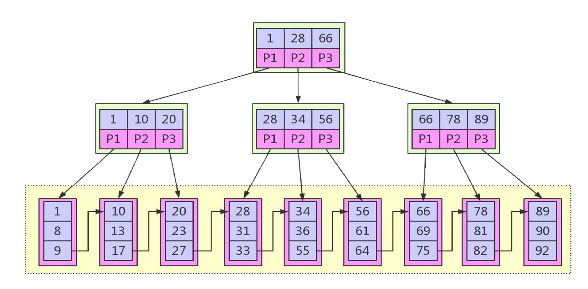
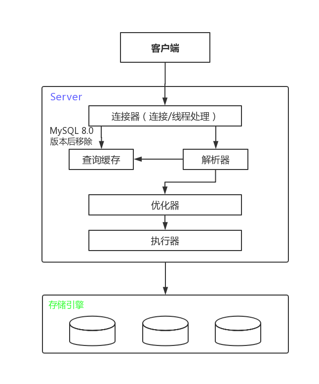

## MySQL

什么是MySQL： MySQL是一个开源免费的关系型数据库， 在Java企业级开发中非常常用


## 数据类型

### 整型

整数类型包含: TINYINT, SMALLINT, MEDIUMINT,INT, BIGINT；分别使用8,16,24,32,64位存储空间。存储值的范围从-2^(N-1)到2^(N-1)-1;其中N是存储空间的位数。

整数类型有可选的 UNSIGNED属性，表示不允许负值；例如 TINYINT UNSIGNED可以存储的范围是0~255；

MySQL可以为整数类型指定宽度，例如INT(11)，对大多数应用这是没有意义的；它不会限制值的合法范围，只是规定了 MySQL的一些交互工具(例如 MySQL命令行客户端)用来显示字符的个数；对于存储和计算来说，INT(1)和INT(20)是相同的

### 实数

实数是带有小数部分的数字

FLOAT和DOUBLE类型支持使用标准的浮点运算进行近似计算；FLOAT占用4个字节，DOUBLE占用8个字节

DECIMAL类型用于存储精确的小数 

### 字符串

**VARCHAR**

VARCHAR类型用于存储可变长字符串，是最常见的字符串数据类型；它比定长类型更节省空间，因为它仅使用必要的空间

VARCHAR需要使用1或2个额外字节记录字符串的长度

**CHAR**

CHAR类型是定长的 : MySQL会根据定义的字符串长度分配足够的空间

CHAR适合存储很短的字符串，或者所有值都接近同一个长度。例如：CHAR非常适合存储密码的MD5值，因为这是一个定长的值

### 日期和时间

**DATETIME**

DATETIME存储的范围为1001年到9999年，精度为秒；它把日期和时间封装到格式为 YYYYMMDDHHMMSS的整数中，使用8个字节的存储空间

**TIMETAMP**

TIMETAMP类型保存了从1970年1月1日午夜(格林尼治标准时间)以来的秒数，使用4个字节的存储空间；它的范围比 DATETIME小得多：存储的范围为1970年到2038年

## 数据库设计范式

**数据库的三大特性：实体，属性和关系。**

   实体：表； 属性：表中的数据（字段）； 关系：表与表之间的关系；

**数据库设计三大范式**

- 第一范式(列都是不可再分)

  数据表中的每一列（每个字段）必须是不可拆分的最小单元，也就是确保每一列的原子性；

- 第二范式(每个表只描述一件事情)

  满足第一范式，并且表中非主键列不存在对主键的部分依赖

- 第三范式(确保每列都和主键直接相关，而不是间接相关)

  满足第二范式，并且表中的列不存在对非主键列的传递依赖，确保字段不会冗余

**区分三大范式**

第一范式和第二范式在于有没有分出两张表；

第二范式是说一张表中如果包含了多种不同实体的属性，那么必须要分成多张表； 

第三范式是要求已经分成了多张表，一张表中只能有另一张表中的id（主键），而不能有其他的任何信息（其他的信息一律用主键在另一表查询）

**范式的优点和缺点**

优点：当数据较好的范式化时，会带来更少的数据冗余，从而节省磁盘和内存存储；同时更少的数据量使得更新数据更快；同时较少的数据冗余可以减少DISTINCT或GROUP BY操作

缺点：范式化的缺点是表需要关联，复杂语句的关联关系可能使索引失效，同时带来更高的复杂度

**反范式的优点和缺点**

反范式把数据集中在一张表，可以有效的避免关联


## 事务（ACID）

### 事务 ACID 特性

**原子性（Atomicity）**

事务被视为不可分割的最小单元，事务的所有操作要么全部提交成功，要么全部失败回滚。不能出现一部分成功，一部分失败

**一致性（Consistency）**

数据库总是从一个一致性状态转换到另一个一致性状态

**隔离性（Isolation）**

多个事务并发访问时，事务之间是隔离的，一个事务不应该影响其它事务运行效果。

**持久性（Durability）**

一旦事务提交，则其所做的修改将会永远保存到数据库中。即使系统发生崩溃，事务执行的结果也不能丢失。

### 事务并发带来的问题

**更新丢失**：T1 和 T2 两个事务都对一个数据进行修改，T1 先修改，T2 随后修改，T2 的修改覆盖了 T1 的修改。

**脏读**：T1 修改一个数据，T2 随后读取这个数据。如果 T1 撤销了这次修改，那么 T2 读取的数据是脏数据。

**不可重复读**：T2 读取一个数据，T1 对该数据做了修改。如果 T2 再次读取这个数据，此时读取的结果和第一次读取的结果不同。

**幻读**：T1 读取某个范围的数据，T2 在这个范围内插入新的数据，T1 再次读取这个范围的数据，此时读取的结果和和第一次读取的结果不同。

### 事务的隔离级别

**未提交读（Read Uncommitted）**

事务中的修改，即使没有提交，对其它事务也是可见的。**没有解决并发问题**

**提交读（Read Committed）**

一个事务只能读取已经提交的事务所做的修改。换句话说，一个事务所做的修改在提交之前对其它事务是不可见的。**解决脏读问题**

**可重复读（Repeatable Read）**

保证在同一个事务中多次读取同样数据的结果是一样的。**解决不可重复读问题**

**可串行化（Serializable）**

最高的隔离级别，通过强制事务的串行执行，事务只能一个接着一个地执行，但不能并发执行，需要加锁实现；**解决所有问题**

死锁：死锁指两个或多个事务在同一资源上相互占用，并请求锁定对方占用的资源，从而导致恶行循环的现象

### 事务的实现

事务的隔离性由锁来实现；原子性、一致性、持久性通过数据库的redo log和 undo log来完成； redo log称为重做日志，用来保证事务的原子性和持久性，undo log用来保证事务的一致性。

## 锁

锁是数据库系统区别于文件系统的一个关键特性；锁机制是用于管理对共享资源的并发访问

### 锁粒度

所谓锁策略，就是在锁的开销和数据的安全性之间寻求平衡，这种平衡会影响数据库的性能

**表锁**: 表锁是最基本的锁策略，也是开销最小的策略，表锁会锁定整个表，任何操作（插入删除和修改）都需要先获得表锁，会阻塞其他用户对该表的读写操作

**行锁**: 行级锁可以最大限度支持并发处理，同时也带来了巨大的锁开销

**意向锁**: InnoDB存储引擎支持多粒度( granular)锁定，这种锁定允许事务在行级上的锁和表级上的锁同时存在。意向锁是将锁定的对象分为多个层次，意向锁意味着事务希望在更细粒度上进行加锁

表锁->页锁->行锁

### MVCC

 多版本并发控制（Multi-Version Concurrency Control, MVCC）是 MySQL 的 InnoDB 存储引擎实现隔离级别的一种具体方式，用于实现提交读和可重复读这两种隔离级别。而未提交读隔离级别总是读取最新的数据行，无需使用 MVCC。可串行化隔离级别需要对所有读取的行都加锁，单纯使用 MVCC 无法实现。 

### 锁的算法

* Record Lock：单个行记录上的锁，总是会锁定索引记录
* Gap lock：间隙锁，锁定一个范围，但不包含记录本身
* Next-Key Lock：Gap Lock+ Record Lock，锁定一个范围，并且锁定记录本身

InnoDB默认的事务隔离级别是**可重复读**，然后通过Next-Key Lock解决幻读问题

~~~sql
-- 事务1
select count(1) from t_user where id >= 5; -- 假设输出结果 1 
-- 事务2 插入了一条数据id = 6 
-- 事务1
select count(1) from t_user where id >= 5; -- 假设输出结果 2
~~~

这个问题就是幻读问题，InnoDB通过Next-Key Lock解决幻读问题，**id >= 5**锁住的不单单是id=5这条记录，而是锁住了[5,+∞]这个范围的所有记录，会使得事务2无法插入数据，从而避免出现幻读问题

### **死锁**

死锁是指两个或两个以上的事务在执行过程中，因争夺锁资源而造成的一种互相等待的现象

解决死锁问题最简单的一种方法是超时，即当两个事务互相等待时，当一个等待时间超过设置的某一阈值时，其中一个事务进行回滚，另一个等待的事务就能继续进行

超时机制虽然简单，但是太被动，且等待超时阶段会浪费一定的性能，而且如果回滚一个事务的代价很大，我们希望先执行这个事务，回滚代价小的事务，超时机制无法满足此需求；因此除了超时机制，当前数据库还都普遍采用 wait-for graph(等待图)的方式来进行死锁检测；较之超时的解决方案，这是一种更为主动的死锁检测方式

wait-for graph会记录锁的信息链表和事务等待链表，然后构造一个有向图，通过深度优先遍历判断图中是否有环，存在环说明事务存在死锁；然后选择回滚undo量最小的事务

## 索引

索引是为了加速对表中数据行的检索而创建的一种分散存储的数据结构

索引对于良好的性能非常关键；当表中的数据量越来越大时，索引对性能的影响愈发重要。当数据量逐渐增大时,不恰当的索引会使性能急剧下降

**索引的优点：**

* 索引能极大的减少存储引擎需要扫描的数据量
* 索引可以把随机IO变成顺序IO
* 索引可以帮助我们在进行分组、排序等操作时，避免使用临时表

**索引的缺点**

* 创建和维护索引需要时间，随着数据量的增大，消耗的时间会越来越多
* 插入删除和修改数据都需要维护索引，导致插入删除和修改数据效率降低
* 索引需要占用额外的物理空间

**创建索引**

~~~sql
ALTER TABLE table_name ADD INDEX index_name(column_list); --添加普通索引,索引值可出现多次.
ALTER TABLE table_name ADD UNIQUE(column_list); --索引的值必须唯一(除了NULL外,NULL可能会出现多次)
ALTER TABLE table_name ADD PRIMARY KEY( column_list); --添加主键,这意味着索引值必须是唯一的,且不能为NULL 
~~~


### B+ Tree索引

是大多数 MySQL 存储引擎的默认索引类型，在InnoDB中B+Tree每个节点对应InnoDB的一个page，page大小是固定的，一般设为16k



**B+Tree索引的优点**

* **更少的查找次数：**平衡树查找操作的时间复杂度和树高 h 相关，O(h)=O(logdN)，其中 d 为每个节点的出度。红黑树的出度为 2，而 B+ Tree 的出度一般都非常大，所以红黑树的树高 h 很明显比 B+ Tree 大非常多，查找的次数也就更多。

* **利用磁盘预读特性**：为了减少磁盘 I/O 操作，磁盘往往不是严格按需读取，而是每次都会预读。预读过程中，磁盘进行顺序读取，顺序读取不需要进行磁盘寻道，并且只需要很短的磁盘旋转时间，速度会非常快。

  操作系统一般将内存和磁盘分割成固定大小的块，每一块称为一页，内存与磁盘以页为单位交换数据。数据库系统将索引的一个节点的大小设置为页的大小，使得一次 I/O 就能完全载入一个节点。并且可以利用预读特性，相邻的节点也能够被预先载入。

* **自带排序功能**：查询效率更加稳定，所有查询结点都经过相同的IO次数

### Hash索引

哈希索引是基于哈希表实现的，能以 O(1) 时间进行查找，但是只能进行精确查找，同时失去了有序性：

- 无法用于排序与分组；
- 只支持精确查找，无法用于部分查找和范围查找。

InnoDB 存储引擎有一个特殊的功能叫“自适应哈希索引”，当某个索引值被使用的非常频繁时，会在 B+Tree 索引之上再创建一个哈希索引，这样就让 B+Tree 索引具有哈希索引的一些优点，比如快速的哈希查找。

### 高性能索引策略

**独立的列**

独立的列指索引列不能是表达式的一部分，也不能是函数的参数

~~~sql
select id from t_user where id + 1 = 5; -- 不会使用索引
~~~

**前缀索引和索引选择性**

如果一个很长的字段列需要创建索引，索引会变得大且慢，我们可以索引该字段的开始的部分内容，节省索引空间，同时提高索引效率；

对前缀索引而言，选择合适的长度就成为重中之重，需要选择足够长的内容保证较高的选择性（差异性），同时又不能太长

~~~sql
ALTER TABLE t_user ADD KEY (user_addr(7)); -- 前缀索引
~~~

前缀索引能使索引更小、更快；同时也有其缺点: MySQL无法使用前缀索引做ORDER BY和GROUPBY，也无法使用前缀索引做覆盖扫描

**联合索引**

为每一列创建独立的索引是没有意义的

* 当对多个索引做相交操作时(多个AND条件)，通常需要一个包含所有相关列的多列索引，而不是多个独立的单列索引
* 当对多个索引做联合操作时(多个OR条件)，通常需要耗费大量CPU和内存资源在算法的缓存、排序和合并操作上
* 更重要的是，优化器不会把这些计算到"查询成本"(cost)中，优化器只关心随机页面读取。这会使得查询的成本被"低估"，导致该执行计划还不如直接走全表扫描，会消耗更多的CPU和内存资源，同时可能会影响查询的并发性 

由于B+Tree索引的最左匹配原则，多列索引的顺序非常重要

* 当不需要考虑排序和分组时，将选择性最高的列放在前面通常是很好的。这时候索引的作用只是用于优化 WHERE条件的查找。在这种情况下，这样设计的索引确实能够最快地过滤出需要的行
* WHERE子句中的排序、分组和范围条件等其他因素可能对查询的性能造成非常大的影响

**聚集索引**:  索引的键值逻辑顺序决定了表数据行的物理存储顺序；索引的顺序和表数据行的顺序是一致的

> 聚集索引类似于新华字典中用拼音去查找汉字，拼音检索表于书记顺序都是按照a~z排列的，就像相同的逻辑顺序于物理顺序一样，当你需要查找**a**,**ai**两个读音的字，或是想一次寻找多个**傻(sha)**的同音字时，也许向后翻几页，或紧接着下一行就得到结果了。

优点：

* 可以把相关数据保存在一起
* 数据访问更快，聚簇索引将索引和数据保存在同一个B-Tree中，因此从聚簇索引中获取数据通常比在非聚簇索引中查找要快.
* 使用覆盖索引扫描的查询可以直接使用页节点中的主键值

缺点：

*  聚簇数据最大限度的提高了I/O密集型应用的性能，但如果数据全部都放在内存中，则访问的顺序就没有那么重要了，聚簇索引也就没有那么优势了 
* 插入的速度严重依赖依赖于插入顺序；按照主键递增的顺序插入是速度最快的
* 更新聚簇索引的代价很高，会强制被更新的行移动到新的位置（保持索引顺序和存储顺序的一致）
* 基于聚簇索引的表在插入新行，或者主键被更新导致需要移动行的时候，可能面临“页分裂”的问题； 当行的主键值要求必须将这一行插入到某个已满的页中时，存储引擎会将该页分裂成两个页面来容纳该行，这就是一次分裂操作。页分裂会导致表占用更多的磁盘空间
* 聚簇索引可能导致全表扫描变慢，尤其是行比较稀疏，或者由于页分裂导致数据存储不连续的时候
* 二级索引（非聚簇索引）可能比想象的要更大，因为在二级索引的叶子节点包含了引用行的主键列
* 二级索引访问需要两次索引查找，而不是一次

> 使用UUID主键插入行不仅花费的时间更长，而且索引占用的空间也更大。这一方面是由于主键字段更长；另一方面毫无疑问是由页分裂和碎片导致的
>
> 使用UUID主键插入行，因为新行的主键值不一定比之前插入的大，所以 InnodB无法简单地总是把新行插入到索引的最后，而是需要为新的行寻找合适的位置——通常是已有数据的中间位置——并且分配空间.这会增加很多的额外工作，并导致数据分布不够优化。下面是总结的一些缺点:
>
> * 写入的目标页可能已经刷到磁盘上并从缓存中移除,或者是还没有被加载到缓存中，InnoDB在插入之前不得不先找到并从磁盘读取目标页到内存中。这将导致大量的随机I/O
> * 因为写入是乱序的， InnoDB不得不频繁地做页分裂操作，以便为新的行分配空间。页分裂会导致移动大量数据，一次插入最少需要修改三个页而不是一个页
> * 由于频繁的页分裂,页会变得稀疏并被不规则地填充，所以最终数据会有碎片
>
> 在把这些随机值载入到聚簇索引以后,也许需要做一次 OPTIMIZE TABLE来重建表并优化页的填充.

**非聚集索引**: 索引的逻辑顺序与磁盘上的物理存储顺序不同 

> 非聚集索引类似在新华字典上通过偏旁部首来查询汉字，检索表也许是按照横、竖、撇来排列的，但是由于正文中是a~z的拼音顺序，所以就类似于逻辑地址于物理地址的不对应。同时适用的情况就在于分组，大数目的不同值，频繁更新的列中，这些情况即不适合聚集索引。

### 索引创建原则

1. 选择唯一性索引：唯一性索引的值是唯一的，可以更快速的通过该索引来确定某条记录
2. 为经常需要排序、分组和联合操作的字段建立索引
3. 为常作为查询条件的字段建立索引
4. 限制索引的数目：越多的索引，会使数据插入更新时会消耗更多的资源，速度变慢
5. 尽量使用宽度小的字段作为索引
6. 如果索引字段的值很长，最好使用前缀索引
7. 最左前缀匹配原则，组合索引非常重要的原则，mysql会一直向右匹配直到遇到范围查询(>、<、between、like)就停止匹配，比如a = 1 and b = 2 and c > 3 and d = 4 如果建立(a,b,c,d)顺序的索引，d是用不到索引的，如果建立(a,b,d,c)的索引则都可以用到，a,b,d的顺序可以任意调整
8. 更新频繁字段不适合创建索引，会导致索引页移动或者页分裂
9. 若是不能有效区分数据的列不适合做索引字段(如性别，男女未知，最多三种，区分度实在太低)，但可以和其他字段组合
10. 索引字段不能参与计算，保持字段“干净”：带函数的查询不参与索引
11. 尽量的扩展索引，不要新建索引。比如表中已经有a的索引，现在要加(a,b)的索引，那么只需要修改原来的索引即可
12. 定义有外键的数据列一定要建立索引
13. 查询中很少涉及的列，重复值比较多的列不要建立索引
14. 对于定义为text、image和bit的数据类型的列不要建立索引

## 存储引擎

### InnoDB 

InnoDB 是MySQL 默认的事务型存储引擎，只有在需要它不支持的特性时，才考虑使用其它存储引擎。

实现了四个标准的隔离级别，默认级别是可重复读（REPEATABLE READ）。在可重复读隔离级别下，通过多版本并发控制（MVCC）+ Next-Key Locking 防止幻读。

主索引是聚簇索引，在索引中保存了数据，从而避免直接读取磁盘，因此对查询性能有很大的提升。

内部做了很多优化，包括从磁盘读取数据时采用的可预测性读、能够加快读操作并且自动创建的自适应哈希索引、能够加速插入操作的插入缓冲区等。

支持真正的在线热备份。其它存储引擎不支持在线热备份，要获取一致性视图需要停止对所有表的写入，而在读写混合场景中，停止写入可能也意味着停止读取。

InnoDB的索引和数据通过主键索引绑在一起，InnoDB的表必须设置索引，数据按主键顺序存储，非主键索引的叶子节点只保存了主键id

### MyISAM

不支持事务。

不支持行级锁，只能对整张表加锁，读取时会对需要读到的所有表加共享锁，写入时则对表加排它锁。但在表有读取操作的同时，也可以往表中插入新的记录，这被称为并发插入（CONCURRENT INSERT）。

MyISAM的索引和数据是分开的，索引的叶子节点保存了数据行的磁盘地址，可以不设主键，存储顺序和主键顺序无关

### 区别

- 事务：InnoDB 是事务型的，可以使用 Commit 和 Rollback 语句。
- 并发：MyISAM 只支持表锁，而 InnoDB 还支持行锁，InnoDB在高并发情形下表现更好
- 外键：InnoDB 支持外键。
- 备份：InnoDB 支持在线热备份。
- 崩溃恢复：MyISAM 崩溃后发生损坏的概率比 InnoDB 高很多，而且恢复的速度也更慢。
- 其它特性：MyISAM 支持压缩表和空间数据索引。
- 查询：InnoDB 中不保存表的具体行数，也就是说，执行select count(\*) from table时，InnoDB要扫描一遍整个表来计算有多少行，但是MyISAM只要简单的读出保存好的行数即可。注意的是，当count(\*)语句包含 where条件时，两种表的操作是一样的。
- 索引：InnoDB的索引和数据通过主键索引绑在一起，InnoDB的表必须设置索引，数据按主键顺序存储，非主键索引的叶子节点只保存了主键id；MyISAM的索引和数据是分开的，索引的叶子节点保存了数据行的磁盘地址，可以不设主键，存储顺序和主键顺序无关


## 性能优化

### 数据类型优化

**优化原则**

1. **更小的通常更好**: 优先选择能正确存储的最小类型，小数据类型占用更小的磁盘，内存和CPU缓存

2. **简单就好**: 简单数据类型的操作通常需要更少的CPU周期，例如：整型比字符操作代价更低，我们可以用整型存储IP地址；同样，我们通常会使用MySQL内建的类型存储日期，而不是使用字符串；用整型存储IP比字符串；

3. **避免使用NULL**: 如果查询中包含可为NULL的列，对MySQL来说很难优化；因为可为NULL的列是索引和值比较变得更加困难，在MySQL中，NULL会占用额外的空间

尽量避免过度设计,例如会导致极其复杂查询的 db设计,或者有很多列的表设计(很多的意思是介于有点多和非常多之间).

使用小而简单的合适数据类型,除非真实数据模型中有确切的需要,否则应该尽可能地避免使用NULL值

尽量使用相同的数据类型存储相似或相关的值,尤其是要在关联条件中使用的列

注意可变长字符串,其在临时表和排序时可能导致悲观的按最大长度分配内存.

尽量使用整型定义标识列.

避免使用 MySQL已经遗弃的特性,例如指定浮点数的精度,或者整数的显示宽度.

小心使用ENUM和SET.虽然它们用起来很方便,但是不要滥用,否则有时候会变成陷阱.最好避免使用BIT

### 索引优化 

> [参考《高性能MySQL》]()

**支持多种过滤条件**

1. 基本原则：选择为WHERE子句中出现最频繁和选择性高（离散性，差异明显）的列创建索引；可以让MySQL更有效地过滤掉不需要的行
2. 对选择性不高但出现频繁的类（例如user信息表中sex，country字段），可以作为组合索引的前缀，例如：对user表创建索引(sex,country,age)；虽然sex的选择性不高，但和其他字段组合离散性就会大大提高；同时由于最左匹配原则，使得sex条件可以使用索引；
3. 小技巧：如果某个查询不限制性别，可以通过在查询条件中新增AND SEX IN('m','f')来让 MySQL选择该索引。这样写并不会过滤任何行，和没有这个条件时返回的结果相同。但是必须加上这个列的条件，MySQL才能够匹配索引的最左前缀；这个"诀窍"在这类场景中非常有效，但如果列有太多不同的值，就会让IN()列表太长，这样做就不行了
4. IN ()条件在某种程度上可以代替范围查询，但是不能滥用，当IN()条件中的选项个数超过一定的数量时，MySQL叫不在执行计划评估，导致全表扫描

**避免多个范围条件**

如果我们需要通过last_online列查询一周内活跃的用户，可以使用下面的语句

~~~sql
WHERE sex IN('m','f') 
  AND last_online>DATE_SUB(NOW(), INTERVAL 7 DAY) 
  AND age BETWEEN 18 AND 25
~~~

这个查询语句有两个范围条件，last_online列和age列，MySQL可以使用last_online列索引或者age列索引，但无法同时使用两个

这种情况下，我们可以考虑组合两个索引，并且把age字段替换为IN()列表，并把age放到last_online前面；可以使当前语句更快的执行

如果我们需要两个列都有单独的查询（age字段若干IN()全部的年龄列表，列表太长可能会导致索引失效）；这种情况我们就需要改变思路，新增active字段，区分一周内活跃和非活跃的用户，然后把active字段放到组合索引的前面，由于active只有两个值，使用IN()条件就能达到更好的效果

**优化排序**

索引除了用于查询，还可以用于排序

对于那些选择性非常低的列,可以增加一些特殊的索引来做排序.例如,可以创建(sex, rating)索引用于下面的查询:

~~~sql
SELECT <cols> FROM t_user WHERE sex=‘M’ ORDER BY rating LIMIT 10;
~~~

这个查询同时使用了ORDER BY和 LIMIT，如果没有索引的话会很慢；即使有索引，如果用户界面上需要翻页，并且翻页翻到比较靠后时查询也可能非常慢 

~~~sql
SELECT <cols> FROM t_user WHERE sex=‘M’ ORDER BY rating LIMIT 100000, 10;
~~~

**limit原理**： limit m,n工作原理就是先读取前面m+n条记录，然后抛弃前m条，读取后面n条想要的，所以m越大，偏移量越大，MySQL需要花费大量的时间扫描需要丢弃的行，所以性能就会越差；

优化这类索引的另一个比较好的策略是使用延迟关联，通过使用覆盖索引查询返回需要的主键，再根据这些主键关联原表获得需要的行，这可以减少 My SQL扫描那些需要丢弃的行数

~~~sql
SELECT <cols> FROM t_user a INNER JOIN(
-- 这里会使用覆盖索引，不会去整行扫描，所以速度很快
SELECT id FROM t_user WHERE sex=‘M’ ORDER BY rating LIMIT 100000, 10 
) b ON a.id = b.id ;
~~~

**减少索引和数据的碎片**

行碎片：指数据行被存储在多个地方的多个片段中；即使查询只从索引中访问行记录，也会导致性能下降

行间碎片：指逻辑上顺序的页，或者行在磁盘上不是顺序存储的；行间碎片对诸如全表扫描和聚簇索引扫描之类的操作有很大的影响，因为这些操作原本能够从磁盘上顺序存储的数据中获益.

剩余空间碎片：指数据页中有大量的空余空间；这会导致服务器读取大量不需要的数据，从而造成浪费.


**总结**

1. 单行访问是很慢的，因为单行访问依赖于磁盘的随机IO性能；特别是在机械硬盘存储随机IO很差（SSD的随机I/O要快很多，不过这一点仍然成立）。
2. 按顺序访问范围数据是很快的，要充分利用顺序IO代替随机IO创建高性能的索引。第一，顺序IO不需要多次磁盘寻道，所以比随机IO要快很多（特别是对机械硬盘）。第二，如果服务器能够按需要顺序读取数据，那么就不再需要额外的排序操作，并且 GROUP BY查询也无须再做排序和将行按组进行聚合计算了。
3. 索引覆盖査询是很快的。如果一个索引包含了查询需要的所有列，那么存储引擎就不需要再回表查找行。这避免了大量的单行访问

## **查询性能优化**

### 优化数据访问

**是否向数据库请求了不需要的数据**

1. 查询不需要的记录，例如MyBatis自带的分页查询，RowBounds对象，底层其实是对ResultSet 的处理，会舍弃掉前面offset 条数据，然后再取剩下的数据的limit 条，如果数据量大的话，这种翻页方式效率会很低
2. 总是查询全部列`select *`
3. 多表关联返回全部列
4. 热点数据重复查询

**是否扫描了额外的行**

如果查询需要扫描大量的数据但只返回少数的行，可以尝试下面的技巧去优化 

1. 使用索引覆盖扫描,把所有需要用的列都放到索引中，这样存储引擎无须回表获取对应行就可以返回结果了
2. 改变库表结构，例如使用单独的汇总表 
3. 重写复杂的查询，让 MySQL优化器能够以更优化的方式执行这个查询

### SQL 执行过程



1. 客户端发送一条查询给服务器
2. 服务器先检查查询缓存，如果命中了缓存，则立刻返回存储在缓存中的结果；否则进入下一阶段
3. 服务器端进行SQL解析、预处理，再由优化器生成对应的执行计划.

4. MySQL根据优化器生成的执行计划，调用存储引擎的API来执行查询
5. 将结果返回给客户端

**连接器**

 负责身份认证和权限相关的功能：

1. 用户登陆数据库会验证账户，密码和权限的相关信息；
2. 登陆成功后查询当前用户的所有权限，并记录到内存中，之后的操作皆以登陆时的权限为准，如果修改了权限，只有重新登陆后才会生效

**查询缓存(MySQL 8.0 版本后移除)**

执行查询语句之前，MySQL会先判断当前语句是否执行过，以key-value的形式将查询结果缓存到内存中； 如果缓存 key 命中，会直接返回结果到客户端，如果没有命中，就会执行后续的查询操作，之后把结果缓存起来，方便下一次调用 

MySQL 查询不建议使用缓存，因为会遇到缓存失效，缓存不一致等各种问题，这些问题需要根据业务需求和场景做出选择，MySQL 很难找到能满足全部需求的方案（哪些数据需要缓存，哪些不需要，缓存失效的规则等）

 MySQL 8.0 版本后删除了缓存的功能，缓存可以使用专门的中间件，然后根据实际场景定制缓存方案 

**解析器**

1. **词法分析**：一条 SQL 语句有多个字符串组成，首先要提取关键字，比如 select，表名，字段名，查询条件
2. **语法分析**：判断 SQL 是否正确，是否符合 MySQL 的语法

**优化器**

选择最优的方案执行SQL语句；查询优化器是基于成本计算的原则。会尝试各种执行计划，然后以数据抽样的方式进行试验（随机的读取一个4K的数据块进行分析），找出MySQL认为最优的方案；最终的方案不一定是最优的

**执行器**

执行前会校验该用户有没有权限，如果没有权限，就会返回错误信息；如果有权限，就会去调用存储引擎的接口，返回接口执行的结果。 

### SQL语句执行很慢的原因

**大多数情况下很正常，偶尔很慢** 

1. 数据库在刷新脏页，例如 redo log 写满了需要同步到磁盘

   MySQL插入或更新数据的时候（需要提交事务），InnoDB会先去把要修改的数据写入redo log 日志，然后在空闲时间通过redo log 把数据同步到磁盘中；

   redo log 里的容量是有限的，如果redo log 被写满，且MySQL工作繁忙，无法等到空闲时间进行数据同步，这时MySQL会立刻进行数据同步，但是同步过程中需要暂停一部分操作，导致部分SQL语句执行变慢

2. 执行SQL遇到锁，如表锁、行锁。

   

**一直执行的很慢**

1. 没有用上索引：例如该字段没有索引；或者对字段进行运算、函数操作导致无法用索引

2. 数据库选错了索引或者索引建的不好

   MySQL优化器基于成本计算原则，通过随机采样的方式选择最优索引，如果索引离散性太差，MySQL会倾向全表扫描

   

### SQL 语句优化

**INSERT**

 批量插入数据时，使用批量插入语句

~~~sql
INSERT INTO t_user (user_name,age,user_addr)VALUES('张三',18,'北京'),('小明',33,'上海'),('小强',28,'广州')
~~~

**UPDATE**

 避免UPDATE建有很多索引的列，因为需要重构索引，可能导致页数据移动或页分裂


## Explain

MySQL 提供了一个 EXPLAIN 命令, 它可以对 `SELECT`语句进行分析, 并输出 `SELECT` 执行的详细信息, 以供开发人员针对性优化.
EXPLAIN 命令用法十分简单, 在 SELECT 语句前加上 Explain 就可以了, 例如:

```sql
EXPLAIN SELECT * FROM t_user WHERE user_id =3
UNION ALL 
SELECT * FROM t_user WHERE user_id =4
******************************************************* 

id  select_type table   partitions  type    possible_keys  key      key_len  ref     rows  filtered  Extra   
--  ----------- ------  ----------  ------  -------------  -------  -------  ------ -----  --------  -------
1  PRIMARY      t_user  (NULL)      const   PRIMARY        PRIMARY  4        const      1    100.00  (NULL)  
2  UNION        t_user  (NULL)      const   PRIMARY        PRIMARY  4        const      1    100.00  (NULL)          
```

**id**： id的值表示select子句或表的执行顺序，id相同，执行顺序从上到下，id不同，值越大的执行优先级越高 

**select_type**： 查询的类型，用于区别普通查询、联合查询、子查询等复杂的查询 

- SIMPLE：简单查询，不包含 UNION 查询或子查询
- PRIMARY：如果包含复杂的子查询，最外层的select查询为PRIMARY
- UNION：表示此查询是 UNION 的第二或随后的查询
- DEPENDENT UNION：UNION 中的第二个或后面的查询语句，依赖于外面的查询
- UNION RESULT：UNION 的结果
- SUBQUERY：子查询中的第一个 SELECT
- DEPENDENT SUBQUERY：子查询中的第一个 SELECT，取决于外面的查询，子查询依赖于外层查询的结果 

**table**： 表示查询涉及的表或衍生表 

**partitions**：匹配的分区，NULL表示未分区 

**type**：查询所使用的访问类型，type的值主要有八种，表示查询的sql语句好坏， 性能关系：

 ALL < index < range ~ index_merge < ref < eq_ref < const < system 

- system：表中只有一条数据，这是一个特殊的const 类型；
- const：针对主键或唯一索引的等值查询扫描，最多只返回一行数据，const 查询速度非常快，因为它仅仅读取一次即可；
- eq_ref：此类型通常出现在多表的 join 查询，表示对于前表的每一个结果，都只能匹配到后表的一行结果，并且查询的比较操作通常是＝, 查询效率较高；
- ref：此类型通常出现在多表的 join 查询, 针对于非唯一或非主键索引, 或者是使用了 最左前缀 规则索引的查询；
- range：表示使用索引范围查询，通过索引字段范围获取表中部分数据记录。通常出现在 =, <>, >, >=, <, <=, IS NULL, <=>, BETWEEN, IN()操作中
- index：全索引扫描，和ALL相比，index扫描所有的索引，而不扫描数据
- ALL：全表扫描，性能最差的情况，数量量大的表必须避免出现这种情况

**possible_keys**：查询可能使用到的索引，一个或多个；查询涉及到的字段若存在索引，则该索引将被列出，但不一定被查询实际使用

**key**：MySQL 在当前查询时所真正使用到的索引 

**key_len**：查询优化器使用索引的字节数，这个字段可以评估组合索引是否完全被使用，或只有最左部分字段被使用到

key_len 的计算规则如下:

- 字符串

  char(n): n 字节长度

  varchar(n): 如果是 utf8 编码, 则是 3 \*n + 2字节; 如果是 utf8mb4 编码, 则是 4\* n + 2 字节.

- 数值类型:

  TINYINT: 1字节

  SMALLINT: 2字节

  MEDIUMINT: 3字节

  INT: 4字节

  BIGINT: 8字节

- 时间类型

  DATE: 3字节

  TIMESTAMP: 4字节

  DATETIME: 8字节

- 字段属性: NULL 属性占用一个字节；如果一个字段是 NOT NULL 的，则没有此属性

**ref**：关联的字段，如果使用常数等值查询（id = 1），则显示const；如果是连接查询(a.id = b.id)，则会显示关联的字段 

**rows**：  MySQL 查询优化器根据统计信息，估算 SQL 要查找到结果集需要扫描读取的数据行数，可以直观显示 SQL 的效率好坏， rows 越少越好. 

**filtered**： 表示此查询条件所过滤的数据的百分比

**extra**：额外信息

*  Using filesort ，查询需要额外的排序操作，不能通过索引顺序达到排序效果，需要优化
*  Using temporary， 查询有使用临时表， 一般出现于排序，分组和多表 join 的情况，查询效率不高, 建议优化 
*  Using index，使用了覆盖索引，通过索引直接返回结果，不用扫描表数据 