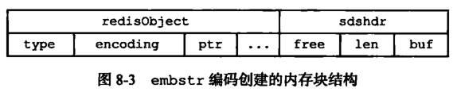
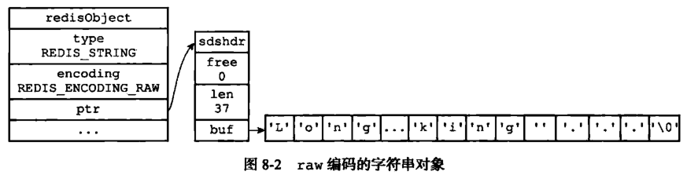
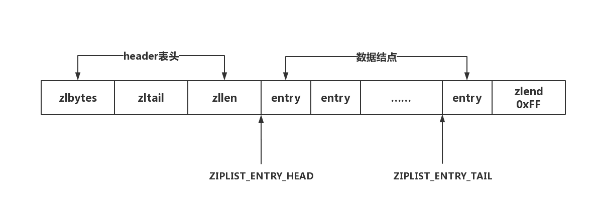
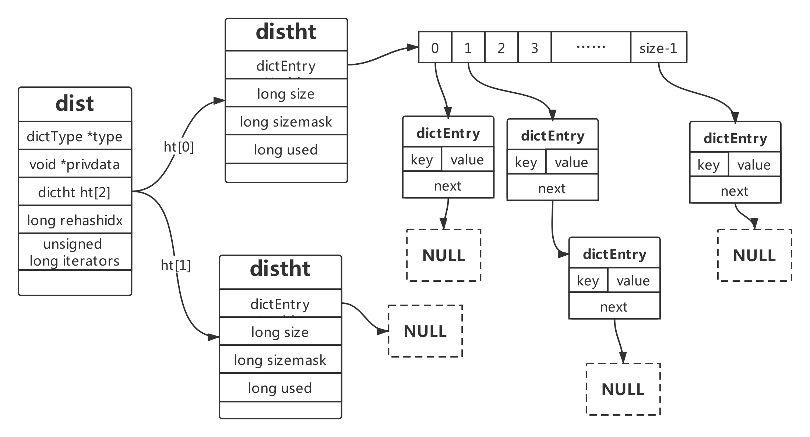
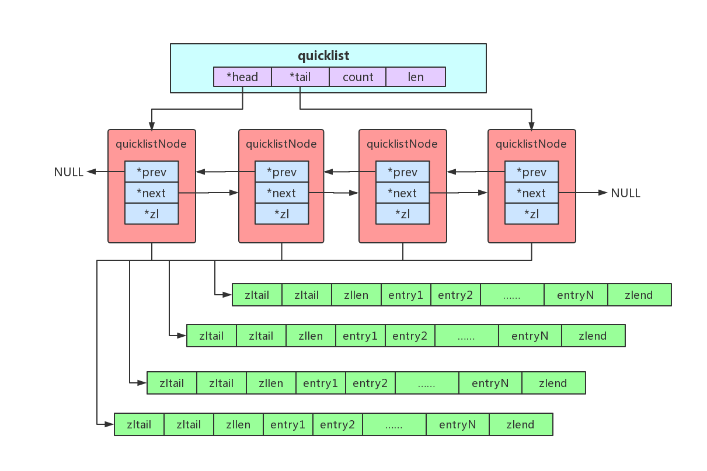
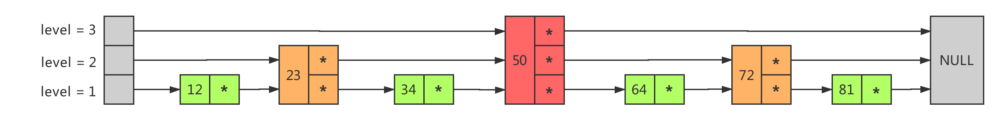

## Redis 简介

Redis是一个开源（BSD许可）的，内存存储的数据结构服务器，可用作数据库，高速缓存和消息队列代理；由于数据是存在内存中的，所以读写速度非常快，因此 Redis被广泛应用于缓存方向。 

## Redis 数据结构

| 数据类型 | 可以存储的值           | 操作                                                         |
| -------- | ---------------------- | ------------------------------------------------------------ |
| STRING   | 字符串、整数或者浮点数 | 对整个字符串或者字符串的其中一部分执行操作<br/>对整数和浮点数执行自增或者自减操作 |
| LIST     | 列表                   | 从两端压入或者弹出元素<br/>对单个或者多个元素进行修剪， 只保留一个范围内的元素 |
| SET      | 无序集合               | 添加、获取、移除单个元素<br/>检查一个元素是否存在于集合中<br/>计算交集、并集、差集<br/>从集合里面随机获取元素 |
| HASH     | 包含键值对的无序散列表 | 添加、获取、移除单个键值对<br/>获取所有键值对<br/>检查某个键是否存在 |
| ZSET     | 有序集合               | 添加、获取、删除元素<br/>根据分值范围或者成员来获取元素<br/>计算一个键的排名 |

Redis 是K-V 的数据库，它是通过hashtable 实现的（外层的哈希）。所以每个键值对都会有一个dictEntry，里面指向了key 和value 的指针。next 指向下一个dictEntry。

~~~c
typedef struct dictEntry {
    void *key; // key 指针
    union { // value
        void *val;
        uint64_t u64;
        int64_t s64;
        double d;
    } v;
    struct dictEntry *next; // 指向下一个键值对节点,拉链法解决hash冲突
} dictEntry;
~~~


### 对象系统(redisObject)

对象结构robj功能：

- 为5种不同的对象类型提供同一的表示形式。
- 为不同的对象适用于不同的场景，支持同一种对象类型采用多种的数据结构方式。
- 支持引用计数，实现对象共享机制。
- 记录对象的访问时间，便于删除对象。

~~~c
typedef struct redisObject {
    // 对象的数据类型,占4bits
    unsigned type:4; 
    // 对象的编码类型,占4bits
    unsigned encoding:4;
    // LRU时间或LFU数据，和数据淘汰策略有关
    unsigned lru:LRU_BITS; 
    // 引用计数 当refcount 为0 的时候，表示该对象已经不被任何对象引用，则可以进行垃圾回收了 
    int refcount;
    // 指向底层数据实现的指针
    void *ptr;
} robj;
// type的占5种类型： 
#define OBJ_STRING 0    // 字符串对象
#define OBJ_LIST 1      // 列表对象
#define OBJ_SET 2       // 集合对象
#define OBJ_ZSET 3      // 有序集合对象
#define OBJ_HASH 4      // 哈希对象
// encoding 类型
#define OBJ_ENCODING_RAW 0     // 原始表示方式，字符串对象是简单动态字符串
#define OBJ_ENCODING_INT 1     // 整数
#define OBJ_ENCODING_HT 2      // hash table
#define OBJ_ENCODING_ZIPMAP 3  // zipmap 不再使用
#define OBJ_ENCODING_LINKEDLIST 4 // 双端链表,不再使用
#define OBJ_ENCODING_ZIPLIST 5 // 压缩列表
#define OBJ_ENCODING_INTSET 6  // 整数集合
#define OBJ_ENCODING_SKIPLIST 7   // 跳跃表
#define OBJ_ENCODING_EMBSTR 8  // embstr编码的简单动态字符串
#define OBJ_ENCODING_QUICKLIST 9 // 快速列表
// 5.0 推出的数据类型。支持多播的可持久化的消息队列，用于实现发布订阅功能，借鉴了kafka 的设计。
#define OBJ_ENCODING_STREAM 10 // 流
~~~

### String字符串

字符串类型的内部编码有三种：

1. **int**: 存储8 个字节的长整型（long，2^63-1）。
2. **embstr**: 代表embstr 格式的SDS（Simple Dynamic String 简单动态字符串），存储小于44 个字节的字符串。
3. **raw**: 存储大于44 个字节的字符串

**sds**

sds是Redis中字符串的实现；Redis 3.2分支引入了五种sdshdr类型，目的是为了满足不同长度字符串可以使用不同大小的Header，从而节省内存，每次在创建一个sds时根据sds的实际长度判断应该选择什么类型的sdshdr，不同类型的sdshdr占用的内存空间不同

```c
typedef char *sds;
// sdshdr5 从不使用
struct __attribute__ ((__packed__)) sdshdr5 {
    unsigned char flags; /* 3 lsb of type, and 5 msb of string length */
    char buf[];
};
struct __attribute__ ((__packed__)) sdshdr8 { // 8表示字符串最大长度是2^8-1 （长度为255）
    uint8_t len; // 字符串的真正长度
    uint8_t alloc; // 字符串的最大容量，或者已分配的内存大小
    // 用一个字节表示sdshdr的类型,sdshdr有五种类型,3位来表示
    // 000:sdshdr5;001:sdshdr8;010:sdshdr16;011:sdshdr32;100:sdshdr64;
    unsigned char flags; 
    // sds 实际存放的位置,本质是字符数组
    char buf[];
};
struct __attribute__ ((__packed__)) sdshdr16 {
    uint16_t len; /* used */
    uint16_t alloc; /* excluding the header and null terminator */
    unsigned char flags; /* 3 lsb of type, 5 unused bits */
    char buf[];
};
struct __attribute__ ((__packed__)) sdshdr32 {
    uint32_t len; /* used */
    uint32_t alloc; /* excluding the header and null terminator */
    unsigned char flags; /* 3 lsb of type, 5 unused bits */
    char buf[];
};
struct __attribute__ ((__packed__)) sdshdr64 {
    uint64_t len; /* used */
    uint64_t alloc; /* excluding the header and null terminator */
    unsigned char flags; /* 3 lsb of type, 5 unused bits */
    char buf[];
};
```

**为什么Redis 要用SDS 实现字符串？**

C 语言本身没有字符串类型（只能用字符数组char[]实现）

1. 使用字符数组必须先给目标变量分配足够的空间，否则可能会溢出。
2. 如果要获取字符长度，必须遍历字符数组，时间复杂度是O(n)。
3. C语言 字符串长度的变更会对字符数组做内存重分配。
4. 通过从字符串开始到结尾碰到的第一个'\0'来标记字符串的结束，因此不能保存图片、音频、视频、压缩文件等二进制(bytes)保存的内容，二进制不安全

SDS 的特点：

1. 不用担心内存溢出问题，如果需要会对SDS 进行扩容。
2. 获取字符串长度时间复杂度为O(1)，因为定义了len 属性。
3. 通过"空间预分配"（sdsMakeRoomFor）和“惰性空间释放”，防止多次重分配内存。
4. 判断是否结束的标志是len 属性（它同样以'\0'结尾是因为这样就可以使用C语言中函数库操作字符串的函数了），可以包含'\0'。

| C 字符串                                     | SDS                                          |
| -------------------------------------------- | -------------------------------------------- |
| 获取字符串长度的复杂度为O(N)                 | 获取字符串长度的复杂度为O(1)                 |
| API 是不安全的，可能会造成缓冲区溢出         | API 是安全的，不会造成缓冲区溢出             |
| 修改字符串长度N 次必然需要执行N 次内存重分配 | 修改字符串长度N 次最多需要执行N 次内存重分配 |
| 只能保存文本数据                             | 可以保存文本或者二进制数据                   |
| 可以使用所有<string.h>库中的函数             | 可以使用一部分<string.h>库中的函数           |

**embstr 和raw 的区别？**





embstr 的使用只分配一次内存空间（因为RedisObject 和SDS 是连续的），而raw需要分配两次内存空间（分别为RedisObject 和SDS 分配空间）；

因此与raw 相比，embstr 的好处在于创建时少分配一次空间，删除时少释放一次空间，以及对象的所有数据连在一起，寻找方便。

而embstr 的坏处也很明显，如果字符串的长度增加需要重新分配内存时，整个RedisObject 和SDS 都需要重新分配空间，因此Redis 中的embstr 实现为只读。

**int 和embstr 什么时候转化为raw？**

当int 数据不再是整数，或大小超过了long 的范围2^63-1=9223372036854775807）时，自动转化为embstr

**明明没有超过阈值，为什么变成raw 了？**

对于embstr，由于其实现是只读的，因此在对embstr 对象进行修改时，都会先转化为raw 再进行修改。因此，只要是修改embstr 对象，修改后的对象一定是raw 的，无论是否达到了44个字节。

**当长度小于阈值时，会还原吗？**

关于Redis 内部编码的转换，都符合以下规律：编码转换在Redis 写入数据时完成，且转换过程不可逆，只能从小内存编码向大内存编码转换（但是不包括重新set）。

**为什么要对底层的数据结构进行一层包装呢？**

通过封装，可以根据对象的类型动态地选择存储结构和可以使用的命令，实现节省空间和优化查询速度。

**应用场景**

**缓存**:  将热点数据放到内存中，设置内存的最大使用量以及淘汰策略来保证缓存的命中率 

**分布式Session**: Redis 是分布式的独立服务，可以在多个应用之间共享

**分布式锁**:  可以使用 Redis 自带的 SETNX 命令实现分布式锁，除此之外，还可以使用官方提供的 RedLock 分布式锁实现。 

**分布式ID**:  利用原子自增运算

**计数器**:  String 进行自增自减运算，从而实现计数器功能 

**限流**: 以访问者的IP 和其他信息作为key，访问一次增加一次计数，超过次数则返回false

### Hash哈希

Redis 的Hash 本身也是一个K-V 的结构，类似于Java 中的HashMap；当存储hash 数据类型时，被称为内层的哈希（相对于外层）。内层的哈希底层可以使用两种数据结构实现：

**ziplist**: OBJ_ENCODING_ZIPLIST（压缩列表）和 **hashtable**: OBJ_ENCODING_HT（哈希表）

**ziplist**: ziplist是一个经过特殊编码的双向链表，它的设计目标就是为了提高存储效率。ziplist可以用于存储字符串或整数，其中整数是按真正的二进制表示进行编码的，而不是编码成字符串序列。



- zlbytes：占4个字节，记录整个压缩列表占用的内存字节数。
- zltail：占4个字节，记录压缩列表尾节点entryN距离压缩列表的起始地址的字节数。
- zllen：占2个字节，记录了压缩列表的节点数量。
- entry：真正存放数据的数据项，长度不定
- zlend：占1个字节，保存一个常数255(0xFF)，ziplist的结束标记 

~~~c
typedef struct zlentry {
    unsigned int prevrawlensize;  // 上一个链表节点占用的长度
    unsigned int prevrawlen;      // 上一个链表节点的长度数值所需要的字节数 
    unsigned int lensize;         // 当前链表节点长度数值所需要的字节数
    unsigned int len;             // 当前链表节点占用的长度
    unsigned int headersize;      // 当前链表节点的头部大小
    unsigned char encoding;       // 编码方式
    unsigned char *p;             // 压缩链表以字符串的形式保存，该指针指向当前节点起始位置
} zlentry;
~~~


**什么时候使用ziplist 存储？**

当hash 对象同时满足以下两个条件的时候，使用ziplist 编码：

1. 所有的键值对的健和值的字符串长度都小于等于64 byte（一个英文字母一个字节）； 
2. 哈希对象保存的键值对数量小于512个

**dict**

dict是一个用于维护key和value映射关系的数据结构，和HashMap结构类似

~~~C
// 哈希表节点,单向链表
typedef struct dictEntry {
    void *key; // key
    union {
        void *val;
        uint64_t u64;
        int64_t s64;
        double d;
    } v; // value 因为value有多种类型，所以value用了union来存储 
    struct dictEntry *next; // next指针
} dictEntry;

typedef struct dictType {
    uint64_t (*hashFunction)(const void *key);
    void *(*keyDup)(void *privdata, const void *key);
    void *(*valDup)(void *privdata, const void *obj);
    int (*keyCompare)(void *privdata, const void *key1, const void *key2);
    void (*keyDestructor)(void *privdata, void *key);
    void (*valDestructor)(void *privdata, void *obj);
} dictType;
 
// 哈希表
typedef struct dictht {
    dictEntry **table; // 存放一个数组的地址，数组存放着哈希表节点dictEntry的地址。
    unsigned long size; // 哈希表(hashTable)的大小，保持为2^n
    unsigned long sizemask; // 用于将哈希值映射到table的位置索引。它的值总是等于(size-1)。
    unsigned long used;// 记录哈希表已有的节点（键值对）数量。
} dictht;
// 字典
typedef struct dict {
    dictType *type;
    void *privdata;
    dictht ht[2]; // 两张哈希表(hashTable) ht[0]平时用，ht[1] rehash时用 
    long rehashidx; // 当前rehash到buckets的哪个索引，-1时表示非rehash状态
    unsigned long iterators; /* number of iterators currently running */
} dict;
~~~

**dict结构图**



**为什么要定义两个哈希表？**ht[2]

Redis 的hash 默认使用的是ht[0]，ht[1]不会初始化和分配空间。哈希表dictht 是用链地址法来解决碰撞问题的。在这种情况下，哈希表的性能取决于它的大小（size 属性）和它所保存的节点的数量（used 属性）之间的比率：

* 比率在1:1 时（一个哈希表ht 只存储一个节点entry），哈希表的性能最好；
* 如果节点数量比哈希表的大小要大很多的话（这个比例用ratio 表示，5 表示平均一个ht 存储5 个entry），那么哈希表就会退化成多个链表，哈希表本身的性能优势就不再存在。


在这种情况下需要扩容。Redis 里面的这种操作叫做rehash。rehash 的步骤：

1. 为字符ht[1]哈希表分配空间，这个哈希表的空间大小取决于要执行的操作，以及ht[0]当前包含的键值对的数量。
   扩展：ht[1]的大小为第一个大于等于ht[0].used*2。
2. 将所有的ht[0]上的节点rehash 到ht[1]上，重新计算hash 值和索引，然后放入指定的位置。

3. 当ht[0]全部迁移到了ht[1]之后，释放ht[0]的空间，将ht[1]设置为ht[0]表，并创建新的ht[1]，为下次rehash 做准备

**应用场景**

**存储对象类型的数据**：比如对象或者一张表的数据，比String 节省了更多key 的空间，也更加便于集中管理。

**购物车**：key：用户id；field：商品id；value：商品数量；

+1：hincr；-1：hdecr；删除：hdel；全选：hgetall；商品数：hlen；

### List列表

**quicklist**: quicklist是一个由ziplist组成的双向链表

~~~C
typedef struct quicklistNode {
    struct quicklistNode *prev;  // 前驱结点
    struct quicklistNode *next;  // 后继结点
    unsigned char *zl;    		 // ziplist指针
    unsigned int sz;             // 当前ziplist 占用多少字节
    unsigned int count : 16;     // 前ziplist 中存储的元素数量
    unsigned int encoding : 2;   /* RAW==1 or LZF==2 */
    unsigned int container : 2;  /* NONE==1 or ZIPLIST==2 */
    unsigned int recompress : 1; /* was this node previous compressed? */
    unsigned int attempted_compress : 1; /* node can't compress; too small */
    unsigned int extra : 10; /* more bits to steal for future usage */
} quicklistNode;
 
typedef struct quicklistLZF {
    unsigned int sz; /* LZF size in bytes*/
    char compressed[];
} quicklistLZF;
 
typedef struct quicklist {
    quicklistNode *head;
    quicklistNode *tail;
    unsigned long count;        /* total count of all entries in all ziplists */
    unsigned long len;          /* number of quicklistNodes */
    int fill : 16;              /* fill factor for individual nodes */
    unsigned int compress : 16; /* depth of end nodes not to compress;0=off */
} quicklist;
~~~



**应用场景**

**消息队列**：List 提供了两个阻塞的弹出操作：BLPOP/BRPOP，可以设置超时时间。

BLPOP：BLPOP key1 timeout 移出并获取列表的第一个元素，如果列表没有元素会阻塞列表直到等待超时或发现可弹出元素为止

BRPOP：BRPOP key1 timeout 移出并获取列表的最后一个元素，如果列表没有元素会阻塞列表直到等待超时或发现可弹出元素为止

### Set集合

Redis 用intset 或hashtable 存储set。如果元素都是整数类型，就用inset 存储。如果不是整数类型，就用hashtable（数组+链表的存来储结构）。

hashtable如何存储set 的元素？key 就是元素的值，value 为null；如果元素个数超过512 个，也会用hashtable 存储；

**intset**: intset 是由整数组成的集合，SET存储整数时底层使用的数据结构，intset是一个由整数组成的有序集合，可以进行二分查找，用于快速地判断一个元素是否属于这个集合

~~~C
typedef struct intset {
    // 数据编码，表示intset中的每个数据元素用几个字节来存储
    uint32_t encoding;
	// intset中的元素个数
    uint32_t length;
    // intset 元素数组
    int8_t contents[];
} intset;
~~~

**应用场景**

Set 可以实现交集、并集等操作，从而实现共同好友等功能。

### ZSet有序集合

**存储（实现）原理**

同时满足以下条件时使用ziplist 编码：

元素数量小于128 个 ；所有member 的长度都小于64 字节；

在ziplist 的内部，按照score 排序递增来存储。插入的时候要移动之后的数据。

~~~properties
对应redis.conf 参数：
zset-max-ziplist-entries 128
zset-max-ziplist-value 64
~~~

超过阈值之后，使用skiplist+dict 存储

**skiplist**: skiplist是一个有序链表，其中每个节点包含不定数量的链接

- 跳跃表支持平均O(logN)，最坏O(N)复杂度的节点查找，大部分情况下，跳跃表的效率可以和平衡树相媲美。
- 跳跃表在Redis中当数据较多时作为有序集合键的实现方式之一

~~~C
typedef struct zskiplistNode {
    sds ele; // 节点数据
    double score; // 数据对应的分数
    struct zskiplistNode *backward; // 后退指针
    struct zskiplistLevel {
        struct zskiplistNode *forward; // 前进指针
        unsigned long span; // 示当前的指针跨越了多少个节点
    } level[]; // 层级数组
} zskiplistNode;

typedef struct zskiplist {
    struct zskiplistNode *header, *tail; // 头指针header和尾指针tail
    unsigned long length; // 链表长度 
    int level; // 层级数
} zskiplist;

// zset 底层是dict和skiplist
typedef struct zset {
    dict *dict;
    zskiplist *zsl;
} zset;
~~~



**应用场景**

ZSet 可以实现有序性操作，从而实现排行榜等功能。

## 发布订阅模式

除了通过list 实现消息队列之外，Redis 还提供了一组命令实现发布/订阅模式。

**订阅频道**: Redis中，订阅端和发布端通过channel实现消息的传递；消息的发布者（生产者）可以给指定的频道发布消息；只要有消息到达了频道，所有订阅了这个频道（包括规则匹配）的订阅者都会收到这条消息

**按规则（Pattern）订阅频道**: 支持?和\*占位符。?代表一个字符，\*代表0 个或者多个字符 

如果publish的channel同时符合多个订阅者的规则，消息会被同时接收

publish的信息是没有持久化的，所以错过的消息不会重新发送的

~~~java
// 监听器，可以理解为消费端
@Slf4j
public class MyListener extends JedisPubSub {
    // 监听到订阅的消息后处理
    @Override
    public void onMessage(String channel, String message) {
        log.debug("Channel：{}收到消息：{}",channel, message);
    } 
    // 初始化订阅时候的处理 
    @Override
    public void onSubscribe(String channel, int subscribedChannels) {
        log.debug("订阅频道：{}",channel );
    } 
    // 取消订阅时候的处理 
    @Override
    public void onUnsubscribe(String channel, int subscribedChannels) {
        log.debug("取消订阅：{}",channel );
    } 
    // 初始化按表达式的方式订阅时候的处理 
    @Override
    public void onPSubscribe(String pattern, int subscribedChannels) {
        log.debug("订阅频道：{}",pattern );
    } 
    // 取消按表达式的方式订阅时候的处理 
    @Override
    public void onPUnsubscribe(String pattern, int subscribedChannels) {
        log.debug("取消订阅：{}",pattern );
    } 
    // 取得按表达式的方式订阅的消息后的处理 
    @Override
    public void onPMessage(String pattern, String channel, String message) {
        log.debug("规则[{}] Channel：{}收到消息：{}",pattern,channel, message);
    }
}
~~~

Jedis订阅端的操作

~~~java
Jedis jedis = new Jedis(host,port);
MyListener listener = new MyListener();
// 使用规则匹配的方式设置频道 会阻塞, 之后的代码是不会执行的
jedis.psubscribe(listener, new String[]{"demo1-*","demo2-*"});
// jedis关联listener 设置频道 会阻塞
jedis.subscribe(listener, new String[]{"demo1-tes1","demo2-tes2"});
// 订阅端方法
listener.subscribe("demo2-test1");   // 新增订阅频道
listener.unsubscribe("demo2-test1"); // 取消订阅频道
listener.psubscribe(new String[]{"demo2-*"});  // 按规则新增订阅频道
listener.punsubscribe(new String[]{"demo2-*"});// 按规则取消订阅频道
~~~

Jedis发布端的操作

~~~java
Jedis jedis = new Jedis(host,port);
jedis.publish("demo1-test1","test_msg1"); // 发布消息 
~~~

## Redis 事务

Redis 中单个命令是原子性的，但是如果需要执行多个命令并保证原子性（同时成功或失败），把多个命令视为一个整体；我们就需要使用事务功能；Redis 事务实质上是把需要执行的命令放入一个队列，执行事务的时候把队列中的命令按顺序执行，

Redis 的事务涉及到四个命令：multi（开启事务），exec（执行事务），discard（取消事务），watch（监视）

~~~java
public class TestTransaction {
	// host 和端口号
    static final String host = "192.168.7.101";
    static final int port = 6379;
    // 事务test 
    @Test
    public void testTransaction() {
        Jedis jedis = new Jedis(host,port);
        Transaction multi  = jedis.multi(); // 开启事务
        try {
            // 开启事务后,之后的命令会被放入一个队列中 
            multi.set("k1","value1");
            multi.hset("k1","f1","value1");
            multi.hset("k2","f2","value2");
            // 执行事务,队列中所有的命令都会被执行
            multi.exec();
        } catch (Exception e) { 
        } finally {
            multi.close(); // 关闭事务
        } 
    }
}
~~~


在传统的关系型数据中，只要有任意一条指令失败，则整个事务都会被撤销回滚；而在Redis中，中间某条指令的失败不会导致前面已做指令的回滚，后续的命令也不会停止执行，Redis 事务的执行并不是原子性的

**Redis事务的三条性质**：

1. 单独的隔离操作：事务中的所有命令会按顺序执行，在执行的过程中不会受到其他客户端请求的影响
2. 没有隔离级别的概念：队列中的命令在事务没有被提交之前不会被实际执行
3. 不保证原子性：Redis中的一个事务中如果存在命令执行失败，那么其他命令依然会被执行，没有回滚机制

**watch命令**：监视一个或者多个key，如果开启事务之后，至少有一个被监视key 在exec 执行之前被修改了，那么整个事务都会被取消（key 提前过期除外）

~~~java
@Test // watch 测试
public void testWatch() throws IOException {
    ExecutorService pool = Executors.newFixedThreadPool(2);
    pool.execute(() -> {
        Jedis jedis = new Jedis(host,port);
        String watch = jedis.watch("k1"); // watch 指令
        log.debug("method1线程[{}]watch结果:{}",Thread.currentThread().getName(),watch);
        Transaction multi = jedis.multi(); // 开始事务
        multi.set("k1", Thread.currentThread().getName());
        try {
            Thread.sleep(2000);
        } catch (InterruptedException e) {
            e.printStackTrace();
        }
        List<Object> exec = multi.exec(); // 执行事务
        log.debug("method1执行结果:{}",exec);
        jedis.unwatch();

    } );
    pool.execute(() -> {
        Jedis jedis = new Jedis(host,port);// watch 指令
        String watch = jedis.watch("k1");
        log.debug("method2线程[{}]watch结果:{}",Thread.currentThread().getName(),watch);
        Transaction multi = jedis.multi(); // 开始事务
        multi.set("k1", Thread.currentThread().getName());
        List<Object> exec = multi.exec(); // 执行事务
        log.debug("method2执行结果:{}",exec);

    });
    System.in.read(); 
}
// 打印结果
17:29:42 391|DEBUG|TestTransaction.java.lambda$testWatch$1:73|method2线程[pool-1-thread-2]watch结果:OK
17:29:42 391|DEBUG|TestTransaction.java.lambda$testWatch$0:57|method1线程[pool-1-thread-1]watch结果:OK
17:29:42 410|DEBUG|TestTransaction.java.lambda$testWatch$1:77|method2执行结果:[OK]
17:29:44 410|DEBUG|TestTransaction.java.lambda$testWatch$0:66|method1执行结果:null
~~~


## Redis 为什么快

Redis QPS测试指令

~~~she
[root@localhost ~]# cd /usr/local/services/redis/redis-5.0.5/src
[root@localhost src]# redis-benchmark -t set,lpush -n 100000 -q
~~~

根据官方的数据，Redis 的QPS 可以达到10 万左右（每秒请求数）

**Redis 为什么这么快？**

1. 完全基于内存，绝大部分请求是纯内存操作，非常快速 
2. Redis中的数据结构是专门进行设计的；
3. 采用单线程，避免了不必要的上下文切换，不会因为多线程切换而消耗 CPU资源，不用去考虑各种锁的问题，不存在加锁释放锁操作，没有因为可能出现死锁而导致的性能消耗；
4. 使用多路I/O复用模型，非阻塞IO；

## 内存回收

Redis 所有的数据都是存储在内存中的，在某些情况下需要对占用的内存进行回收。内存回收主要分为两类，一类是key 过期，一类是内存使用达到上限（max_memory）触发内存淘汰。

### 过期策略

在Redis中提供了Expire命令设置一个键的过期时间，到期以后Redis会自动删除它。

Redis使用两种删除方式**定期删除+惰性删除**

- **定期删除**：Redis默认是每隔 100 ms 就**随机抽取**一些设置了过期时间的key，检查其是否过期，如果过期就删除。注意这里是随机抽取的。为什么要随机，假如 Redis存了几十万个 key ，每隔100 ms就遍历所有的设置过期时间的 key 的话，就会给 CPU 带来很大的负载
- **惰性删除**：定期删除可能会导致很多过期 key 到了时间并没有被删除掉。所以就有了惰性删除。如果过期 key，靠定期删除没有被删除掉，还停留在内存里，除非你的系统去查一下那个 key，才会被Redis给删除掉。这就是所谓的惰性删除；

但是仅仅通过设置过期时间还是有问题的。我们想一下：如果定期删除漏掉了很多过期 key，然后你也没及时去查，也就没走惰性删除，此时会怎么样？如果大量过期key堆积在内存里，导致Redis内存块耗尽了。怎么解决这个问题呢？

### **内存淘汰机制**

当内存使用达到最大内存极限时，需要使用淘汰算法来决定清理掉部分数据，以保证新数据的存入

**内存淘汰算法**

**LRU(Least Recently Used)**：最近最少使用。判断最近被使用的时间，目前最远的数据优先被淘汰。

**LFU(Least Frequently Used)**：最不常用的数据优先被淘汰，4.0 版本新增

**random**：随机删除

**Redis 提供 6种数据淘汰策略：**

1. **volatile-lru**：从已设置过期时间的数据集（server.db[i].expires）中挑选最近最少使用的数据淘汰
2. **volatile-ttl**：从已设置过期时间的数据集（server.db[i].expires）中挑选将要过期的数据淘汰
3. **volatile-random**：从已设置过期时间的数据集（server.db[i].expires）中任意选择数据淘汰
4. **allkeys-lru**：当内存不足以容纳新写入数据时，在键空间中，移除最近最少使用的key（这个是最常用的）
5. **allkeys-random**：从数据集（server.db[i].dict）中任意选择数据淘汰
6. **no-eviction**：禁止驱逐数据，也就是说当内存不足以容纳新写入数据时，新写入操作会报错。

4.0版本后增加以下两种：

1. **volatile-lfu**：从已设置过期时间的数据集(server.db[i].expires)中挑选最不经常使用的数据淘汰
2. **allkeys-lfu**：当内存不足以容纳新写入数据时，在键空间中，移除最不经常使用的key

## 持久化机制

很多时候我们需要持久化数据，也就是将内存中的数据写入到硬盘里面，大部分原因是为了之后重用数据（比如重启机器、机器故障之后恢复数据），或者是为了防止系统故障而将数据备份到一个远程位置。

### RDB 

RDB 是Redis 默认的持久化方案；当满足一定条件的时候，会把当前内存中的数据写入磁盘，生成一个快照文件dump.rdb；Redis 重启会通过加载dump.rdb 文件恢复数据

**优点**

1. RDB 文件紧凑，体积小，网络传输快，适合全量复制，非常适用于备份和灾难恢复
2. 生成RDB 文件的时候，Redis 主进程会fork()一个子进程来处理所有保存工作，主进程不需要进行磁盘IO
3. 数据量很大的情况下，RDB恢复速度更快

**缺点**

1. RDB无法保存实时的数据，只能间隔一段时间执行，因为频繁执行fork()子进程成本过高
2. 因为间隔时间做一次备份，所以一旦Redis崩溃，会丢失生成快照之后修改的数据

### AOF

AOF 采用日志的形式来记录每个写命令，并追加到文件中。Redis 重启时会根据日志文件的内容把写命令重新执行一次，以完成数据的恢复工作。

**同步选项**

使用 AOF 持久化需要设置同步选项，从而确保写命令同步到磁盘文件上的时机。这是因为对文件进行写入并不会马上将内容同步到磁盘上，而是先存储到缓冲区，然后由操作系统决定什么时候同步到磁盘。有以下同步选项：

| 选项     | 同步频率                                         |
| -------- | ------------------------------------------------ |
| always   | 每个写命令都同步，保证数据同步到磁盘，效率很低   |
| everysec | 每秒同步一次，会导致丢失这1秒的数据              |
| no       | 让操作系统来决定何时同步，速度最快，但是不太安全 |

**重写机制**

由于AOF 持久化是Redis 不断将写命令记录到AOF 文件中，随着Redis 不断的运行，AOF 的文件会越来越大，文件越大，占用服务器内存越大以及AOF 恢复要求时间越长。

为了解决这个问题，Redis 新增了重写机制，当AOF 文件的大小超过所设定的阈值时，Redis 就会启动AOF 文件的内容压缩，只保留可以恢复数据的最小命令集。

**优点**

1. 与RDB持久化相对应，AOF的优点在于支持秒级持久化、兼容性好，不会造成数据的丢失

**缺点**

1. 对于具有相同数据的的Redis，AOF 文件通常会更大，数据量很大的情况下，恢复速度更慢
2. 虽然AOF 提供了多种同步的频率，但同步依然会消耗CPU的性能，高并发情况下RDB性能更好


## Redis 集群

**为什么需要集群？**

**性能**：Redis 本身的QPS 已经很高了，但是在一些并发量非常高的情况下，单机的性能还是会遇到瓶颈

**扩展**：Redis 所有的数据都放在内存中，如果数据量大，很容易受到硬件的限制；单纯升级内存回报太低，所以需要横向扩展

**可用性**：如果只有一个Redis服务，一旦服务宕机，会对业务造成很大的影响

Redis 集群由一个主节点（master）和多个从节点(slave)组成

## 主从复制

### 连接阶段

1. slave节点启动时，会在本地保存master节点的信息，包括IP和端口
2. slave节点内部有个定时任务replicationCron，每隔1秒钟检查是否有新的master节点要连接和复制，如果发现，就跟master 节点建立socket 网络连接，一旦连接成功，slave节点为该socket 建立一个专门处理复制工作的文件事件处理器，负责后续的复制工作，如接收RDB 文件、接收命令传播等。当slave节点变成了master节点之后，会给master节点发送ping 请求

### 数据同步阶段

3. master节点第一次执行全量复制，通过bgsave 命令在本地生成一份RDB 快照，将RDB 快照文件发给slave node（如果超时会重连，可以调大repl-timeout 的值）；slave节点首先清除自己的旧数据，然后用RDB 文件加载数据

### 命令传播阶段

4. master 节点持续将写命令通过异步的方式复制给slave 节点

**主从复制的不足**

主从复制解决了数据备份和性能（通过读写分离）的问题，但是还是存在一些不足

1. RDB 文件过大的情况下，同步非常耗时
2. 单点问题，一旦master节点挂掉，整个集群将无法对外提供服务

## Sentinel

Redis集群为了保证高可用，避免单点问题，需要一个机制保证master节点挂掉之后恢复集群服务，重新选举master，引入了Sentinel （哨兵） 机制

为了保证监控服务器的可用性，我们会对Sentinel 做集群部署；Sentinel 既监控所有的Redis 服务，Sentinel 之间也相互监控；Sentinel 本身没有主从之分，只有Redis 服务节点有主从之分 

### **Sentinel的功能**

**监控**：Sentinel 会不断检查Master和Slave是否正常运行。

**通知**：如果某一个被监控的Redis节点出现问题，Sentinel 可以通过API 向管理员或者其他应用程序发出通知。 

**自动故障转移**：如果Master发生故障，Sentinel 可以启动故障转移过程。把失效Master的其中一个Slave升级为新的Master，并发出通知。

**配置管理**：客户端连接到Sentinel，获取当前的Redis 新Master的地址。

### 工作流程

**服务下线**：Sentinel 默认以每秒钟1 次的频率向Redis 服务节点发送PING 命令。如果在down-after-milliseconds 内都没有收到有效回复，Sentinel 会将该服务器标记为下线（主观下线）。 Sentinel 节点会继续询问其他的Sentinel 节点，确认这个节点是否下线，如果多数Sentinel 节点都认为master 下线，master 才真正确认被下线（客观下线），

这个时候就需要重新选举master。

**故障转移**：如果master 被标记为下线，就会开始故障转移流程。

故障转移流程的第一步就是在Sentinel 集群选择一个Leader，由Leader 完成故障转移流程。Sentinel 通过Raft 算法，实现Sentinel 选举。
**Raft 算法**：[算法演示](http://thesecretlivesofdata.com/raft/)

**如何选择master**

master选举一共有四个因素影响选举的结果，分别是断开连接时长、优先级排序、复制数量、进程id

1. 如果与哨兵连接断开的比较久，超过了某个阈值，就直接失去了选举权。如果拥有选举权，那就看谁的优先级高，这个在配置文件里可以设置（replica-priority 100），数值越小优先级越高。
2. 如果优先级相同，就看谁从master 中复制的数据最多（复制偏移量最大），选最多的那个；如果复制数量也相同，就选择进程id 最小的那个

**哨兵机制的不足**

1. 主从切换的过程中会丢失数据，因为只有一个master 
2. 只能向master 写入，没有解决水平扩容的问题
3. 如果数据量非常大，这个时候我们需要多个master-slave 的group，把数据分布到不同的group 中

## Redis分片

分片是将数据划分为多个部分的方法，可以将数据存储到多台机器里面， 可以有效减轻单台Redis实例的压力，扩展存储能力和计算能力 

### 客户端分片

Jedis 客户端提供了Redis Sharding 的方案，并且支持连接池

~~~java
public void testSharding() {
    JedisPoolConfig poolConfig = new JedisPoolConfig(); 
    // Redis服务器
    JedisShardInfo shardInfo1 = new JedisShardInfo("192.168.7.101", 6379);
    JedisShardInfo shardInfo2 = new JedisShardInfo("192.168.7.102", 6379);
    JedisShardInfo shardInfo3 = new JedisShardInfo("192.168.7.103", 6379);

    // 连接池
    List<JedisShardInfo> shards = Arrays.asList(shardInfo1, shardInfo2,shardInfo3);
    ShardedJedisPool jedisPool = new ShardedJedisPool(poolConfig, shards);
    ShardedJedis jedis = null;
    try{
        // ShardedJedis 这里开始分片
        jedis = jedisPool.getResource();
        for (int i=0; i < 100; i++){
            jedis.set("k" + i, ""+i);
        }
        for (int i=0; i < 100; i++){
            Client client = jedis.getShard("k" + i).getClient();
            log.debug("取到值:{},当前key位于{}:{}",jedis.get("k" + i) , client.getHost() ,client.getPort());
        } 
    }finally{
        if (jedis != null) {
            jedis.close();
        }
    }
}
~~~

**原理**

~~~java
// jedisPool.getResource(); ShardedJedisPool类的getResource()方法会创建一个ShardedJedis对象
public ShardedJedis getResource() {
    ShardedJedis jedis = (ShardedJedis)super.getResource(); // 父类的方法
    jedis.setDataSource(this);
    return jedis;
}
// 抽象类Pool的方法
public T getResource() {
    try {
        return this.internalPool.borrowObject(); // GenericObjectPool中的方法
    } catch (NoSuchElementException var2) { 
        // …………
    } catch (Exception var3) { 
        // …………
    }
}
// GenericObjectPool 类中 最终调用了this.factory.makeObject()
private PooledObject<T> create() throws Exception {
    p = this.factory.makeObject(); // 最终这个方法生成了ShardedJedis对象
}
// ShardedJedisPool的构造方法
public ShardedJedisPool(GenericObjectPoolConfig poolConfig, List<JedisShardInfo> shards, Hashing algo, 
                        Pattern keyTagPattern) {
    // 调用父类，创建了一个ShardedJedisFactory实例
    super(poolConfig, new ShardedJedisPool.ShardedJedisFactory(shards, algo, keyTagPattern));
}
public Pool(GenericObjectPoolConfig poolConfig, PooledObjectFactory<T> factory) {
    this.initPool(poolConfig, factory);
}
public void initPool(GenericObjectPoolConfig poolConfig, PooledObjectFactory<T> factory) {
    if (this.internalPool != null) {
        try {
            this.closeInternalPool();
        } catch (Exception var4) {
        }
    }
	// ShardedJedisFactory实例factory被赋值给GenericObjectPool的实例internalPool
    this.internalPool = new GenericObjectPool(factory, poolConfig);
}
// ShardedJedisPool的内部类ShardedJedisFactory
public PooledObject<ShardedJedis> makeObject() throws Exception {
    // 通过new方法创建实例对象
    ShardedJedis jedis = new ShardedJedis(this.shards, this.algo, this.keyTagPattern);
    return new DefaultPooledObject(jedis);
}
~~~

ShardedJedis的构造方法最终会调用一个initialize方法

~~~java
public ShardedJedis(List<JedisShardInfo> shards, Hashing algo, Pattern keyTagPattern) {
    super(shards, algo, keyTagPattern);
}
// ShardedJedis 的父类Sharded的构造方法会调用initialize()
public Sharded(List<S> shards, Hashing algo, Pattern tagPattern) {
    this.resources = new LinkedHashMap();
    this.tagPattern = null;
    this.algo = algo;
    this.tagPattern = tagPattern;
    this.initialize(shards);
}
~~~

Redis节点放入容器 ShardedJedis

~~~java
private TreeMap<Long, S> nodes; // 节点
private final Map<ShardInfo<R>, R> resources;
private void initialize(List<S> shards) {
    // 构造一棵红黑树
    this.nodes = new TreeMap();
	// 遍历Redis节点
    for(int i = 0; i != shards.size(); ++i) {
        S shardInfo = (ShardInfo)shards.get(i);
        int n;
        // 为每个Redis节点创建160个虚拟节点，放到红黑树中
        if (shardInfo.getName() == null) {
            for(n = 0; n < 160 * shardInfo.getWeight(); ++n) {
                this.nodes.put(this.algo.hash("SHARD-" + i + "-NODE-" + n), shardInfo);
            }
        } else {
            for(n = 0; n < 160 * shardInfo.getWeight(); ++n) {
                this.nodes.put(this.algo.hash(shardInfo.getName() + "*" + n), shardInfo);
            }
        }
		// 添加到 resources 中，键为ShardInfo，值为redis实例
        this.resources.put(shardInfo, shardInfo.createResource());
    }
}
~~~

根据 key 获取到客户端

~~~java
Client client = jedis.getShard("k" + i).getClient();
public R getShard(String key) {
    return this.resources.get(this.getShardInfo(key));
} 
// 由于红黑树是有序的，可以很容易获取到某个node所有比node大 的集合，实现哈希环
public S getShardInfo(byte[] key) {
    SortedMap<Long, S> tail = this.nodes.tailMap(this.algo.hash(key));
    return tail.isEmpty() ? (ShardInfo)this.nodes.get(this.nodes.firstKey()) : 
    (ShardInfo)tail.get(tail.firstKey());
}
~~~

### 代理分片

将客户端请求发送到代理上，由代理转发请求到正确的节点上

典型的代理分区方案有Twitter 开源的Twemproxy 和国内的豌豆荚开源的Codis

### 服务器分片

Redis Cluster 可以看成是由多个Redis 实例组成的数据集合。客户端不需要关注数据的子集到底存储在哪个节点，只需要关注这个集合整体


## Redis 分布式锁

分布式锁的基本特性或者要求：

1. 互斥性：只有一个客户端能够持有锁
2. 不会产生死锁：即使持有锁的客户端崩溃，也能保证后续其他客户端可以获取锁
3. 只有持有这把锁的客户端才能解锁

原理：创建一个lock-key当前线程信息（key）和重入次数（value），lock-key存在失效时间，lock-key失效释放锁

**优点：**性能好，实现起来较为方便。

**缺点：**通过超时时间来控制锁的失效时间并不是十分的靠谱

**Lock**

1. 判断lock-key是否存在，不存在直接调用hash存储当前线程信息并且设置过期时间，返回nil，告诉客户端直接获取到锁。
2. 判断lock-key是否存在，且线程信息是否和当前线程相同，相同则将重入次数加1，并重新设置过期时间，返回nil，告诉客户端直接获取到锁。
3. 被其它线程已经锁定，返回锁有效期的剩余时间，告诉客户端需要等待。

**UnLock**

1. 如果lock-key不存在，发消息说锁已经可用，发送一个消息
2. 如果锁不是被当前线程锁定，则返回nil
3. 由于支持可重入，在解锁时将重入次数需要减1
4. 如果计算后的重入次数>0，则重新设置过期时间
5. 如果计算后的重入次数<=0，则发消息说锁已经可用

## 数据一致性

### 缓存使用场景

针对读多写少的场景，可以使用缓存来提升查询性能，减少数据库的消耗；步骤：

1. 如果查询的数据在Redis中存在，直接从Redis中取数据，不需要查询数据库
2. 如果不存在，先从数据库中拿到数据，然后把数据写入Redis中，返回给应用

### 一致性问题

数据库和缓存是没有办法，也没有必要做到强一致性，只能实现最终一致性；我们没有办法通过事务来使Redis和数据库的数据保持一致，而且我们引入缓存的目的就是为了高可用，就需要降低对一致性的要求；

**更新缓存还是让缓存失效**

更新缓存表示数据不但会写入到数据库，还会同步更新缓存；

而让缓存失效是表示只更新数据库中的数据，然后删除缓存中对应的key。

1. 如果更新缓存的代价很小，那么可以先更新缓存，不需要很复杂的计算。
2. 如果是更新缓存的代价很大，需要通过多个接口调用和数据查询才能获得最新的结果，那么可以先淘汰缓存。淘汰缓存以后后续的请求如果在缓存中找不到，自然去数据库中查询然后创建新的缓存

**先操作数据库还是先操作缓存**

假设我们以让缓存失效作为缓存的的处理方式，那么又会存在两种情况，

**先更新数据库，再让缓存失效**

异常情况：更新数据库成功，删除缓存失败。数据库是新数据，缓存是旧数据，发生了不一致的情况

解决方案：  重试机制 删除缓存失败，捕获异常，把需要删除的key 发送到消息队列，然后消费端收到消息尝试再次删除这个key

**先让缓存失效，再更新数据库**

在高并发场景下，如果删除缓存成功，更新数据库过程中，别的请求导致生成了被淘汰的缓存，也会造成数据不一致

解决方案：采用延时双删的策略，在写入数据之后，再删除一次缓存

## 高并发问题

### 热点数据发现

**客户端**: 对所有调用了get、set 方法的地方，加上key 的计数。缺点：每一个地方都要修改，重复的代码也多 

**代理层**: 在代理端实现，比如TwemProxy 或者Codis

**服务端**: 在服务端统计，Redis 有一个monitor 的命令，可以监控到所有Redis执行的命令

### 缓存雪崩

缓存雪崩可以简单的理解为：由于大量缓存同时失效，新缓存还未生成，所有原本应该访问缓存的请求都去查询数据库了，而对数据库CPU 和内存造成巨大压力，严重的会造成数据库宕机。从而形成一系列连锁反应，造成整个系统崩溃。

**解决方案**：

1. 加互斥锁或者使用队列，针对同一个key 只允许一个线程到数据库查询
2. 缓存定时预先更新，避免同时失效
3. 通过加随机数，使key 在不同的时间过期
4. 缓存永不过期

### 缓存穿透

用户查询数据，如果数据库没有，自然在缓存中也不会有。这样就导致用户查询的时候，在缓存中找不到，每次都要去数据库再查询一遍，然后返回空（相当于进行了两次无用的查询）。这样请求就绕过缓存直接查数据库，如果有心人利用这点，发送大量没有缓存的请求，就会造成数据库的访问压力。这个就是缓存穿透。

有很多种方法可以有效地解决缓存穿透问题，最常见的则是采用布隆过滤器，将所有可能存在的数据哈希到一个足够大的bitmap 中，一个一定不存在的数据会被这个bitmap 拦截掉，从而避免了对底层存储系统的查询压力。

另外也有一个更为简单粗暴的方法，如果一个查询返回的数据为空（不管是数据不存在，还是系统故障），我们仍然把这个空结果进行缓存，但它的过期时间会很短，最长不超过五分钟。通过这个直接设置的默认值存放到缓存，这样第二次到缓冲中获取就有值了，而不会继续访问数据库。

### 布隆过滤器

**原理**

判断元素是不是在一个集合里，一般做法是将集合中所有元素保存起来，然后通过比较确定。链表、树、散列表（又叫哈希表，Hash table）等数据结构都是这种思路。但是随着集合中元素的增加，需要的存储空间越来越大。同时检索速度也越来越慢。

Bloom Filter 是一种空间效率很高的随机数据结构，Bloom filter 可以看做是对 bit-map 的扩展, 它的原理是：

当一个元素被加入集合时，通过K个Hash 函数将这个元素映射成一个位阵列（Bit array）中的 K 个点，把它们置为 1。检索时，我们只要看看这些点是不是都是 1 就（大约）知道集合中有没有它了：

- 如果这些点有任何一个 0，则被检索元素**一定不存在**；
- 如果都是 1，则被检索元素**很可能**在；

**优点**

布隆过滤器的优点是空间效率和查询时间都远远超过一般的算法，布隆过滤器存储空间和插入 / 查询时间都是常数O(k)。布隆过滤器不需要存储元素本身，在某些对保密要求非常严格的场合有优势。

**缺点**

布隆过滤器的缺点和优点一样明显，存在一定的误算率。随着存入的元素数量增加，误算率随之增加