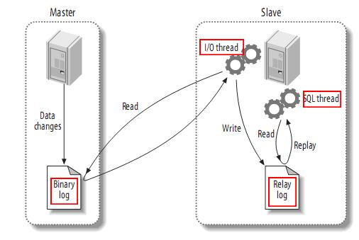

## 主从复制

### 复制流程

1. Master(主服务器)将数据修改记录到二进制日志(binary log)中（这些记录叫做二进制日志事件，binary log events）
2. Slave(从服务器)将Master的二进制日志事件(binary log events)拷贝到它的中继日志(relay log)
3. Slave重做中继日志(Relay Log)中的事件，将Master上的改变反映到它自己的数据库中

### 作用 

1. 数据备份：把数据复制到不同的机器上，以免单台服务器发生故障时数据丢失
2. 读写分离：让主库负责写，从库负责读，从而提高读写的并发度
3. 高可用HA：当节点故障时，自动转移到其他节点，提高可用性
4. 扩展：结合负载的机制，均摊所有的应用访问请求，降低单机IO

## 分库分表

### 为什么要分库分表

随着业务的不断发展，数据库中的数据会越来越大，使得增删改查的开销越来越大，操作越来越慢，而服务器的硬件资源是有限的，不能无限的提升，而且提升硬件带来收益和成本比太低，最终导致数据库的并发量和处理能力出现瓶颈

### 如何分库分表

### 分库分表会带来什么问题

**跨库表关联**

**全局事务**

**排序、翻页、分组和函数计算等**

**分布式ID**

### 解决方案

## 分布式事务

## Mycat

## Sharding-JDBC