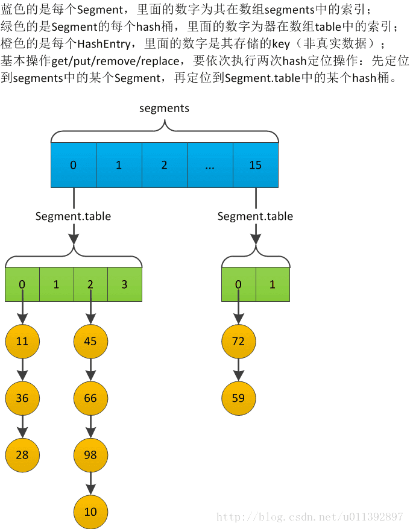

## 栈

栈（stack）又名堆栈，它是一种运算受限的**线性表**。其限制是仅允许在表的一端进行插入和删除运算。 

栈的实现有两种方式，数组和链表

java中stack类使用数组实现的，而且各个操作都加了synchronized关键字，是线程安全的

Vector新增和删除元素都会调用Arrays.copyOf(elementData, newCapacity)把数组重置，性能不佳

```java
// java中stack
public class Stack<E> extends Vector<E> {  
    // 数据元素 item 入栈 ,调用父类的方法
    public E push(E item) {
        addElement(item); // 调用父类的方法
        return item;
    } 
    // 栈顶元素出栈  
    public synchronized E pop() {
        E       obj;
        int     len = size(); 
        obj = peek();
        removeElementAt(len - 1); 
        return obj;
    } 
    // 查看栈顶元素
    public synchronized E peek() {
        int     len = size(); 
        if (len == 0)
            throw new EmptyStackException();
        return elementAt(len - 1);
    } 
    // 判断堆栈是否为空
    public boolean empty() {
        return size() == 0;
    } 
    // 查询元素O
    public synchronized int search(Object o) {
        int i = lastIndexOf(o);  查询元素O
        if (i >= 0) {
            return size() - i;
        }
        return -1;
    } 
}
// Vector
public class Vector<E> extends AbstractList<E>
    implements List<E>, RandomAccess, Cloneable, java.io.Serializable {
    // 数组实现
    protected Object[] elementData;
    // 添加元素
    public synchronized void addElement(E obj) {
        modCount++;
        add(obj, elementData, elementCount);
    }
    // 添加元素
    private void add(E e, Object[] elementData, int s) {
        if (s == elementData.length)
            elementData = grow(); // 扩容
        elementData[s] = e;
        elementCount = s + 1;
    }
    // 扩容，通过Arrays.copyOf()实现
    private Object[] grow() {
        return grow(elementCount + 1);
    }
    private Object[] grow(int minCapacity) {
        return elementData = Arrays.copyOf(elementData,
                                           newCapacity(minCapacity));
    }
}
```

## 队列

队列是一种特殊的**线性表**，特殊之处在于它只允许在表的前端（front）进行删除操作，而在表的后端（rear）进行插入操作，和栈一样，队列是一种操作受限制的线性表。进行插入操作的端称为队尾，进行删除操作的端称为队首。

和栈一样，队列也有两种实现方式，数组和链表

**java队列接口Queue**

由于双向队列Deque接口继承了Queue接口，并且功能更多，很多队列直接选择了双向队列接口

PriorityQueue优先级队列，出队顺序  --> 最小元素先出列 [详解](https://www.cnblogs.com/Elliott-Su-Faith-change-our-life/p/7472265.html)

```java
public class PriorityQueue<E> extends AbstractQueue<E> implements java.io.Serializable {
	private static final int DEFAULT_INITIAL_CAPACITY = 11;
 	// 队列元素，数组集合
    transient Object[] queue; // non-private to simplify nested class access
    private int size = 0;
    // 比较策略
    private final Comparator<? super E> comparator;
    // 入队
    public boolean offer(E e) {
        if (e == null)
            throw new NullPointerException();
        modCount++;
        int i = size;
        if (i >= queue.length)
            grow(i + 1); // 扩容
        size = i + 1;
        if (i == 0)
            queue[0] = e;
        else
            siftUp(i, e); // 有序入队
        return true;
    }
    // 取队首元素 始终是数组第0个元素
    public E peek() {
        return (size == 0) ? null : (E) queue[0];
    }
    // 出队
    public E poll() {
        if (size == 0)
            return null;
        int s = --size;
        modCount++;
        E result = (E) queue[0];
        E x = (E) queue[s];
        queue[s] = null;
        if (s != 0)
            siftDown(0, x);
        return result;
    }
    // 扩容
    private void grow(int minCapacity) {
        int oldCapacity = queue.length;
        // < 64 扩容翻倍，否则扩容50%
        int newCapacity = oldCapacity + ((oldCapacity < 64) ?  (oldCapacity + 2) :
                                         (oldCapacity >> 1));
        if (newCapacity - MAX_ARRAY_SIZE > 0)
            newCapacity = hugeCapacity(minCapacity);
        queue = Arrays.copyOf(queue, newCapacity); // 复制
    }
    // 构造最小堆，保证堆顶元素最小 
    private void siftUp(int k, E x) {
        if (comparator != null)
            siftUpUsingComparator(k, x);
        else
            siftUpComparable(k, x);
    }
    // 通过比较把x 放到数组的指定位置
    private void siftUpUsingComparator(int k, E x) {
        while (k > 0) {
            // 无符号右移，相当于 除以2，目的: 通过构建最小堆，把最小值放到0位置
            int parent = (k - 1) >>> 1; // 父结点
            Object e = queue[parent];
            if (comparator.compare(x, (E) e) >= 0)
                break;
            queue[k] = e; // x如果比位置k的元素小，后移
            k = parent;
        }
        // 构建最小堆，把x放入堆中，保证顶点元素最小 
        queue[k] = x;
    }
    
    private void siftDown(int k, E x) {
        if (comparator != null)
            siftDownUsingComparator(k, x);
        else
            siftDownComparable(k, x);
    }
    
    private void siftDownUsingComparator(int k, E x) {
        // 
        int half = size >>> 1;
        while (k < half) {
            int child = (k << 1) + 1; // 左子结点
            Object c = queue[child];
            int right = child + 1; // 右子结点
            if (right < size &&
                comparator.compare((E) c, (E) queue[right]) > 0)
                c = queue[child = right];
            if (comparator.compare(x, (E) c) <= 0)
                break;
            queue[k] = c;
            k = child;
        }
        queue[k] = x;
    }

}
```

线程安全的队列ConcurrentLinkedQueue

```java
public class ConcurrentLinkedQueue<E> extends AbstractQueue<E>
        implements Queue<E>, java.io.Serializable {
    // 内部类Node 结点 -- 单向链表    
    private static class Node<E> {
        volatile E item;
        volatile Node<E> next; 
        Node(E item) {
            UNSAFE.putObject(this, itemOffset, item);
        } 
        // CAS操作
        boolean casItem(E cmp, E val) {
            return UNSAFE.compareAndSwapObject(this, itemOffset, cmp, val);
        }

        void lazySetNext(Node<E> val) {
            UNSAFE.putOrderedObject(this, nextOffset, val);
        }
		// CAS next结点
        boolean casNext(Node<E> cmp, Node<E> val) {
            return UNSAFE.compareAndSwapObject(this, nextOffset, cmp, val);
        }
        private static final sun.misc.Unsafe UNSAFE;
        private static final long itemOffset;
        private static final long nextOffset;
        static {
            try {
                UNSAFE = sun.misc.Unsafe.getUnsafe();
                Class<?> k = Node.class;
                // 直接取内存地址偏移量
                itemOffset = UNSAFE.objectFieldOffset(k.getDeclaredField("item"));
                nextOffset = UNSAFE.objectFieldOffset(k.getDeclaredField("next"));
            } catch (Exception e) {
                throw new Error(e);
            }
        }
    }
	// 头结点
    private transient volatile Node<E> head;
	// 尾结点
    private transient volatile Node<E> tail;
    public ConcurrentLinkedQueue() { head = tail = new Node<E>(null);}
    // 入队
    public boolean offer(E e) {
        checkNotNull(e);
        final Node<E> newNode = new Node<E>(e);
        for (Node<E> t = tail, p = t;;) { // 自旋，找到尾结点
            Node<E> q = p.next; 
            if (q == null) { // 确定是尾结点
            	// 通过CAS把当前结点设位 p结点的next
                if (p.casNext(null, newNode)) {
                    // 成功，通过CAS将 newNode 设置为 tail 结点
                    if (p != t) // hop two nodes at a time
                        casTail(t, newNode);  // Failure is OK.
                    return true;
                }
                 
            } else if (p == q)
                p = (t != (t = tail)) ? t : head;
            else 
                p = (p != t && t != (t = tail)) ? t : q;
        }
    }
	// 出队
    public E poll() {
        restartFromHead: //goto,跳出循环
        for (;;) {
            for (Node<E> h = head, p = h, q;;) {
                E item = p.item; 
                if (item != null && p.casItem(item, null)) {
                  
                    if (p != h) // hop two nodes at a time
                        updateHead(h, ((q = p.next) != null) ? q : p);
                    return item;
                }
                else if ((q = p.next) == null) {
                    updateHead(h, p);
                    return null;
                }
                else if (p == q)
                    continue restartFromHead;
                else
                    p = q;
            }
        }
    }
}
```

**双向队列Deque**

双向队列，支持两端操作；支持先入先出和后入先出

```java
// 双向队列接口
public interface Deque<E> extends Queue<E> {
    // 头尾新增元素 无返回
    void addFirst(E e);
    void addLast(E e);
	// 头尾元素入队 有返回
    boolean offerFirst(E e)
    boolean offerLast(E e);
	// 头尾删除元素
    E removeFirst();
    E removeLast();
	// 头尾元素出队
    E pollFirst(); 
    E pollLast();
	// 头尾获取元素
    E getFirst(); 
    E getLast();
	// 头尾查看元素
    E peekFirst(); 
    E peekLast();
}
```

~~~java
// java数组实现队列接口
public class ArrayDeque<E> extends AbstractCollection<E> implements Deque<E>, Cloneable, Serializable {
    transient Object[] elements;// 数组元素集合，循环队列
    transient int head; // head元素指针，指向数组中head的位置 
    transient int tail; // tail元素指针，指向数组中tail的位置 
 	// 最小初始容量
    private static final int MIN_INITIAL_CAPACITY = 8;
    // 队首新增元素
    public void addFirst(E e) {
        if (e == null)
            throw new NullPointerException();
        // head - 1 左移一位     
        elements[head = (head - 1) & (elements.length - 1)] = e;
        if (head == tail) // head  tail相遇，说明数组已满
            doubleCapacity(); // 扩容
    }
    // 队尾新增元素
    public void addLast(E e) {
        if (e == null)
            throw new NullPointerException();
        elements[tail] = e;
        // tail + 1 右移一位     
        if ( (tail = (tail + 1) & (elements.length - 1)) == head)
            doubleCapacity();// 扩容
    }
    // 扩容
    private void doubleCapacity() {
        assert head == tail;
        int p = head;
        int n = elements.length;
        int r = n - p; // number of elements to the right of p
        int newCapacity = n << 1; // 扩容1倍
        if (newCapacity < 0)
            throw new IllegalStateException("Sorry, deque too big");
        Object[] a = new Object[newCapacity];
        System.arraycopy(elements, p, a, 0, r);// 复制
        System.arraycopy(elements, 0, a, r, p);
        elements = a;
        head = 0;
        tail = n;
    }

}
~~~

```java
// java链表实现队列
public class LinkedList<E> extends AbstractSequentialList<E>
    implements List<E>, Deque<E>, Cloneable, java.io.Serializable {
    transient int size = 0;// 队列大小
    transient Node<E> first;// 头结点
    transient Node<E> last;// 尾结点
    // 内部类，双向链表
    private static class Node<E> {
        E item;
        Node<E> next;
        Node<E> prev; 
        Node(Node<E> prev, E element, Node<E> next) {
            this.item = element;
            this.next = next;
            this.prev = prev;
        }
    }
    // 插入新结点First
    private void linkFirst(E e) {
        final Node<E> f = first;
        final Node<E> newNode = new Node<>(null, e, f);
        first = newNode;
        if (f == null)
            last = newNode;
        else
            f.prev = newNode;
        size++;
        modCount++;
    }
    // 移除头结点
    private E unlinkFirst(Node<E> f) { 
        final E element = f.item;
        final Node<E> next = f.next;
        f.item = null;
        f.next = null; // help GC
        first = next;
        if (next == null)
            last = null;
        else
            next.prev = null;
        size--;
        modCount++;
        return element;
    }
}
```

**阻塞队列BlockingQueue**

```java
// 阻塞队列接口BlockingQueue
public interface BlockingQueue<E> extends Queue<E> {
    // 元素入队，队列为满时阻塞
    void put(E e) throws InterruptedException;
    // 元素入队,带有超时机制
    boolean offer(E e, long timeout, TimeUnit unit) throws InterruptedException;
    // 元素出队，队列为空时阻塞   
    E take() throws InterruptedException;
    // 元素出队,带有超时机制
    E poll(long timeout, TimeUnit unit) throws InterruptedException;
}
```

```java
// 阻塞队列 数组实现
public class ArrayBlockingQueue<E> extends AbstractQueue<E>
		implements BlockingQueue<E>, java.io.Serializable { 
    final Object[] items;// 数组元素集合，循环队列
    int takeIndex;// head元素指针，指向数组中head的位置 
    int putIndex;// tail元素指针，指向数组中tail的位置
    int count; // 队列元素个数
    // 重入锁，保证线程安全   
    final ReentrantLock lock;
    // 通过Condition，出队时，队列如果为空，take方法阻塞 
    private final Condition notEmpty;
    // 通过Condition，入队时，队列如果满了，put方法阻塞
    private final Condition notFull;
    // 元素入队，队列为满时阻塞
    public void put(E e) throws InterruptedException {
        checkNotNull(e);
        final ReentrantLock lock = this.lock;
        lock.lockInterruptibly(); // 加锁
        try {
            while (count == items.length) // 队列元素已满
                notFull.await(); // 阻塞，等待
            enqueue(e);
        } finally {
            lock.unlock(); // 释放锁
        }
    }
    // 元素入队,带有超时机制
    public boolean offer(E e, long timeout, TimeUnit unit)
        throws InterruptedException {
        checkNotNull(e);
        long nanos = unit.toNanos(timeout); // 超时时间
        final ReentrantLock lock = this.lock;
        lock.lockInterruptibly(); // 加锁
        try {
            while (count == items.length) { // 队列元素已满
                if (nanos <= 0)
                    return false;
                nanos = notFull.awaitNanos(nanos); // 阻塞，等待时长为 nanos
            }
            enqueue(e);
            return true;
        } finally {
            lock.unlock(); // 释放锁
        }
    }
    // 元素出队，队列为空时阻塞
    public E take() throws InterruptedException {
        final ReentrantLock lock = this.lock;
        lock.lockInterruptibly(); // 加锁
        try {
            while (count == 0) // 队列元素为空
                notEmpty.await(); // 阻塞，等待
            return dequeue();
        } finally {
            lock.unlock(); // 释放锁
        }
    }
	// 元素出队,带有超时机制
    public E poll(long timeout, TimeUnit unit) throws InterruptedException {
        long nanos = unit.toNanos(timeout); // 超时时间
        final ReentrantLock lock = this.lock;
        lock.lockInterruptibly(); // 加锁
        try {
            while (count == 0) {// 队列元素为空
                if (nanos <= 0)
                    return null;
                nanos = notEmpty.awaitNanos(nanos);// 阻塞，等待时长为 nanos
            }
            return dequeue();
        } finally {
            lock.unlock(); // 释放锁
        }
    }
    // 入队，唤醒notEmpty 
    private void enqueue(E x) { 
        final Object[] items = this.items;
        items[putIndex] = x;
        if (++putIndex == items.length)
            putIndex = 0;
        count++;
        notEmpty.signal(); // 入队，唤醒notEmpty 
    }
    // 出队，唤醒notFull
    private E dequeue() { 
        final Object[] items = this.items;
        @SuppressWarnings("unchecked")
        E x = (E) items[takeIndex];
        items[takeIndex] = null;
        if (++takeIndex == items.length)
            takeIndex = 0;
        count--;
        if (itrs != null)
            itrs.elementDequeued();
        notFull.signal();// 出队，唤醒notFull
        return x;
    }
}
```

```java
// 阻塞队列 链表实现
public class LinkedBlockingQueue<E> extends AbstractQueue<E> 
		implements BlockingQueue<E>, java.io.Serializable {
    // 队列元素，单链表    
    static class Node<E> {
        E item; 
        Node<E> next;
        Node(E x) { item = x; }
    }
   	// 队列容量 
    private final int capacity;
	// 队列大小
    private final AtomicInteger count = new AtomicInteger();
	// 队首结点
    transient Node<E> head;
	// 队尾结点
    private transient Node<E> last;
 	// take锁和take Condition
    private final ReentrantLock takeLock = new ReentrantLock();
    private final Condition notEmpty = takeLock.newCondition();
	// put锁和put Condition
    private final ReentrantLock putLock = new ReentrantLock();
    private final Condition notFull = putLock.newCondition();   
    // 元素入队，队列为满时阻塞
    public void put(E e) throws InterruptedException {
        if (e == null) throw new NullPointerException(); 
        int c = -1;
        Node<E> node = new Node<E>(e);
        final ReentrantLock putLock = this.putLock;
        final AtomicInteger count = this.count;
        putLock.lockInterruptibly(); // 加锁
        try { 
            while (count.get() == capacity) { // 队列元素已满
                notFull.await(); // 阻塞，等待 
            }
            enqueue(node);
            c = count.getAndIncrement();
            if (c + 1 < capacity)
                notFull.signal();
        } finally {
            putLock.unlock(); // 释放锁
        }
        if (c == 0)
            signalNotEmpty(); // 唤醒notEmpty 
    }
	// 元素入队,带有超时机制
    public boolean offer(E e, long timeout, TimeUnit unit)
        throws InterruptedException {

        if (e == null) throw new NullPointerException();
        long nanos = unit.toNanos(timeout);
        int c = -1;
        final ReentrantLock putLock = this.putLock;
        final AtomicInteger count = this.count;
        putLock.lockInterruptibly(); // 加锁
        try {
            while (count.get() == capacity) { // 队列元素已满
                if (nanos <= 0)
                    return false;
                nanos = notFull.awaitNanos(nanos); // 阻塞，等待时长为 nanos
            }
            enqueue(new Node<E>(e));
            c = count.getAndIncrement();  //count 是原子类，多线程下能保证可见性
            if (c + 1 < capacity)
                notFull.signal(); // 别的线程出队导致队列不满，singal唤醒
        } finally {
            putLock.unlock(); // 释放锁
        }
        if (c == 0)
            signalNotEmpty(); // 唤醒 notEmpty 
        return true;
    }
    // 元素出队，队列为空时阻塞
    public E take() throws InterruptedException {
        E x;
        int c = -1;
        final AtomicInteger count = this.count;
        final ReentrantLock takeLock = this.takeLock;
        takeLock.lockInterruptibly(); // 加锁
        try {
            while (count.get() == 0) { // 队列元素为空
                notEmpty.await(); // 阻塞，等待 
            }
            x = dequeue();
            c = count.getAndDecrement();
            if (c > 1) //count 是原子类，多线程下能保证可见性
                notEmpty.signal();// 别的线程出队导致队列不为空，singal唤醒
        } finally {
            takeLock.unlock(); // 释放锁
        }
        if (c == capacity)
            signalNotFull();  // 唤醒 notFull 
        return x;
    }
	// 元素出队,带有超时机制
    public E poll(long timeout, TimeUnit unit) throws InterruptedException {
        E x = null;
        int c = -1;
        long nanos = unit.toNanos(timeout);
        final AtomicInteger count = this.count;
        final ReentrantLock takeLock = this.takeLock;
        takeLock.lockInterruptibly(); // 加锁
        try {
            while (count.get() == 0) { // 队列元素为空
                if (nanos <= 0)
                    return null;
                nanos = notEmpty.awaitNanos(nanos); // 阻塞，等待时长为 nanos
            }
            x = dequeue();
            c = count.getAndDecrement();
            if (c > 1)
                notEmpty.signal();
        } finally {
            takeLock.unlock(); // 释放锁
        }
        if (c == capacity)
            signalNotFull(); // 唤醒 notFull 
        return x;
    }
}
```


LinkedTransferQueue PriorityBlockingQueue SynchronousQueue


**阻塞双向队列BlockingDeque**

```java
// 阻塞双向队列接口
public interface BlockingDeque<E> extends BlockingQueue<E>, Deque<E> {
	// 头尾新增元素 队列为满时阻塞    
    void putFirst(E e) throws InterruptedException;
    void putLast(E e) throws InterruptedException;
	// 头尾元素入队,带有超时机制
    boolean offerFirst(E e, long timeout, TimeUnit unit) throws InterruptedException; 
    boolean offerLast(E e, long timeout, TimeUnit unit) throws InterruptedException;
 	// 头尾元素出队，队列为空时阻塞  
    E takeFirst() throws InterruptedException;
    E takeLast() throws InterruptedException;
 	// 头尾元素出队,带有超时机制
    E pollFirst(long timeout, TimeUnit unit) throws InterruptedException;
    E pollLast(long timeout, TimeUnit unit) throws InterruptedException;
}
```

```java
public class LinkedBlockingDeque<E> extends AbstractQueue<E>
    implements BlockingDeque<E>, java.io.Serializable {
    // 内部类，Node结点 双向链表
    static final class Node<E> {
        E item;
        Node<E> prev;
        Node<E> next;
        Node(E x) { item = x;}
    }
    // 头结点
    transient Node<E> first;
    // 尾结点
    transient Node<E> last;
    // 队列长度
    private transient int count;
    // 队列容量
    private final int capacity;
    // 重入锁，保证线程安全
    final ReentrantLock lock = new ReentrantLock();
    // 通过Condition，出队时，队列如果为空，take方法阻塞 
    private final Condition notEmpty = lock.newCondition();
    // 通过Condition，入队时，队列如果满了，put方法阻塞
    private final Condition notFull = lock.newCondition();
    // 尾部元素入队,带有超时机制
    public boolean offerLast(E e, long timeout, TimeUnit unit)
        throws InterruptedException {
        if (e == null) throw new NullPointerException();
        Node<E> node = new Node<E>(e);
        long nanos = unit.toNanos(timeout); // 超时时间
        final ReentrantLock lock = this.lock;
        lock.lockInterruptibly(); // 加锁
        try {
            while (!linkLast(node)) { // 当入队失败时，队列已满
                if (nanos <= 0)
                    return false;
                nanos = notFull.awaitNanos(nanos);// 阻塞，等待时长为 nanos
            }
            return true;
        } finally {
            lock.unlock(); // 释放锁
        }
    }
    // 队尾新增元素，新增失败时阻塞
    public void putLast(E e) throws InterruptedException {
        if (e == null) throw new NullPointerException();
        Node<E> node = new Node<E>(e);
        final ReentrantLock lock = this.lock;
        lock.lock(); // 加锁
        try {
            while (!linkLast(node)) // 当入队失败时，队列已满
                notFull.await(); // 阻塞，等待
        } finally {
            lock.unlock(); // 释放锁
        }
    }
    // 获取队尾元素，获取失败时阻塞
    public E takeLast() throws InterruptedException {
        final ReentrantLock lock = this.lock;
        lock.lock();// 加锁
        try {
            E x;
            while ( (x = unlinkLast()) == null) // 当获取队尾元素为null,队列为空
                notEmpty.await();// 阻塞，等待
            return x;
        } finally {
            lock.unlock();// 释放锁
        }
    }

    public E pollLast(long timeout, TimeUnit unit)
        throws InterruptedException {
        long nanos = unit.toNanos(timeout);// 超时时间
        final ReentrantLock lock = this.lock;
        lock.lockInterruptibly();// 加锁
        try {
            E x;
            while ( (x = unlinkLast()) == null) {// 当获取队尾元素为null,队列为空
                if (nanos <= 0)
                    return null;
                nanos = notEmpty.awaitNanos(nanos);// 阻塞，等待时长为 nanos
            }
            return x;
        } finally {
            lock.unlock();// 释放锁
        }
    }
}
```

## 链表、数组

**ArrayList**

```java
// 基于数组实现的List  采用复制算法移动和扩容
public class ArrayList<E> extends AbstractList<E>
        implements List<E>, RandomAccess, Cloneable, java.io.Serializable {  
    private static final int DEFAULT_CAPACITY = 10; //默认容量
    private static final Object[] EMPTY_ELEMENTDATA = {}; //空集合
    // 默认构造为空集合
    private static final Object[] DEFAULTCAPACITY_EMPTY_ELEMENTDATA = {}; 
    transient Object[] elementData; // List元素数组
    private int size; // List大小
    // 返回list中索引为index的元素
    public E get(int index) {
        rangeCheck(index);  // 越界检查
        return elementData(index);
    }
    // 新增元素
    public boolean add(E e) {
        ensureCapacityInternal(size + 1);  // 扩容
        elementData[size++] = e; // 直接赋值
        return true;
    }
    // 在 index 位置插入元素
    public void add(int index, E element) {
        rangeCheckForAdd(index); // 检查index是否越界
        ensureCapacityInternal(size + 1);  // 扩容
        // 复制算法 把 index位置后的元素全部后移一位
        System.arraycopy(elementData, index, elementData, index + 1,size - index);
        elementData[index] = element;
        size++;
    }
    // 扩容的最终方法 ，通过Arrays.copyOf实现
    private void grow(int minCapacity) { 
        int oldCapacity = elementData.length;
        // 每次扩容 50%
        int newCapacity = oldCapacity + (oldCapacity >> 1);
        if (newCapacity - minCapacity < 0)// 扩容50%后小于需要的大小
            newCapacity = minCapacity; 
        if (newCapacity - MAX_ARRAY_SIZE > 0)// 扩容50%后大于最大大小
            newCapacity = hugeCapacity(minCapacity); 
        elementData = Arrays.copyOf(elementData, newCapacity);
    }
    // 移除第index个元素，
    public E remove(int index) {
        rangeCheck(index);// 检查index是否越界
        modCount++;
        E oldValue = elementData(index);
        int numMoved = size - index - 1;
        if (numMoved > 0)
            // 复制算法 把 index位置后的元素全部前移一位
            System.arraycopy(elementData, index+1, elementData, index,numMoved);
        elementData[--size] = null; // clear to let GC do its work
        return oldValue;
    }
	// 移除元素o
    public boolean remove(Object o) {
        if (o == null) {
            for (int index = 0; index < size; index++)
                if (elementData[index] == null) {
                    fastRemove(index);
                    return true;
                }
        } else {
            for (int index = 0; index < size; index++)
                if (o.equals(elementData[index])) { // 循环遍历移除元素o
                    fastRemove(index);
                    return true;
                }
        }
        return false;
    }
    // 替换元素
    public E set(int index, E element) {
        rangeCheck(index); 
        E oldValue = elementData(index);
        elementData[index] = element;
        return oldValue;
    }
    
}
```

**Vector**

1. 同步
    它的实现与ArrayList 类似，但是使用了synchronized 进行同步。

  ```java
public synchronized boolean add(E e) {
    modCount++;
    ensureCapacityHelper(elementCount + 1);
    elementData[elementCount++] = e;
    return true;
}
public synchronized E get(int index) {
    if (index >= elementCount)
        throw new ArrayIndexOutOfBoundsException(index); 
    return elementData(index);
}
  ```

2. 与ArrayList 的比较
    Vector 是同步的，因此开销就比ArrayList 要大，访问速度更慢。最好使用ArrayList 而不是Vector，因为同步
    操作完全可以由程序员自己来控制；

Vector 每次扩容请求其大小的2 倍空间，而ArrayList 是1.5 倍。
    
3. 替代方案
     可以使用Collections.synchronizedList(); 得到一个线程安全的ArrayList。

  ```java
  List<String> list = new ArrayList<>();
  List<String> synList = Collections.synchronizedList(list); 
  ```

  也可以使用concurrent 并发包下的CopyOnWriteArrayList 类。

  ```java
  List<String> list = new CopyOnWriteArrayList<>();
  ```

**LinkedList**

```java
// java链表实现队列 List
public class LinkedList<E> extends AbstractSequentialList<E>
    implements List<E>, Deque<E>, Cloneable, java.io.Serializable {
    transient int size = 0;// 队列大小
    transient Node<E> first;// 头结点
    transient Node<E> last;// 尾结点
    // 内部类，双向链表
    private static class Node<E> {
        E item;
        Node<E> next;
        Node<E> prev; 
        Node(Node<E> prev, E element, Node<E> next) {
            this.item = element;
            this.next = next;
            this.prev = prev;
        }
    }
    // 尾部添加元素
    public boolean add(E e) {
        linkLast(e); // 插入结点
        return true;
    }
    public E get(int index) {
        checkElementIndex(index); // 校验index是否越界
        return node(index).item; // 遍历查询
    }
    // 遍历 index < size/2 
    Node<E> node(int index) { 
		// index < size/2 从前往后变量
        if (index < (size >> 1)) {
            Node<E> x = first;
            for (int i = 0; i < index; i++)
                x = x.next;
            return x;
        } else { // 否则 从后往前遍历
            Node<E> x = last;
            for (int i = size - 1; i > index; i--)
                x = x.prev;
            return x;
        }
    }
}
```

**CopyOnWriteArrayList**

```java
// 线程安全的List
public class CopyOnWriteArrayList<E>
    implements List<E>, RandomAccess, Cloneable, java.io.Serializable {
    /** 通过重入锁保证线程安全 */
    final transient ReentrantLock lock = new ReentrantLock();

    /** 通过数组记录元素，并通过volatile保证可见性 */
    private transient volatile Object[] array;
    // 新增元素，通过ReentrantLock保证线程安全 
    public boolean add(E e) {
        final ReentrantLock lock = this.lock;
        lock.lock(); // 获得锁
        try {
            Object[] elements = getArray();
            int len = elements.length;
            // 每次把原来的数组复制
            Object[] newElements = Arrays.copyOf(elements, len + 1);
            newElements[len] = e;
            setArray(newElements);
            return true;
        } finally {
            lock.unlock();// 释放锁
        }
    }
    // get操作，通过volatile保证可见性 
    public E get(int index) {
        return get(getArray(), index);
    }
    private E get(Object[] a, int index) {
        return (E) a[index];
    }
}
```


## Map

Map 接口定义的集合又称为查找表，用于存储所谓“key-value"映射对。Key可以看成是Value 的索引，作为key的对象在集合中不可重复。

**EnumMap**

EnumMap是针对枚举类作为Key的Map,枚举类的实例对象会有index

```java
public class EnumMap<K extends Enum<K>, V> extends AbstractMap<K, V>
    implements java.io.Serializable, Cloneable { // 主键必须是枚举类
    private final Class<K> keyType;
    private transient K[] keyUniverse; // 枚举Key数组
    private transient Object[] vals; // val数组
    private transient int size = 0; // 集合大小
    // 构造函数，必须传入枚举类的Class
    public EnumMap(Class<K> keyType) {
        this.keyType = keyType;
        // 通过枚举类Class可以确定key数组,和每个key的值
        keyUniverse = getKeyUniverse(keyType); 
        vals = new Object[keyUniverse.length]; // val数组
    }
    public V put(K key, V value) {
        typeCheck(key);  // 校验key的类型
        int index = key.ordinal(); //获取key在枚举常量的声明顺序(第几个声明的)
        Object oldValue = vals[index];
        vals[index] = maskNull(value);
        if (oldValue == null)
            size++;
        return unmaskNull(oldValue);
    }
    public V get(Object key) {
        return (isValidKey(key) ?  // 校验key的类型
                unmaskNull(vals[((Enum<?>)key).ordinal()]) : null);
    }
    public V remove(Object key) {
        if (!isValidKey(key)) // 校验key的类型
            return null;
        int index = ((Enum<?>)key).ordinal(); // 获取key的Index，枚举中的顺序
        Object oldValue = vals[index];
        vals[index] = null;  // 置为null
        if (oldValue != null)
            size--;
        return unmaskNull(oldValue);
    }
}
```

**HashMap**

HashMap通过Node<K,V>数组+链表（红黑树），每个Node有自己的key,value

```java
public class HashMap<K,V> extends AbstractMap<K,V>
    implements Map<K,V>, Cloneable, Serializable {
    static final int DEFAULT_INITIAL_CAPACITY = 1 << 4; // 默认容量 16
    static final int MAXIMUM_CAPACITY = 1 << 30; // 最大容量 2^30
    static final float DEFAULT_LOAD_FACTOR = 0.75f; // 默认扩容因子0.75
    transient Node<K,V>[] table; // Node数组 需要注意：table的大小始终是2^n
    transient int size; // 集合大小
    // 内部类，Node结点，单向链表
    static class Node<K,V> implements Map.Entry<K,V> {
        final int hash; // hash值
        final K key;
        V value;
        Node<K,V> next; // next结点，单向链表
        Node(int hash, K key, V value, Node<K,V> next) {
            this.hash = hash;
            this.key = key;
            this.value = value;
            this.next = next;
        }
        public final int hashCode() {
            return Objects.hashCode(key) ^ Objects.hashCode(value);
        }
        public final V setValue(V newValue) {
            V oldValue = value;
            value = newValue;
            return oldValue;
        }
    }
    // 取hash
    static final int hash(Object key) {
        int h; // 高16位和低16位做异或运算，保证hash的离散性
        // 设想一下，如果n很小，假设为16的话，那么n-1即为15（0000 0000 0000 0000 0000 0000 0000 1111），
        // 这样的值如果跟hashCode()直接做与操作，实际上只使用了哈希值的后4位。如果当哈希值的高位变化很大，低位变化很小，
        // 这样很容易造成碰撞，所以把高低位都参与到计算中，从而解决了这个问题，而且也不会有太大的开销。
        return (key == null) ? 0 : (h = key.hashCode()) ^ (h >>> 16);
    }
    public V put(K key, V value) {
        return putVal(hash(key), key, value, false, true);
    }
    final V putVal(int hash, K key, V value, boolean onlyIfAbsent,boolean evict) {
        Node<K,V>[] tab; Node<K,V> p; int n, i;
        if ((tab = table) == null || (n = tab.length) == 0)
            n = (tab = resize()).length;// 如果table为空，resize()
        // (n - 1) & hash  n为2的幂 n-1 转为2进制 - 15 ——》 1111 所有为都是1    
        // (n - 1) & hash 与运算，结果肯定在 0 - n-1 之间
        if ((p = tab[i = (n - 1) & hash]) == null) // 如果table数组下标位置没有元素
            tab[i] = newNode(hash, key, value, null); // 创建新元素
        else {
            Node<K,V> e; K k;
            if (p.hash == hash &&  // hash 相等，key也相等
                ((k = p.key) == key || (key != null && key.equals(k))))
                e = p;
            else if (p instanceof TreeNode) // 如果当前节点为红黑树，红黑树插入结点
                e = ((TreeNode<K,V>)p).putTreeVal(this, tab, hash, key, value);
            else { // 链表
                for (int binCount = 0; ; ++binCount) {
                    if ((e = p.next) == null) { // 遍历链表，
                        p.next = newNode(hash, key, value, null);//尾部新增一个结点
                        if (binCount >= TREEIFY_THRESHOLD - 1) // 如果链表长度过长
                            treeifyBin(tab, hash); // 将当前链表转为红黑树
                        break;
                    }
                    // 找到 hash 相等，key也相等 的 节点 e break
                    if (e.hash == hash &&
                        ((k = e.key) == key || (key != null && key.equals(k))))
                        break;
                    p = e;
                }
            }
            // 找到 hash 相等，key也相等 的 节点 e
            if (e != null) {  
                V oldValue = e.value;
                if (!onlyIfAbsent || oldValue == null)
                    e.value = value; // value重新复制
                afterNodeAccess(e);
                return oldValue;
            }
        }
        ++modCount;
        if (++size > threshold)
            resize(); // 扩容
        afterNodeInsertion(evict);
        return null;
    } 
    public V get(Object key) {
        Node<K,V> e;
        return (e = getNode(hash(key), key)) == null ? null : e.value;
    } 
    final Node<K,V> getNode(int hash, Object key) {
        Node<K,V>[] tab; Node<K,V> first, e; int n; K k;
        if ((tab = table) != null && (n = tab.length) > 0 &&
            (first = tab[(n - 1) & hash]) != null) {// 根据hash找到数组的下标
            if (first.hash == hash && // first结点 hash 相等，key也相等 
                ((k = first.key) == key || (key != null && key.equals(k))))
                return first;
            if ((e = first.next) != null) { // 存在后续结点
                if (first instanceof TreeNode) // 如果是红黑树，通过红黑树查询
                    return ((TreeNode<K,V>)first).getTreeNode(hash, key);
                do {
                // 遍历链表 找到 hash 相等，key也相等 的结点
                    if (e.hash == hash &&
                        ((k = e.key) == key || (key != null && key.equals(k))))
                        return e;
                } while ((e = e.next) != null);
            }
        }
        return null;
    }
    // 对table进行初始化或者扩容。
    // 如果table为null，则对table进行初始化
    // 如果对table扩容，因为每次扩容都是翻倍，与原来计算（n-1）&hash的结果相比，
    // 节点要么就在原来的位置,要么就被分配到“原位置+旧容量”这个位置。
    final Node<K,V>[] resize() {
        // 新建oldTab数组保存扩容前的数组table
        Node<K,V>[] oldTab = table;
        int oldCap = (oldTab == null) ? 0 : oldTab.length;
        int oldThr = threshold;
        int newCap, newThr = 0;
        if (oldCap > 0) {
            if (oldCap >= MAXIMUM_CAPACITY) {
                threshold = Integer.MAX_VALUE;
                return oldTab;
            }
            else if ((newCap = oldCap << 1) < MAXIMUM_CAPACITY &&
                     oldCap >= DEFAULT_INITIAL_CAPACITY)
                newThr = oldThr << 1; // double threshold
        }
        else if (oldThr > 0) // initial capacity was placed in threshold
            newCap = oldThr;
        else {               // zero initial threshold signifies using defaults
            newCap = DEFAULT_INITIAL_CAPACITY;
            newThr = (int)(DEFAULT_LOAD_FACTOR * DEFAULT_INITIAL_CAPACITY);
        }
        if (newThr == 0) {
            float ft = (float)newCap * loadFactor;
            newThr = (newCap < MAXIMUM_CAPACITY && ft < (float)MAXIMUM_CAPACITY ?
                      (int)ft : Integer.MAX_VALUE);
        }
        threshold = newThr;
        @SuppressWarnings({"rawtypes","unchecked"})
        Node<K,V>[] newTab = (Node<K,V>[])new Node[newCap];
        table = newTab;
        // 如果旧table不为空，将旧table中的元素复制到新的table中
        if (oldTab != null) {
        	// 遍历旧哈希表的所有桶，将旧哈希表中的桶复制到新的哈希表中
            for (int j = 0; j < oldCap; ++j) {
                Node<K,V> e;
                if ((e = oldTab[j]) != null) {
                    oldTab[j] = null;
                    if (e.next == null)
                        // 重新取hash位置
                        newTab[e.hash & (newCap - 1)] = e;
                    else if (e instanceof TreeNode)
                    	// 将树中的node分离
                        ((TreeNode<K,V>)e).split(this, newTab, j, oldCap);
                    else { // 链表
                    	// 因为每次扩容都是翻倍，与原来计算（n-1）&hash的结果相比，
   				    	// 节点要么就在原来的位置,要么就被分配到“原位置+旧容量”这个位置。
   				    	// 所以构建两个链表(loTail和hiTail),loTail在原来的位置,hiTail在“原位置+旧容量”的位置
                        Node<K,V> loHead = null, loTail = null;
                        Node<K,V> hiHead = null, hiTail = null;
                        Node<K,V> next;
                        do {
                            next = e.next;
                            if ((e.hash & oldCap) == 0) {
                                if (loTail == null)
                                    loHead = e;
                                else
                                    loTail.next = e;
                                loTail = e;
                            }
                            else {
                                if (hiTail == null)
                                    hiHead = e;
                                else
                                    hiTail.next = e;
                                hiTail = e;
                            }
                        } while ((e = next) != null);
                        if (loTail != null) {
                            loTail.next = null;
                            newTab[j] = loHead; // 低位链表
                        }
                        if (hiTail != null) {
                            hiTail.next = null;
                            newTab[j + oldCap] = hiHead;// 高位链表
                        }
                    }
                }
            }
        }
        return newTab;
    }
    
}
```

**Hashtable**

Hashtable使用synchronized 来进行同步。

```java
public class Hashtable<K,V> extends Dictionary<K,V>
    implements Map<K,V>, Cloneable, java.io.Serializable {
    private transient Entry<?,?>[] table;  // table
    private transient int count;    
    private static class Entry<K,V> implements Map.Entry<K,V> {
        final int hash;
        final K key;
        V value;
        Entry<K,V> next; // next结点，单向链表
        protected Entry(int hash, K key, V value, Entry<K,V> next) {
            this.hash = hash;
            this.key =  key;
            this.value = value;
            this.next = next;
        }
    }
    // synchronized
    public synchronized V put(K key, V value) { 
        if (value == null) { // 不能插入null
            throw new NullPointerException();
        } 
        Entry<?,?> tab[] = table;
        int hash = key.hashCode();
        int index = (hash & 0x7FFFFFFF) % tab.length;// 通过求余
        Entry<K,V> entry = (Entry<K,V>)tab[index];
        for(; entry != null ; entry = entry.next) { // 遍历链表
            if ((entry.hash == hash) && entry.key.equals(key)) {
                V old = entry.value;
                entry.value = value;
                return old;
            }
        }
        addEntry(hash, key, value, index);
        return null;
    }
}
```

IdentityHashMap， WeakHashMap

**TreeMap**

TreeMap实际是一棵红黑树

```java
public class TreeMap<K,V> extends AbstractMap<K,V>
    implements NavigableMap<K,V>, Cloneable, java.io.Serializable {
    private transient Entry<K,V> root; // 根结点
    private transient int size = 0; // 集合大小
    // 红黑树结点
    static final class Entry<K,V> implements Map.Entry<K,V> {
        K key;
        V value;
        Entry<K,V> left; // 左子结点
        Entry<K,V> right; // 右子结点
        Entry<K,V> parent; // 父结点
        boolean color = BLACK; // 红色还是黑树
        Entry(K key, V value, Entry<K,V> parent) {
            this.key = key;
            this.value = value;
            this.parent = parent;
        }
    }
    public V put(K key, V value) {
        Entry<K,V> t = root;
        if (t == null) { // 如果root结点为null
            compare(key, key); 
            root = new Entry<>(key, value, null); // 设置当前插入的结点为root
            size = 1;
            modCount++;
            return null;
        }
        int cmp;
        Entry<K,V> parent; 
        Comparator<? super K> cpr = comparator;
        if (cpr != null) { // Comparator 参数不为空
            do {
                parent = t;
                cmp = cpr.compare(key, t.key);
                if (cmp < 0) // 小于0，左子结点
                    t = t.left;
                else if (cmp > 0) // 大于0，右子结点
                    t = t.right;
                else // 等于0，说明当前结点key和put的可以一样
                    return t.setValue(value);
            } while (t != null);
        } else {
            if (key == null)
                throw new NullPointerException(); 
                Comparable<? super K> k = (Comparable<? super K>) key;
            do {
                parent = t;
                cmp = k.compareTo(t.key);
                if (cmp < 0)
                    t = t.left;
                else if (cmp > 0)
                    t = t.right;
                else
                    return t.setValue(value);
            } while (t != null);
        }
        Entry<K,V> e = new Entry<>(key, value, parent);
        if (cmp < 0)
            parent.left = e;
        else
            parent.right = e;
        fixAfterInsertion(e); // 修正红黑树
        size++;
        modCount++;
        return null;
    }
	public V get(Object key) {
        Entry<K,V> p = getEntry(key);
        return (p==null ? null : p.value);
    }
    final Entry<K,V> getEntry(Object key) { 
        if (comparator != null)
            return getEntryUsingComparator(key);
        if (key == null)
            throw new NullPointerException();
        @SuppressWarnings("unchecked")
            Comparable<? super K> k = (Comparable<? super K>) key;
        Entry<K,V> p = root;
        // 二叉查找树的
        while (p != null) {
            int cmp = k.compareTo(p.key);
            if (cmp < 0)
                p = p.left;
            else if (cmp > 0)
                p = p.right;
            else
                return p;
        }
        return null;
    }
}
```

**LinkedHashMap**

LinkedHashMap继承了HashMap，维护了一个双向链表，记录put的顺序

```java
public class LinkedHashMap<K,V> extends HashMap<K,V> implements Map<K,V> {
    // 内部类，HashMap.Node的子类，实现一个双向链表
    static class Entry<K,V> extends HashMap.Node<K,V> {
        Entry<K,V> before, after;
        Entry(int hash, K key, V value, Node<K,V> next) {
            super(hash, key, value, next);
        }
    } 
    transient LinkedHashMap.Entry<K,V> head; // 链表head结点
    transient LinkedHashMap.Entry<K,V> tail; // 链表tail结点
    // 重写父类方法 移除Node后执行
    void afterNodeRemoval(Node<K,V> e) { // unlink
        LinkedHashMap.Entry<K,V> p =
            (LinkedHashMap.Entry<K,V>)e, b = p.before, a = p.after;
        p.before = p.after = null;
        if (b == null)
            head = a;
        else
            b.after = a;
        if (a == null)
            tail = b;
        else
            a.before = b;
    }
	// 重写父类方法 新增Node后执行
    void afterNodeAccess(Node<K,V> e) { // move node to last
        LinkedHashMap.Entry<K,V> last;
        if (accessOrder && (last = tail) != e) {
            LinkedHashMap.Entry<K,V> p = // p为当前结点，
                (LinkedHashMap.Entry<K,V>)e, b = p.before, a = p.after;
            p.after = null;
            if (b == null)
                head = a;
            else
                b.after = a;
            if (a != null)
                a.before = b;
            else
                last = b;
            if (last == null)
                head = p;
            else {
                p.before = last;
                last.after = p;
            }
            tail = p; // 把新插入的结点置于队尾
            ++modCount;
        }
    }
}
```


**ConcurrentHashMap**

```java
public class ConcurrentHashMap<K,V> extends AbstractMap<K,V>
    implements ConcurrentMap<K,V>, Serializable {
    transient volatile Node<K,V>[] table; // Node数组
    private transient volatile Node<K,V>[] nextTable; // 扩容数组
    private transient volatile CounterCell[] counterCells; // 元素数量数组
    public V put(K key, V value) {
        return putVal(key, value, false);
    }
    // 获取key的hash值 32位的hashCode 前16位和后16位做^(异或运算)，
    static final int spread(int h) {
        return (h ^ (h >>> 16)) & HASH_BITS;
    }
    final V putVal(K key, V value, boolean onlyIfAbsent) {
        if (key == null || value == null) 
            throw new NullPointerException();
        // 获取key的hash值 32位的hashCode 前16位和后16位做^(异或运算)，
        // 尽快能保证hash 不重复，离散性高
        int hash = spread(key.hashCode());
        int binCount = 0;
        // 自旋，直到成功 高并发 table 有 volatile 修饰，保证可见性
        for (Node<K,V>[] tab = table;;) {
            Node<K,V> f; int n, i, fh;
            if (tab == null || (n = tab.length) == 0)
                tab = initTable(); // 初始化数组
                // (n - 1) & hash  key映射数组的下标
                // 注意f 在这里赋值了
            else if ((f = tabAt(tab, i = (n - 1) & hash)) == null) {
                // 如果这个位置为空，通过cas直接复制
                if (casTabAt(tab, i, null,
                             new Node<K,V>(hash, key, value, null)))
                    break;                 
            }
            // f.hash == -1 说明有其他线程对数组进行扩容
            else if ((fh = f.hash) == MOVED)
                // 帮助扩容
                tab = helpTransfer(tab, f);
            else {
                // 找到hash结点
                V oldVal = null;
                synchronized (f) { // 锁住这个结点
                    // 再次判断，防止别的线程修改，如果不等，会重新循环
                    if (tabAt(tab, i) == f) {
                        if (fh >= 0) { // fh >= 0 说明结点是链表
                            binCount = 1;
                            // 遍历这个链表，找到key对应的结点
                            for (Node<K,V> e = f;; ++binCount) {
                                K ek;
                                if (e.hash == hash &&
                                    ((ek = e.key) == key ||
                                     (ek != null && key.equals(ek)))) {
                                    oldVal = e.val;
                                    // 如果目标key和当前结点key相同，赋值
                                    if (!onlyIfAbsent)
                                        e.val = value;
                                    break;
                                }
                                Node<K,V> pred = e;
                                
                                if ((e = e.next) == null) {
                                    // 如果目标key和链表中所有结点key都不同，
                                    // 创建一个新结点放到链表尾部
                                    pred.next = new Node<K,V>(hash, key,
                                                              value, null);
                                    break;
                                }
                            }
                        }
                        // 判断结点是不是红黑树
                        else if (f instanceof TreeBin) {
                            Node<K,V> p;
                            binCount = 2;
                            // 红黑树put
                            if ((p = ((TreeBin<K,V>)f).putTreeVal(hash, key,
                                                           value)) != null) {
                                oldVal = p.val;
                                if (!onlyIfAbsent)
                                    p.val = value;
                            }
                        }
                    }
                }
                if (binCount != 0) {
                    //如果链表长度已经达到临界值8 就需要把链表转换为红黑树
                    if (binCount >= TREEIFY_THRESHOLD)
                        treeifyBin(tab, i);
                    if (oldVal != null)
                        return oldVal;
                    break;
                }
            }
        }
        addCount(1L, binCount);
        return null;
    } 
    
    public V get(Object key) {
        Node<K,V>[] tab; Node<K,V> e, p; int n, eh; K ek;
        int h = spread(key.hashCode());  //获取hash
        if ((tab = table) != null && (n = tab.length) > 0 &&
            (e = tabAt(tab, (n - 1) & h)) != null) {
            if ((eh = e.hash) == h) {
                if ((ek = e.key) == key || (ek != null && key.equals(ek)))
                    return e.val;
            }
            else if (eh < 0)
                return (p = e.find(h, key)) != null ? p.val : null;
            while ((e = e.next) != null) {
                if (e.hash == h &&
                    ((ek = e.key) == key || (ek != null && key.equals(ek))))
                    return e.val;
            }
        }
        return null;
    }
    // 计算元素个数
    private final void addCount(long x, int check) {
        CounterCell[] as; long b, s;
        if ((as = counterCells) != null ||
            !U.compareAndSwapLong(this, BASECOUNT, b = baseCount, s = b + x)) {
            CounterCell a; long v; int m;
            boolean uncontended = true;
            if (as == null || (m = as.length - 1) < 0 ||
                (a = as[ThreadLocalRandom.getProbe() & m]) == null ||
                !(uncontended =
                  U.compareAndSwapLong(a, CELLVALUE, v = a.value, v + x))) {
                fullAddCount(x, uncontended);
                return;
            }
            if (check <= 1)
                return;
            s = sumCount();
        }
        if (check >= 0) {
            Node<K,V>[] tab, nt; int n, sc;
            while (s >= (long)(sc = sizeCtl) && (tab = table) != null &&
                   (n = tab.length) < MAXIMUM_CAPACITY) {
                int rs = resizeStamp(n);
                if (sc < 0) {
                    if ((sc >>> RESIZE_STAMP_SHIFT) != rs || sc == rs + 1 ||
                        sc == rs + MAX_RESIZERS || (nt = nextTable) == null ||
                        transferIndex <= 0)
                        break;
                    if (U.compareAndSwapInt(this, SIZECTL, sc, sc + 1))
                        transfer(tab, nt);
                }
                else if (U.compareAndSwapInt(this, SIZECTL, sc,
                                             (rs << RESIZE_STAMP_SHIFT) + 2))
                    transfer(tab, null);
                s = sumCount();
            }
        }
    }

}
```

ConcurrentHashMap 1.6 ： 1.7相对1.6，主要的改动还是Unsafe操作



~~~java
public class ConcurrentHashMap<K, V> extends AbstractMap<K, V>
        implements ConcurrentMap<K, V>, Serializable {
    final Segment<K,V>[] segments; // Segment数组 final修饰，不能扩容
    // Segment内部类
    static final class Segment<K,V> extends ReentrantLock implements Serializable {
        transient volatile int count; // segment中的元素个数，
        transient int modCount; // modCount 数值变化说明被修改过
        transient int threshold;// 扩容阈值
        transient volatile HashEntry<K,V>[] table; // table 雷士HashMap中的table
        final float loadFactor; // 加载因子
        Segment(int initialCapacity, float lf) {
            loadFactor = lf;
            setTable(HashEntry.<K,V>newArray(initialCapacity));
        }
		@SuppressWarnings("unchecked")
        static final <K,V> Segment<K,V>[] newArray(int i) {
	    	return new Segment[i];
        }
        void setTable(HashEntry<K,V>[] newTable) {
            threshold = (int)(newTable.length * loadFactor);
            table = newTable;
        }
        // 通过hash值读取数组元素
        HashEntry<K,V> getFirst(int hash) {
            HashEntry<K,V>[] tab = table;
            return tab[hash & (tab.length - 1)];
        }
 		// 加锁读取value 
        V readValueUnderLock(HashEntry<K,V> e) {
            lock();
            try {
                return e.value;
            } finally {
                unlock();
            }
        } 
        // 下面的方法是为了实现map中的方法，名字都很像
    	// 直接读value是不用加锁的，当value == null，加锁再读一次
        V get(Object key, int hash) {
            if (count != 0) { // read-volatile
                HashEntry<K,V> e = getFirst(hash);
                while (e != null) {
                    if (e.hash == hash && key.equals(e.key)) {
                        V v = e.value;
                        if (v != null)
                            return v;
                        return readValueUnderLock(e); // recheck
                    }
                    e = e.next;
                }
            }
            return null;
        }
		// 判断是否包含key
        boolean containsKey(Object key, int hash) {
            if (count != 0) { // read-volatile
                HashEntry<K,V> e = getFirst(hash);
                while (e != null) {
                    if (e.hash == hash && key.equals(e.key))
                        return true;
                    e = e.next;
                }
            }
            return false;
        }
        boolean containsValue(Object value) {
            if (count != 0) { // read-volatile
                HashEntry<K,V>[] tab = table;
                int len = tab.length;
                for (int i = 0 ; i < len; i++) {
                    for (HashEntry<K,V> e = tab[i]; e != null; e = e.next) {
                        V v = e.value;
                        if (v == null) // recheck
                            v = readValueUnderLock(e);
                        if (value.equals(v))
                            return true;
                    }
                }
            }
            return false;
        }
		// 替换，通过加锁控制并发
        boolean replace(K key, int hash, V oldValue, V newValue) {
            lock();
            try {
                HashEntry<K,V> e = getFirst(hash);
                while (e != null && (e.hash != hash || !key.equals(e.key)))
                    e = e.next;
                boolean replaced = false;
                if (e != null && oldValue.equals(e.value)) {
                    replaced = true;
                    e.value = newValue;
                }
                return replaced;
            } finally {
                unlock();
            }
        }
        V replace(K key, int hash, V newValue) {
            lock();
            try {
                HashEntry<K,V> e = getFirst(hash);
                while (e != null && (e.hash != hash || !key.equals(e.key)))
                    e = e.next;
                V oldValue = null;
                if (e != null) {
                    oldValue = e.value;
                    e.value = newValue;
                }
                return oldValue;
            } finally {
                unlock();
            }
        }
        // 添加元素
        V put(K key, int hash, V value, boolean onlyIfAbsent) {
            lock();
            try {
                int c = count;
                if (c++ > threshold) // ensure capacity
                    rehash();
                HashEntry<K,V>[] tab = table;
                int index = hash & (tab.length - 1); // 二次hash
                HashEntry<K,V> first = tab[index];
                HashEntry<K,V> e = first;
                while (e != null && (e.hash != hash || !key.equals(e.key)))
                    e = e.next; // 遍历链表
                V oldValue;
                if (e != null) { // 如果找到元素e(key存在)
                    oldValue = e.value;
                    if (!onlyIfAbsent)
                        e.value = value;
                } else { // 不存在键值为key的元素
                    oldValue = null;
                    ++modCount
                    // 新建一个HashEntry结点，插入链表的头部 新结点的next指向first结点，
                    // 原链表的头结点
                    tab[index] = new HashEntry<K,V>(key, hash, first, value);
                    count = c; // write-volatile
                }
                return oldValue;
            } finally {
                unlock();
            }
        }
		// 扩容
        void rehash() {
            HashEntry<K,V>[] oldTable = table;
            int oldCapacity = oldTable.length;
            if (oldCapacity >= MAXIMUM_CAPACITY)
                return;
            HashEntry<K,V>[] newTable = HashEntry.newArray(oldCapacity<<1);
            threshold = (int)(newTable.length * loadFactor);
            int sizeMask = newTable.length - 1;
            for (int i = 0; i < oldCapacity ; i++) {
                HashEntry<K,V> e = oldTable[i];
                if (e != null) {
                    HashEntry<K,V> next = e.next;
                    int idx = e.hash & sizeMask;
                    if (next == null)
                        newTable[idx] = e;
                    else {
                        HashEntry<K,V> lastRun = e;
                        int lastIdx = idx;
                        for (HashEntry<K,V> last = next;
                             last != null;
                             last = last.next) {
                            int k = last.hash & sizeMask;
                            if (k != lastIdx) {
                                lastIdx = k;
                                lastRun = last;
                            }
                        }
                        newTable[lastIdx] = lastRun;
                        for (HashEntry<K,V> p = e; p != lastRun; p = p.next) {
                            int k = p.hash & sizeMask;
                            HashEntry<K,V> n = newTable[k];
                            newTable[k] = new HashEntry<K,V>(p.key, p.hash,n, p.value);
                        }
                    }
                }
            }
            table = newTable;
        }
 		// 移除
        V remove(Object key, int hash, Object value) {
            lock();
            try {
                int c = count - 1;
                HashEntry<K,V>[] tab = table;
                int index = hash & (tab.length - 1);
                HashEntry<K,V> first = tab[index];
                HashEntry<K,V> e = first;
                while (e != null && (e.hash != hash || !key.equals(e.key)))
                    e = e.next;

                V oldValue = null;
                if (e != null) {
                    V v = e.value;
                    if (value == null || value.equals(v)) {
                        oldValue = v; 
                        ++modCount;
                        HashEntry<K,V> newFirst = e.next;
                        for (HashEntry<K,V> p = first; p != e; p = p.next)
                            newFirst = new HashEntry<K,V>(p.key,p.hash,newFirst,p.value);
                        tab[index] = newFirst;
                        count = c; // write-volatile
                    }
                }
                return oldValue;
            } finally {
                unlock();
            }
        }

        void clear() {
            if (count != 0) {
                lock();
                try {
                    HashEntry<K,V>[] tab = table;
                    for (int i = 0; i < tab.length ; i++)
                        tab[i] = null;
                    ++modCount;
                    count = 0; // write-volatile
                } finally {
                    unlock();
                }
            }
        }
    }
    // 构造方法
    public ConcurrentHashMap(int initialCapacity,float loadFactor, int concurrencyLevel){
        if (!(loadFactor > 0) || initialCapacity < 0 || concurrencyLevel <= 0)
            throw new IllegalArgumentException();
        if (concurrencyLevel > MAX_SEGMENTS)
            concurrencyLevel = MAX_SEGMENTS;   
        int sshift = 0;
        int ssize = 1; // ssize segment数组大小
        while (ssize < concurrencyLevel) { // 如果ssize < 16,左移，保证是2的整数次幂
            ++sshift;
            ssize <<= 1;
        }
        segmentShift = 32 - sshift;
        segmentMask = ssize - 1; // 2的整数次幂-1 2进制每位都为1（1111）
        this.segments = Segment.newArray(ssize);
        if (initialCapacity > MAXIMUM_CAPACITY)
            initialCapacity = MAXIMUM_CAPACITY;
        int c = initialCapacity / ssize;
        if (c * ssize < initialCapacity)
            ++c;
        int cap = 1;
        while (cap < c)
            cap <<= 1;
        for (int i = 0; i < this.segments.length; ++i)
            this.segments[i] = new Segment<K,V>(cap, loadFactor);
    }

    // put方法
    public V put(K key, V value) {
        if (value == null)
            throw new NullPointerException();
        int hash = hash(key.hashCode()); // 获取hash值
        return segmentFor(hash).put(key, hash, value, false);
    }
    // 返回数组中的元素
    final Segment<K,V> segmentFor(int hash) { 
        return segments[(hash >>> segmentShift) & segmentMask];
    }
    // get方法
    public V get(Object key) {
        int hash = hash(key.hashCode());
        return segmentFor(hash).get(key, hash);
    }
}
~~~


**ConcurrentSkipListMap**

```java
public class ConcurrentSkipListMap<K,V> extends AbstractMap<K,V>
    implements ConcurrentNavigableMap<K,V>, Cloneable, Serializable {
    
}    
```

## Set集合


EnumSet ，HashSet，LinkedHashSet ，TreeSet

HashSet基于HashMap实现去重

HashSet

~~~java
public class HashSet<E> extends AbstractSet<E> implements Set<E>, Cloneable, java.io.Serializable {
  	// 内部是通过HashMap实现的
    private transient HashMap<E,Object> map; 
    // 构造一个Object常量充当HashMap的Value
    private static final Object PRESENT = new Object();
    public HashSet() { // 构造函数
        map = new HashMap<>();
    }   
    public int size() { return map.size();} 
    public boolean isEmpty() { return map.isEmpty(); }
    // 通过HashMap的Key实现Set的功能
    public boolean contains(Object o) { 
        return map.containsKey(o); 
    }
    public boolean add(E e) {
        return map.put(e, PRESENT)==null;
    }
    public boolean remove(Object o) {
        return map.remove(o)==PRESENT;
    }
}
~~~


TreeSet默认基于TreeMap实现去重

~~~java
public class TreeSet<E> extends AbstractSet<E> implements NavigableSet<E>, Cloneable, java.io.Serializable {
 	private transient NavigableMap<E,Object> m; // NavigableMap是一个接口类，默认通过TreeMap实现
    // 构造一个Object常量充当Map的Value
    private static final Object PRESENT = new Object();
    TreeSet(NavigableMap<E,Object> m) {
        this.m = m;
    }
    public TreeSet() { // 默认是，构造一个TreeMap
        this(new TreeMap<E,Object>());
    }
    public int size() { return m.size(); } 
    public boolean isEmpty() { return m.isEmpty(); }
    // 通过TreeMap的Key实现Set的功能
    public boolean contains(Object o) {
        return m.containsKey(o);
    } 
    public boolean add(E e) {
        return m.put(e, PRESENT)==null;
    } 
    public boolean remove(Object o) {
        return m.remove(o)==PRESENT;
    }
}
~~~


ConcurrentSkipListSet，CopyOnWriteArraySet

## 哈希


## 树


## 二叉树


## 红黑树

红黑树需要满足的五条性质

1. 每个节点或者是黑色，或者是红色。

2. 根节点是黑色。

3. 每个叶子节点（NIL）是黑色。[注意：这里叶子节点，是指为空(NIL 或NULL)的叶子节点！]

4. 如果一个节点是红色的，则它的子节点必须是黑色的。（连续的两个节点不能是连续的红色）

5. 从一个节点到该节点的子孙节点的所有路径上包含相同数目的黑节点。

   从根节点到每一个NIL节点的路径中，都包含了相同数量的黑色节点


## 参考资料

* [最详细的ConcurrentHashMap 1.6 1.7 和1.8](https://blog.csdn.net/qq193423571/article/details/81209387)