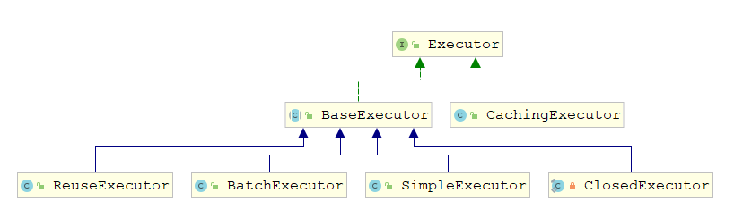

## MyBatis 整体架构


**反射模块**：对Java原生的反射进行了良好的封装，提供了更加简洁的API，对反射操作进行了优化

**反射工具箱**

MyBatis在进行参数处理、结果映射等操作时,会涉及大量的反射操作。Java中的反射虽然功能强大，但是代码编写起来比较复杂且容易出错，为了简化反射操作的相关代码，MyBatis提供了专门的反射模块，该模块位于org.apache.ibatis.eflection包中，它对常见的反射操作做了进一步封装，提供了更加简洁方便的反射API。 

~~~java
public class DefaultReflectorFactory implements ReflectorFactory {
    private boolean classCacheEnabled = true; // 是否开启Reflector对象缓存
    private final ConcurrentMap<Class<?>, Reflector> reflectorMap = 
        new ConcurrentHashMap<>(); // 用ConcurrentHashMap集合缓存Reflector对象
   
    @Override
    public Reflector findForClass(Class<?> type) {
        if (classCacheEnabled) {
            // 把Reflector对象放入缓存集合
            return reflectorMap.computeIfAbsent(type, Reflector::new);
        } else {
            return new Reflector(type);
        }
    } 
}
~~~

### 接口层
接口层相对简单，其核心是SqlSession 接口，该接口中定义了MyBatis 暴露给应用程序调用的API ，也就是上层应用与MyBatis 交互的桥梁。接口层在接收到调用请求时，会调用核心处理层的相应模块来完成具体的数据库操作。

### 核心处理层

在核心处理层中实现了MyBatis 的核心处理流程，其中包括MyBatis 的初始化以及完成一次数据库操作的涉及的全部流程。

核心处理层主要做了这几件事：

1. 把接口中传入的参数解析并且映射成JDBC 类型；
2. 解析XML文件中的SQL 语句，包括插入参数，和动态SQL 的生成；
3. 执行SQL 语句；
4. 处理结果集，并映射成Java 对象。

插件也属于核心层，这是由它的工作方式和拦截的对象决定的。

### 基础支持层

基础支持层主要是一些抽取出来的通用的功能（实现复用），用来支持核心处理层的功能。比如数据源、缓存、日志、xml 解析、反射、IO、事务等等这些功能。

## MyBatis 工作流程

~~~java
String resource = "mybatis-config.xml";
InputStream inputStream = null;
inputStream = Resources.getResourceAsStream(resource);
// 获取SqlSessionFactory
SqlSessionFactory sqlSessionFactory = new SqlSessionFactoryBuilder().build(inputStream);
// 获取SqlSession
SqlSession session = sqlSessionFactory.openSession();

try {
    // 执行SQL
    Blog blog = (Blog) session.selectOne("com.qinfengsa.mybatis.mapper.BlogMapper.selectBlogById", 1);
    log.debug("blog:{}",blog);
} catch (Exception e) {
    log.error(e.getMessage(),e);
} finally {
    session.close();
}
~~~


### 配置解析

解析 config 配置文件、Mapper 文件、Mapper 接口上的注解 。通过对象Configuration 存放全部的配置信息，它在属性里面还有各种各样的容器。最后，返回了一个DefaultSqlSessionFactory，里面持有了Configuration 的实例。

~~~java
public class SqlSessionFactoryBuilder {
    public SqlSessionFactory build(InputStream inputStream) {
        return build(inputStream, null, null);
    }
    public SqlSessionFactory build(InputStream inputStream, String environment, Properties properties) {
        try {
            // XMLConfigBuilder 读取XML配置信息
            XMLConfigBuilder parser = new XMLConfigBuilder(inputStream, environment, properties);
            return build(parser.parse());
        } catch (Exception e) {
            throw ExceptionFactory.wrapException("Error building SqlSession.", e);
        } finally {
            ErrorContext.instance().reset();
            try {
                inputStream.close();
            } catch (IOException e) {
                // Intentionally ignore. Prefer previous error.
            }
        }
    }
  	public SqlSessionFactory build(Configuration config) {
        // 通过配置类config构造SqlSessionFactory
    	return new DefaultSqlSessionFactory(config);
  	}
} 
~~~

#### XML配置构造器

~~~java
public class XMLConfigBuilder extends BaseBuilder {
    // 构造函数
    private XMLConfigBuilder(XPathParser parser, String environment, Properties props) {
        // 构建配置类Configuration
        super(new Configuration());
        ErrorContext.instance().resource("SQL Mapper Configuration");
        this.configuration.setVariables(props);
        this.parsed = false;
        this.environment = environment;
        this.parser = parser;
    }
    public Configuration parse() {
        if (parsed) {
          	throw new BuilderException("Each XMLConfigBuilder can only be used once.");
        }
        parsed = true;
        // 解析配置文件
        parseConfiguration(parser.evalNode("/configuration")); 
        return configuration;
    }
    
    //从root节点解析XML配置文件 
  	private void parseConfiguration(XNode root) {
        try { 
            // 解析 properties 配置信息
            propertiesElement(root.evalNode("properties"));
            // 解析 settings 配置信息
            Properties settings = settingsAsProperties(root.evalNode("settings"));
            loadCustomVfs(settings);
            // 加载日志配置
            loadCustomLogImpl(settings); 
            // 解析 类型别名
            typeAliasesElement(root.evalNode("typeAliases")); 
            // 解析插件 plugins
            pluginElement(root.evalNode("plugins")); 
            // 解析 <objectFactory> 节点
            objectFactoryElement(root.evalNode("objectFactory"));
            // 解析 <objectWrapperFactory> 节点
            objectWrapperFactoryElement(root.evalNode("objectWrapperFactory"));
            // 解析 <reflectorFactory> 节点
            reflectorFactoryElement(root.evalNode("reflectorFactory"));
            // 将settings的值设置到 Configuration 中
            settingsElement(settings);  
            // 解析 environments
            environmentsElement(root.evalNode("environments"));
            databaseIdProviderElement(root.evalNode("databaseIdProvider"));
            // 解析 typeHandlers
            typeHandlerElement(root.evalNode("typeHandlers"));
            // 解析 Mapper的配置文件，最主要的有两个：一个是sql的定义，一个是resultMap
            mapperElement(root.evalNode("mappers"));
        } catch (Exception e) {
          	throw new BuilderException("Error parsing SQL Mapper Configuration. Cause: " + e, e);
        }
    }
}
~~~

### SqlSessionFactory

~~~java
public class SqlSessionFactoryBuilder {
	public SqlSessionFactory build(Configuration config) {
        // 通过配置类config构造SqlSessionFactory,返回DefaultSqlSessionFactory
    	return new DefaultSqlSessionFactory(config);
  	}
}
public class DefaultSqlSessionFactory implements SqlSessionFactory {
	// 配置信息
  	private final Configuration configuration;
	// 构造方法
  	public DefaultSqlSessionFactory(Configuration configuration) {
    	this.configuration = configuration;
  	}
}
~~~

### SqlSession 

**入口**：SqlSession session = sqlSessionFactory.openSession();

创建会话的过程，我们获得了一个DefaultSqlSession，里面包含了一个Executor，同时SQL的执行者

~~~java
public class DefaultSqlSessionFactory implements SqlSessionFactory {
    @Override
    public SqlSession openSession() {
        return openSessionFromDataSource(configuration.getDefaultExecutorType(), null, false);
    }
    // autoCommit 是否自动提交，默认false
    private SqlSession openSessionFromDataSource(ExecutorType execType, TransactionIsolationLevel level, 
        boolean autoCommit) { 
        // 事务声明
        Transaction tx = null;  
        try {
            // 获取configuration配置信息中的Environment
            final Environment environment = configuration.getEnvironment();
            // 获取事务工厂
            final TransactionFactory transactionFactory = getTransactionFactoryFromEnvironment(environment);
            // 创建事务
            tx = transactionFactory.newTransaction(environment.getDataSource(), level, autoCommit);
            // 通过事务和ExecutorType创建一个执行器Executor
            final Executor executor = configuration.newExecutor(tx, execType);
            // 返回DefaultSqlSession
            return new DefaultSqlSession(configuration, executor, autoCommit);
        } catch (Exception e) { 
            // 关闭事务
            closeTransaction(tx);  
            throw ExceptionFactory.wrapException("Error opening session.  Cause: " + e, e);
        } finally {
            ErrorContext.instance().reset();
        }
    }
}
public class DefaultSqlSession implements SqlSession {
	// 配置信息
    private final Configuration configuration;
    // 执行器
    private final Executor executor;
	// 自动提交
    private final boolean autoCommit;
    // 脏数据,更新是为true,提交后为false
    private boolean dirty;
    private List<Cursor<?>> cursorList;

    public DefaultSqlSession(Configuration configuration, Executor executor, boolean autoCommit) {
        this.configuration = configuration;
        this.executor = executor;
        this.dirty = false;
        this.autoCommit = autoCommit;
    }
}
~~~

#### **Executor**
Executor是SQL 的执行者，Executor 的基本类型有三种：SIMPLE、BATCH、REUSE，默认是SIMPLE（settingsElement()读取默认值），他们都继承了抽象类BaseExecutor

~~~java
// Executor类型枚举
public enum ExecutorType {
  	SIMPLE, REUSE, BATCH
}
~~~

- `ExecutorType.SIMPLE`：这个执行器类型不做特殊的事情。它为每个语句的执行创建一个新的预处理语句。
- `ExecutorType.REUSE`：这个执行器类型会复用预处理语句。
- `ExecutorType.BATCH`：这个执行器会批量执行所有更新语句，如果 SELECT 在它们中间执行，必要时请把它们区分开来以保证行为的易读性。

### 获得接口的代理对象

入口： BlogMapper mapper = session.getMapper(BlogMapper.class);

~~~java
public class DefaultSqlSession implements SqlSession {
    // 获取Mapper对象
    @Override
    public <T> T getMapper(Class<T> type) {
        return configuration.getMapper(type, this);
    }
}
// 配置信息类
public class Configuration {
    // mapper 注册 根据对应的class找到mapper
    protected final MapperRegistry mapperRegistry = new MapperRegistry(this);
    // 获取Mapper对象
    public <T> T getMapper(Class<T> type, SqlSession sqlSession) {
    	return mapperRegistry.getMapper(type, sqlSession);
  	}
}
// mapper 注册类
public class MapperRegistry {
    // 根据Class找到Mapper对应的代理工厂
    private final Map<Class<?>, MapperProxyFactory<?>> knownMappers = new HashMap<>();
  
    public <T> T getMapper(Class<T> type, SqlSession sqlSession) {
        // Mapper代理工厂
        final MapperProxyFactory<T> mapperProxyFactory = (MapperProxyFactory<T>) knownMappers.get(type);
        if (mapperProxyFactory == null) {
          	throw new BindingException("Type " + type + " is not known to the MapperRegistry.");
        }
        try {
            // 通过代理工厂创建代理对象
          	return mapperProxyFactory.newInstance(sqlSession);
        } catch (Exception e) {
          	throw new BindingException("Error getting mapper instance. Cause: " + e, e);
        }
    }
}
// Mapper代理工厂
public class MapperProxyFactory<T> {
	// Mapper接口类
    private final Class<T> mapperInterface;
    // 通过ConcurrentHashMap缓存 SQL的执行方法 
    private final Map<Method, MapperMethod> methodCache = new ConcurrentHashMap<>();

    public MapperProxyFactory(Class<T> mapperInterface) {
        this.mapperInterface = mapperInterface;
    }

    public Class<T> getMapperInterface() {
        return mapperInterface;
    }

    public Map<Method, MapperMethod> getMethodCache() {
        return methodCache;
    }
	// 创建代理对象
    @SuppressWarnings("unchecked")
    protected T newInstance(MapperProxy<T> mapperProxy) {
        return (T) Proxy.newProxyInstance(mapperInterface.getClassLoader(), 
                                          new Class[] { mapperInterface }, mapperProxy);
    }
	// 创建代理对象
    public T newInstance(SqlSession sqlSession) {
        final MapperProxy<T> mapperProxy = new MapperProxy<>(sqlSession, mapperInterface, methodCache);
        return newInstance(mapperProxy);
    }

}

~~~

#### MapperProxy

Mapper的代理类，采用JDK动态代理，实现了 InvocationHandler接口

~~~java

public class MapperProxy<T> implements InvocationHandler, Serializable { 
    private final SqlSession sqlSession;
    // 代理对象Mapper的接口
    private final Class<T> mapperInterface;
    // 代理对象Mapper的方法，保存对应的SQL
    private final Map<Method, MapperMethod> methodCache;
	// 构造方法
    public MapperProxy(SqlSession sqlSession, Class<T> mapperInterface, Map<Method, 
                       MapperMethod> methodCache) {
        this.sqlSession = sqlSession;
        this.mapperInterface = mapperInterface;
        this.methodCache = methodCache;
    }
	
    @Override
    public Object invoke(Object proxy, Method method, Object[] args) throws Throwable {
        try {
            if (Object.class.equals(method.getDeclaringClass())) {
                return method.invoke(this, args);
            } else if (method.isDefault()) {
                return invokeDefaultMethod(proxy, method, args);
            }
        } catch (Throwable t) {
            throw ExceptionUtil.unwrapThrowable(t);
        }
        final MapperMethod mapperMethod = cachedMapperMethod(method);
        return mapperMethod.execute(sqlSession, args);
    }
	// 把Method进行缓存
    private MapperMethod cachedMapperMethod(Method method) {
        return methodCache.computeIfAbsent(method, k -> new MapperMethod(mapperInterface, method, 
                sqlSession.getConfiguration()));
    }

    private Object invokeDefaultMethod(Object proxy, Method method, Object[] args)
        throws Throwable {
        final Constructor<MethodHandles.Lookup> constructor = MethodHandles.Lookup.class
            .getDeclaredConstructor(Class.class, int.class);
        if (!constructor.isAccessible()) {
            constructor.setAccessible(true);
        }
        final Class<?> declaringClass = method.getDeclaringClass();
        return constructor
            .newInstance(declaringClass,
                         MethodHandles.Lookup.PRIVATE | MethodHandles.Lookup.PROTECTED
                         | MethodHandles.Lookup.PACKAGE | MethodHandles.Lookup.PUBLIC)
            .unreflectSpecial(method, declaringClass).bindTo(proxy).invokeWithArguments(args);
    }
}
~~~


### 执行SQL

MapperProxy.invoke()是我们执行SQL的方法，通过Mapper代理来找到对应的SQL

~~~java
// Mapper的代理类,采用JDK动态代理 InvocationHandler
public class MapperProxy<T> implements InvocationHandler, Serializable { 
    private final SqlSession sqlSession;
    // 代理对象Mapper的接口
    private final Class<T> mapperInterface;
    // 代理对象Mapper的方法，保存对应的SQL
    private final Map<Method, MapperMethod> methodCache;
	// 构造方法
    public MapperProxy(SqlSession sqlSession, Class<T> mapperInterface, Map<Method, 
                       MapperMethod> methodCache) {
        this.sqlSession = sqlSession;
        this.mapperInterface = mapperInterface;
        this.methodCache = methodCache;
    }
	// Mapper代理执行方法的入口
    @Override
    public Object invoke(Object proxy, Method method, Object[] args) throws Throwable {
        try {
            if (Object.class.equals(method.getDeclaringClass())) {  
                return method.invoke(this, args);
            } else if (method.isDefault()) {
                return invokeDefaultMethod(proxy, method, args);
            }
        } catch (Throwable t) {
            throw ExceptionUtil.unwrapThrowable(t);
        }
        // 通过缓存找到对应的MapperMethod
        final MapperMethod mapperMethod = cachedMapperMethod(method);
        // 通过execute执行，核心所在
        return mapperMethod.execute(sqlSession, args);
    }
} 
~~~

#### MapperMethod

MapperMethod，执行接口方法的类

~~~java
public class MapperMethod { 
    // SQL执行命令
    private final SqlCommand command;
    // 方法签名
    private final MethodSignature method; 

    public MapperMethod(Class<?> mapperInterface, Method method, Configuration config) {
        this.command = new SqlCommand(config, mapperInterface, method);
        this.method = new MethodSignature(config, mapperInterface, method);
    }
	// Method执行方法，最终通过sqlSession执行SQL语句
    public Object execute(SqlSession sqlSession, Object[] args) {
        Object result;
        switch (command.getType()) {
            case INSERT: { // 插入
                // 将参数转换为 SQL 的参数
                Object param = method.convertArgsToSqlCommandParam(args);
                result = rowCountResult(sqlSession.insert(command.getName(), param));
                break;
            }
            case UPDATE: { // 更新
                Object param = method.convertArgsToSqlCommandParam(args);
                result = rowCountResult(sqlSession.update(command.getName(), param));
                break;
            }
            case DELETE: { // 删除
                Object param = method.convertArgsToSqlCommandParam(args);
                result = rowCountResult(sqlSession.delete(command.getName(), param));
                break;
            }
            case SELECT: // 查询
                if (method.returnsVoid() && method.hasResultHandler()) {
                    executeWithResultHandler(sqlSession, args);
                    result = null;
                } else if (method.returnsMany()) {
                    result = executeForMany(sqlSession, args);
                } else if (method.returnsMap()) {
                    result = executeForMap(sqlSession, args);
                } else if (method.returnsCursor()) {
                    result = executeForCursor(sqlSession, args);
                } else {
                    Object param = method.convertArgsToSqlCommandParam(args);
                    result = sqlSession.selectOne(command.getName(), param);
                    if (method.returnsOptional()
                        && (result == null || !method.getReturnType().equals(result.getClass()))) {
                        result = Optional.ofNullable(result);
                    }
                }
                break;
            case FLUSH:
                result = sqlSession.flushStatements();
                break;
            default:
                throw new BindingException("Unknown execution method for: " + command.getName());
        }
        if (result == null && method.getReturnType().isPrimitive() && !method.returnsVoid()) {
            throw new BindingException();
        }
        return result;
    }
}
~~~


## XML配置

### **属性（properties）**

这些属性都是可外部配置且可动态替换的，既可以在典型的 Java 属性文件中配置，亦可通过 properties 元素的子元素来传递。

~~~xml
<properties resource="db.properties">
  	<property name="username" value="dev_user"/>
  	<property name="password" value="F2Fa3!33TYyg"/>
</properties>
~~~

~~~java
private void propertiesElement(XNode context) throws Exception {
    if (context != null) {
        // 解析< properties>的子节点(< property>标签)的name和 value属性,并记录到 defaults 中
        Properties defaults = context.getChildrenAsProperties();

        // 解析< properties>的 resource和 url 属性,这两个属性用于确定 properties配置文件的位置 
        String resource = context.getStringAttribute("resource");
        String url = context.getStringAttribute("url");
        // resource属性 和 url属性不能同时存在,否则会抛出异常
        if (resource != null && url != null) {
            // throw new BuilderException( );
        }
        // 加载 resource 或url 指定的 properties文件,
        if (resource != null) {
            defaults.putAll(Resources.getResourceAsProperties(resource));
        } else if (url != null) {
            defaults.putAll(Resources.getUrlAsProperties(url));
        }
        // configuration 的变量集合 合并
        Properties vars = configuration.getVariables();
        if (vars != null) {
            defaults.putAll(vars);
        }
        parser.setVariables(defaults);
        configuration.setVariables(defaults);
    }
}
~~~


### 设置（settings）

解析<settings>节点，在<settings>节点下的配置是 MyBatis全局性的配置，它们会改变 MyBatis的运行时行为

~~~java
private Properties settingsAsProperties(XNode context) {
    if (context == null) {
      	return new Properties();
    }
    // 解析<settings>的子节点(<setting>标签)的name和va1ue属性,并返回 Properties对象
    Properties props = context.getChildrenAsProperties();
    // Check that all settings are known to the configuration class
    // 创建 Configuration对应的 MetaClass 对象
    MetaClass metaConfig = MetaClass.forClass(Configuration.class, localReflectorFactory);
    // 检测 Configuration 中是否定义了 <setting>标签 name 属性相应的 setter方法
    for (Object key : props.keySet()) {
        if (!metaConfig.hasSetter(String.valueOf(key))) {
            //throw new BuilderException( );
        }
    }
    return props;
}
~~~


### **类型别名（typeAliases）**

解析<typeAliases>节点及其子节点,并通过 TypeAliasRegistry完成别名的注册

类型别名是为 Java 类型设置一个短的名字，它只和 XML 配置有关，存在的意义仅在于用来减少类完全限定名的冗余。

~~~xml
<typeAliases>
    <typeAlias alias="blog" type="com.qinfengsa.mybatis.domain.Blog" />
    <typeAlias alias="author" type="com.qinfengsa.mybatis.domain.Author" />
    <typeAlias alias="comment" type="com.qinfengsa.mybatis.domain.Comment" />
</typeAliases>
~~~

也可以指定一个包名，MyBatis 会在包名下面搜索需要的 Java Bean 

~~~xml
<typeAliases>
    <package name="com.qinfengsa.mybatis.domain"/>
</typeAliases>
~~~

~~~java
private void typeAliasesElement(XNode parent) {
    if (parent != null) {
        // 遍历所有子节点
        for (XNode child : parent.getChildren()) {
            // 处理<package>节点 
            if ("package".equals(child.getName())) {
                // 获取指定的包名
                String typeAliasPackage = child.getStringAttribute("name");
                // 通过TypeAliasRegistry扫描指定包中所有的类,并解析@Alias注解,完成别名注册
                configuration.getTypeAliasRegistry().registerAliases(typeAliasPackage);
            } else { // 处理< typeAlias>节点
                // 获取指定的别名
                String alias = child.getStringAttribute("alias");
                // 获取别名对应的类型
                String type = child.getStringAttribute("type");
                try {
                    Class<?> clazz = Resources.classForName(type);
                    // alias == null 没有在XML中配置alias, 使用了@Alias注解
                    if (alias == null) {
                        // 扫描@Alias注解,完成注册
                        typeAliasRegistry.registerAlias(clazz);
                    } else {
                        // 注册别名
                        typeAliasRegistry.registerAlias(alias, clazz);
                    }
                } catch (ClassNotFoundException e) {
                    // throw new BuilderException( );
                }
            }
        }
    }
}
~~~

#### TypeAliasRegistry

~~~java
public class TypeAliasRegistry {
	// 通过map存储 alias -> Class的映射关系
    private final Map<String, Class<?>> typeAliases = new HashMap<>();
	// 构造时注册常用类型的别名
    public TypeAliasRegistry() {
        registerAlias("string", String.class); 
		// .... 省略
        registerAlias("ResultSet", ResultSet.class);
    }
    public void registerAlias(Class<?> type) {
        String alias = type.getSimpleName();
        // 获取当前类的@Alias注解
        Alias aliasAnnotation = type.getAnnotation(Alias.class);
        if (aliasAnnotation != null) {
            alias = aliasAnnotation.value();
        }
        registerAlias(alias, type);
    }
	// 注册
    public void registerAlias(String alias, Class<?> value) {
        if (alias == null) {
            throw new TypeException("The parameter alias cannot be null");
        }
        // issue #748 小写
        String key = alias.toLowerCase(Locale.ENGLISH);
        if (typeAliases.containsKey(key) && typeAliases.get(key) != null 
            && !typeAliases.get(key).equals(value)) {
            // throw new TypeException( );
        }
        // key -> value 放入map
        typeAliases.put(key, value);
    }
}
~~~


### **类型处理器（typeHandlers）**

对数据库中字段的类型和Java中的类型进行转换处理

~~~java
private void typeHandlerElement(XNode parent) {
    if (parent != null) {
        // 遍历所有子节点
        for (XNode child : parent.getChildren()) {
            // 处理<package>节点
            if ("package".equals(child.getName())) {
                // 获取指定的包名
                String typeHandlerPackage = child.getStringAttribute("name");
                // 通过 TypeHandlerRegistry 扫描指定包中所有的类,并解析@MappedTypes 注解,完成TypeHandler注册
                typeHandlerRegistry.register(typeHandlerPackage);
            } else {// 处理< typeAlias>节点
                // Java 数据类型
                String javaTypeName = child.getStringAttribute("javaType");
                // 数据库数据类型
                String jdbcTypeName = child.getStringAttribute("jdbcType");
                // 对应的handler,负责将 jdbcType 和 javaType的相互转换 实现TypeHandler接口
                String handlerTypeName = child.getStringAttribute("handler");
                Class<?> javaTypeClass = resolveClass(javaTypeName);
                JdbcType jdbcType = resolveJdbcType(jdbcTypeName);
                Class<?> typeHandlerClass = resolveClass(handlerTypeName);
                // 注册
                if (javaTypeClass != null) {
                    if (jdbcType == null) {
                        typeHandlerRegistry.register(javaTypeClass, typeHandlerClass);
                    } else {
                        typeHandlerRegistry.register(javaTypeClass, jdbcType, typeHandlerClass);
                    }
                } else {
                    typeHandlerRegistry.register(typeHandlerClass);
                }
            }
        }
    }
}
~~~

#### TypeHandlerRegistry

~~~java
public final class TypeHandlerRegistry {
	// 存储 JdbcType -> TypeHandler的映射关系,解析数据库数据使用
  	private final Map<JdbcType, TypeHandler<?>>  jdbcTypeHandlerMap = new EnumMap<>(JdbcType.class);
  	// 存储 javaType -> JdbcType -> TypeHandler的映射关系,向数据库写入数据使用
  	private final Map<Type, Map<JdbcType, TypeHandler<?>>> typeHandlerMap = new ConcurrentHashMap<>(); 
    // 存储 所有TypeHandler的class和实例的映射关系 
  	private final Map<Class<?>, TypeHandler<?>> allTypeHandlersMap = new HashMap<>();
    // 构造方法中注册常用类型的TypeHandler
    public TypeHandlerRegistry() {
    	register(Boolean.class, new BooleanTypeHandler());
        // .... 省略
    }
    
    public void register(Class<?> javaTypeClass, JdbcType jdbcType, Class<?> typeHandlerClass) {
        // 创建typeHandlerClass的实例对象
        register(javaTypeClass, jdbcType, getInstance(javaTypeClass, typeHandlerClass));
    }
    private void register(Type javaType, JdbcType jdbcType, TypeHandler<?> handler) {
        if (javaType != null) {
            Map<JdbcType, TypeHandler<?>> map = typeHandlerMap.get(javaType);
            if (map == null || map == NULL_TYPE_HANDLER_MAP) {
                map = new HashMap<>();
                typeHandlerMap.put(javaType, map);
            }
            map.put(jdbcType, handler);
        }
        allTypeHandlersMap.put(handler.getClass(), handler);
  	}
}
~~~


### **插件（plugins）**

MyBatis 允许你在已映射语句执行过程中的某一点进行拦截调用。默认情况下，MyBatis 允许使用插件来拦截的方法调用包括：

- Executor (update, query, flushStatements, commit, rollback, getTransaction, close, isClosed)
- ParameterHandler (getParameterObject, setParameters)
- ResultSetHandler (handleResultSets, handleOutputParameters)
- StatementHandler (prepare, parameterize, batch, update, query)

~~~java
private void pluginElement(XNode parent) throws Exception {
    if (parent != null) {
        // 遍历所有子节点 <plugin>
        for (XNode child : parent.getChildren()) {
            // 获取拦截器 <interceptor>
            String interceptor = child.getStringAttribute("interceptor");
            Properties properties = child.getChildrenAsProperties();
            // 实例化拦截器 interceptor
            Interceptor interceptorInstance = 
                (Interceptor) resolveClass(interceptor).getDeclaredConstructor().newInstance();
            interceptorInstance.setProperties(properties);
            // 把拦截器添加到拦截器List中 interceptors
            configuration.addInterceptor(interceptorInstance);
        }
    }
} 
~~~

#### InterceptorChain

~~~java
public class InterceptorChain { 
    // 拦截器链,保存所有的 interceptor
    private final List<Interceptor> interceptors = new ArrayList<>();

    public Object pluginAll(Object target) {
        for (Interceptor interceptor : interceptors) {
            target = interceptor.plugin(target);
        }
        return target;
    }
	// 添加新的 interceptor
    public void addInterceptor(Interceptor interceptor) {
        interceptors.add(interceptor);
    }

    public List<Interceptor> getInterceptors() {
        return Collections.unmodifiableList(interceptors);
    } 
}
~~~


### **环境配置（environments）**

MyBatis 可以配置成适应多种环境，然后不同的环境配置不同的数据库

~~~xml
<environments default="development"> <!-- 可以配置多个environment，但必须有默认 -->
    <environment id="development"> <!-- id必填  -->
        <transactionManager type="JDBC">  <!-- 事务管理器的配置 -->
            <property name="..." value="..."/>
        </transactionManager>
        <dataSource type="POOLED"> <!-- 数据源的配置 -->
            <property name="driver" value="${driver}"/>
            <property name="url" value="${url}"/>
            <property name="username" value="${username}"/>
            <property name="password" value="${password}"/>
        </dataSource>
    </environment>
</environments>
~~~

解析environments

~~~java
private void environmentsElement(XNode context) throws Exception {
    if (context != null) {
        // 没有指定 environment, 获取default属性指定对应的environment
        if (environment == null) {
            environment = context.getStringAttribute("default");
        }
        // 遍历所有子节点 <environment>
        for (XNode child : context.getChildren()) {
            // 获取当前节点 <environment>的id属性
            String id = child.getStringAttribute("id");
            // 当前id 是否和environment相同
            if (isSpecifiedEnvironment(id)) {
                // 创建 TransactionFactory, 处理事务
                TransactionFactory txFactory = 
                    transactionManagerElement(child.evalNode("transactionManager"));
                // 创建 DataSourceFactory 和 Datasource
                DataSourceFactory dsFactory = dataSourceElement(child.evalNode("dataSource"));
                DataSource dataSource = dsFactory.getDataSource();
                // 创建 Environment, Environment中封装了 TransactionFactory对象/以及 Datasource对象.
                Environment.Builder environmentBuilder = new Environment.Builder(id)
                    .transactionFactory(txFactory)
                    .dataSource(dataSource);
                // 将 Environment对象记录到 Configuration的 environment字段中
                configuration.setEnvironment(environmentBuilder.build());

            }
        }
    }
}
~~~

#### Environment

~~~java
public final class Environment {
    private final String id;  
    // 事务管理器
    private final TransactionFactory transactionFactory; 
    // 数据源
    private final DataSource dataSource;  
    public Environment(String id, TransactionFactory transactionFactory, DataSource dataSource) {
        if (id == null) {
            throw new IllegalArgumentException("Parameter 'id' must not be null");
        }
        if (transactionFactory == null) {
            throw new IllegalArgumentException("Parameter 'transactionFactory' must not be null");
        }
        this.id = id;
        if (dataSource == null) {
            throw new IllegalArgumentException("Parameter 'dataSource' must not be null");
        }
        this.transactionFactory = transactionFactory;
        this.dataSource = dataSource;
    }
}
~~~

### **映射器（mappers）**

~~~java
private void mapperElement(XNode parent) throws Exception {
    if (parent != null) {
        // 遍历所有子节点
        for (XNode child : parent.getChildren()) {
            // <package> 子节点
            if ("package".equals(child.getName())) {
                String mapperPackage = child.getStringAttribute("name");
                // 向 MapperRegistry 注册
                configuration.addMappers(mapperPackage);
            } else {
                // <mapper> 子节点
                // 获取 <mapper> 子节点的resource,url,class 三者互斥
                String resource = child.getStringAttribute("resource");
                String url = child.getStringAttribute("url");
                String mapperClass = child.getStringAttribute("class");
                if (resource != null && url == null && mapperClass == null) {
                    // 解析 resource
                    ErrorContext.instance().resource(resource);
                    InputStream inputStream = Resources.getResourceAsStream(resource);
                    // 创建XMLMapperBuilder对象,使用了configuration.getSqlFragments()
                    XMLMapperBuilder mapperParser = new XMLMapperBuilder(inputStream, configuration, 
                        resource, configuration.getSqlFragments());
                    // XMLMapperBuilder解析
                    mapperParser.parse();
                } else if (resource == null && url != null && mapperClass == null) {
                    // 解析 url
                    ErrorContext.instance().resource(url);
                    InputStream inputStream = Resources.getUrlAsStream(url);
                    // 创建XMLMapperBuilder对象,使用了configuration.getSqlFragments()
                    XMLMapperBuilder mapperParser = new XMLMapperBuilder(inputStream, configuration, url, 
                        configuration.getSqlFragments());
                    // XMLMapperBuilder解析
                    mapperParser.parse();
                } else if (resource == null && url == null && mapperClass != null) {
                    // 如果< mapper>节点指定了c1ass属性,向 MapperRegistry注册 
                    Class<?> mapperInterface = Resources.classForName(mapperClass);
                    configuration.addMapper(mapperInterface);
                } else {
                    // throw new BuilderException();
                }
            }
        }
    }
}
~~~


### Configuration

首先，MyBatis配置信息全部存在Configuration类中

~~~java
public class Configuration {
    // 环境信息
    protected Environment environment;  
    // 允许在嵌套语句中使用分页（RowBounds）如果允许使用则设置为false
    protected boolean safeRowBoundsEnabled; 
    protected boolean safeResultHandlerEnabled = true;
    protected boolean mapUnderscoreToCamelCase;
    protected boolean aggressiveLazyLoading;
    protected boolean multipleResultSetsEnabled = true;
    protected boolean useGeneratedKeys;
    protected boolean useColumnLabel = true;
    protected boolean cacheEnabled = true;
    protected boolean callSettersOnNulls;
    protected boolean useActualParamName = true;
    protected boolean returnInstanceForEmptyRow;
	// MyBatis 增加到日志名称的前缀 
    protected String logPrefix;  
    // MyBatis 所用日志的具体实现
    protected Class<? extends Log> logImpl; 
    protected Class<? extends VFS> vfsImpl;
    protected LocalCacheScope localCacheScope = LocalCacheScope.SESSION;
    protected JdbcType jdbcTypeForNull = JdbcType.OTHER;
    protected Set<String> lazyLoadTriggerMethods 
        = new HashSet<>(Arrays.asList("equals", "clone", "hashCode", "toString"));
    protected Integer defaultStatementTimeout;
    protected Integer defaultFetchSize;
    protected ResultSetType defaultResultSetType;
    protected ExecutorType defaultExecutorType = ExecutorType.SIMPLE;
    protected AutoMappingBehavior autoMappingBehavior = AutoMappingBehavior.PARTIAL;
    protected AutoMappingUnknownColumnBehavior autoMappingUnknownColumnBehavior 
        = AutoMappingUnknownColumnBehavior.NONE;

    protected Properties variables = new Properties();
    // 反射工厂
    protected ReflectorFactory reflectorFactory = new DefaultReflectorFactory();
    protected ObjectFactory objectFactory = new DefaultObjectFactory();
    protected ObjectWrapperFactory objectWrapperFactory = new DefaultObjectWrapperFactory();

    protected boolean lazyLoadingEnabled = false;
    // 代理工具	CGLIB | JAVASSIST 
    protected ProxyFactory proxyFactory = new JavassistProxyFactory(); 
    protected String databaseId;

    protected Class<?> configurationFactory;
	// mapper 注册 根据接口找到对应的代理工厂,通过代理工厂生成对应的代理类
    protected final MapperRegistry mapperRegistry = new MapperRegistry(this);
    // 拦截器链
    protected final InterceptorChain interceptorChain = new InterceptorChain();
    // TypeHandler注册,TypeHandler可以对数据库中字段的类型和Java中的类型进行转换处理
    protected final TypeHandlerRegistry typeHandlerRegistry = new TypeHandlerRegistry();
    // 别名注册
    protected final TypeAliasRegistry typeAliasRegistry = new TypeAliasRegistry();
    protected final LanguageDriverRegistry languageRegistry = new LanguageDriverRegistry();
	// 把<select>、<insert>、<update>、<delete>等SQL节点封装成MappedStatement，
    // 保存到map映射中,通过节点的id访问对应的sql
    protected final Map<String, MappedStatement> mappedStatements 
        = new StrictMap<MappedStatement>("Mapped Statements collection")
        .conflictMessageProducer((savedValue, targetValue) ->
         ". please check " + savedValue.getResource() + " and " + targetValue.getResource());
    // 二级缓存
    protected final Map<String, Cache> caches = new StrictMap<>("Caches collection");
    // 保存所有Mapper文件的resultMap
    protected final Map<String, ResultMap> resultMaps = new StrictMap<>("Result Maps collection");
    protected final Map<String, ParameterMap> parameterMaps = new StrictMap<>("Parameter Maps collection");
    protected final Map<String, KeyGenerator> keyGenerators = new StrictMap<>("Key Generators collection");

    protected final Set<String> loadedResources = new HashSet<>();
    // 保存了所有Mapper文件的<sql>节点的数据
    protected final Map<String, XNode> sqlFragments 
        = new StrictMap<>("XML fragments parsed from previous mappers");

    protected final Collection<XMLStatementBuilder> incompleteStatements = new LinkedList<>();
    protected final Collection<CacheRefResolver> incompleteCacheRefs = new LinkedList<>();
    protected final Collection<ResultMapResolver> incompleteResultMaps = new LinkedList<>();
    protected final Collection<MethodResolver> incompleteMethods = new LinkedList<>();
 
    protected final Map<String, String> cacheRefMap = new HashMap<>();

    public Configuration(Environment environment) {
        this();
        this.environment = environment;
    }
	// 构造函数
    public Configuration() {
        // 注册别名，通过别名找到对应的Class
        typeAliasRegistry.registerAlias("JDBC", JdbcTransactionFactory.class);
        typeAliasRegistry.registerAlias("MANAGED", ManagedTransactionFactory.class);
        typeAliasRegistry.registerAlias("JNDI", JndiDataSourceFactory.class);
        typeAliasRegistry.registerAlias("POOLED", PooledDataSourceFactory.class);
        typeAliasRegistry.registerAlias("UNPOOLED", UnpooledDataSourceFactory.class);
        typeAliasRegistry.registerAlias("PERPETUAL", PerpetualCache.class);
        typeAliasRegistry.registerAlias("FIFO", FifoCache.class);
        typeAliasRegistry.registerAlias("LRU", LruCache.class);
        typeAliasRegistry.registerAlias("SOFT", SoftCache.class);
        typeAliasRegistry.registerAlias("WEAK", WeakCache.class);
        typeAliasRegistry.registerAlias("DB_VENDOR", VendorDatabaseIdProvider.class);
        typeAliasRegistry.registerAlias("XML", XMLLanguageDriver.class);
        typeAliasRegistry.registerAlias("RAW", RawLanguageDriver.class);
        typeAliasRegistry.registerAlias("SLF4J", Slf4jImpl.class);
        typeAliasRegistry.registerAlias("COMMONS_LOGGING", JakartaCommonsLoggingImpl.class);
        typeAliasRegistry.registerAlias("LOG4J", Log4jImpl.class);
        typeAliasRegistry.registerAlias("LOG4J2", Log4j2Impl.class);
        typeAliasRegistry.registerAlias("JDK_LOGGING", Jdk14LoggingImpl.class);
        typeAliasRegistry.registerAlias("STDOUT_LOGGING", StdOutImpl.class);
        typeAliasRegistry.registerAlias("NO_LOGGING", NoLoggingImpl.class);
        typeAliasRegistry.registerAlias("CGLIB", CglibProxyFactory.class);
        typeAliasRegistry.registerAlias("JAVASSIST", JavassistProxyFactory.class);

        languageRegistry.setDefaultDriverClass(XMLLanguageDriver.class);
        languageRegistry.register(RawLanguageDriver.class);
    }
}
~~~


## XML映射

### XMLMapperBuilder

MyBatis通过XMLMapperBuilder来解析Mapper文件，核心代码如下

~~~java
XMLMapperBuilder mapperParser = new XMLMapperBuilder(inputStream, configuration, 
	resource, configuration.getSqlFragments());
mapperParser.parse();
~~~

开始解析

~~~java
public class XMLMapperBuilder extends BaseBuilder {
    private final XPathParser parser;
  	private final MapperBuilderAssistant builderAssistant;
  	private final Map<String, XNode> sqlFragments;
  	private final String resource;
    // 对Mapper 映射器的解析
    public void parse() {
        if (!configuration.isResourceLoaded(resource)) {
            // 处理<mapper> 节点
            configurationElement(parser.evalNode("/mapper"));
            configuration.addLoadedResource(resource);
            // 注册Mapper,绑定namespace接口
            bindMapperForNamespace();
        }
        // 处理 configurationElement()方法中解析失败的<resultMap>节点
        parsePendingResultMaps();
        // 处理 configurationElement()方法中解析失败的<cache-ref>节点
        parsePendingCacheRefs();
        // 处理 configurationElement()方法中解析失败的SQL语句节点
        parsePendingStatements();
  	}
    // 解析mapper下所有的子标签
    private void configurationElement(XNode context) { 
        try {
          	// 获取 <mapper> 节点的 namespace 属性,namespace表示对应的接口类
      		String namespace = context.getStringAttribute("namespace");
            if (namespace == null || namespace.equals("")) {
                throw new BuilderException("Mapper's namespace cannot be empty");
            }
            builderAssistant.setCurrentNamespace(namespace);
            // 解析 <cache-ref> 节点
            cacheRefElement(context.evalNode("cache-ref"));
            // 解析 <cache> 节点
            cacheElement(context.evalNode("cache"));
            // 解析 <parameterMap> 节点 已被废弃！老式风格的参数映射
            parameterMapElement(context.evalNodes("/mapper/parameterMap"));
            // 解析 <resultMap> 节点
            resultMapElements(context.evalNodes("/mapper/resultMap"));
            // 解析 <sql> 节点
            sqlElement(context.evalNodes("/mapper/sql"));
            // 解析 <select>、<insert>、<update>、<delete> 等SQL节点,使用XMLStatementBuilder解析
            buildStatementFromContext(context.evalNodes("select|insert|update|delete"));
        } catch (Exception e) {
            // throw new BuilderException( );
        }
    }
}
~~~

#### 缓存

~~~java
private void cacheElement(XNode context) {
    if (context != null) {
        // 获取<cache>节点的type属性,默认值是 PERPETUAL
        String type = context.getStringAttribute("type", "PERPETUAL");
        // 查找type属性对应的 Cache接口实现
        Class<? extends Cache> typeClass = typeAliasRegistry.resolveAlias(type);
        // 获取<cache>节点的 eviction属性,默认值是LRU
        String eviction = context.getStringAttribute("eviction", "LRU");
        Class<? extends Cache> evictionClass = typeAliasRegistry.resolveAlias(eviction);
        Long flushInterval = context.getLongAttribute("flushInterval");
        Integer size = context.getIntAttribute("size");
        boolean readWrite = !context.getBooleanAttribute("readOnly", false);
        boolean blocking = context.getBooleanAttribute("blocking", false);
        // 获取<cache>节点下的子节点,将用于初始化二级缓存
        Properties props = context.getChildrenAsProperties();
        // 通过 MapperBuilderAssistant 创建 Cache对象,并添加到 Configuration.caches集合中保存
        builderAssistant.useNewCache(typeClass, evictionClass, flushInterval, size, readWrite, 
                                     blocking, props); 
    }
}
public class Configuration {
    // 二级缓存
	protected final Map<String, Cache> caches = new StrictMap<>("Caches collection");
    // 添加缓存
    public void addCache(Cache cache) {
    	caches.put(cache.getId(), cache);
  	}
}
~~~

#### resultMap

~~~java
private ResultMap resultMapElement(XNode resultMapNode, List<ResultMapping> additionalResultMappings, 
                                   Class<?> enclosingType) throws Exception {
    ErrorContext.instance().activity("processing " + resultMapNode.getValueBasedIdentifier());
    // 获取<resultMap>节点的type属性,表示结果集将被映射成type指定类型的对象
    String type = resultMapNode.getStringAttribute("type",resultMapNode.getStringAttribute("ofType",                 resultMapNode.getStringAttribute("resultType",resultMapNode.getStringAttribute("javaType"))));
    Class<?> typeClass = resolveClass(type);
    if (typeClass == null) {
        typeClass = inheritEnclosingType(resultMapNode, enclosingType);
    }
    Discriminator discriminator = null;
    // 创建 ResultMapping 集合
    List<ResultMapping> resultMappings = new ArrayList<>();
    resultMappings.addAll(additionalResultMappings);
    // 处理<resultMap>的子节点
    List<XNode> resultChildren = resultMapNode.getChildren();
    for (XNode resultChild : resultChildren) {
        if ("constructor".equals(resultChild.getName())) {
            processConstructorElement(resultChild, typeClass, resultMappings);
        } else if ("discriminator".equals(resultChild.getName())) {
            discriminator = processDiscriminatorElement(resultChild, typeClass, resultMappings);
        } else {
            List<ResultFlag> flags = new ArrayList<>();
            if ("id".equals(resultChild.getName())) {
                flags.add(ResultFlag.ID);
            }
            resultMappings.add(buildResultMappingFromContext(resultChild, typeClass, flags));
        }
    }
    String id = resultMapNode.getStringAttribute("id", resultMapNode.getValueBasedIdentifier());
    // 获取<resultMap>节点的extend属性,该属性指定了该节点的继承关系
    String extend = resultMapNode.getStringAttribute("extends");
    Boolean autoMapping = resultMapNode.getBooleanAttribute("autoMapping");
    ResultMapResolver resultMapResolver = new ResultMapResolver(builderAssistant, id, 
        typeClass, extend, discriminator, resultMappings, autoMapping);
    try {
        // 最后调用 configuration.addResultMap(resultMap);
        return resultMapResolver.resolve();
    } catch (IncompleteElementException  e) {
        configuration.addIncompleteResultMap(resultMapResolver);
        throw e;
    }
}
public class Configuration {	
	// ResultMap 集合
  	protected final Map<String, ResultMap> resultMaps = new StrictMap<>("Result Maps collection");
    public void addResultMap(ResultMap rm) {
        // 添加到 resultMaps 集合中
        resultMaps.put(rm.getId(), rm);
        checkLocallyForDiscriminatedNestedResultMaps(rm);
        checkGloballyForDiscriminatedNestedResultMaps(rm);
  	}
}
~~~

#### sql 节点

~~~java
public class XMLMapperBuilder extends BaseBuilder {
    // 通过map存储sql语句集合
    // 创建XMLMapperBuilder对象,使用了 configuration.getSqlFragments()赋值给sqlFragments
    // 所以这里的sqlFragments实质上是configuration.sqlFragments对象的引用
    private final Map<String, XNode> sqlFragments;
    private void sqlElement(List<XNode> list, String requiredDatabaseId) {
        // 遍历<sql>节点
        for (XNode context : list) {
            String databaseId = context.getStringAttribute("databaseId");
            String id = context.getStringAttribute("id");
            id = builderAssistant.applyCurrentNamespace(id, false);
            if (databaseIdMatchesCurrent(id, databaseId, requiredDatabaseId)) {
                // 保存到 sqlFragments 集合
                sqlFragments.put(id, context);
            }
        }
   }
}
~~~


### XMLStatementBuilder

在解析 <select>、<insert>、<update>、<delete> 等SQL节点时，会使用XMLStatementBuilder解析，封装成MappedStatement对象添加到 Configuration.mappedStatements 集合中保存

~~~java
public class XMLStatementBuilder extends BaseBuilder {

    private final MapperBuilderAssistant builderAssistant;
    private final XNode context;
    private final String requiredDatabaseId;	
    // 解析SQL节点
	public void parseStatementNode() {
        String id = context.getStringAttribute("id");
        String databaseId = context.getStringAttribute("databaseId");

        if (!databaseIdMatchesCurrent(id, databaseId, this.requiredDatabaseId)) {
          return;
        }
        // 节点名称 <select>、<insert>、<update>、<delete>
        String nodeName = context.getNode().getNodeName();
        SqlCommandType sqlCommandType = SqlCommandType.valueOf(nodeName.toUpperCase(Locale.ENGLISH));
        // 是否select语句
        boolean isSelect = sqlCommandType == SqlCommandType.SELECT;
        boolean flushCache = context.getBooleanAttribute("flushCache", !isSelect);
        boolean useCache = context.getBooleanAttribute("useCache", isSelect);
        boolean resultOrdered = context.getBooleanAttribute("resultOrdered", false);

        // Include Fragments before parsing
        // 在解析SQL语句之前,先处理其中的<include>节点
        XMLIncludeTransformer includeParser = new XMLIncludeTransformer(configuration, builderAssistant);
        includeParser.applyIncludes(context.getNode());

        String parameterType = context.getStringAttribute("parameterType");
        Class<?> parameterTypeClass = resolveClass(parameterType);

        String lang = context.getStringAttribute("lang");
        LanguageDriver langDriver = getLanguageDriver(lang);

        // Parse selectKey after includes and remove them.
        // 处理<selectKey>
        processSelectKeyNodes(id, parameterTypeClass, langDriver);

        // Parse the SQL (pre: <selectKey> and <include> were parsed and removed)
        KeyGenerator keyGenerator;
        String keyStatementId = id + SelectKeyGenerator.SELECT_KEY_SUFFIX;
        keyStatementId = builderAssistant.applyCurrentNamespace(keyStatementId, true);
        if (configuration.hasKeyGenerator(keyStatementId)) {
          keyGenerator = configuration.getKeyGenerator(keyStatementId);
        } else {
          keyGenerator = context.getBooleanAttribute("useGeneratedKeys",
              configuration.isUseGeneratedKeys() && SqlCommandType.INSERT.equals(sqlCommandType))
              ? Jdbc3KeyGenerator.INSTANCE : NoKeyGenerator.INSTANCE;
        }
        // 创建SqlSource对象
        SqlSource sqlSource = langDriver.createSqlSource(configuration, context, parameterTypeClass);
        StatementType statementType = StatementType.valueOf(context.getStringAttribute("statementType",                    StatementType.PREPARED.toString()));
        Integer fetchSize = context.getIntAttribute("fetchSize");
        Integer timeout = context.getIntAttribute("timeout");
        String parameterMap = context.getStringAttribute("parameterMap");
        String resultType = context.getStringAttribute("resultType");
        Class<?> resultTypeClass = resolveClass(resultType);
        String resultMap = context.getStringAttribute("resultMap");
        String resultSetType = context.getStringAttribute("resultSetType");
        ResultSetType resultSetTypeEnum = resolveResultSetType(resultSetType);
        if (resultSetTypeEnum == null) {
          resultSetTypeEnum = configuration.getDefaultResultSetType();
        }
        String keyProperty = context.getStringAttribute("keyProperty");
        String keyColumn = context.getStringAttribute("keyColumn");
        String resultSets = context.getStringAttribute("resultSets");
        // 通过 MapperBuilderAssistant 创建 MappedStatement 对象,
        // 并添加到 Configuration.mappedStatements 集合中保存
        builderAssistant.addMappedStatement(id, sqlSource, statementType, sqlCommandType,
            fetchSize, timeout, parameterMap, parameterTypeClass, resultMap, resultTypeClass,
            resultSetTypeEnum, flushCache, useCache, resultOrdered,
            keyGenerator, keyProperty, keyColumn, databaseId, langDriver, resultSets);
    }
}
~~~

### 绑定Mapper接口

~~~java
private void bindMapperForNamespace() {
    // 获取namespace,对应mapper接口的类
    String namespace = builderAssistant.getCurrentNamespace();
    if (namespace != null) {
        Class<?> boundType = null;
        try {
            // 解析对应的Class
            boundType = Resources.classForName(namespace);
        } catch (ClassNotFoundException e) {
            //ignore, bound type is not required
        }
        if (boundType != null) {
            if (!configuration.hasMapper(boundType)) {
                // Spring may not know the real resource name so we set a flag
                // to prevent loading again this resource from the mapper interface
                // look at MapperAnnotationBuilder#loadXmlResource
                configuration.addLoadedResource("namespace:" + namespace);
                // 调用 MapperRegistry.addMapper()方法,注册 boundType接口,创建对应的代理工厂
                configuration.addMapper(boundType);
            }
        }
    }
}
~~~

### 动态SQL

**if**： 通过参数动态调整SQL

```xml
<select id="findActiveBlogLike" resultType="Blog">
  SELECT * FROM BLOG WHERE state = ‘ACTIVE’
  <if test="title != null"> 
    AND title like #{title}
  </if>
  <if test="author != null and author.name != null">
    AND author_name like #{author.name}
  </if>
</select>
```

**choose, when, otherwise**：类似Java 中的 switch 语句

```xml
<select id="findActiveBlogLike" resultType="Blog">
  SELECT * FROM BLOG WHERE state = ‘ACTIVE’
  <choose>
    <when test="title != null">
      AND title like #{title}
    </when>
    <when test="author != null and author.name != null">
      AND author_name like #{author.name}
    </when>
    <otherwise>
      AND featured = 1
    </otherwise>
  </choose>
</select>
```

**trim, where, set**

<where>元素能动态调整where，在where条件为空是去掉where关键字，防止SQL错误

<set>元素在update语句中能动态前置 SET 关键字，同时也会删掉无关的逗号

<trim>需要前缀和后缀

**foreach**：对一个集合进行遍历，通常是在构建 IN 条件语句的时候

~~~xml
<select id="selectPostIn" resultType="domain.blog.Post">
  SELECT * FROM POST P
  WHERE ID in
  <foreach item="item" index="index" collection="list"
      open="(" separator="," close=")">
        #{item}
  </foreach>
</select>
~~~

## Executetor

~~~java
public interface Executor { 
    // 执行 update、 insert、 delete三种类型的SQL语句
    int update(MappedStatement ms, Object parameter) throws SQLException;
    // 执行 select 类型的SQL语句,返回值分为结果对象列表或游标对象
    <E> List<E> query(MappedStatement ms, Object parameter, RowBounds rowBounds, ResultHandler resultHandler, 
                      CacheKey cacheKey, BoundSql boundSql) throws SQLException;

    <E> List<E> query(MappedStatement ms, Object parameter, RowBounds rowBounds, ResultHandler resultHandler) 
        throws SQLException;

    <E> Cursor<E> queryCursor(MappedStatement ms, Object parameter, RowBounds rowBounds) throws SQLException;

    // 批量执行SQL语句
    List<BatchResult> flushStatements() throws SQLException;
    // 提交事务
    void commit(boolean required) throws SQLException;
    // 回滚事务
    void rollback(boolean required) throws SQLException;
    // 创建缓存中用到的CacheKey对象
    CacheKey createCacheKey(MappedStatement ms, Object parameterObject, RowBounds rowBounds, 
                            BoundSql boundSql);
    // 根据CacheKey对象查找缓存
    boolean isCached(MappedStatement ms, CacheKey key);
    // 清空一级缓存
    void clearLocalCache();
    // 延迟加载一级缓存中的数据
    void deferLoad(MappedStatement ms, MetaObject resultObject, String property, CacheKey key, 
                   Class<?> targetType);
    // 获取事务
    Transaction getTransaction();
    // 关闭事务
    void close(boolean forceRollback);
    // 是否关闭
    boolean isClosed();
    // 设置包装,一个Executor可以包含另一个Executor
    void setExecutorWrapper(Executor executor);

}
~~~



### BaseExecutor

BaseExecutor是一个实现了Executor接口的抽象类，它实现了Executor接口的大部分方法，并为其他子类提供模板

~~~java
public abstract class BaseExecutor implements Executor {
 
    // 事务对象,用于实现事务的提交、回滚和关闭
    protected Transaction transaction;
    // 包装的Executor对象
    protected Executor wrapper;

    protected ConcurrentLinkedQueue<DeferredLoad> deferredLoads;
    // 一级缓存,用于缓存该Executor对象查询的结果集
    protected PerpetualCache localCache;
    protected PerpetualCache localOutputParameterCache;
    protected Configuration configuration;
    // SQL执行栈，可能会连续执行多条SQL语句
    protected int queryStack;
    private boolean closed;
    
    // 执行 update、 insert、 delete三种类型的SQL语句
    @Override
    public int update(MappedStatement ms, Object parameter) throws SQLException { 
        ErrorContext.instance().resource(ms.getResource())
            .activity("executing an update").object(ms.getId());
        // 判断当前的Executor是否已经关闭
        if (closed) {
            throw new ExecutorException("Executor was closed.");
        }
        // 清除一级缓存
        clearLocalCache();
        // doUpdate抽象方法,交给子类重写
        return doUpdate(ms, parameter);
    }
    @Override
    public <E> List<E> query(MappedStatement ms, Object parameter, RowBounds rowBounds, 
                             ResultHandler resultHandler) throws SQLException {
        // 获取BoundSql对象
        BoundSql boundSql = ms.getBoundSql(parameter);
        // 创建缓存key
        CacheKey key = createCacheKey(ms, parameter, rowBounds, boundSql);
        return query(ms, parameter, rowBounds, resultHandler, key, boundSql);
    }

    @SuppressWarnings("unchecked")
    @Override
    public <E> List<E> query(MappedStatement ms, Object parameter, RowBounds rowBounds, 
        ResultHandler resultHandler, CacheKey key, BoundSql boundSql) throws SQLException {
        ErrorContext.instance().resource(ms.getResource()).activity("executing a query").object(ms.getId());
        // 检查当前Executor是否已关闭
        if (closed) {
            throw new ExecutorException("Executor was closed.");
        }
        if (queryStack == 0 && ms.isFlushCacheRequired()) {
            clearLocalCache();
        }
        List<E> list;
        try {
            queryStack++;
            // 查询一级缓存
            list = resultHandler == null ? (List<E>) localCache.getObject(key) : null;
            if (list != null) {
                // 命中缓存
                handleLocallyCachedOutputParameters(ms, key, parameter, boundSql);
            } else {
                // 查询数据库
                list = queryFromDatabase(ms, parameter, rowBounds, resultHandler, key, boundSql);
            }
        } finally {
            queryStack--;
        }
        if (queryStack == 0) {
            // 延迟加载的相关内容
            for (DeferredLoad deferredLoad : deferredLoads) {
                deferredLoad.load();
            }
            // issue #601
            deferredLoads.clear();
            if (configuration.getLocalCacheScope() == LocalCacheScope.STATEMENT) {
                // issue #482
                clearLocalCache();
            }
        }
        return list;
    }
    
    private <E> List<E> queryFromDatabase(MappedStatement ms, Object parameter, RowBounds rowBounds, 
        ResultHandler resultHandler, CacheKey key, BoundSql boundSql) throws SQLException {
        List<E> list;
        localCache.putObject(key, EXECUTION_PLACEHOLDER);
        try {
            // doQuery抽象方法,交给子类重写
            list = doQuery(ms, parameter, rowBounds, resultHandler, boundSql);
        } finally {
            localCache.removeObject(key);
        }
        // 添加缓存
        localCache.putObject(key, list);
        if (ms.getStatementType() == StatementType.CALLABLE) {
            localOutputParameterCache.putObject(key, parameter);
        }
        return list;
    } 
}
~~~

#### 事务相关操作

~~~java
// 提交
@Override
public void commit(boolean required) throws SQLException {
    if (closed) {
        throw new ExecutorException("Cannot commit, transaction is already closed");
    }
    // 清空缓存
    clearLocalCache();
    flushStatements();
    if (required) {
        // 提交,最终调用connection.commit()
        transaction.commit();
    }
}
// 回滚
@Override
public void rollback(boolean required) throws SQLException {
    if (!closed) {
        try {
            // 清空缓存
            clearLocalCache();
            flushStatements(true);
        } finally {
            if (required) {
                // 回滚,最终调用connection.rollback();
                transaction.rollback();
            }
        }
    }
}
@Override
public List<BatchResult> flushStatements() throws SQLException {
    return flushStatements(false);
}

public List<BatchResult> flushStatements(boolean isRollBack) throws SQLException {
    if (closed) {
        throw new ExecutorException("Executor was closed.");
    }
    // 抽象方法,交给子类重写
    return doFlushStatements(isRollBack);
}
~~~

### SimpleExecutor

SimpleExecutor继承了BaseExecutor抽象类，它是最简单的Executor接口实现

~~~java
public class SimpleExecutor extends BaseExecutor {
    @Override
    public int doUpdate(MappedStatement ms, Object parameter) throws SQLException {
        Statement stmt = null;
        try {
            Configuration configuration = ms.getConfiguration();
            // 创建StatementHandler,根据 <update>等sql节点的statementType属性选择对应的StatementHandler
            StatementHandler handler = configuration
                .newStatementHandler(this, ms, parameter, RowBounds.DEFAULT, null, null);
            // 创建Statement对象,然后调用StatementHandler的parameterize()方法处理占位符
            stmt = prepareStatement(handler, ms.getStatementLog());
            // 调用StatementHandler的update()方法 
            return handler.update(stmt);
        } finally {
            closeStatement(stmt);
        }
    }

    @Override
    public <E> List<E> doQuery(MappedStatement ms, Object parameter, RowBounds rowBounds, 
                               ResultHandler resultHandler, BoundSql boundSql) throws SQLException {
        Statement stmt = null;
        try {
            Configuration configuration = ms.getConfiguration();
            // 创建StatementHandler,根据 <select>节点的statementType属性选择对应的StatementHandler
            StatementHandler handler = configuration
                .newStatementHandler(wrapper, ms, parameter, rowBounds, resultHandler, boundSql);
            // 创建Statement对象,然后调用StatementHandler的parameterize()方法处理占位符
            stmt = prepareStatement(handler, ms.getStatementLog());
            // 调用StatementHandler的query()方法执行sql语句,最后通过ResultSetHandler 完成结果集的映射
            return handler.query(stmt, resultHandler);
        } finally {
            closeStatement(stmt);
        }
    }
    private Statement prepareStatement(StatementHandler handler, Log statementLog) throws SQLException {
        Statement stmt;
        Connection connection = getConnection(statementLog);
        // 创建Statement对象
        stmt = handler.prepare(connection, transaction.getTimeout());
        // 处理占位符
        handler.parameterize(stmt);
        return stmt;
    }
}
~~~

### ReuseExecutor

ReuseExecutor提供了Statement复用的功能，ReuseExecutor中通过statementMap 字段缓存使用过的Statement对象，ReuseExecutor.doQuery()、 doUpdate()方法的实现与SimpleExecutor中对应方法的实现一样，区别在于其中调用的prepareStatement()方法，SimpleExecutor每次都会通过JDBC的Connection对象创建新的Statement对象，而ReuseExecutor则会先尝试重用StaternentMap中缓存的Statement对象

~~~java
public class ReuseExecutor extends BaseExecutor {
    // 缓存使用过的Statement,提高性能
    // key SQL语句 value 该SQL语句对应的Statement
    private final Map<String, Statement> statementMap = new HashMap<>();	
    /**
     * 当事务提交或回滚、连接关闭时,需要关闭缓存的Statement对象
     */
    @Override
    public List<BatchResult> doFlushStatements(boolean isRollback) {
        // 遍历Statement对象集合，并依次关闭
        for (Statement stmt : statementMap.values()) {
            closeStatement(stmt);
        }
        // 清除对Statement对象的缓存
        statementMap.clear();
        return Collections.emptyList();
    }

    private Statement prepareStatement(StatementHandler handler, Log statementLog) throws SQLException {
        Statement stmt;
        BoundSql boundSql = handler.getBoundSql();
        // 获取执行的sql
        String sql = boundSql.getSql();
        // 判断缓存中是否存在sql对应的Statement
        if (hasStatementFor(sql)) {
            // 去缓存中查找对应的Statement
            stmt = getStatement(sql);
            applyTransactionTimeout(stmt);
        } else {
            // 创建Statement
            Connection connection = getConnection(statementLog);
            stmt = handler.prepare(connection, transaction.getTimeout());
            // 放入缓存
            putStatement(sql, stmt);
        }
        // 处理占位符
        handler.parameterize(stmt);
        return stmt;
    }
}
~~~

### BatchExecutor

当客户端执行一条SQL语句时，会将SQL语句以及相关参数通过网络发送到数据库；对于频繁操作数据库的客户端来说，如果执行一条SQL语句就向数据库发送一次请求，很多时间会浪费在网络通信上

使用批量处理的优化方式可以在客户端缓存多条SQL语句，并在合适的时机将多条SQL语句打包发送给数据库执行，从而减少网络方面的开销，提升系统的性能

~~~java
public class BatchExecutor extends BaseExecutor {
 
    // 缓存多个Statement对象
    private final List<Statement> statementList = new ArrayList<>();
    // 批处理的结果, BatchResult保存sql和参数
    private final List<BatchResult> batchResultList = new ArrayList<>();
    // 当前执行的sql语句
    private String currentSql;
    // 当前Statement
    private MappedStatement currentStatement;
    
    @Override
    public int doUpdate(MappedStatement ms, Object parameterObject) throws SQLException {
        final Configuration configuration = ms.getConfiguration();
        final StatementHandler handler = configuration
            .newStatementHandler(this, ms, parameterObject, RowBounds.DEFAULT, null, null);
        final BoundSql boundSql = handler.getBoundSql();
        final String sql = boundSql.getSql();
        final Statement stmt;
        // 判断要执行的sql语句 及 MappedStatement对象 是否与上次的相同
        if (sql.equals(currentSql) && ms.equals(currentStatement)) {
            // 相同则添加到同一个Statement对象中等待执行
            int last = statementList.size() - 1;
            stmt = statementList.get(last);
            applyTransactionTimeout(stmt);
            // 处理占位符
            handler.parameterize(stmt);//fix Issues 322
            BatchResult batchResult = batchResultList.get(last);
            batchResult.addParameterObject(parameterObject);
        } else {
            // 不同则创建新的Statement对象
            Connection connection = getConnection(ms.getStatementLog());
            stmt = handler.prepare(connection, transaction.getTimeout());
            handler.parameterize(stmt);    //fix Issues 322
            currentSql = sql;
            currentStatement = ms;
            statementList.add(stmt);
            batchResultList.add(new BatchResult(ms, sql, parameterObject));
        }
        // 批量处理
        handler.batch(stmt);
        return BATCH_UPDATE_RETURN_VALUE;
    }
}
~~~


### CachingExecutor

CachingExecutor是一个 Executor接口的装饰器，不能单独使用，必须包装其它Executor，由其他Executor具体执行；CachingExecutor为 Executor对象增加了二级缓存的相关功能


## 插件

MyBatis的插件是通过拦截器（Interceptor）实现的

~~~java
// 插件注解
@Intercepts({ 
@Signature(type = StatementHandler.class, method = "query", args = {Statement.class, ResultHandler.class}) 
})
public class SQLInterceptor implements Interceptor {
}
~~~

XML配置

~~~xml
<plugins>
    <plugin interceptor="com.qinfengsa.mybatis.interceptor.SQLInterceptor"> 
    </plugin>
</plugins>
~~~

在解析过程中，所有配置的插件会被添加到`Configuration.interceptorChain`对象的列表`List<Interceptor> interceptors`中，然后通过`InterceptorChain.pluginAll`创建对应的代理


~~~Java
// 创建Executor
public Executor newExecutor(Transaction transaction, ExecutorType executorType) {
    executorType = executorType == null ? defaultExecutorType : executorType;
    executorType = executorType == null ? ExecutorType.SIMPLE : executorType;
    Executor executor;
    // 根据参数 <setting name="defaultExecutorType" value="SIMPLE"/>
    // 选择 Executor 实现
    if (ExecutorType.BATCH == executorType) {
        executor = new BatchExecutor(this, transaction);
    } else if (ExecutorType.REUSE == executorType) {
        executor = new ReuseExecutor(this, transaction);
    } else {
        executor = new SimpleExecutor(this, transaction);
    }
    if (cacheEnabled) {
        // 开启二级缓存
        executor = new CachingExecutor(executor);
    }

    // 通过 InterceptorChain.pluginAll()方法创建 Executor的代理对象
    executor = (Executor) interceptorChain.pluginAll(executor);
    return executor;
}

public ParameterHandler newParameterHandler(MappedStatement mappedStatement, Object parameterObject,
    BoundSql boundSql) {
    
    ParameterHandler parameterHandler = mappedStatement.getLang()
        .createParameterHandler(mappedStatement, parameterObject, boundSql);
    // 通过 InterceptorChain.pluginAll()方法创建 ParameterHandler 的代理对象
    parameterHandler = (ParameterHandler) interceptorChain.pluginAll(parameterHandler);
    return parameterHandler;
}

public ResultSetHandler newResultSetHandler(Executor executor, MappedStatement mappedStatement, 
    RowBounds rowBounds, ParameterHandler parameterHandler,ResultHandler resultHandler, BoundSql boundSql) {
    
    ResultSetHandler resultSetHandler = new DefaultResultSetHandler(executor, mappedStatement, 
        parameterHandler, resultHandler, boundSql, rowBounds);
    // 通过 InterceptorChain.pluginAll()方法创建 ResultSetHandler 的代理对象
    resultSetHandler = (ResultSetHandler) interceptorChain.pluginAll(resultSetHandler);
    return resultSetHandler;
}

public StatementHandler newStatementHandler(Executor executor, MappedStatement mappedStatement, 
    Object parameterObject, RowBounds rowBounds, ResultHandler resultHandler, BoundSql boundSql) {
    
    StatementHandler statementHandler = new RoutingStatementHandler(executor, mappedStatement,
        parameterObject, rowBounds, resultHandler, boundSql);
    // 通过 InterceptorChain.pluginAll()方法创建 StatementHandler 的代理对象
    statementHandler = (StatementHandler) interceptorChain.pluginAll(statementHandler);
    return statementHandler;
}
~~~

遍历插件

~~~java
public Object pluginAll(Object target) {
    // 遍历插件集合
    for (Interceptor interceptor : interceptors) {
        // 调用 Interceptor.plugin()方法
        target = interceptor.plugin(target);
    }
    return target;
}
public interface Interceptor {

    Object intercept(Invocation invocation) throws Throwable;

    // 默认方法
    default Object plugin(Object target) {
        // 创建代理
        return Plugin.wrap(target, this);
    }
}
~~~

创建代理

~~~java
public class Plugin implements InvocationHandler {
    // 目标对象
    private final Object target;
    // interceptor对象
    private final Interceptor interceptor;
    // 记录了 @Signature注解中的信息
    private final Map<Class<?>, Set<Method>> signatureMap;

    private Plugin(Object target, Interceptor interceptor, Map<Class<?>, Set<Method>> signatureMap) {
        this.target = target;
        this.interceptor = interceptor;
        this.signatureMap = signatureMap;
    }

    public static Object wrap(Object target, Interceptor interceptor) {
        // 获取 Interceptor 中 Signature注解的信息
        Map<Class<?>, Set<Method>> signatureMap = getSignatureMap(interceptor);
        // 获取目标类型
        Class<?> type = target.getClass();
        // 获取目标类型实现的接口
        Class<?>[] interfaces = getAllInterfaces(type, signatureMap);
        if (interfaces.length > 0) {
            // 使用JDK动态代理创建代理对象, Plugin对象实现了InvocationHandler接口,调用invoke方法
            return Proxy.newProxyInstance(
                type.getClassLoader(),
                interfaces,
                new Plugin(target, interceptor, signatureMap));
        }
        return target;
    }

    @Override
    public Object invoke(Object proxy, Method method, Object[] args) throws Throwable {
        try {
            // 获取可被当前 Interceptor 拦截的方法
            Set<Method> methods = signatureMap.get(method.getDeclaringClass());
            // 需要被拦截,则调用 interceptor.intercept() 方法进行拦截处理
            if (methods != null && methods.contains(method)) {
                return interceptor.intercept(new Invocation(target, method, args));
            }
            // 不需要被拦截,则调用 target 对象的相应方法
            return method.invoke(target, args);
        } catch (Exception e) {
            throw ExceptionUtil.unwrapThrowable(e);
        }
    }
}
~~~


