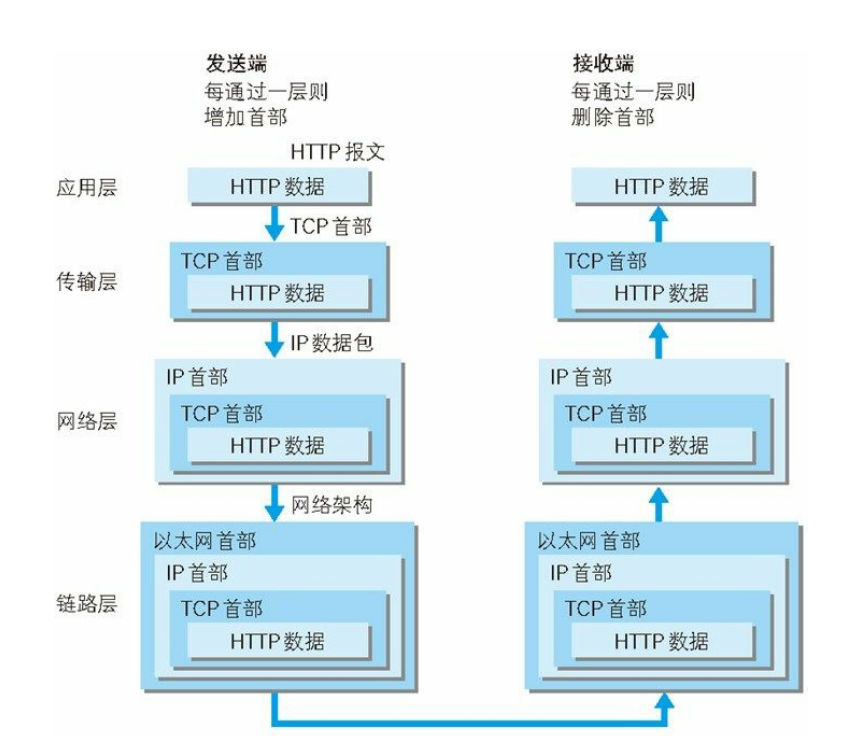

## OSI 七层协议

<table>
    <thead>
        <tr>
        	<th>OSI七层网络模型</th>
        	<th>TCP/IP四层概念模型</th>
        	<th>对应网络协议</th>
        </tr> 
    </thead>
    <tbody>
        <tr>
            <td>应用层（Application）</td> 
            <td rowspan = "3">应用层</td>
            <td>HTTP,SFTP,FTP,NFS,WAIS,SMTP</td>
        </tr>
        <tr>
            <td>表示层（Presentation）</td> 
            <td></td>
        </tr>
        <tr>
            <td>会话层（Session）</td> 
            <td></td>
        </tr>
        <tr>
            <td>传输层（Transport）</td>
            <td>传输层</td>
            <td>TCP, UDP</td>
        </tr>
        <tr>
            <td>网络层（Network）</td>
            <td>网络层</td>
            <td>IP, ICMP, ARP, RARP, AKP, UUCP</td>
        </tr>
        <tr>
            <td>数据链路层（Data Link）</td>
            <td rowspan = "2">数据链路层</td>
            <td>FDDI, Ethernet, Arpanet, PDN, SLIP, PPP</td>
        </tr>
        <tr>
            <td>物理层（Physical）</td>
            <td>IEEE 802.1A, IEEE 802.2到IEEE 802.11</td>
        </tr>
    </tbody>
</table>


## TCP/IP协议

### TCP连接的建立（三次握手）


- 首先，服务器端处于listen（监听）状态；

- 客户端向服务端发送连接请求报文：SYN=1（SYN表示建立连接）,seq=x;（seq为初始序号：客户端）

  此时，客户端进程进入了 SYN-SENT（同步已发送状态）状态

- 服务器端收到连接请求报文，如果同意建立连接，则向客户端发送连接确认报文：

  SYN=1（SYN表示建立连接），ACK=1（ACK表示响应），ack=x+1(响应接收到的请求,确认号为x+1)，同时也选择一个初始的序号seq=y（服务器初始序号）。

  此时，服务器进入了SYN-RCVD（同步收到）状态

- 客户端收到服务器端的连接确认报文后，还要向服务器发出确认，报文：

  SYN=1（SYN表示建立连接）ack=y+1（响应服务器请求），seq=x+1（客户端序号）。

  此时，TCP连接建立，客户端进入ESTABLISHED（已建立连接）状态。

- 服务器端收到客户端的确认后，连接建立。服务器收到确认，也进入ESTABLISHED状态

**第三次握手的原因**

如果没有第三次握手确认，可能会导致一个请求建立两个通信连接；因为TCP为了保证可靠有超时重发机制；

第三次握手是为了防止失效的连接请求发送到服务器，产生错误的请求

客户端发送的连接请求如果在网络中滞留，那么就会隔很长一段时间才能收到服务器端发回的连接确认。客户端等待一个超时重传时间之后，就会重新请求连接。但是这个滞留的连接请求最后还是会到达服务器，如果不进行三次握手，那么服务器就会打开两个连接。如果有第三次握手，客户端会忽略服务器之后发送的对滞留连接请求的连接确认，不进行第三次握手，因此就不会再次打开连接。

### TCP连接的释放（四次挥手）


- 客户端发送关闭请求；报文：FIN=1（FIN表示关闭连接），seq=u（初始序号：客户端）

  客户端进入FIN-WAIT-1（终止等待1）状态

- 服务端收到请求后响应，并发送确认报文：ACK=1（ACK表示响应）,ack=u+1（响应接收到的请求,确认号为u+1）,seq=v（服务器序号）,此时服务端不会立即关闭连接，而是进入CLOSE-WAIT（关闭等待）状态，必须等到任务处理完，此时连接处于半关闭状态，客户端无法发送数据，服务器发送数据，客户端依然要接收；（例如游乐园关门时，外面的人不允许进入，要等园内的游客全部出去才能正式关门，这种就是半关闭）

  客户端收到请求后进入FIN-WAIT-2（终止等待2）状态

- 当服务器任务处理完成，连接可以断开时，发送释放报文：FIN=1（FIN表示关闭连接），ACK=1（ACK表示响应），seq=w（服务器序号），ack=u+1（确认号）；

  服务器进入了LAST-ACK（最后确认）状态，等待客户端的确认

- 客户端收到服务器的连接释放报文后，必须发出确认报文：ACK=1，ack=w+1，而自己的序列号是seq=u+1，此时，客户端就进入了TIME-WAIT（时间等待）状态。注意此时TCP连接还没有释放，必须经过2MSL（最长报文段寿命）的时间后，客户端进入CLOSED状态。

  服务器收到请求后进入CLOSED状态。

**四次挥手的原因**

客户端发送FIN请求后，服务器收到这个报文然后响应，进入CLOSE-WAIT状态，进入这个状态是为了完成正在运行的任务，等待任务处理完（比如：客户端之前请求的数据还没发完），这时候不能关闭连接通道；然后服务器处理完任务后，发送通知到客户端，可以真正关闭连接

**为什么客户端最后还要等待2MSL**

- 确保最后一个报文被收到，如果服务器没有收到最后一个报文，由于超时重发，服务器会重新发送释放连接报文（第3次挥手），这个时间段客户端处于TIME-WAIT状态，可以做出回应，重置等待时间；
- 防止已经失效的连接，失效的连接在等待的时间段从网络中消失，保证失效的连接不会出现在下次的连接中


**为什么建立连接是三次握手，关闭连接确是四次挥手呢？**


**如果已经建立了连接，但是客户端突然出现故障了怎么办？**


### TCP 可靠传输
TCP如何保证可靠传输？

1. 三次握手
2. 应用数据被分割成 TCP 认为最适合发送的数据块。
3. TCP把每个包按顺序编号，接收端可以根据编号重新排序组合成正确的报文
4. TCP发送一个包后会启动一个定时器，等待收到回复确认报文，在一定时间内没有收到，会重新发送报文，防止丢包，这个是超时重传机制
5. TCP在接收到数据后，会延迟一点时间发送确认信息，通知发送端已收到，保证可靠性
6. 由于超时重传机制或者其他原因导致TCP收到重复的包，TCP会把重复的包丢弃
7. TCP将保持首部和数据的校验和，这是一个端到端的校验和，目的是检测数据在传输过程中的任何变化。如果收到的报文校验和有差错，TCP将丢弃该报文不发送确认，等待重发
8. TCP提供流量控制，在TCP连接的两端有固定大小的缓冲空间，接收端只允许发送端发送可以缓冲区能接纳的数据，防止较快主机使较慢主机的缓冲区溢出 
9. 拥塞控制。当网络拥塞时，减少数据的发送。

### TCP 滑动窗口
窗口是缓存的一部分，用来暂时存放字节流。发送方和接收方各有一个窗口，接收方通过TCP 报文段中的窗口字段告诉发送方自己的窗口大小，发送方根据这个值和其它信息设置自己的窗口大小。

TCP提供流量控制，在TCP连接的两端有固定大小的缓冲空间，窗口是缓存的一部分，用来暂时存放字节流，接收端会通过TCP报文通知发送端自己窗口的大小；

- 发送端在窗口内字节都允许被发送，当发送窗口左侧的数据已发送被收到接收端的确认时，窗口右移
- 接收端只能接收窗口内的字节数据，窗口外的数据将被丢弃


**服务器上TIME_WAIT状态的连接过多，怎么解决？**

在TCP连接关闭的过程中，被动关闭端（一般是服务端）能够关闭连接是，会发送连接释放报文到主动关闭端（客户端），然后主动关闭端进入TIME_WAIT状态，发送确认报文给被动关闭端，并等待两个报文周期，防止确认报文丢失，被动关闭端的重发机制

TIME_WAIT状态会出现在主动关闭TCP连接的一端，表明服务器主动关闭了连接，一般出现在服务端安全关闭的情况下（非kill），服务器TIME_WAIT状态的连接过多会导致网络端口被占用，在高并发情况下会使部分用户无法连接到服务器

**如何尽量处理TIMEWAIT过多?**

编辑内核文件/etc/sysctl.conf，加入以下内容：

```
net.ipv4.tcp_syncookies = 1 表示开启SYN Cookies。当出现SYN等待队列溢出时，启用cookies来处理，可防范少量SYN攻击，默认为0，表示关闭；
net.ipv4.tcp_tw_reuse = 1 表示开启重用。允许将TIME-WAIT sockets重新用于新的TCP连接，默认为0，表示关闭；
net.ipv4.tcp_tw_recycle = 1 表示开启TCP连接中TIME-WAIT sockets的快速回收，默认为0，表示关闭。
net.ipv4.tcp_fin_timeout 修改系默认的 TIMEOUT 时间
```

然后执行 /sbin/sysctl -p 让参数生效.

```
/etc/sysctl.conf是一个允许改变正在运行中的Linux系统的接口，它包含一些TCP/IP堆栈和虚拟内存系统的高级选项，修改内核参数永久生效。
```

简单来说，就是打开系统的TIMEWAIT重用和快速回收。

如果以上配置调优后性能还不理想，可继续修改一下配置：

```
vi /etc/sysctl.conf
net.ipv4.tcp_keepalive_time = 1200 
#表示当keepalive起用的时候，TCP发送keepalive消息的频度。缺省是2小时，改为20分钟。
net.ipv4.ip_local_port_range = 1024 65000 
#表示用于向外连接的端口范围。缺省情况下很小：32768到61000，改为1024到65000。
net.ipv4.tcp_max_syn_backlog = 8192 
#表示SYN队列的长度，默认为1024，加大队列长度为8192，可以容纳更多等待连接的网络连接数。
net.ipv4.tcp_max_tw_buckets = 5000 
#表示系统同时保持TIME_WAIT套接字的最大数量，如果超过这个数字，TIME_WAIT套接字将立刻被清除并打印警告信息。
默认为180000，改为5000。对于Apache、Nginx等服务器，上几行的参数可以很好地减少TIME_WAIT套接字数量，但是对于 Squid，效果却不大。此项参数可以控制TIME_WAIT套接字的最大数量，避免Squid服务器被大量的TIME_WAIT套接字拖死。
```


## HTTP协议




### http1.0和http1.1的区别


## HTTPS

http原来

- 使用非对称加密协商加密算法
- 使用对称加密方式传输数据
- 使用第三方机构签发的证书，来加密公钥，用于公钥的安全传输、防止被中间人篡改。

HTTPS 通信过程

1. 客户端通过发送Client Hello 报文开始SSL 通信。报文中包含客户端支持的SSL 的指定版本、加密组件（Cipher Suite）列表（所使用的加密算法及密钥长度等）。
2. 服务器可进行SSL 通信时，会以Server Hello 报文作为应答。和客户端一样，在报文中包含SSL 版本以及加密组件。服务器的加密组件内容是从接收到的客户端加密组件内筛选出来的。
3. 之后服务器发送Certificate 报文。报文中包含公开密钥证书。
4. 最后服务器发送Server Hello Done 报文通知客户端，最初阶段的SSL 握手协商部分结束。
5. SSL 第一次握手结束之后，客户端以Client Key Exchange 报文作为回应。报文中包含通信加密中使用的一种被称为Pre-master secret 的随机密码串。该报文已用步骤3 中的公开密钥进行加密。
6. 接着客户端继续发送Change Cipher Spec 报文。该报文会提示服务器，在此报文之后的通信会采用Pre-master secret 密钥加密。
7. 客户端发送Finished 报文。该报文包含连接至今全部报文的整体校验值。这次握手协商是否能够成功，要以服务器是否能够正确解密该报文作为判定标准。
8. 服务器同样发送Change Cipher Spec 报文。
9. 服务器同样发送Finished 报文。
10. 服务器和客户端的Finished 报文交换完毕之后，SSL 连接就算建立完成。当然，通信会受到SSL 的保护。从此处开始进行应用层协议的通信，即发送HTTP 请求。
11. 应用层协议通信，即发送HTTP 响应。
12. 最后由客户端断开连接。断开连接时，发送close_notify 报文。上图做了一些省略，这步之后再发送TCP FIN 报文来关闭与TCP的通信。

## Socket


## 参考资料

[http1.0和http1.1的区别](https://blog.csdn.net/xu_ya_fei/article/details/43698981)